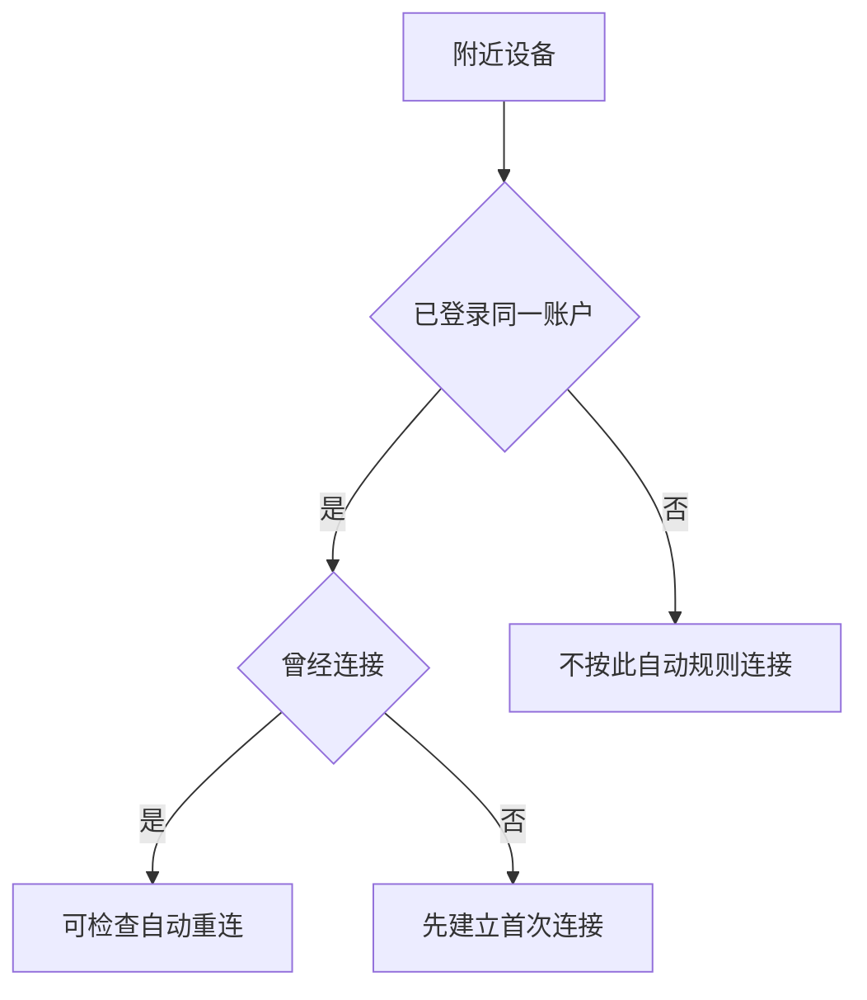

# 调整显示体验：分辨率、亮度、Night Shift 与高级连接

Displays 页面同时管理屏幕画面的清晰程度、明暗、色彩适应、刷新节奏和与附近设备的显示协作。它看上去像一组可随手调整的开关，实际有些项目会改变文字大小、窗口可用空间、视觉舒适度或多设备操作边界。学习这页时，先读清每个控件是“选择模式”“临时改变数值”还是“允许一项连接行为”，再决定是否需要修改。

> [!info] 本篇要掌握的界面判断
>
> - `resolution`、`brightness`、`refresh rate`、`preset` 分别控制显示体验的哪一层。
> - `automatically adjust`、`adapt` 和 `shift` 都有“自动变化”的意味，但触发条件和结果不同。
> - `Turn on until tomorrow` 是临时状态，不是永久计划。
> - `nearby Mac or iPad`、`previously connected` 和 `signed in` 共同限定跨设备功能的可用范围。

## 显示设置的四层：画面、环境、节奏和协作

把 Displays 页面拆成四层，比逐个背词更容易判断一项设置的影响。

| 层次 | 常见英文 | 它改变什么 | 不直接改变什么 |
| --- | --- | --- | --- |
| 画面布局 | `Resolution`, `Show resolutions as list` | 可用像素、文字和界面元素的视觉大小 | 文件内容或窗口是否保存 |
| 环境亮度与色彩 | `Brightness`, `Automatically adjust brightness`, `adapt display` | 屏幕明暗和色彩适应方式 | 网络连接或电池充电策略 |
| 刷新与显示模式 | `Refresh rate`, `Preset`, `secondary display` | 画面更新节奏、颜色表现、外接屏幕用途 | App 的后台运行状态 |
| 设备协作 | `nearby Mac or iPad`, `pointer and keyboard` | 指针、键盘能否跨附近设备使用 | 对方设备上的个人内容授权 |

例如，选择不同的 resolution 可能让窗口能放下更多内容，也可能让文字显得更小；调节 brightness 只改变亮度；选择 refresh rate 则涉及画面更新频率。三个动作都与屏幕有关，却不能互相替代。遇到“看不清”时，先说清是文字太小、画面太暗、颜色不舒服，还是动态画面不顺，再回到对应控件。

## 界面实例：分辨率、亮度与显示模式

> 本机截图未包含在公开版本中，以保护原图中的个人信息。

| 完整英文 | 软件语境中文 | 读法与边界 |
| --- | --- | --- |
| `Built-in Display` | 内建显示器。 | 指本机屏幕，是被选中的显示设备名称。 |
| `Resolution` | 分辨率。 | 选择画面尺寸和可用工作空间的模式。 |
| `Default` | 默认。 | 系统建议或默认的选项，不自动等于“最清晰”。 |
| `Brightness` | 亮度。 | 调整发光强度，而不是文字字号。 |
| `Automatically adjust brightness` | 自动调节亮度。 | 根据环境条件自动改变亮度。 |
| `make colors appear consistent in different ambient lighting conditions` | 让颜色在不同环境光线下看起来保持一致。 | 说明色彩适应的目标，而不是把颜色锁死。 |
| `Preset` | 预设。 | 一组显示特性或颜色表现的预定义模式。 |
| `Refresh rate` | 刷新率。 | 画面更新频率，常影响动态内容的流畅程度。 |
| `Choose what to show or use the TV as a secondary display.` | 选择显示内容，或将电视作为第二显示器。 | 面向外接显示设备的用途选择。 |
| `Advanced…` | 高级。 | 进入额外显示与跨设备选项。 |
| `Night Shift…` | 夜览。 | 进入夜间色温规则的独立弹窗。 |

这里出现的 `Built-in Display` 不是泛指“所有屏幕”，而是当前机器内置的显示器。若接入外接屏，页面可能出现多个设备选择项。学习时应把设备名和设置内容分开：选择的是哪块显示器，调整的是这块显示器的亮度、分辨率或色彩模式。

## 分辨率：默认、列表与可读性之间的关系

`Resolution` 说的是显示器用多少像素呈现画面。它不是文档的图片分辨率，也不是网络视频清晰度。系统可能把可选项写成具体尺寸，例如 `1728 × 1117 (Default)`；数字说明画面尺寸，`Default` 是系统把它标记为默认选择。

| 你看到的现象 | 优先检查 | 可用表达 | 不要先假设 |
| --- | --- | --- | --- |
| 文字和按钮显得太小 | Resolution、Text Size、显示缩放 | `The interface looks too small at this resolution.` | 显示器已经损坏 |
| 窗口容纳内容变少 | Resolution 或缩放布局 | `There is less workspace on the display.` | 文件被缩小或丢失 |
| 想逐项查看可选模式 | `Show resolutions as list` | `Show the available resolutions as a list.` | 这会立即改变当前分辨率 |
| 外接屏显示不完整 | 设备选择、用途、分辨率 | `I need to check the settings for the external display.` | 内建显示器设置一定适用 |

`Show resolutions as list` 的语法值得单独学习。`show A as B` 表示“将 A 以 B 的形式显示”。它控制的是界面怎样列出选项，而不是直接选中某个分辨率。相同结构还会出现在 `Use the TV as a secondary display`：把 TV 作为第二显示器使用，重点在 `as` 后的角色。

> [!warning] 更改分辨率前先留出恢复路径
>
> 分辨率变化可能让文字、按钮和窗口位置立刻改变。处理正在演示、远程协助或需要持续阅读的内容时，先记录当前选项；如果新画面不适合阅读，回到刚才记录的模式。不要把“默认”当成对每个人都最舒适的选项。

## 亮度与环境色彩：两个“自动”不做同一件事

页面中有两句容易混淆：`Automatically adjust brightness` 与 `Automatically adapt display to make colors appear consistent in different ambient lighting conditions.` 它们都包含 automatically，却关注不同结果。

| 表达 | 自动依据 | 直接目标 | 更自然的中文理解 |
| --- | --- | --- | --- |
| `Automatically adjust brightness` | 环境亮度等条件 | 让屏幕变亮或变暗 | 自动调节屏幕亮度 |
| `adapt display` | 周围环境光线颜色 | 让颜色看起来更一致 | 自适应显示色彩 |
| `make colors appear consistent` | 不同 ambient lighting conditions | 保持主观色彩观感 | 让不同光线下看起来颜色相近 |
| `Brightness` slider | 用户手动拖动 | 当前亮度值 | 直接调亮或调暗 |

`ambient` 是“周围环境的”，`lighting conditions` 是“光照条件”。句子没有承诺屏幕颜色在物理上完全不变；它用 `appear consistent` 表示“看起来一致”。软件说明里 `appear` 经常用于视觉结果，不能机械翻成“出现”。

如果你只想描述阅读环境，可以说：`The display is too bright in this room, so I am checking the brightness setting.` 如果你关心颜色在不同灯光下看起来不一样，可以说：`I am checking whether the display adapts to the ambient lighting conditions.` 两句话分别指向亮度与色彩适应，后续更容易找到正确设置。

## 刷新率与预设：动态体验和色彩模式分开说明

`Refresh rate` 是显示器每秒更新画面的频率。显示页中的 `ProMotion` 是一个当前可见的值，表示系统采用的动态刷新模式；它不等于网络下载速度，也不等于视频文件的帧率。`Preset` 则是一组预先定义的显示特性，界面中显示为 `Apple XDR Display (P3-1600 nits)` 时，应先把它当作当前预设标签，不要在不了解硬件和工作需求时随意更换。

| 名词 | 回答的问题 | 适合怎样报告 |
| --- | --- | --- |
| `Refresh rate` | 画面以什么节奏刷新？ | `The refresh rate is set to the current display mode.` |
| `ProMotion` | 当前是否采用动态刷新模式？ | `The display is using ProMotion.` |
| `Preset` | 当前使用哪组显示特性？ | `I checked the active display preset.` |
| `P3-1600 nits` | 预设标签中的颜色空间和亮度能力信息 | `This is the name of the selected preset, not a brightness slider value.` |

你可以把 refresh 理解为“重画画面”，把 preset 理解为“选一组显示规则”。当视频滚动或动画感觉不顺，可能需要了解 refresh rate；当色彩校对、照片或视频工作出现疑问，才需要进一步了解 preset。两者属于显示体验的不同层，不要只因都在 Displays 页面就一起修改。

## Night Shift：夜间色温、计划和临时开启

> 本机截图未包含在公开版本中，以保护原图中的个人信息。

Night Shift 的说明句完整解释了它做什么：`Night Shift automatically shifts the colors of your display to the warmer end of the color spectrum after dark.` 句子的核心动词是 `shifts`，宾语是 `the colors of your display`；`to the warmer end` 说明方向；`after dark` 说明典型的时间条件。

| 完整英文 | 软件语境中文 | 重点 |
| --- | --- | --- |
| `Schedule` | 计划。 | 设定何时按规则运行。 |
| `Off` | 关闭。 | 当前没有启用计划值，不代表无法临时开启。 |
| `Turn on until tomorrow` | 开启到明天。 | 临时运行到时间边界，不是长期计划。 |
| `Warmer` | 更暖。 | 让色彩往暖色端移动。 |
| `may affect the appearance of some onscreen motion` | 可能影响部分屏幕动态内容的外观。 | `may affect` 是可能影响，非必然故障。 |
| `This may help you get a better night’s sleep.` | 这可能有助于更好的夜间睡眠。 | 是说明性的可能收益，不是医学保证。 |

`until tomorrow` 常用于临时有效期：从现在开始，到明天为止。它和 `every day`、`on a schedule` 不同。若你只想当晚减弱冷色调，可以检查 `Turn on until tomorrow`；若希望长期在固定时段运行，才需要查看 `Schedule`。

> [!note] 色彩“更暖”会影响什么
>
> Night Shift 改变的是画面色温观感。阅读文字时它可能更舒适；核对照片、视频、设计稿或需要准确颜色的工作时，应先意识到暖色偏移。先说明任务目的，再决定是否临时开启，避免把正常的色彩变化误判为显示器异常。

## 高级连接：附近设备、已登录和曾连接过是三道条件

> 本机截图未包含在公开版本中，以保护原图中的个人信息。

Advanced 弹窗中出现 `Link to Mac or iPad`。它不是任意网络远程控制工具，而是围绕附近、已登录和曾连接设备的协作选项。要完整理解这些句子，需要把限制条件读出来。

| 完整英文 | 条件 | 系统实际允许的行为 |
| --- | --- | --- |
| `Your pointer and keyboard can be used on any nearby Mac or iPad signed in to your iCloud account.` | `nearby` 且 `signed in to your iCloud account` | 指针和键盘可跨符合条件的设备使用。 |
| `Allow the pointer to connect … by pushing against the edge of a display.` | 拖到显示器边缘 | 允许以边缘推动动作发起连接。 |
| `Allow this Mac to automatically reconnect to any nearby Mac or iPad you’ve previously connected to.` | `nearby` 且 `previously connected` | 允许自动重新连接曾连过的设备。 |
| `Show resolutions as list` | 无额外设备条件 | 只改变分辨率选项的呈现方式。 |

第一句的 `signed in to your iCloud account` 修饰 nearby Mac or iPad，意思是附近设备还必须登录到你的 iCloud 账户。第二句的 `by pushing against the edge of a display` 说明连接手势：将指针推到显示器边缘。第三句的 `previously connected to` 是过去分词短语，限定的是以前已经连接过的设备。

这张关系图说明自动重新连接不是只要设备在附近就发生。账号条件、先前连接记录和当前开关共同决定结果。它也不代表设备文件会自动公开；指针键盘协作、文件共享、屏幕共享和账户权限仍是不同设置领域。

## 两个完整操作案例

### 案例一：只读检查夜间显示规则

1. 打开 **System Settings → Displays → Night Shift…**。
2. 读出 `Schedule` 的当前值，并区分计划状态和 `Turn on until tomorrow` 的临时状态。
3. 观察 Warmer 滑块的方向，不拖动它。
4. 读出 `may affect the appearance of some onscreen motion`，说明它是可能影响动态画面观感的提示。
5. 用英语报告：`I reviewed the Night Shift schedule and its temporary option. I did not change the color temperature of the display.`

### 案例二：确认跨设备指针功能的条件

1. 打开 **System Settings → Displays → Advanced…**。
2. 找到 `Link to Mac or iPad` 分组。
3. 分别指出 nearby、signed in、previously connected 三个限定条件。
4. 不开启自动重连，不把指针推向另一台设备，也不切换任何网络。
5. 用英语说明：`I checked the conditions for using the pointer and keyboard with a nearby device, but I did not connect to another Mac or iPad.`

## 常见错误与恢复方式

| 错误 | 为什么会出错 | 恢复或更好的判断 |
| --- | --- | --- |
| 把分辨率当成亮度 | 两项都会影响“看起来舒不舒服” | 先问是大小问题还是明暗问题 |
| 夜间色调变化就以为显示器损坏 | Night Shift 会把颜色移向 warmer end | 检查 Schedule 和 Turn on until tomorrow |
| 以为附近设备就能自动连接 | 还受账户、先前连接和开关限制 | 逐个核对 nearby、signed in、previously connected |
| 看到 ProMotion 就更改 Refresh rate | 动态刷新模式本身可能适合当前设备 | 先确认自己要解决的是哪类动态显示问题 |
| 直接改高分辨率解决空间不足 | 文字可能变小，阅读体验可能更差 | 记录原设置，确认可读性后再保留 |

## 英语表达规律：条件在句尾，影响用 may 保留边界

Displays 页面常把主要动作放在句首，把条件和影响放在后面。掌握这种排列，既能读懂长句，也能写出谨慎的操作说明。

| 结构 | 例句 | 作用 |
| --- | --- | --- |
| `automatically + verb + after …` | `Night Shift automatically shifts colors after dark.` | 自动动作及时间条件。 |
| `make + object + appear + adjective` | `make colors appear consistent` | 描述“看起来”的效果，不做绝对断言。 |
| `Allow + object + to + verb` | `Allow the pointer to connect…` | 表示是否允许某对象执行动作。 |
| `while + -ing` | `while dragging windows` | 表示操作正在进行时附加的条件。 |
| `may affect + noun` | `may affect the appearance…` | 说明可能影响，保留不确定性。 |

当你不确定某个显示选项会不会影响当前任务时，用 `may affect` 比 `will break` 更准确：`This setting may affect the appearance of motion on screen, so I will check it before changing the preset.` 这句话既说明了风险，也说明下一步是检查而非贸然修改。

## 自测

1. Resolution、Brightness 和 Refresh rate 各自控制什么？
2. `Automatically adjust brightness` 与 `adapt display` 为什么不能互相替换？
3. `Turn on until tomorrow` 与 Schedule 的时间范围有什么不同？
4. 一个附近设备要符合哪些条件，才可能适用自动重新连接规则？
5. 用英语说出“我检查了显示器的高级连接条件，但没有连接另一台设备”。

查看参考答案

1. Resolution 管画面尺寸和可用空间，Brightness 管明暗，Refresh rate 管画面更新节奏。
2. 前者自动调节亮度，后者使颜色在不同环境光线下看起来更一致，目标不同。
3. Turn on until tomorrow 是临时运行到明天；Schedule 是长期的时间规则。
4. 设备需要在附近、登录到同一 iCloud 账户，并且在自动重连场景下曾经连接过。
5. `I checked the advanced connection conditions for the display, but I did not connect to another device.`

## 版本与来源

- 本机界面事实：macOS 27.0 Beta (26A5425a)，采集日期 2026-09-09。
- 功能原理参考：[Change Displays settings on Mac](https://support.apple.com/guide/mac-help/change-displays-settings-mchlfdf89c72/mac)、[Use Night Shift on Mac](https://support.apple.com/guide/mac-help/use-night-shift-mchl97bc676d/mac) 与 [Use a keyboard and mouse with Mac and iPad](https://support.apple.com/guide/mac-help/use-a-keyboard-and-mouse-with-mac-and-ipad-mchl4f947f1c/mac)。
- 外接屏、刷新模式、预设与附近设备能否出现，取决于本机硬件、连接状态和账户状态。本文将当前采集界面作为学习原文，不把它写成每台 Mac 都必然拥有的选项。
