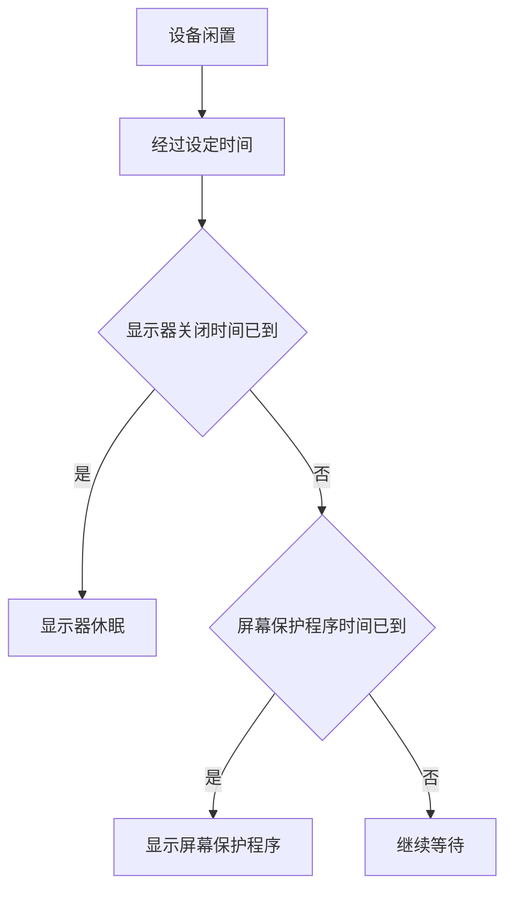

# 管理视觉环境：墙纸、屏幕保护程序与锁屏时钟

Wallpaper 页面管理桌面外观、屏幕保护程序和锁屏时钟的视觉样式。它让屏幕“看起来怎样”，但它不负责设备闲置多久后要求密码，也不授予照片或账户权限。最容易出错的地方，是把墙纸、屏幕保护程序和 Lock Screen 的安全规则当成同一件事。本篇将这三条路径分开，并通过完整界面表达学习选择、显示、下载、随机切换和时间条件。

> [!info] 先记住三条边界
>
> - `Wallpaper` 改的是桌面外观；`Screen Saver` 是闲置时显示的视觉内容。
> - `Show on all Spaces` 管一张墙纸在多少个工作空间显示；它不创建或删除 Space。
> - `Clock Appearance` 只管理大时钟样式；设备锁定、显示器关闭和密码要求要到 Lock Screen 页面单独检查。

## 一张图、一段待机画面、一个锁屏状态不是同一对象

| 对象 | 常见英文 | 何时出现 | 它控制什么 |
| --- | --- | --- | --- |
| 墙纸 | `Wallpaper`, `Desktop`, `Selected Desktop` | 正常使用桌面时 | 桌面背景和可见的视觉主题 |
| 屏幕保护程序 | `Screen Saver`, `Use Screen Saver` | 闲置满足时间规则后 | 临时播放的视觉内容或动画 |
| 锁屏 | `Lock Screen`, `Show message when locked` | 设备进入锁定状态时 | 账户进入前的显示与安全相关选项 |
| 大时钟 | `Show large clock`, `Clock Appearance` | 选择的锁屏或空间状态中 | 时钟是否显示、字形和粗细 |

`screen saver` 不是 `lock screen` 的同义词。屏幕保护程序可在锁定前、锁定后或特定待机条件下出现，系统还可能提示 `Display will sleep before screen saver starts.` 这句警告说明显示器关闭时间可能早于屏幕保护程序触发时间。若要排查“我从没看到屏幕保护程序”，不能只换一张动画，还要检查闲置计时与显示器关闭规则。

## 界面实例：墙纸来源、分类与所有空间显示

> 本机截图未包含在公开版本中，以保护原图中的个人信息。

图中原始画面可能含有本机照片缩略图或其他动态内容；这些内容不写入正文、搜索、词汇表或练习。下面只保留稳定的系统分类和功能表达。

| 完整英文 | 软件语境中文 | 关键理解 |
| --- | --- | --- |
| `Selected Desktop` | 当前选中的桌面墙纸。 | 指当前被选作桌面的视觉内容。 |
| `Show on all Spaces` | 在所有工作空间中显示。 | 同一视觉主题是否跨所有 Space 使用。 |
| `Screen Saver…` | 屏幕保护程序。 | 打开单独的待机视觉设置。 |
| `Clock Appearance…` | 时钟外观。 | 打开大时钟样式选项。 |
| `Dynamic Wallpapers` | 动态墙纸。 | 会随时间或状态变化的墙纸类别。 |
| `Your Photos` | 你的照片。 | 本机个人内容入口，不应写入学习索引。 |
| `Landscape` | 风景。 | 按视觉主题组织的系统资源类别。 |
| `Cityscape` | 城市景观。 | 与 Landscape 并列的类别，不是显示模式。 |
| `Shuffle Aerials` | 随机播放航拍画面。 | 从指定范围轮换动态画面。 |
| `Colors` | 颜色。 | 纯色或颜色主题资源入口。 |

`Show on all Spaces` 中的 `all` 表示范围覆盖，`Spaces` 是多个桌面工作区。若开关打开，系统把当前视觉选择应用到每个 Space；若关闭，不等于其他 Space 没有墙纸，而是允许它们使用不同选择。可以用这句说明你的目的：`I want the same wallpaper to appear on all Spaces.`

## 墙纸分类：名称、来源和下载状态要分开读

Wallpaper 页面会以 `Dynamic Wallpapers`、`Landscape`、`Cityscape`、`Underwater`、`Earth`、`Mac`、`Pictures`、`Colors` 等标题组织资源。标题回答的是“这组墙纸呈现什么主题”，不是“这张资源是否已经保存到本机”。部分资源旁的下载状态或远程标记说明它可能需要获取后才能使用，这和墙纸分类是两条信息。

| 你需要判断的事情 | 应看什么 | 不要把它误读成 |
| --- | --- | --- |
| 墙纸是什么视觉主题 | 分类标题，如 Landscape、Earth | 当前是否已经应用 |
| 资源是否需要下载 | 资源旁的远程或下载状态 | 你的网络一定有问题 |
| 当前桌面正在使用什么 | `Selected Desktop` 区域 | 同类所有资源都已下载 |
| 能否从照片中选取 | `Your Photos` 或添加照片入口 | 系统把个人照片公开给学习库 |
| 是否自动轮换 | `Shuffle Aerials` 的具体选择 | 任何动态墙纸都会随机切换 |

`Dynamic` 意味着画面可能随时间、环境或资源本身的规则变化；`Shuffle` 意味着系统从选定范围中轮换选择。两者都可能让背景发生变化，但机制不同。想表达“我选了会变化的墙纸”可以说 `I selected a dynamic wallpaper.`；想表达“系统会从一组航拍画面里轮换”则说 `The system shuffles aerial wallpapers from the selected category.`

> [!note] 本机照片属于个人界面数据
>
> `Your Photos` 是系统提供的功能入口，但具体照片名称、缩略图和相册内容不属于软件英语正文。学习时只需要掌握 `Add Photo…`、`Your Photos` 和 `Selected Desktop` 的功能含义，不需要把个人图像或文件名记为英语词汇。

## 动态、随机与类别选择：三个动词的方向不同

| 表达 | 动作发起者 | 发生的事情 | 一个自然例句 |
| --- | --- | --- | --- |
| `select a wallpaper` | 用户 | 选定某张墙纸作为当前视觉内容 | `I selected a landscape wallpaper.` |
| `show on all Spaces` | 系统按用户开关执行 | 把当前选择应用到多个 Space | `The wallpaper is shown on all Spaces.` |
| `shuffle aerials` | 系统 | 在一个类别或范围内轮换资源 | `Aerial wallpapers are shuffled automatically.` |
| `download a wallpaper` | 系统或用户发起获取 | 让远程资源可被使用 | `The wallpaper needs to be downloaded first.` |

被动语态 `is shown` 和 `are shuffled` 常出现在设置描述中。它们把重点放在“结果如何呈现”，而不是“谁点击了什么”。如果你要报告设置效果，可以说：`The selected wallpaper is shown on all Spaces, but the screen saver uses a separate choice.` 这一句顺带把墙纸与屏幕保护程序的选择分开。

## 屏幕保护程序：自动、手动选择与时间警告

> 本机截图未包含在公开版本中，以保护原图中的个人信息。

屏幕保护程序弹窗的关键不在于资源名称，而在于顶部的时间与模式。`Use Screen Saver` 下方可出现 `Automatic` 与 `Custom`；前者让系统按规则处理选择，后者意味着使用你指定的内容。时间提示里常见 `After 20 minutes`，其中 `after` 把“闲置多久”作为触发条件。

| 完整英文 | 软件语境中文 | 读法 |
| --- | --- | --- |
| `Use Screen Saver` | 使用屏幕保护程序。 | 管是否以及以何种方式使用待机视觉内容。 |
| `Automatic` | 自动。 | 系统按自动选择规则处理。 |
| `Custom` | 自定义。 | 用户指定特定资源或方式。 |
| `After 20 minutes` | 20 分钟后。 | 闲置达到该时长后的触发规则。 |
| `Display will sleep before screen saver starts.` | 显示器会在屏幕保护程序开始前休眠。 | 两个定时规则的顺序提示。 |
| `You can manage the timing in Lock Screen Settings.` | 可以在锁屏设置中管理时序。 | 明确告诉你应跳到哪个页面调整时间。 |
| `Show All` | 显示全部。 | 展开某一资源类别的完整列表。 |
| `Done` | 完成。 | 结束此弹窗中的编辑或选择。 |

`before screen saver starts` 是时间顺序：显示器先休眠，屏幕保护程序后开始。若前一个条件更早满足，后一个视觉结果就可能看不到。这是软件说明里非常常见的因果链，不是报错。正确说法是：`The display may sleep before the screen saver starts, so I need to compare the two timing settings.`

这个流程图不表示每台 Mac 都按相同分钟数运行；具体值由 Lock Screen 和 Screen Saver 页面决定。它要说明的是顺序：显示器关闭与开始屏幕保护程序是可独立设置的两个计时点。因而调整墙纸资源不能解决“屏幕保护程序没有显示”的时间配置问题。

## 锁屏时钟：显示位置、字形与粗细不是安全策略

> 本机截图未包含在公开版本中，以保护原图中的个人信息。

`Clock Appearance…` 打开的面板包含 `Show large clock`、样式按钮和 `Weight` 滑块。`On Lock Screen` 表示大时钟显示在锁屏界面；它描述显示位置，不是“系统因此锁住设备”的触发条件。样式名只表示字形方案，Weight 表示字体线条的视觉粗细。

| 完整英文 | 软件语境中文 | 常见误解 |
| --- | --- | --- |
| `Show large clock` | 显示大时钟。 | 不是设置锁屏等待时间。 |
| `On Lock Screen` | 在锁屏上。 | 不是让设备立即锁定。 |
| `Soft`, `Rounded`, `Stencil` | 不同的时钟字形风格。 | 不是安全等级或主题分类。 |
| `Weight` | 字重、线条粗细。 | 不是时钟大小，也不是亮度。 |
| `Clock Appearance…` | 时钟外观。 | 不是设置密码或登录窗口内容。 |

当你只想让时钟更容易读，关注 `Weight` 和字形即可。如果问题是“机器多久后关闭显示器”或“锁定后是否立刻需要密码”，应离开 Wallpaper 页面进入 Lock Screen。把这条路径说清楚很重要：`Clock Appearance changes the look of the clock; Lock Screen settings control the inactivity and security rules.`

> [!warning] 外观设置与安全设置分开恢复
>
> 修改墙纸、时钟字形或屏幕保护程序不会替代 Lock Screen 的密码要求。若设备安全规则出现异常，先在 Lock Screen 中检查 inactivity、display off 和 password-related 项目；不要在 Wallpaper 中反复更改视觉资源来排查安全问题。

## 两个完整操作案例

### 案例一：统一多个 Space 的桌面外观，但不修改任何资源

1. 打开 **System Settings → Wallpaper**。
2. 在 Selected Desktop 区域找到 `Show on all Spaces`。
3. 用完整句说明该开关控制“当前墙纸是否跨多个 Space 显示”。
4. 不点击墙纸缩略图，不打开个人照片入口，也不切换开关。
5. 用英语报告：`I checked whether the selected wallpaper can be shown on all Spaces. I did not change the wallpaper or any personal photo.`

### 案例二：排查屏幕保护程序未出现的时间原因

1. 从 **Wallpaper → Screen Saver…** 打开弹窗。
2. 读取 `After … minutes` 的当前时间规则与警告句。
3. 解释为什么 `Display will sleep before screen saver starts` 会导致看不到屏幕保护程序。
4. 不改变 Automatic、Custom 或任何资源选择。
5. 用英语说明：`I reviewed the screen saver timing. The display may sleep before the screen saver starts, so I need to check Lock Screen settings separately.`

## 常见错误与恢复方式

| 错误 | 为什么会出错 | 更好的判断或恢复 |
| --- | --- | --- |
| 把墙纸换掉后等待屏幕保护程序出现 | 墙纸和屏幕保护程序是独立选择 | 到 Screen Saver 检查模式与时间 |
| 看到屏幕变黑就认为屏幕保护程序坏了 | Display sleep 可能先发生 | 对比两个等待时间 |
| 把 Show on all Spaces 当成同步所有窗口 | 它只应用视觉背景 | 用于统一外观，不管理窗口布局 |
| 把大时钟样式当成锁屏安全设置 | Clock Appearance 只改显示外观 | 到 Lock Screen 检查密码和闲置规则 |
| 为了练习点击个人照片入口 | 会接触私人内容，不利于学习库隔离 | 只学习稳定系统术语，不录入个人名称 |

## 英语表达规律：时间、范围和“分别管理”

Wallpaper 相关说明常用时间介词和范围词来限定效果。读句子时，先找主动作，再找它发生的时间、范围和条件。

| 结构 | 界面例句 | 它补充的信息 |
| --- | --- | --- |
| `after + 时间` | `After 20 minutes` | 触发在多久之后。 |
| `before + 从句` | `before screen saver starts` | 哪个事件更早发生。 |
| `on all + 名词复数` | `Show on all Spaces` | 作用覆盖的范围。 |
| `from + 类别` | `shuffle aerials from the selected category` | 随机选择的来源范围。 |
| `separately` | `check Lock Screen settings separately` | 两个相近功能需要分开检查。 |

想表达“我只改了外观，没有改安全规则”时，可使用：`I changed only the visual appearance. I did not change the lock screen or password settings.` 这两个并列的短句能够准确限制操作范围，也便于之后确认恢复。

## 自测

1. Wallpaper、Screen Saver 和 Lock Screen 分别负责哪一层功能？
2. `Show on all Spaces` 会影响窗口布局吗？为什么？
3. `Display will sleep before screen saver starts` 说明了哪两个计时规则的关系？
4. `On Lock Screen` 在大时钟选项中表示什么？
5. 用英语说出“我检查了屏幕保护程序的等待时间，但没有更改任何墙纸或锁屏安全设置”。

查看参考答案

1. Wallpaper 管桌面背景，Screen Saver 管闲置时的视觉内容，Lock Screen 管锁定状态和相关安全显示规则。
2. 不会。它只决定当前墙纸是否在所有 Space 显示，不管理窗口怎样排列。
3. 显示器关闭可能早于屏幕保护程序开始，因此需要比较两个等待时间。
4. 表示大时钟会显示在锁屏界面，不表示立即锁定设备。
5. `I checked the screen saver timing, but I did not change any wallpaper or lock screen security setting.`

## 版本与来源

- 本机界面事实：macOS 27.0 Beta (26A5425a)，采集日期 2026-09-09。
- 功能原理参考：[Change Wallpaper settings on Mac](https://support.apple.com/guide/mac-help/change-wallpaper-settings-mchlp1206/mac)、[Use a screen saver on Mac](https://support.apple.com/guide/mac-help/use-a-screen-saver-mchlp1225/mac) 与 [Change Lock Screen settings on Mac](https://support.apple.com/guide/mac-help/change-lock-screen-settings-mchl8b6a34e6/mac)。
- 墙纸资源、下载状态、可用的时钟字形与屏幕保护程序条目会因版本、联网状态和硬件不同而变化。本文只基于本机实际采集界面解释稳定的术语、时间条件和恢复路径。
