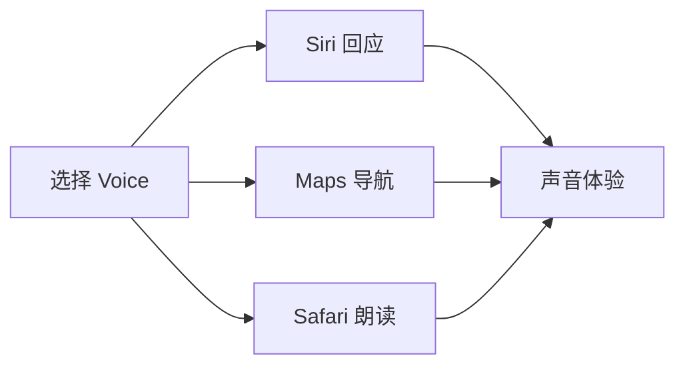

# Spotlight 搜索与 Siri 设置：结果、建议、语音与隐私

Spotlight 与 Siri 都能帮助你找到信息或完成操作，但它们收集、展示和回应信息的路径不同。Spotlight 是搜索入口：它可以显示本机文件、App 内容、系统项目和相关建议；Siri 是语音或文字请求的助手：它有语言、声音、回应显示和请求触发方式。学习这一组页面时，最重要的是区分“结果能否显示”“系统是否允许某类建议”“你是否同意改进数据处理”“语音以什么方式回应”。

> [!info] 本篇的四个判断
>
> - `Results from Apps` 和 `Results from System` 是搜索结果来源范围，不是对应 App 的权限总开关。
> - `Show Related Content` 与 `Help Apple Improve Search` 分别对应相关建议显示和改进搜索的信息处理，不是同一项授权。
> - `Results from Clipboard` 可能使复制过的内容出现在搜索中，应该单独判断隐私影响。
> - Siri 的 `Language`、`Voice`、`Requests` 和 `Responses` 分别控制理解语言、发声、触发方式和回复呈现。

## 先分清搜索、建议、历史和语音请求

| 概念 | 页面英文 | 主要对象 | 一个容易混淆的对象 |
| --- | --- | --- | --- |
| 本机搜索 | `Spotlight` | 文件、App、系统项目等搜索结果 | Siri 的语音回应 |
| 相关内容 | `Show Related Content` | 搜索或查找时的合作伙伴内容建议 | 本机文件索引本身 |
| 搜索历史 | `Spotlight Search History` | 过去的搜索记录 | 剪贴板历史 |
| 剪贴板结果 | `Results from Clipboard` | 已复制项目是否可被搜索显示 | 当前打开文档的内容 |
| Siri 请求 | `Requests` | 怎样唤起或开始请求 | Siri 用什么声音说话 |
| Siri 回应 | `Responses` | 语音、字幕和请求文本怎样显示 | Spotlight 的搜索结果排序 |

如果你说“我不想让某个项目出现在搜索里”，必须先确认是哪一种项目：App 内容、系统文件、剪贴板、搜索历史，还是互联网建议。五种来源的恢复路径不同。一个准确的报告可以是：`I want to limit results from the clipboard, not disable Spotlight completely.`

## 界面实例：Spotlight 的结果来源和隐私边界

> 本机截图未包含在公开版本中，以保护原图中的个人信息。

| 完整英文 | 软件语境中文 | 应如何理解 |
| --- | --- | --- |
| `Spotlight helps you quickly find things on your computer` | Spotlight 帮助你快速找到电脑上的内容。 | 描述本机检索的核心用途。 |
| `shows suggestions from the Internet … and locations nearby` | 显示来自互联网、音乐、App Store、附近地点等建议。 | 说明可能有建议来源，不代表所有搜索都发往互联网。 |
| `Show Related Content` | 显示相关内容。 | 管搜索或查找时是否展示合作伙伴内容。 |
| `Reset Quick Keys…` | 重置快速键。 | 将 Spotlight 快速键恢复为默认设置。 |
| `Delete Search History…` | 删除搜索历史。 | 清除历史记录，不等于删除本机文件。 |
| `Help Apple Improve Search` | 帮助 Apple 改进搜索。 | 单独的信息处理与改进选项。 |
| `Results from Apps` | 来自 App 的结果。 | 允许 App 内容出现在 Spotlight。 |
| `Results from System` | 来自系统的结果。 | 允许系统项目和内容出现在 Spotlight。 |
| `Results from Clipboard` | 来自剪贴板的结果。 | 已复制内容可能作为搜索结果显示。 |
| `Search Privacy…` | 搜索隐私。 | 进入更细的搜索隐私设置。 |

`find things on your computer` 的范围是电脑上的项目，不等于只找文件名。App 可能提供自身可搜索的内容；系统项目也可能显示。接下来的开关决定哪些类别允许出现在结果中，而不是替代 App 原本的权限设置。

## 结果来源：关闭显示不等于删除内容或撤销所有权限

`Results from Apps` 的说明是 `Allows content from app to appear in Spotlight.` 其中 `allows` 表示允许，`content from app` 表示来自 App 的内容，`appear in Spotlight` 表示在 Spotlight 中出现。`Results from System` 同理，决定系统项目和内容是否在 Spotlight 中显示。

| 你做的事 | 直接结果 | 不会自动发生的事 |
| --- | --- | --- |
| 关闭某个 App 的 Spotlight 结果 | 该 App 内容不再作为这类 Spotlight 结果显示 | 卸载该 App 或删除 App 数据 |
| 关闭 Files 或 Folders 的系统结果 | 相应系统类别不在 Spotlight 结果中显示 | 删除文件夹、阻止 Finder 使用 |
| 打开某类结果 | Spotlight 可以显示这类内容 | 把所有内容公开给其他用户 |
| 调整菜单项或 App 结果 | 改变搜索可见性 | 改变摄像头、照片、麦克风权限 |

当你觉得某个 App 的内容“不该被搜索到”，先问清是想停止 Spotlight 显示，还是想撤销 App 对数据本身的访问。前者从 Spotlight 的结果来源开关入手；后者应到 Privacy & Security 找对应权限。可以这样说明区别：`This option controls whether the app’s content appears in Spotlight. It does not replace the app’s privacy permissions.`

## 相关内容与改进搜索：两个“允许”必须分别决定

`Show Related Content` 的说明提到允许 Apple 合作伙伴内容在搜索、查找文本、对象或照片时显示。`Help Apple Improve Search` 的说明则提到 Safari、Siri、Spotlight、Lookup 和图像搜索查询可能被存储，并以不识别你的方式用于改善搜索结果。两者都和搜索有关，但一个是**结果展示**，另一个是**改进搜索的信息处理**。

| 选项 | 先问的问题 | 它影响什么 | 不该据此推断什么 |
| --- | --- | --- | --- |
| `Show Related Content` | 搜索时要不要显示相关建议？ | 建议内容是否出现 | 本机文件是否被删除或停止索引 |
| `Help Apple Improve Search` | 是否同意用于改进的搜索信息处理？ | 改进搜索的相关数据处理 | 是否立刻显示更多建议 |
| `Search Privacy…` | 哪些位置、类别或内容要排除？ | 更细的搜索隐私范围 | Siri 语言或声音设置 |
| `Delete Search History…` | 是否清除旧的搜索历史？ | 历史记录 | 当前搜索结果来源开关 |

`in a way that does not identify you` 的语法重点在方式，而不是“绝对没有任何处理”。它说明收集的信息以不识别个人的方式保存并用于改善结果。遇到这类隐私说明，学习时不要替系统作超出原文的保证；准确复述范围即可：`The page says the collected information is stored in a way that does not identify you and is used to improve search results.`

> [!warning] 不要为了测试而搜索或复制私人内容
>
> `Results from Clipboard` 明确提醒个人和敏感信息可能出现在搜索结果中。学习功能时可以阅读这个说明和开关状态，不需要复制账户、密码、地址、验证码或私人文本来验证。测试可见性不应以制造敏感数据为代价。

## 剪贴板历史：显示范围、保存时长与清除动作

`Results from Clipboard` 同时涉及可见性、时间和清除动作。开关控制 Spotlight 是否搜索并显示复制过的项目；`Clipboard history is available in Spotlight` 说明可以从 Spotlight 访问历史；时长选项如 `8 hours` 表示历史保留的时间范围；`Clear Clipboard History` 则是主动清除。

| 表达 | 它描述的动作或状态 | 英语使用重点 |
| --- | --- | --- |
| `Allow Spotlight to search and display items you’ve copied to your clipboard.` | 允许搜索并显示已复制内容。 | `you’ve copied` 是现在完成时，强调过去复制且当前仍相关。 |
| `Personal and sensitive information may appear in search results.` | 个人或敏感信息可能出现在结果中。 | `may appear` 是可能性提醒，不必然发生。 |
| `Clipboard history is available in Spotlight.` | 剪贴板历史可在 Spotlight 中使用。 | `available` 是可用，不等于永远显示在屏幕上。 |
| `Clear Clipboard History` | 清除剪贴板历史。 | 是明确的删除动作，应先确认范围。 |

若你要暂时减少泄露风险，优先确定是在控制“结果可见性”、缩短“保留时长”，还是做“清除历史”。三者的影响不同。一个清晰的操作报告是：`I turned off clipboard results so copied items do not appear in Spotlight. I did not change my app search categories.`

## Siri 的基础页：助手功能、语言匹配与本机处理

> 本机截图未包含在公开版本中，以保护原图中的个人信息。

Siri 页面写着：`Siri is an intelligent assistant that helps you find information and get things done.` 这句将 Siri 定义为协助查找信息和完成事情的助手。页面还显示 Requests、Language、Voice 和 Responses 四个入口，它们应按功能区分。

| 完整英文 | 软件语境中文 | 关键边界 |
| --- | --- | --- |
| `Requests` | 请求。 | 管怎样开始或触发 Siri 请求。 |
| `Language` | 语言。 | 管 Siri 识别和交互所用的语言。 |
| `Voice` | 语音。 | 管 Siri、导航或朗读可能使用的声音。 |
| `Responses` | 回应。 | 管 Siri 说不说、字幕与请求文字是否显示。 |
| `Voice input is processed on Mac.` | 语音输入在 Mac 上处理。 | 说明语音输入处理位置，不是所有 Siri 数据流程的完整声明。 |
| `Turn Off Siri` | 关闭 Siri。 | 是功能级操作，不是仅隐藏一个图标。 |

页面可能提示 `Apple Intelligence requires that Mac and Siri are set to the same language.` 这是一条**语言一致性条件**。它不是要求把所有系统内容改成某一种语言，而是指出此功能要求 Mac 语言与 Siri 语言匹配。当前选择的具体语言会随设备改变，本文不把它写成固定配置。

## 请求、回应和声音：三个页面回答三个不同问题

| 页面 | 它回答的问题 | 原文线索 | 典型误解 |
| --- | --- | --- | --- |
| Requests | 怎样唤起 Siri？ | `This Mac will not listen for … at the beginning of requests.` | 以为它决定 Siri 说什么语言 |
| Responses | Siri 怎样显示或朗读回答？ | `Siri will speak responses when you make inputs by voice.` | 以为关闭字幕会关闭 Siri |
| Voice | Siri 使用哪种声音？ | `Siri, Maps Turn-by-turn guidance, and Listen to Page in Safari will use this voice.` | 以为只影响 Siri |

Requests 页面中的 `will not listen for … at the beginning of requests` 讲的是开头唤起词是否会被监听。`at the beginning of` 是“在……开始时”，限定监听发生的位置。它不等同于“语音输入完全不可用”，也不表示语音回应一定关闭。

Responses 页面有三个相互独立的体验层：当你用 voice 输入时，Siri 是否 speak responses；是否 `Always Show Siri Captions`；是否 `Always Show Request`。后两项分别控制屏幕显示 Siri 说的话和显示你说话的转写文本。

| 完整英文 | 软件语境中文 | 它改变什么 |
| --- | --- | --- |
| `Siri will speak responses when you make inputs by voice.` | 用语音输入时，Siri 会朗读回应。 | 语音输入下的回应方式。 |
| `Always Show Siri Captions` | 始终显示 Siri 字幕。 | 是否在屏幕显示 Siri 说的内容。 |
| `Show what Siri says on screen.` | 在屏幕显示 Siri 所说内容。 | 对 Captions 的具体解释。 |
| `Always Show Request` | 始终显示请求。 | 是否显示用户语音请求的转写。 |
| `Show a transcription of your speech on screen.` | 在屏幕显示你说话的转写。 | 对 Request 的具体解释。 |

`captions` 与 `transcription` 都是文字显示，但对象不同：captions 对应 Siri 的说话内容，transcription 对应你的语音转写。若要排查“我看不到自己说的话”，应检查 Always Show Request；若看不到 Siri 的文字回应，应检查 Always Show Siri Captions。

## 选择声音时，系统会同时影响多个语音场景

> 本机截图未包含在公开版本中，以保护原图中的个人信息。

Voice 页面不是一个只改变 Siri 的孤立设置。原文说明：`Siri, Maps Turn-by-turn guidance, and Listen to Page in Safari will use this voice.` 它列出 Siri、地图的逐向导航和 Safari 的页面朗读，说明同一声音可能被多个系统功能使用。

| 词组 | 中文理解 | 使用范围 |
| --- | --- | --- |
| `Variations` | 语音变体或语言变种。 | 先选择语言或声音变体范围。 |
| `Voices` | 可用声音。 | 在当前变体内选择具体声音。 |
| `Turn-by-turn guidance` | 逐步导航指引。 | 地图导航的逐个转弯提示。 |
| `Listen to Page` | 朗读页面。 | Safari 中可能使用同一语音。 |
| `will use this voice` | 将使用此声音。 | 表达多个功能共同采用选中的 Voice。 |

如果你换声音只是为了 Siri，却发现地图导航或页面朗读的声音也变了，这正是这句说明所表达的共享范围。修改前先确认自己是否接受这个范围。可以这样说：`This voice is shared by Siri, Maps guidance, and Safari’s Listen to Page feature, so I will not change it during a quick test.`

这张关系图表达的是声音选择的适用范围，不表示三个功能必须同时开启。某项功能未使用时不会因此播放声音；当它需要系统指定声音时，才会使用当前 Voice。语言、声音、朗读开关和 App 自己的媒体音量仍可能各自影响最终听到的效果。

## 两个完整操作案例

### 案例一：降低 Spotlight 中复制内容的可见风险

1. 打开 **System Settings → Spotlight**。
2. 找到 `Results from Clipboard` 和其隐私提示。
3. 说明这个功能允许 Spotlight 搜索并显示复制过的项目。
4. 不复制任何私人文本，不点 Clear Clipboard History，也不改变开关。
5. 用英语报告：`I reviewed clipboard results and the privacy warning. I did not copy, search, or clear any personal information.`

### 案例二：确认 Siri 字幕和请求转写分别在哪里设置

1. 打开 **System Settings → Siri → Responses**。
2. 读出 `Always Show Siri Captions` 与 `Always Show Request`。
3. 用一句话区分：前者显示 Siri 所说内容，后者显示你的语音转写。
4. 不关闭 Siri，不切换语言，也不录入真实语音请求。
5. 用英语说明：`I checked the response captions and request transcription options separately. I did not change the Siri language or voice.`

## 常见错误与恢复方式

| 错误 | 为什么会误判 | 更好的判断或恢复 |
| --- | --- | --- |
| 关掉 App 的 Spotlight 结果后以为 App 数据被删 | 结果可见性与数据存在是两层 | 到原 App 或文件位置确认数据 |
| 将 Show Related Content 和 Help Apple Improve Search 当成同一开关 | 一个管建议显示，一个管改进搜索的信息处理 | 按各自说明逐项决定 |
| 用 Delete Search History 解决剪贴板结果问题 | 搜索历史和剪贴板历史不同 | 检查 Results from Clipboard 与清除剪贴板动作 |
| 关闭 Siri Captions 后以为 Siri 不再回应 | 字幕只是视觉呈现之一 | 检查 voice responses 和 Requests |
| 换 Voice 后意外影响地图或 Safari 朗读 | Voice 页面明确说明共享范围 | 改前阅读 will use this voice 的完整句 |

## 英语表达规律：允许显示、可能出现与需要一致

Spotlight 和 Siri 页面使用不少“能力、可能性和条件”结构。它们可以帮助你把系统提示读得更精确。

| 结构 | 界面例句 | 作用 |
| --- | --- | --- |
| `allow + object + to + verb` | `Allow Spotlight to search and display items…` | 允许某对象进行某动作。 |
| `allow + content + to appear` | `Allows content from app to appear in Spotlight.` | 允许内容作为搜索结果出现。 |
| `may + verb` | `Personal and sensitive information may appear…` | 表示风险可能性，不作必然断言。 |
| `requires that + 从句` | `Apple Intelligence requires that Mac and Siri are set…` | 表示功能必须满足的条件。 |
| `will use + 名词` | `… will use this voice.` | 描述选择对多个功能的适用结果。 |

想表达谨慎的设置意图，可以使用：`I understand that this category may appear in search results, so I am reviewing the display option before I change it.` 这句话把潜在结果、当前行为和下一步动作连起来，适合在需要保留恢复空间时使用。

## 自测

1. Results from Apps 与 Results from System 分别允许什么进入 Spotlight？
2. Show Related Content 与 Help Apple Improve Search 的区别是什么？
3. 为什么 Results from Clipboard 需要单独考虑隐私影响？
4. Always Show Siri Captions 与 Always Show Request 分别显示谁的内容？
5. 用英语说出“我检查了 Siri 的声音适用范围，但没有改变语言、声音或触发方式”。

查看参考答案

1. 前者允许 App 内容出现在 Spotlight，后者允许系统项目和内容出现在 Spotlight。
2. 前者控制相关建议是否显示，后者涉及用于改进搜索的信息处理；两者范围不同。
3. 因为已复制内容中可能包含个人或敏感信息，并可能出现在搜索结果中。
4. Siri Captions 显示 Siri 所说内容，Always Show Request 显示用户语音请求的转写。
5. `I checked where the Siri voice can be used, but I did not change the language, voice, or request method.`

## 版本与来源

- 本机界面事实：macOS 27.0 Beta (26A5425a)，采集日期 2026-09-09。
- 功能原理参考：[Change Spotlight settings on Mac](https://support.apple.com/guide/mac-help/change-spotlight-settings-mchl46358d91/mac) 与 [Change Siri settings on Mac](https://support.apple.com/guide/mac-help/change-siri-settings-mchl19f82431/mac)。
- 可见的 App 结果类别、Voice 变体、建议来源和语言支持会随安装的软件、系统版本、账户与地区变化。本文以当前界面为原文，讲解稳定的功能边界和英文表达，不把动态状态写成普遍事实。
