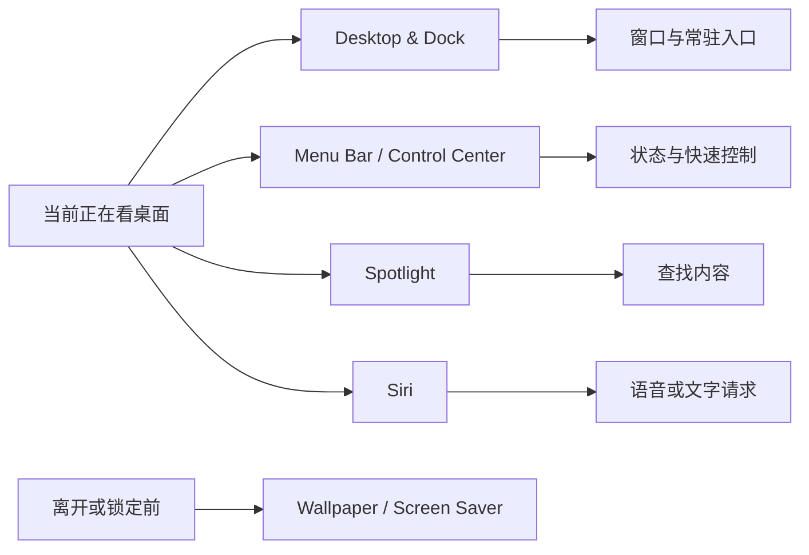

# 从桌面到控制中心：外观、菜单与系统搜索的连续入口

系统的“入口”不只是一排图标。桌面、程序坞、菜单栏、控制中心、Spotlight 和 Siri 分别服务于不同的时机：桌面提供工作空间，程序坞提供常驻启动点，菜单栏与控制中心提供状态和快捷控制，Spotlight 负责检索，Siri 负责请求和回应。墙纸与屏幕保护程序则影响视觉环境和离开设备时的呈现。把它们放在同一条路径里学习，能减少“我知道英文，但不知道该去哪一页”的断裂。

> [!note] 外观不等于权限或数据删除
> 调整墙纸、菜单栏显示项目、程序坞行为或搜索建议，通常改变的是界面呈现和入口可见性。阅读这些页面时不要推断文件被删除、应用被卸载或隐私许可被撤回；那些结果需要在相应的功能或隐私页面确认。

## 学习目标

你将能够解释 `Desktop & Dock`、`Menu Bar`、`Control Center`、`Wallpaper`、`Screen Saver`、`Spotlight`、`Siri` 和 `Requests` 的边界；能区分“显示一个入口”和“开启一个系统能力”；也能用英文说明“我调整了可见的控制项，没有改变这个服务的许可”。

## 入口按触发方式组织

`show` 和 `display` 常指界面上的可见性，`search` 指查找过程，`request` 指向助手提交的操作或问题。读页面时，将动词与触发方式配对，就不会把 `Show in Menu Bar` 误读成“启用功能本身”。

## 真实界面：桌面、程序坞、墙纸与屏幕保护程序

> 本机截图未包含在公开版本中，以保护原图中的个人信息。

> 本机截图未包含在公开版本中，以保护原图中的个人信息。

> 本机截图未包含在公开版本中，以保护原图中的个人信息。

> 本机截图未包含在公开版本中，以保护原图中的个人信息。

> 本机截图未包含在公开版本中，以保护原图中的个人信息。

> 本机截图未包含在公开版本中，以保护原图中的个人信息。

> 本机截图未包含在公开版本中，以保护原图中的个人信息。

> 本机截图未包含在公开版本中，以保护原图中的个人信息。

> 本机截图未包含在公开版本中，以保护原图中的个人信息。

> 本机截图未包含在公开版本中，以保护原图中的个人信息。

> 本机截图未包含在公开版本中，以保护原图中的个人信息。

> 本机截图未包含在公开版本中，以保护原图中的个人信息。

> 本机截图未包含在公开版本中，以保护原图中的个人信息。

> 本机截图未包含在公开版本中，以保护原图中的个人信息。

> 本机截图未包含在公开版本中，以保护原图中的个人信息。

## 真实界面：菜单栏、控制中心与系统搜索

> 本机截图未包含在公开版本中，以保护原图中的个人信息。

> 本机截图未包含在公开版本中，以保护原图中的个人信息。

> 本机截图未包含在公开版本中，以保护原图中的个人信息。

> 本机截图未包含在公开版本中，以保护原图中的个人信息。

> 本机截图未包含在公开版本中，以保护原图中的个人信息。

> 本机截图未包含在公开版本中，以保护原图中的个人信息。

> 本机截图未包含在公开版本中，以保护原图中的个人信息。

> 本机截图未包含在公开版本中，以保护原图中的个人信息。

> 本机截图未包含在公开版本中，以保护原图中的个人信息。

> 本机截图未包含在公开版本中，以保护原图中的个人信息。

> 本机截图未包含在公开版本中，以保护原图中的个人信息。

> 本机截图未包含在公开版本中，以保护原图中的个人信息。

> 本机截图未包含在公开版本中，以保护原图中的个人信息。

> 本机截图未包含在公开版本中，以保护原图中的个人信息。

> 本机截图未包含在公开版本中，以保护原图中的个人信息。

> 本机截图未包含在公开版本中，以保护原图中的个人信息。

### 完整界面表达

| 原文 | 软件语境中文 | 它控制什么 | 它不直接控制什么 |
| --- | --- | --- | --- |
| `Desktop & Dock` | 桌面与程序坞 | 工作空间、窗口与常驻入口行为 | 文件访问许可。 |
| `Hot Corners` | 热角 | 指针到达屏幕角落时触发的动作 | 触控板手势本身。 |
| `Wallpaper` | 墙纸 | 桌面背景的视觉呈现 | 锁屏密码要求。 |
| `Screen Saver` | 屏幕保护程序 | 空闲时的显示内容或进入时机 | 文件自动备份。 |
| `Show in Menu Bar` | 在菜单栏显示 | 系统入口是否可见 | 该服务是否已被授权。 |
| `Control Center` | 控制中心 | 集中显示状态与快捷控制 | 应用内部设置。 |
| `Spotlight` | 聚焦搜索 | 系统检索入口和相关设置 | Siri 回应的声音。 |
| `Requests` | 请求 | Siri 如何开始接收请求 | Siri 回应是否显示字幕。 |

## 两个完整观察案例

### 案例一：说明菜单栏入口与功能状态的区别

1. 打开 **Control Center** 或 **Menu Bar** 页面，找到 `Show in Menu Bar` 一类选项。
2. 先读出当前项目是否可见，再确认它所代表的功能是否有独立设置页。
3. 不添加控制、不移除控制，也不变更网络、蓝牙或声音状态。
4. 用英语说明：`Showing the control in the menu bar changes visibility, not the underlying permission.`
5. 如果需要恢复入口，回到相同项目的显示选项，而不是到隐私页面修改许可。

### 案例二：区分搜索和助手请求

1. 阅读 `Spotlight` 页中的搜索相关文字与 `Siri → Requests` 页的请求方式文字。
2. 将问题拆开：找文件或系统项目时用搜索入口；希望助手处理语音或文字命令时看请求方式。
3. 不改变语言、声音、唤起词或建议来源。
4. 用英语报告：`Spotlight is a search entry point. Siri requests describe how I start an assistant request.`
5. 若想恢复某项显示或请求偏好，回到原页面检查具体控件，而不是把两个系统同时重置。

> [!tip] 墙纸和屏幕保护程序的边界
> `Wallpaper` 是桌面背景，`Screen Saver` 通常在空闲条件下显示。两者都影响视觉环境，但不决定锁屏认证或通知预览。遇到“离开电脑时看到了什么”的问题，应先问是空闲显示、锁定界面还是通知内容。

## 英语表达规律与搭配

外观与入口类页面常用位置短语：`in the menu bar`、`in Control Center`、`on the desktop`、`at the corner of the screen`。`show` 的对象通常是控制、状态或文本，`use` 的对象通常是声音、背景或搜索服务。可用完整句是：`This control is shown in the menu bar, but the feature is configured on a separate page.`

| 单词 | 音标 | 词性 | 本篇语境义 | 所在完整表达 |
| --- | --- | --- | --- | --- |
| desktop | /ˈdesktɑːp/ | n. | 桌面工作区 | `Desktop & Dock` |
| dock | /dɑːk/ | n. | 程序坞 | `Desktop & Dock` |
| corner | /ˈkɔːrnər/ | n. | 屏幕角落 | `Hot Corners` |
| wallpaper | /ˈwɔːlpeɪpər/ | n. | 桌面背景 | `Wallpaper` |
| saver | /ˈseɪvər/ | n. | 保护程序 | `Screen Saver` |
| menu | /ˈmenjuː/ | n. | 菜单 | `Menu Bar` |
| request | /rɪˈkwest/ | n./v. | 请求 | `Siri Requests` |

## 用路径和结果复述一次界面调整

当别人请你描述改动，不要只说“我改了菜单栏”。可以先说路径，再说对象，最后说可见结果：`I opened Control Center settings, selected the control, and chose to show it in the menu bar.` 这句话的三个动词分别对应进入页面、定位项目和选择显示位置。若你没有实际改动，可把过去式改成阅读动作：`I opened the page and reviewed the option, but I did not change it.`

对于桌面和程序坞，也可以用相同的骨架：`I reviewed Desktop & Dock to understand where window and shortcut behavior is configured.` 这里的 `where` 引出配置位置，不是询问“在哪里”。对墙纸和屏幕保护程序而言，建议补上触发条件：`The wallpaper is visible on the desktop, while the screen saver appears after the Mac has been idle.` 这种对比句把两项视觉设置的时机说清楚。

如果你在页面中看见一个看似无关的状态，比如电池项目显示在菜单栏，不必立刻到电池页面改变策略。先确认想达成的是“让状态可见”还是“调整供电行为”。前者通常归菜单栏或控制中心，后者归电池设置。用英语提问可以说：`Do you want to display the status, or do you want to change the battery behavior?` 这会把视觉入口与系统行为分开。

> [!tip] 先处理一个入口
> 菜单栏、控制中心、桌面、Spotlight 和 Siri 能彼此联动，但不应为了测试一项入口同时改动多处。一次只核对一个对象及其原值、目标结果、实际观察和完整恢复位置，才能在稍后准确且安全地恢复。

## 自测

1. `Show in Menu Bar` 改变的是哪一层？
2. `Wallpaper` 与 `Screen Saver` 在什么条件下分别出现？
3. `Spotlight` 与 `Siri Requests` 如何按任务区分？
4. 用英语说“我让控制项显示在菜单栏，但没有修改它的权限”。

查看参考答案

1. 改变系统入口的可见性。
2. 墙纸在桌面呈现，屏幕保护程序通常在空闲时呈现。
3. Spotlight 用于搜索，Siri Requests 说明怎样开始助手请求。
4. `I showed the control in the menu bar without changing its permission.`

## 版本与来源

本文基于本机 macOS 27.0 Beta (26A5425a) 于 2026-09-09 的采集。菜单栏项目、搜索来源和 Siri 可用项会随配置变化。功能概念参考 Apple 的 [Change Desktop & Dock settings on Mac](https://support.apple.com/guide/mac-help/change-desktop-dock-settings-mchlp1119/mac)、[Change Control Center settings on Mac](https://support.apple.com/guide/mac-help/change-control-center-settings-mchl50af177/26.0/mac) 与 [Change Siri settings on Mac](https://support.apple.com/guide/mac-help/change-siri-settings-mchl19f82431/mac)。
