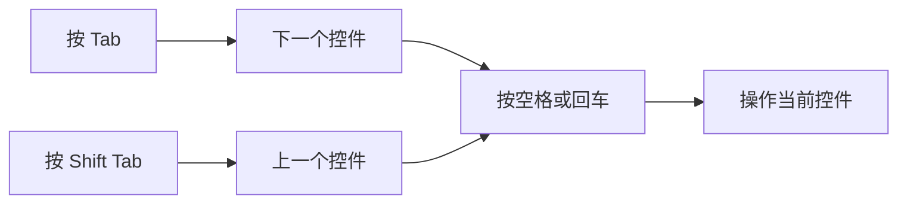

# 让输入稳定可控：键盘、输入法、文本替换与听写

Keyboard 页面不是只用来改快捷键。它同时控制实体键盘在暗处的背光、Tab 在控件之间移动焦点的规则、输入源切换、自动拼写和标点、文本替换以及 Dictation。输入出现问题时，先判断是“按键和背光”“当前输入语言”“自动改写文本”“语音听写”中的哪一类，再进入对应区域；不要把所有输入异常都归到输入法或键盘硬件上。

> [!info] 本篇的输入链路
>
> - Keyboard brightness 影响键盘灯光，不影响屏幕亮度。
> - Input source 决定按键被解释成哪种语言或输入方案，Text replacement 决定特定缩写怎样展开。
> - Correct spelling、smart quotes 和predictive text 都会改变输入结果，但处理的对象不同。
> - Dictation 的本机处理说明、语言、麦克风来源和快捷方式需要分别检查。

## 从按键到文字：输入并不是一步完成的

输入一个字符时，系统至少会经历“收到按键”“选择输入源”“应用文本规则”“可选的语音识别”四层。把它们分开，才能解释为什么同一个按键在不同 App、不同语言或不同文档中会产生不同结果。

| 层次 | 页面英语 | 它处理什么 | 常见误判 |
| --- | --- | --- | --- |
| 键盘硬件体验 | `Keyboard brightness`, `backlight`, `inactivity` | 键盘灯光与实体按键使用感 | 当成屏幕亮度或输入语言 |
| 焦点移动 | `keyboard navigation`, `focus`, `Tab key` | 按 Tab 在界面控件之间移动 | 当成文本编辑时插入制表符的规则 |
| 输入源与文本规则 | `Input Sources`, `spelling`, `predictive text` | 按键如何变成文字、怎样自动调整 | 当成应用的所有权限 |
| 听写 | `Dictation`, `Microphone source`, `Shortcut` | 语音如何变成文字 | 当成 Siri 的回应声音 |

例如，“我按 Tab 后选中了下一个按钮”属于 keyboard navigation；“我输入英文时出现了智能引号”属于 text input；“我说话后系统把它写出来”属于 dictation。它们都发生在输入过程中，却由不同设置和不同英语表达描述。

## 界面实例：键盘亮度、焦点导航和输入入口

> 本机截图未包含在公开版本中，以保护原图中的个人信息。

| 完整英文 | 软件语境中文 | 关键边界 |
| --- | --- | --- |
| `Adjust keyboard brightness in low light` | 在低光环境下调节键盘亮度。 | 影响键盘背光，不影响显示器亮度。 |
| `Turn keyboard backlight off after inactivity` | 闲置后关闭键盘背光。 | 管键盘灯的关闭时机，不让 Mac 休眠。 |
| `Press 🌐︎ key to` | 按地球键以…… | 设定功能键触发的动作。 |
| `Change Input Source` | 更改输入源。 | 切换输入语言或输入方案。 |
| `Use keyboard navigation to move focus between controls.` | 用键盘导航在控件之间移动焦点。 | 管界面焦点，和文字输入位置不同。 |
| `Press the Tab key to move focus forward and Shift Tab to move focus backward.` | Tab 前进，Shift Tab 后退。 | 用一组互相相反的动作解释方向。 |
| `Input Sources` | 输入源。 | 进入语言或输入方案管理。 |
| `Text Replacements…` | 文本替换。 | 进入缩写自动展开规则。 |
| `Dictation processes many voice inputs on your Mac.` | 听写会在 Mac 上处理许多语音输入。 | 说明处理位置，但不覆盖所有数据说明。 |
| `Microphone source` | 麦克风来源。 | 选择听写用哪个输入设备。 |

页面中具体的输入源名称、麦克风设备名称和个人自定义替换内容会随机器变化，不写入正文或搜索索引。学习时关注的是入口 `Input Sources`、动作 `Change Input Source` 和范围说明 `Microphone source`，而不是记下某台设备的私人配置。

## 键盘背光：低光、闲置和显示器亮度是不同问题

`Adjust keyboard brightness in low light` 中的 `in low light` 是条件短语，表示环境光线较低时；它并不是“把屏幕调暗”。`Turn keyboard backlight off after inactivity` 中的 `after inactivity` 是时间条件，表示一段没有键盘活动的时间之后。二者都只围绕键盘的背光。

| 情况 | 应看哪个表达 | 可以怎样描述 | 不需要先做什么 |
| --- | --- | --- | --- |
| 键盘按键看不清 | `Keyboard brightness` | `The keyboard backlight is too dim.` | 修改 Display 的 Brightness |
| 不想让键盘灯长亮 | `Turn … off after inactivity` | `The backlight turns off after a period of inactivity.` | 让整台 Mac 立即睡眠 |
| 文字在屏幕上看不清 | Displays 的 `Brightness` 或 Text Size | `The display is too bright or too dim.` | 调整键盘背光 |
| 键盘灯随环境变化 | `Adjust … in low light` | `Keyboard brightness adjusts in low light.` | 修改输入源 |

这里最有用的语法是 `turn + object + off + after + 名词`。`turn off` 是关闭，`after inactivity` 限定何时执行。完整句 `Turn keyboard backlight off after inactivity` 不应拆成“关、键盘、背光、后、闲置”逐词理解；它是一个系统规则：“闲置后关闭键盘背光”。

> [!tip] 先核对对象，再修改亮度
>
> 出现“太暗”时，先指出是 keyboard、display 还是某个 App 的内容区域。把对象说清后，页面路径会不同：Keyboard 管背光，Displays 管屏幕发光与色彩，Accessibility 还可能改变对比度和透明度。

## 键盘导航：焦点在控件之间移动，不是在文本中跳字

`Use keyboard navigation to move focus between controls.` 是一个完整的功能说明。`focus` 在这里是“当前接受键盘操作的界面控件”，而不是“专注模式”。`between controls` 表示在按钮、开关、菜单或输入框这些控件之间移动。

| 表达 | 用户会看到的结果 | 不能混同的行为 |
| --- | --- | --- |
| `move focus forward` | Tab 将焦点移到下一个可操作控件 | 在文本中向右移动一个字符 |
| `move focus backward` | Shift Tab 将焦点移到上一个控件 | 删除上一个字符 |
| `keyboard navigation` | 用按键遍历界面控件 | 鼠标指针移动或触控板手势 |
| `control` | 按钮、开关、菜单、输入框等 | 仅指 Control Center |

如果你开启这一功能，表单、对话框和设置页都可能更容易用键盘操作。遇到 Tab 没有进入预期按钮时，不要立刻认为键盘坏了；先确认此开关是否开启、当前 App 是否把焦点留在可编辑文本中，以及是否存在模态弹窗。可以说：`The Tab key is moving focus between controls, so I need to check which control is currently selected.`

这个流程表达的是焦点导航的常见使用顺序。Tab 和 Shift Tab 负责改变“当前选择哪一个控件”，空格或回车才可能执行控件操作。不同 App 对具体按键支持会不同，因此图中的最后一步不是保证某个按钮一定执行，而是提示你先观察当前焦点。

## 输入源：切换语言、自动按文档切换和菜单栏入口

> 本机截图未包含在公开版本中，以保护原图中的个人信息。

Input Sources 页面回答“系统用哪一种规则解释当前键盘输入”。它可管理输入源列表，也包含与文字输出相关的自动规则。`Add` 与 `Remove` 管理输入源项目；`Show Input menu in menu bar` 决定是否在菜单栏提供切换入口；`Automatically switch to a document’s input source` 则让系统根据文档的上次输入源作出选择。

| 完整英文 | 软件语境中文 | 应如何理解 |
| --- | --- | --- |
| `Show Input menu in menu bar` | 在菜单栏显示输入菜单。 | 显示切换入口，不等于新增输入源。 |
| `Press and hold to enable typing in all uppercase.` | 长按以启用全大写输入。 | 说明按住按键的触发方式。 |
| `Automatically switch to a document’s input source` | 自动切换到文档的输入源。 | 以文档为单位记住并切换输入源。 |
| `Correct spelling automatically` | 自动更正拼写。 | 改正可能识别为拼写问题的文本。 |
| `Capitalize words automatically` | 自动大写单词。 | 调整大小写，不等于翻译文字。 |
| `Show inline predictive text` | 显示行内预测文本。 | 在输入位置提供预测建议。 |
| `Add period with double-space` | 连按两次空格添加句号。 | 用输入手势插入标点。 |
| `Spelling: Automatic by Language` | 拼写：按语言自动判断。 | 拼写规则随当前语言而变化。 |
| `Use smart quotes and dashes` | 使用智能引号和破折号。 | 将普通符号按排版规则替换。 |

`a document’s input source` 中的所有格说明“属于某个文档的输入源”。它不是说文档内部保存了一套输入法程序，而是系统可以为不同文档记住上次使用的输入源。若这个选项开启，在不同语言文档间切换时，当前输入源可能随之改变；这有助于多语言写作，也可能让你在意外切换时感到困惑。

> [!warning] 自动切换适合多语言任务，但先确认恢复方式
>
> 开启 `Automatically switch to a document’s input source` 后，系统会尝试配合文档上下文切换。若你需要固定某一种输入语言，先记录当前开关状态和切换快捷方式，再决定是否保留自动规则。出现输入语言意外变化时，先检查此选项与当前 Input menu，不要立刻删除输入源。

## 自动更正、预测文本和智能标点：都在改文本，但改法不同

| 功能 | 它根据什么工作 | 可能看到的变化 | 适合检查的情形 |
| --- | --- | --- | --- |
| `Correct spelling automatically` | 拼写判断 | 字词被改成系统认为正确的拼写 | 词被自动改错或改对 |
| `Capitalize words automatically` | 大小写规则 | 词首或句首自动变成大写 | 大小写不符合预期 |
| `Show inline predictive text` | 输入上下文预测 | 光标后出现可接受的预测文本 | 出现灰色或行内建议 |
| `Add period with double-space` | 连续空格手势 | 输入句号并调整空格 | 双空格后出现标点 |
| `Use smart quotes and dashes` | 排版替换规则 | 直引号、连字符变成排版符号 | 代码、命令或原文引用被改写 |

`predictive` 是“预测性的”，`inline` 是“行内的”。它们合在一起说明建议显示在你正在编辑的一行中，而不是弹出独立窗口。`smart quotes` 不表示“更聪明地理解意思”，而是排版上的弯引号或样式化引号。写代码、粘贴命令、输入精确标识时，智能标点可能不适合；写普通文章时，它可能改善排版。

如果你在终端、代码编辑器或账号字段中发现引号被替换，不要直接说“键盘输入错误”。更准确的是：`Smart quotes may be changing the punctuation, so I am checking the text input settings.` 这句把可能原因定位到排版规则，而不是硬件故障。

## 文本替换：缩写、替换结果和个人内容的边界

> 本机截图未包含在公开版本中，以保护原图中的个人信息。

Text Replacements 把较短的输入触发词展开为较长文本。它适合反复输入的礼貌结尾、地址模板或工作短语，也可能在你输入某个缩写时出现意外替换。页面通常有添加和删除动作，但具体替换条目是个人文本，不应进入软件英语的搜索、词汇或练习。

| 表达 | 软件语境中文 | 使用边界 |
| --- | --- | --- |
| `Text Replacements` | 文本替换。 | 管缩写自动展开，不是查找替换工具。 |
| `Replace` | 替换。 | 用一段结果文本替代触发文本。 |
| `With` | 替换为。 | 指向展开后的结果。 |
| `Add` | 添加。 | 新建一条替换规则。 |
| `Remove` | 移除。 | 删除选中的替换规则。 |

`replace A with B` 是最值得掌握的搭配：用 B 替换 A。它和 `change A to B` 接近，但 replace 更强调 A 被 B 取代。练习时只需理解结构，不必创建真实替换文本。可以说：`Text Replacements can replace a short phrase with a longer phrase.`

## 听写：处理位置、语言、麦克风和快捷方式各自独立

Dictation 把你的语音转写为文字。Keyboard 页面中 `Dictation processes many voice inputs on your Mac. Information will be sent to Apple in some cases.` 由两句话组成：前句说明许多语音输入在 Mac 上处理；后句保留边界，说明在某些情况信息会被发送给 Apple。读到这种说明时，应完整保留 `many` 与 `in some cases`，不要把它简化成“全部离线”或“全部上传”。

| 设置项 | 它控制什么 | 常见误解 |
| --- | --- | --- |
| `Dictation` | 是否启用语音转文字能力 | 是否让 Siri 朗读回应 |
| `Languages` | 听写可使用的语言范围 | 所有 App 的显示语言 |
| `Microphone source` | 听写听取哪个输入设备 | 扬声器的输出设备 |
| `Shortcut` | 以何种按键或动作开始听写 | 切换输入源的快捷方式 |
| `About Ask Siri, Dictation & Privacy…` | 查看 Siri、听写与隐私说明 | 直接更改语言或声音 |

`Microphone source` 中的 source 是输入来源；在 Sound 页面里也会遇到 input 与 output。描述时务必写出对象：`I checked the microphone source for Dictation.` 不要只说 `I checked the source`，那样无法判断你指网络、声音还是输入法来源。

## 两个完整操作案例

### 案例一：只读排查自动改写文字的来源

1. 打开 **System Settings → Keyboard → Edit…**，进入 Input Sources 页面。
2. 找到 `Correct spelling automatically`、`Show inline predictive text` 和 `Use smart quotes and dashes`。
3. 分别说明：拼写更正、行内预测和标点替换处理的是不同层。
4. 不修改开关，不输入个人文字，也不添加 Text Replacement。
5. 用英语报告：`I reviewed the automatic spelling, prediction, and punctuation options. I did not change any input source or personal replacement.`

### 案例二：只读确认听写会使用哪个输入设备

1. 打开 **System Settings → Keyboard**，前往 Dictation 区域。
2. 找到 `Microphone source` 和 `Shortcut`。
3. 说明前者决定听写从哪里接收语音，后者决定怎样开始听写。
4. 不开始听写，不更改语言，也不录制或输入真实语音内容。
5. 用英语说明：`I checked the microphone source and shortcut for Dictation, but I did not start a dictation session or change its language.`

## 常见错误与恢复方式

| 错误 | 为什么会出错 | 更可靠的处理 |
| --- | --- | --- |
| 键盘灯暗就去调 Displays | 把键盘背光与屏幕亮度混在一起 | 检查 Keyboard brightness |
| 输入语言变了就删除输入源 | 可能只是自动按文档切换 | 先查看 Input menu 与自动切换开关 |
| 代码中的引号变形就怀疑键盘坏了 | Smart quotes 可能在替换标点 | 检查智能引号和破折号设置 |
| Tab 无法选中按钮就随意改快捷键 | 可能未开启 keyboard navigation 或焦点在文本内 | 先查看焦点导航规则 |
| 以为 Dictation 和 Siri Voice 是同一设置 | 一个负责转写输入，一个负责回应声音 | 分别检查 Keyboard 的 Dictation 与 Siri 的 Voice |

## 英语表达规律：条件、方式和替换结果

Keyboard 页面中经常用介词短语解释“何时”“通过什么方式”“替换成什么”。掌握这些结构，比单独背开关名更容易迁移到其他软件。

| 结构 | 界面例句 | 它回答的问题 |
| --- | --- | --- |
| `in + 环境` | `in low light` | 在什么环境下发生？ |
| `after + 状态` | `after inactivity` | 在什么状态之后发生？ |
| `with + 结果` | `replace a phrase with text` | 用什么替换什么？ |
| `to + 动词` | `Press … to change input source` | 按键的目的是什么？ |
| `between + 名词复数` | `between controls` | 焦点在哪些对象之间移动？ |

当你需要汇报一次不改动设置的检查，可以将路径、对象和边界放进一句话：`I opened Keyboard to review the text input options, but I left the current input sources and dictation settings unchanged.` `left … unchanged` 表示“保持原样”，适合学习和排查阶段。

## 自测

1. Keyboard brightness 与 Displays 的 Brightness 分别控制什么？
2. `Press the Tab key to move focus forward` 中的 focus 指什么？
3. 自动拼写、行内预测与智能引号各会如何改变输入结果？
4. Dictation 的 Microphone source 与 Siri Voice 为什么不能互相替换？
5. 用英语说出“我检查了输入源和文本替换设置，但没有更改任何个人配置”。

查看参考答案

1. 前者控制键盘背光，后者控制屏幕明暗。
2. 指当前接收键盘操作的按钮、开关、菜单或输入框等界面控件。
3. 自动拼写可能改正词形，行内预测提供可接受的后续文本，智能引号会将普通符号替换成排版符号。
4. Microphone source 指听写的语音输入设备；Siri Voice 指 Siri、地图或页面朗读可能使用的声音，两者对象不同。
5. `I reviewed the input source and text replacement settings, but I did not change any personal configuration.`

## 版本与来源

- 本机界面事实：macOS 27.0 Beta (26A5425a)，采集日期 2026-09-09。
- 功能原理参考：[Change Keyboard settings on Mac](https://support.apple.com/guide/mac-help/change-keyboard-settings-mchlp1015/mac)、[Use input sources on Mac](https://support.apple.com/guide/mac-help/write-in-another-language-mchlp1406/mac) 与 [Use Dictation on Mac](https://support.apple.com/guide/mac-help/use-dictation-mh40584/mac)。
- 输入源、麦克风设备、个人替换条目和可用语言取决于本机软件、硬件与地区。本文保留稳定的系统表达和操作边界，不记录个人内容。
