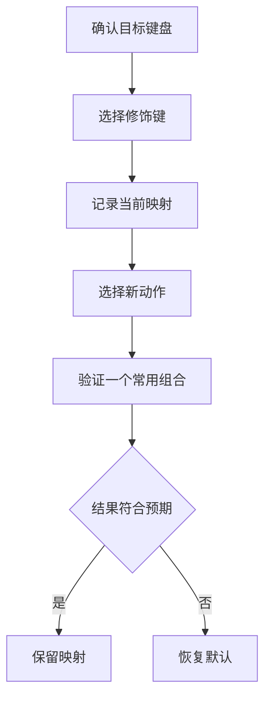

# 建立可靠的快捷键体系：系统命令、功能键与修饰键

快捷键不是一张“按键清单”，而是一套把动作绑定到组合键的规则。macOS 把程序坞、显示器、调度中心、窗口管理、输入源、截屏、服务、Spotlight、辅助功能和应用专属命令分组管理。学会这页以后，你应能判断一个组合键属于哪个动作、是否已启用、该如何安全地改回原值，以及为什么 Function Keys 和 Modifier Keys 的变化会影响范围更大。

> [!warning] 修改前先建立恢复点
>
> 快捷键冲突会让原本熟悉的系统动作失效。开始前记录原有组合键、确认它属于系统还是某个 App，并知道所在分组的 `Restore Defaults` 入口。第一次学习只读列表和说明，不需要更改任何组合键。

## 快捷键由动作、组合键和启用状态组成

| 部分 | 界面英语 | 它回答的问题 | 例子 |
| --- | --- | --- | --- |
| 动作 | `Turn Dock hiding on/off` | 按键会做什么？ | 切换 Dock 自动隐藏。 |
| 组合键 | `⌥⌘D` | 用哪一组键触发？ | Option、Command 与字母或符号组成。 |
| 启用状态 | checkbox | 这条快捷方式当前能否触发？ | 勾选表示此规则可用。 |
| 分类 | `Dock shortcuts` | 这条规则在哪类系统功能中？ | 程序坞相关操作。 |
| 恢复入口 | `Restore Defaults` | 如何回到系统默认映射？ | 恢复该分类的默认值。 |

同一组合键没有脱离动作的独立含义。看到 `⌥⌘D` 时，必须同时读它对应的 `Turn Dock hiding on/off`，才能知道按下后会发生什么。只背符号很容易造成误操作；只背动作又无法在实际界面中执行。

## 界面实例：快捷键分组、改键步骤与恢复默认

> 本机截图未包含在公开版本中，以保护原图中的个人信息。

| 完整英文 | 软件语境中文 | 关键理解 |
| --- | --- | --- |
| `Dock shortcuts` | 程序坞快捷键。 | 管 Dock 显示与隐藏等动作。 |
| `Display shortcuts` | 显示器快捷键。 | 管显示器相关动作，不是显示器硬件设置本身。 |
| `Mission Control shortcuts` | 调度中心快捷键。 | 管窗口总览与工作空间操作。 |
| `Window management shortcuts` | 窗口管理快捷键。 | 管窗口平铺、位置和布局动作。 |
| `Input Sources shortcuts` | 输入源快捷键。 | 管语言或输入方案切换。 |
| `Screenshots shortcuts` | 截屏快捷键。 | 管截取屏幕内容的系统动作。 |
| `Services shortcuts` | 服务快捷键。 | 管系统服务或应用提供的动作。 |
| `Application shortcuts` | 应用快捷键。 | 绑定到特定应用命令。 |
| `To change a shortcut, double click the key combination, and then type the new keys.` | 双击组合键，再按下新按键以更改快捷键。 | 明确给出了改键的操作顺序。 |
| `Restore Defaults` | 恢复默认值。 | 用于恢复系统的原始映射。 |
| `Done` | 完成。 | 结束当前弹窗中的编辑。 |

`double click … and then …` 是带顺序的操作句。先双击当前 key combination，系统才会让它进入可编辑状态；随后按新键，才把新组合写入规则。跳过第一步、直接按键，可能只是触发当前快捷方式，而不是修改它。

## 分组不是难度排序，而是动作的归属

快捷键列表的顺序不是“最常用到最少用”，而是按系统功能分组。理解归属可以帮助你在发生冲突时从正确位置排查。

| 分组 | 常见任务 | 排查时先问什么 |
| --- | --- | --- |
| Dock shortcuts | 显示、隐藏或定位程序坞 | 我改的是 Dock 可见性，还是某个 App 窗口？ |
| Display shortcuts | 调整显示亮度或显示功能 | 这是屏幕显示动作，还是键盘背光？ |
| Mission Control shortcuts | 查看窗口总览、切换 Space | 我想切换工作区，还是只想最小化一个窗口？ |
| Window management shortcuts | 平铺、移动或安排窗口 | 当前窗口是否支持这条布局动作？ |
| Keyboard shortcuts | 常规键盘行为 | 是否与文字输入、焦点导航混淆？ |
| Input Sources shortcuts | 切换语言或输入法 | 当前问题是语言切换，还是拼写自动改写？ |
| Screenshots shortcuts | 截取整屏、窗口或区域 | 截屏权限、保存位置和快捷键冲突分别是什么？ |
| Spotlight shortcuts | 唤起或切换 Spotlight 搜索 | 是否与 App 搜索框快捷键冲突？ |
| Accessibility shortcuts | 启动辅助功能动作 | 是否会改变当前显示、朗读或输入方式？ |
| Application shortcuts | 调用特定 App 菜单命令 | App 是否安装、当前是否前台、菜单名称是否变动？ |

例如，想让窗口左右平铺却找不到组合键，应查看 `Window management shortcuts`，而不是 `Mission Control shortcuts`。前者关心单个窗口怎样摆放，后者关心多个窗口和工作空间的总览。用英语描述路径时可以说：`I opened Window management shortcuts because I want to check a tiling command, not a Mission Control command.`

## 启用与可编辑：复选框并不等于改键成功

很多快捷方式行同时有动作名称、组合键和 checkbox。checkbox 表示该规则是否启用；组合键表示规则使用哪一组键。更改组合键和取消勾选分别影响不同东西。

| 你的操作 | 直接结果 | 不会自动发生的事 |
| --- | --- | --- |
| 取消 checkbox | 当前组合键不再触发该动作 | 删除动作所属的系统功能 |
| 勾选 checkbox | 允许当前组合键触发动作 | 自动解决与其他 App 的冲突 |
| 修改 key combination | 改变触发动作的按键 | 改变同类其他快捷键 |
| Restore Defaults | 恢复系统默认映射 | 恢复 App 自己定义的独立快捷键 |

有时组合键没有反应，根因可能是规则关闭、按键被另一条规则占用、App 捕获了该组合，或键盘布局使你按到不同符号。请先确认 checkbox 状态，再核对动作名称与当前组合。不要把“没有效果”直接翻译成 `The shortcut is broken.`；更准确的是：`The shortcut is enabled, but I need to check whether another command is using the same key combination.`

> [!note] Restore Defaults 的范围
>
> Restore Defaults 通常对应当前快捷键设置范围或弹窗中的默认映射。它可能覆盖你在该范围内的自定义组合，因此适合在已记录原值、多个规则混乱且无法逐项恢复时使用。它不是撤销其他页面所有设置的通用按钮。

## 功能键：特殊功能与 F1、F2 等按键的优先级

> 本机截图未包含在公开版本中，以保护原图中的个人信息。

Function Keys 页面会出现说明：`When this option is selected, press and hold the 🌐︎ key to use the special features printed on each key.` 这句话有两个层次：页面上的选项决定功能键默认怎样处理；地球键的长按动作决定怎样访问印在功能键上的特殊功能。

| 词组 | 中文理解 | 使用时要注意 |
| --- | --- | --- |
| `Function Keys` | 功能键。 | 指 F1、F2 等一组键及其行为规则。 |
| `special features` | 特殊功能。 | 指键帽上标出的亮度、音量等功能，不等于某个 App 的功能。 |
| `printed on each key` | 印在每个按键上的。 | 修饰 special features，说明标识位置。 |
| `press and hold` | 按住。 | 是持续按住，不是连续快速按两次。 |
| `selected` | 已选中。 | 描述当前选项状态，不是执行动作。 |

这里的 `when` 引出条件，`to use` 引出目的。完整逻辑是：**当该选项被选中时，为了使用每个键上印的特殊功能，需要按住地球键。** 如果读反了条件，容易把功能键行为理解成“永远需要按住地球键”。

## 修饰键：映射动作前先确认对应的物理键盘

> 本机截图未包含在公开版本中，以保护原图中的个人信息。

Modifier Keys 允许为 Caps Lock、Control、Option、Command 与 Globe 指定动作。页面先让你 `Select keyboard`，再说明 `For each modifier key listed below, choose the action you want it to perform from the pop-up menu.` 这种设计说明：修改键映射可能针对某一把被识别的键盘，而不是所有输入设备的抽象规则。

具体键盘名称属于本机设备数据，不记录到教程内容。学习时只需要理解“要先选定目标键盘，再决定每一个 modifier key 做什么”。

| 完整英文 | 软件语境中文 | 风险边界 |
| --- | --- | --- |
| `Select keyboard` | 选择键盘。 | 先确认改动作用于哪一个键盘。 |
| `modifier key` | 修饰键。 | 与其他键组合时改变命令含义的键。 |
| `Caps Lock key` | 大写锁定键。 | 可能被映射为其他动作。 |
| `Control key` | Control 键。 | 常作为组合键的一部分。 |
| `Option key` | Option 键。 | 常用于替代操作或符号输入。 |
| `Command key` | Command 键。 | macOS 常用命令修饰键。 |
| `Globe key` | 地球键。 | 可能和输入源或功能键规则相关。 |
| `choose the action … from the pop-up menu` | 从弹出菜单选择要执行的动作。 | 表示重新映射，不只是查看键名。 |

Modifier Keys 的影响范围比单条快捷键大。例如调换 Command 与 Option 后，很多 App 的复制、粘贴、窗口切换等组合习惯都会变化。要描述这种风险，可以说：`Changing a modifier key can affect many shortcuts, so I will confirm the selected keyboard before changing the mapping.`

这条恢复链强调两件事。第一，先选目标键盘，避免把预期只作用于外接键盘的映射改到另一设备上。第二，验证时只测试一个低风险、熟悉的组合，例如打开一个普通菜单；若结果不对，立即在同一页面恢复默认，而不是同时改更多按键。

## 截屏、服务和应用快捷键：同样是快捷键，影响对象不同

`Screenshots shortcuts` 触发的是系统截取屏幕动作，`Services shortcuts` 触发的是服务菜单中可用的动作，`Application shortcuts` 则对应某个 App 的菜单命令。三者在列表中的形式相近，却不能以相同方式排查。

| 类型 | 主要依赖 | 发生问题时优先检查 |
| --- | --- | --- |
| Screenshots shortcuts | 系统截屏动作、按键组合、保存或呈现规则 | 是否与其他工具冲突、是否按对组合键 |
| Services shortcuts | 当前选中文本或文件、对应服务是否可用 | 选区是否存在、服务是否在当前 App 支持 |
| Application shortcuts | 具体 App、菜单名称和 App 版本 | App 是否当前可用、菜单项是否改名或移除 |

不要因为某个 Application shortcut 没有触发，就用 Restore Defaults 去重置所有系统快捷键。它可能只是 App 菜单项在版本更新后改名，或该命令只在特定文档、选择内容或窗口状态下出现。更好的报告是：`This application shortcut depends on a menu command in the current app, so I need to verify the command name and context first.`

## 两个完整操作案例

### 案例一：只读确认一个系统快捷键的动作与状态

1. 打开 **System Settings → Keyboard → Keyboard Shortcuts…**。
2. 选择 `Dock shortcuts`。
3. 找到一条带组合键与 checkbox 的规则，例如控制 Dock 显示状态的动作。
4. 分别读出动作、key combination 和 checkbox 状态。
5. 不双击组合键、不勾选或取消任何项目，最后选择 Done。
6. 用英语报告：`I checked the Dock shortcut, its key combination, and whether it is enabled. I did not change the shortcut.`

### 案例二：安全地理解修饰键映射的影响范围

1. 在 Keyboard Shortcuts 中选择 `Modifier Keys`。
2. 阅读 `Select keyboard` 与 `choose the action you want it to perform`。
3. 指出 Command、Option、Control、Caps Lock 和 Globe 都是可映射对象。
4. 不选择具体键盘、不更改任何 pop-up menu，也不使用 Restore Defaults。
5. 用英语说明：`I reviewed the modifier key mappings, but I did not change any key because the mapping can affect many shortcuts.`

## 常见错误与恢复方式

| 错误 | 为什么会出错 | 更可靠的处理 |
| --- | --- | --- |
| 直接按新组合键试图改键 | 未进入编辑状态，可能触发现有动作 | 先 double click 当前 key combination |
| 把取消 checkbox 当成删除功能 | 只是禁用快捷键触发 | 重新勾选可恢复动作 |
| 功能键行为不符就改 Modifier Keys | Function Keys 与 Modifier Keys 是两组规则 | 先确认是特殊功能优先级还是修饰键映射 |
| 一次改多个修饰键 | 无法知道哪个改动造成冲突 | 一次只改一个，立刻验证并记录原值 |
| 看到应用快捷键失效就重置全部 | 可能只是 App 菜单名称或上下文变了 | 先检查该 App 当前菜单与选择状态 |

## 英语表达规律：动作目标、条件与恢复

快捷键页面的说明句常把“动作”“作用对象”“条件”和“恢复方式”组合在一起。读清这四部分后，遇到新软件的快捷键界面也能用相同方法理解。

| 结构 | 界面例句 | 作用 |
| --- | --- | --- |
| `change + 名词` | `change a shortcut` | 表示修改具体规则。 |
| `type + 名词` | `type the new keys` | 表示按下并录入新按键。 |
| `press and hold + 键` | `press and hold the Globe key` | 表示持续按住的条件动作。 |
| `when + 从句` | `When this option is selected` | 引出设置生效的前提。 |
| `restore + 名词 + to + 状态` | `Restore … to their default settings` | 说明恢复对象和目标状态。 |

你可以用一段完整英语描述可恢复的改键步骤：`I recorded the current shortcut, changed one key combination, tested the related action, and restored the default if the result was not expected.` 这比只说 “I changed the shortcut” 更能说明你保留了验证与恢复路径。

## 自测

1. 快捷键规则的动作、组合键和 checkbox 分别告诉你什么？
2. 修改快捷键时，为什么要先双击当前组合键？
3. Function Keys 和 Modifier Keys 各自控制什么？
4. 为什么 Application shortcuts 失效时不应先重置整个系统快捷键列表？
5. 用英语说明“我记录了原有组合键，只修改一条规则并验证结果”。

查看参考答案

1. 动作说明按键会做什么，组合键说明怎样触发，checkbox 说明规则是否启用。
2. 双击让该行进入编辑状态；否则按键可能只会触发当前快捷方式。
3. Function Keys 管功能键特殊功能的优先规则；Modifier Keys 管 Caps Lock、Control、Option、Command、Globe 的动作映射。
4. 应用快捷键依赖某个 App 的菜单命令和上下文，问题可能只在该 App 内，不必影响系统其他规则。
5. `I recorded the original key combination, changed only one shortcut, and verified the result.`

## 版本与来源

- 本机界面事实：macOS 27.0 Beta (26A5425a)，采集日期 2026-09-09。
- 功能原理参考：[Create keyboard shortcuts for apps on Mac](https://support.apple.com/guide/mac-help/create-keyboard-shortcuts-for-apps-mchlp2262/mac)、[Change Keyboard settings on Mac](https://support.apple.com/guide/mac-help/change-keyboard-settings-mchlp1015/mac) 与 [Use function keys on Mac](https://support.apple.com/guide/mac-help/use-function-keys-mchlp1011/mac)。
- 快捷键可用性、App 菜单名称、外接键盘和键位映射会随硬件与软件变化。本文将当前界面作为学习原文，提供低风险检查与恢复方法，不主张在未知影响范围下批量修改映射。
