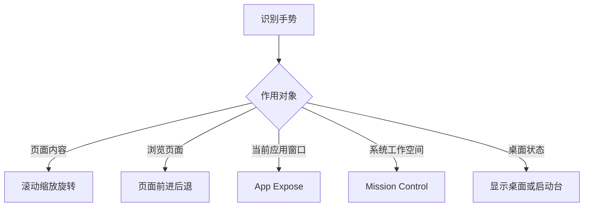

# 让指针按预期工作：鼠标、触控板与多指手势

Mouse 与 Trackpad 页面看似都在调“鼠标速度”，实际分别描述指针移动、点击、滚动、缩放、旋转、窗口切换和系统手势。一个手势没有按预期工作时，先确认使用的是鼠标还是触控板、动作是单指还是多指、它控制的是页面内容还是系统窗口，再进入相应分组。把“滑不动”“右键失效”“切错桌面”统称为鼠标问题，通常找不到正确开关。

> [!info] 这篇要分清的动作
>
> - `Tracking speed` 控制指针移动速度；`Scrolling Speed` 控制内容滚动速度。
> - `Content tracks finger movement` 是自然滚动方向，不是追踪速度。
> - `Secondary click` 是右键或替代点击动作；`Tap with one finger` 是轻触而非按下。
> - `Swipe`、`Pinch`、`Rotate`、`Spread` 描述不同手势，作用对象可能是内容、页面、窗口或工作空间。

## 指针、内容和窗口：先找动作作用的对象

| 对象 | 典型英文 | 发生什么 | 容易混淆为 |
| --- | --- | --- | --- |
| 指针 | `Tracking speed` | 光标在屏幕上的移动速度改变 | 页面滚动距离 |
| 内容 | `Content tracks finger movement`, `Scrolling Speed` | 网页、列表或文档内容的移动方式改变 | 指针本身的速度 |
| 控件 | `Secondary click`, `Tap with one finger` | 触发上下文菜单或选择动作 | 手势切换页面 |
| 页面与缩放 | `Swipe between pages`, `Pinch with two fingers` | 浏览历史或画面尺寸改变 | 切换桌面 Space |
| 窗口与工作空间 | `Mission Control`, `Swipe between full-screen applications` | 系统窗口总览或全屏 App 间切换 | 文档上下滚动 |

当用户说“向上滑却看到了不想要的结果”，需要先问：内容是在滚动、页面在后退、窗口在切换，还是全屏 App 在变化？同样是手指移动，系统会根据手势种类和当前上下文解释为不同命令。

## 界面实例：鼠标的速度、滚动与辅助点按

> 本机截图未包含在公开版本中，以保护原图中的个人信息。

| 完整英文 | 软件语境中文 | 关键边界 |
| --- | --- | --- |
| `Tracking speed` | 追踪速度。 | 指针移动快慢，不是滚动快慢。 |
| `Content tracks finger movement` | 内容跟随手指移动。 | 自然滚动方向规则。 |
| `Secondary click` | 辅助点按。 | 通常打开上下文菜单的替代点击。 |
| `Click Right Side` | 点击右侧。 | 一种产生 secondary click 的方式。 |
| `Double-Click Speed` | 双击速度。 | 两次点击被识别为双击的时间间隔。 |
| `Scrolling Speed` | 滚动速度。 | 内容滚动快慢，不改变指针跟踪速度。 |
| `Advanced…` | 高级。 | 进入额外鼠标行为设置。 |
| `Set Up Bluetooth Mouse…` | 设置蓝牙鼠标。 | 打开配对或设置路径，不等于已连接。 |

`Tracking speed` 与 `Scrolling Speed` 都带 speed，却对应不同对象。前者改变鼠标在桌面上移动的距离感，后者改变网页或列表每次滚动的幅度。要描述问题，应该说 `The pointer moves too quickly.` 或 `The page scrolls too quickly.`，不能只说 `The mouse is too fast.`

## 自然滚动：内容与手指同向，不是“滚轮反了”

`Content tracks finger movement` 描述的是内容相对手指的移动方向。开关开启时，你在触控板或鼠标表面向上推，内容以模拟直接触碰内容的方式移动；关闭时，传统滚轮方向可能更符合某些人的习惯。它不影响点击、双击或右键菜单。

| 你观察到的现象 | 优先检查 | 英语表达 |
| --- | --- | --- |
| 内容移动方向不符合习惯 | `Content tracks finger movement` | `The content moves in the opposite direction from my preference.` |
| 指针横向移动太慢 | `Tracking speed` | `The pointer tracking speed is too low.` |
| 长列表一下滚过头 | `Scrolling Speed` | `The scrolling speed is too high for this list.` |
| 右键菜单没有出现 | `Secondary click` | `I need to check the secondary click method.` |

`tracks` 在这里不是“追踪记录”。它是“跟随”的意思，主语 Content 表示文档、网页或列表内容。完整短语能避免歧义：`Content tracks finger movement` 是内容的运动规则，`Tracking speed` 才是光标被追踪的速度。

> [!note] 先分开测试速度和方向
>
> 改变滚动方向后，感到“更快或更慢”是常见的主观感受，但方向开关本身不等于速度开关。测试时一次只观察一件事：先在普通网页确认方向，再在长列表确认滚动速度。这样能知道问题来自哪里，也能快速恢复原值。

## 点击与右键：轻触、按下和辅助点按的区别

`Secondary click` 是系统对“非主要点击”的名称。它常用于显示右键菜单，但具体触发方式可以是点击鼠标右侧、两指点按触控板，或其他硬件设置。`Tap with one finger` 则是触控板的轻触规则，强调“轻碰”而不是把触控板按下去。

| 动作 | 适用设备 | 原文线索 | 典型结果 |
| --- | --- | --- | --- |
| primary click | 鼠标或触控板 | `Click` | 选择、打开或激活。 |
| secondary click | 鼠标或触控板 | `Secondary click` | 显示上下文菜单或替代操作。 |
| tap | 触控板 | `Tap with one finger` | 用轻触替代按下。 |
| double-click | 鼠标或触控板 | `Double-Click Speed` | 在规定间隔内完成两次点按。 |
| force click | 支持压力感应的触控板 | `Click then press firmly` | 触发 Quick Look、查询或变速媒体控制。 |

`Click then press firmly` 说明有两个阶段：先 click，再更用力地 press。它不等于连续双击，也不等于两根手指点按。若 Quick Look、Look up 或媒体变速意外触发，先判断设备是否支持 force click，再检查此规则，而不是修改 secondary click。

## 界面实例：触控板点击、压力与查询

> 本机截图未包含在公开版本中，以保护原图中的个人信息。

| 完整英文 | 软件语境中文 | 实际作用 |
| --- | --- | --- |
| `Click` | 点按压力。 | 设置按下触控板时需要的力度感受。 |
| `Click then press firmly for Quick Look, Look up, and variable speed media controls.` | 点按后再用力按，以使用快速查看、查询和变速媒体控制。 | 管压力点击的扩展行为。 |
| `Look up & data detectors` | 查询与数据检测器。 | 以指定手势查询词语或识别数据。 |
| `Tap with Three Fingers` | 三指轻触。 | 一种查询手势的触发方式。 |
| `Secondary click` | 辅助点按。 | 触控板上的右键菜单规则。 |
| `Click with Two Fingers` | 双指点按。 | 一种触发辅助点按的方式。 |
| `Tap with one finger` | 单指轻触。 | 轻触是否视为主点击。 |

`Look up & data detectors` 的 `data detectors` 指系统识别文本中日期、地址、航班号或类似结构化信息的能力。它不是系统允许 App “读取所有数据”的隐私权限。该项只是决定查询或识别的手势入口；真正的数据访问权限要去 Privacy & Security 检查。

## 缩放、旋转和页面滑动：三个手势的动词各不相同

> 本机截图未包含在公开版本中，以保护原图中的个人信息。

| 完整英文 | 手势 | 主要对象 | 不等于 |
| --- | --- | --- | --- |
| `Pinch with two fingers` | 两指捏合 | 图片、地图、文档等可缩放内容 | 浏览页面前进后退 |
| `Double-tap with two fingers` | 双指轻点两次 | 支持 smart zoom 的内容区域 | 双击鼠标打开文件 |
| `Rotate with two fingers` | 两指旋转 | 图片或画布等支持旋转的内容 | 旋转显示器方向 |
| `Content tracks finger movement` | 滑动 | 页面或列表内容 | 改变缩放比例 |

`pinch` 描述两根手指合拢或张开的动作，常用于 zoom in 或 zoom out。`rotate` 描述两根手指形成旋转动作，通常只有当前 App 的对象支持时才会生效。`double-tap` 是轻触两次，不一定需要按下触控板。读到这些选项时，动作、手指数和对象都不能省略。

如果地图缩放意外触发，可以说：`Pinch with two fingers is enabled, so I need to check whether the gesture is being recognized while I scroll.` 这句话不会断言手势一定有错，而是先限定可能的识别场景。

## 多指手势：页面、全屏应用、桌面与窗口总览

> 本机截图未包含在公开版本中，以保护原图中的个人信息。

More Gestures 页面将导航行为细分为页面、全屏 App、通知中心、Mission Control、App Exposé、Launchpad 和桌面。它们看似都在“滑动”，实际目标不同。

| 完整英文 | 手势方向与手指数 | 结果对象 |
| --- | --- | --- |
| `Swipe between pages` | 双指向左或右滑动 | 浏览历史或页面导航。 |
| `Swipe between full-screen applications` | 四指向左或右滑动 | 全屏 App 或相关工作空间。 |
| `Swipe left from the right edge with two fingers` | 从右边缘双指左滑 | 打开 Notification Center。 |
| `Mission Control` | 四指向上滑动 | 查看打开窗口和工作空间总览。 |
| `App Exposé` | 四指向下滑动 | 查看当前 App 的窗口。 |
| `Pinch with thumb and three fingers` | 拇指与三指捏合 | 打开 Launchpad。 |
| `Spread with thumb and three fingers` | 拇指与三指张开 | 显示桌面。 |

`between pages` 与 `between full-screen applications` 的差别是对象：前者一般是同一 App 内的页面导航，后者是系统级全屏应用或 Space 切换。`from the right edge` 又多了起始位置条件；从普通位置开始双指滑动，不应期待它一定打开 Notification Center。

这个分类图把“手势无效”拆成可检查的对象。先确认手势试图作用于内容、浏览历史、应用窗口还是系统空间，再检查对应的手指数、方向和开关。一个手势在页面里被 App 接收时，系统级手势也可能不会如预期执行，因此不要把每次失败都归因于同一个 Trackpad 开关。

> [!warning] 系统级手势会改变当前工作视图
>
> Mission Control、切换全屏应用、显示桌面与 Launchpad 都会改变你看到的窗口或工作空间。它们不会删除文档，但可能让正在操作的窗口暂时不在前台。练习时先保存工作，再在空闲窗口测试，避免把视图变化误认为应用崩溃。

## 两个完整操作案例

### 案例一：只读区分鼠标的方向和速度

1. 打开 **System Settings → Mouse**。
2. 找到 `Tracking speed`、`Content tracks finger movement` 和 `Scrolling Speed`。
3. 用一句话分别解释光标速度、滚动方向和内容滚动速度。
4. 不拖动滑块，不更改自然滚动，也不配对新蓝牙鼠标。
5. 用英语报告：`I reviewed pointer tracking, content direction, and scrolling speed separately. I did not change the mouse behavior.`

### 案例二：只读确认一个多指手势的对象与方向

1. 打开 **System Settings → Trackpad → More Gestures**。
2. 选择 `Mission Control` 或 `Swipe between full-screen applications`。
3. 读出手指数和方向，并指出它影响的是窗口总览或全屏 App，而非网页滚动。
4. 不实际执行手势，不切换工作空间。
5. 用英语说明：`I checked the gesture for full-screen applications, but I did not switch apps or rearrange any window.`

## 常见错误与恢复方式

| 错误 | 为什么会误判 | 更可靠的处理 |
| --- | --- | --- |
| 只调 Tracking speed 解决页面滚动过快 | 指针和内容速度是两项设置 | 检查 Scrolling Speed |
| 把自然滚动理解成鼠标跟踪 | Content 是移动对象，finger movement 是参照 | 分开测试方向和指针速度 |
| 两指右键失效就改 Force Click | Secondary click 与压力点击不同 | 检查 Secondary click 的触发方式 |
| 四指滑动切错窗口就关闭所有触控板手势 | 手势可能只影响全屏 App 或 Mission Control | 先确认当前分组和手指数 |
| 用 Trackpad 的查询手势处理 App 隐私担忧 | Look up 是手势入口，不是权限总开关 | 到 Privacy & Security 检查对应权限 |

## 英语表达规律：手指数、方向与作用对象

手势设置中的英语结构非常规律：动词说明动作，`with` 说明使用几根手指，`between` 或 `from` 说明位置或对象。掌握这三类成分，就能读懂大部分陌生手势。

| 结构 | 例句 | 作用 |
| --- | --- | --- |
| `Swipe + 方向 + with + 手指数` | `Swipe left with two fingers` | 指定滑动方向与手指数。 |
| `Pinch with + 手指数` | `Pinch with two fingers` | 指定捏合动作。 |
| `between + 名词复数` | `between full-screen applications` | 指出切换的对象范围。 |
| `from + 位置` | `from the right edge` | 指出手势必须从哪里开始。 |
| `for + 功能列表` | `for Quick Look, Look up…` | 指出压力点击能触发的结果。 |

想要准确描述一次手势检查，可以说：`I checked the four-finger swipe assigned to Mission Control and left the current gesture settings unchanged.` 这句话包含手指数、功能和未改动的边界，适合向他人说明自己只做了安全检查。

## 自测

1. Tracking speed 和 Scrolling Speed 分别改变什么？
2. `Content tracks finger movement` 的 Content 指什么？
3. Secondary click、Tap with one finger 与 Force Click 有何区别？
4. `Swipe between pages` 与 `Swipe between full-screen applications` 的对象分别是什么？
5. 用英语说出“我检查了触控板多指手势，但没有切换应用或改变窗口布局”。

查看参考答案

1. Tracking speed 改变指针移动速度；Scrolling Speed 改变页面或列表内容的滚动速度。
2. 指文档、网页、列表等可滚动内容，不是鼠标指针。
3. Secondary click 触发上下文菜单；Tap with one finger 用轻触当作主点击；Force Click 是按下后更用力按触发的扩展动作。
4. 前者是页面导航，后者是全屏应用或相关工作空间的系统切换。
5. `I reviewed the multi-finger Trackpad gestures, but I did not switch applications or change any window layout.`

## 版本与来源

- 本机界面事实：macOS 27.0 Beta (26A5425a)，采集日期 2026-09-09。
- 功能原理参考：[Change Mouse settings on Mac](https://support.apple.com/guide/mac-help/change-mouse-settings-mchlp1226/mac) 与 [Change Trackpad settings on Mac](https://support.apple.com/guide/mac-help/change-trackpad-settings-mchlp1227/mac)。
- 不同 Mac、鼠标和外接触控板支持的压力点击、手势与蓝牙设置会不同。本文根据本机采集界面解释稳定的动作、对象和恢复边界，不把硬件差异写成固定行为。
