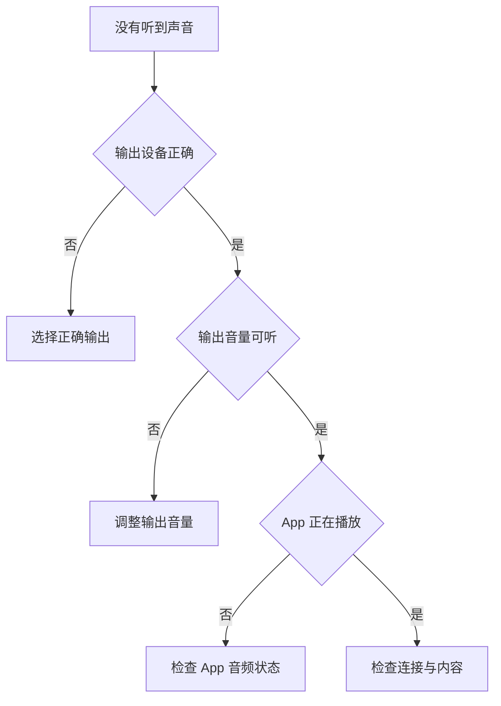

# 让声音到达正确设备：提示音、输出、输入与音量反馈

当 Mac “没有声音”或“麦克风收不到声音”时，先不要急着拖音量条。Sound 页面包含至少三条独立链路：系统提示音从哪里播放、App 或媒体声音输出到哪里、麦克风从哪个设备输入。它们都可能出现 volume、device、play 等词，却分别管理不同方向。先判断“需要听到什么”还是“需要让别人听到什么”，才能走到正确的设置。

> [!info] 本篇的声音判断
>
> - `Alert sound` 是系统提示，不等于媒体或会议音频。
> - `Output` 负责你听到的声音；`Input` 负责系统或 App 接收的声音。
> - `Alert volume` 与 `Output volume` 是两个可独立调节的音量。
> - `Play feedback when volume is changed` 只决定调音量时是否播放反馈，不改变真实输出设备。

## 先画出声音的方向：系统能播，设备才能听；设备能收，App 才能录

| 声音路径 | 页面英语 | 主要问题 | 常见误解 |
| --- | --- | --- | --- |
| 系统提示 | `Sound Effects`, `Alert sound` | 系统提醒音是否播放、用哪种音色 | 会议对方听不到我的声音 |
| 输出 | `Output`, `Output volume`, `Balance` | 媒体、App、提示音进入哪个听音设备 | 麦克风没有输入 |
| 输入 | `Input`, `Input volume`, `Input level` | Mac 从哪个麦克风或设备接收声音 | 耳机播放声音太小 |
| 反馈 | `Play feedback when volume is changed` | 调整音量时是否听见确认声 | 音量键是否真正改变系统音量 |

声音问题通常不在“声音”这个总分类，而在路径的某一段。例如耳机已经连接但声音仍从内建扬声器播放，是输出设备选择问题；会议 App 看不到音量波形，是输入设备或权限问题；调节音量没有提示声，只可能是 feedback 规则关闭，而不表示输出完全失效。

## 界面实例：系统提示音和声音效果

> 本机截图未包含在公开版本中，以保护原图中的个人信息。

| 完整英文 | 软件语境中文 | 关键边界 |
| --- | --- | --- |
| `Sound Effects` | 声音效果。 | 指系统提示与界面声音，不覆盖所有媒体声音。 |
| `Alert sound` | 提示音。 | 选择系统提醒所使用的音色。 |
| `Play sound` | 播放声音。 | 试听当前提示音，不是开始录音。 |
| `Play sound effects through` | 通过……播放声音效果。 | 指定提示音走哪个输出设备。 |
| `Selected Sound Output Device` | 所选声音输出设备。 | 使用当前 Output 所选设备播放效果。 |
| `Alert volume` | 提示音音量。 | 只调系统提醒的音量。 |
| `Play sound on startup` | 启动时播放声音。 | 管启动提示音是否出现。 |
| `Play user interface sound effects` | 播放用户界面声音效果。 | 管部分点击、警告和界面反馈。 |
| `Play feedback when volume is changed` | 音量改变时播放反馈。 | 只在调整音量时提供确认声。 |

`Play sound effects through` 里的 through 表示声音的输出通道。它不是“通过某个 App 发送声音”，而是“从某个设备播放系统效果”。如果当前值是 `Selected Sound Output Device`，提示音会跟随 Output 页面所选设备；选择另一设备则可让系统提示音走不同通道。

## 提示音与媒体音量：两个 volume 名词不能混用

| 调整项 | 它影响什么 | 适合处理的现象 | 不会直接改变 |
| --- | --- | --- | --- |
| `Alert volume` | 系统警告和提示音的响度 | 通知、错误提示太响或太轻 | 视频、音乐、会议 App 的总输出 |
| `Output volume` | 当前输出设备播放的整体音量 | 耳机或扬声器听不到媒体与 App 音频 | 麦克风收音水平 |
| App 内音量 | 某个 App 的播放或通话音量 | 只有一个 App 声音异常 | 系统提示音音色 |
| `Input volume` | 录音或语音输入的接收水平 | 对方听不见你或输入电平过低 | 你听到的扬声器音量 |

`alert` 是提醒、警告的意思，修饰 volume 后说明这条滑块专门服务系统提示。`output` 则说明音频从设备向外播放。一个准确的排查句是：`The alert volume is audible, but the media output is still going to the wrong device.` 这句话表明提示音与媒体输出已经被分开检查。

> [!tip] 先试听低风险提示音
>
> 想确认声音路径时，优先使用 `Play sound` 试听当前提示音。它比播放私人媒体、发起会议或录制语音更可控。试听前先确认耳机或扬声器音量处于舒适范围，避免突然出现过大的提示音。

## 界面实例：输出设备、音量与左右平衡

> 本机截图未包含在公开版本中，以保护原图中的个人信息。

Output 区域会列出系统可用的输出设备；具体设备名称因电脑、蓝牙耳机、显示器或扩展坞而变化，属于本机动态状态，不写入正文。稳定的学习对象是 selected output、output volume 与 balance。

| 完整英文 | 软件语境中文 | 作用 |
| --- | --- | --- |
| `Output & Input` | 输出与输入。 | 提醒同一页面同时管理两个方向。 |
| `Output volume` | 输出音量。 | 控制当前输出设备播放的整体响度。 |
| `Balance` | 平衡。 | 调整左、右声道的相对比例。 |
| `Decrease volume` | 降低音量。 | 每次减小输出或提示音音量。 |
| `Increase volume` | 提高音量。 | 每次增大输出或提示音音量。 |
| selected output device | 已选输出设备。 | 当前媒体和系统声音的目标设备。 |

`Balance` 不是“总音量平衡”。它通常指左右声道之间的比例：滑块居中时左右声道较均衡，偏向一侧会让那一侧相对更突出。如果你只在一只耳朵听到声音，先确认耳机本身、音频内容和 Balance；不要只把 Output volume 拉到最大。

## 输出设备问题：先看目标设备，再看音量

当没有声音时，最有效的顺序通常是“目标设备 → 输出音量 → App 本身 → 连接状态”。因为音量为零和声音去错设备会产生相同的主观体验，但恢复方式不同。

这个流程避免了“先把所有音量调大”的做法。输出设备不正确时，增大内建扬声器音量不会让蓝牙耳机有声；App 本身暂停时，选择正确设备也不会出现声音。每一步只验证一个条件，更容易说明发生了什么并恢复原值。

## 输入设备与输入电平：麦克风不是扬声器的反面按钮

Sound 页面在 Input 区域列出可接收声音的设备，并显示 `Input volume` 与 `Input level`。`Input volume` 表示系统接收输入的音量或增益水平；`Input level` 是当前是否检测到声音的指示。设备名称、手机接力麦克风或虚拟音频设备可能随本机安装和连接变化，本文不记录具体列表。

| 表达 | 中文理解 | 排查时的作用 |
| --- | --- | --- |
| `Input` | 输入。 | 指声音进入 Mac 的方向。 |
| `Input volume` | 输入音量。 | 调整接收声音的强弱。 |
| `Input level` | 输入电平。 | 观察当前是否有音频信号。 |
| microphone | 麦克风。 | 产生或传入语音信号的设备。 |
| selected input device | 已选输入设备。 | 系统或 App 首选收音来源。 |

如果会议对方听不见你，先确认 Sound 里的 Input level 是否有变化；若没有变化，检查输入设备、物理麦克风、静音状态和 App 权限。若 Input level 有变化而 App 仍没有声音，再到 App 内部确认它是否使用同一麦克风。不要把 Input volume 与 Output volume 当作一个滑块的正反方向。

> [!warning] 系统输入选择不替代 App 隐私授权
>
> 即使在 Sound 页面选中了正确的麦克风，App 仍可能因为 Microphone 权限被拒绝而无法接收声音。设备选择属于声音路径；授权属于 Privacy & Security。两者需要分别检查，不能用一个页面的状态替代另一个页面的结论。

## 系统声音正常而单个 App 异常时，先保留问题范围

系统提示音可以播放、Output device 也正确，并不能证明每个 App 都会有声音。浏览器、会议软件、媒体播放器和录音工具通常还有自己的静音、音轨、输出选择或通话设置。Sound 页面负责为系统提供可用的输入与输出路径；App 决定是否请求并使用这条路径。

| 已验证的事实 | 还不能推出的结论 | 下一步的准确说法 |
| --- | --- | --- |
| `Play sound` 能试听提示音 | 某个视频一定会播放 | `The system alert is audible, so I will check the app’s playback state.` |
| Output device 已选中 | App 没有被静音 | `The output device is correct, but the app may have its own volume control.` |
| Input level 有波动 | 会议 App 已获得麦克风权限 | `The microphone has input, but the app may need permission or a different input selection.` |
| 音量键有反馈 | 当前媒体音轨可听 | `The volume changed, but I still need to verify the media source.` |

这种分层表述能避免为了修复一个 App 而更改全局声音设置。先确认系统的声音路径，再在具体 App 中检查播放、静音、权限和设备选择；若 App 内部已恢复，不需要触碰系统的 Alert volume、Balance 或启动声音规则。

## 启动声音、界面效果与音量反馈：它们是不同层次的确认

| 开关 | 发生时机 | 适合怎样理解 |
| --- | --- | --- |
| `Play sound on startup` | Mac 启动时 | 是否播放启动提示。 |
| `Play user interface sound effects` | 使用部分系统控件时 | 是否播放界面操作和提醒效果。 |
| `Play feedback when volume is changed` | 调整系统音量时 | 是否用声音确认音量变化。 |

三个开关都涉及“播放声音”，但它们不是同一个总开关。关闭 volume feedback 后，音量键仍可能有效，只是你不会听见确认声；关闭 user interface sound effects 不必然停止媒体播放；关闭 startup sound 也不影响日常通知。说明问题时，建议保留对象和时机：`Volume feedback is off, but output volume can still be changed.`

## 两个完整操作案例

### 案例一：只读确认系统提示音从哪里播放

1. 打开 **System Settings → Sound**。
2. 在 Sound Effects 区域找到 `Play sound effects through`。
3. 读出当前规则是否跟随 Selected Sound Output Device。
4. 不按 Play sound，不更改提示音、音量或输出设备。
5. 用英语说明：`I checked which device plays sound effects, but I did not change the alert sound or output device.`

### 案例二：只读区分会议听不到和对方听不到两种问题

1. 在 **Sound → Output & Input** 中确认当前页面显示的是 Output 还是 Input。
2. 对“我听不到”查看 selected output device 与 Output volume。
3. 对“对方听不到我”查看 selected input device 与 Input level。
4. 不切换任何设备、不改变音量，也不打开会议 App。
5. 用英语报告：`For playback, I checked the output device and output volume. For recording, I checked the input device and input level.`

## 常见错误与恢复方式

| 错误 | 为什么会出错 | 更可靠的处理 |
| --- | --- | --- |
| 只调音量条解决没声 | 声音可能去了错误设备 | 先检查 selected output device |
| 用 Alert volume 调视频音量 | 提示音和媒体输出是独立路径 | 检查 Output volume 或 App 内音量 |
| 看见 Input level 以为自己能听到 | Input 是声音进入 Mac，不是播放方向 | 转到 Output 检查耳机或扬声器 |
| 调 Balance 解决麦克风无声 | Balance 管左右输出声道 | 检查 Input 与 App 麦克风权限 |
| 关闭反馈声以为音量键坏了 | feedback 只提供确认音 | 观察实际 Output volume 是否变化 |

## 英语表达规律：through、output、input 与 when

Sound 页面里的介词和方向词决定了声音流向。读句子时，先识别声音由谁产生、经过哪里、最后到哪里。

| 结构 | 界面例句 | 它表达的关系 |
| --- | --- | --- |
| `play … through + 设备` | `Play sound effects through …` | 从指定设备播放。 |
| `output + 名词` | `Output volume` | 声音从 Mac 向外播放。 |
| `input + 名词` | `Input level` | 声音进入 Mac 的信号状态。 |
| `when + 从句` | `when volume is changed` | 在某个事件发生时提供行为或反馈。 |
| `on + 时机` | `on startup` | 在启动这一时刻发生。 |

排查时可以把流向写完整：`The sound is playing through the selected output device, but the alert volume is low.` 如果要描述输入，则改用：`The input level is visible, but the app may need microphone permission.` 两句分别说明了系统声音路径和 App 权限边界。

## 自测

1. Alert volume 与 Output volume 各自影响什么？
2. `Play sound effects through` 中的 through 表示什么？
3. 为什么 Input level 有变化仍不代表你能听见播放声音？
4. Balance 应在什么情形下检查？
5. 用英语说明“我检查了输出设备和输入电平，但没有改变任何声音设置”。

查看参考答案

1. Alert volume 管系统提示音响度，Output volume 管当前输出设备的播放音量。
2. 表示声音从指定的输出设备播放。
3. Input level 表示声音进入 Mac 的信号，播放声音需要检查 Output 路径。
4. 当左右声道听感不均衡时检查；它不是麦克风或总音量设置。
5. `I checked the output device and input level, but I did not change any sound settings.`

## 版本与来源

- 本机界面事实：macOS 27.0 Beta (26A5425a)，采集日期 2026-09-09。
- 功能原理参考：[Change Sound settings on Mac](https://support.apple.com/guide/mac-help/change-sound-settings-mh40507/mac) 与 [If the sound on your Mac isn’t working](https://support.apple.com/guide/mac-help/if-the-sound-on-your-mac-isnt-working-mchlp2071/mac)。
- 输出和输入设备会随蓝牙连接、外接显示器、音频软件和本机硬件而变化。本文保留真实页面的稳定表达，不记录设备名称或其他动态数据。
