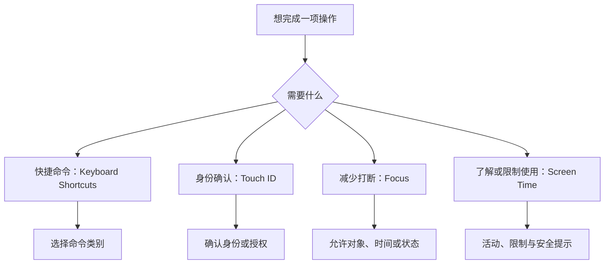
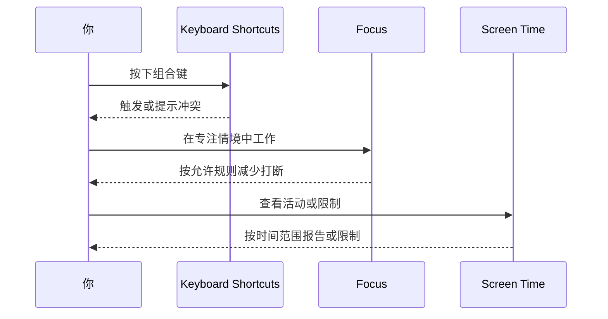

# 不被打断地操作：快捷键、触控、专注与屏幕使用时间

高效使用系统不只是“会按快捷键”。快捷键决定怎样迅速触发命令，触控与身份验证决定怎样确认某些动作，专注模式决定哪些人和来源能打断你，屏幕使用时间决定怎样查看或限制使用模式。它们共同影响你是否能在合适的时候、以合适的输入方式完成操作。学习时要把“输入命令”“确认身份”“减少打断”“查看使用记录”分成四层，避免将专注模式误当快捷键总开关，或将屏幕使用时间误当通知许可。

> [!warning] 不要为了练习改变认证或限制规则
> Touch ID、屏幕使用时间限制、通信安全和专注计划可能影响登录、付款、家人设备或日常提醒。本文只要求阅读现有页面和表达。需要实际修改时，应先确认受影响的用户、时间范围、恢复条件和原始值。

## 学习目标

完成本篇后，你应能解释 `Keyboard Shortcuts` 的类别为什么彼此独立，`Touch ID` 为什么属于身份验证，`Focus` 为什么围绕允许对象和计划，`Screen Time` 为什么包含报告、距离、通信安全和应用活动。你还将能够用英语说“我检查了快捷键或专注条件，没有改变身份验证或时间限制”。

## 四层控制模型

`shortcut` 是更短的操作路径，`authentication` 是确认身份，`focus` 是注意力场景，`limit` 是限制边界。它们都可能影响使用体验，但不属于同一个权限模型。一个来源在专注模式下被静音，不表示它失去通知许可；一项快捷键没有触发，也不表示 Touch ID 或屏幕使用时间出现问题。

## 真实界面：快捷键类别与触控身份确认

> 本机截图未包含在公开版本中，以保护原图中的个人信息。

> 本机截图未包含在公开版本中，以保护原图中的个人信息。

> 本机截图未包含在公开版本中，以保护原图中的个人信息。

> 本机截图未包含在公开版本中，以保护原图中的个人信息。

> 本机截图未包含在公开版本中，以保护原图中的个人信息。

> 本机截图未包含在公开版本中，以保护原图中的个人信息。

> 本机截图未包含在公开版本中，以保护原图中的个人信息。

> 本机截图未包含在公开版本中，以保护原图中的个人信息。

> 本机截图未包含在公开版本中，以保护原图中的个人信息。

> 本机截图未包含在公开版本中，以保护原图中的个人信息。

> 本机截图未包含在公开版本中，以保护原图中的个人信息。

> 本机截图未包含在公开版本中，以保护原图中的个人信息。

> 本机截图未包含在公开版本中，以保护原图中的个人信息。

> 本机截图未包含在公开版本中，以保护原图中的个人信息。

## 真实界面：专注条件与屏幕使用时间

> 本机截图未包含在公开版本中，以保护原图中的个人信息。

> 本机截图未包含在公开版本中，以保护原图中的个人信息。

> 本机截图未包含在公开版本中，以保护原图中的个人信息。

> 本机截图未包含在公开版本中，以保护原图中的个人信息。

> 本机截图未包含在公开版本中，以保护原图中的个人信息。

> 本机截图未包含在公开版本中，以保护原图中的个人信息。

> 本机截图未包含在公开版本中，以保护原图中的个人信息。

> 本机截图未包含在公开版本中，以保护原图中的个人信息。

> 本机截图未包含在公开版本中，以保护原图中的个人信息。

> 本机截图未包含在公开版本中，以保护原图中的个人信息。

### 完整界面表达

| 原文 | 软件语境中文 | 所属层级 | 不应据此推断 |
| --- | --- | --- | --- |
| `Keyboard Shortcuts` | 键盘快捷键 | 命令触发 | 所有输入方式都会被替换。 |
| `Input Sources` | 输入法来源 | 文字输入切换 | 网络输入或账户语言。 |
| `Mission Control` | 调度中心 | 窗口与空间管理 | 通知分组。 |
| `Screen Shots` | 屏幕捕捉 | 捕捉命令 | 讲义内图片权限。 |
| `Touch ID` | 触控 ID | 身份确认 | 键盘快捷键。 |
| `Allowed Apps` | 允许的应用 | 专注模式例外 | 永久通知许可。 |
| `Schedule` | 计划 | 专注自动启停条件 | 立即删除设置。 |
| `App & Website Activity` | 应用与网站活动 | 使用情况报告 | 单个应用的通知状态。 |
| `Communication Safety` | 通信安全 | 内容与通信保护 | 网络加密通道。 |

`shortcut for` 常表示某个命令的快捷方式，`allow ... during focus` 描述专注场景中的例外，`schedule a focus` 表示为专注模式安排触发条件。`Screen Time` 中的 `activity` 是使用行为或活动记录，不是后台活动权限。遇到相同的 `app` 这个词，必须从所在页面判断对象。

## 两个完整观察案例

### 案例一：找出一个命令的正确快捷键类别

1. 打开 **Keyboard → Keyboard Shortcuts**，先看左侧类别，而不是立即改组合键。
2. 如果任务涉及屏幕捕捉，阅读 `Screen Shots`；如果涉及窗口空间，阅读 `Mission Control`；如果涉及输入法切换，阅读 `Input Sources`。
3. 记录目标命令与类别，不新增、移除或覆盖现有快捷键。
4. 用英语说明：`I found the shortcut category for the command, but I did not replace any keyboard shortcut.`
5. 真正需要调整时，先检查冲突提示和原有组合，再一次只改一个命令，保留回退记录。

### 案例二：把“少打断”与“限制使用”分开

1. 阅读 **Focus** 中的 `Allowed Apps`、`Schedule` 与状态说明。
2. 再阅读 **Screen Time** 中的 `App & Website Activity`、通信安全和屏幕距离。
3. 确认专注模式管理的是情境下的打断与例外，屏幕使用时间管理的是观察与限制使用。
4. 用英语报告：`Focus controls interruptions during a context. Screen Time reports or limits use over time.`
5. 不添加自动计划、不更改允许对象、不设置使用限制；如果将来做了变更，应回到对应模块恢复，而不是通过关闭通知总开关处理。

> [!tip] `allowed` 不总是“永久许可”
> 在 Focus 页面中，`Allowed Apps` 的范围是当前专注情境下可打断你的来源；它不是隐私页或通知页的永久授权。读 `allowed` 时必须同时读完页面标题和条件。

## 英语表达规律与搭配

快捷操作与时间管理常用名词复合词：`keyboard shortcuts`、`input sources`、`screen shots`、`screen time`。复合词的最后一个名词通常说明核心对象，前面的词限定领域。报告状态时，`during` 很重要：`This app is allowed during Focus.` 表示仅在某个情境中允许；`over time` 表示跨一段时间的统计或限制。

| 单词 | 音标 | 词性 | 本篇语境义 | 所在完整表达 |
| --- | --- | --- | --- | --- |
| shortcut | /ˈʃɔːrtkʌt/ | n. | 快捷操作路径 | `Keyboard Shortcuts` |
| source | /sɔːrs/ | n. | 输入来源 | `Input Sources` |
| authenticate | /ɔːˈθentɪkeɪt/ | v. | 验证身份 | `Touch ID authentication` |
| focus | /ˈfoʊkəs/ | n./v. | 专注情境 | `Focus` |
| allowed | /əˈlaʊd/ | adj. | 被允许的 | `Allowed Apps` |
| schedule | /ˈskedʒuːl/ | n./v. | 计划；安排 | `Schedule` |
| activity | /ækˈtɪvəti/ | n. | 活动记录 | `App & Website Activity` |

## 用最小范围处理一次“操作被打断”的问题

假设你发现某个操作过程中不断出现提醒，或者你忘记了某个命令的组合键。第一步不是同时关闭通知、修改专注模式、清空屏幕使用时间、重置键盘。应先用一句问题把层级确定：`Is this a shortcut problem, an interruption problem, or a usage-limit problem?` 如果命令本身没有发生，先看快捷键类别；如果命令能发生但被提醒打断，先看 Focus 与通知；如果系统阻止你继续某项活动，再看 Screen Time 的限制或安全提示。

接着建立一条最小观察记录。比如：`The shortcut did not run, but no authentication prompt appeared.` 这说明重点更可能是命令类别或冲突，而不是 Touch ID。又如：`The app was not allowed during this Focus, but its notification permission was still on.` 这说明专注情境影响了打断，不能把结果归因于来源永久失去许可。每句话只陈述已经观察到的事实，并保留不确定性，便于后续恢复。

若必须改变设置，选择一个低影响、可恢复的对象并记录原值。对快捷键，先检查是否冲突，再选择一个不与已知命令冲突的组合；对专注模式，先确认当前情境、开始与结束条件，再只修改一个允许对象；对 Screen Time，先阅读提示所说的范围和时间，而不是通过关闭整项功能绕过问题。完成后回到原页面，核对状态是否回到预期，并用英语记录：`I changed one setting and verified the original scope before I continued.`

> [!warning] 身份验证失败不是快捷键冲突的证据
> Touch ID 的提示、账户认证、键盘组合和使用时间限制来自不同系统层。某项操作失败时，先看页面标题和提示文字，再决定排查方向。不要为了排除一个猜测而取消认证、删除限制或停用专注计划。

## 以时间条件理解自动行为

`at login`、`during Focus`、`after a period of inactivity`、`over time` 是设置页常见的时间线索。它们表明同一个开关可能只在某个时段或条件下起作用。Focus 的 `Schedule` 讨论何时自动进入某个情境；Screen Time 的活动报告讨论一段时间里的使用；键盘快捷键则通常在你按下组合键的瞬间处理。把时间条件读出来，可以避免把“现在没有生效”误解为“设置从未生效”。

## 自测

1. 为什么 `Screen Shots` 和 `Mission Control` 不应放在同一快捷键类别里理解？
2. `Touch ID` 与 `Keyboard Shortcuts` 分别解决什么问题？
3. `Allowed Apps` 在 Focus 页面中的范围是什么？
4. 用英语说“我检查了专注计划，但没有添加自动计划或改变允许来源”。

查看参考答案

1. 前者是捕捉命令，后者是窗口和空间管理；它们的命令对象不同。
2. Touch ID 用于身份确认，快捷键用于快速触发命令。
3. 它是当前专注情境下的例外范围，不是永久通知许可。
4. `I reviewed the Focus schedule without adding an automatic schedule or changing the allowed sources.`

## 版本与来源

本文依据本机 macOS 27.0 Beta (26A5425a) 于 2026-09-09 的采集。可用快捷键、认证能力和时间管理项目会随硬件、账户与配置变化。功能参考 Apple 的 [Create keyboard shortcuts on Mac](https://support.apple.com/guide/mac-help/create-keyboard-shortcuts-mchlp2262/mac)、[Set up a Focus on Mac](https://support.apple.com/guide/mac-help/set-up-a-focus-mchl613dc43f/mac) 与 [Use Screen Time on Mac](https://support.apple.com/guide/mac-help/use-screen-time-mchl6f274a12/mac)。
