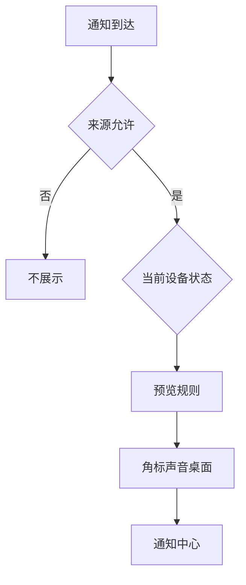

# 安排通知显示：提醒、预览、横幅与锁屏边界

Notifications 页面不是简单的“开或关”。它决定通知何时出现、显示多少文字、能否在锁屏或屏幕共享时展示、哪类 App 可以发送提示，以及通知会以 badges、sounds、desktop 或 time-sensitive 等哪种形式呈现。好的设置不是让所有通知都消失，而是让需要行动的提醒在合适的时间和地点出现，同时避免在他人可见的屏幕上泄露内容。

> [!info] 本篇的通知判断
>
> - `Show previews` 管可见内容的详细程度，不等于是否允许通知。
> - display sleeping、screen locked、mirroring or sharing 是三个不同的显示时机。
> - Badge、Sound、Desktop、Time Sensitive 描述提示方式或优先级，不是同一类开关。
> - 应用名称和当前开关状态是本机动态数据；正文只学习系统提供的稳定表达和设置边界。

## 通知由来源、内容、时机和形式共同决定

| 层次 | 页面英语 | 需要回答的问题 | 典型误解 |
| --- | --- | --- | --- |
| 来源 | `Application Notifications` | 哪些 App 能发送通知？ | 所有 App 的内容都会被同等显示 |
| 内容 | `Show previews` | 通知正文何时可见？ | 是否完全禁止通知 |
| 时机 | `when display is sleeping`, `when screen is locked` | 哪种设备状态下允许显示？ | 正常使用时是否有横幅 |
| 屏幕场景 | `when mirroring or sharing the display` | 演示或共享时怎样保护内容？ | 断开显示器连接 |
| 呈现形式 | `Badges`, `Sounds`, `Desktop`, `Time Sensitive` | 通过什么方式提醒？ | App 是否被安装或打开 |

同一个 App 可以被允许发送声音却不显示桌面横幅，也可以显示角标却不在锁屏展示预览。因而“我想少受打扰”不能直接等于关闭整个 App 的通知；先找到你想调整的是来源、内容、时机还是呈现形式。

## 界面实例：通知中心、预览和显示时机

> 本机截图未包含在公开版本中，以保护原图中的个人信息。

图片中出现的 App 列表、名称和状态属于本机动态内容，不进入正文、搜索、词汇表和练习。以下表格仅保留稳定的系统文字。

| 完整英文 | 软件语境中文 | 准确理解 |
| --- | --- | --- |
| `Customize when and how notifications appear, if they play a sound, and which apps can send them.` | 自定义通知何时、以何种方式出现，是否播放声音，以及哪些 App 能发送通知。 | 一句说明了时间、方式、声音和来源四层。 |
| `Notification Center` | 通知中心。 | 集中查看通知的系统区域。 |
| `top-right corner of your screen` | 屏幕右上角。 | 通知中心默认显示位置的说明。 |
| `show and hide Notification Center by clicking the clock in the menu bar` | 点击菜单栏时钟显示或隐藏通知中心。 | 操作路径，不是通知开关。 |
| `Show previews` | 显示预览。 | 设定通知内容何时可见。 |
| `When Unlocked` | 解锁时。 | 设备解锁后才显示预览内容。 |
| `when display is sleeping` | 显示器休眠时。 | 一个设备状态条件。 |
| `when screen is locked` | 屏幕锁定时。 | 另一种安全相关状态。 |
| `when mirroring or sharing the display` | 镜像或共享显示器时。 | 演示、远程协助或投屏场景。 |
| `Notifications Off` | 通知关闭。 | 在特定共享场景下不展示通知。 |

第一句的语法结构值得完整学习：`when and how notifications appear` 同时问“何时出现”和“怎样出现”；`if they play a sound` 加入声音条件；`which apps can send them` 再限制来源。它告诉你通知并非单一开关，而是多层组合策略。

## 预览：看见通知与看见内容是两件事

`Show previews` 通常有不同的可见性策略，当前界面值可能显示为 `When Unlocked`。这个值的意思是通知仍可以存在，但较详细的内容在设备解锁后才可见。它适合在锁屏时保护消息、验证码、日程标题或其他内容，同时保留有通知到达这一事实。

| 你要实现的目标 | 优先检查 | 不应先做什么 |
| --- | --- | --- |
| 锁屏时不暴露消息正文 | `Show previews` 与 `when screen is locked` | 一次性关闭所有通知来源 |
| 解锁后仍能看到提醒 | 预览策略和 Notification Center | 删除搜索或通知历史 |
| 只减少声音干扰 | App 的 `Sounds` 或系统声音规则 | 隐藏所有桌面通知 |
| 演示时不显示私人内容 | mirroring or sharing 的通知规则 | 改变锁屏密码或断网 |

`preview` 是预览，不是全文访问权限。可以这样精确说明：`Notifications can still arrive, but their previews are shown only when the Mac is unlocked.` 这句话把“能否到达”与“正文何时显示”区分开。

> [!warning] 锁屏与共享屏幕要分别设置
>
> 锁屏面对的是设备暂时无人使用或由他人看到的场景；镜像和共享屏幕面对的是正在演示、远程协助或投屏的场景。前者和后者都可能有隐私风险，但触发条件不同。不要只调整其中一个，就假设另一个场景也已受到保护。

## 休眠、锁屏和屏幕共享：三个 when 条件对应三种环境

| 条件 | 发生在什么时候 | 应关注的风险 | 一个准确句子 |
| --- | --- | --- | --- |
| `when display is sleeping` | 显示器已经休眠 | 提醒可能在无人操作时积累或播放声音 | `I checked notifications while the display is sleeping.` |
| `when screen is locked` | 用户退出到锁屏界面 | 预览或提示可能被附近的人看到 | `Previews are controlled when the screen is locked.` |
| `when mirroring or sharing the display` | 屏幕正被投到其他设备或共享给他人 | 工作内容和私人提醒混在同一画面 | `Notifications are off while the display is being shared.` |

`while the display is being shared` 是被动进行结构，强调当前屏幕正在被共享。`when mirroring or sharing the display` 则把镜像和共享作为并列情形。读这两个表达时，要把 display 当成被镜像或共享的对象，而不是把它误解为“通知正在显示”。

## 应用通知形式：角标、声音、桌面与时间敏感提醒

每个应用条目可能显示 `Off`，也可能列出 `Badges`、`Sounds`、`Desktop` 或 `Time Sensitive`。这些标签是通知形式的概览，帮助你快速判断此应用当前通过哪些通道提醒，而不是代表 App 本身的功能列表。

| 标签 | 软件语境中文 | 它通常表示 | 不等于 |
| --- | --- | --- | --- |
| `Off` | 关闭。 | 该应用通知未以这些形式启用。 | App 被卸载或无法使用。 |
| `Badges` | 角标。 | App 图标可能显示未处理数量或状态点。 | 通知正文一定弹出。 |
| `Sounds` | 声音。 | 通知可播放提示音。 | 系统输出设备一定正确。 |
| `Desktop` | 桌面通知。 | 在桌面上显示横幅或提醒。 | 锁屏也会显示预览。 |
| `Time Sensitive` | 时间敏感。 | 具有时间紧迫性的提醒类别。 | 可以无条件打断所有专注规则。 |

`time-sensitive` 的重点是“与时间有关且需要及时处理”，不是“重要”这个泛泛的形容词。它适合提醒即将到期、需要即时响应或具有时间窗口的事件。是否能在专注模式下展示还可能受 Focus 的规则影响，需要在专注页面单独核对。

## 从 App 条目进入详情时，先分清全局策略和应用策略

Notifications 页面顶部的预览、锁屏和共享规则属于全局策略；某个应用的通知详情属于应用策略。修改 App 的 Desktop 或 Sounds 不会自动改变所有 App 的锁屏预览规则；改全局 Show previews 也不一定关闭某个 App 的时间敏感类别。

这个关系图说明通知显示是连续判断。App 是否能发送只是第一步；随后系统还要判断设备状态、预览可见性和呈现通道。图中不代表所有通知一定出现，因为 Focus、App 内设置和网络状态也可能影响结果。排查时一次检查一层，能避免误关重要提醒。

## 通知中心是查看入口，不是新的通知来源

系统说明指出 Notification Center 位于屏幕右上角，并可通过点击菜单栏时钟显示或隐藏。这里的 `show and hide` 描述的是面板可见性：打开通知中心让你查看已到达的项目，关闭面板只是收起这个区域。它不会为 App 新增发送资格，也不会自动清除一条通知。

| 你做的动作 | 会改变什么 | 不会自动改变什么 |
| --- | --- | --- |
| 点击时钟显示 Notification Center | 通知中心面板是否出现在屏幕上 | 某个 App 是否被允许发送通知 |
| 隐藏 Notification Center | 面板暂时收起 | 通知预览、锁屏或共享屏幕规则 |
| 打开应用通知详情 | 查看该应用的呈现策略 | 其他应用的设置 |
| 清除某条可清除通知 | 该条记录是否继续显示 | App 的未来通知资格 |

当通知中心为空，可能是当前没有可显示的通知，也可能是相关来源或时机规则限制了呈现。不要仅凭面板为空就断言 `Notifications are disabled.` 更准确的描述是：`Notification Center is empty right now, so I need to check whether a notification was sent and which display rule applies.`

## 让重要提醒保留，让低价值提醒变安静

通知整理的目标通常不是单纯“更少”，而是让不同价值的提醒使用不同通道。需要立即处理的事件可以保留时间敏感类别或声音；只需以后查看的项目可以保留角标或通知中心；容易打断思考的项目可先关掉桌面横幅。每次只改一个通道，比整体关闭更容易恢复。

> [!tip] 采用由弱到强的调整顺序
>
> 先减少 Desktop 横幅，再考虑 Sounds，最后才关闭整个应用通知。每一步观察一段时间，确认没有错过必须行动的信息。这样既能降低打扰，也能在发现重要提醒缺失时知道该恢复哪一条规则。

## 两个完整操作案例

### 案例一：只读检查共享屏幕时的通知保护

1. 打开 **System Settings → Notifications**。
2. 找到 `when mirroring or sharing the display`。
3. 读出当前值，并说明它只针对镜像或共享屏幕的情形。
4. 不开始屏幕共享、不改变通知规则，也不打开任何应用通知详情。
5. 用英语报告：`I checked the notification rule for screen sharing, but I did not change any notification setting or start sharing my display.`

### 案例二：区分一个 App 的声音和桌面提醒

1. 在 Application Notifications 中选择一个不含私人内容的条目，只观察其显示的标签。
2. 分别说明 Badges、Sounds 和 Desktop 的含义。
3. 指出 Time Sensitive 是时间紧迫性类别，不等于所有通知。
4. 不改动开关，不发送测试消息。
5. 用英语说明：`I reviewed the app’s notification types, including badges, sounds, and desktop alerts, without changing them.`

## 常见错误与恢复方式

| 错误 | 为什么会误判 | 更可靠的处理 |
| --- | --- | --- |
| 关闭预览后以为通知完全停止 | preview 只控制内容可见性 | 在 Notification Center 检查通知是否仍到达 |
| 为屏幕共享关通知后以为锁屏已安全 | mirroring/sharing 与 locked 是不同条件 | 分别检查两条规则 |
| 看到 Off 以为 App 被删除 | Off 只是通知状态概览 | 到应用或应用通知详情确认功能状态 |
| 把 Time Sensitive 当成可忽略所有规则 | 仍会受系统与 Focus 设置影响 | 到 Focus 检查允许规则 |
| 用关闭所有通知解决一条嘈杂提醒 | 影响范围过大，容易错过重要信息 | 先调整该 App 的声音或桌面形式 |

## 英语表达规律：when、how、which 与 show

通知页面大量使用疑问词引导的名词从句来说明设置范围。掌握这些结构可以帮助你读懂其他软件的提醒设置。

| 结构 | 原文片段 | 它回答的问题 |
| --- | --- | --- |
| `when + 从句` | `when screen is locked` | 在什么状态下？ |
| `how + 从句` | `how notifications appear` | 以什么方式出现？ |
| `which + 名词` | `which apps can send them` | 哪些来源可以执行动作？ |
| `show + 名词` | `Show previews` | 是否显示某类内容？ |
| `from + 来源` | `notifications from iPhone` | 通知来自哪里？ |

如果你需要向同事解释设置范围，可以说：`I adjusted when notifications can appear, not which applications are installed.` 这句话利用 when 与 which 把“显示时机”和“来源范围”明确区分。

## 自测

1. Show previews 与允许通知有什么区别？
2. display sleeping、screen locked、mirroring or sharing 分别指哪种场景？
3. Badges、Sounds、Desktop 与 Time Sensitive 分别表示什么？
4. 为什么屏幕共享的通知规则不能代替锁屏预览规则？
5. 用英语说出“我检查了通知预览和共享屏幕规则，但没有更改任何应用通知”。

查看参考答案

1. Show previews 管详细内容何时可见；允许通知管通知能否到达或显示。
2. 分别是显示器休眠、屏幕锁定、镜像或共享显示器时的场景。
3. 分别是图标角标、提示声音、桌面提醒、时间紧迫的提醒类别。
4. 两者触发条件不同；共享屏幕的规则不自动应用于锁屏界面。
5. `I checked notification previews and the screen-sharing rule, but I did not change any application notification.`

## 版本与来源

- 本机界面事实：macOS 27.0 Beta (26A5425a)，采集日期 2026-09-09。
- 功能原理参考：[Change Notifications settings on Mac](https://support.apple.com/guide/mac-help/change-notifications-settings-mh40583/mac) 与 [Use Notification Center on Mac](https://support.apple.com/guide/mac-help/use-notification-center-mh40609/mac)。
- 应用名称、通知形式和当前开关状态会随本机安装的软件、账户与使用习惯变化。本文不记录这些动态数据，只保留稳定的系统表达、条件关系和恢复路径。
