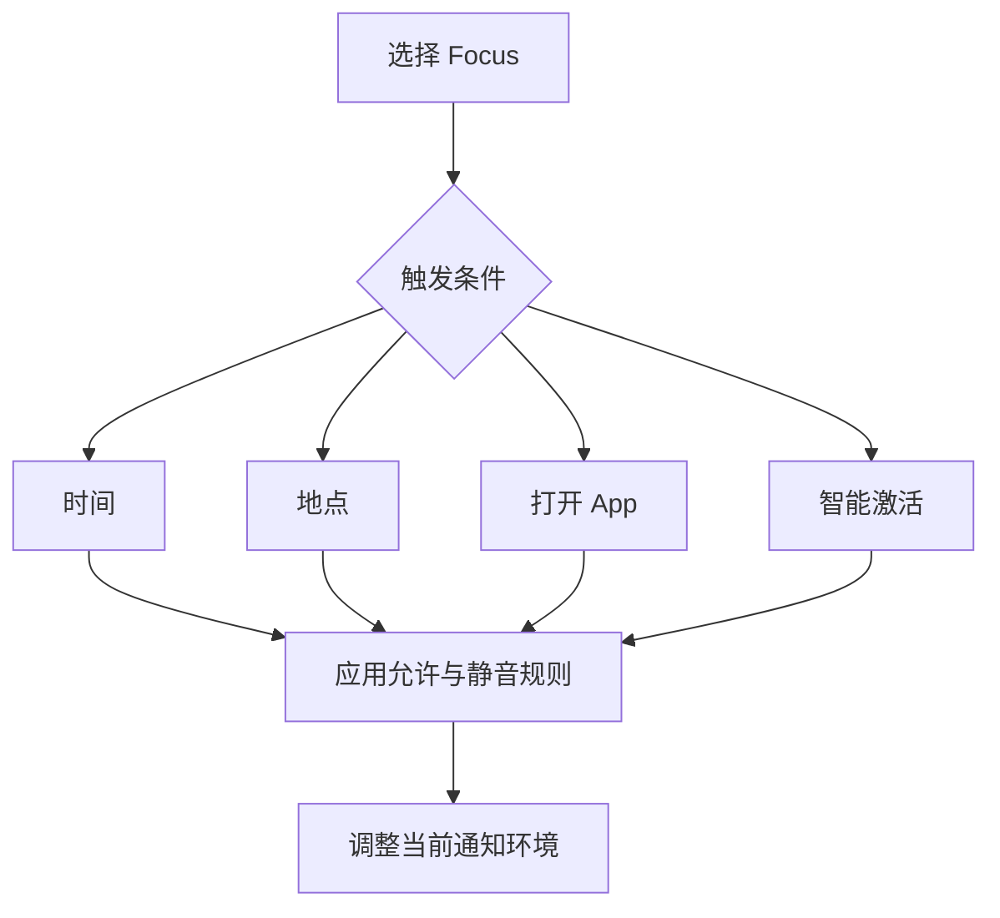

# 用专注模式保护时间：允许对象、自动计划与状态共享

Focus 不是把 Mac 的所有声音、网络和应用全部关闭，而是按当前情境控制哪些通知可以打断你、哪些通知先静音并送到通知中心，以及 App 在专注模式下怎样改变显示或工作内容。Do Not Disturb 是最基础的专注配置；你还可以建立 Reading、Work、Personal 或 Custom 等配置。理解这页的关键，是把“允许的来源”“被静音的对象”“自动开启条件”和“对外共享的状态”分开。

> [!info] 本篇先建立四个边界
>
> - `Allowed People` 和 `Allowed Apps` 决定例外来源，并不是允许所有消息。
> - `silenced and sent to Notification Center` 表示通知先被静音并进入通知中心，不等于永久删除。
> - 时间、地点、App 与 Smart Activation 是不同的自动计划条件。
> - `Focus is shared across your devices` 会影响其他设备；`Focus Status` 是让获授权 App 表示你已静音通知。

## 专注模式是一条通知判定链，而不是全局断网

| 阶段 | 页面英语 | 系统在判断什么 | 不会直接发生什么 |
| --- | --- | --- | --- |
| 选择模式 | `Do Not Disturb`, `Add Focus…` | 使用哪一套专注规则 | 关闭网络或退出 App |
| 设置例外 | `Allowed People`, `Allowed Apps` | 哪些来源的通知可通过 | 让联系人获得系统权限 |
| 处理其他通知 | `silenced and sent to Notification Center` | 被挡住的通知如何留存 | 永久删除通知内容 |
| 自动触发 | `Set a Schedule` | 在何时、何地、何个 App 中启动 | 为所有设备建立相同日程 |
| 调整环境 | `Focus Filters` | 专注开启时 App 与设备怎样表现 | 替代通知来源规则 |
| 共享状态 | `Focus Status` | 谁能知道你已静音通知 | 分享你正在做的具体事情 |

专注模式的目的不是“没有任何提醒”，而是根据当前任务降低无关打断。一个工作配置可以允许同事或关键 App，同时将其他来源静音；阅读配置可以把新闻与社交 App 的桌面横幅安静下来。每个 Focus 可以有不同规则，因此不要把某个模式的设置当成全系统永久策略。

## 界面实例：Do Not Disturb 的例外、计划和过滤器

> 本机截图未包含在公开版本中，以保护原图中的个人信息。

| 完整英文 | 软件语境中文 | 关键理解 |
| --- | --- | --- |
| `Allow Notifications` | 允许通知。 | 设定哪些例外可打断当前 Focus。 |
| `Notifications from selected people and apps will be allowed, all others will be silenced.` | 所选联系人和 App 的通知会被允许，其他都会被静音。 | 一句同时给出例外和默认处理。 |
| `Allowed People` | 允许的联系人。 | 联系人来源的例外列表。 |
| `Allowed Apps` | 允许的 App。 | 应用来源的例外列表。 |
| `Set a Schedule` | 设置计划。 | 定义自动开启条件。 |
| `Have this Focus turn on automatically…` | 让此 Focus 自动开启。 | 指向时间、地点或 App 等触发器。 |
| `Focus Filters` | 专注过滤器。 | Focus 开启时改变 App 或设备行为。 |
| `Customize how your apps and device behave when this Focus is on.` | 自定义此 Focus 开启时 App 与设备的表现。 | 是行为调整，不是通知来源白名单。 |

`selected people and apps` 是并列来源，`all others` 指未被选中的其余来源。`will be silenced` 使用被动语态，描述系统如何处理其他通知；它没有说 `deleted`。这意味着用户可以之后打开 Notification Center 查看，而不是丢失所有信息。

## 允许联系人与允许 App：相同的例外逻辑，不同的来源类型

> 本机截图未包含在公开版本中，以保护原图中的个人信息。

联系人和 App 页面都可能提供 `Allow Some…` 的选择方式。允许联系人页面还包含来电范围与重复来电例外；允许 App 页面可以允许未在名单中的时间敏感通知。两种页面共享“选择例外”原则，但不能彼此替代。

| 设置 | 它处理的来源 | 关键原文 | 需要额外判断的情况 |
| --- | --- | --- | --- |
| `Allow Some People` | 联系人来信、来电等 | `All others will be silenced and sent to Notification Center.` | 是否允许收藏联系人或紧急绕过联系人来电 |
| `Allow Some Apps` | 应用通知 | `notifications from apps you select will be allowed` | 是否允许时间敏感通知立即通过 |
| `Add People` | 新增联系人例外 | `Add People` | 选入名单前确认是否真的需要打断 |
| `Add` | 新增 App 例外 | `Add` | 分清它是 App 例外而不是通知中心入口 |

`Allow incoming calls from only the contacts you added to the Focus, your favorites and Emergency Bypass contacts.` 这句将来电例外分成三种来源：专注名单中的联系人、Favorites、Emergency Bypass contacts。`only` 限制范围，不能读成“这些联系人所有消息都必定通过”；具体消息与来电仍可能受不同页面的规则影响。

> [!warning] 重复来电是一个明确的紧急例外
>
> `A second call from the same person within three minutes will not be silenced.` 意味着同一人短时间内第二次来电可以绕过静音。它适合降低紧急情况被遗漏的风险，也会让连续来电打断专注。修改前先确认这条规则是否符合你的工作场景，不要因为“专注”就假设所有来电都被挡住。

## 时间敏感通知：不在允许列表里也可能立即到达

允许 App 页面有一条特殊开关：`Allow apps not in your allowed list to send notifications marked as Time Sensitive immediately.` 这句话有四个关键限制：app 不在允许列表、通知带有 Time Sensitive 标记、系统允许、并且是立即到达。它不是让所有被静音 App 恢复正常通知。

| 片段 | 中文理解 | 作用范围 |
| --- | --- | --- |
| `apps not in your allowed list` | 不在允许列表的 App | 限定例外的来源。 |
| `marked as Time Sensitive` | 被标记为时间敏感 | 限定通知类别。 |
| `immediately` | 立即。 | 限定送达时机。 |
| `Allow … to send` | 允许发送。 | 是可选例外，不是默认规则。 |

如果你不希望错过临近时间的提醒，这个例外可能有价值；如果需要高度安静的阅读、睡眠或演示环境，则应慎重开启。最准确的说明是：`Time Sensitive notifications can be allowed immediately even when their apps are not on the allowed list.`

## 自动计划：时间、地点、App 与智能激活各有不同条件

> 本机截图未包含在公开版本中，以保护原图中的个人信息。

`Have this Focus turn on automatically at a set time, location, or while using a certain app.` 是自动计划的核心句。它没有说“必须每天开启”，而是列出多种可选触发条件。选择 Time、Location、App 或 Smart Activation 前，应先读清条件与隐私影响。

| 触发器 | 原文线索 | 适合的场景 | 不应误解为 |
| --- | --- | --- | --- |
| Time | `12:30 PM – 2:30 AM` | 固定阅读、工作或睡眠时段 | 永远只在一个日期生效 |
| Location | `When I arrive at Work` | 到达某地点后需要专注 | 手动打开 Focus |
| App | `When I open Books` | 打开特定 App 后减少打扰 | App 自己拥有系统权限 |
| Smart Activation | `Turns on automatically` | 根据系统判断自动激活 | 可预测的固定日程 |

Time 设置中的 `Repeat` 表示计划会按定义的周期重复。Location 中的 `When I arrive at …` 使用现在时描述未来触发事件；App 中的 `When I open …` 表示打开特定 App 的那一刻。四种条件都可以理解为“在某个上下文中启动”，但触发信号不同。

图中的四种触发器都汇入同一套专注规则：模式启动以后，Allowed People、Allowed Apps、过滤器和状态共享按这个 Focus 的设置发挥作用。自动计划不会替你替换规则本身；它只决定何时让规则生效。创建计划后，应验证实际触发条件，避免把地点或 App 条件误配到不希望安静的时段。

## Focus Filters：改变工作环境，不等于静音来源

> 本机截图未包含在公开版本中，以保护原图中的个人信息。

Focus Filters 的说明是：`Customize apps during Do Not Disturb. Selected apps will be notified when this Focus turns on or off.` 它把重点放在 Focus 开启或关闭时，选中的 App 如何改变自己的显示或内容范围。页面可提供 Calendar、Mail、Messages、Safari 等过滤器，但具体可选内容会随 App 和系统版本变化。

| 过滤器 | 原文 | 它可能改变的对象 | 不等于 |
| --- | --- | --- | --- |
| 日历 | `Filter Calendars` | 某些日历是否显示 | 允许哪位联系人通知你 |
| 邮件 | `Filter Inboxes` | 某些收件箱呈现方式 | 关闭 Mail 的通知总开关 |
| 信息 | `Filter Conversations` | 某些会话怎样显示 | 删除会话记录 |
| Safari | `Set Profile or Tab Group` | 当前 Profile 或标签组 | 所有浏览器数据消失 |

Focus Filters 与 Allowed Apps 的差别是：Allowed Apps 解决“通知能否打断”，Filters 解决“专注期间 App 怎么呈现内容”。一个 App 可以被允许通知，但仍在 Focus 中使用过滤器；反过来，一个过滤器存在也不代表该 App 通知会通过。

## 设备同步与 Focus Status：共享规则和共享说明不是同一件事

Focus 首页可能显示 `Focus is shared across your devices, and turning one on for this device will turn it on for all of them.` 这说的是模式开关会跨设备同步。Focus Status 则说明：获你允许的 App 可以显示你已静音通知。前者影响自己的其他设备，后者只让特定 App 传达一个有限状态。

| 功能 | 它共享什么 | 不会分享什么 |
| --- | --- | --- |
| `Focus is shared across your devices` | 某个 Focus 是否开启 | 具体通知正文或联系人列表 |
| `Focus Status` | 你已静音通知这一事实 | 你正在阅读、工作或所在地点的细节 |
| `Share From` | 哪些 Focus profile 可共享状态 | 所有 App 的完整通知设置 |

`When a Focus is on, apps that you allow can show that you have notifications silenced.` 的主语是获允许的 apps，结果是“可以显示你已静音通知”。它不是把通知内容发给 App，也不是自动把你的专注名称公开。若你不希望某个 App 知道静音状态，应检查 Focus Status 的授权和 Share From 范围。

> [!note] 跨设备同步前先确认影响面
>
> 若 Focus 共享已开启，在 Mac 上打开某个模式可能同时影响其他设备。第一次配置自动计划时，先确认哪些设备会受到影响；否则一个只为桌面阅读设计的规则可能意外改变手机的通知体验。

## 两个完整操作案例

### 案例一：只读检查请勿打扰时保留哪些例外

1. 打开 **System Settings → Focus → Do Not Disturb**。
2. 读取 `Allowed People` 与 `Allowed Apps` 当前概览。
3. 解释 selected people and apps 是允许来源，其余通知被静音并进入 Notification Center。
4. 不添加联系人、App 或时间敏感例外。
5. 用英语报告：`I reviewed the allowed people and apps for Do Not Disturb, but I did not change any exception list.`

### 案例二：只读比较自动计划的触发方式

1. 在 Do Not Disturb 中选择 **Add Schedule…**。
2. 阅读 Time、Location、App 和 Smart Activation 的说明。
3. 用一句话说明它们分别依据时段、地点、打开 App 和智能判断启动。
4. 不保存任何计划，选择 Cancel 返回。
5. 用英语说明：`I compared time, location, app, and smart activation triggers without adding a Focus schedule.`

## 常见错误与恢复方式

| 错误 | 为什么会误判 | 更可靠的处理 |
| --- | --- | --- |
| 以为 Do Not Disturb 删除了通知 | 原文说静音后送到 Notification Center | 在通知中心确认是否仍可查看 |
| 允许一个 App 后以为它的内容都不受限制 | 允许的是通知来源，不是 App 内容或权限 | 分别检查通知、过滤器和隐私权限 |
| 设置地点计划后以为所有设备不受影响 | Focus 可能跨设备共享 | 查看 Focus is shared across your devices |
| 把 Focus Filters 当作联系人白名单 | Filters 管 App 表现，白名单管通知来源 | 先判断自己要改“提醒”还是“内容视图” |
| 看到 Time Sensitive 就认为所有静音失效 | 它是条件化例外，需要相应开关 | 检查允许时间敏感通知的具体设置 |

## 英语表达规律：allow、silence、while 与 automatically

Focus 的说明用动词和条件词表达非常精确的规则。读清动作和条件，才能知道某个模式是“立即改变”还是“在特定情境中改变”。

| 结构 | 原文片段 | 它说明什么 |
| --- | --- | --- |
| `allow + 名词` | `Allow Notifications` | 允许哪些来源成为例外。 |
| `be silenced and sent to …` | `silenced and sent to Notification Center` | 通知被静音但保留到指定位置。 |
| `while + -ing` | `while using a certain app` | 在使用某 App 的期间触发。 |
| `turn on automatically` | `Have this Focus turn on automatically` | Focus 按条件自行开启。 |
| `when + 从句` | `when this Focus is on` | Focus 开启时的行为范围。 |

向别人描述一个可恢复的配置，可以说：`This Focus turns on automatically while I use the reading app, allows only selected notifications, and sends all others to Notification Center.` 这句话依次说明触发条件、允许范围和被静音通知的去向。

## 自测

1. Allowed People 与 Allowed Apps 分别管什么？
2. 被静音并送到 Notification Center 的通知是否等于被删除？
3. Time、Location、App、Smart Activation 的触发条件有什么差别？
4. Focus Filters 与 Allowed Apps 的职责如何不同？
5. 用英语说出“我查看了专注模式的自动计划，但没有添加任何计划或例外”。

查看参考答案

1. 前者管理联系人来源的通知例外，后者管理 App 来源的通知例外。
2. 不等于。它们被静音并送到通知中心，之后仍可查看。
3. 分别依据时间、到达地点、打开 App 和系统智能判断触发。
4. Focus Filters 改变 App 或设备在专注期间的表现；Allowed Apps 决定哪些 App 的通知可通过。
5. `I reviewed the automatic Focus schedule, but I did not add any schedule or notification exception.`

## 版本与来源

- 本机界面事实：macOS 27.0 Beta (26A5425a)，采集日期 2026-09-09。
- 功能原理参考：[Change Focus settings on Mac](https://support.apple.com/guide/mac-help/change-focus-settings-mchl08d3d38c/mac) 与 [Use a Focus on Mac](https://support.apple.com/guide/mac-help/use-a-focus-on-mac-mchl8b7f1a46/mac)。
- 可用 Focus 类型、联系人、App、过滤器和跨设备状态都随本机账户、已安装 App 与同步设置变化。本文仅保留可验证的系统表达与行为边界，不写入动态名单或个人状态。
