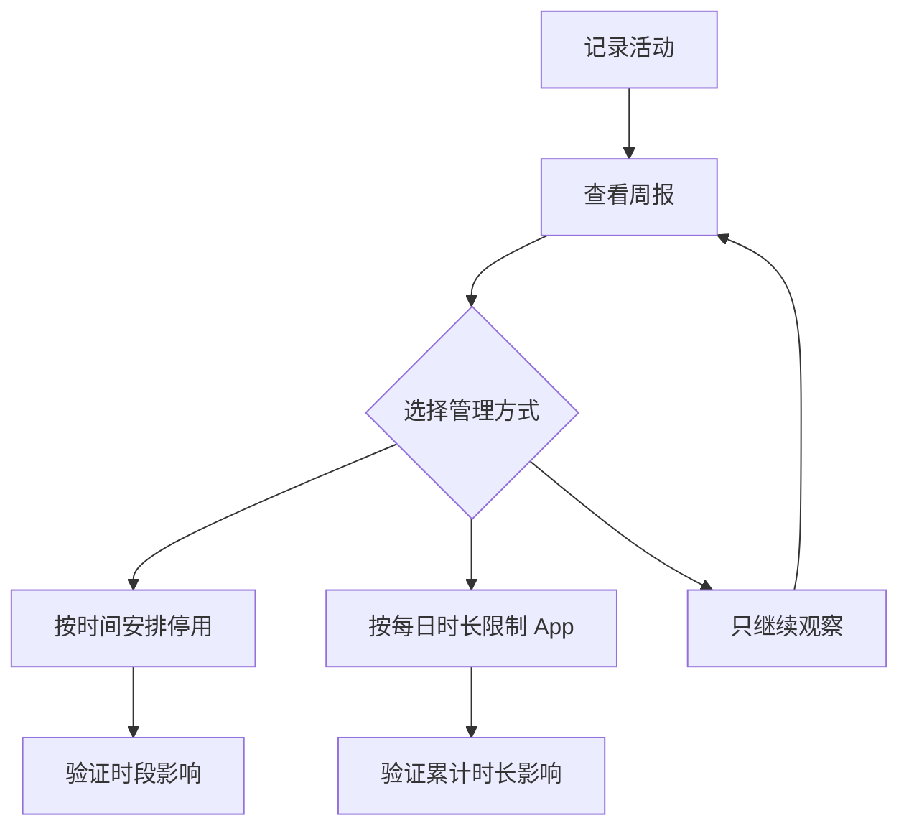

# 把屏幕使用时间变成可恢复的规则：报告、限制与同步

Screen Time 把“看一看自己用了多久”和“限制某些使用行为”放在同一个入口里，但二者不是一回事。App & Website Activity 用来记录并展示时长，Scheduled Downtime 用来安排远离屏幕的时间，App Limits 用来设置每日上限；Communication Limits 和 Content & Privacy 则处理沟通范围与内容、购买、下载、隐私设置的限制。学习这页时，先确定自己是在查看、安排还是限制，再决定是否需要改动。

> [!warning] 限制类设置会影响其他使用者或设备
>
> Screen Time 既可用于个人自我管理，也可用于儿童设备和家庭设备。启动 App Limit、Content & Privacy 或 passcode 前，先确认设置作用于谁、是否跨设备同步、如何恢复。第一次学习优先阅读页面和记录当前状态，不需要开启限制。

## Screen Time 的四种能力：记录、计划、限制和保护

| 能力 | 页面英语 | 它解决什么 | 不等于 |
| --- | --- | --- | --- |
| 记录 | `App & Website Activity`, `Weekly reports` | 看到时间花在 App、网站等项目上的分布 | 自动限制任何 App |
| 计划 | `Scheduled Downtime` | 规定何时离开屏幕或减少可用内容 | 关闭整台设备 |
| 限制 | `App Limits`, `Communication Limits`, `Content & Privacy` | 设定具体类别、沟通或内容边界 | 删除 App、联系人或文件 |
| 保护与同步 | `Share across devices`, `Use a passcode` | 跨设备一致性和设置防修改 | 自动建立家庭共享关系 |

同样是“少用手机或电脑”，Activity 是观察事实，Downtime 是安排时间，App Limits 是设置上限。把统计页面误当成限制页面，或把限制开关误当成报告开关，都可能得到与预期相反的结果。

## 界面实例：Screen Time 的层级与同步边界

> 本机截图未包含在公开版本中，以保护原图中的个人信息。

| 完整英文 | 软件语境中文 | 关键理解 |
| --- | --- | --- |
| `Adults can set parental controls for a child's device` | 成人可为儿童设备设置家长控制。 | 说明该模块也支持家庭管理，不代表当前设备已受管理。 |
| `Limit Usage` | 限制使用。 | 汇集时长记录与限制规则。 |
| `App & Website Activity` | App 与网站活动。 | 记录时长并提供分析与限制入口。 |
| `Screen Distance` | 屏幕距离。 | 关注观看距离，不是使用时长。 |
| `Communication Limits` | 通信限制。 | 限制通话、信息或联系人沟通范围。 |
| `Communication Safety` | 通信安全。 | 与敏感沟通内容相关的保护功能。 |
| `Content & Privacy` | 内容与隐私。 | 限制内容、购买、下载或隐私设置。 |
| `Share across devices` | 跨设备共享。 | 让 Screen Time 设置在登录同一 iCloud 的设备间同步。 |
| `Use a passcode to secure Screen Time settings.` | 使用密码保护屏幕使用时间设置。 | 防止未经授权地更改规则。 |

`including app limits, content and web access, and approval requests` 是对 parental controls 范围的列举：包含 App 上限、内容与网页访问、批准请求。`including` 表示包含，不一定穷尽页面中所有功能；它不表示每一项已经在当前设备开启。

## 使用报告：先获得洞察，再决定是否设限

App & Website Activity 引导页写着 `Keep track of your screen time? Get insights and set limits for your screen time.` 这句先问你是否想跟踪屏幕时间，再给出两个结果：获得 insights，并设置 limits。它并没有强制把“查看统计”与“设置限制”绑在一起。

| 原文 | 软件语境中文 | 你能据此做什么 |
| --- | --- | --- |
| `Weekly reports let you know the amount of time spent on apps, websites, and more.` | 每周报告让你知道在 App、网站等项目上的使用时长。 | 比较使用分布，识别需要调整的类别。 |
| `Scheduled Downtime` | 计划的停用时间。 | 安排一段离开屏幕的时间。 |
| `Set a schedule for time away from the screen.` | 设置远离屏幕的时间表。 | 设定时间规则，而不是关闭显示器。 |
| `App Limits` | App 限制。 | 为 App 使用设定每日上限。 |
| `Set daily time limits for app usage.` | 为 App 使用设置每日时间上限。 | 先明确限制对象与每日范围。 |

`the amount of time spent on …` 是“花在……上的时间量”。它回答的是使用情况，不评判使用是否好或坏。第一次打开报告时，建议把它当成观察工具：先看趋势，再判断有没有必要设日上限。可以这样报告：`I reviewed the weekly report before deciding whether to set an app limit.`

> [!tip] 先记录事实，再增加限制
>
> 如果一开始就设定很严的限制，很难判断它是否真的解决了问题。先观察一周的使用报告，明确是某一类 App、某个时间段还是无目的打开导致时间增加。之后只为一个明确对象设置一条可恢复规则，效果更容易验证。

## 停用时间与 App 限制：时间表和总时长分别控制什么

| 功能 | 触发依据 | 直接结果 | 不是 |
| --- | --- | --- | --- |
| `Scheduled Downtime` | 某个时间段 | 在安排的时段减少或限制可用内容 | 统计一天已经用多久 |
| `App Limits` | 每日累计时长 | 使用达到上限时应用限制规则 | 指定晚上几点开始休息 |
| `App & Website Activity` | 记录到的活动 | 生成分析或报告 | 自动阻止使用 |
| `Screen Distance` | 观看距离或相关检测 | 提示调整与屏幕的距离 | 设置时间预算 |

`Downtime` 的核心是“时间段”，`daily time limits` 的核心是“每天累计多久”。例如晚上九点后希望减少屏幕使用，应研究 Scheduled Downtime；若某个 App 每天总共只能用一定时长，应研究 App Limits。两个规则可以一起使用，但发生意外限制时也需要知道是哪一条触发。

这条流程避免了在没有使用事实的情况下堆叠多个限制。停用时间与每日 App 上限都能影响使用，但前者按时钟触发，后者按累计时长触发。验证时需要分别确认当前是否在计划时段、今天是否已达到上限，才能知道如何恢复。

## 通信限制：联系人范围与紧急号码例外

> 本机截图未包含在公开版本中，以保护原图中的个人信息。

Communication Limits 的原文说明：`Limits apply to Phone, FaceTime, Messages, and iCloud contacts.` 这句明确列出了限制适用的应用和联系人范围。后面还写着 `Communication to known emergency numbers identified by your carrier is always allowed.`，说明由运营商识别的已知紧急号码始终允许通信。

| 表达 | 中文理解 | 必须保留的边界 |
| --- | --- | --- |
| `During Screen Time` | 在屏幕使用时间期间。 | 适用于一般使用时段的沟通规则。 |
| `During Downtime` | 在停用时间期间。 | 适用于计划停用时段的规则。 |
| `one-on-one and group conversations` | 一对一和群组对话。 | 同时覆盖个人与群组沟通。 |
| `including unknown numbers` | 包括未知号码。 | 放宽到未知号码的范围。 |
| `always allowed` | 始终允许。 | 明确的紧急例外，不是所有联系人例外。 |

“通信限制”不代表通话程序被卸载，也不代表网络关闭。它按规则限制某些沟通对象或范围。若设置影响到预期来电或信息，先确认当前处于 Screen Time 还是 Downtime，再确认允许的是已添加联系人、Favorites 还是任何人。

> [!warning] 紧急例外不能被当作一般白名单
>
> 紧急号码始终允许是安全保护。它不意味着所有未知联系人都自动可用，也不应被用于绕过沟通限制。设置家庭设备前，先向使用者说明紧急沟通仍会保留，普通沟通范围则按规则处理。

## 内容与隐私：限制页面和隐私权限页面的关系

> 本机截图未包含在公开版本中，以保护原图中的个人信息。

Content & Privacy 的开关说明为 `Restrict explicit content, purchases, downloads, and privacy settings.` 这是一个范围很大的限制入口。它可以限制显式内容、购买、下载与隐私设置的更改；这与 Privacy & Security 页面中授予某个 App 摄像头或麦克风权限不是同一层操作。

| 项目 | 作用对象 | 典型用途 | 不应理解为 |
| --- | --- | --- | --- |
| `App Store, Media, Web, & Games` | 商店、媒体、网页和游戏内容 | 调整内容访问与购买相关范围 | 直接卸载已安装 App |
| `Siri` | Siri 相关内容或功能限制 | 限制某些 Siri 使用边界 | 切换 Siri Voice |
| `Store Restrictions` | 商店层面的限制 | 限制购买、下载或内容获取 | 管理网络带宽 |
| `App & Feature Restrictions` | App 与功能入口 | 限制特定功能可用性 | 删除所有数据 |
| `Preference Restrictions` | 设置更改权限 | 防止关键设置被修改 | 改变当前每项设置值 |

许多子入口在总开关关闭时会处于 disabled 状态。`disabled` 在这里说明“当前不能进入或修改”，不是“功能不存在”。若要排查一个页面为什么灰色，先看上层 `Restrict …` 开关是否启用，以及设备是否需要 passcode 或家庭管理权限。

## 跨设备共享、密码和 Family Sharing：三种“多设备”关系不同

| 功能 | 原文线索 | 它解决的事 | 不会自动完成 |
| --- | --- | --- | --- |
| `Share across devices` | `sync your Screen Time settings` | 同一 iCloud 登录设备间同步设置 | 邀请家庭成员加入家庭共享 |
| `Use a passcode` | `secure Screen Time settings` | 防止设置被随意改动 | 加密所有屏幕时间数据 |
| `Set Up Family Sharing` | `use screen time with your family's devices` | 为家庭设备建立管理关系 | 让当前个人设置自动应用到陌生设备 |

Share across devices 关心的是同一 iCloud 登录设备之间的同步；Family Sharing 关心的是家庭成员设备的管理关系；passcode 关心的是谁可以改变这些规则。三者名字都可能让人想到“跨设备”，但建立的关系不同。可以这样清晰表达：`Sharing settings across my devices is different from setting up Family Sharing for another person's device.`

## 两个完整操作案例

### 案例一：只读比较报告、停用时间和 App 限制

1. 打开 **System Settings → Screen Time**。
2. 阅读 App & Website Activity 的说明，找出 weekly reports、Scheduled Downtime 与 App Limits。
3. 分别说出它们对应报告、按时段管理与每日时长管理。
4. 不开启 Activity、不添加限制，也不设定计划。
5. 用英语报告：`I compared activity reports, scheduled downtime, and app limits without turning on any Screen Time restriction.`

### 案例二：只读确认内容限制和隐私授权不是同一层

1. 在 Screen Time 中打开 **Content & Privacy**。
2. 阅读 `Restrict explicit content, purchases, downloads, and privacy settings.`
3. 说明这页限制的是内容与设置更改，而 App 的麦克风或照片授权应到 Privacy & Security 查看。
4. 不开启总开关，不进入任何灰色子项。
5. 用英语说明：`I reviewed Content & Privacy restrictions, but I did not change any content rule or app privacy permission.`

## 常见错误与恢复方式

| 错误 | 为什么会误判 | 更可靠的处理 |
| --- | --- | --- |
| 以为周报会自动限制 App | 报告与限制是独立能力 | 明确选择 App Limits 或只观察报告 |
| 用 Downtime 解决每日总时长 | Downtime 按时间段触发 | 根据问题选择 Scheduled Downtime 或 daily limit |
| 把 Communication Limits 当成断网 | 它只限制沟通对象与范围 | 检查 Phone、Messages 等沟通规则 |
| 以为 Content & Privacy 会直接授予或撤销麦克风权限 | 它限制设置与内容访问范围 | 到 Privacy & Security 检查具体 App 权限 |
| 打开 Share across devices 后以为家庭设备已受管理 | 同步与 Family Sharing 是不同关系 | 明确设备是否同一 iCloud 或家庭成员设备 |

## 英语表达规律：keep track、set limits、during 与 across

Screen Time 页面用动词短语说明从观察到限制的过程。掌握这些表达能够让你准确说出设置行为，而不是只说“限制时间”。

| 结构 | 原文片段 | 它表达什么 |
| --- | --- | --- |
| `keep track of` | `Keep track of your screen time` | 持续记录或追踪。 |
| `set limits for` | `Set limits for your screen time` | 为某项使用设定上限。 |
| `during + 时段` | `During Downtime` | 在特定时间段中适用。 |
| `apply to + 对象` | `Limits apply to …` | 限制作用于哪些对象。 |
| `across + 范围` | `Share across devices` | 在多个设备之间共享或同步。 |

如果要写出一次安全的自我管理动作，可以说：`I used the weekly report to keep track of my screen time before setting a limit for one app category.` 这句话按真实顺序说明观察和限制，不会暗示系统已经替你做出决定。

## 自测

1. App & Website Activity、Scheduled Downtime 与 App Limits 分别做什么？
2. Communication Limits 的 emergency numbers 例外说明了什么？
3. Content & Privacy 与 Privacy & Security 中的 App 权限有什么差别？
4. Share across devices、passcode 与 Family Sharing 分别建立什么关系？
5. 用英语说明“我查看了每周报告，但没有设置任何 App 上限或停用时间”。

查看参考答案

1. 分别用于记录使用情况、按时间段安排远离屏幕、按每日累计时长限制 App 使用。
2. 已知紧急号码始终可通信，这是安全例外，不表示所有联系人不受限制。
3. 前者限制内容、购买、下载或设置更改；后者管理具体 App 是否可访问麦克风、照片等敏感资源。
4. 分别同步同一 iCloud 设备的设置、保护设置避免被修改、建立家庭设备管理关系。
5. `I reviewed the weekly report, but I did not set any app limit or scheduled downtime.`

## 版本与来源

- 本机界面事实：macOS 27.0 Beta (26A5425a)，采集日期 2026-09-09。
- 功能原理参考：[Use Screen Time on Mac](https://support.apple.com/guide/mac-help/use-screen-time-mchl6e7ea037/mac) 与 [Change Screen Time settings on Mac](https://support.apple.com/guide/mac-help/change-screen-time-settings-mchl2dcdca29/mac)。
- 可用报告、限制子项、家庭共享与 App 活动数据会随账户、设备和设置状态变化。本文使用当前页面的稳定表达，不记录个人使用数据、联系人或动态 App 名称。
