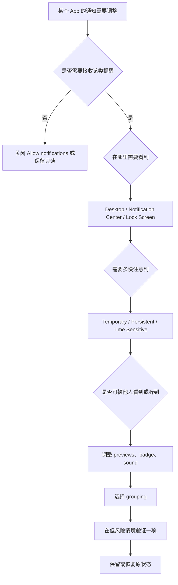

# 管理应用通知：权限、预览、分组与通知摘要

“通知太多”通常不是一个开关的问题。某个 App 是否可以发送通知、通知会出现在哪些位置、横幅是 Temporary 还是 Persistent、是否显示角标、是否播放声音、预览显示多少内容、同类通知怎样分组、是否允许 Time Sensitive notifications，都是独立层次。把它们全部理解为“打开或关闭通知”，会导致要么错过真正需要的提醒，要么不得不忍受不必要的中断。

> [!warning] 不要用真实 App 的通知作为测试内容
>
> 通知可能暴露私信、验证码、日程、工作内容、联系人或设备状态。本文不记录本机应用清单、通知状态、消息内容或个人账户资料；不为测试开启陌生 App 通知，不改变实际工作、支付、通信或安全 App 的提醒规则。学习可使用系统页面的只读观察，或在自己完全可控的低风险 App 中测试一个可恢复选项。

## 学习目标

完成本篇后，你能区分总览页和 App 详情页；解释 Desktop、Notification Center、Lock Screen、Temporary、Persistent、Badge application icon、Play sound、Show previews、Notification grouping 和 Time sensitive notifications；按任务选择最小通知范围；并能用英语说明“这个 App 可以通知我什么、在哪里出现、何时需要声音、怎样恢复”。

## 通知由五层组成

| 层级 | 常见英语 | 它解决什么 | 容易混淆的点 |
| --- | --- | --- | --- |
| 总许可 | `Allow notifications` | App 是否能向系统发送通知。 | 开启不代表所有呈现位置都相同。 |
| 呈现位置 | `Desktop`、`Notification Center`、`Lock Screen` | 通知会在哪些区域出现。 | 同一通知不一定要在每处显示。 |
| 提醒行为 | `Temporary`、`Persistent`、`Time Sensitive` | 横幅停留方式与时效性。 | 持续不等于更重要，时效性不等于紧急服务。 |
| 视觉与声音 | `Badge application icon`、`Play sound`、`Show previews` | 角标、声音和内容可见度。 | 关闭声音不等于关闭通知。 |
| 聚合与摘要 | `Notification grouping`、summary。 | 多条通知如何组织。 | 分组不等于删除，摘要不等于忽略。 |

## 操作路径与“先总览后详情”原则

路径是 **Apple menu → System Settings → Notifications**。页面上方的 Notification Center 区域控制预览、睡眠、锁屏、屏幕共享等全局条件；下方 `Application Notifications` 列出各 App 及其状态摘要。进入某个 App 后，才会看到它自己的 `Allow notifications`、呈现位置、Alert Style、badge、sound、previews 和 grouping。

总览页回答“系统在什么时候、什么环境下显示通知”；App 页回答“某一个 App 以怎样方式通知”。不要只在 App 页关闭某个开关，就以为已处理锁屏或屏幕共享的全局可见性；也不要只改总览中的预览规则，就以为某个 App 的总许可已被撤销。

> [!tip] 先问“我要减少哪一种中断”
>
> 如果问题是横幅不停出现，检查 Desktop 与 Alert Style；如果问题是锁屏泄露内容，检查 Lock Screen 与 Show previews；如果问题是角标造成焦虑，检查 Badge application icon；如果问题是声音打断，检查 Play sound。把症状对应到一层，比一键关闭所有通知更准确。

## 界面实例：总览页把环境条件和 App 列表分开

> 本机截图未包含在公开版本中，以保护原图中的个人信息。

本机列表中的 App 名称与状态是用户环境数据，不能作为本文词表、索引或示例。稳定可学习的内容包括：`Customize when and how notifications appear, if they play a sound, and which apps can send them.`、`Notification Center`、`Show previews`、`when display is sleeping`、`when screen is locked`、`when mirroring or sharing the display` 和 `Application Notifications`。

| 完整界面表达 | 软件语境中文 | 应如何理解 |
| --- | --- | --- |
| `Customize when and how notifications appear, if they play a sound, and which apps can send them.` | 自定义通知何时、如何出现，是否播放声音，以及哪些 App 可发送通知。 | 总览说明涵盖时间、呈现、声音和 App 许可。 |
| `Notification Center` | 通知中心。 | 查看和整理通知的系统区域。 |
| `Show previews` | 显示预览。 | 控制通知内容预览的可见程度。 |
| `Show Notifications when display is sleeping` | 显示器休眠时显示通知。 | 与显示器休眠状态相关的全局条件。 |
| `when screen is locked` | 当屏幕锁定时。 | 锁屏可见性条件。 |
| `when mirroring or sharing the display` | 当镜像或共享显示器时。 | 投屏、演示、远程协助时的隐私条件。 |
| `Notifications Off` | 通知关闭。 | 当前在某一环境下不显示通知。 |
| `Application Notifications` | 应用通知。 | 逐 App 配置的列表。 |
| `Allow notifications from iPhone` | 允许来自 iPhone 的通知。 | 跨设备通知的单独入口。 |

`when mirroring or sharing the display` 是重要隐私表达。mirroring 指镜像显示，sharing the display 指共享屏幕。演示、远程支持、课堂或会议中，通知预览可能让旁人看到本不应公开的内容。因此这项条件不应被理解为“网络状态”，而是“当前屏幕是否正被他人看到”的环境判断。

### 本页全部单词

| 单词 | 音标 | 词性 | 本页含义 | 所在完整表达 |
| --- | --- | --- | --- |
| customize | /ˈkʌstəmaɪz/ | v. | 自定义。 | `Customize when and how` |
| notifications | /ˌnoʊtɪfɪˈkeɪʃənz/ | n.复数 | 通知。 | `notifications appear` |
| appear | /əˈpɪr/ | v. | 出现。 | `notifications appear` |
| sound | /saʊnd/ | n. | 声音。 | `play a sound` |
| apps | /æps/ | n.复数 | 应用程序。 | `which apps can send` |
| previews | /ˈpriːvjuːz/ | n.复数 | 预览。 | `Show previews` |
| display | /dɪˈspleɪ/ | n. | 显示器、显示画面。 | `display is sleeping` |
| sleeping | /ˈsliːpɪŋ/ | adj. | 休眠的。 | `display is sleeping` |
| locked | /lɑːkt/ | adj. | 锁定的。 | `screen is locked` |
| mirroring | /ˈmɪrərɪŋ/ | n./v-ing | 镜像显示。 | `mirroring the display` |
| sharing | /ˈʃerɪŋ/ | n./v-ing | 共享。 | `sharing the display` |
| application | /ˌæplɪˈkeɪʃən/ | n. | 应用程序。 | `Application Notifications` |

## 单个 App 页面：从“允许”到“如何出现”

> 本机截图未包含在公开版本中，以保护原图中的个人信息。

App 详情页的页面名称取决于当前设备上的 App，因此本文不把它当作示例重点。无论进入哪个 App，页面结构通常包含 `Allow notifications` 总开关；`Desktop`、`Notification Center`、`Lock Screen` 呈现位置；`Alert Style`；`Temporary` 与 `Persistent`；`Time sensitive notifications`；`Badge application icon`；`Play sound for notification`；`Show previews`；`Notification grouping`。

| 表达 | 软件语境中文 | 实际影响 |
| --- | --- | --- |
| `Allow notifications` | 允许通知。 | App 是否能向系统发通知的总许可。 |
| `Desktop` | 桌面。 | 是否在桌面出现横幅或提醒。 |
| `Notification Center` | 通知中心。 | 是否保留在通知中心。 |
| `Lock Screen` | 锁定屏幕。 | 是否在锁屏显示。 |
| `Alert Style` | 提醒样式。 | 横幅如何停留。 |
| `Temporary` | 临时。 | 横幅短暂出现后自动消失。 |
| `Persistent` | 持续。 | 横幅保留直到被处理或关闭。 |
| `Time sensitive notifications` | 时效性通知。 | 对时间敏感的通知类型许可。 |
| `Badge application icon` | 应用图标角标。 | 图标上是否显示数量或状态标记。 |
| `Play sound for notification` | 为通知播放声音。 | 通知出现时的声音反馈。 |
| `Notification grouping` | 通知分组。 | 同 App 多条通知的组织方式。 |

`Temporary` 与 `Persistent` 不等于“无关”和“重要”。Temporary 表示横幅呈现时间短；Persistent 表示需要你处理或关闭后才消失。任务的重要性还要结合 App 类型、Time Sensitive、声音、锁屏显示和个人工作情境判断。一个工作 App 的日常低优先级信息也可能不应持续占据桌面；一个安全提醒可能即使临时也值得保留在 Notification Center。

`Allow notifications` 的对象是当前 App，范围是系统通知许可。它并不表示 App 获得联系人、照片、麦克风或位置等其他权限；也不代表它在所有环境下都能显示通知，因为总览页可能在 display sleeping、screen locked 或 sharing display 时设置了额外条件。准确说法是：`This app is allowed to send notifications, but the system can still control where and when they appear.`

> [!warning] Time Sensitive 不等于紧急服务
>
> `Time sensitive notifications` 指系统中对时间敏感通知的类别和许可，它不是紧急呼叫、医疗报警或保证必达的服务。启用前应问此 App 是否真的有需要及时处理的事项；不要把普通营销、社交或低优先级更新都提升为时效性通知。

## 预览、角标、声音和分组的隐私与注意力取舍

`Show previews` 决定通知是否展示更多内容；`Badge application icon` 让 App 图标显示状态或未读数量；`Play sound for notification` 控制听觉提示；`Notification grouping` 决定多条通知是否聚合。它们可以组合，但目标不同。

| 你的顾虑 | 优先检查 | 说明 |
| --- | --- | --- |
| 锁屏或共享屏幕会泄露内容 | Show previews、Lock Screen、mirroring/sharing 条件。 | 先减少内容可见性，再判断是否需要关闭所有通知。 |
| 被声音频繁打断 | Play sound。 | 可保留 Notification Center 或 badge，只关闭声音。 |
| 图标红点造成注意力压力 | Badge application icon。 | 关闭角标不等于不接收通知。 |
| 同类通知太分散 | Notification grouping。 | 分组改变组织方式，不会删除消息。 |
| 横幅常常打断输入 | Desktop、Alert Style。 | 可调整桌面呈现与临时/持续样式。 |

### 案例一：为一个低风险 App 减少声音中断

**情境**：一个你拥有的低风险 App 经常发普通更新，通知本身仍有用，但声音打断注意力。

1. 进入 Notifications，确认该 App 的总通知许可是否已经开启。
2. 打开 App 详情，不改 `Allow notifications`，先检查 `Play sound for notification`。
3. 记录原状态，只关闭声音这一项；保留 Notification Center 以便稍后查看。
4. 在普通工作时观察是否仍能在通知中心或角标看到需要的信息。
5. 如果降低声音导致错过真正重要的提醒，恢复原状态或改用更合适的 App 内策略。
6. 用英语总结：`I kept notifications in Notification Center but turned off the sound for this low-priority app. I changed only one reversible setting and checked the result.`

### 案例二：保护演示时的通知内容

**情境**：你将进行屏幕共享或镜像演示，担心通知预览暴露私人信息。

1. 在 Notifications 总览阅读 `when mirroring or sharing the display`。
2. 确认当前环境是演示、投屏或远程协助，而不是普通本机使用。
3. 选择适合演示的全局通知策略，例如在共享显示时显示 `Notifications Off`；不要逐一更改大量 App 的总许可。
4. 在开始正式演示前，用无敏感内容的测试共享确认通知不会意外弹出。
5. 演示结束后检查是否需要恢复原有策略；恢复前先确认不会漏掉必要提醒。
6. 用英语说明：`I turned notifications off while sharing the display because previews could expose private information. I restored the normal policy after the presentation.`

## 常见错误、风险与恢复方式

| 错误 | 为什么不合适 | 更好的做法 |
| --- | --- | --- |
| 一次关闭所有 App 通知。 | 可能错过真正需要的提醒。 | 先按 App、呈现位置或声音逐层调整。 |
| 将 Temporary 当成低优先级。 | 它只表示横幅停留方式。 | 结合通知类别和业务重要性判断。 |
| 把 Notification Center 与 Desktop 当作同一个位置。 | 前者用于查看和整理，后者是即时呈现。 | 分别选择是否显示。 |
| 忽略共享屏幕时的预览。 | 演示可能暴露消息内容。 | 提前检查 mirroring/sharing 条件。 |
| 将 Time Sensitive 全部开启。 | 会增加打断与注意力负担。 | 仅保留确有时效性需求的 App。 |
| 关闭 badge 后以为通知已关闭。 | 角标只是视觉提示之一。 | 同时检查总许可、声音和呈现位置。 |

## 可直接使用的英语表达

| 中文意思 | 英文表达 | 适用场景 |
| --- | --- | --- |
| 我希望保留通知中心，但关闭声音。 | `I want to keep Notification Center notifications but turn off the sound.` | 降低听觉中断。 |
| 这个 App 只需要临时横幅。 | `This app needs temporary alerts only.` | 选择横幅样式。 |
| 屏幕共享时我不显示通知预览。 | `I do not show notification previews while sharing the display.` | 演示与远程支持。 |
| 分组改变组织方式，不会删除通知。 | `Grouping changes how notifications are organized; it does not delete them.` | 解释 grouping。 |
| 我只为确有时效性需求的 App 开启该类别。 | `I enable time-sensitive notifications only for apps with a real time-sensitive need.` | 控制打断范围。 |

## 本篇自测

1. Notifications 总览与单个 App 通知页分别处理什么？
2. Desktop、Notification Center 与 Lock Screen 的区别是什么？
3. Temporary 与 Persistent 的真实差别是什么？
4. Show previews、Badge application icon 和 Play sound 各自影响什么？
5. 为什么屏幕共享时的通知策略需要单独考虑？
6. Time sensitive notifications 为什么不应被全部开启？
7. 请用英语表达：“我只关闭了这个 App 的通知声音，保留了通知中心。”

查看答案

1. 总览处理预览、锁屏、睡眠、共享显示等环境条件和 App 列表；App 页处理单个 App 的许可、呈现、声音、预览和分组。
2. Desktop 是即时横幅或桌面呈现；Notification Center 是集中查看区域；Lock Screen 是锁屏时可见位置。
3. Temporary 横幅会自动消失；Persistent 横幅会持续到用户处理或关闭。两者不直接定义业务重要性。
4. Show previews 控制内容可见度；Badge 控制图标标记；Play sound 控制听觉反馈。
5. 共享显示会让其他人看到屏幕，预览可能暴露私人消息、日程或验证码。
6. 它会增加中断，且并非每个 App 都有真正需要及时处理的通知。
7. `I turned off the notification sound for this app but kept its notifications in Notification Center.`

## 版本差异与参考来源

本篇以本机 **macOS 27.0 Beta (26A5425a)** 的 Notifications 总览与单个 App 通知页面、截图和辅助功能文本为准。可见 App 列表、App 支持的通知类别、系统预览策略和时效性通知能力会随安装应用、系统版本和权限状态变化。可参考 Apple 的 [Notifications guide](https://support.apple.com/guide/mac-help/change-notifications-settings-mh40583/mac) 与 [Notification Center guide](https://support.apple.com/guide/mac-help/use-notification-center-mchl2fb1258f/mac)。公开资料用于理解功能原则，具体策略以当前本机页面为准。
