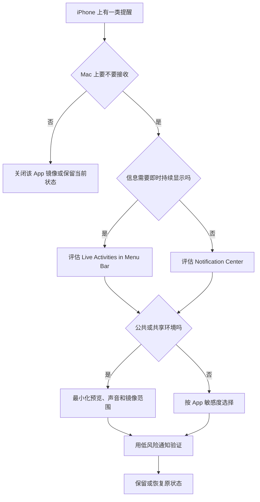

# 处理跨设备提醒：来自 iPhone 的通知与实时活动

“来自 iPhone 的通知”不是把手机完整复制到 Mac。它至少包含三层：通知在 Mac 的 Notification Center 中出现；Live Activities 在 Menu Bar 中出现；每个 iPhone App 是否允许镜像。列表中还可能显示 `Installed on this Mac.` 或 `Mirroring disabled from your iPhone.`。这些状态说明同名或相关服务的处理路径不同，不能用“开关灰了就是坏了”解释，更不能为了让每个条目变为 on 而改动手机、账户或第三方 App 的实际安全配置。

> [!warning] 跨设备提醒会扩大内容可见范围
>
> 当 iPhone 通知镜像到 Mac，手机上原本只在移动设备可见的内容可能出现在桌面、通知中心、菜单栏、锁屏或共享屏幕附近。本文不记录任何 iPhone App 名称、通知内容、账户、银行、旅行、健康或通信资料；不为学习开启镜像、不改变手机设置、不处理真实支付、验证码或私信通知。跨设备通知应该按资料敏感度和使用环境逐 App 决定。

## 学习目标

完成本篇后，你能解释 `Notifications from your iPhone will appear in Notification Center.`、`Live Activities from your iPhone will appear in Menu Bar.`、`Play sounds for notifications from iPhone` 和 `Mirror iPhone Notifications From`；区分 `Installed on this Mac.` 与 `Mirroring disabled from your iPhone.`；选择最小化的镜像范围；并用两组安全案例处理会议、演示与跨设备提醒。

## 三种跨设备信息不是同一呈现方式

| 类别 | 页面英语 | 出现位置 | 典型内容 | 主要隐私风险 |
| --- | --- | --- | --- | --- |
| 通知镜像 | `Notifications from your iPhone` | Notification Center。 | iPhone App 的提醒。 | 桌面端更容易被旁人看到。 |
| 实时活动 | `Live Activities from your iPhone` | Menu Bar。 | 持续变化的活动状态。 | 长时间驻留、被演示或录屏捕获。 |
| 声音反馈 | `Play sounds for notifications from iPhone` | Mac 的输出设备。 | 通知到达提示音。 | 公共环境、会议或夜间打断。 |
| 单个 App 镜像 | `Mirror iPhone Notifications From` | 按 App 的开关。 | 特定 App 通知是否转到 Mac。 | 不同数据敏感度需要不同策略。 |

`Notification Center`、`Menu Bar` 和声音输出分别是视觉集中区、持续状态区和听觉提示。关闭声音并不关闭通知；关闭菜单栏 Live Activities 不一定关闭 Notification Center 中的通知；关闭某个 App 镜像不一定改变该 App 在 iPhone 上自己的通知规则。阅读设置时先问“我在控制 Mac 上哪个呈现渠道”。

## 操作路径与镜像前检查

路径是 **System Settings → Notifications → Allow notifications from iPhone**。进入后可见来自 iPhone 的三项总开关和 `Mirror iPhone Notifications From` 列表。学习路径时只读页面，不对单个条目改动。若计划真实使用，开始前先检查：当前 Mac 是否只由你使用；是否经常投屏、录屏或远程协助；哪些手机 App 可能包含验证码、付款、健康、位置、联系人、聊天或工作资料；是否真正需要在 Mac 上看到它们。

一个实用原则是：默认不把敏感类别镜像到大屏设备；只对确有工作价值、内容风险可控的 App 开启；不因为列表里有很多项目就全部允许。镜像配置不是效率竞赛，少而明确比多而难以解释更安全。

> [!tip] “手机能收到”不等于“Mac 也需要收到”
>
> iPhone 的可携带性和 Mac 的屏幕可见范围不同。手机通知可以在个人手中查看，Mac 则可能连接外接显示器、被他人从侧面看到、出现在演示中。决定镜像时，要重新评估资料在桌面环境中的可见性，而不是复制手机上的所有通知偏好。

## 界面实例：总开关定义三类 macOS 呈现

> 本机截图未包含在公开版本中，以保护原图中的个人信息。

原图包含本机手机上安装的 App 列表，这些名称属于个人软件环境数据，不写入本文词表、搜索索引、案例或练习答案。以下只保留稳定的系统说明与状态标签。

| 完整界面表达 | 软件语境中文 | 实际控制范围 |
| --- | --- | --- |
| `Notifications from your iPhone will appear in Notification Center.` | 来自 iPhone 的通知会出现在通知中心。 | iPhone 提醒在 Mac 通知中心的呈现。 |
| `Live Activities from your iPhone will appear in Menu Bar.` | 来自 iPhone 的实时活动会出现在菜单栏。 | 持续活动状态在 Mac 菜单栏的呈现。 |
| `Play sounds for notifications from iPhone` | 为来自 iPhone 的通知播放声音。 | 跨设备提醒的听觉反馈。 |
| `Mirror iPhone Notifications From` | 从以下 iPhone App 镜像通知。 | 逐 App 决定是否转到 Mac。 |
| `Mirroring disabled from your iPhone.` | iPhone 端已禁用镜像。 | 该条目不可在 Mac 端直接启用。 |
| `Installed on this Mac.` | 已安装在这台 Mac 上。 | 该服务在 Mac 本机已有对应 App 或处理路径。 |
| `On` / `Off` | 开启 / 关闭。 | 当前镜像或呈现状态。 |

`will appear in Notification Center` 与 `will appear in Menu Bar` 的动词相同，地点不同。Notification Center 用于聚合和回顾通知；Menu Bar 是更持续可见的顶部区域。Live Activities 的可见性可能更持久，因此在公共、演示或录屏环境中尤其要审查。

### 本页全部单词

| 单词 | 音标 | 词性 | 本页含义 | 所在完整表达 |
| --- | --- | --- | --- |
| notifications | /ˌnoʊtɪfɪˈkeɪʃənz/ | n.复数 | 通知。 | `Notifications from your iPhone` |
| appear | /əˈpɪr/ | v. | 出现。 | `will appear` |
| center | /ˈsentər/ | n. | 中心。 | `Notification Center` |
| live | /laɪv/ | adj. | 实时的。 | `Live Activities` |
| activities | /ækˈtɪvətiz/ | n.复数 | 活动状态。 | `Live Activities` |
| menu | /ˈmenjuː/ | n. | 菜单。 | `Menu Bar` |
| bar | /bɑːr/ | n. | 条、栏。 | `Menu Bar` |
| play | /pleɪ/ | v. | 播放。 | `Play sounds` |
| sounds | /saʊndz/ | n.复数 | 声音。 | `Play sounds` |
| mirror | /ˈmɪrər/ | v. | 镜像、转呈。 | `Mirror iPhone Notifications` |
| mirroring | /ˈmɪrərɪŋ/ | n. | 镜像过程。 | `Mirroring disabled` |
| disabled | /dɪsˈeɪbəld/ | adj. | 被禁用的。 | `disabled from your iPhone` |
| installed | /ɪnˈstɔːld/ | adj. | 已安装的。 | `Installed on this Mac` |

## 两种灰色状态：Installed on this Mac 与 Mirroring disabled

镜像列表中有些项目的开关不可改，并显示不同原因。`Installed on this Mac.` 说明相应 App 已经在 Mac 上安装；系统可能不需要把该 iPhone App 的通知以镜像方式重复呈现。`Mirroring disabled from your iPhone.` 则指出镜像在 iPhone 端被禁用，当前 Mac 页面不是唯一控制点。这两种状态都不应被当成错误，也不应让你为了把开关变为可用而卸载 App、重装软件、改变手机隐私设置或退出账户。

| 状态 | 它回答的事实 | 正确下一步 | 不应做的事 |
| --- | --- | --- | --- |
| `Installed on this Mac.` | 对应 App 已在本机存在。 | 查看本机 App 自己的通知设置。 | 为了启用镜像卸载本机 App。 |
| `Mirroring disabled from your iPhone.` | iPhone 侧关闭了镜像。 | 如有真实需要，在受控情况下检查 iPhone 设置。 | 在 Mac 上反复点击灰色开关或绕过手机策略。 |
| `On` | 当前该 App 的镜像开启。 | 审查它是否仍适合 Mac 环境。 | 假定内容一定安全。 |
| `Off` | 当前该 App 的镜像关闭。 | 判断是否确有桌面提醒需求。 | 假定 iPhone 本身通知已关闭。 |

> [!warning] 灰色开关通常在保护一个跨设备边界
>
> 当条目被禁用时，先读出原因：它可能由 iPhone、本机 App、账户关系、版本或服务支持决定。不要将“不可点击”视为需要破解的障碍。若真实工作必须改变它，使用该设备上的受授权路径，并评估镜像后资料会出现在哪里。

## Live Activities：持续状态比一次通知更需要节制

Live Activities 通常用于持续变化的状态，例如行程、计时、配送、比赛或其他过程性信息。页面说明 `Live Activities from your iPhone will appear in Menu Bar.`，重点不是某个 App 名称，而是状态将持续留在菜单栏附近。持续呈现有价值，也带来两个问题：它是否会在外接显示器或演示中暴露；它是否真的比普通通知更需要常驻可见。

| 问题 | 用普通通知更合适 | 用 Live Activities 前要确认 |
| --- | --- | --- |
| 只需事后查看 | 通知中心即可。 | 不必常驻菜单栏。 |
| 需要追踪过程状态 | 可能需要实时活动。 | 内容不敏感、时效性真实、环境私密。 |
| 正在投屏或录屏 | 通常不应常驻。 | 菜单栏是否会被观众看到。 |
| 需要减少分心 | 关闭声音或逐 App 镜像。 | 实时活动是否成为持续注意力干扰。 |

`Live` 在此是“实时变化的”，不是“直播节目”；`Activity` 是一个正在进行的状态或任务，不只是“活动通知”。要表达“我只让低风险的过程状态显示在菜单栏”，可以说：`I show only low-risk live activities in the menu bar.`

### 案例一：为一个低风险 App 开启或关闭镜像前的审查

**情境**：你想在 Mac 上收到一个低风险 iPhone App 的提醒，但担心内容和声音打断工作。

1. 打开 **Notifications → Allow notifications from iPhone**，先阅读三个总开关和 Mirror iPhone Notifications From。
2. 在不记录真实 App 名称的前提下，选择一个内容不敏感、无需验证码、不涉及付款或私信的 App 作为候选。
3. 判断是否只需要 Notification Center，还是还需要声音或 Menu Bar Live Activities。
4. 记录候选条目的原状态。若进行真实测试，只改变该 App 的单一镜像开关，保持声音和实时活动状态不变。
5. 在普通桌面环境观察提醒是否足够；如果造成干扰，恢复该条目原状态。
6. 用英语说明：`I mirrored notifications from one low-risk iPhone app and kept the sound setting unchanged. I restored the original state when the notifications were not useful on my Mac.`

## 共享、演示与锁屏：跨设备通知的三次检查

当 Mac 被投屏、共享、锁屏或暂时离开时，来自 iPhone 的通知需要再次审查。手机常被视为个人设备，Mac 却可能处在会议室、工作台、外接显示器或远程控制中。同一条通知在两个设备上的风险不同。

| 场景 | 首先检查 | 推荐原则 |
| --- | --- | --- |
| 屏幕共享 | Notifications 总览中的 mirroring or sharing display。 | 先减少预览和镜像，再开始共享。 |
| 外接显示器演示 | 菜单栏 Live Activities、桌面横幅。 | 关闭不需要的持续状态和声音。 |
| 锁屏离开 | Lock Screen 与 Show previews。 | 不显示包含私人内容的预览。 |
| 公共环境 | Play sounds 与输出设备。 | 关闭不需要的跨设备提示音。 |
| 多人共用 Mac | 按 App 最小化镜像。 | 不把手机的全部通知复制到共享设备。 |

### 案例二：演示前建立跨设备通知策略

**情境**：你要进行一场屏幕共享演示，但 iPhone 上有多种提醒，部分会镜像到 Mac。

1. 在演示前进入 Notifications 总览，检查 `when mirroring or sharing the display` 的当前策略。
2. 进入来自 iPhone 的通知页，确认是否需要临时关闭总镜像、声音或少数敏感 App 的镜像。
3. 不逐项改变全部列表，不试图让灰色条目可用；只处理演示中有实际风险的渠道。
4. 用无敏感内容的测试共享确认 Notification Center、Menu Bar 和声音不会泄露或打断。
5. 演示结束后，按记录恢复之前策略，并确认不会漏掉日常必要提醒。
6. 用英语总结：`Before sharing my display, I reviewed iPhone notification mirroring, menu bar live activities, and notification sounds. I restored my normal settings after the presentation.`

## 常见错误、风险与恢复方式

| 错误 | 为什么不合适 | 更稳妥的做法 |
| --- | --- | --- |
| 把手机所有 App 都镜像到 Mac。 | 扩大可见内容和注意力干扰。 | 按数据敏感度和桌面价值逐 App 选择。 |
| 把 Installed on this Mac 当作故障。 | 它说明本机已有对应 App。 | 检查本机 App 自己的通知策略。 |
| 将 Mirroring disabled 视为可在 Mac 强制打开。 | 原因在 iPhone 侧或跨设备关系。 | 若有需要，使用受授权的 iPhone 路径确认。 |
| 只关声音，不检查预览和锁屏。 | 内容仍可能在大屏或锁屏被看到。 | 同时检查呈现位置与 Show previews。 |
| 让所有 Live Activities 常驻菜单栏。 | 持续暴露与分心可能高于价值。 | 只保留低风险、确有时效性状态。 |
| 在讲义中记录 iPhone App 清单。 | 会把私人使用习惯和服务资料进入索引。 | 只记录稳定系统表达。 |

## 本篇自测

1. iPhone notifications、Live Activities 和 notification sounds 分别在 Mac 的哪里出现？
2. `Installed on this Mac.` 与 `Mirroring disabled from your iPhone.` 有何不同？
3. 为什么镜像通知需要按 App 最小化？
4. 屏幕共享前应检查哪三个跨设备通知渠道？
5. 为什么 Live Activities 比普通通知更需要考虑菜单栏可见性？
6. 关闭镜像开关会不会自动关闭 iPhone 本身的通知？
7. 请用英语表达：“我只让低风险的 iPhone 通知出现在通知中心。”

查看答案

1. iPhone notifications 出现在 Notification Center；Live Activities 出现在 Menu Bar；notification sounds 通过 Mac 的输出设备播放。
2. 前者说明对应 App 已在 Mac 本机安装；后者说明镜像在 iPhone 端被禁用。它们的控制来源不同。
3. 不同 App 的内容敏感度、时效性和桌面价值不同，全部镜像会扩大泄露与中断范围。
4. Notification Center、Menu Bar Live Activities 和声音；还应检查共享显示时的全局通知策略与预览。
5. 它可能持续显示在菜单栏，演示、录屏和外接显示器时更容易长期暴露。
6. 不会。它控制 iPhone 提醒是否镜像到 Mac，不必然改变手机自身通知规则。
7. `I allow only low-risk iPhone notifications to appear in Notification Center.`

## 版本差异与参考来源

本篇根据本机 **macOS 27.0 Beta (26A5425a)** 的 iPhone 通知镜像页面、截图和辅助功能文本写成。可镜像的 App、灰色状态原因、Live Activities 支持和跨设备条件会随 iPhone、账户关系、系统版本、地区和 App 安装状态变化。可参考 Apple 的 [Notifications guide](https://support.apple.com/guide/mac-help/change-notifications-settings-mh40583/mac) 与 [Continuity guide](https://support.apple.com/guide/mac-help/use-continuity-to-connect-mac-iphone-ipad-mchl0f22f17a/mac)。公开资料说明原则，实际可用性以当前设备页面为准。
