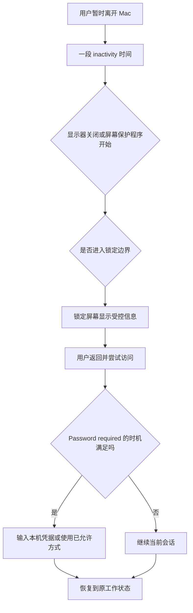

# 设置离开后的行为：锁定屏幕、登录提示与恢复

离开 Mac 时，显示器变黑、屏幕保护程序开始、屏幕锁定、密码被要求、登录窗口展示用户列表，这些不是同一个事件。Lock Screen 页面将它们放在一起，是为了让你决定“多久后关闭显示”“多久后要求凭据”“锁定时显示什么”“切换用户时怎样登录”。便利和安全并非固定对立：你可以合理设置显示器节能，同时保留可靠的登录边界；也可以只调整锁定消息，而不改变密码要求。学习时要先分清时间线和对象。

> [!warning] 锁屏策略涉及真实本机访问保护
>
> 修改锁定后密码、自动登录、用户显示、锁定信息或电源相关时间，会影响设备离开时的数据暴露与使用体验。本文不设置真实锁屏消息、不关闭密码要求、不启用自动登录、不改变他人的用户显示，也不在陌生设备上测试。任何影响登录边界的变更，都应先确认当前密码、受授权恢复方式和物理环境。

## 学习目标

完成本篇后，你能区分 display turns off、screen saver、lock screen、password required、login window 与 switching user；读懂 inactivity、power adapter、immediately、show user name and photo、show password hints、show message when locked、List of users、Name and password 等完整表达；完成两组只读或可恢复的安全检查，并用英语说明离开设备后的实际保护流程。

## 先画出时间线

| 阶段 | 页面中的典型表达 | 发生什么 | 不应误解为 |
| --- | --- | --- | --- |
| 无操作 | `when inactive` | 系统根据时间开始处理显示或锁屏行为。 | 用户已经退出账户。 |
| 显示关闭 | `Turn display off …` | 屏幕不再显示内容。 | 设备已经锁定。 |
| 屏幕保护程序 | `Start Screen Saver …` | 屏幕保护程序开始。 | 密码必然立刻要求。 |
| 锁定 | `Lock Screen` | 当前会话进入锁定边界。 | Mac 已关机。 |
| 重新访问 | `Password required …` | 需要凭据才能继续当前会话。 | Apple Account 密码必然被修改。 |
| 切换用户 | `When Switching User` | 显示登录窗口并选择或输入本机用户。 | 退出 Apple Account。 |

关键点是：`display turns off` 处理显示和能源；`password required` 处理重新访问的身份验证。两者可以有不同时间，不应只因为屏幕黑了就假设数据已经受保护，也不应只看到锁屏页面就以为所有时间策略相同。

## 操作路径与安全准备

路径是 **Apple menu → System Settings → Lock Screen**。页面可能包含电池和电源适配器下的显示器关闭时间、锁屏后密码要求、用户名称和照片、密码提示、锁定消息、切换用户时登录窗口显示形式、Sleep/Restart/Shut Down 按钮和 Accessibility Options。

任何真实调整前，先确认：这台 Mac 是否可能被他人接触；是否有组织安全策略；当前用户是否记得本机密码；外接设备、iPhone Mirroring 或远程管理是否影响认证行为；是否需要在演示或公共环境中隐藏姓名、照片和锁定消息。学习阶段保持只读，尤其不更改 password required、auto login 或真实锁定消息。

> [!tip] 两种“立即”要看对象
>
> `Immediately` 出现在 Lock Screen 中时，通常修饰密码何时被要求，不表示显示器立即关闭或设备立即关机。系统英语里副词必须连同它修饰的动作一起记：`Password immediately required` 与 `Turn display off … after 10 minutes` 说的是不同时间点。

## 界面实例：Lock Screen 把能源、可见性和登录方式分组

> 本机截图未包含在公开版本中，以保护原图中的个人信息。

本机页面的具体时间值、当前用户名、照片和锁定消息属于动态或私人环境数据，不进入正文、词表或练习。下表保留稳定标题、状态与说明表达。

| 完整界面表达 | 软件语境中文 | 需要理解的范围 |
| --- | --- | --- |
| `Turn display off on power adapter when inactive` | 使用电源适配器且无操作时关闭显示器。 | 电源适配器条件下的显示器能源策略。 |
| `when inactive` | 当无操作时。 | 以用户活动停止为条件。 |
| `Password immediately required` | 立即要求密码。 | 重新访问会话时的凭据时机。 |
| `Show user name and photo` | 显示用户名和照片。 | 锁定或登录界面的身份可见度。 |
| `Show password hints` | 显示密码提示。 | 是否显示与密码有关的辅助信息。 |
| `Show message when locked` | 锁定时显示消息。 | 锁屏上自定义文本的可见性。 |
| `Set…` | 设置。 | 配置锁定消息的下一步入口。 |
| `When Switching User` | 切换用户时。 | 进入用户切换流程的显示和登录行为。 |
| `Login window shows` | 登录窗口显示。 | 切换用户时的登录界面形式。 |
| `List of users` | 用户列表。 | 显示可选择的本机用户。 |
| `Name and password` | 名称和密码。 | 通过输入身份和密码登录。 |
| `Show the Sleep, Restart, and Shut Down buttons` | 显示睡眠、重新启动和关机按钮。 | 登录窗口是否提供这些电源操作入口。 |
| `Accessibility Options…` | 辅助功能选项。 | 登录或锁定流程中的辅助使用入口。 |

`on power adapter` 不等于“正在充电到满”；它指 Mac 在接通电源适配器时的条件。`when inactive` 也不等于“关闭所有应用”，它只关注用户一段时间没有互动。`Show user name and photo` 是可见性选择，影响锁定或登录界面展示的身份线索；在共享或公共环境中，应把它视作隐私与便利的取舍。

### 本页全部单词

| 单词 | 音标 | 词性 | 本页含义 | 所在完整表达 |
| --- | --- | --- | --- | --- |
| turn | /tɜːrn/ | v. | 关闭或开启。 | `Turn display off` |
| display | /dɪˈspleɪ/ | n. | 显示器、显示画面。 | `display off` |
| power | /ˈpaʊər/ | n. | 电源。 | `power adapter` |
| adapter | /əˈdæptər/ | n. | 适配器。 | `power adapter` |
| inactive | /ɪnˈæktɪv/ | adj. | 无操作的、不活跃的。 | `when inactive` |
| password | /ˈpæswɜːrd/ | n. | 密码。 | `Password required` |
| immediately | /ɪˈmiːdiətli/ | adv. | 立即。 | `immediately required` |
| required | /rɪˈkwaɪərd/ | adj. | 被要求的、必需的。 | `Password required` |
| user | /ˈjuːzər/ | n. | 用户。 | `user name` |
| name | /neɪm/ | n. | 名称。 | `user name` |
| photo | /ˈfoʊtoʊ/ | n. | 照片。 | `name and photo` |
| hints | /hɪnts/ | n.复数 | 提示。 | `password hints` |
| switching | /ˈswɪtʃɪŋ/ | n./v-ing | 切换。 | `Switching User` |
| window | /ˈwɪndoʊ/ | n. | 窗口。 | `Login window` |
| list | /lɪst/ | n. | 列表。 | `List of users` |
| sleep | /sliːp/ | n./v. | 睡眠、休眠。 | `Sleep button` |
| restart | /ˌriːˈstɑːrt/ | v. | 重新启动。 | `Restart button` |
| shut down | /ʃʌt daʊn/ | v. | 关机。 | `Shut Down button` |

## 显示关闭、屏幕保护和密码要求的实际差别

`Turn display off … when inactive` 主要节省显示相关能源并减少旁人直接看到屏幕的机会；`Password immediately required` 决定系统重新访问时的凭据门槛。一个安全策略可能需要两者配合：离开后较短时间关闭显示，并在锁定后要求密码。但具体时间不能脱离环境做统一推荐：个人在私密家庭环境、多人共享办公室、图书馆、咖啡店、演示现场或受管理设备的风险不同。

| 你想达到的效果 | 应优先理解 | 不要误做 |
| --- | --- | --- |
| 节省电能、减少亮屏 | display off 的电源与无操作条件。 | 以为这自动等于安全锁定。 |
| 防止他人继续使用会话 | password required 的时机与本机凭据。 | 关闭密码要求来提高便利性。 |
| 避免锁屏泄露身份线索 | user name/photo、password hints、locked message。 | 在锁屏消息中写入私人电话、地址、邮箱或工作信息。 |
| 支持多用户共用设备 | Login window shows、Switching User。 | 用自动登录或共享密码替代用户管理。 |
| 在登录前提供辅助使用入口 | Accessibility Options。 | 修改辅助功能时忘记恢复路径。 |

> [!warning] 密码提示和锁定消息也会被旁人看到
>
> `Show password hints` 和 `Show message when locked` 看起来是便利功能，但锁屏通常处在未经登录也可见的环境。密码提示不应泄露可推测凭据的信息；锁定消息不应包含电话号码、家庭地址、账户邮箱、工作机密或可被社会工程利用的细节。无法判断时保持关闭。

### 案例一：只读审查离开 Mac 时的保护边界

**情境**：你想了解设备离开后何时变黑、何时要求密码、锁屏上会显示什么，但不打算改变任何本机设置。

1. 打开 **System Settings → Lock Screen**，只阅读关于 display、power adapter、inactive 和 password required 的表达。
2. 区分“屏幕关闭”与“重新访问需要密码”，不对具体时间值做修改。
3. 查看 user name/photo、password hints 和 locked message 的开关状态，不记录真实用户资料或消息内容。
4. 阅读 `When Switching User` 与 `Login window shows`，理解用户列表和名称密码输入是两种登录窗口呈现。
5. 用英语复述：`I reviewed the display timeout, password requirement, and lock-screen visibility separately. I did not change the login protection while learning the page.`

## 锁定消息、用户显示和用户切换：可见性与可访问性

`Show message when locked` 可以在锁定界面显示预设文本。其合理用途可能是非敏感的设备归属指引；但页面本身无法判断文字是否泄露信息，因此内容责任在设备所有者。`Show user name and photo` 使登录窗口更容易选择用户，也让旁人更容易看到身份线索。`List of users` 与 `Name and password` 则是登录方式的不同呈现：前者展示可选择用户，后者要求手动输入名称和密码。

| 选项 | 便利性 | 隐私或安全考虑 |
| --- | --- | --- |
| Show user name and photo | 更容易确认和选择正确本机用户。 | 可能在公共环境暴露身份线索。 |
| Show password hints | 忘记密码时可获得提示。 | 提示不能帮助他人猜出密码。 |
| Show message when locked | 可显示设备说明。 | 消息在锁定状态可见，内容必须最小化。 |
| List of users | 选择用户更直观。 | 可能显示本机用户存在性。 |
| Name and password | 需要手动输入身份。 | 减少列表暴露，但不取代其他保护。 |
| Accessibility Options | 登录前可进入辅助方式。 | 应确保有可恢复、可理解的配置。 |

`when locked` 是锁定状态下；`when switching user` 是已决定切换用户时。两者不是同一个时间点。切换用户并不等于关闭所有会话或退出 Apple Account；它通常在本机用户之间切换。遇到多用户设备问题，优先用 Users & Groups 管理主体和权限，而不是只改 Lock Screen 呈现。

### 案例二：为演示与公共环境准备可恢复策略

**情境**：你要在公共环境或演示场地使用 Mac，希望暂时降低锁屏可见内容，同时保持正常登录保护。

1. 在出发前而不是现场，打开 Lock Screen 页面，记录 user name/photo、password hints 和 locked message 的原状态。
2. 判断是否有必要减少锁屏上的身份线索或关闭不必要的提示；不要修改 password required 或自动登录。
3. 如果确实修改一项可恢复可见性设置，只改一项，并在本机锁屏后确认效果。
4. 不在锁定消息中填入私人联系方式、行程、项目名称或账户资料。
5. 演示结束后按记录恢复原状态，并确认仍能用密码或已允许方式解锁。
6. 用英语总结：`I reduced unnecessary information on the lock screen for a public environment while keeping the normal password requirement. I restored the original visibility settings afterward.`

## 登录、恢复和自动登录不能互相替代

Lock Screen 的 `Password required` 关系到当前本机会话；Users & Groups 中的 `Automatically log in as` 关系到启动或登录过程是否自动以某用户进入；Apple Account 的 Recovery Methods 关系到云端账户忘记凭据后的恢复。三个页面都出现 password、login 或 user，却不能用一个开关解决另一个问题。

| 你的问题 | 正确页面 | 不应使用的替代方案 |
| --- | --- | --- |
| 离开后多久要求本机凭据 | Lock Screen。 | 关闭自动登录或修改 Apple Account 密码。 |
| 启动后是否自动进入本机用户 | Users & Groups。 | 用锁屏消息或 Touch ID 设置代替。 |
| 忘记 Apple Account 密码如何恢复 | Sign-In & Security → Recovery Methods。 | 开启自动登录或删除本机用户。 |
| 忘记本机登录密码 | 当前系统的受授权恢复流程。 | 用自动登录、共用密码或绕过安全策略。 |

> [!warning] 不要把自动登录当作密码恢复
>
> 自动登录会改变设备启动时的访问门槛，不会安全地找回忘记的密码。忘记本机或账户凭据时，应走当前系统、组织或 Apple 提供的正式恢复流程。为了“方便”降低登录保护，会让物理接触设备的人更容易访问本机资料。

## 软件英语表达规律

| 句型 | 含义 | 可用表达 |
| --- | --- | --- |
| `Turn … off when …` | 在某条件下关闭某物。 | `Turn the display off when the Mac is inactive.` |
| `Password required …` | 在某时机要求密码。 | `A password is required immediately after locking.` |
| `Show … when …` | 在某状态显示内容。 | `Show a message when the Mac is locked.` |
| `when switching user` | 当切换用户时。 | `Choose how the login window looks when switching user.` |
| `List of …` | ……列表。 | `The login window shows a list of users.` |
| `before + -ing` | 在做某事前。 | `Confirm the recovery method before changing login settings.` |

`required` 常以省略主语的设置标签出现，如 `Password immediately required`；完整句可补成 `A password is immediately required when the relevant lock condition is met.`。这种补全有助于理解“需要什么”和“何时需要”，但不要擅自假设系统的具体触发实现；实际时间与条件仍以本机页面为准。

## 常见错误、风险与恢复方式

| 错误 | 为什么不合适 | 更稳妥的做法 |
| --- | --- | --- |
| 把显示器关闭当作设备已经安全锁定。 | 显示状态和凭据要求是不同层。 | 分别检查 display timeout 与 password requirement。 |
| 为方便关闭密码要求。 | 扩大离开设备后的本机访问风险。 | 保持密码边界，调整可见性或时间时先评估环境。 |
| 在锁定消息中写入私人资料。 | 锁屏信息可能被未经登录的人看到。 | 使用最小、非敏感的说明，或保持关闭。 |
| 把 List of users 当成 Apple Account 列表。 | 它列出本机用户。 | 账户问题回到 Apple Account，用户问题回到 Users & Groups。 |
| 用自动登录处理忘记密码。 | 不是恢复方式且会降低启动保护。 | 走受授权恢复或管理员支持。 |
| 现场第一次测试锁屏和登录策略。 | 可能把自己锁在关键工作之外。 | 在有恢复能力、无紧急任务时提前测试。 |

## 本篇自测

1. display turns off 与 password required 的核心区别是什么？
2. `when inactive`、`on power adapter` 和 `immediately` 分别限定什么？
3. Show user name and photo、Show password hints、Show message when locked 分别有什么可见性风险？
4. List of users 与 Name and password 有何不同？
5. 为什么 Lock Screen、Users & Groups 和 Apple Account Recovery Methods 不能互相替代？
6. 公共环境中怎样做一项可恢复的锁屏可见性调整？
7. 请用英语表达：“我保留了密码要求，只减少了锁屏上的不必要信息。”

查看答案

1. display turns off 控制显示与能源；password required 控制重新访问当前会话时的凭据门槛。
2. when inactive 限定无操作条件；on power adapter 限定接通电源条件；immediately 限定密码被要求的时机。
3. 用户名和照片可能暴露身份线索；密码提示可能帮助猜测凭据；锁定消息可能暴露私人联系或工作资料。
4. List of users 显示可选择的本机用户；Name and password 要求手动输入身份与密码。
5. 分别处理锁定会话、本机用户登录和云端账户恢复，影响对象不同。
6. 记录原状态，只调整一项非敏感可见性设置，在安全环境锁屏验证，结束后按记录恢复。
7. `I kept the password requirement and reduced only unnecessary information on the lock screen.`

## 版本差异与参考来源

本篇依据本机 **macOS 27.0 Beta (26A5425a)** 的 Lock Screen 页面、截图和辅助功能文本写成。时间选项、iPhone Mirroring 认证行为、组织管理策略、可见用户和辅助功能入口会随设备与系统版本变化。可参考 Apple 的 [Lock Screen settings guide](https://support.apple.com/guide/mac-help/change-lock-screen-settings-mchlp2722/mac)、[Login settings guide](https://support.apple.com/guide/mac-help/change-login-settings-mchlp1036/mac) 和 [Users guide](https://support.apple.com/guide/mac-help/add-or-delete-users-mchl3e281fc9/mac)。公开资料解释原则，实际配置以当前本机页面与组织安全要求为准。
