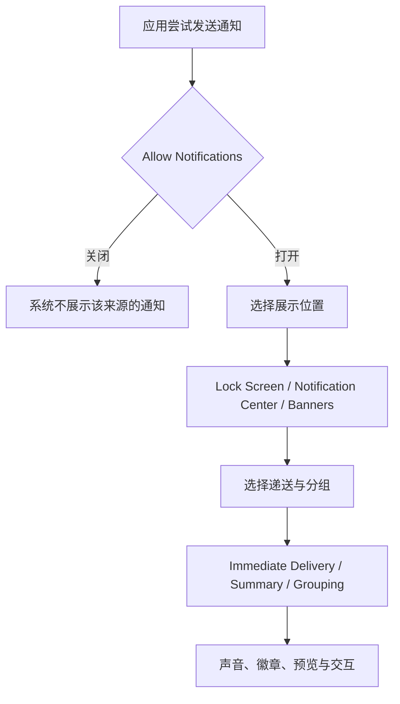

# 从来源到递送：逐项读懂应用通知的共同控制

通知列表最容易让人误以为“每个应用都需要重新学一遍”。实际学习目标不是背住某个来源的名称，而是看出同一组控制如何反复出现：**是否允许通知、通知出现在哪里、如何分组、什么时候递送、是否带声音、是否显示预览**。下面的界面证据按采集顺序保留，以便你把同一套英文放回不同页面时仍能立即识别。

> [!important] 原图与文字的边界
> 原图只在本机讲义资源目录读取。它可能出现本机安装的软件名称或动态状态；本文不转录这些界面数据，也不将它们写入搜索索引、词汇表或练习。编号只是定位采集材料，不是软件名称。

## 学习目标

完成本篇后，你应能在任何应用通知页回答四件事：这个开关是否控制 **Allow Notifications**；横幅、锁定屏幕和通知中心分别属于什么显示位置；**Immediate Delivery**、摘要和分组为什么不是同一层设置；改动后怎样准确地确认结果，而不是凭一次提醒是否恰好出现就下结论。

## 先建立通知的四层模型

通知设置可以读成四层，而不是一排互不相干的开关。第一层是许可层：`Allow Notifications` 决定来源能否向系统发通知。第二层是展示层：`Lock Screen`、`Notification Center`、`Banners` 决定许可后的提醒可以出现在哪里。第三层是组织与时机层：`Notification Grouping`、`Scheduled Summary`、`Immediate Delivery` 描述系统怎样把多条通知放在一起，以及是否立即送达。第四层是内容层：声音、徽章和预览决定你看到或听到的信息粒度。

如果某条提醒没有立刻出现，不要直接说“通知坏了”。先确认它有没有许可，再确认它是否被安排到摘要、是否只允许在某个位置显示，最后才检查网络、专注模式或应用自身的设置。用英语报告时可以说：`Notifications are allowed, but delivery is not immediate.` 这句话把“允许”与“送达时机”分开，避免把两个层级混为一谈。

## 真实界面：首组来源的许可与展示位置

这一组页面用于比较每个来源都可能重复出现的许可、横幅、锁定屏幕、通知中心、声音和徽章。你不需要识别图片中的来源名称；把注意力放在控件的英文和它改变的系统行为上。

> 本机截图未包含在公开版本中，以保护原图中的个人信息。

> 本机截图未包含在公开版本中，以保护原图中的个人信息。

> 本机截图未包含在公开版本中，以保护原图中的个人信息。

> 本机截图未包含在公开版本中，以保护原图中的个人信息。

> 本机截图未包含在公开版本中，以保护原图中的个人信息。

> 本机截图未包含在公开版本中，以保护原图中的个人信息。

> 本机截图未包含在公开版本中，以保护原图中的个人信息。

> 本机截图未包含在公开版本中，以保护原图中的个人信息。

> 本机截图未包含在公开版本中，以保护原图中的个人信息。

> 本机截图未包含在公开版本中，以保护原图中的个人信息。

> 本机截图未包含在公开版本中，以保护原图中的个人信息。

> 本机截图未包含在公开版本中，以保护原图中的个人信息。

> 本机截图未包含在公开版本中，以保护原图中的个人信息。

> 本机截图未包含在公开版本中，以保护原图中的个人信息。

> 本机截图未包含在公开版本中，以保护原图中的个人信息。

> 本机截图未包含在公开版本中，以保护原图中的个人信息。

> 本机截图未包含在公开版本中，以保护原图中的个人信息。

> 本机截图未包含在公开版本中，以保护原图中的个人信息。

> 本机截图未包含在公开版本中，以保护原图中的个人信息。

> 本机截图未包含在公开版本中，以保护原图中的个人信息。

> 本机截图未包含在公开版本中，以保护原图中的个人信息。

> 本机截图未包含在公开版本中，以保护原图中的个人信息。

> 本机截图未包含在公开版本中，以保护原图中的个人信息。

> 本机截图未包含在公开版本中，以保护原图中的个人信息。

> 本机截图未包含在公开版本中，以保护原图中的个人信息。

> 本机截图未包含在公开版本中，以保护原图中的个人信息。

> 本机截图未包含在公开版本中，以保护原图中的个人信息。

> 本机截图未包含在公开版本中，以保护原图中的个人信息。

> 本机截图未包含在公开版本中，以保护原图中的个人信息。

> 本机截图未包含在公开版本中，以保护原图中的个人信息。

### 这组界面必须能读出的完整表达

| 原文 | 软件语境中文 | 控件类型 | 改动后的作用 |
| --- | --- | --- | --- |
| `Allow Notifications` | 允许通知 | 总开关 | 关闭后，该来源不能通过系统通知样式提醒你。 |
| `Lock Screen` | 锁定屏幕 | 显示位置开关 | 控制提醒能否出现在锁屏界面。 |
| `Notification Center` | 通知中心 | 显示位置开关 | 控制提醒能否留在通知中心供稍后查看。 |
| `Banners` | 横幅 | 显示位置开关 | 控制使用设备时是否在屏幕上短暂显示提醒。 |
| `Badge application icon` | 应用图标徽章 | 内容提示开关 | 控制图标是否显示未处理项目数量或状态标记。 |
| `Play sound for notifications` | 播放通知声音 | 声音开关 | 控制允许的通知是否伴随系统声音。 |
| `Show Previews` | 显示预览 | 内容可见性菜单 | 控制通知内容在何种状态下可直接被看到。 |

完整句 `Show previews when unlocked` 的重点不是“有预览”而是 `when unlocked`。它限定显示条件：设备已经解锁时才能直接显示内容。与之相比，`Never` 是完全不显示预览，`Always` 是不依赖锁定状态显示。读到这些选项时，要把它们当作**内容可见性**而不是通知许可本身。

## 两个可复现的观察案例

### 案例一：区分“没有横幅”和“完全没有通知”

1. 打开 **System Settings → Notifications**，选择任意一个不涉及账户改动的来源页面。
2. 先只阅读 `Banners`、`Notification Center` 与 `Lock Screen` 的状态，不切换任何开关。
3. 用自己的话确认：横幅是正在使用电脑时的临时展示，通知中心是稍后查看的位置，锁定屏幕是未解锁时的展示位置。
4. 用英语复述：`Banners control the temporary on-screen alert. They do not decide whether notifications are allowed.`
5. 退出页面，不制造测试通知，也不改变来源的通知许可。

### 案例二：检查预览是否会在不合适的场景显示

1. 在同一页面找到 `Show Previews`。
2. 读出菜单当前值以及 `Always`、`When Unlocked`、`Never` 三个候选含义。
3. 区分“通知存在”与“通知正文可读”：前者由许可和展示位置控制，后者由预览条件补充控制。
4. 用英语记录：`I reviewed the preview condition without changing notification permission.`
5. 若未来确实需要改动，先记下原值；要恢复时回到相同来源页面选回原值，而不是到专注模式或应用内寻找无关开关。

> [!warning] 不要用私人消息测试
> 不要为了看横幅、徽章或预览而给自己发送私人内容，也不要在原图外抄录来源名称。学习时阅读控件和状态已足够；真实消息的内容与递送时机不适合作为教材数据。

## 英语表达规律与搭配

`Allow + object` 常用于许可：`Allow Notifications` 是精简的界面命令。`Show + object + condition` 常用于展示：`Show Previews` 与 `Show previews when unlocked` 分别告诉你显示什么、在什么条件下显示。`Play sound for + noun` 描述附随反馈，`for notifications` 是声音服务的对象。界面上的名词短语很短，但回答问题时应补成完整句：`This option allows notifications to appear in Notification Center.`

| 单词 | 音标 | 词性 | 本篇语境义 | 所在完整表达 |
| --- | --- | --- | --- |
| allow | /əˈlaʊ/ | v. | 允许 | `Allow Notifications` |
| notification | /ˌnoʊtɪfɪˈkeɪʃən/ | n. | 系统提醒 | `Play sound for notifications` |
| banner | /ˈbænər/ | n. | 屏幕顶部或角落的临时提醒条 | `Banners` |
| preview | /ˈpriːvjuː/ | n./v. | 提前可见的通知内容 | `Show Previews` |
| unlocked | /ʌnˈlɑːkt/ | adj. | 已解锁的 | `when unlocked` |
| badge | /bædʒ/ | n. | 图标上的状态标记 | `Badge application icon` |
| center | /ˈsentər/ | n. | 集中查看区域 | `Notification Center` |

## 把页面判断变成可沟通的结果

设置页的价值不只是替你做选择，也让你能把选择说清楚。若同事问“为什么这条提醒没有跳出来”，先不要凭印象回答“通知关闭了”。你可以依次说明：`The app is allowed to send notifications.`、`Banners are turned off.`、`The notification can still appear in Notification Center.` 三句各自陈述许可、临时展示和保留位置。这样既能避免过度承诺，也便于对方沿着同一页复核。

若担心内容在锁屏时被旁人看到，正确的检查路径是预览条件，而不是先关闭总许可。可以说：`I want to keep the notification, but I do not want the preview to be visible while the Mac is locked.` 这里的 `keep` 表示保留通知能力，`do not want ... to be visible` 说明限制的是可见性。把两层意图拆开后，恢复也更容易：只需回到 `Show Previews` 的原值，而不是重新开放一个已经关闭的来源。

> [!tip] 先记录，再修改
> 真正需要变更时，先写下来源页的原始状态、目标状态和恢复位置。通知是跨应用且会随时间出现的行为；仅凭某一次“没有弹出”无法证明设置已正确生效。记录可以把后来看到的结果和当时改过的层级对应起来。

## 自测

1. `Allow Notifications` 与 `Banners` 各自控制什么？
2. 为什么 `Notification Center` 不能等同于锁定屏幕？
3. `Show Previews` 的三个常见取值分别改变哪一种可见性条件？
4. 用英语说出“通知被允许，但它不会显示为横幅”。

查看参考答案

1. 前者是来源级许可；后者只是展示位置之一。
2. 通知中心用于集中回看，锁定屏幕对应设备未解锁时的界面位置。
3. 它们控制内容预览是否总是可见、仅解锁后可见或完全不显示。
4. `Notifications are allowed, but they are not shown as banners.`

## 版本与来源

本篇界面文字来自本机 macOS 27.0 Beta (26A5425a) 于 2026-09-09 的采集。不同系统版本、设备状态和已安装来源会改变列表内容；本文只解释稳定的控件含义。功能边界可对照 Apple 的 [Change Notifications settings on Mac](https://support.apple.com/guide/mac-help/change-notifications-settings-mh40583/mac)。
