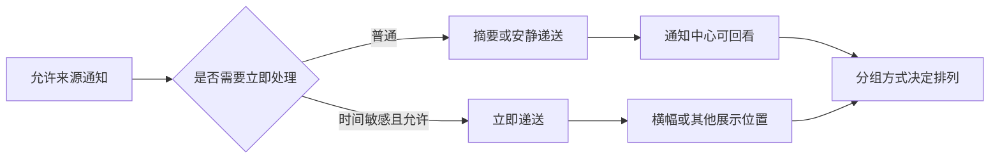

# 让通知可回看：分组、摘要与递送时机

某个来源已经被允许发送通知，并不代表每条提醒都会以同一种方式到达。系统还要决定多条提醒是否合在一起、是否留给摘要、是否立即出现、是否保留在通知中心。本篇用第二组真实页面训练一个更准确的判断：**许可回答“能不能来”，递送回答“何时来”，分组回答“怎么排在一起”，展示位置回答“在哪里看见”。**

> [!note] 为什么要逐项复核
> 两个来源页面看起来相似，当前值却可能不同。不要把一页的 `Notification Grouping` 或 `Deliver Quietly` 当成另一页的状态。编号只用于本地原图定位，不表示来源名称或重要程度。

## 学习目标

你将能解释 `Automatic`、`By App` 与 `Off` 的分组逻辑；能区分计划摘要与安静递送；能读懂 `Time Sensitive Notifications` 这类特例提示；也能用完整英文说明“我想保留通知中心中的记录，但不希望它立刻占用屏幕”。

## 先看清时间和组织不是展示位置

`Banners` 告诉系统要不要在使用时显示横幅，`Notification Center` 告诉系统要不要保留可回看的入口；`Scheduled Summary` 和 `Deliver Quietly` 则关心时机。通知被收进摘要，不等于失去许可；设置为安静递送，不等于从通知中心消失。若某来源支持时间敏感提醒，页面还会把普通提醒和需要优先到达的提醒区分开。学习时应首先读动词：`deliver` 是递送，`group` 是归类，`schedule` 是安排时间，`allow` 是许可。

## 真实界面：从分组设置看出来源的组织方式

> 本机截图未包含在公开版本中，以保护原图中的个人信息。

> 本机截图未包含在公开版本中，以保护原图中的个人信息。

> 本机截图未包含在公开版本中，以保护原图中的个人信息。

> 本机截图未包含在公开版本中，以保护原图中的个人信息。

> 本机截图未包含在公开版本中，以保护原图中的个人信息。

> 本机截图未包含在公开版本中，以保护原图中的个人信息。

> 本机截图未包含在公开版本中，以保护原图中的个人信息。

> 本机截图未包含在公开版本中，以保护原图中的个人信息。

> 本机截图未包含在公开版本中，以保护原图中的个人信息。

> 本机截图未包含在公开版本中，以保护原图中的个人信息。

> 本机截图未包含在公开版本中，以保护原图中的个人信息。

> 本机截图未包含在公开版本中，以保护原图中的个人信息。

> 本机截图未包含在公开版本中，以保护原图中的个人信息。

> 本机截图未包含在公开版本中，以保护原图中的个人信息。

> 本机截图未包含在公开版本中，以保护原图中的个人信息。

> 本机截图未包含在公开版本中，以保护原图中的个人信息。

> 本机截图未包含在公开版本中，以保护原图中的个人信息。

> 本机截图未包含在公开版本中，以保护原图中的个人信息。

> 本机截图未包含在公开版本中，以保护原图中的个人信息。

> 本机截图未包含在公开版本中，以保护原图中的个人信息。

> 本机截图未包含在公开版本中，以保护原图中的个人信息。

> 本机截图未包含在公开版本中，以保护原图中的个人信息。

> 本机截图未包含在公开版本中，以保护原图中的个人信息。

> 本机截图未包含在公开版本中，以保护原图中的个人信息。

> 本机截图未包含在公开版本中，以保护原图中的个人信息。

> 本机截图未包含在公开版本中，以保护原图中的个人信息。

> 本机截图未包含在公开版本中，以保护原图中的个人信息。

> 本机截图未包含在公开版本中，以保护原图中的个人信息。

> 本机截图未包含在公开版本中，以保护原图中的个人信息。

> 本机截图未包含在公开版本中，以保护原图中的个人信息。

> 本机截图未包含在公开版本中，以保护原图中的个人信息。

> 本机截图未包含在公开版本中，以保护原图中的个人信息。

### 完整界面表达与判断方式

| 原文 | 软件语境中文 | 应问的问题 | 不应据此推断 |
| --- | --- | --- | --- |
| `Notification Grouping` | 通知分组 | 多条通知如何排列？ | 是否允许来源发通知。 |
| `Automatic` | 自动 | 系统能否依据情境决定组合方式？ | 永远按单条显示。 |
| `By App` | 按应用 | 同一来源的提醒是否合并？ | 多个来源是否合并为一组。 |
| `Off` | 关闭 | 是否不使用分组规则？ | 关闭全部通知。 |
| `Scheduled Summary` | 计划摘要 | 普通提醒是否在指定时段集中递送？ | 提醒是否被永久删除。 |
| `Deliver Quietly` | 安静递送 | 是否尽量不打断当前工作？ | 提醒是否完全不可查看。 |
| `Time Sensitive Notifications` | 时间敏感通知 | 是否允许这类优先提醒及时到达？ | 任意内容都可绕过摘要。 |

`By App` 中的 `by` 表示“按照某种分类依据”。所以 `group notifications by app` 是“按来源把通知归组”，不是“让应用分组”。而 `scheduled` 是过去分词作形容词，描述已经被安排到时间表中的摘要；它不意味着每条消息在创建时都立刻被看见。

## 两个完整观察案例

### 案例一：解释为什么通知留在中心却不打扰工作

1. 在一个来源页找到 `Notification Center`、`Banners` 与递送相关选项。
2. 先读当前显示位置，再读 `Scheduled Summary` 或 `Deliver Quietly` 的说明。
3. 不更改开关；只写下逻辑：通知中心负责保留，横幅负责即时视觉打断，摘要或安静递送负责时机。
4. 用英语报告：`The notification can remain in Notification Center without appearing as an immediate banner.`
5. 如果后来需要恢复即时提醒，先确认原先是关闭横幅、加入摘要还是安静递送，回到相应层级恢复，不能只反复切换总许可。

### 案例二：面对“时间敏感”提示时保持边界

1. 找到 `Time Sensitive Notifications` 或具有优先递送含义的描述。
2. 读出 `sensitive` 表示对时间有要求，而不是“内容更重要”的通用评价。
3. 确认此类开关是给特定来源或特定提醒类型的例外通道。
4. 用英语说：`This option affects time-sensitive notifications, not every notification from the app.`
5. 不为测试去触发真实日程、支付、医疗或账户类提醒；原图和说明足以练习理解。

> [!warning] 摘要与专注模式不是同一个系统
> 摘要处理通知的递送安排；专注模式可能限制哪些人或来源可以打断你。一个通知没有出现时，必须分别检查来源许可、摘要、专注规则和展示位置。把它们合为一个“通知开关”会使恢复路径失效。

## 说清“何时”和“怎样排列”的英语

当你描述结果时，可以把界面短语展开成时间与方式状语：`Notifications are grouped by app and delivered in a scheduled summary.` `grouped` 与 `delivered` 都是过去分词，前者讲排列方式，后者讲到达动作。若不想使用某种计划，可以说：`I want to receive this type of notification immediately, not in the summary.` 其中 `not in the summary` 明确否定的是递送容器，而非否定许可。

| 单词 | 音标 | 词性 | 本篇语境义 | 所在完整表达 |
| --- | --- | --- | --- | --- |
| group | /ɡruːp/ | v./n. | 归组；一组 | `Notification Grouping` |
| automatic | /ˌɔːtəˈmætɪk/ | adj. | 自动决定的 | `Automatic` |
| schedule | /ˈskedʒuːl/ | v./n. | 安排到时间表 | `Scheduled Summary` |
| summary | /ˈsʌməri/ | n. | 集中呈现的摘要 | `Scheduled Summary` |
| deliver | /dɪˈlɪvər/ | v. | 递送、送达 | `Deliver Quietly` |
| quietly | /ˈkwaɪətli/ | adv. | 不明显打断地 | `Deliver Quietly` |
| sensitive | /ˈsensətɪv/ | adj. | 对时间敏感的 | `Time Sensitive Notifications` |

## 恢复时只恢复被改动的那一层

通知页面常见的失误是“想恢复横幅，却把整个来源的 `Allow Notifications` 再关再开一次”。这样会同时改变许可、历史表现和后续排查条件。更可靠的做法是先写一条最小变更记录：`I changed the delivery style, not notification permission.` 接着回到原页面，确认自己的变更属于分组、摘要、横幅还是预览。恢复时只改回那一项，再观察通知中心中是否仍保留已有记录。

当对方说“我想晚点再看”，可以追问 `Do you mean a scheduled summary, or do you only want to turn off banners?` 这个问题有效地把时间安排与屏幕展示拆开。若回答是“稍后集中查看”，可以继续说明 `A summary changes delivery time, while Notification Center keeps a place to review notifications.` 这类完整句比把几个开关名并列出来更适合真实协作。

> [!tip] 用最小变更验证理解
> 如果需要实际修改，请一次只改变一个层级并记住原值。随后不要立即再改另一个开关，否则你将无法判断观察到的变化来自递送、分组、展示位置还是专注规则。

## 自测

1. `Notification Grouping` 与 `Scheduled Summary` 分别决定什么？
2. `By App` 中的 `by` 表示什么分类关系？
3. 为什么 `Deliver Quietly` 不能被翻成“关闭通知”？
4. 用英语说“这类通知可以立即送达，但普通通知仍在摘要中”。

查看参考答案

1. 分组决定排列，摘要决定普通提醒集中递送的时机。
2. 它表示按照来源作为分组依据。
3. 它描述递送方式，不必然撤销许可或删除通知中心记录。
4. `This type of notification can be delivered immediately, while regular notifications remain in the summary.`

## 版本与来源

界面依据本机 macOS 27.0 Beta (26A5425a) 于 2026-09-09 的采集。来源列表和可见的例外选项会随安装的软件与系统状态改变；本文解释稳定的控制层级。Apple 对通知行为的公开说明见 [Change Notifications settings on Mac](https://support.apple.com/guide/mac-help/change-notifications-settings-mh40583/mac)。
