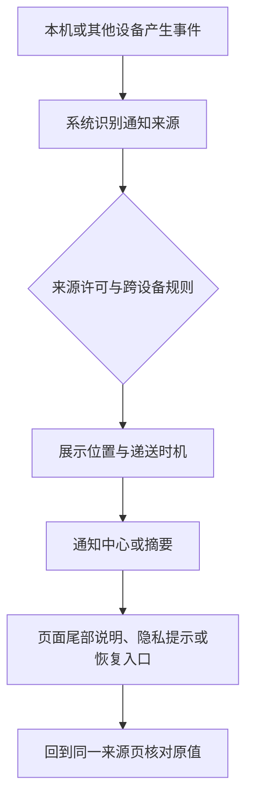

# 跨设备与底部状态：确认通知的来源和恢复路径

通知页面越往下，越容易遇到“来源从哪里来”“为什么这个来源没有普通应用页”“页面底部的说明是否影响当前开关”这类问题。本篇把最后一组来源页、跨设备提示和连续页面尾部放在同一条学习路径中：**先识别来源，再判断是否属于同一设备；先读当前状态，再决定恢复位置；不从陌生的动态文字推断固定系统规则。**

> [!important] 动态来源不等于学习词汇
> 原图中的来源名称、设备名称和个人状态只保留在本机画面里。正文中的“来源页”“跨设备来源”“连续页尾”是功能类别，不是对任何个人数据的改写。

## 学习目标

完成后，你应能解释为什么同一个通知系统里会出现本机来源、来自另一台设备的来源和系统级汇总入口；能读懂 `Notifications from iPhone`、`Allow`、`Turn Off`、`Show in Notification Center` 这类表达；也能在看完很长的通知页面后回到正确的上层，而不是随机切换来源开关。

## 来源、设备和页面尾部回答不同的问题

某些设置页从“来源配置”走到“跨设备投递”时，文本会出现设备名或同步状态。学习时要先把它还原成抽象关系：一台设备产生提醒，另一台设备按系统规则展示；这不是把两台设备变成同一个来源。长页面的尾部还可能包含隐私说明、恢复动作或进一步链接。它们与上方的开关紧密相关，却未必是新的许可层。

## 真实界面：末组来源的共同控制

> 本机截图未包含在公开版本中，以保护原图中的个人信息。

> 本机截图未包含在公开版本中，以保护原图中的个人信息。

> 本机截图未包含在公开版本中，以保护原图中的个人信息。

> 本机截图未包含在公开版本中，以保护原图中的个人信息。

> 本机截图未包含在公开版本中，以保护原图中的个人信息。

> 本机截图未包含在公开版本中，以保护原图中的个人信息。

> 本机截图未包含在公开版本中，以保护原图中的个人信息。

> 本机截图未包含在公开版本中，以保护原图中的个人信息。

> 本机截图未包含在公开版本中，以保护原图中的个人信息。

> 本机截图未包含在公开版本中，以保护原图中的个人信息。

> 本机截图未包含在公开版本中，以保护原图中的个人信息。

> 本机截图未包含在公开版本中，以保护原图中的个人信息。

> 本机截图未包含在公开版本中，以保护原图中的个人信息。

> 本机截图未包含在公开版本中，以保护原图中的个人信息。

> 本机截图未包含在公开版本中，以保护原图中的个人信息。

> 本机截图未包含在公开版本中，以保护原图中的个人信息。

> 本机截图未包含在公开版本中，以保护原图中的个人信息。

> 本机截图未包含在公开版本中，以保护原图中的个人信息。

> 本机截图未包含在公开版本中，以保护原图中的个人信息。

> 本机截图未包含在公开版本中，以保护原图中的个人信息。

> 本机截图未包含在公开版本中，以保护原图中的个人信息。

> 本机截图未包含在公开版本中，以保护原图中的个人信息。

> 本机截图未包含在公开版本中，以保护原图中的个人信息。

> 本机截图未包含在公开版本中，以保护原图中的个人信息。

> 本机截图未包含在公开版本中，以保护原图中的个人信息。

> 本机截图未包含在公开版本中，以保护原图中的个人信息。

> 本机截图未包含在公开版本中，以保护原图中的个人信息。

> 本机截图未包含在公开版本中，以保护原图中的个人信息。

> 本机截图未包含在公开版本中，以保护原图中的个人信息。

> 本机截图未包含在公开版本中，以保护原图中的个人信息。

> 本机截图未包含在公开版本中，以保护原图中的个人信息。

> 本机截图未包含在公开版本中，以保护原图中的个人信息。

> 本机截图未包含在公开版本中，以保护原图中的个人信息。

### 要保留完整理解的表达

| 原文 | 软件语境中文 | 正确理解 | 常见误读 |
| --- | --- | --- | --- |
| `Notifications from iPhone` | 来自 iPhone 的通知 | 与另一台设备相关的通知类别 | 所有本机来源的总开关。 |
| `Allow Notifications` | 允许通知 | 让当前来源可通过系统通知机制提醒 | 已保证每条提醒立即出现。 |
| `Show in Notification Center` | 在通知中心显示 | 保留一个可回看的展示位置 | 同时必然出现横幅。 |
| `Turn Off` | 关闭 | 对当前页所说明功能执行关闭动作 | 删除设备、账户或历史数据。 |
| `Learn More` | 了解更多 | 打开说明或帮助上下文 | 立即改变开关状态。 |
| `This Mac` | 这台 Mac | 指当前正在设置的设备 | 与同一账户下所有设备完全同步。 |

`from iPhone` 是介词短语，标注来源关系；它不表示你正把设置“发送到”另一台设备。`on this Mac` 则常标注作用位置。读跨设备文字时，把 **from** 当作来源、把 **on** 当作位置，能明显减少方向误解。

## 两个完整操作案例

### 案例一：不改变设备配置地检查跨设备通知

1. 打开 **System Settings → Notifications**，定位 `Notifications from iPhone` 或等价的跨设备说明。
2. 只读取它指向的来源关系、许可含义和设备范围，不登录、不配对新设备，也不改动网络。
3. 在页面底部查看是否有 `Learn More`、隐私说明或恢复线索。
4. 用英语报告：`I reviewed notifications from another device without changing device pairing or notification permission.`
5. 关闭或返回到通知列表。学习完成不依赖真实跨设备提醒是否到达。

### 案例二：根据页面尾部恢复一个展示选择

1. 先记录某一来源页的 `Notification Center`、横幅和预览状态。
2. 假设你的目标只是让通知继续留在中心，则只检查 `Show in Notification Center`，不使用 `Turn Off`。
3. 阅读页面底部的说明，确定它是在解释权限、提供帮助还是提供恢复入口。
4. 用英语区分：`I restored the display location. I did not turn off notifications for the source.`
5. 返回来源列表再进入同一页复核，避免从另一来源页误判恢复成功。

> [!warning] 跨设备页面不要用“试着断网”验证
> 断开网络、重新配对设备、改账户状态或触发私人提醒都会改变学习环境。本文把这些页面作为语言与结构学习材料；真正的设备故障排查应另行确认目标、影响范围和恢复方案。

## 英语表达规律：来源、位置、动作和范围

这组页面最值得掌握的是介词与动作的配合。`Notifications from ...` 说明来源，`show in ...` 说明出现的位置，`turn off ...` 表示关闭某项功能，`on this Mac` 说明操作落在哪台设备。完整表述时，把它们放进同一条句子：`Notifications from another device can appear in Notification Center on this Mac.` 这条句子不承诺横幅、声音或即时送达，只说明来源、位置和设备范围。

| 单词 | 音标 | 词性 | 本篇语境义 | 所在完整表达 |
| --- | --- | --- | --- | --- |
| source | /sɔːrs/ | n. | 来源 | `notifications from another device` |
| device | /dɪˈvaɪs/ | n. | 设备 | `Notifications from iPhone` |
| center | /ˈsentər/ | n. | 集中查看区域 | `Notification Center` |
| restore | /rɪˈstɔːr/ | v. | 恢复为原状态 | `restore the display location` |
| location | /loʊˈkeɪʃən/ | n. | 显示位置 | `Show in Notification Center` |
| range | /reɪndʒ/ | n. | 适用范围 | `on this Mac` |
| appear | /əˈpɪr/ | v. | 出现、显示 | `appear in Notification Center` |

## 不确定时如何留下可恢复的判断记录

跨设备字样常让人急于判断“同步是否失效”，但学习页面时更适合把未确认部分写成边界清楚的句子：`The page describes a cross-device notification source, but I have not tested delivery with a real message.` 这比说“它已经同步成功”更准确，因为后一句需要真实事件、设备状态和网络条件的证据。产品设置页展示的是可配置能力与当前可见状态，并不替代端到端传递的测试。

如果未来确实获得了合适的测试条件，建议先列出最小步骤：记录两端原始状态；只选择一个无敏感内容的测试事件；观察来源、展示位置和递送时机；最后恢复所有改动。这样即使结果不符合预期，也能判断问题发生在来源许可、跨设备资格、递送安排还是可见性，而不是盲目重置多个页面。

> [!tip] 把“未验证”说出来
> `I can see the setting, but I have not verified delivery yet.` 是很有用的工作句。它承认你已经读懂界面，同时避免把页面文字误当作真实状态证明。

这也是恢复安全的前提：先保存完整事实，再做任何变更，并把恢复位置、原始值和预期结果写在同一条记录里。

## 自测

1. `from iPhone` 与 `on this Mac` 分别说明什么关系？
2. `Show in Notification Center` 为什么不能推断横幅已开启？
3. 页面底部的 `Learn More` 会不会自动修改当前通知状态？
4. 用英语说“我检查了跨设备通知的来源和展示位置，没有改变设备配对”。

查看参考答案

1. 前者说明来源，后者说明当前作用位置或设备范围。
2. 通知中心和横幅是不同的展示位置。
3. 不会；它是说明入口，不是状态开关。
4. `I checked the source and display location of cross-device notifications without changing device pairing.`

## 版本与来源

本文依据本机 macOS 27.0 Beta (26A5425a) 于 2026-09-09 的采集。跨设备提醒依赖设备、账户与系统状态，实际可用项可能不同；本文不把动态设备关系写成固定事实。通知功能边界参考 Apple 的 [Change Notifications settings on Mac](https://support.apple.com/guide/mac-help/change-notifications-settings-mh40583/mac)。
