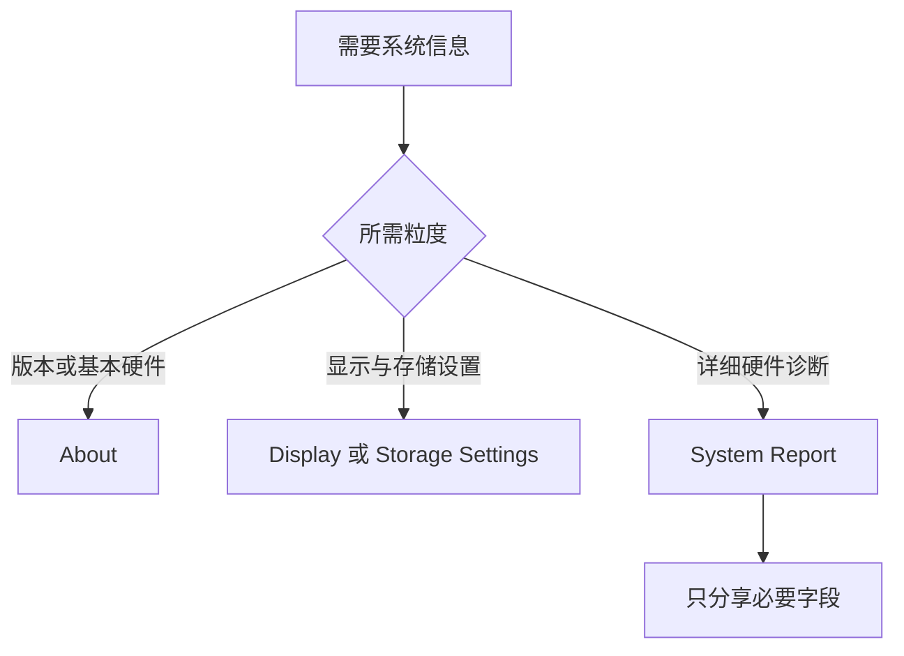

# 认识这台 Mac：设备信息、系统版本与保修资格

General 是系统维护的总入口，About 则回答“这台 Mac 是什么、正在运行什么系统、有哪些硬件能力”。AppleCare & Warranty 再回答“哪些设备可能具有保修或保障资格”。这三层都可能出现型号、版本、序列号、容量和覆盖状态，但它们的用途不同：设备信息用于确认环境，系统版本用于判断功能差异，保修资格用于寻找服务与覆盖范围。学习时必须把公开的通用表达与个人设备标识分开。

> [!warning] 设备标识和容量属于本机数据
>
> 型号、设备名称、序列号、精确容量、设备清单和覆盖资格随机器与账户变化。本文只解释 `Name`、`Chip`、`Memory`、`Serial number`、`Version` 和 `coverage` 等稳定英语表达，不记录实际序列号、设备名称或精确容量，也不将它们加入搜索、词汇表或练习。

## General、About 与 Warranty：三个页面回答不同问题

| 页面 | 核心问题 | 常见英文 | 不该用来做什么 |
| --- | --- | --- | --- |
| General | 系统维护入口在哪里？ | `overall setup and preferences` | 直接判断某个硬件是否仍有保修 |
| About | 这台 Mac 的软硬件信息是什么？ | `Chip`, `Memory`, `Version`, `System Report` | 直接修改系统更新策略 |
| AppleCare & Warranty | 哪些设备有覆盖状态或购买资格？ | `coverage status`, `eligible devices` | 替代系统序列号或发票验证 |

这三页的关系是“入口—事实—服务”。General 帮你找到 About 和 AppleCare & Warranty；About 展示本机当前环境的事实；Warranty 提供覆盖状态和符合资格设备的服务入口。遇到“某项功能为什么和教程不同”，优先检查 About 的 macOS Version；遇到“这台设备是否有保障”，才进入 AppleCare & Warranty。

## 界面实例：General 是系统维护的目录，不是普通设置

> 本机截图未包含在公开版本中，以保护原图中的个人信息。

| 完整英文 | 软件语境中文 | 关键理解 |
| --- | --- | --- |
| `Manage your overall setup and preferences for Mac` | 管理 Mac 的整体配置与偏好。 | `overall` 覆盖整台 Mac，不表示低风险。 |
| `Software Update` | 软件更新。 | 管系统版本和更新规则。 |
| `Storage` | 存储空间。 | 管磁盘容量和分类，而非“保存”动作。 |
| `AppleCare & Warranty` | AppleCare 与保修。 | 管服务覆盖与资格。 |
| `AirDrop & Continuity` | 隔空投送与连续互通。 | 管跨设备协作功能。 |
| `Language & Region` | 语言与地区。 | 管显示语言、格式与地区相关规则。 |
| `Login Items & Extensions` | 登录项与扩展。 | 管后台启动和系统扩展类别。 |
| `Sharing` | 共享。 | 管文件、屏幕或其他服务的对外访问。 |
| `Startup Disk` | 启动磁盘。 | 决定 Mac 从哪个系统卷启动。 |
| `Transfer or Reset` | 传输或还原。 | 高影响维护入口，需要额外确认。 |

General 的说明句使用 `such as` 引出例子：`such as software updates, device language, AirDrop, and more.` 它告诉你这些是整体配置的代表性项目，而非完整列表。看到 General 时，不应因为中文直觉把它当成“普通、可以随便改”的区域；这里包含更新、共享、启动磁盘和迁移等重要入口。

## About 页面：设备身份、系统环境与连接入口

> 本机截图未包含在公开版本中，以保护原图中的个人信息。

About 按区域呈现设备、macOS、Displays、Storage 与法律信息。它的主要价值是**核对环境**，不是一次性调整所有东西。每个区域通常带有 `Details…`、`Display Settings…` 或 `Storage Settings…` 等入口，把你带到可进一步操作的页面。

| 英文 | 软件语境中文 | 应怎样使用 |
| --- | --- | --- |
| `Name` | 名称。 | 可查看或修改设备显示名称；个人命名不应写进学习资料。 |
| `Chip` | 芯片。 | 识别处理器架构和硬件平台。 |
| `Memory` | 内存。 | 指运行内存容量，不是磁盘可用空间。 |
| `Serial number` | 序列号。 | 设备唯一标识，适合在可信服务渠道使用，不应公开。 |
| `macOS` | macOS 系统。 | 系统名称与版本信息的区域标题。 |
| `Version` | 版本。 | 核对功能、界面和兼容性差异。 |
| `Intel-based Apps Support` | 对基于 Intel 的 App 支持。 | 兼容性提示，说明未来版本变化可能影响旧架构 App。 |
| `Displays` | 显示器。 | 查看当前显示硬件和进入显示设置。 |
| `Storage` | 存储。 | 查看容量概况和进入存储设置。 |
| `System Report…` | 系统报告。 | 进入更详尽的硬件、软件与接口信息。 |

`Memory` 与 `Storage` 是最常被混淆的一对。Memory 表示运行 App 时使用的内存资源；Storage 表示磁盘的长期容量。出现“剩余空间不足”时，应到 Storage；出现“App 同时运行较多时反应慢”时，Memory 才是理解硬件环境的线索。不要将二者都翻成“内存”后失去区分。

## 系统版本：版本号是环境事实，不是更新按钮

About 中的 `Version` 描述当前系统处于哪个版本。它帮助判断截图、帮助文章和实际界面为什么不一致，但不会替代 Software Update 页面。查看版本是只读动作；更新软件则涉及下载、安装、重启、兼容性与可能的恢复计划。

| 你想确认什么 | 优先查看 | 不应立刻做什么 |
| --- | --- | --- |
| 教程中的按钮与本机不同 | About → `Version` | 假定功能被删除 |
| 某个 App 是否支持当前系统 | 版本、App 的系统要求、开发者文档 | 直接升级或降级系统 |
| 系统是否有更新可安装 | General → Software Update | 只凭 About 版本号判断 |
| 某类旧架构 App 的兼容性 | About 的兼容性提示与 App 文档 | 卸载 App 或改变启动磁盘 |

`Support ending for … in macOS …` 这类提示说明某项支持会在未来某个系统版本结束。它不是说当前立即不能使用，也不是要求你立刻更改系统。准确的复述是：`Support is expected to end in a future macOS version, so I should check the app’s compatibility before I update.`

> [!note] 版本差异要先核对，不要猜测
>
> 本机采集为 macOS 27.0 Beta，公开帮助资料可能对应不同版本。遇到标题、控件位置或可见选项不同，先在 About 核对 Version，再用本机页面搜索功能找到同名或近义入口。这样能把“界面改版”与“功能不可用”分开。

## Displays 与 Storage：信息概览和设置入口分别扮演什么角色

About 的 Displays 和 Storage 区域通常同时展示一条概览信息和一个跳转按钮。概览让你确认“当前是什么”，按钮让你进一步决定“需要到哪里修改”。这是一种常见的 macOS 信息架构。

| About 中的区域 | 概览回答什么 | 后续入口 | 适合的下一步 |
| --- | --- | --- | --- |
| `Displays` | 当前显示硬件与画面能力 | `Display Settings…` | 调整分辨率、亮度、Night Shift 或外接屏。 |
| `Storage` | 磁盘可用容量和总容量概况 | `Storage Settings…` | 分析分类、清理建议或容量管理。 |
| `macOS` | 系统版本和兼容性提示 | `Details…` | 查看系统具体信息。 |
| 设备身份 | 名称、芯片、内存等 | `Details…` 或 System Report | 为支持、兼容性或硬件诊断收集最少必要信息。 |

`available of` 的表达结构常见于容量说明：`X available of Y` 表示总共 Y 中还可用 X。它提供的是容量比例信息，而不是文件列表。若要描述容量问题，可以说：`I checked how much storage is available before opening Storage Settings.` 这句避免记录具体数值，也说明你尚未执行清理或删除。

## System Report：更详细不等于更适合公开

`System Report…` 会打开比 About 更详细的系统报告，可能包含硬件接口、网络、软件、外设和设备标识。它适用于支持人员要求特定信息、排查兼容性或核对硬件连接。因为信息颗粒度更细，分享前必须确定对方身份、所需范围和渠道。

这个流程的原则是最少披露。只需确认系统版本时，About 已足够；只需调整分辨率或检查磁盘时，应直接使用对应 Settings；只有支持或诊断明确要求时才打开 System Report。报告中的序列号、网络标识、设备名称不应被复制到公开文档、聊天或词汇学习资料中。

> [!warning] 支持请求也应最小化分享范围
>
> 服务人员可能需要系统版本、App 版本或某个错误信息，但通常不需要完整系统报告。先问清所需字段，删除或遮挡与问题无关的设备标识，再使用可信支持渠道提交。本文不将任何本机标识写入讲义示例。

## AppleCare & Warranty：覆盖状态、资格与设备范围

> 本机截图未包含在公开版本中，以保护原图中的个人信息。

AppleCare & Warranty 的说明句是：`View coverage status for all your devices, and purchase coverage for eligible devices.` 它由两个并列动词组成：查看覆盖状态，以及为符合条件的设备购买覆盖。`eligible devices` 表示符合资格的设备，不保证每台设备都能购买或仍有可用计划。

| 完整英文 | 软件语境中文 | 不应误解为 |
| --- | --- | --- |
| `coverage status` | 覆盖状态。 | 任意维修都免费。 |
| `purchase coverage` | 购买保障。 | 当前已自动拥有保障。 |
| `eligible devices` | 符合资格的设备。 | 所有登录账户的设备都符合资格。 |
| `This Device` | 此设备。 | 当前账户的全部设备。 |
| `More Devices` | 更多设备。 | 可以由当前页面管理的陌生设备。 |
| `Learn more about coverage…` | 进一步了解保障。 | 立即开始购买或提交维修。 |

覆盖状态与真实服务结果之间仍可能有地区、日期、购买记录、设备状况和服务条款等条件。页面适合用于确认下一步应去哪里查看，不适合在没有阅读细则时作出“肯定能免费维修”的结论。你可以说：`I checked the coverage status and will review the eligibility details before requesting service.`

## 两个完整操作案例

### 案例一：只读确认系统版本与显示器入口

1. 打开 **System Settings → General → About**。
2. 找到 macOS 区域，读取 `Version` 和可能的兼容性说明。
3. 找到 Displays 区域，说明 `Display Settings…` 会前往显示设置。
4. 不点击 Details、不修改设备 Name，也不打开 System Report。
5. 用英语报告：`I checked the macOS version and the display settings entry, but I did not change any device information.`

### 案例二：只读了解保修页面的设备范围

1. 打开 **System Settings → General → AppleCare & Warranty**。
2. 阅读 `coverage status`、`This Device`、`More Devices` 和 `eligible devices`。
3. 说明页面可查看状态，也可能为符合条件的设备提供购买入口。
4. 不打开设备详情、不提交服务请求、不购买任何覆盖计划。
5. 用英语说明：`I reviewed the coverage page and device categories, but I did not request service or purchase coverage.`

## 常见错误与恢复方式

| 错误 | 为什么会误判 | 更可靠的处理 |
| --- | --- | --- |
| 把 About 当作更新系统的页面 | About 只展示版本和环境信息 | 到 Software Update 查看可用更新与安装条件 |
| 把 Memory 当作磁盘剩余空间 | Memory 与 Storage 指不同硬件资源 | 分别确认运行内存和长期容量 |
| 复制完整 System Report 解决小问题 | 信息范围过大，可能含设备标识 | 只分享支持方明确需要的字段 |
| 看到 coverage 就承诺免费服务 | 覆盖还取决于资格与服务条款 | 阅读 eligibility 与具体细则 |
| 将 General 理解为低风险目录 | 其中有共享、启动磁盘、迁移和还原 | 先读页面说明与影响范围 |

## 英语表达规律：overall、available、eligible 与 coverage

General 和保修页面的英语强调范围、状态和资格。掌握这些词后，能更谨慎地理解服务或设备信息。

| 结构 | 原文片段 | 它表达什么 |
| --- | --- | --- |
| `overall + 名词` | `overall setup and preferences` | 整体范围，而非某个单独选项。 |
| `available of` | `available of …` | 总量之中的可用部分。 |
| `eligible for` | `eligible devices` | 符合某项服务或购买资格。 |
| `coverage status` | `View coverage status` | 当前保障或覆盖的状态。 |
| `such as + 名词` | `such as software updates…` | 举例说明范围，不代表完整清单。 |

描述只读检查时，可以说：`I opened General to review the overall system information and coverage status, but I left the device settings unchanged.` 这句话说明了范围、目的和未改动的边界。

## 自测

1. General、About 与 AppleCare & Warranty 分别回答什么问题？
2. Memory 与 Storage 为什么不能互相替换？
3. 查看 Version 与执行 Software Update 的区别是什么？
4. System Report 为什么需要最少披露原则？
5. 用英语说出“我查看了设备信息和保障资格，但没有修改名称或提交服务请求”。

查看参考答案

1. General 是系统维护入口，About 展示软硬件环境，AppleCare & Warranty 展示覆盖状态与资格。
2. Memory 是运行内存，Storage 是长期磁盘容量；它们对应不同问题。
3. Version 是只读环境信息；Software Update 管下载、安装与系统更新流程。
4. 它可能包含详细设备和网络标识，支持时只应提供必要字段。
5. `I reviewed the device information and coverage eligibility, but I did not change the device name or request service.`

## 版本与来源

- 本机界面事实：macOS 27.0 Beta (26A5425a)，采集日期 2026-09-09。
- 功能原理参考：[Find your Mac model and serial number](https://support.apple.com/102767)、[Get system information about your Mac](https://support.apple.com/guide/mac-help/get-system-information-mchlp1025/mac) 与 [Check your service and support coverage](https://support.apple.com/102865)。
- 设备名称、芯片、内存、显示器、容量、序列号、覆盖状态与可购买性均是设备或账户相关的动态信息。本文不记录这些具体值，只保留可迁移的系统英语和安全查看路径。
