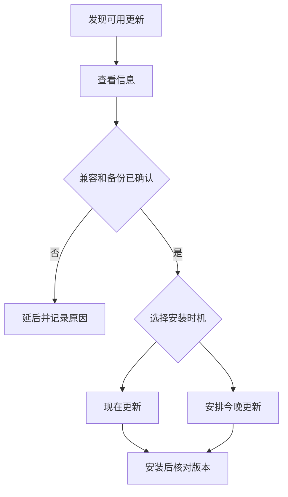

# 安全评估软件更新：现在安装、今晚更新与 Beta 渠道

Software Update 页面不只是一个“更新”按钮。它会同时显示可安装的 macOS 更新、其他可用组件、当前已安装系统、Automatic Updates 和 Beta Updates 状态。`Update Now`、`Update Tonight`、`Also Available`、`Installed` 和 `Beta Updates` 都在说明不同的更新时间、更新对象或渠道。开始安装前，必须先分清当前系统是什么、可安装包是什么、是否需要重启，以及 Beta 渠道会带来哪些兼容性风险。

> [!warning] 真实安装是高影响操作
>
> 本篇只讲解页面英语与评估流程，不会在学习时点击 Update Now、Update Tonight、Beta Updates 或自动更新设置。系统升级可能涉及下载、重启、驱动或 App 兼容性、工作中断与可恢复备份。只有确认版本、空间、备份、关键 App 与更新窗口后，才适合执行实际安装。

## 先分清四种状态：可更新、附加可用、已安装和更新渠道

| 页面状态 | 常见英文 | 它回答的问题 | 不应理解为 |
| --- | --- | --- | --- |
| 主更新 | `macOS …`, `Update Now`, `Update Tonight` | 当前可安装的系统更新是什么 | 已经完成安装 |
| 附加更新 | `Also Available` | 还有哪些独立组件可安装 | 必须和系统更新绑定安装 |
| 当前环境 | `Installed …` | 本机正在运行哪个系统版本 | 是否有新更新待安装 |
| 更新策略 | `Automatic Updates`, `Beta Updates` | 系统怎样自动获取或参与预发布渠道 | 当前按钮会立刻执行更新 |

同一页面上的版本号可能来自不同对象：主 macOS 更新、命令行工具、已安装系统或 Beta 渠道。数字相同不代表用途相同，必须先看前面的标题和所处区域。查看页面是只读动作；点击更新是系统变更动作，两者不应混为一谈。

## 界面实例：更新选项、已安装系统与自动策略

> 本机截图未包含在公开版本中，以保护原图中的个人信息。

| 完整英文 | 软件语境中文 | 关键边界 |
| --- | --- | --- |
| `Update Now` | 现在更新。 | 立即开始更新流程，可能需要下载、安装或重启。 |
| `Update Tonight` | 今晚更新。 | 将安装安排到之后的时间，不是保证任何时刻都无感完成。 |
| `Info` | 信息。 | 查看更新内容或更多说明。 |
| `Also Available` | 另有可用更新。 | 独立的其他组件更新入口。 |
| `Installed` | 已安装。 | 描述当前系统环境。 |
| `Automatic Updates` | 自动更新。 | 系统更新策略的概览。 |
| `On` | 已开启。 | 当前策略状态，不等于更新正在进行。 |
| `Beta Updates` | Beta 更新。 | 是否参与预发布更新渠道。 |
| `Show Detail` | 显示详情。 | 展开策略、渠道或更新内容的说明。 |
| `Use of this software is subject to … license agreement` | 使用此软件受许可协议约束。 | 安装前的法律与使用条件说明。 |

`Update Tonight` 中的 tonight 是一个相对时间词，表示在当天晚些时候安排操作。它不是“明天早上自动完成”的承诺；实际时间仍可能受电源、网络、设备状态和系统条件影响。若你有第二天必须稳定运行的工作，不能只因它写着 Tonight 就跳过更新前的检查。

## Update Now 与 Update Tonight：同一更新，不同的操作时机

| 选择 | 用户意图 | 需要预先确认 | 适合的表达 |
| --- | --- | --- | --- |
| `Update Now` | 希望现在开始更新 | 当前工作是否已保存、是否可接受重启与中断 | `I am ready to install the update now.` |
| `Update Tonight` | 希望延后到合适时段 | 夜间是否有电源、网络和足够空闲时间 | `I prefer to schedule the update for tonight.` |
| 只查看 `Info` | 先了解变更内容 | 更新对象、版本、大小和兼容性 | `I am reviewing the update information before installing it.` |
| 暂不选择 | 保持当前系统 | 是否需要备份、测试或等待稳定版 | `I am postponing the update until I verify compatibility.` |

`now` 与 `tonight` 都只描述时机，不描述更新范围。无论何时安装，都应检查同一组前提：关键文件有备份、重要 App 兼容、存储空间足够、设备可接电、当前没有会被中断的同步或任务。时间安排不能替代风险评估。

> [!tip] 用 Info 先建立更新判断
>
> `Info` 是低风险入口。先读版本、改进内容、已知要求和更新对象，再决定是否更新。学习页面英语时，优先练习“我正在查看更新说明”，不需要为了记住 Update Now 而启动真正的安装流程。

## Also Available：系统更新和工具更新可以并列出现

`Also Available` 意味着页面还列出了主系统更新以外的可安装组件。例如开发工具或其他系统组件可能单独出现在此区域。它们有自己的 Update Now 和 Info，并不自动跟随主 macOS 更新一起完成。

| 你看到的项目 | 应先确认 | 不要默认假设 |
| --- | --- | --- |
| 主 macOS 更新 | 系统版本、大小、重启要求、关键 App 兼容性 | 其他附加工具也自动更新 |
| Command Line Tools 或开发工具 | 是否真的需要此工具、开发环境兼容性 | 只是小补丁，不会影响开发工具链 |
| 其他附加组件 | 它属于哪个 App 或系统能力 | 与当前工作无关或可随时卸载 |

`also` 表示“除此之外还”，`available` 表示“可获得或可安装”。所以 `Also Available` 最准确的理解是“除主更新外还有其他可用项”。如果你只需要系统安全更新，不应因为附加工具也出现就不加区分地全部安装。可以说：`The system update and the additional tool update are listed separately, so I will review their compatibility independently.`

## Installed 与 Version：当前事实不等于下一步建议

`Installed …` 说明本机现在运行的版本，通常与 About 页面里的 Version 相互印证。它用于理解当前基线：你正在从哪个系统状态升级、文档和截图为何与他人的 Mac 不同、某个 App 要求是否满足。它不代表系统页面建议你立刻安装所有可用更新。

| 看到的文字 | 它用于什么 | 不能得出的结论 |
| --- | --- | --- |
| `Installed macOS …` | 核对当前系统版本 | 当前版本已是最新稳定版 |
| `Version …` | 比较系统环境与支持要求 | 更新已经下载完成 |
| `Available` | 某个更新可供选择 | 更新适合当前所有工作负载 |
| `Update` | 存在可执行安装动作 | 安装不会重启或影响兼容性 |

若你在调查一个问题是否由系统版本差异造成，可以写：`The Mac is currently running this version, while the documentation describes a different release.` 这句话只陈述环境差异，不臆测哪个版本更好或应立即升级。

## Automatic Updates：策略开启不代表立即更新

Automatic Updates 的 `On` 描述一个策略状态。它回答“系统是否按当前策略自动处理某些更新”，而不是“现在有没有下载、安装或重启”。点击 Show Detail 前后，应注意页面可能将自动检查、下载、安装和系统数据文件更新拆成多个选项；每一项影响的时机和范围可能不同。

| 概念 | 应问的问题 | 正确表达 |
| --- | --- | --- |
| 自动检查 | 系统是否主动寻找更新？ | `The Mac checks for updates automatically.` |
| 自动下载 | 更新是否先下载到本机？ | `Updates may download automatically.` |
| 自动安装 | 系统是否在合适条件下安装？ | `Installation is controlled by the automatic update policy.` |
| 自动重启 | 是否会在重启前请求或等待条件？ | `I need to review the restart conditions separately.` |

所以 `Automatic Updates: On` 是一个起点，不是完整诊断结果。若你需要避免在某个演示或出差期间发生变化，先展开详情并确认具体规则，而不是只根据 On 或 Off 下结论。

这个流程图的重点不是要求所有更新都延后，而是让选择有可追溯依据。主更新和附加工具更新都应经过 Information、兼容性和备份确认；安装后再到 About 或 Software Update 核对 Installed 状态。若安装异常，需要保留更新前的版本、时间和错误信息，而不是重复点同一个按钮。

## Beta Updates：预发布渠道和稳定更新不是同一风险等级

`Beta Updates` 明确表示设备可能参与预发布系统渠道。Beta 的价值在于较早体验功能和帮助测试，代价是 App、驱动、外设、企业工具或自动化流程可能出现兼容性问题。页面显示某个 Beta 名称只说明当前渠道选择，不表示所有未来更新都已测试或适合生产工作。

| 项目 | 常见目的 | 主要风险 | 更稳妥的做法 |
| --- | --- | --- | --- |
| 正式系统更新 | 获取面向普遍用户的修复和功能 | 仍可能有兼容性与重启风险 | 查看信息、备份、安排窗口 |
| `Beta Updates` | 尝试预发布系统和功能 | 未完成兼容、行为变化、工具链波动 | 在非关键设备或可恢复环境中评估 |
| 开发者 Beta | 早期测试与适配 | 更高的不稳定性与 API/界面变化 | 保留工作环境回退与测试记录 |

> [!warning] 不把 Beta 用作无条件升级建议
>
> 本机采集来自 Beta 环境，因此本文可解释其界面英语，却不将 Beta 推荐给任何需要稳定生产、关键工作、考试、演示或重要外设支持的场景。参与预发布渠道前应有经过验证的备份和恢复方案，并确认关键 App 的兼容声明。

## 许可协议：点击安装前的约束不是装饰文字

`Use of this software is subject to the original license agreement that accompanied the software being updated.` 表示软件使用受随原软件附带的许可协议约束。`is subject to` 是“受……约束”，不是“可以随意选择是否遵守”。系统更新页面里的许可提示不说明更新内容本身，而是提醒安装和使用仍遵循既有条款。

当你需要报告自己做了什么，可以说：`I reviewed the update information and the license notice before deciding whether to install the software.` 这是一种准确的只读操作描述。

## 两个完整操作案例

### 案例一：只读比较现在更新和今晚更新

1. 打开 **System Settings → General → Software Update**。
2. 读取主更新旁的 `Update Now`、`Update Tonight` 与 `Info`。
3. 分别解释 now 是立即时机，tonight 是延后时机，Info 是查看说明。
4. 不点击任何更新、Info 或 Beta Updates。
5. 用英语报告：`I compared Update Now and Update Tonight, but I did not start or schedule an installation.`

### 案例二：只读核对自动策略与 Beta 渠道

1. 在 Software Update 页面找到 `Automatic Updates` 与 `Beta Updates`。
2. 说明 On 只是策略状态，Beta Updates 是预发布渠道状态。
3. 阅读可用的 Show Detail 文案，不更改任何选项。
4. 不启用、退出或切换 Beta 渠道。
5. 用英语说明：`I checked the automatic update policy and beta update channel, but I did not change either setting.`

## 常见错误与恢复方式

| 错误 | 为什么会误判 | 更可靠的处理 |
| --- | --- | --- |
| 看到 Update Now 就立刻安装 | 未核对工作、备份、兼容性与重启 | 先用 Info 建立更新判断 |
| 把 Also Available 当成主系统更新的一部分 | 附加组件可能有独立用途与风险 | 分别评估系统与工具更新 |
| 以为 Automatic Updates On 表示正在更新 | 策略状态与当前任务不同 | 展开详情并检查是否有安装活动 |
| 将 Installed 误读为已经更新到最新 | 它只描述当前版本 | 对照可用更新与版本说明 |
| 将 Beta Updates 当成普通小更新 | 预发布渠道风险不同 | 在可恢复环境和兼容性验证后再决定 |

## 英语表达规律：available、installed、subject to 与 before

Software Update 的语言特别强调状态、条件和安装前动作。学会这些结构可以避免把信息提示误当成执行指令。

| 结构 | 原文片段 | 它表达什么 |
| --- | --- | --- |
| `also available` | `Also Available` | 除主项外还有可用项目。 |
| `installed + 名词` | `Installed macOS …` | 当前已在本机安装的环境。 |
| `subject to + 名词` | `subject to the … license agreement` | 受条款或协议约束。 |
| `before + -ing` | `before installing it` | 安装前必须完成的检查。 |
| `schedule … for + 时间` | `schedule the update for tonight` | 为以后某时安排任务。 |

一段完整的安全更新表达可以是：`I reviewed the available update, checked compatibility and backups, and scheduled installation for a time when a restart will not interrupt work.` 这句话涵盖观察、核对和安排，但不声称更新已经成功。

## 自测

1. Update Now、Update Tonight 与 Info 分别用于什么？
2. Also Available 为什么需要独立评估？
3. Automatic Updates On 为什么不表示更新正在进行？
4. Beta Updates 与正式系统更新的风险边界有什么不同？
5. 用英语说出“我检查了可用更新和自动策略，但没有开始、安排或更改更新”。

查看参考答案

1. 分别表示现在开始安装、安排到今晚安装、查看更新说明。
2. 它可能是独立工具或组件更新，有自己的兼容性和用途，不必跟随主系统更新一同安装。
3. On 只表示自动策略已开启，实际下载、安装或重启仍取决于具体条件。
4. Beta 属于预发布渠道，可能有更高的兼容性和稳定性风险；正式更新也需评估，但风险性质不同。
5. `I checked the available updates and automatic policy, but I did not start, schedule, or change any update.`

## 版本与来源

- 本机界面事实：macOS 27.0 Beta (26A5425a)，采集日期 2026-09-09。
- 功能原理参考：[Update macOS on Mac](https://support.apple.com/guide/mac-help/update-macos-mchlpx1065/mac) 与 [Use Software Update settings on Mac](https://support.apple.com/guide/mac-help/change-software-update-settings-mchlpx1066/mac)。
- 可用更新、大小、开发工具、自动更新细则与 Beta 渠道会随本机、地区、网络和账户状态变化。本文保留稳定术语和风险评估方法，不把当前可用包写成普遍或永久的更新建议。
