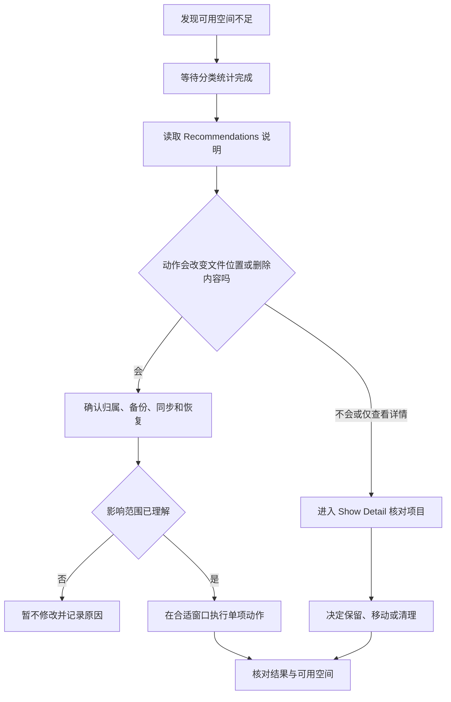

# 读懂存储空间：分类、优化建议与可恢复清理

Storage 不是“看到红色就删文件”的页面。它把磁盘占用拆成可识别的类别，把可以立刻查看的内容和只能由系统管理的内容分开，并给出 Recommendations。你可以从这个页面回答四个问题：空间总量和 Available space 是什么；哪一类内容占用较多；某个清理建议到底会做什么；以及一个动作是否可恢复。只有先回答这些问题，才适合进入 Finder、卸载应用或修改云端同步策略。

> [!warning] 容量图不是删除清单
>
> 本篇用于学习界面英语和建立判断方法。不要因为某一类别显示得大，就删除不了解用途的文件、开发环境、系统资源或共享资料。删除、清空废纸篓、改变 iCloud 同步和卸载应用都可能影响其他人、其他设备或正在进行的工作；开始前先确认文件归属、备份与恢复路径。

## 学习目标与操作路径

打开路径是 **Apple menu → System Settings → General → Storage**。在较窄窗口中，可能先看到左侧 General，再在右侧选择 Storage；页面加载期间，部分分类会显示 `Calculating…` 或忙碌状态。那表示系统仍在统计，不能把暂时缺失的数字解读为“该类别为空”。

本篇完成后，你应能做到：

1. 区分 `used`、`available`、分类容量和正在计算的状态。
2. 读懂 `Recommendations` 中 Store in iCloud、Optimize 和自动清空废纸篓的实际影响。
3. 用 `Show Detail` 把“类别总量”变成“可核对的项目”，而不立即删除。
4. 说清 `System Data`、`macOS`、Other Users & Shared 与普通文件类别的管理边界。
5. 用完整英文描述“我只是查看”“我已经确认”“我准备删除”三个不同阶段。

## 存储页面的判断模型：总量、可用空间、分类和建议

Storage 页面上方是存储条或容量概览。它表达的是当前观察到的分配，而不是精确到永久不变的账本：文件下载、缓存生成、备份、索引和系统任务都可能改变显示。下方通常先出现 Recommendations，再出现按类别归集的项目。一个类别的数字大，并不自动指向某个具体文件；`Show Detail`、Finder 或相应应用才是继续核对的入口。

| 层级 | 页面常见英文 | 它回答的问题 | 不应推出的结论 |
| --- | --- | --- | --- |
| 容量概览 | `… of … used` | 已使用空间占总空间多少 | 所有占用都可以安全删除 |
| 空闲空间 | `Available` | 还可用于新文件、更新或工作空间的容量 | 空间永远不会变化 |
| 分类 | `Applications`、`Documents`、`Photos` | 哪一类数据被统计为占用来源 | 类内每个项目都同样重要 |
| 建议 | `Recommendations` | 系统提供的可选优化动作 | 建议会在未经确认时删除你的资料 |
| 详情 | `Show Detail` | 进入某一类别的可核对范围 | 点开详情就会执行删除 |

`used` 是过去分词，表示“已被使用”；`Available` 是形容词，表示“可使用的、可获得的”。界面里的 `… of … used` 可以自然读成“总容量中已有多少被占用”。为了保护隐私和避免把动态数据写成教材事实，下面只讨论这种结构，不记录当前设备的具体容量、卷名或编号。

## 界面实例：容量概览、建议与分类入口

> 本机截图未包含在公开版本中，以保护原图中的个人信息。

这张原始截图保留在本机资源目录。截图中的账号、卷名、数值或项目名称属于设备当时的界面数据，不写入正文、搜索索引、词汇表或练习题。学习时应关注可复用的标题、按钮、说明句和操作关系。

| 完整界面表达 | 软件语境中文 | 控件或状态 | 点击或读取后的作用 |
| --- | --- | --- | --- |
| `Storage` | 存储空间。 | 页面标题。 | 进入容量概览与清理建议。 |
| `Available` | 可用空间。 | 只读状态。 | 说明当前可再使用的容量。 |
| `Recommendations` | 优化建议。 | 分组标题。 | 汇集可选的空间管理动作。 |
| `Store in iCloud…` | 储存在 iCloud 中。 | 操作按钮。 | 打开与云端存放和优化有关的设置流程。 |
| `Optimize…` | 优化。 | 操作按钮。 | 查看自动移除已观看媒体等优化选项。 |
| `Turn On…` | 开启。 | 操作按钮。 | 启用某项自动规则前继续确认。 |
| `Show Detail` | 显示详情。 | 详情按钮。 | 展开或进入某一类别的项目级信息。 |
| `Calculating…` | 正在计算。 | 进行中状态。 | 表示容量归类尚未完成。 |
| `System Data` | 系统数据。 | 分类名称。 | 显示由系统管理、规模可能波动的资源。 |

`Available` 不是“可以随便占用”的意思，而是当前可供系统和用户使用的空间。系统更新、临时下载、应用安装和本地快照都可能需要空闲容量。因此，看到 Available 较少时，更可靠的第一句话是：`I need to review what is using storage before I remove anything.` 它表达先核对后行动，而不是先假定某类资料无用。

> [!tip] 先让统计完成，再比较
>
> `Calculating…` 说明类别统计正在运行。等待它变成具体类别和数值后再比较；如果统计持续异常，记录页面状态、时间和正在运行的任务，先检查是否有索引、下载、备份或系统更新活动。不要把等待中的类别当作零占用后再做删除决定。

## Recommendations 的真实含义：建议、效果与不可逆边界

Recommendations 是“可选策略”，不是系统强制命令。每一项的英文说明包含关键条件，例如 `when storage space is needed`、`already watched` 和 `for more than 30 days`。这些条件决定动作会影响哪些文件，也决定你是否有机会在执行前改变想法。

### Store in iCloud：把本地可用空间与云端可访问性一起考虑

`Store in iCloud…` 的中心意思不是“把电脑复制一份到云端”。它会将适用文件存放到 iCloud 服务，并在空间需要时让某些内容按需下载或保留优化版本。文件仍可能在 Finder 中可见，但它的本地可用性、下载等待时间、网络依赖与其他设备同步范围都需要单独确认。

| 先问的问题 | 为什么要问 | 可用英文 |
| --- | --- | --- |
| 哪些位置会纳入同步？ | Desktop、Documents、照片或信息的策略不一定相同。 | `Which folders will be stored in iCloud?` |
| 原始文件是否随时本地可用？ | 可能需要联网重新下载。 | `Will the original file remain available offline?` |
| 是否影响另一台设备？ | 同步后的移动或删除可能反映到其他已登录设备。 | `Could this change affect my other devices?` |
| 是否有空间与账户条件？ | 云端存储和本地优化都受服务状态影响。 | `I need to check the storage and account requirements first.` |

不要把 `Store in iCloud` 与备份混为一谈。同步服务让文件在多个位置保持可访问，不自动等同于一个独立、可恢复到历史时点的备份方案。对唯一且重要的文件，仍应按你的备份策略保留可恢复副本。

### Optimize：针对指定内容的空间优化，不是通用清理器

`Optimize…` 在界面说明里通常与已经观看过的电影、电视节目或近期邮件附件有关。`already watched` 的语义是“已经看过”，它限定了优化规则的对象；并不表示系统能自动判断所有大型文件都无价值。官方说明还会因 macOS 版本和可用服务不同而变化，所以应在当前页面的说明和确认对话框里核对范围。

| 表达 | 逐段理解 | 做决定前的核对 |
| --- | --- | --- |
| `Save space by automatically removing …` | 通过自动移除某类内容来节省空间。 | 被移除的内容能否重新下载或恢复？ |
| `you’ve already watched` | 你已经看过的。 | 它是否真是可重新获取的媒体？ |
| `when storage space is needed` | 当系统需要空间时。 | 系统何时判断为需要，是否适合当前工作？ |
| `Optimize Storage` | 优化存储。 | 优化的具体范围、服务和版本边界是什么？ |

如果你只是学习，不必点击 Optimize。可用的只读练习是先把说明读完，再复述：`Optimize Storage can remove eligible media to save space, but I need to review the scope before turning it on.` 这样既掌握软件英语，也不改变设备。

### Turn On：自动清空废纸篓是规则，不是一次性预览

在 Storage 的建议区，`Turn On…` 常用于一个自动规则：删除在 Trash 中停留超过一定时间的项目。`automatically` 说明此后系统会按规则处理，而不是只清理现在看见的一个文件。废纸篓内的内容在真正清空前仍可移回原位置或另存；一旦清空，恢复途径会明显减少。

> [!warning] 自动清空要先确认恢复方案
>
> 不要为了释放少量空间而马上启用自动清空。先查看废纸篓是否存在待确认的工作文件，确认备份是否可用，并理解该规则会持续生效。需要保留的资料应离开废纸篓、移到明确目录并完成备份，而不是依赖“以后再想起来”。

可以准确说：`Turning this on changes a future cleanup rule; it does not only clean the items I see today.` 这里 `changes a future cleanup rule` 把“改一次设置”与“之后持续生效”清楚地区分开。

这个流程强调顺序：容量少只是触发调查的信号；Recommendations 只是候选方案；只有明确影响范围和恢复条件后，才从查看走到修改。执行后再回到 Storage 核对 Available 与分类变化，避免只凭 Finder 的一次操作就认为问题已经解决。

## 从类别到项目：Show Detail 是核对入口

页面列出 Applications、Documents、Photos、Trash、iCloud Drive、Mail、Messages、Developer 等类别时，最安全的下一步通常是 `Show Detail`。`show` 是“显示”，`detail` 是“细节”；按钮并不等于 Delete。它让你从“某类内容占用多少”进入“这类内容由哪些项目组成”的调查。

| 类别 | 通常表示什么 | 可先做的只读动作 | 不应直接做的事 |
| --- | --- | --- | --- |
| `Applications` | 已安装的用户应用所占空间。 | 查看不再使用的应用与版本。 | 删除不认识的系统组件。 |
| `Documents` | 用户文档、下载内容和不在其他类别的文件。 | 按大小、种类或最近访问时间查看。 | 把所有大文件都当作可删文件。 |
| `Photos` | 系统照片图库相关内容。 | 确认图库、同步和原片策略。 | 未确认同步状态就删除照片。 |
| `Trash` | 已移入废纸篓、尚可能恢复的项目。 | 打开废纸篓检查内容。 | 未备份重要内容就清空。 |
| `Developer` | 开发工具、缓存、模拟器或项目资料等。 | 区分可重新生成的缓存与项目原件。 | 删除不了解依赖关系的工作目录。 |
| `iCloud Drive` | 云端文件的本地与按需可用状态。 | 检查文件是否已同步、是否可离线。 | 把本地移除误认为云端备份完成。 |

有些类别只能显示占用，不提供项目级删除入口。`macOS` 和 `System Data` 就属于特别需要克制的例子。System Data 可能包含日志、缓存、虚拟内存、临时资源、应用支持文件和系统维护所需的数据，大小会随任务波动。它不是一个叫作“System Data”的普通文件夹；在不理解来源时，手工清除系统路径可能让系统或应用失去需要的数据。

| 看到的类别 | 应如何理解 | 更合适的下一步 |
| --- | --- | --- |
| `macOS` | 系统应用和系统文件占用。 | 保持由系统管理，使用受支持的更新或维护路径。 |
| `System Data` | 不适合其他类别的系统资源集合。 | 等待状态稳定，检查明显的下载、备份或应用任务。 |
| `Other Users & Shared` | 其他用户账户或共享位置的内容。 | 确认归属和共享关系后再联系所有者或管理员。 |
| `Calculating…` | 分类过程尚未完成。 | 等待并重新查看，避免立刻做基于不完整统计的操作。 |

> [!note] “占用大”与“可以清理”是两句话
>
> `takes up a lot of space` 只描述体积；`can be removed safely` 才讨论可删除性。两者之间必须补上文件归属、是否可重新获取、是否被项目或系统使用、是否已备份四项确认。把这两个句子分开，是避免误删的关键英语思维。

## 两个完整操作案例

### 案例一：只读找出需要进一步核对的类别

目标是把一个模糊问题——“为什么空间不够？”——转换成可验证的观察，不改变任何设置。

1. 打开 **System Settings → General → Storage**，等待 `Calculating…` 不再显示，或记录仍在计算的类别。
2. 读取容量概览和 `Available`，只记下“空间较紧张”或“空间尚可”的判断，不记录设备名、账号或具体数值到学习笔记。
3. 阅读 `Recommendations` 的标题和说明，先不点 `Store in iCloud…`、`Optimize…` 或 `Turn On…`。
4. 选一个普通类别旁的 `Show Detail`，查看项目时只使用排序、筛选或 `Show in Finder` 一类查看动作。
5. 对每个候选项目写下三个问题：它属于谁；能否重新获取；是否有备份或版本控制。
6. 用英语总结：`I reviewed the storage categories and opened the details, but I did not delete or change any setting.`

这个案例的完成标准不是“立刻腾出空间”，而是能给出一个可核对的候选列表。若资料归属不清，停在查看阶段就是正确结果。

### 案例二：为一个明确可丢弃项目建立可恢复清理流程

目标是对已经确认无用、非共享、可重新获取或已备份的普通文件进行一次小范围清理。不要把这个案例用于系统文件、工作项目、唯一照片、未知应用数据或他人资料。

1. 在 `Show Detail` 或 Finder 中找到一个你明确拥有的候选项目，并核对文件名、位置和最后使用情况。
2. 先确认该项目不是唯一副本；若不确定，创建备份或停止操作。
3. 若项目应保留但不必本地常驻，优先考虑移动到明确的外部存储或按你已配置的云端策略处理，而非直接删除。
4. 若项目确实无需保留，移到 Trash；此时空间未必立刻可用，因为废纸篓仍保存它。
5. 重新打开 Trash，确认移入的是正确项目；只在你接受永久删除且有恢复依据时才清空。
6. 回到 Storage，等待统计更新，比较分类和 Available 的变化。
7. 用英语记录：`I removed one verified file, checked the Trash, and confirmed the storage change afterward.`

> [!success] 小范围验证比批量清理可靠
>
> 先完成一个已验证项目，检查分类是否按预期变化，再决定是否继续。这样能把错误限制在可恢复范围内，也能让“remove”“move to Trash”“empty the Trash”三个动作与真实结果对应起来。

## 常见错误、风险与恢复方式

| 常见错误 | 为什么不可靠 | 更好的处理与恢复 |
| --- | --- | --- |
| 看到 `System Data` 很大就寻找命令强行清理 | 该分类会波动，且包含系统管理资源。 | 等待统计、查看当前任务；异常持续时走受支持的诊断路径。 |
| 把 Store in iCloud 当作完整备份 | 同步与历史恢复、离线可用性不是同一件事。 | 先核对同步范围，重要资料仍保留独立备份。 |
| 在没有核对 Trash 的情况下启用自动清空 | 后续规则可能删除未来放入废纸篓的项目。 | 先确认备份和工作习惯，必要时保持关闭。 |
| 依据类别数字删除开发或工作目录 | 缓存、依赖、构建产物和原始项目可能混在一起。 | 先在工具本身或项目文档中确认可再生成的内容。 |
| 认为移入 Trash 已释放空间 | 废纸篓内容通常仍占本地容量。 | 在确认无误后才清空，并重新核对 Storage。 |
| 分类显示 Calculating 就反复点击或重启 | 可能只是统计尚未完成。 | 等待、记录状态，必要时在无关键任务时再排查。 |

若误把普通文件移到 Trash 但尚未清空，优先在 Trash 中使用 Put Back 或移到一个明确位置。若已经永久删除，恢复可能取决于独立备份、云端版本或专业恢复条件，不能承诺一定找回。这样解释 `recover` 和 `restore` 时更准确：它们描述尝试恢复的过程，不保证每一种数据都有结果。

## 英语表达规律：容量、条件、动作与确认

Storage 页面常见的英文不是复杂技术术语，而是“数量 + 状态 + 条件 + 后果”的组合。掌握组合后，可以读懂新的类别和未来版本的说明。

| 结构 | 原文或可用表达 | 语义重点 |
| --- | --- | --- |
| `… of … used` | `… of … used` | 总量中已有一部分被占用。 |
| `space is needed` | `when storage space is needed` | 触发条件，不等于现在必然发生。 |
| `by + -ing` | `Save space by automatically removing …` | 通过某动作实现结果。 |
| `items that have been …` | `items that have been in the Trash …` | 用完成时说明已经持续的状态。 |
| `Show Detail` | `Show Detail` | 查看入口，不等于变更动作。 |
| `available for` | `available for use` | 可供某用途使用。 |

`automatically removing` 中的 automatically 修饰 removing，强调执行主体是系统规则。`have been in the Trash` 表示项目已经处于废纸篓状态一段时间；它不表示项目刚刚被删除。你可以对比两句：

- `The file is in the Trash.`：文件现在在废纸篓中。
- `The file has been in the Trash for more than thirty days.`：文件已经在废纸篓中超过三十天。

用于工作沟通时，下面三句分别对应不同事实，不能混用：

| 阶段 | 推荐表达 | 不能替代为 |
| --- | --- | --- |
| 只观察 | `I reviewed the storage details.` | `I cleaned up the storage.` |
| 已做选择 | `I identified files that can be removed safely.` | `I removed all large files.` |
| 已完成动作 | `I emptied the Trash after confirming the contents.` | `I optimized the entire Mac.` |

## 自测

1. `Available` 和 `… of … used` 分别说明什么？
2. `Recommendations` 为什么不是“立刻执行清理”的命令清单？
3. `Store in iCloud…` 与独立备份有什么不同？
4. 在 Storage 页面看见 `Calculating…` 时，应先做什么？
5. 为什么 `Show Detail` 是调查入口而不是删除操作？
6. 用英语表达：“我先查看了分类和详情，没有删除或改动任何设置。”

查看参考答案

1. Available 是当前可使用的空间；`… of … used` 表示总容量中已被占用的部分。
2. 它们是可选策略，每项都有范围、条件和可能影响，需要先阅读说明并确认恢复边界。
3. iCloud 同步或优化可让内容按需可用，但不自动等于独立、可回到历史时点的备份。
4. 等待统计完成或记录其状态；不要据不完整分类立即删除。
5. 它用于从类别总量核对到项目层面，本身不表示删除或修改。
6. `I reviewed the categories and details first, and I did not delete files or change any settings.`

## 版本边界与来源

- 本机界面事实来自 macOS 27.0 Beta (26A5425a) 的本地采集，采集日期为 2026-09-09。实际分类、建议、容量和项目会随设备、账户、同步状态与任务变化。
- 功能解释参考 Apple 的 [Change Storage settings on Mac](https://support.apple.com/en-gb/guide/mac-help/mchl3d437fbc/26/mac/26) 和 [Optimise storage space on your Mac](https://support.apple.com/en-gb/guide/mac-help/sysp4ee93ca4/mac)。这些公开指南以其发布版本为准，和本机 Beta 界面不同之处应以当前本机页面与确认对话框为准。
- 文件删除和废纸篓恢复边界参考 Apple 的 [Delete files and folders on Mac](https://support.apple.com/guide/mac-help/delete-files-and-folders-on-mac-mchlp1093/26/mac/26)。永久删除前请先确认备份与项目归属。
