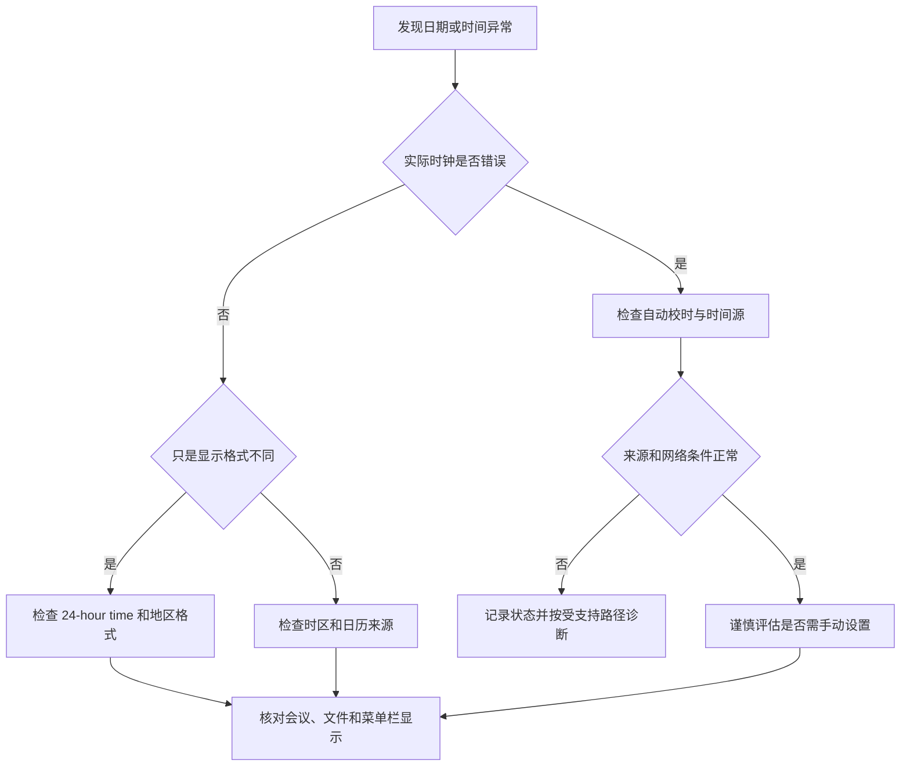

# 校准时间与本地化体验：日期、时区、语言与地区

时间、语言和地区设置看起来只是显示偏好，实际影响远比“菜单显示什么语言”更广。日期会出现在邮件、文件、日历、日志和签名中；时区会影响会议、提醒和旅行时的时间解释；区域会改变数字、小数点、货币、温度和一周起始日的格式；首选语言还会影响系统、应用、网站和共享文字的呈现。学习这些页面时，要把“显示格式”与“账户、位置、网络、数据本身”严格分开。

> [!warning] 时间与语言变更可能影响工作流
>
> 本篇先讲界面英语与安全的查看流程。手动改时间可能造成证书、同步、日志、构建或会议时间异常；自动定位时区需要位置服务；改变主语言可能要求退出应用或重启；区域和数字格式可能影响导入导出、表格和脚本。没有明确原因时，只读查看通常比修改更合适。

## 两条路径，四类问题

Date & Time 的路径是 **Apple menu → System Settings → General → Date & Time**。它处理“现在几点”“是否通过网络校时”“时区从哪里来”“菜单栏显示 12 小时还是 24 小时”。Language & Region 的路径是 **Apple menu → System Settings → General → Language & Region**。它处理“界面优先使用什么语言”“日期和数字怎样写”“温度和度量单位是什么”“某个应用是否单独使用另一种语言”“哪些翻译语言可离线使用”。

| 你想解决的问题 | 应先进入的页面 | 核心英文 | 不要误以为 |
| --- | --- | --- | --- |
| 时间戳不对 | `Date & Time` | `Set time and date automatically` | 改显示格式能修正系统时钟 |
| 旅行后会议时间不对 | `Date & Time` | `Set time zone automatically using your current location` | 选城市只改变一个 App |
| 想采用 24 小时制 | `Date & Time` | `24-hour time` | 这会改变文件本身的创建时间 |
| 日期、数字或温度格式不同 | `Language & Region` | `Region`、`Number format` | 只是翻译菜单文字 |
| 某个应用想单独显示另一种语言 | `Language & Region` | `Applications`、`Preferred Languages` | 会自动更改所有系统语言 |
| 希望离线翻译 | `Language & Region` | `Translation Languages…` | 只要联网就不涉及下载或本地处理 |

这两页都可能显示动态的日期、城市、地区或预览数值。它们是当时设备的界面数据，不是教程要背诵的词汇。正文保留稳定控件名称和完整句式，不记录具体位置、设备时钟或个人偏好。

## Date & Time：先让系统时间可信，再讨论显示方式

电子邮件、消息、文件和日志都依赖时间戳。`Set time and date automatically` 说明系统会使用网络时间服务器校准日期和时间；这是一项系统时间来源策略，不只是把屏幕上的钟表换一种外观。`Source` 旁的 Set 按钮与时间服务器来源有关，只有在需要调整自动时间来源时才应继续操作。

## 界面实例：自动校时、时区与 24 小时制

> 本机截图未包含在公开版本中，以保护原图中的个人信息。

| 完整界面表达 | 软件语境中文 | 类型 | 正确理解 |
| --- | --- | --- | --- |
| `Set time and date automatically` | 自动设置日期和时间。 | 开关。 | 使用网络时间源校准系统时钟。 |
| `Source` | 来源。 | 字段标题。 | 显示时间校准所依据的网络来源。 |
| `Set…` | 设置。 | 操作按钮。 | 继续配置来源或手动时间前的入口。 |
| `Date and time` | 日期和时间。 | 只读状态。 | 显示当前系统时钟结果。 |
| `24-hour time` | 24 小时制。 | 开关。 | 改变时间显示方式。 |
| `Set time zone automatically using your current location` | 使用当前位置自动设置时区。 | 开关。 | 依据位置决定时区，需要相应的位置能力。 |
| `Time zone` | 时区。 | 只读或可选字段。 | 当前使用的时区，而不是当前城市本身。 |
| `Time zone city` | 时区城市。 | 组合框。 | 手动设置时区时用于选择代表性城市。 |

`Set time and date automatically` 的语法是动词 Set 加名词 time and date，再由 automatically 修饰 Set。它说明“让系统自动设置”，不是“显示当前自动时间”。当开关为 on 时，界面里的 Date and time 是自动设置后的结果；当关闭开关后，手动时间输入才可能出现。这个前后关系很重要：先改策略，再出现可编辑字段。

### 自动校时与手动时间：相同数字，不同来源

| 状态 | 你看见什么 | 它适合回答的问题 | 风险边界 |
| --- | --- | --- | --- |
| 自动校时开启 | 开关为 on，展示 Source。 | 系统是否使用网络时间校准。 | 网络、服务可达性或企业环境策略可能影响结果。 |
| 自动校时关闭 | 可能出现手动 Set。 | 是否需要输入特定日期和时间。 | 错误手动时间可能影响认证、同步、日志和会议。 |
| 只读取 Date and time | 当前显示值。 | 现在系统认为的日期时间是什么。 | 不能单凭显示值判断来源一定正确。 |

建议把“自动”理解为一个可检查的来源策略，而不是绝对正确的保证。比如网络隔离、企业时间源、虚拟环境或设备休眠后，仍可能需要排查。更准确的英文是：`The date and time are set automatically, so I will verify the source before changing them manually.` 这句话先陈述当前状态，再给出下一步检查理由。

> [!tip] 先确认问题是“时间错误”还是“格式不同”
>
> 看到 3:00 PM 与 15:00 不同，往往只是 12 小时制和 24 小时制的显示差异；看到同一会议在旅行后提前或延后，可能是时区解释问题；看到文件或邮件的时间戳确实错误，才需要检查自动校时和时间源。先分类，可以避免为了改外观而动到系统时钟。

### 24-hour time：格式开关不改变时间事实

`24-hour time` 中的 24-hour 是形容词，限定 time 的显示格式。开启后，下午三点可以显示为 15:00；关闭后，可显示为 3:00 PM。两个写法指向同一时刻，文件的创建时刻、会议服务端时间和系统时钟本身并没有因为格式切换而被重新写入。

| 表达 | 说明 | 合适的使用场景 |
| --- | --- | --- |
| `Use 24-hour time` | 使用 24 小时制。 | 你希望在菜单栏和系统界面采用 00–23 的表示。 |
| `The time format has changed.` | 时间格式已改变。 | 只说明显示规则变化。 |
| `The system time has changed.` | 系统时间已经变了。 | 只有实际校时或手动设置发生改变时才说。 |
| `Please confirm the time zone.` | 请确认时区。 | 会议或跨地区日程出现疑问时。 |

不要把 `24-hour time` 当作语言设置的一部分。它位于 Date & Time，主要控制时间外观；而 Date format 等区域性写法位于 Language & Region，服务于更广泛的日期和数字显示规则。

### 时区自动化：位置、城市和权限的关系

`Set time zone automatically using your current location` 是一个长结构：Set 是动作；time zone 是目标；automatically 是方式；using your current location 是依据。它告诉你系统要根据当前位置推断时区。位置服务没有开启、设备无法确定位置或组织策略限制时，自动设置可能不可用或显示不符合预期。

| 名称 | 它是什么 | 何时应查看 | 何时不应随意修改 |
| --- | --- | --- | --- |
| `Time zone` | 用来解释本地时间偏移的规则。 | 出差、远程协作、会议时间异常时。 | 只因界面语言不同就改。 |
| `Time zone city` | 用于手动选择时区的代表城市。 | 自动定位关闭且你明确知道目标时区时。 | 为了让界面显示另一个城市名称而改。 |
| `current location` | 设备当前定位信息。 | 自动时区没有按预期工作时。 | 未检查隐私与位置服务边界时。 |

> [!warning] 手动时区会影响未来日程解释
>
> 改变时区通常不会改写一个日历条目的绝对时间，但会改变你在本机看到它的本地时间，也可能影响日志、提醒和远程协作的判断。出差后如果时间不对，先确认自动时区和位置条件；不要用手动改系统日期来补偿时区问题。

流程图中的“检查”都可以先作为只读操作完成。它避免把时区、格式和系统时钟混成一个问题，也让手动设置成为最后一步而非第一反应。

## Language & Region：语言、地区与格式分别控制什么

Language & Region 页面常被误称为“系统翻译页面”。实际它由三层组成：Preferred Languages 决定支持范围内的界面语言优先顺序；Region 决定日期、时间、数字、货币和部分惯例的预设格式；应用单独语言和 Translation Languages 又提供更局部的控制。它们彼此有关，却不能互相替代。

## 界面实例：首选语言、地区格式与翻译语言

> 本机截图未包含在公开版本中，以保护原图中的个人信息。

| 完整界面表达 | 软件语境中文 | 控件或状态 | 影响边界 |
| --- | --- | --- | --- |
| `Preferred Languages` | 首选语言。 | 可排序语言列表。 | 决定支持范围内系统、应用和网站的语言优先级。 |
| `Primary` | 主要语言。 | 列表状态。 | 表示当前优先级最高的语言。 |
| `Add` / `Remove` | 添加 / 移除。 | 列表操作。 | 更改语言或应用规则前需要确认范围。 |
| `Region` | 地区。 | 下拉菜单。 | 决定格式预设，不等于改变实际地理位置。 |
| `Calendar` | 日历。 | 下拉菜单。 | 选择日期时间显示所依据的日历体系。 |
| `Temperature` | 温度。 | 单选组。 | 选择温度显示单位。 |
| `Measurement system` | 度量系统。 | 单选组。 | 选择公制、美国或英国等显示体系。 |
| `First day of week` | 一周的第一天。 | 下拉菜单。 | 改变日历和周视图的起始日。 |
| `Number format` | 数字格式。 | 下拉菜单。 | 控制分组符、小数点等书写方式。 |
| `Translation Languages…` | 翻译语言。 | 操作按钮。 | 管理可下载或本机处理的翻译语言。 |

### Preferred Languages：顺序是回退规则，不是字典清单

`Preferred Languages` 不是“会用的语言”列表，而是一个优先顺序。界面支持最上方语言时就使用它；不支持时，系统或应用可以继续使用列表中下一种语言。添加输入法也可能带来相应语言的关联，但输入来源与界面主语言仍是不同层级的设置。

| 操作 | 实际含义 | 需要考虑的后果 |
| --- | --- | --- |
| `Add` 语言 | 将语言加入候选与优先顺序。 | 可能出现可选输入来源，应用与网站语言也可能变化。 |
| 把语言移到顶部 | 设为 Primary。 | 系统界面、通知和受支持 App 可能需要重新启动后更新。 |
| `Remove` 语言 | 从首选列表移除。 | 不等于删除该语言创建的文件或键盘输入来源。 |
| 单独设置应用语言 | 对某个 App 覆盖默认语言。 | 应用可能需要退出再打开，其他 App 不一定受影响。 |

`primary` 在这里是“优先级最高的”，不是“唯一合法的”。英文说明 `Customize language settings for the following applications:` 也说明可以为下方列出的应用做局部定制。句中 Customize 是“定制”，for the following applications 限定范围为“以下应用”，不意味着全系统立刻统一改变。

> [!note] 系统语言、输入法与文档语言要分开
>
> 系统语言影响菜单、通知和受支持界面的文案；输入法决定你如何输入字符；文档语言是文件内容本身。把 Primary 从一种语言换成另一种语言，不会自动翻译已有文档，也不会让所有第三方应用都立刻获得完整翻译。

### Region：格式预设，不是 VPN、账户地区或物理位置

`Region` 选择的是日期、时间、数字和货币等显示格式所参考的地理区域。它通常会更新下方预览和可用格式选项；它不等于 Apple Account 的商店地区，不是网络出口的位置，也不会改变设备真正所在地点。把这四件事分开，才能避免因格式需求去改变账户或网络设置。

| 项目 | 典型影响 | 不会直接改变 |
| --- | --- | --- |
| `Region` | 日期顺序、数字分隔、货币显示习惯和预览。 | 实际所在地、账户商店地区、网络位置。 |
| `Date format` | 年月日的排列与符号。 | 文件的真实创建时刻。 |
| `Number format` | 小数点、逗号或分组符的外观。 | 数值本身的数学大小。 |
| `Calendar` | 日期显示使用的日历体系。 | 会议服务端保存的绝对时间。 |
| `First day of week` | 周视图从哪一天开始。 | 一周的实际长度或时区。 |

区域格式常出现在 CSV、表格、财务数字和日期输入中。假如一个文件把 `1,234.56` 解释为一千二百三十四点五六，另一个环境却按不同规则显示或导入，就可能产生误读。导入重要数据前，先检查文件的约定和目标软件的解析规则；不要只看页面预览就假设所有应用都会相同处理。

### Temperature 与 Measurement system：单位改变，事实不改变

`Temperature`、`Celsius (°C)`、`Fahrenheit (°F)` 与 `Measurement system` 都是显示单位选择。摄氏、华氏、Metric、US、UK 之间转换的是表达方式，而不是天气、距离或重量的客观事实。学习中要能说清“单位换了”和“测量值变了”的区别。

| 完整表达 | 含义 | 安全表达例句 |
| --- | --- | --- |
| `Select the preferred temperature format.` | 选择偏好的温度格式。 | `I changed the temperature unit, not the weather data.` |
| `Measurement system` | 度量系统。 | `The measurement system affects how values are displayed.` |
| `First day of week` | 一周的第一天。 | `The first day of the week changes the calendar layout.` |
| `List sort order` | 列表排序方式。 | `This option changes how names are ordered in supported languages.` |

## Translation Languages 与 Live Text：本机能力、下载与隐私边界

`Translation Languages…` 是一个管理入口。它可能让你选择下载语言，以便离线翻译或在本机处理翻译；具体可用语言、所需空间和处理方式取决于当前 macOS 版本和系统能力。不要把看到按钮理解为所有语言都已下载或所有翻译都不会联网。

`Select text in images to copy or take action.` 是 Live Text 的说明句。它说的是“选择图像中的文本，以复制或执行操作”，重点是图片里的文字可被识别为可交互文本。它不等于系统已经理解文字语境，也不保证每一张低清晰度、手写或复杂排版图片都能完整识别。

| 功能 | 页面英文 | 应先确认 | 避免的误解 |
| --- | --- | --- | --- |
| 翻译语言 | `Translation Languages…` | 哪些语言已下载、离线是否支持、占用与更新。 | 一次点击就自动支持所有语言。 |
| 图像文字 | `Select text in images to copy or take action.` | 图片清晰度、文本类型、当前应用权限。 | 识别结果一定正确或完全私密。 |
| 应用单独语言 | `Applications` | 是哪个 App、要用哪种语言、是否需重启 App。 | 修改一个 App 等于修改全系统。 |

> [!warning] 处理敏感文字前先确认去向
>
> 语言、翻译和图像文字能力可能涉及下载、本机处理或服务能力差异。对密码、身份证明、客户资料、私密对话和未发布内容，先确认当前功能的说明与组织要求；不要因为界面提供“copy or take action”就把敏感文本交给不明目标应用。

## 两个完整操作案例

### 案例一：只读排查“时间不对”到底是哪一层

1. 打开 **System Settings → General → Date & Time**。
2. 读取 `Set time and date automatically` 的开关状态、Source、Date and time、24-hour time 和时区相关字段。
3. 先判断问题属于实际时钟、时区还是 12/24 小时显示，不要修改任何开关。
4. 若问题只出现在某个会议或日历，继续检查该服务或日历本身的时区设置，不用系统日期去补偿。
5. 用英语记录：`I checked the automatic time setting, the time zone, and the display format before making any change.`

完成这个案例后，你应能说明三个层次：自动校时解决“时钟来源”；时区解决“同一时刻怎样显示为本地时间”；24-hour time 解决“同一当地时间怎样写”。

### 案例二：为一个应用确认语言与地区显示边界

1. 打开 **System Settings → General → Language & Region**。
2. 阅读 `Preferred Languages` 和 Primary 状态，先不添加、移除或拖动任何语言。
3. 查看 Region、Calendar、Date format、Number format、Temperature、Measurement system 和 First day of week 的当前预览关系。
4. 找到 Applications 区域，阅读 `Customize language settings for the following applications:`，不添加任何应用规则。
5. 若测试环境允许且你明确想做局部改动，只对一个非关键应用设置语言；记录原语言，退出并重新打开该应用核对结果。若不能恢复或不确定影响，停在只读阶段。
6. 用英语总结：`I reviewed the preferred language, region formats, and app-specific language options without changing the system language.`

> [!success] 用单个非关键应用验证局部设置
>
> 如果确实要学习修改效果，优先选择你熟悉、可关闭重开的非关键应用，并记录原值。这样可以验证 Applications 的范围，而不必让整个系统界面切换语言或影响正在进行的工作。

## 常见错误、风险与恢复方式

| 错误 | 为什么会出问题 | 更可靠的做法 |
| --- | --- | --- |
| 为修正显示格式而关闭自动校时 | 显示外观与系统时钟来源不同。 | 先检查 24-hour time、Date format 和 Region。 |
| 为修正会议时间而手动改系统日期 | 可能影响证书、日志、同步和其他日程。 | 先检查时区、日历账户和会议服务。 |
| 以为 Region 会改变网络位置或账户地区 | Region 只管理格式预设。 | 将账户、网络、位置服务和格式分别排查。 |
| 把语言列表当作输入法列表 | 界面语言优先级与键盘输入来源不同。 | 分别在 Language & Region 与 Keyboard 查看。 |
| 改主语言后不重启应用就判定失败 | 有些应用需要退出再打开，系统可能也需要重启。 | 先记录原值，按页面提示完成重启或重开。 |
| 把 Translation Languages 当作所有翻译已离线可用 | 可用语言、下载状态和处理方式可能不同。 | 打开入口核对当前语言包与系统说明。 |

恢复时应优先回到刚才修改的同一页，将单个选项复原到记录的原值；对于主语言或账户相关变化，按系统提示完成退出应用或重启。若手动时间改错且网络校时可用，恢复自动设置后再核对 Source 和时区。不要同时改多个变量，否则很难判断是哪个选项造成了差异。

## 英语表达规律：自动、首选、使用与显示

日期与本地化页面的核心动词是 `set`、`use`、`choose`、`select`、`customize` 和 `display`。它们看似相近，实际承担不同责任。

| 结构 | 原文片段 | 表达重点 |
| --- | --- | --- |
| `Set … automatically` | `Set time and date automatically` | 让系统按来源自动设定。 |
| `using + 依据` | `using your current location` | 说明自动决策依赖什么。 |
| `Preferred + 名词` | `Preferred Languages` | 有排序和优先级的选择。 |
| `Choose + 名词` | `Choose the type of calendar …` | 从可选项中选择一种规则。 |
| `used to + 动词` | `formats used to show dates …` | 说明某个规则用于什么用途。 |
| `for the following applications` | `Customize language settings for …` | 明确限定修改的作用范围。 |

`using your current location` 不是“把位置显示出来”，而是“用当前位置作为自动设定依据”。`formats used to show dates, times, numbers, and more` 中 used 是过去分词短语，修饰 formats，意思是“用于显示日期、时间和数字的格式”。理解这种结构后，遇到新的语言或地区选项也能先找“它控制什么”和“它作用在哪个范围”。

可以用下面的完整句子表达安全的设置习惯：

> `Before I change a regional format, I will check whether it affects only the display or also the way another application interprets imported data.`

它包含 Before 引导的前置检查、whether 引导的选择性疑问，以及 only … or also … 的范围比较，适合在跨语言、跨地区的工作中说明为什么要先验证。

## 自测

1. `Set time and date automatically` 和 `24-hour time` 分别改变什么？
2. `Set time zone automatically using your current location` 依赖什么条件？
3. Preferred Languages 的顺序为什么比“列表中有哪些语言”更重要？
4. Region 会改变哪些格式，又不会改变哪些账户或网络事实？
5. Translation Languages… 与 Applications 的局部语言设置分别处理什么？
6. 用英语表达：“我先核对了时区、格式和首选语言，没有改动系统时间或主语言。”

查看参考答案

1. 前者设置系统日期时间的来源策略；后者只改变时间的显示格式。
2. 它需要当前位置能被确定，通常涉及位置服务和设备条件。
3. 顺序决定支持时使用哪种语言以及不支持时怎样回退；它不是无顺序的语言收藏清单。
4. Region 会影响日期、时间、数字、货币、单位和部分惯例的显示格式；不会直接改变真实位置、账户商店地区或网络出口。
5. Translation Languages 管理翻译可用语言与可能的下载；Applications 为指定应用设置局部显示语言。
6. `I checked the time zone, formats, and preferred languages first, and I did not change the system time or the primary language.`

## 版本边界与来源

- 本机界面事实来自 macOS 27.0 Beta (26A5425a) 的本地采集，采集日期为 2026-09-09。开关默认值、网络时间源、时区城市、预览格式和可下载翻译语言均可能因设备、地区、账户与权限不同而变化。
- 时间设置的功能解释参考 Apple 的 [Change Date & Time settings on Mac](https://support.apple.com/en-gb/guide/mac-help/mchlp1124/mac) 与 [Set the date and time automatically on your Mac](https://support.apple.com/en-gb/guide/mac-help/mchlp2996/mac)。
- 语言、地区和格式的功能解释参考 Apple 的 [Change Language & Region settings on Mac](https://support.apple.com/guide/mac-help/change-language-region-settings-on-mac-intl163/mac) 和 [Change how dates, times and more appear on Mac](https://support.apple.com/en-gb/guide/mac-help/mh27073/mac)。公开指南的版本可能与本机 Beta 不同，实际修改前应以当前页面、确认对话框和组织要求为准。
