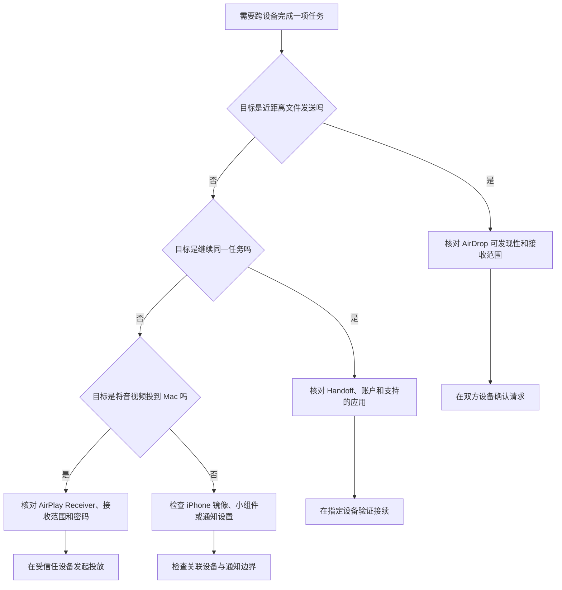

# 建立可信的跨设备连接：隔空投送、连续互通、镜像与 AirPlay

AirDrop & Continuity 把多种“设备之间能发生什么”放在同一页：临近设备可否发现这台 Mac、文件是否可以就近传送、工作能否从一个设备接到另一个设备、iPhone 的小组件与通知能否出现在 Mac 上、附近 Apple 设备能否把视频和音频投到这台 Mac。它们都涉及连接，却使用不同的身份、距离、账户、权限和密码边界。把“可以看到”“可以接收”“可以控制”和“可以投送”混成一句，会造成隐私和安全判断错误。

> [!warning] 跨设备便利也会扩大可见范围
>
> 本篇讲界面英语与只读核对方法，不会改变 AirDrop 接收范围、Handoff、镜像、AirPlay Receiver 或密码要求。开启这些功能前，应确认设备归属、使用场所、附近人员、Apple Account 条件、网络与蓝牙状态。共享设备、公共空间和演示环境尤其不宜用“先打开再说”的方式测试。

## 先建立功能地图：谁能发现、谁能继续、谁能显示、谁能播放

路径是 **Apple menu → System Settings → General → AirDrop & Continuity**。页面按 AirDrop、Continuity、Widgets & iPhone Mirroring 和 AirPlay 分组。分组不是视觉装饰，而是在提醒你每段功能的目标不同。

| 分组 | 主要问题 | 关键英文 | 不能替代的功能 |
| --- | --- | --- | --- |
| `AirDrop` | 附近的人能否发现并向我发送内容？ | `Contacts Only`、`discoverable`、`receive` | 远程屏幕控制或云端同步。 |
| `Continuity` | 能否在同一账户设备之间接续工作？ | `Allow Handoff between …` | 任意设备之间自动共享所有数据。 |
| `Widgets & iPhone Mirroring` | 哪台 iPhone 可用于小组件、镜像与关联通知？ | `iPhone Widgets`、`Live Activities` | 把 iPhone 的所有权限永久交给 Mac。 |
| `AirPlay` | 附近 Apple 设备能否向这台 Mac 发送音视频？ | `AirPlay Receiver`、`Current User`、`Require password` | 让所有附近陌生设备无条件投放。 |

共同出现的 `nearby`、`your iCloud devices`、`Current User`、`signed in to your Apple Account` 都在限定连接对象。软件英语里，先找这些限定语，再理解动词 share、receive、allow 和 send，才能知道“谁对谁做什么”。

## 界面实例：接收范围、Handoff、镜像与 AirPlay

> 本机截图未包含在公开版本中，以保护原图中的个人信息。

| 完整界面表达 | 软件语境中文 | 控件或状态 | 作用边界 |
| --- | --- | --- | --- |
| `AirDrop lets you share instantly with people nearby.` | AirDrop 让你与附近的人即时共享。 | 说明句。 | 描述近距离共享，不是互联网任意传送。 |
| `Contacts Only` | 仅限联系人。 | 下拉选择状态。 | 限制可发现或可接收的范围。 |
| `discoverable` | 可被发现的。 | 能力状态。 | 其他设备能否在 AirDrop 中看到本机。 |
| `Allow Handoff between this Mac and your iCloud devices` | 允许这台 Mac 与你的 iCloud 设备之间使用接力。 | 开关。 | 限定在“这台 Mac”和“你的 iCloud 设备”。 |
| `iPhone Widgets` | iPhone 小组件。 | 开关。 | 控制 iPhone 小组件与 Mac 的关联能力。 |
| `Notifications & Live Activities` | 通知与实时活动。 | 入口按钮。 | 进入通知和实时活动的范围设置。 |
| `AirPlay Receiver` | AirPlay 接收器。 | 开关说明。 | 允许附近 Apple 设备向 Mac 发送音视频内容。 |
| `Current User` | 当前用户。 | 接收范围选择。 | 只允许符合当前用户身份条件的设备发现或投放。 |
| `Require password` | 要求密码。 | 开关。 | 让投放前增加身份验证步骤。 |

截图里的设备名称、账户名称和关联状态是临时界面数据，不写入正文、索引、词汇表或练习题。学习时应聚焦完整表达中的范围词和条件词，例如 nearby、only、your、current、require。

## AirDrop：分享、发现与接收不是同一件事

`AirDrop lets you share instantly with people nearby.` 由 let + 人/设备 + 动词构成：AirDrop 让你 share；instantly 描述速度；with people nearby 限定对象是附近的人。它没有说“任何人都可以读取你的所有文件”，也没有承诺“所有共享都会自动接受”。发送和接收都仍有可见性、确认与接收范围的控制。

| 概念 | 英文 | 应问的问题 | 不应误读为 |
| --- | --- | --- | --- |
| 可发现性 | `discoverable` | 别人的设备能否在列表中看见这台 Mac？ | 已经授权对方访问文件。 |
| 接收范围 | `Contacts Only` | 哪些身份关系的人可发起接收请求？ | 对方一定能通过联系人验证。 |
| 附近 | `people nearby` | 是否在蓝牙、Wi-Fi 和物理距离条件内？ | 可以跨城市或跨网络直接传送。 |
| 接收 | `receive` | 本机是否允许进入接收流程？ | 传入内容已经安全保存。 |
| 共享 | `share` | 你是否选择并发送某个内容？ | 接收方自动拥有源文件的后续访问权。 |

`Contacts Only` 的 only 是关键限制词：它不是“联系人一定可以”，而是“限制为联系人这一范围”。联系人匹配、账户条件、设备状态和环境都可能影响实际可用性。出现收不到或看不到设备时，应先描述事实：`This Mac is set to Contacts Only, but the other device is not appearing.` 再逐项检查条件；不要先把接收范围扩大到所有人。

`Manage…` 旁的说明可能提到与一次性代码共享过的人及一个时间窗口。one-time code 的 one-time 表示“一次性的”；它说明系统可能维护一个临时的信任或可见性关系。临时不等于永久，看到这类提示时要查看具体期限、对象和隐私说明，而不是把一次配对理解为长期授权。

> [!tip] 排查 AirDrop 时先缩小问题
>
> 先问“这台 Mac 是否可被发现”，再问“对方是否在预期范围”，最后问“传送请求是否出现并被确认”。这样能把 discoverable、Contacts Only、receive 和 share 分别对应到一个可验证的阶段，不必为了测试而立即扩大接收范围。

## Continuity 与 Handoff：接续工作，不是无边界同步

`Allow Handoff between this Mac and your iCloud devices` 的中心名词是 Handoff。Allow 表示许可；between A and B 严格说明了两端；your iCloud devices 又将另一端限制为同一用户关联的设备。它描述“在设备之间接续可支持的任务或上下文”，而不是将所有文件、通知、剪贴板或应用内部数据无条件公开。

| 结构 | 直观理解 | 使用时要继续确认 |
| --- | --- | --- |
| `Allow Handoff` | 允许接力能力。 | 哪些应用支持，是否需要同一账户和无线条件。 |
| `between this Mac and …` | 在这台 Mac 与另一组设备之间。 | 另一组设备具体是谁，不是任意邻近设备。 |
| `your iCloud devices` | 你的 iCloud 设备。 | 账户状态、设备归属和组织策略。 |
| `continue on another device` | 在另一台设备上继续。 | 是继续打开任务，还是同步了完整内容。 |

当 Handoff 表现不符合预期时，适合用陈述而不是猜测：`Handoff is enabled, but I need to verify the account and connectivity requirements.` 这句话承认开关状态存在，同时保留对账号和网络条件的检查。不要因为一个开关为 on，就认为任何应用和任何设备都应自动接续。

这张图不把所有互通功能塞进一个“打开/关闭”步骤。每条路径都有不同的身份和用途：AirDrop 先看附近和接收范围，Handoff 先看设备关联与应用支持，AirPlay 先看接收者和密码。

## Widgets & iPhone Mirroring：便利入口需要对应的设备边界

页面中的 `Widgets & iPhone Mirroring` 把 iPhone 小组件、通知、实时活动和镜像放在相近位置。`This iPhone will be used for iPhone Mirroring and widgets.` 是一个状态说明：某台已关联的 iPhone 将用于镜像和小组件。它不表示这台 Mac 可以在没有用户操作的情况下读取 iPhone 中所有内容。

| 表达 | 说明 | 需要检查的边界 |
| --- | --- | --- |
| `iPhone Widgets` | 在 Mac 侧使用 iPhone 小组件。 | 哪些小组件会显示，是否包含敏感摘要。 |
| `Notifications & Live Activities` | 通知与实时活动管理入口。 | 通知预览、锁屏显示和专注模式的限制。 |
| `iPhone Mirroring` | 将 iPhone 使用体验映射到 Mac 的相关能力。 | 已关联的设备、账户、解锁与系统支持条件。 |
| `This iPhone will be used …` | 当前指定设备用于某些互通功能。 | 这是当前关联状态，随设备或账户状态可能变化。 |

镜像和小组件特别容易在演示、共享屏幕或公共场所造成意外信息暴露。设置前应问：通知预览会显示在什么位置？小组件是否会带出行程、消息摘要或工作信息？另一台设备是否归自己独占使用？这些问题不是技术细节，而是 UI 文案中 This、your、used for 所指范围的实际后果。

> [!warning] 先管理通知内容，再扩展显示终端
>
> 如果某类通知本来就不适合出现在 Mac 屏幕上，应先在 Notifications、Focus 或应用自身设置中管理预览和允许范围。不要依赖“我不会看见它”来保护隐私；镜像、小组件和实时活动会增加信息被看到的表面。

## AirPlay Receiver：让 Mac 接收内容时的身份边界

`AirPlay Receiver allows nearby Apple devices to send video and audio content to your Mac with AirPlay.` 这句话有完整的主体、动作、对象和方式：AirPlay Receiver allows；nearby Apple devices 是发送者；send video and audio content 是动作；to your Mac 是目标；with AirPlay 是所用方式。它说明 Mac 是 Receiver，不是向外发送的 Sender。

| 选项或表达 | 含义 | 安全判断 |
| --- | --- | --- |
| `AirPlay Receiver` | 让本机成为 AirPlay 内容的接收端。 | 只有确实需要接收时才开启。 |
| `nearby Apple devices` | 附近 Apple 设备。 | “附近”仍不是可信身份的充分条件。 |
| `Current User` | 当前用户范围。 | 限制可发现或投放的身份范围，优先于宽泛可见。 |
| `Require password` | 要求密码。 | 增加一层发起投放前的验证。 |
| `Set…` | 设置。 | 配置密码或相关验证值前的入口。 |

`Only devices signed in to your Apple Account can see and AirPlay to this computer.` 这类说明的 only 和 signed in to 是核心。only 建立排他范围；signed in to your Apple Account 表示要满足同一账户登录条件。它比“附近设备”更强，但也不应替代对共享账户、设备遗失或会话状态的基本管理。

### 身份验证弹窗：Touch ID、Use Password 与 Cancel

> 本机截图未包含在公开版本中，以保护原图中的个人信息。

当页面提示 `AirDrop & Continuity is trying to modify your system settings.`，它明确区分了“查看页面”和“修改系统设置”。Touch ID 或 `Use Password…` 是继续验证；`Cancel` 是放弃本次更改并返回。弹窗不是错误提示，而是系统在要求确认当前用户有权进行敏感变更。

| 完整表达 | 软件语境中文 | 应如何操作 |
| --- | --- | --- |
| `is trying to modify your system settings` | 正尝试修改你的系统设置。 | 先确认发起动作是否符合预期。 |
| `Touch ID or enter your password to continue` | 使用 Touch ID 或输入密码以继续。 | 只在你主动发起且理解影响时认证。 |
| `Use Password…` | 使用密码。 | 选择密码验证方式，注意周围环境。 |
| `Cancel` | 取消。 | 不确定时安全退出本次修改。 |

> [!warning] 不确定来源时选择 Cancel
>
> 验证弹窗本身不证明某项设置一定应该开启，它只证明操作会改变系统。若你不记得刚才点了什么、正在共享屏幕、设备不属于你，或无法说明影响范围，选择 Cancel 并回到页面核对，比输入密码更合适。

## 两个完整操作案例

### 案例一：只读核对 AirDrop 与 Handoff 的范围

1. 打开 **System Settings → General → AirDrop & Continuity**。
2. 读取 AirDrop 下拉菜单的当前范围，辨认 `Contacts Only`、`discoverable` 与 `receive` 的关系，不更改选择。
3. 阅读 `Allow Handoff between this Mac and your iCloud devices`，记录其开关状态，但不切换。
4. 检查周围环境是否适合进行实际共享；在公共空间中只完成阅读，不发送样例文件。
5. 用英语说明：`I reviewed the AirDrop visibility and Handoff setting, but I did not change who can discover this Mac.`

这个案例的目标是能说清“可被发现”与“允许接力”分别属于哪一段功能，而不是为了验证按钮去扩大接收范围。

### 案例二：为受信任演示设备准备 AirPlay 接收前检查

1. 在 AirPlay 分组阅读 `AirPlay Receiver`、接收范围和 `Require password` 状态。
2. 确认演示设备归属、当前空间是否有无关人员、屏幕上是否会显示通知或敏感窗口。
3. 如果接收范围写着 Current User，确认目标设备的账户条件；不要因看不到设备就直接改成宽泛范围。
4. 如需更改密码或接收权限，先记录原状态；点击 Set 前确认你能在演示结束后恢复。
5. 出现 Touch ID 或密码弹窗时，核对动作来源与影响；不确定时点 Cancel。
6. 用英语记录：`Before enabling AirPlay Receiver, I checked the receiving scope, password requirement, and privacy of the display.`

> [!success] 将“能投放”变成可控测试
>
> 在受信任设备、有限时间和明确内容下测试一次，再关闭或恢复不再需要的权限，通常比长期保持宽泛接收更可控。测试后检查 AirPlay Receiver、范围和密码要求是否回到预期状态。

## 常见错误、风险与恢复方式

| 错误 | 为什么会造成问题 | 更可靠的处理 |
| --- | --- | --- |
| 看不到设备就把 AirDrop 改成最宽范围 | 可能增加附近陌生人发现本机的机会。 | 先检查双方蓝牙、Wi-Fi、账户、距离和接收状态。 |
| 把 Contacts Only 当作绝对可用保证 | 联系人匹配和设备条件仍可能不满足。 | 先描述范围，再逐项验证设备条件。 |
| 把 Handoff 当成所有数据自动同步 | 它受账户、设备和应用支持限制。 | 明确要接续的是哪项任务，再验证相应应用。 |
| 在公开场所开启镜像或小组件 | 通知、实时活动或内容摘要可能被看到。 | 先管理通知与屏幕内容，再决定是否启用。 |
| 为临时演示关闭 Require password 后忘记恢复 | 后续接收范围可能比预期宽。 | 记录原值，演示结束后立即复核。 |
| 不清楚原因仍在验证弹窗输入密码 | 将非预期变更授权给系统。 | 点 Cancel，回到页面确定操作来源。 |

若设置改变后不符合预期，优先回到 AirDrop & Continuity，恢复你记录的接收范围、Handoff、iPhone Widgets、AirPlay Receiver 和 Require password 状态。若问题只发生在某一个设备，先检查该设备的账户、无线状态和系统版本，而不是立刻扩大所有权限。

## 英语表达规律：范围词决定隐私边界

这一页的动词 share、receive、allow、send、require 很直观；真正决定权限范围的往往是 nearby、only、your、this、current 和 between。

| 结构 | 原文片段 | 语义重点 |
| --- | --- | --- |
| `with people nearby` | `share instantly with people nearby` | 限定为物理上邻近的人。 |
| `be discoverable …` | `be discoverable in AirDrop` | 可被其他设备发现，不等于可访问内容。 |
| `between A and B` | `between this Mac and your iCloud devices` | 明确功能两端。 |
| `allows … to + 动词` | `allows nearby Apple devices to send …` | 接收器允许某类设备执行动作。 |
| `only devices signed in …` | `Only devices signed in … can …` | 用 Only 建立身份限制。 |
| `require + 名词` | `Require password` | 将条件设为进入下一步的门槛。 |

下面两句看似接近，风险不同：

- `Nearby devices can see this Mac.`：附近设备可以发现这台 Mac。
- `Only devices signed in to my account can AirPlay to this Mac.`：只有登录到我的账户的设备可以向这台 Mac 使用 AirPlay。

第一句是可见性，第二句是经过身份限制的可投放能力。学习时不要只背 see、AirPlay；把 nearby、only、signed in to 和 to this Mac 一起读，才得到完整安全含义。

## 自测

1. `discoverable` 与 `receive` 有什么区别？
2. Contacts Only 为什么不等于“每个联系人一定能传送成功”？
3. `Allow Handoff between this Mac and your iCloud devices` 限定了哪两端？
4. AirPlay Receiver 与 AirPlay Sender 的角色有什么不同？
5. 身份验证弹窗中的 Cancel 在什么情况下最合适？
6. 用英语表达：“我先检查了接收范围和密码要求，没有扩大任何跨设备权限。”

查看参考答案

1. discoverable 表示别人能否发现本机；receive 表示本机是否进入接收内容的流程，两者相关但不是同一动作。
2. 它只限制范围，联系人匹配、无线连接、距离和设备状态仍会影响结果。
3. 这台 Mac 与属于你 iCloud 账户的设备。
4. Receiver 接收其他设备送来的音视频；Sender 向另一台接收端发送内容。
5. 当你不记得触发了什么、不理解影响、正在共享屏幕或设备归属不明时，Cancel 是安全退出。
6. `I checked the receiving scope and password requirement first, and I did not broaden any cross-device permissions.`

## 版本边界与来源

- 本机界面事实来自 macOS 27.0 Beta (26A5425a) 的本地采集，采集日期为 2026-09-09。关联设备、账户状态、接收范围、通知显示和可用功能会因硬件、账户、地区、网络与系统版本不同而变化。
- 功能概念参考 Apple 的 [Use AirDrop on Mac](https://support.apple.com/guide/mac-help/use-airdrop-mh35868/mac)、[Use Handoff to continue tasks on your other devices](https://support.apple.com/guide/mac-help/use-handoff-mchl732d3c0a/mac) 与 [Use AirPlay to stream video or mirror the screen of your iPhone or iPad](https://support.apple.com/guide/mac-help/use-airplay-to-stream-video-mirror-screen-mchl7e2d9c3d/mac)。公开指南的版本可能与本机 Beta 页面不同，实际操作前应以当前页面和验证弹窗为准。
