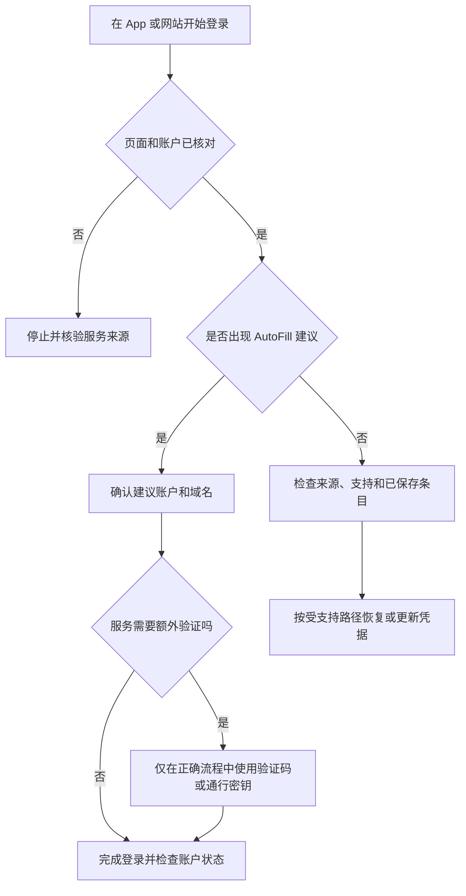

# 让登录更安全：自动填充、密码、通行密钥与验证码

AutoFill & Passwords 页面的目标不是让你“少记几个密码”，而是让登录凭据在受控的来源中保存、在支持的 App 和网站中按需填入，并把密码、passkeys 和 verification codes 分成可管理的凭据类型。一个开关开启并不等于任何网站都能自动登录；一个验证码使用后自动删除也不等于账户的双重验证已经失效。学习这些文案时，必须同时看对象、来源、触发条件和验证方式。

> [!warning] 密码页面不用于展示真实凭据
>
> 本篇只解释系统界面和安全判断，不要求打开、复制、导出、截图或口述任何真实密码、验证码、恢复密钥或账户名称。不要在聊天、笔记、演示屏幕或未受信任的页面输入这些内容。若页面要求 Touch ID 或系统密码，只有在你明确主动发起、理解目标应用且周围环境安全时才继续。

## 页面路径与四种对象

路径是 **Apple menu → System Settings → General → AutoFill & Passwords**。顶部说明将 passwords、passkeys 和 verification codes 汇集到 Passwords app；中部 AutoFill 控制登录时是否建议这些凭据；底部 Verification Codes 控制用过的验证码是否自动删除，以及用哪个 App 打开设置验证码的链接或二维码。

| 对象 | 页面英文 | 它解决什么 | 它不等于什么 |
| --- | --- | --- | --- |
| 密码 | `passwords` | 传统账号登录的保密字符串。 | 同一密码可以安全复用。 |
| 通行密钥 | `passkeys` | 以设备和身份验证为基础的无密码登录凭据。 | 任意网页都会支持的万能替代。 |
| 验证码 | `verification codes` | 用于两步或多因素验证的附加代码。 | 主密码或恢复密钥。 |
| 自动填充 | `AutoFill` | 在支持位置建议或填入已保存凭据。 | 跳过网站自身认证和账户授权。 |
| Passwords app | `Open Passwords` | 管理密码、通行密钥和验证码的入口。 | 可以安全公开浏览的普通清单。 |

`All Your Passwords in One Place` 是宣传性概括，表示管理入口集中；它不应被读成“所有账户都已自动保存”或“任何浏览器都可以使用”。真正能否使用还受同一 Apple Account、Passwords in iCloud、应用支持、浏览器扩展、设备锁定状态和登录页面实现影响。

## 界面实例：自动填充来源与验证码规则

> 本机截图未包含在公开版本中，以保护原图中的个人信息。

截图中的账户、网站、联系人或动态状态属于个人界面数据，不进入本篇正文、全文检索、词汇统计或练习。下面仅保留截图可重复学习的稳定控件、说明句和安全边界。

| 完整界面表达 | 软件语境中文 | 控件或状态 | 正确理解 |
| --- | --- | --- | --- |
| `All Your Passwords in One Place` | 所有密码集中在一处。 | 说明标题。 | 指向 Passwords app 的统一管理入口。 |
| `Open Passwords` | 打开密码。 | 按钮。 | 进入需要身份验证的凭据管理 App。 |
| `Automatically suggest passwords, passkeys, and verification codes when signing in to apps and websites.` | 登录 App 和网站时自动建议密码、通行密钥和验证码。 | 开关说明。 | 只在支持的登录场景中建议，不保证自动提交。 |
| `AutoFill from` | 自动填充来源。 | 分组标题。 | 指定建议凭据由哪个来源提供。 |
| `Passwords` | 密码。 | 来源项。 | 包含 passkeys、passwords 和 codes 的受控来源。 |
| `Verification Codes` | 验证码。 | 分组标题。 | 管理一次性或验证用代码的使用规则。 |
| `Automatically delete verification codes in Messages and Mail after they are used.` | 使用后自动删除信息和邮件中的验证码。 | 开关说明。 | 处理已使用的验证码消息，不是删除账户凭据。 |
| `will be used to open links and QR codes for setting up verification codes` | 将用于打开设置验证码的链接和二维码。 | 下拉选择说明。 | 指定处理设置入口的 App。 |

`when signing in to apps and websites` 是时间条件短语。when 表示“当……时”；signing in 表示正在登录；to apps and websites 限定目标。整句不等于“在任何文本框自动填入”，而是“在登录应用和网站时提出建议”。把这个条件读出来，可以防止你误把 AutoFill 当作通用剪贴板或无条件账户接管功能。

## Passwords、passkeys 与 verification codes：三层凭据不要互相代替

密码通常是用户输入或系统生成的秘密字符串；passkey 是为特定账户生成、由设备验证使用的登录凭据；verification code 通常在已有登录步骤之外证明“此刻请求的人还持有某个验证因素”。三者都可能出现在 Passwords app，但各自的泄露影响和恢复路径不同。

| 凭据 | 英文表达 | 常见使用阶段 | 需要保护的原因 |
| --- | --- | --- | --- |
| 密码 | `password` | 输入用户名后或登录流程中。 | 被复制或复用会扩大账户风险。 |
| 通行密钥 | `passkey` | 支持无密码登录的服务中。 | 与设备、账户和认证方式有关，不应用导出思维处理。 |
| 验证码 | `verification code` | 需要额外验证时。 | 时间短也仍可被即时滥用。 |
| 恢复信息 | `recovery key` 等 | 无法正常登录后的恢复阶段。 | 不属于普通 AutoFill 项，需单独、安全保存。 |

`Passwords Passkeys, passwords, and codes` 这类并列写法不是将三个词当同义词，而是告诉你 Passwords 来源覆盖多个凭据类型。学习时可用一句准确的总结：`Passwords, passkeys, and verification codes serve different parts of the sign-in process.`

> [!note] 自动填充减少输入，不减少核验责任
>
> 即使系统建议了已保存凭据，也要确认浏览器地址、应用名称和登录账户是否正确。自动填充能避免手动输入错误，却不能替你判断仿冒网站、错误账户、共享设备或异常授权请求。

## AutoFill from：来源、开关与应用支持

`AutoFill from` 里的 from 指来源。一个来源被打开，表示在支持场景中可向 AutoFill 提供凭据；它不表示系统将这些信息公开给每个 App。macOS 可能还需要受支持浏览器的扩展或应用自身采用正确的登录接口，才能显示建议。

| 状态 | 页面会表达什么 | 应先检查 | 不应假定 |
| --- | --- | --- | --- |
| 主 AutoFill 开关开启 | 系统可建议保存的登录凭据。 | 来源是否开启、当前 App 或浏览器是否支持。 | 所有登录页都会自动提交。 |
| Passwords 来源开启 | Passwords 中的凭据可作为来源。 | 设备是否已解锁、所需账户是否存在。 | 凭据已被无条件同步到全部设备。 |
| 来源关闭 | 不再用该来源提供建议。 | 是临时排查还是长期策略。 | 密码已被删除或账户被撤销。 |
| 没有出现建议 | 当前没有可用建议。 | 域名、账户、应用支持、扩展与身份验证状态。 | 密码一定丢失或系统故障。 |

`Automatically suggest` 比 `automatically sign in` 更克制。suggest 是“建议”，意味着用户仍能选择、确认或拒绝；sign in 是真正进入账户的行为。准确区分这两个动词，有助于理解为什么某些页面会弹出选择项，而不是直接跳转到已登录状态。

### 只读排查：为什么没有自动填充建议

遇到“我以前保存过，为什么这里没有显示？”时，不要先截图或尝试在多个页面粘贴密码。先按下面顺序只读检查：

1. 确认当前站点的域名或 App 身份是否与保存条目相符；不要因为名称相似就选错账户。
2. 确认主 AutoFill 开关与 Passwords 来源开关是否开启。
3. 确认当前浏览器或第三方 App 是否支持该方式，必要时查看其官方扩展或登录说明。
4. 打开 Passwords app 前先确保环境私密，使用系统身份验证后只查看对应条目存在与否，不复制或展示秘密值。
5. 检查同一 Apple Account、Passwords in iCloud 和设备联网状态是否符合你的同步预期。

可以用英语报告这个过程：`AutoFill did not offer a credential, so I verified the site, the enabled source, and the app support before changing any password.` 这句话把事实、排查和谨慎变更分开了。

## Verification Codes：使用后删除处理的是消息，不是登录策略

`Automatically delete verification codes in Messages and Mail after they are used.` 有三个关键部分：Automatically delete 是系统动作；verification codes 是对象；in Messages and Mail after they are used 是位置和条件。它说的是“已经使用过的验证码消息或邮件内容可以被自动清理”，不是关闭多因素验证，也不是把 Passwords app 中的全部认证条目删除。

| 术语 | 中文理解 | 需要注意的区别 |
| --- | --- | --- |
| `after they are used` | 在它们被使用后。 | 不是“收到后立刻删除”。 |
| `Messages and Mail` | 信息与邮件。 | 指验证码来源位置，不是所有通信数据。 |
| `Automatically delete` | 自动删除。 | 是持续规则，应理解未来影响。 |
| `verification code` | 验证码。 | 不同于密码，也不同于恢复密钥。 |

自动删除可以降低过期验证码长期留在收件箱或对话中的暴露面，但不应成为唯一安全措施。验证码在未使用前、被截获时或在错误网站输入时仍会带来风险。任何声称“发来验证码，请告诉我”的电话、聊天或页面，都应先通过独立且可信的渠道核实，而不要因为系统能自动处理验证码就放松判断。

> [!warning] 验证码只在正确的登录流程中使用
>
> 正常服务不会要求你把验证码念给陌生人、粘贴进不相干的聊天窗口，或在未经你主动发起的登录中确认。收到意外验证码时，先停止操作、检查账户活动或使用官方入口，而不是尝试“帮对方完成验证”。

### links and QR codes：扫码是设置入口，不是自动信任

页面还会说明某个 App `will be used to open links and QR codes for setting up verification codes`。will be used to 表示未来会由该 App 承担这个用途；for setting up 限定为“用于设置验证码”。二维码和链接可能帮助导入或设置验证器，但它们不应绕过对服务来源的确认。

| 看到的对象 | 先确认什么 | 不要做什么 |
| --- | --- | --- |
| 登录页二维码 | 域名、服务身份、是否由自己主动开始设置。 | 扫描来路不明的二维码。 |
| 设置链接 | 地址是否来自官方 App 或已验证页面。 | 在聊天转发链接中直接完成认证。 |
| 默认打开 App | 是否是受信任的 Passwords 或验证器。 | 因为系统默认就授予其他 App 全部凭据。 |
| 验证码建议 | 当前登录账户和页面是否正确。 | 把代码填进相似名称的页面。 |

流程图的关键节点是“页面和账户已核对”。AutoFill、passkey 和验证码应服务于已验证的登录流程；它们不能证明当前页面真实，也不应被用来回避服务自身的安全提示。

## 两个完整操作案例

### 案例一：只读确认自动填充是否具备正确来源

1. 打开 **System Settings → General → AutoFill & Passwords**。
2. 阅读顶部 Passwords app 的说明，确认它列出 passwords、passkeys 和 verification codes。
3. 检查 `Automatically suggest passwords, passkeys, and verification codes …` 的开关状态，只记录，不改变。
4. 阅读 `AutoFill from` 下 Passwords 的状态，不打开任何真实条目。
5. 在一个不含敏感信息的测试登录页，确认是否出现建议；若不出现，按域名、来源和应用支持顺序排查。
6. 用英语总结：`I checked whether AutoFill had an enabled source, but I did not reveal or copy any credential.`

这个案例的完成标准是知道“建议从哪里来”，而不是成功登录某个账户。任何真实凭据的查看都应在私密环境、明确目的和系统身份验证下进行。

### 案例二：为验证码使用后删除建立可审查规则

1. 在 Verification Codes 区域阅读 `Automatically delete verification codes in Messages and Mail after they are used.`
2. 解释 after they are used 指“用过之后”，而不是收到即删除。
3. 评估你的工作是否需要保留验证码消息作为审计信息，或是否会把验证码用于受管邮箱和共享设备。
4. 若要改变此规则，先记录原开关状态；只在理解 Messages、Mail、账户恢复和组织要求后再操作。
5. 用自己主动发起的非关键测试登录验证代码填入流程，不将验证码发送给他人，也不截图保存。
6. 完成后确认账户已登录、验证码没有被写入笔记，并检查开关是否保持预期。
7. 用英语记录：`I reviewed the verification-code cleanup rule and used a code only in the sign-in flow I initiated.`

> [!success] 将“方便”限制在正确的账户和页面
>
> 当 AutoFill 与验证码只在核对过的站点、指定账户和受信任设备中使用时，系统能力是在降低输入成本；当它们被用于未知链接、共享屏幕或意外验证请求时，便利会变成暴露面。每次使用前确认对象，能让这条边界保持清晰。

## 常见错误、风险与恢复方式

| 常见错误 | 为什么会有风险 | 更可靠的处理 |
| --- | --- | --- |
| 在相似域名页面接受 AutoFill 建议 | 建议本身不证明页面真实。 | 先检查地址、应用身份和账户名称。 |
| 把 passkey 当作可随意复制的文字密码 | 它是与设备和身份验证相关的凭据。 | 用受支持的账户恢复、设备与 Passwords 流程管理。 |
| 因验证码自动删除就关闭多因素验证 | 两者是不同层级的规则。 | 保留多因素验证，单独决定消息保留策略。 |
| 为排查问题把密码粘贴到聊天或笔记 | 会扩大秘密的保存和泄露范围。 | 使用 Passwords 的受控查看和官方恢复流程。 |
| 看见意外验证码就立刻输入 | 可能是未授权登录或钓鱼诱导。 | 停止、检查账户活动并从官方入口处理。 |
| 为了测试而临时关闭安全开关后忘记恢复 | 会留下比预期更宽的长期暴露面。 | 记录原值，测试后复核所有改动。 |

若自动填充错误地选择了一个账户，先取消登录而不是反复提交；再回到 Passwords 核对条目的网站关联与账户名称。若怀疑密码或验证码已泄露，不要继续尝试同一个秘密，应从服务官方的密码重置、安全活动与设备会话管理入口开始处理。无法确认时，寻求组织管理员或服务官方支持，而不是把秘密发给所谓“客服”。

## 英语表达规律：suggest、store、use 与 after

这页的英文大量使用“系统做什么”和“在什么条件下做”的结构。理解限定词比死记单词更重要。

| 结构 | 原文片段 | 语义重点 |
| --- | --- | --- |
| `suggest + 名词` | `suggest passwords, passkeys, and verification codes` | 给出候选，不等于强制填入。 |
| `when + -ing` | `when signing in …` | 动作发生的场景条件。 |
| `stored in + 地点` | `safely stored in the … app` | 凭据由哪里保存和管理。 |
| `after + 从句` | `after they are used` | 在满足某条件之后才发生。 |
| `used to + 动词` | `will be used to open …` | 指定某个工具的未来用途。 |
| `from + 来源` | `AutoFill from` | 指明自动填充由谁提供。 |

比较下面两句：

- `The system suggests a passkey when I sign in.`：系统在我登录时建议使用通行密钥。
- `The website has verified my identity.`：网站已经验证了我的身份。

第一句只描述系统建议；第二句才描述服务端认证结果。不要用第一句去替代第二句，也不要因为看见建议就忽略登录页的额外验证要求。

## 自测

1. Password、passkey 和 verification code 在登录过程中分别承担什么作用？
2. `Automatically suggest … when signing in …` 中 when 限定了什么？
3. AutoFill from 为什么是“来源”设置，而不是“公开权限”设置？
4. 使用后自动删除验证码处理的是什么，不能代替什么？
5. 看到意外验证码或可疑二维码时，第一步应做什么？
6. 用英语表达：“我确认了登录页面、凭据来源和验证码流程，但没有复制或公开任何秘密。”

查看参考答案

1. 密码用于传统登录；passkey 是设备验证相关的无密码凭据；验证码用于额外的两步或多因素验证。
2. 它限定建议发生在登录 App 或网站时，不是任何文本输入处。
3. 它指定哪个受控来源可提供建议，不代表每个应用都能看到或导出全部凭据。
4. 它处理 Messages 和 Mail 中已使用验证码的清理规则；不能代替多因素验证、密码管理或账户恢复策略。
5. 停止输入，核验服务和请求来源，再通过独立官方入口检查账户。
6. `I verified the sign-in page, the credential source, and the verification-code flow, but I did not copy or disclose any secret.`

## 版本边界与来源

- 本机界面事实来自 macOS 27.0 Beta (26A5425a) 的本地采集，采集日期为 2026-09-09。不同系统版本、浏览器扩展、Apple Account、Passwords in iCloud、组织策略和网站实现可能改变可见选项与建议行为。
- 密码、通行密钥与验证码的功能解释参考 Apple 的 [Use passwords on your Mac](https://support.apple.com/guide/passwords/the-passwords-app-mchl901b1b95/mac) 和 [Use the Passwords app to create, manage, and share passwords and passkeys](https://support.apple.com/en-us/120758)。
- 验证码用后清理的边界参考 Apple 的 [Secure your device, app, and website passwords](https://support.apple.com/guide/personal-safety/secure-your-device-app-and-website-passwords-ipsec74bc4cf/web)。实际账户的认证与恢复规则仍应以服务官方页面和组织安全要求为准。
