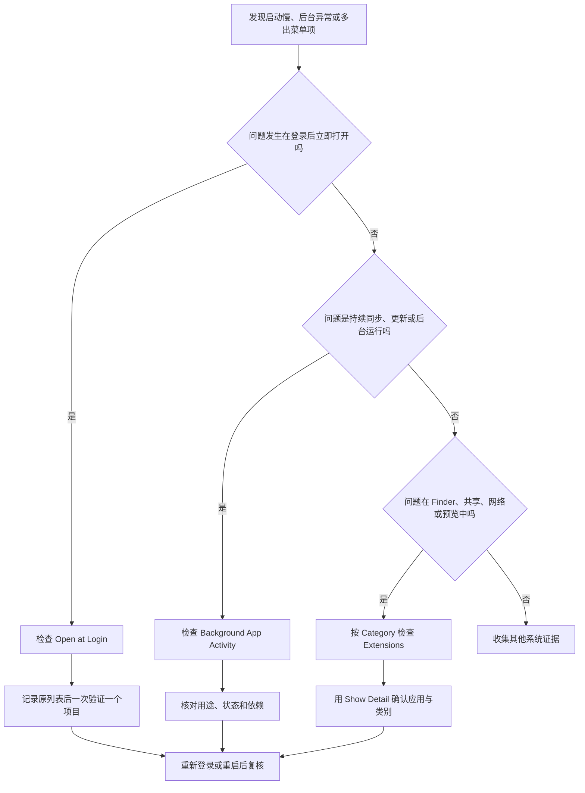

# 管理启动、后台与扩展：登录项、活动状态和功能分类

Login Items & Extensions 页面的列表很长，很容易让人把所有开关都当作“开机慢”的原因。实际上，它混合了三种不同机制：Open at Login 是登录后主动打开的项目；Background App Activity 允许应用在窗口没打开时执行更新或同步等任务；Extensions 是给 Finder、共享菜单、网络、预览、搜索、驱动或其他系统能力添加功能的组件。关闭其中一项通常不等于卸载应用，移除登录项也不等于撤销网络扩展，必须按机制判断。

> [!warning] 不要把“关闭”当成“删除”
>
> 本篇只讲读取、核对和小范围排查。关闭登录项可能让备份、同步、输入设备、网络工具或企业安全组件失去预期能力；禁用某些扩展可能影响 Finder、VPN、文件服务或硬件。不要批量切换开关，也不要因名称陌生就删除应用包、系统文件或配置文件。先确认功能归属、依赖和恢复办法。

## 路径与三种层级：启动、后台、扩展

路径是 **Apple menu → System Settings → General → Login Items & Extensions**。当前本机的页面标题可以简称为 Login Items，但结构仍按 Open at Login、Background App Activity 和 Extensions 组织。Open at Login 是“用户登录后把某项打开”；后台活动是“应用不在前台时是否可以完成特定任务”；扩展是“让应用或系统多出某类能力”。

| 层级 | 页面英文 | 系统行为 | 不代表什么 |
| --- | --- | --- | --- |
| 登录项目 | `Open at Login` | 登录后自动打开应用、文档、文件夹或连接。 | 应用永远在后台运行。 |
| 后台活动 | `Background App Activity` | App 未打开时可检查更新或同步数据。 | App 的主窗口会在登录时出现。 |
| 扩展 | `Extensions` | 提供附加功能给系统或某些 App。 | 所有扩展都有相同权限或风险。 |
| 列表状态 | `Running in background` | 观察到当前或近期后台运行。 | 一定占用大量资源或行为异常。 |
| 详情 | `Show Detail` | 查看某个类别或项目的具体信息。 | 点击就会修改系统设置。 |

学习时，先问“它何时运行”“为谁提供能力”“关闭后哪里会少一个功能”，然后才看开关当前是 on 还是 off。这样可以把性能问题、隐私问题、功能问题和启动问题分开处理。

## 界面实例：登录后打开与后台活动

> 本机截图未包含在公开版本中，以保护原图中的个人信息。

截图含有本机安装应用、供应商和运行历史等私人环境数据。它们不写入正文、搜索索引、词汇统计和练习。以下表格只解释可复用的标题、状态、按钮和操作关系。

| 完整界面表达 | 软件语境中文 | 它回答的问题 | 正确操作边界 |
| --- | --- | --- | --- |
| `Open at Login` | 登录时打开。 | 哪些项目会在登录后自动打开？ | 移除前记录原列表。 |
| `These items will open automatically when you log in.` | 这些项目会在你登录时自动打开。 | 登录动作触发什么？ | 不说明后台任务。 |
| `Add` | 添加。 | 添加新的登录项目。 | 只添加明确需要的项目。 |
| `Remove` | 移除。 | 不再登录时自动打开选中项目。 | 不等于卸载或删除文件。 |
| `Item` / `Kind` | 项目 / 种类。 | 项目名称和类型是什么？ | 名称陌生就必然有风险。 |
| `Background App Activity` | App 后台活动。 | 哪些 App 获准不在前台时运行任务？ | 每一项都会在登录时弹窗。 |
| `These apps can automatically run in the background …` | 这些 App 可在后台自动运行。 | 后台任务的目的是什么？ | 可无条件读取所有个人数据。 |
| `Running in background` | 正在后台运行。 | 当前状态。 | 一定需要立刻关闭。 |
| `Last ran in background …` | 上次在后台运行于…… | 最近一次观察到的活动。 | 此刻仍在运行。 |
| `Not running in background` | 未在后台运行。 | 当前没有观察到运行。 | 相应功能永远不会启动。 |

`These items will open automatically when you log in.` 的主语是 These items；will open 表示未来或每次登录的预期动作；automatically 表示不需要用户再次点开；when you log in 限定触发时机。它描述的是登录阶段，不是系统启动最早阶段，也不是应用在任何时间持续运行。

### Open at Login：有意启动与意外启动的区别

一个项目位于 Open at Login，并不自动是问题。备份工具、输入法辅助、窗口管理工具、通讯软件或需要在开机后立刻工作的项目可能有合理理由。真正需要核对的是：你是否认识它；是否仍然需要它在每次登录后出现；它是否在移除后仍能手动打开；依赖它的功能会不会受到影响。

| 你看到的情况 | 应先做的事 | 不应直接做的事 |
| --- | --- | --- |
| 熟悉且确实常用的应用 | 核对是否需在每次登录后自动打开。 | 因为“自动”就认定它拖慢系统。 |
| 不再使用的普通应用 | 记录名称和 Kind，确认能手动打开。 | 先删除应用包或支持文件。 |
| 黄色警告或路径异常 | 核对项目是否被移动或删除。 | 重复添加同名项目。 |
| 不认识的项目 | 用 Show in Finder、厂商信息或管理员策略确认来源。 | 盲目清理、运行未知脚本。 |

`Remove` 的动作范围要读完整：它从 Open at Login 列表移除选中项目。应用本体、用户数据、许可证、后台组件和扩展未必一起消失。如果你希望卸载一个应用，应该使用该应用官方的卸载方式或受支持的管理路径，不能把 Remove 当作彻底删除。

> [!tip] 先做清单，再做一个变化
>
> 排查登录后卡顿或异常时，先记录所有登录项。一次只移除或恢复一个可确认的项目，然后重新登录或重启验证。这样才能把结果归因给某个变化；一次清空全部项目虽然快，却会让同步、备份、输入、网络和工作环境同时发生变化。

## Background App Activity：运行、近期运行与已允许不是一回事

`These apps can automatically run in the background to do things like sync data and check for updates.` 中 can 表示“可以”；run in the background 表示不显示主窗口时运行；to do things like 引出目的举例；sync data 和 check for updates 是常见用途。它既没有说每个应用会一直运行，也没有说所有后台活动都是相同任务。

| 状态文本 | 应如何理解 | 下一步如何核对 |
| --- | --- | --- |
| `Running in background` | 当前可观察到该 App 正在后台执行。 | 查看它是同步、更新、设备服务还是网络工具。 |
| `Last ran in background …` | 近期或过去某时曾后台执行。 | 不要把历史状态误报为当前进程。 |
| `Not running in background` | 当前没有观察到后台运行。 | 区分开关是否允许与任务是否恰好执行。 |
| 开关为 on | 被允许在后台做相应任务。 | 确认这份许可是否仍必要。 |
| 开关为 off | 不允许该项按此方式后台活动。 | 验证同步、更新或设备能力是否受影响。 |

背景活动常常与“已允许”和“此刻在运行”混淆。前者是许可策略，后者是状态快照。比如开关为 on 但显示 Not running in background，可能表示它拥有权限但当前没有任务；显示 Last ran 也可能只是过去执行过。正确的排查表达是：`The app is allowed to run in the background, but I need to distinguish that permission from its current activity.`

### 为什么不应按名称批量关闭后台活动

后台项目可能来自应用、辅助进程、设备驱动、企业管理、网络工具或系统服务。一个名称没有 `.app` 后缀也不证明它恶意；反过来，一个熟悉品牌也不证明所有组件都适合长期启用。先看用途、供应方、安装来源、是否依赖硬件或网络，再做判断。

| 可能用途 | 关闭后可能出现的结果 | 更稳妥的验证 |
| --- | --- | --- |
| 同步 | 文件、笔记、照片或数据更新延迟。 | 先确认是否有重要同步任务。 |
| 更新检查 | 不再自动获知版本或安全修复。 | 比较手动更新与自动检查需求。 |
| 输入与设备 | 键盘、鼠标、音频、打印或外设功能异常。 | 在可恢复窗口验证设备功能。 |
| 网络服务 | VPN、内容过滤、代理或远程连接不可用。 | 先确认当前网络、工作和组织策略。 |
| 安全服务 | 监测或合规功能变化。 | 未授权时联系管理员，不要自行停用。 |

> [!warning] 网络与安全组件需要更高门槛
>
> 若后台项目或扩展涉及 VPN、content filter、endpoint security、driver 或设备管理，它的关闭可能改变网络路径、安全监测或硬件工作方式。除非你明确拥有管理权限并理解组织要求，否则只读核对名称和状态，交由管理员或官方文档确认下一步。

## Extensions：功能插槽，不是一张“可删除清单”

页面说明 `Extensions add extra functionality to your Mac and apps, and some may run in the background.` Extensions 为系统和应用增加附加功能，有些会在后台运行。它们既可能是 Apple 提供的默认能力，也可能来自第三方应用；按 By App 或 By Category 查看只是两种观察方式，不会改变扩展本身。

> 本机截图未包含在公开版本中，以保护原图中的个人信息。

| 完整界面表达 | 软件语境中文 | 查看方式 | 用途边界 |
| --- | --- | --- | --- |
| `Extensions` | 扩展。 | 分组标题。 | 汇集附加功能，不是一个单独的后台程序。 |
| `By App` | 按应用。 | 单选查看方式。 | 适合从“某个应用带来什么”出发。 |
| `By Category` | 按类别。 | 单选查看方式。 | 适合从“某类能力由谁提供”出发。 |
| `Show Detail` | 显示详情。 | 详情入口。 | 先了解，再决定是否开关。 |
| `File Providers` | 文件提供者。 | 类别。 | 让 Finder 展示本地或远程存储的内容。 |
| `Network Extensions` | 网络扩展。 | 类别。 | 扩展 VPN、隧道或内容过滤等网络能力。 |
| `Quick Look` | 快速查看。 | 类别。 | 让空格预览支持更多文件类型。 |
| `Sharing` | 共享。 | 类别。 | 在共享菜单中提供发送目标或动作。 |
| `Spotlight` | 聚焦搜索。 | 类别。 | 帮助 Spotlight 搜索和显示特定来源内容。 |

### 十三类扩展该怎样理解

扩展类别的名称本身就是软件英语的高频词。下面按功能解释当前页面可见的类别，重点是“它在哪个界面出现、开启后带来什么、关闭前要验证什么”。不同版本会增加、合并或隐藏一些类别，应以当前系统页面为准。

| 类别 | 是什么 | 你会在哪里感受到它 | 关闭前要核对 |
| --- | --- | --- | --- |
| `Actions` | 给 App 内容增加动作。 | 图片标记、文档处理等菜单。 | 是否有工作流依赖该动作。 |
| `Camera Extensions` | 提供自定义摄像头输入。 | 视频会议或相机选择器。 | 虚拟摄像头、录屏或会议软件是否要用。 |
| `Dock Tiles` | 给 Dock 图标增加状态或快捷操作。 | Dock 中的图标显示。 | 是否只影响展示，还是带有业务入口。 |
| `Driver Extensions` | 现代设备驱动类扩展。 | 硬件、输入设备或外设工作时。 | 对应硬件是否仍连接和需要。 |
| `File Providers` | 把云端或外部存储呈现给 Finder。 | Finder 的位置、文件列表或同步状态。 | 文件是否还需访问、同步是否完成。 |
| `File System Extensions` | 扩展文件系统或卷的支持。 | 挂载外部磁盘、特定格式或设备时。 | 卷能否安全卸载、数据是否已备份。 |
| `Finder` | 扩展 Finder 的操作和快速动作。 | 右键菜单、预览栏和桌面。 | 当前文档处理是否依赖它。 |
| `Network Extensions` | 扩展 VPN、隧道、过滤等网络路径。 | 网络连接、访问控制和代理行为。 | 网络、组织要求和连接安全。 |
| `Photos Editing` | 给照片编辑增加工具。 | Photos 编辑界面。 | 是否有未完成的照片项目。 |
| `Quick Look` | 支持空格预览新类型内容。 | Finder 选中文件后按空格。 | 仅影响预览还是牵涉内容解码。 |
| `Sharing` | 将动作加入共享菜单。 | Finder 与多种 App 的 Share 菜单。 | 是否仍需向该目标发送内容。 |
| `Spotlight` | 让搜索索引来自更多 App 或来源。 | Spotlight 搜索结果。 | 搜索能力和隐私边界。 |
| `Smart Card Readers` 或其他硬件类 | 管理证书、读卡或验证能力。 | 企业认证、设备安全流程。 | 管理员策略和硬件需求。 |

`By App` 适合回答“我安装的这个 App 影响了系统的哪一处”；`By Category` 适合回答“为什么 Finder、网络或共享菜单多出一个选项”。切换这两个查看方式不改变任何功能，因此是安全的学习动作。真正开关扩展前，应点击 Show Detail，阅读它属于哪一个应用和哪一种能力。

这个流程不会要求你清空全部项目。它将“何时发生”作为第一个分类条件：登录时的问题看 Open at Login，持续任务看后台活动，具体功能菜单异常看 Extensions。每次只验证一个可恢复变化，才能建立因果关系。

## 两个完整操作案例

### 案例一：安全审查一个登录项目

1. 打开 **System Settings → General → Login Items & Extensions**。
2. 在 Open at Login 下记录项目的 Item 和 Kind，不把个人应用清单复制到公开笔记。
3. 选择一个你明确认识、非关键且不依赖后台同步的测试项目；确认它可以手动打开。
4. 若要排查登录问题，先保存原列表，再仅移除这一个项目。
5. 重新登录或重启，观察该项目是否不再自动打开，以及其他功能是否保持正常。
6. 若无关或出现副作用，按记录 Add 回该项目，再重新验证。
7. 用英语记录：`I removed one verified login item for testing and restored it if the change was not relevant.`

这里的重点是单项、可识别、可恢复。Remove 只改变自动打开规则，所以复原时使用 Add，而不是重新下载或删除应用。

### 案例二：只读理解一个扩展的类别与依赖

1. 在 Extensions 区域先选 `By Category`，找到与现象相符的类别，例如 File Providers、Sharing、Quick Look 或 Network Extensions。
2. 点击 `Show Detail`，确认扩展由哪个应用或服务提供，阅读它的功能说明。
3. 切换到 `By App`，核对同一提供者是否还带来其他扩展。
4. 若类别属于网络、驱动、企业安全、共享存储或硬件，不切换开关；先咨询管理员或查看厂商支持文档。
5. 对于非关键、可恢复的普通扩展，记录原状态后才在单项范围测试；测试结束立即核对 Finder、共享菜单或预览行为。
6. 用英语说明：`I identified the extension by category and app before deciding whether it was safe to change.`

> [!success] 先说明依赖，再谈性能
>
> 一项后台活动或扩展的价值，不能仅以“它占不占资源”判断。同步、网络、辅助输入、文件访问和硬件驱动都会带来可见或不可见的依赖。先说清它服务什么功能、关闭会失去什么，再比较性能收益，决策才完整。

## 常见错误、风险与恢复方式

| 错误 | 为什么不可靠 | 更可靠的处理 |
| --- | --- | --- |
| 一次移除所有登录项目 | 无法判断哪个项目造成问题，也会打断多个工作流。 | 记录后一次测试一个项目。 |
| 把 Remove 当作卸载 | 只移除自动打开规则，应用和数据仍在。 | 用官方卸载路径处理不再需要的应用。 |
| 看到 Last ran 就认为此刻耗电或占用资源 | 它描述过去的观察，不是实时性能诊断。 | 结合 Activity Monitor、时间和功能依赖判断。 |
| 只凭名称陌生关闭后台服务 | 名称可能是辅助进程、设备组件或管理服务。 | 核对供应商、用途、路径和组织策略。 |
| 把网络扩展按普通 Dock 扩展处理 | 网络扩展可能改变 VPN、过滤或路由。 | 提高变更门槛，先确认网络和安全影响。 |
| 扩展已开启却在 Share 菜单找不到 | 当前项目可能不支持该共享动作。 | 检查文件类型、当前 App 和扩展能力范围。 |

恢复一个误关的普通项目时，回到原分组恢复记录中的开关或登录项，然后重新登录、重启相关 App 或等待同步任务恢复。若关闭的是网络、驱动、安全或企业管理组件，优先按供应商或管理员提供的步骤恢复；不要为了“恢复正常”运行互联网上的未知修复命令。

## 英语表达规律：open、run、add 与 extend

这页最常见的动词在不同上下文中有不同范围。读完整结构可以避免把一个动作扩大到不属于它的层级。

| 结构 | 原文片段 | 含义 |
| --- | --- | --- |
| `open automatically when …` | `open automatically when you log in` | 在登录这一时机自动打开。 |
| `run in the background` | `can automatically run in the background` | 主窗口未打开时仍可执行任务。 |
| `to do things like …` | `to do things like sync data` | 说明后台运行的可能目的。 |
| `add extra functionality to …` | `Extensions add extra functionality …` | 为系统或 App 增加附加能力。 |
| `By App` / `By Category` | 查看方式。 | 按提供者或按功能类型观察。 |
| `show detail` | `Show Detail` | 请求展示细节，不改变设置。 |

对比两句：

- `The app opens at login.`：这个应用会在登录时打开。
- `The app runs in the background.`：这个应用在后台运行。

前一句讲启动时机，后一句讲窗口不在前台时的执行状态。一个 App 可能只符合其中一项，也可能两项都符合。用准确句子记录，能避免排查时把不同机制混在一起。

## 自测

1. Open at Login 与 Background App Activity 的触发时机分别是什么？
2. 为什么 Remove 登录项目不等于卸载应用？
3. Running in background、Last ran in background 和允许后台运行之间有什么区别？
4. By App 与 By Category 分别适合回答什么问题？
5. File Providers 与 Network Extensions 为什么需要不同的变更门槛？
6. 用英语表达：“我记录了原始状态，只测试了一项可恢复的登录项目。”

查看参考答案

1. Open at Login 在用户登录时自动打开项目；Background App Activity 允许 App 在窗口未打开时完成特定后台任务。
2. Remove 只从自动打开列表移除项目，不会删除应用本体、数据、扩展或许可证。
3. Running 表示当前观察到运行；Last ran 表示过去曾运行；开关表示是否被允许后台活动。
4. By App 从某个应用出发看它提供的扩展；By Category 从某类系统能力出发看哪些应用参与。
5. File Providers 会影响 Finder 中的文件访问和同步；Network Extensions 可能影响 VPN、过滤、路由和安全边界，因此需要更高的确认门槛。
6. `I recorded the original state and tested only one reversible login item.`

## 版本边界与来源

- 本机界面事实来自 macOS 27.0 Beta (26A5425a) 的本地采集，采集日期为 2026-09-09。具体项目、后台历史、扩展数量和类别由安装的软件、硬件、账户和组织策略决定，不能把本机列表当作其他设备应有的清单。
- 功能解释参考 Apple 的 [Change Login Items & Extensions settings on Mac](https://support.apple.com/en-gb/guide/mac-help/mtusr003/mac) 与 [Open items automatically when you log in on Mac](https://support.apple.com/en-lamr/guide/mac-help/mh15189/mac)。
- 排查启动问题的逐项验证方法参考 Apple 的 [Remove login items to resolve startup problems on your Mac](https://support.apple.com/guide/mac-help/remove-login-items-resolve-startup-problems-mh21210/mac)。当前本机 Beta 的页面文字与分类应以实际界面为准。
