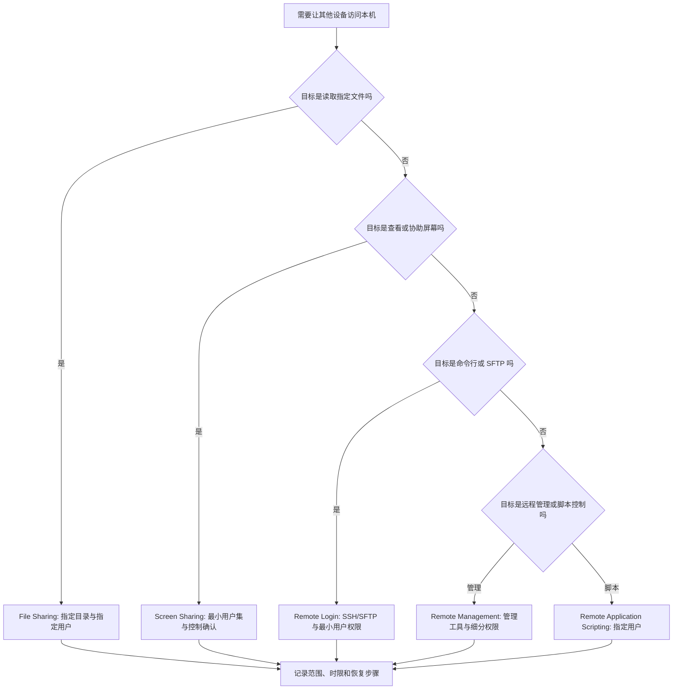

# 谨慎开放共享与远程访问：文件、屏幕、SSH 与远程管理

Sharing 页面中的每一个开关都在回答一个外部对象能否接触这台 Mac：能否读取指定文件夹、看到屏幕、控制屏幕、通过 SSH 或 SFTP 登录、向设备发送媒体、使用打印机、复用下载缓存，或让其他计算机发送 Apple events 控制应用。它们不是普通的“便利开关”。一项共享功能有四个必须分开看的维度：服务是什么；谁可以访问；能做什么；如何关闭和恢复。

> [!warning] 开放服务会改变这台 Mac 的可访问面
>
> 本篇只做讲解和只读核对，不会打开任何 Sharing 服务，不会改变访问名单、密码、共享目录或本机主机名。开启远程服务前必须确认网络范围、账户身份、强认证、最小权限、临时使用时限和关闭计划。受管设备、公司网络和有敏感资料的机器应优先遵循管理员策略。

## 一页三层：内容与媒体、外设与互联网、高级远程能力

路径是 **Apple menu → System Settings → General → Sharing**。顶层把服务分为 Content & Media、Accessories & Internet、Advanced 三组。分组帮助理解用途，但不表示同组服务拥有相同的权限：File Sharing 让文件夹被访问，Screen Sharing 让屏幕被远程查看或控制，Content Caching 缓存下载资源，Remote Login 打开 SSH/SFTP，Remote Management 则面向 Apple Remote Desktop。

| 分组 | 页面服务 | 核心问题 | 风险重点 |
| --- | --- | --- | --- |
| `Content & Media` | File Sharing、Media Sharing、Screen Sharing、Content Caching | 内容如何被读取、显示或缓存？ | 文件权限、屏幕隐私、缓存范围。 |
| `Accessories & Internet` | Bluetooth Sharing、Printer Sharing、Internet Sharing | 外设或网络如何被其他设备使用？ | 无线发现、打印数据、网络转发。 |
| `Advanced` | Remote Management、Remote Login、Remote Application Scripting | 他人能否远程管理、命令行登录或控制 App？ | 身份、权限、远程控制和审计。 |

页面上每项旁边的 `Show Detail` 是低风险入口：先打开详情阅读限制、用户范围和 Options，再决定是否需要改开关。`off` 只说明当前服务未开启，不说明该服务永远不可用或别的共享通道不存在。

## 界面实例：共享服务总览与本机地址

> 本机截图未包含在公开版本中，以保护原图中的个人信息。

截图中的本机名称、主机名、账户、服务状态和网络环境属于临时设备数据，不进入正文、搜索、词汇统计或练习。下面保留可反复学习的服务名、详情入口和访问边界。

| 完整界面表达 | 软件语境中文 | 它意味着什么 | 不能推出什么 |
| --- | --- | --- | --- |
| `File Sharing` | 文件共享。 | 可向指定对象公开指定共享文件夹。 | 所有本地文件天然可访问。 |
| `Screen Sharing` | 屏幕共享。 | 可让其他计算机远程查看或控制屏幕。 | 任意人都可以无验证连接。 |
| `Content Caching` | 内容缓存。 | 可缓存某些可下载内容以供本地网络复用。 | 自动公开所有私人文件。 |
| `Printer Sharing` | 打印机共享。 | 让其他人使用本机连接的打印设备。 | 打印队列不含敏感文档。 |
| `Internet Sharing` | 互联网共享。 | 将一个网络连接分享给其他设备。 | 是无风险的 Wi-Fi 扩展器。 |
| `Remote Management` | 远程管理。 | 允许 Apple Remote Desktop 类管理能力。 | 仅等同于看屏幕。 |
| `Remote Login` | 远程登录。 | 通过 SSH 和 SFTP 访问这台计算机。 | 只允许图形界面操作。 |
| `Remote Application Scripting` | 远程应用脚本控制。 | 允许其他计算机发来的 Apple events 控制本机 App。 | 只能运行本地脚本。 |
| `Local hostname` | 本地主机名。 | 本地网络可用于访问本机的名称。 | 公开互联网地址或账户名称。 |

`Computers on your local network can access your computer at this address.` 中 local network 是最关键的范围词。它说同一局域网络中的设备可以使用这个地址访问本机，前提仍取决于开启的服务、用户权限、防火墙和网络策略。它不表示从互联网任意位置都可访问，也不代表主机名本身是保密凭据。

## File Sharing：共享目录、用户与全磁盘访问必须分开配置

> 本机截图未包含在公开版本中，以保护原图中的个人信息。

File Sharing 的详情页把文件夹、Users 与访问范围分开显示。`Shared Folders` 是要共享的目录集合；`Users` 是可被授予权限的用户或群组；`Add Share point` 增加一个共享位置；`Add user` 增加一个访问主体。它们必须成对检查：共享了什么、谁能访问、每个用户有什么权限。

| 表达 | 中文 | 操作含义 | 关键风险 |
| --- | --- | --- | --- |
| `Shared Folders` | 共享文件夹。 | 定义暴露给文件共享服务的目录。 | 不应把整个个人目录当成默认共享点。 |
| `Users` | 用户。 | 定义可访问共享点的人或群组。 | 不应使用不必要的宽泛用户组。 |
| `Add Share point` | 添加共享点。 | 新增一个被共享的位置。 | 先确认目录内是否有私密子文件。 |
| `Add user` | 添加用户。 | 为访问范围增加主体。 | 先确认身份、账号和权限。 |
| `Allow File Sharing to access all folders …` | 允许文件共享访问所有文件夹。 | 扩大文件服务可读取的范围。 | 不可因为“方便”而忽视 Desktop、Documents、Downloads 的敏感内容。 |
| `Some folders won’t be available without full disk access.` | 某些文件夹没有完整磁盘访问就不可用。 | 说明系统权限限制仍有效。 | 应立即给全部文件夹开放权限。 |

全磁盘访问的说明不是要求你开启它，而是在解释为什么某些位置无法被共享。需要共享一个文件时，最小权限的做法通常是创建一个明确、内容有限的共享目录，只给指定用户适当权限，而不是让 File Sharing 获得所有个人文件夹的访问能力。

> [!warning] 共享目录应小、明确、可审计
>
> 不要把 Desktop、Documents 或 Downloads 作为临时方便的默认共享点。先创建一个只含必需文件、没有凭据和个人资料的目录，设置指定用户，并在任务结束后移除共享点或访问主体。共享文件夹的最小范围，比事后清理更可靠。

## Screen Sharing：可看屏幕、可请求控制、可用 VNC 密码是三条不同权限

> 本机截图未包含在公开版本中，以保护原图中的个人信息。

`Screen Sharing allows users of other computers to remotely view and control this computer.` 说明 Screen Sharing 的功能包含 view 与 control。远程查看和远程控制影响不同：查看可能泄露屏幕内容，控制还可能打开文件、输入文字、修改设置或发起操作。因此详情页继续提供请求控制、VNC password 与 Allow access for。

| 表达 | 含义 | 必须先确认 |
| --- | --- | --- |
| `remotely view and control` | 远程查看和控制。 | 是否真的需要控制，而不是仅展示。 |
| `Anyone may request permission to control screen` | 任何人都可请求控制屏幕。 | 请求不等于自动获准，但会增加干扰与社交工程面。 |
| `VNC viewers may control screen with password` | VNC 查看器可用密码控制屏幕。 | VNC 客户端范围、强密码、网络隔离和临时性。 |
| `Allow access for` | 允许谁访问。 | 应选最小用户集，而非宽泛范围。 |
| `Only these users` | 仅限这些用户。 | 用户列表确实只包含被授权主体。 |
| `All users` | 所有用户。 | 是否有充分且经批准的需求。 |

`may request permission` 里的 may 表示“可以请求”，不是“已经获得控制权”。这个限定很重要：有人发来屏幕控制请求时，你仍应验证身份和目的；对方声称是支持人员也不构成认证。只在自己发起支持、明确知道对方是谁、了解操作范围并能随时结束时，才考虑允许控制。

## Remote Login、Remote Management 与 Remote Application Scripting：三个远程通道

### Remote Login：命令行与文件传输能力

> 本机截图未包含在公开版本中，以保护原图中的个人信息。

`Remote Login lets users of other computers access this computer using SSH and SFTP.` 中 SSH 和 SFTP 是协议名称；Remote Login 让其他计算机上的用户访问本机。它不是 Screen Sharing：SSH 主要用于安全外壳命令行访问，SFTP 用于安全文件传输。两者都需要严格的身份、用户范围、密钥或密码策略以及网络边界。

| 控件 | 用途 | 安全边界 |
| --- | --- | --- |
| `Remote Login` | 启用 SSH/SFTP 服务。 | 只在确有远程维护或传输需求时启用。 |
| `Allow full disk access for remote users` | 扩大远程用户可访问范围。 | 不应与“可 SSH 登录”混为同一许可。 |
| `Allow access for` | 限制可登录主体。 | 优先 Only these users。 |
| `Add user` | 加入被允许的远程用户。 | 先验证真实身份与最小权限。 |

Remote Login 的风险并不在于“命令行看起来复杂”，而在于它给远程主体一个执行和传输通道。若需要临时支持，应考虑受支持的、带审计的组织工具；不要为了临时方便直接开放所有用户或全磁盘访问。

### Remote Management：面向管理工具的远程控制

> 本机截图未包含在公开版本中，以保护原图中的个人信息。

`Remote Management allows other users to access this computer using Apple Remote Desktop.` 说明它与 Apple Remote Desktop 相关。它可包含更广的管理能力，不应把它缩减为“只是屏幕共享”。Options、菜单栏状态、用户范围和 VNC 控制都是需要单独评估的层。

| 表达 | 软件语境 | 为什么要谨慎 |
| --- | --- | --- |
| `Remote Management` | 远程管理服务。 | 可以让其他用户以管理工具访问本机。 |
| `Always show … status in menu bar` | 始终在菜单栏显示状态。 | 有助于可见性，但不替代访问控制。 |
| `Computer Information` | 计算机信息。 | 信息可能出现在系统概览报告，不应填入秘密或个人数据。 |
| `These fields are displayed in the System Overview Report` | 这些字段会在系统概览报告中显示。 | 填写内容应视为可能被导出或被管理人员看到。 |
| `Options…` | 选项。 | 可能包含远程操作能力的细分权限。 |

### Remote Application Scripting：允许远程 Apple events 控制应用

`Remote Application Scripting allows Apple events sent from other computers to control applications on this Mac.` 句子清楚地定义发送者、载体、动作和目标：other computers 发送 Apple events；这些事件 control applications；目标是 this Mac。它不是“本机自动化”，而是远程来源控制本机 App 的能力，应只授予已确认的用户。

流程图的核心是先按目的选服务，而不是同时开启多个服务碰碰运气。一个文件传输需求不必开启屏幕控制；一次屏幕协助也不必打开 SSH；一个本地自动化需求更不应变成远程脚本权限。

## 两个完整操作案例

### 案例一：只读设计一次最小文件共享

1. 打开 **System Settings → General → Sharing**，在 File Sharing 旁点击 `Show Detail`。
2. 阅读 Shared Folders、Users、Add Share point、Add user 和全磁盘访问说明，不开启开关。
3. 定义业务目标：例如只让一个已确认用户在有限时间读取一组非敏感资料。
4. 在纸面或私密笔记中写出计划：单一共享目录、指定用户、所需权限、开始结束时间和关闭步骤。
5. 检查目录中没有密码、下载记录、个人照片、密钥、客户数据或不相关的子目录。
6. 只有在环境、网络与组织要求允许时，按计划执行并在结束后移除访问或关闭服务。
7. 用英语描述：`I reviewed the shared folders and users first, then planned the smallest access scope needed for the task.`

### 案例二：评估一次远程支持请求

1. 在 Sharing 页面读取 Screen Sharing、Remote Management 和 Remote Login 的当前开关，先不改变。
2. 让请求方通过独立可信渠道确认身份、工单或支持编号，不只依赖来电、弹窗或聊天昵称。
3. 问清对方需要的是看屏幕、请求控制、命令行诊断还是文件传输；选择对应的一种服务，不要叠加开启。
4. 记录允许的用户、开始和结束时间、可访问范围以及服务结束后的恢复操作。
5. 在操作期间关闭无关窗口、敏感通知和不相关账户页面；不输入密码或验证码给对方。
6. 支持结束后断开连接，恢复原开关、用户列表和密码要求，并回到 Sharing 核对状态。
7. 用英语记录：`I enabled only the service required for verified support and restored the original access settings afterward.`

> [!success] 临时远程访问需要有结束动作
>
> 一个完整的远程支持流程包括身份核验、最小服务、最小用户、明确时限、过程监督和事后恢复。只描述“已经打开了远程访问”是不完整的；必须能够说明谁能访问、能做什么、什么时候关闭以及如何确认已关闭。

## 常见错误、风险与恢复方式

| 常见错误 | 为什么有问题 | 更可靠的处理 |
| --- | --- | --- |
| 为传一个文件开启多个共享服务 | 扩大了无关服务的暴露面。 | 只选 File Sharing 或受支持的单次传输方式。 |
| 共享整个个人目录 | 会连同无关或敏感内容一起暴露。 | 创建最小专用共享目录。 |
| 为了连接成功把 Allow access for 改成 All users | 忽略用户范围与身份验证。 | 使用 Only these users 并显式添加被授权主体。 |
| 误把 Screen Sharing、Remote Management 和 Remote Login 当同一功能 | 它们的协议、能力和风险不同。 | 先确定需求是屏幕、管理还是 SSH/SFTP。 |
| 在未知请求的身份验证窗口输入密码 | 可能把系统变更授权给错误操作。 | 取消、重新核实请求来源。 |
| 忘记关闭临时服务 | 服务会持续可用，超出原任务时限。 | 记录结束时间并回到 Sharing 检查所有开关。 |

恢复时，先关闭不再需要的那个服务，接着复核 Allow access for、用户列表、共享文件夹、VNC password、全磁盘访问和 Options。若服务由公司设备管理、VPN、打印系统或安全软件控制，停止自行修改，保存当前状态并联系管理员。切勿以删除系统组件、禁用防火墙或复制未知命令来“修复”远程连接。

## 英语表达规律：allow、access、control 与 only

Sharing 页面里最关键的词不是服务名，而是权限动词和范围词。

| 结构 | 原文片段 | 意义 |
| --- | --- | --- |
| `allow + 人 + to + 动词` | `allows users … to access` | 允许某些主体做一个动作。 |
| `access + 对象` | `access this computer` | 访问电脑，不自动限定具体操作权限。 |
| `view and control` | `remotely view and control` | 查看和控制是两个能力。 |
| `using + 协议` | `using SSH and SFTP` | 指定访问所使用的技术通道。 |
| `Only these users` | 用户范围。 | 用 Only 收紧访问主体。 |
| `may request permission` | `Anyone may request …` | 可以请求，不等于自动获得。 |

比较两句：

- `Other users can access the shared folder.`：其他用户可以访问共享文件夹。
- `Other users can control this computer.`：其他用户可以控制这台计算机。

第一句范围是某个文件夹，第二句范围是整台计算机的控制能力。二者不能因为都出现 access 或 users 就被当作同一层级。写操作说明时，务必把对象和动词连在一起。

## 自测

1. File Sharing、Screen Sharing 与 Remote Login 分别服务什么目标？
2. Shared Folders 和 Users 为什么必须一起检查？
3. `Anyone may request permission` 为什么不代表对方已经获得控制？
4. Remote Management 与 Remote Application Scripting 有什么关键差异？
5. 本地主机名为什么不能被理解成互联网公开地址？
6. 用英语表达：“我只为已验证的支持任务开启了最小服务，并在结束后恢复原有访问设置。”

查看参考答案

1. File Sharing 用于指定文件夹访问；Screen Sharing 用于远程查看或控制屏幕；Remote Login 用 SSH/SFTP 提供命令行和文件传输通道。
2. Shared Folders 定义共享什么，Users 定义谁能访问；只看其中一项无法判断完整暴露范围。
3. may request 表示对方可提出请求，最终仍需核验身份并决定是否允许。
4. Remote Management 用 Apple Remote Desktop 类工具管理本机；Remote Application Scripting 允许其他计算机发送 Apple events 控制本机 App。
5. 它只用于本地网络范围内的访问标识，具体可访问性仍取决于服务、权限、防火墙和网络策略。
6. `I enabled only the minimum service needed for verified support and restored the original access settings when the task was finished.`

## 版本边界与来源

- 本机界面事实来自 macOS 27.0 Beta (26A5425a) 的本地采集，采集日期为 2026-09-09。服务名称、详情选项、用户范围、认证方式和可用协议可能随系统版本、硬件、网络和组织管理策略变化。
- 功能说明参考 Apple 的 [Change Sharing settings on Mac](https://support.apple.com/guide/mac-help/change-sharing-settings-mac-mchlp1160/mac)、[Set up file sharing on Mac](https://support.apple.com/guide/mac-help/set-up-file-sharing-mh17131/mac) 与 [Allow remote login to your Mac](https://support.apple.com/guide/mac-help/allow-remote-login-mchlp1066/mac)。实际开放服务前，以当前页面、组织政策和受支持配置为准。
