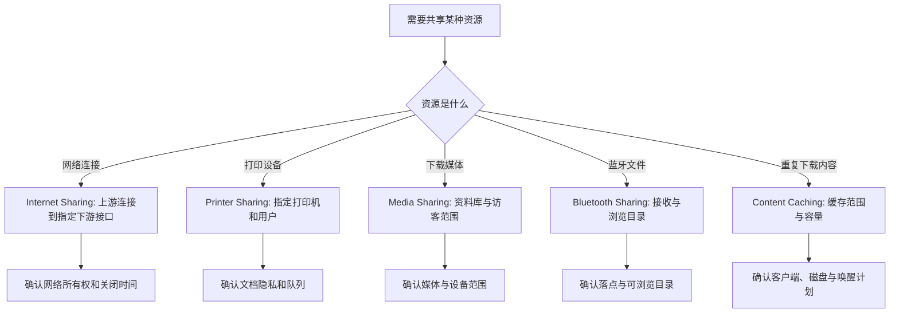

# 管理共享资源：互联网、打印机、媒体、蓝牙与内容缓存

Sharing 页面中的互联网、打印机、媒体、蓝牙和内容缓存都带有 share，但共享的不是同一种东西。Internet Sharing 转发的是网络连接；Printer Sharing 让其他设备使用一个打印设备；Media Sharing 暴露媒体库；Bluetooth Sharing 允许蓝牙设备浏览或接收文件；Content Caching 保存可复用的下载内容，帮助同一网络内的 Apple 设备减少重复下载。先说清“共享的资源是什么”和“哪一端接收”，才不会把这些服务误当成同一开关。

> [!warning] 资源共享会影响网络、存储与隐私
>
> 本篇只解释服务和详情页，不开启网络转发、打印共享、媒体库共享、蓝牙共享或内容缓存。网络共享可能改变流量路径和设备暴露；打印队列可能包含敏感文件名和内容；媒体库和蓝牙接收目录可能带出个人资料；内容缓存会占用磁盘并服务附近客户端。变更前先确认网络归属、使用场景、容量、访问范围和关闭方式。

## 五种共享的对象和方向

| 服务 | 共享的对象 | 常见接收者 | 不能理解成 |
| --- | --- | --- | --- |
| `Internet Sharing` | 一条现有互联网连接。 | 指定接口上的其他设备。 | 任何人都能使用的公共热点。 |
| `Printer Sharing` | 本机连接的打印机。 | 同一网络中被允许的用户。 | 打印机脱离本机独立工作。 |
| `Media Sharing` | 下载的音乐、电影和电视节目等库内容。 | 本地网络中可访问的设备。 | 自动共享所有照片和私人资料。 |
| `Bluetooth Sharing` | 蓝牙文件浏览或收发能力。 | 已启用蓝牙的设备。 | 蓝牙配对后永久共享所有目录。 |
| `Content Caching` | 已下载的软件、应用和可选 iCloud 内容。 | 同一网络中的支持设备。 | 本机成为普通文件服务器。 |

在 UI 英语中，`Share your connection from` 与 `To devices using` 一起构成网络方向；`Printers` 和 `Users` 组成打印范围；`Folder for accepted items` 定义蓝牙接收的落点；`Cache` 和 `Share` 定义缓存什么及是否向 USB 设备转发连接。一个服务要完整理解，至少需要读出这些成对字段。

## Internet Sharing：来源连接与目标接口决定网络路径

> 本机截图未包含在公开版本中，以保护原图中的个人信息。

`Internet Sharing allows other computers to share your connection to the Internet.` 这句话说清了核心：other computers 使用的是 your connection，而不是本机提供一个独立网络。详情页中的 `Share your connection from` 选择上游来源；`To devices using` 勾选把连接分享给哪些物理或逻辑接口。

| 界面表达 | 中文 | 正确理解 | 需要核对 |
| --- | --- | --- | --- |
| `Share your connection from` | 从何处共享你的连接。 | 选择上游网络来源。 | 上游是否稳定、允许转发且不是受限网络。 |
| `To devices using` | 分享给使用以下方式的设备。 | 选择下游接口。 | 哪个接口连接目标设备，是否会产生额外暴露。 |
| `Internet Sharing` | 互联网共享。 | 本机承担转发角色。 | 是否会改变防火墙、计费和网络可见性。 |
| `Computers connected to AC power won’t sleep …` | 接交流电的电脑在开启时不会睡眠。 | 服务可能保持设备唤醒。 | 能耗、散热和无人值守风险。 |
| `Done` | 完成。 | 保存当前详情页选择。 | 服务已经安全启用并经过验证。 |

本机采集里出现的接口名称和设备编号是环境数据，本文不抄录。学习时只需理解接口类型与角色：上游可能是 Wi‑Fi 或以太网；下游可能是以太网、Thunderbolt Bridge 或 USB。并不是所有组合都适合，也不应在酒店、公司、校园或不受控网络中擅自转发连接。

> [!warning] Internet Sharing 需要网络所有权和明确目的
>
> 开启前先确认你有权共享这条连接，目标设备确实属于你或得到许可，并且上游网络不禁止热点、桥接或多设备访问。不要把受管网络、付费网络、公司 VPN 或陌生无线网络转发给未知设备；这会影响合规、流量计费、审计和安全边界。

### 一个安全的只读判断流程

1. 先写下需要解决的事实，例如“用 USB 让一台受管测试设备临时联网”，而不是笼统地说“打开网络共享”。
2. 阅读 Share your connection from，确认上游连接的类型、可用性和组织要求。
3. 阅读 To devices using，确认目标接口只对应预期设备。
4. 检查电源、睡眠和长时间运行的影响；无人值守时不应保留临时网络转发。
5. 明确结束条件：测试结束即关闭服务，并确认目标设备恢复自己的网络路径。

可用英语表达：`I identified the source connection and the target interface before I considered enabling Internet Sharing.` 这句话先说明识别方向，再说明并未直接开启。

## Printer Sharing：打印机、用户与文档隐私是一个整体

> 本机截图未包含在公开版本中，以保护原图中的个人信息。

`Printer Sharing allows others on your network to use printers connected to this computer.` 中 others on your network 是访问范围，printers connected to this computer 是资源范围。即使打印机本身在桌上，其他用户仍通过这台 Mac 的共享服务和用户规则访问它。打印机名称、耗材状态、队列和实际用户均是可能敏感的环境信息，不应当作公共演示数据。

| 表达 | 用途 | 最小权限做法 |
| --- | --- | --- |
| `Printers` | 选择哪一台本机连接的打印设备可共享。 | 只勾选实际需要共享的那台。 |
| `Users` | 定义可打印的主体。 | 优先指定用户或经批准群组。 |
| `Everyone` | 所有人。 | 仅在确有公开网络打印需求且有控制措施时考虑。 |
| `No Access` | 无访问。 | 用于明确拒绝不应使用该设备的主体。 |
| `Printers & Scanners Settings…` | 打开打印设备设置。 | 区分设备配置与共享授权。 |

打印共享最大的误解是“只是把纸打出来”。打印文件会在应用、队列、驱动、打印机和网络之间流动，文件标题、页面内容和打印时间都可能成为可见信息。对含客户、财务、身份或健康数据的文档，应优先使用受管理的打印路径，不要通过个人 Mac 临时共享。

> [!tip] 给打印共享设置一个可撤销的范围
>
> 若确需临时共享，先只选择一台打印机和少量被授权用户；打印完成后检查队列、移除临时用户或关闭 Printer Sharing。不要为了省一步操作而把 Everyone 作为默认范围。

## Media Sharing 与 Bluetooth Sharing：目录、设备和接收动作都要明确

### Media Sharing：浏览与播放下载媒体，不是全部内容同步

> 本机截图未包含在公开版本中，以保护原图中的个人信息。

`Devices on your network can browse and play downloaded music, movies, and TV shows.` 描述的是 local network 上的设备可 browse 和 play 下载媒体。browse 是浏览，play 是播放；两者均不等于编辑媒体库，也不表示任何 iCloud 内容会自动公开。

| 界面表达 | 中文 | 要检查的边界 |
| --- | --- | --- |
| `Library Name` | 资料库名称。 | 名称是否泄露个人身份或内容主题。 |
| `Home Sharing` | 家庭共享。 | 账户、设备和家庭范围是否符合预期。 |
| `Use your library across all devices signed into an Apple Account.` | 在登录同一 Apple Account 的所有设备中使用资料库。 | 同一账户条件，不是对所有网络设备开放。 |
| `Devices update play counts` | 设备更新播放次数。 | 播放进度是否需要跨设备同步。 |
| `Share photos with Apple TV` | 与 Apple TV 共享照片。 | 是否会显示私人照片或相册。 |
| `Share media with guests` | 与访客共享媒体。 | 访客范围、网络隔离和内容合适性。 |

`with guests` 是扩大范围的词。访客设备能否浏览媒体，和家庭设备使用同一账户资料库是两条不同策略。先问“是我的设备、受邀用户，还是同一网络中的临时访客？”再决定是否开选项。

### Bluetooth Sharing：收到后放在哪里，别人能浏览什么

> 本机截图未包含在公开版本中，以保护原图中的个人信息。

Bluetooth Sharing 详情把 receiving items 与 other devices browse 分开。`When receiving items` 规定收到文件时的行为；`Folder for accepted items` 是接收落点；`When other devices browse` 规定别人请求浏览时系统怎样回应；`Folder others can browse` 才是外部设备可浏览的目录范围。

| 表达 | 解释 | 不能混同 |
| --- | --- | --- |
| `When receiving items` | 收到项目时。 | 别人浏览本机目录时。 |
| `Accept and Save` | 接受并保存。 | 自动接受任何不可信文件。 |
| `Folder for accepted items` | 被接受项目的保存文件夹。 | 对方可浏览的文件夹。 |
| `When other devices browse` | 其他设备浏览时。 | 对方向本机发送文件时。 |
| `Folder others can browse` | 别人能浏览的目录。 | 本机所有公共或个人目录。 |

从网络安全角度，蓝牙不因为距离短就天然安全。文件可能来自错误设备，浏览请求可能暴露目录名。接收目录应可审查，浏览目录应专门创建并仅放置可公开内容。不要把 Downloads 或整个 Public 目录中的未清理内容默认开放。

## Content Caching：缓存 Apple 内容，不是普通个人文件共享

> 本机截图未包含在公开版本中，以保护原图中的个人信息。

`Content Caching reduces bandwidth usage and speeds up installation on supported devices by storing software updates, applications, and other content on this computer.` 说明其工作模式：将可复用的下载内容存到本机，从而让支持设备减少带宽使用、加快安装。它是网络与存储服务，需要稳定电源、网络规划和容量控制；不是把用户私人文件直接当共享目录。

| 表达 | 软件语境中文 | 正确理解 |
| --- | --- | --- |
| `Content Caching: Off` | 内容缓存：关闭。 | 当前缓存服务未开启。 |
| `reduces bandwidth usage` | 减少带宽使用。 | 避免重复从互联网下载可缓存内容。 |
| `speeds up installation` | 加快安装。 | 对支持内容与设备可能有帮助，不保证所有下载更快。 |
| `All Content` | 所有内容。 | 缓存软件、应用和可选 iCloud 内容的范围选择。 |
| `Only Shared Content` | 仅共享内容。 | 仅缓存软件更新和 Apple 下载应用等共享内容。 |
| `Only iCloud Content` | 仅 iCloud 内容。 | 只缓存符合条件的 iCloud 内容。 |
| `Store shared and iCloud content on this computer.` | 在本机存放共享与 iCloud 内容。 | 意味着要评估本地磁盘与隐私范围。 |
| `Share this computer’s Internet connection and cached content … using USB.` | 用 USB 向连接设备共享网络和缓存内容。 | 是受限的系留场景，不是通用网络开放。 |

官方资料说明，内容缓存的客户端会自动发现合适的本地缓存，缓存服务也会占用存储。多设备、教学、测试或受管理环境中，这可能减少重复下载；单台个人 Mac、容量紧张或不稳定无线环境中，未必值得开启。选择 All Content 时，尤其要理解 iCloud 内容缓存与普通软件更新缓存的边界。

> [!warning] Content Caching 需要存储、网络和设备生命周期计划
>
> 在没有明确客户端数量、网络拓扑、可用磁盘和唤醒策略时，不要为了“可能更快”而开启。缓存服务只有在 Mac 醒着、网络条件匹配时才能服务客户端；它可能因空间上限和低可用空间而清理较旧内容。先在受控环境中规划，再由有权限的人部署。

这张图说明“共享”必须按资源类型选择服务。Internet Sharing 处理连接，Content Caching 处理已下载内容，Media Sharing 处理媒体库，Bluetooth Sharing 处理文件收发，Printer Sharing 处理设备队列。它们的恢复动作和风险也不同。

## 两个完整操作案例

### 案例一：为一台受管测试设备评估内容缓存

1. 打开 **System Settings → General → Sharing**，在 Content Caching 旁点击 Show Detail，保持服务关闭。
2. 读取状态、Cache 的范围选项、Share 的 USB 连接说明和 Options 入口。
3. 写清目标设备数量、预计下载类型、测试时段、网络位置、可用磁盘和 Mac 保持唤醒的条件。
4. 如果目标只是单台设备的一次下载，先比较直接下载与缓存部署的成本，不假定缓存一定更快。
5. 如果是多台受管设备的反复部署，交由具备网络和设备管理权限的人按 Apple 部署指南规划客户端、容量和关闭条件。
6. 用英语总结：`I reviewed the cache scope, storage impact, and client requirements before turning on Content Caching.`

### 案例二：为临时打印设置最小授权

1. 在 Printer Sharing 旁点击 Show Detail，确认当前可共享打印机、Users 和 Printer & Scanners Settings 入口。
2. 定义一个有限任务：例如一位已确认同事在特定时间打印一份非敏感资料。
3. 只选择必要打印机，添加指定用户或经批准群组，不选 Everyone。
4. 检查打印队列和默认纸张设置，避免误发到错误设备。
5. 完成打印后清理队列、移除临时用户或关闭 Printer Sharing，并检查没有未领取文件。
6. 用英语记录：`I shared one printer with the minimum approved user scope and removed the temporary access after printing.`

> [!success] 临时共享必须有可验证的结束状态
>
> 无论是互联网、打印、蓝牙、媒体还是缓存，共享结束后都应回到对应详情页核对：服务是否已关闭、用户是否移除、目录是否收回、缓存是否符合容量计划、队列是否清空。没有复核的“临时”很容易变成长期开放。

## 常见错误、风险与恢复方式

| 错误 | 为什么会错 | 更可靠的处理 |
| --- | --- | --- |
| 把 Internet Sharing 当作普通 Wi‑Fi 热点 | 它涉及上游、下游接口和网络策略。 | 明确来源连接和目标接口，确认授权。 |
| 为打印方便选 Everyone | 扩大了文件与设备使用范围。 | 指定最小用户范围，完成后撤销。 |
| 让 Media Sharing 对访客开放却未检查库内容 | 可能暴露私人媒体或播放记录。 | 先审查资料库和访客范围。 |
| Bluetooth 接收目录使用未清理的 Downloads | 接收和现有文件混在一起，难审查。 | 使用专门、可检查的接收目录。 |
| 以为 Content Caching 会缓存任何文件 | 它只缓存受支持内容，不是通用文件服务。 | 以当前 Cache 选项和官方支持范围为准。 |
| 内容缓存占满空间才发现 | 缓存是本机服务，会消耗磁盘。 | 预设容量、监控空间并规划清理。 |

恢复时，先停止正在共享的那项服务，再确认下游设备断开、用户范围恢复、接收目录审查完毕和网络路径回到原状。对于内容缓存，按受支持的 Options 或 Reset 流程管理缓存，不要在 Finder 中手动删除未知系统缓存目录。对于蓝牙接收的可疑文件，不要直接打开，先用受控安全流程检查来源。

## 英语表达规律：from、to、using 与 connected

这些详情页频繁用介词表达资源流向。掌握 from、to、using、with 和 connected to，可以读懂新版本的共享说明。

| 结构 | 原文片段 | 语义重点 |
| --- | --- | --- |
| `Share … from` | `Share your connection from` | 指上游来源。 |
| `To devices using` | 目标设备和下游接口。 | 指共享的去向。 |
| `connected to this computer` | `printers connected to this computer` | 资源与本机的物理或逻辑连接。 |
| `with guests` | `Share media with guests` | 扩大到访客范围。 |
| `by storing …` | `by storing software updates …` | 通过存储内容实现带宽优化。 |
| `using USB` | `… connected using USB` | 指定连接介质和场景。 |

例如：`The printer is connected to this Mac, but it is shared only with approved users.` 前半句说明物理连接，后半句用 only 限制访问。`The cache stores supported content locally, but it does not make personal folders available to clients.` 则区分了缓存内容和普通个人文件。

## 自测

1. Internet Sharing 的来源与去向分别由哪两个字段表达？
2. Printer Sharing 中 Printers 和 Users 为什么必须同时确认？
3. Media Sharing 的 Home Sharing 和 Share media with guests 有什么不同范围？
4. Bluetooth Sharing 的接收目录与可浏览目录为什么不能混同？
5. Content Caching 缓存什么，它为什么需要容量与网络计划？
6. 用英语表达：“我先确认了共享对象、访问范围和结束步骤，再决定是否启用服务。”

查看参考答案

1. `Share your connection from` 表示上游来源，`To devices using` 表示目标设备采用的下游接口。
2. Printers 确定共享哪台设备，Users 确定谁能使用；缺少任一项都无法判断真实访问范围。
3. Home Sharing 面向满足同一 Apple Account 条件的设备，Share media with guests 扩大到访客范围，两者不应混同。
4. 接收目录决定传入文件保存在哪里，可浏览目录决定对方能看什么；一个用于进入，一个用于暴露。
5. 它缓存支持的软件、应用和可选 iCloud 内容以减少重复下载，需要磁盘、唤醒状态、网络条件与客户端规划。
6. `I confirmed the shared resource, access scope, and shutdown steps before deciding whether to enable the service.`

## 版本边界与来源

- 本机界面事实来自 macOS 27.0 Beta (26A5425a) 的本地采集，采集日期为 2026-09-09。接口、打印机、媒体库、蓝牙设备、缓存状态和可用选项依赖硬件、网络、账户与组织策略，不能当作其他设备的默认状态。
- 共享服务概览参考 Apple 的 [Share your Mac screen, files, and services with other users on your network](https://support.apple.com/guide/mac-help/share-mac-screen-files-services-users-network-mchlp1125/mac)。
- Content Caching 的范围与部署边界参考 Apple 的 [Change Content Caching settings on Mac](https://support.apple.com/en-ca/guide/mac-help/mchleaf1e61d/mac) 与 [Intro to content caching](https://support.apple.com/guide/deployment/intro-to-content-caching-depde72e125f/web)。网络部署前仍应以当前环境、管理策略和官方最新说明为准。
