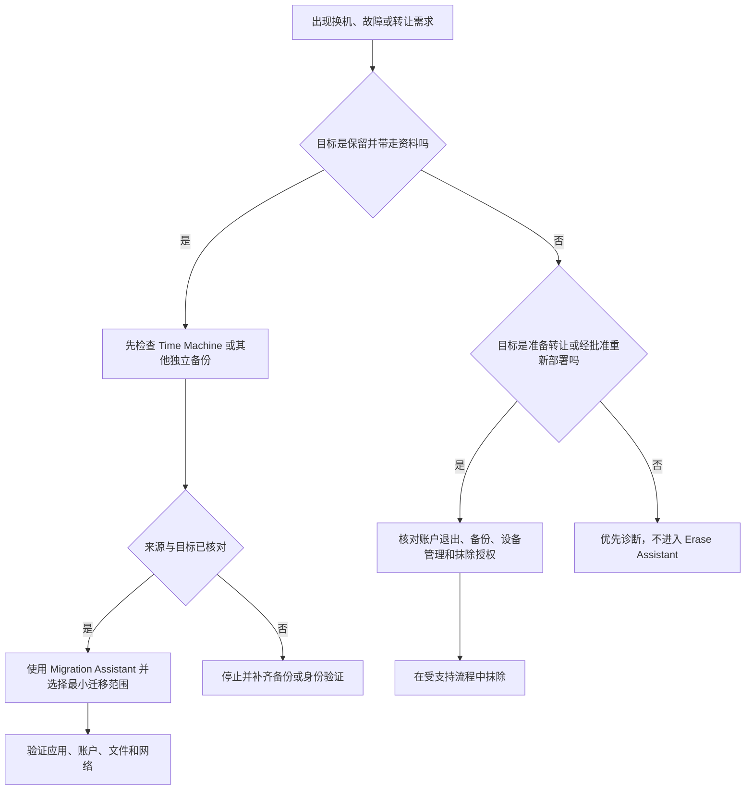

# 为恢复做准备：启动磁盘、时间机器、设备管理与迁移重置

General 的最后几页看似彼此无关：Startup Disk 决定从哪个系统启动；Time Machine 管理备份目的地与保留；Device Management 显示工作或学校管理关系；Transfer or Reset 用于迁移信息或打开抹除助手。它们的共同点是都可能影响这台 Mac 能否启动、是否有恢复副本、是否受组织策略约束，以及数据能否安全转移。正确学习顺序应是：先识别当前状态，再验证备份和管理边界，最后才考虑迁移、重启或抹除。

> [!warning] 不把恢复入口当作日常试用按钮
>
> 本篇不执行 Restart、切换启动磁盘、添加或删除管理配置、启动迁移、选择 Erase All Content and Settings，或改变 Time Machine 目的地。上述动作可能导致重启、资料迁移、受管策略变化或不可逆删除。只有在设备归属清楚、备份可验证、恢复路径明确且有足够时间处理失败时，才应进入真正的操作流程。

## 四个页面各自回答什么问题

| 页面 | 英文标题 | 它回答的问题 | 高风险动作 |
| --- | --- | --- | --- |
| 启动磁盘 | `Startup Disk` | 下一次启动从哪个系统或磁盘开始？ | 选择其他启动盘并 Restart。 |
| 时间机器 | `Time Machine` | 是否有备份目的地，保留策略如何工作？ | 更换、移除或重新初始化备份磁盘。 |
| 设备管理 | `Device Management` | 是否连接工作/学校账户或安装了配置描述文件？ | 添加、移除或绕过受管配置。 |
| 传输或重置 | `Transfer or Reset` | 是迁移信息还是进入安全抹除流程？ | 开始迁移或 Erase All Content and Settings。 |

在每个页面中，Read、Select、Open、Restart、Add、Remove、Transfer、Erase 的风险不同。`Open Migration Assistant` 只是打开迁移工具，后续选择才决定迁移范围；`Erase All Content and Settings` 直接通向抹除助手，应比普通开关有更高的确认门槛。

## Startup Disk：选择启动来源，不是清理磁盘

> 本机截图未包含在公开版本中，以保护原图中的个人信息。

`Select the system you want to use to start up your computer` 是完整的任务说明。Select 的对象是 system；to use 说明用途；to start up your computer 说明它影响启动过程。页面中已选磁盘、系统版本和卷名是当前设备数据，本篇不记录具体名称、版本号或容量。

| 完整界面表达 | 中文 | 正确理解 | 不应误读为 |
| --- | --- | --- | --- |
| `Startup Disk` | 启动磁盘。 | 系统可用于启动的来源选择页。 | 存储清理或备份页。 |
| `Select the system …` | 选择要用于启动计算机的系统。 | 选择默认或下一次启动的系统。 | 选择任何文件夹就能启动。 |
| `You have selected … on the disk …` | 你已在某磁盘上选择某系统。 | 当前选择状态。 | 切换已经完成并验证成功。 |
| `Restart…` | 重新启动。 | 让选定启动盘生效的动作入口。 | 普通关闭窗口。 |

不同硬件和安全策略会影响可选启动来源。官方说明特别提醒，具备特定安全芯片或 Apple silicon 的 Mac 可能需要额外的启动安全设置。看不到某个外部盘、网络卷或系统时，不能直接降低安全策略；先确认磁盘可用性、系统兼容性、引导方式与官方说明。

> [!warning] 变更启动盘前先验证恢复路径
>
> 选择另一个启动盘可能让当前工作环境、加密卷、外设驱动、网络配置或开发工具呈现不同状态。开始前确认：当前系统可以正常启动；备用系统是可信且兼容的；你知道如何回到原启动盘；关键资料已有独立备份。不要把陌生可启动介质或网络安装映像当成安全的恢复方案。

### 只读排查启动异常的顺序

1. 若 Mac 能正常进入系统，打开 Startup Disk，读取当前选定系统与可见候选项，不点击 Restart。
2. 判断现象是“启动很慢”“问号图标”“外设引起卡顿”还是“需要测试另一套系统”。这些问题不一定都应切换启动盘。
3. 检查最近插入的存储、扩展坞和外设；按受支持方式逐个断开或重连进行排查，而不是同时改启动盘和安全策略。
4. 如果必须从备用来源启动，遵循当前硬件的官方启动选项和安全策略，记录原状态。
5. 成功启动后，在系统设置中复核 Startup Disk，不把一次性的启动选择误当作默认设置已永久改变。

可用英文：`I reviewed the selected startup system before restarting, because changing the startup disk affects the entire boot environment.`

## Time Machine：备份保留策略、目标磁盘与恢复不是同一件事

> 本机截图未包含在公开版本中，以保护原图中的个人信息。

Time Machine 的说明包含 local snapshots、hourly backups、daily backups、weekly backups 与 `as space is needed`。它描述一个保留策略：本地快照和不同时间粒度的备份可能同时存在；较旧的备份或本地快照会在空间需要时被删除。这个机制有助于恢复，但不能被理解成“任何文件都永远保存”或“有一个备份盘就一定包含最新资料”。

| 表达 | 中文理解 | 需要继续确认 |
| --- | --- | --- |
| `backs up your computer` | 备份你的电脑。 | 哪些卷、哪些数据、何时完成最近一次备份。 |
| `local snapshots` | 本地快照。 | 它们位于本机且受本地空间影响。 |
| `hourly backups for the past 24 hours` | 过去 24 小时的每小时备份。 | 当前备份是否正常完成。 |
| `daily backups for the past month` | 过去一个月的每日备份。 | 所需日期是否仍在保留窗口。 |
| `weekly backups for all previous months` | 更早月份的每周备份。 | 所需版本是否可用。 |
| `The oldest backups … are deleted as space is needed` | 空间需要时删除最旧备份。 | 不要把保留规则当成永久档案。 |
| `Add` / `Remove` | 添加 / 移除。 | 添加或移除备份目的地，不是立即手工恢复。 |
| `Options…` | 选项。 | 检查排除项目、频率和其他备份规则。 |

本机截图中的磁盘名称、容量、下次备份和历史日期属于动态设备数据，不写入正文。学习时应掌握查看字段：backup destination、available space、last backup、next backup 和 options；而不是记某台设备当前有多少空间。

### 备份、快照与同步的边界

| 概念 | 它主要解决什么 | 不能替代 |
| --- | --- | --- |
| Time Machine backup | 将文件和系统状态保留在可恢复历史中。 | 对所有在线服务的同步或账户恢复。 |
| local snapshot | 在本机磁盘上短期保留恢复点。 | 独立外部备份，硬件丢失或损坏后不保证可用。 |
| 云端同步 | 在多个设备间保持内容可访问。 | 具有明确历史保留的独立备份。 |
| Migration Assistant | 将资料转移到另一台 Mac。 | 自动验证所有应用都兼容。 |

> [!tip] 备份的可用性要通过恢复思维验证
>
> “备份磁盘已连接”只是第一步。更有意义的问题是：最近成功备份的时间是什么；需要的文件或版本是否能在备份中找到；备份盘是否被加密并可访问；在本机不可用时，是否仍有独立恢复路径。不要在真正故障发生时才第一次确认这些问题。

## Device Management：账户登录与配置描述文件属于组织边界

> 本机截图未包含在公开版本中，以保护原图中的个人信息。

Device Management 页面显示 `Work or School Account`、`Sign In…`、已安装 profile 列表与 `Add profile`。`No profiles installed` 只是在采集时的当前状态，不能推广为“设备永远不受管理”。受管 Mac 可能通过账户、配置描述文件、设备管理服务或组织策略控制软件、网络、证书、安全和更新行为。

| 表达 | 软件语境中文 | 应如何理解 |
| --- | --- | --- |
| `Work or School Account` | 工作或学校账户。 | 组织身份与资源接入入口。 |
| `Sign In…` | 登录。 | 可能开始组织账户关联流程。 |
| `profiles` | 配置描述文件。 | 可携带系统设置、证书、限制或管理规则。 |
| `No profiles installed` | 未安装配置描述文件。 | 仅表示当前列表状态。 |
| `Add profile` | 添加描述文件。 | 导入或安装配置前的高风险入口。 |
| `Remove selected profiles` | 移除选中的描述文件。 | 可能影响组织服务与合规，通常需要授权。 |

不要把 Add profile 当成“安装一个方便的小设置”。描述文件可能改变网络代理、VPN、证书、账户、隐私限制或更新策略。尤其在工作或学校设备上，未经授权的添加、删除、转移或规避管理动作都可能违反规则并使设备失去支持。

> [!warning] 受管配置应由可信来源和管理员处理
>
> 只安装来自组织官方入口或明确可信供应方的 profile；不要从聊天、网页弹窗或陌生邮件下载配置文件。若发现不认识的工作/学校账户或 profile，先记录名称、签发方和状态，再联系管理员或使用官方支持渠道，不要在不了解依赖时尝试移除。

## Transfer or Reset：迁移与抹除是相反方向的高影响流程

> 本机截图未包含在公开版本中，以保护原图中的个人信息。

Transfer or Reset 只有两个显著入口，却服务相反目标。`Open Migration Assistant…` 是把信息带到这台 Mac 或从这台 Mac 转到另一台设备；`Erase All Content and Settings…` 是打开抹除助手，清除本机内容和设置。两者都可能要求管理员认证，但“需要认证”不代表结果可逆。

| 完整表达 | 中文 | 适合的场景 | 不能用于 |
| --- | --- | --- | --- |
| `Migration Assistant` | 迁移助理。 | 换机、从备份恢复或转移资料。 | 代替逐项兼容性验证。 |
| `transfer information` | 传输信息。 | 转移数据、账户、设置和应用。 | 保证所有 App 都可在新系统运行。 |
| `from another Mac, a Windows PC, a Time Machine backup, or disk` | 从另一台 Mac、Windows PC、Time Machine 备份或磁盘。 | 确认迁移来源类型。 | 来源可信或完整的自动证明。 |
| `to this Mac` / `to another Mac` | 到这台 Mac / 到另一台 Mac。 | 明确传输方向。 | 双向实时同步。 |
| `Erase All Content and Settings` | 抹掉所有内容和设置。 | 转让、出售或经批准的重新部署前。 | 一般故障排查、释放一点空间。 |

`Use Migration Assistant to transfer information` 中 transfer 是“转移”，不是复制一份并自动保持同步。迁移结束后，应用版本、系统兼容性、账户登录、许可证、网络设置、外设驱动和安全工具都应单独验证。`Erase All Content and Settings` 则比移除一个账号、删除一个文件夹或重装一个应用更彻底，绝不应作为试错步骤。

流程图将“迁移”和“抹除”放在两个分支。无论哪一条，备份、来源身份、设备管理和结果验证都在操作前后出现；这一点比记住按钮位置更重要。

## 两个完整操作案例

### 案例一：为新 Mac 进行不执行迁移的准备检查

1. 打开 **System Settings → General → Time Machine**，检查是否存在预期备份目标、最近成功备份与 Options；不添加或移除目的地。
2. 在 Startup Disk 中读取当前系统环境，确认源 Mac 能正常启动。
3. 在 Device Management 中确认设备是否有工作/学校账户或 profile；若存在，了解组织是否允许迁移和需要哪些步骤。
4. 打开 **Transfer or Reset**，阅读 Migration Assistant 说明，确认来源可能是另一台 Mac、Windows PC、Time Machine backup 或 disk。
5. 建立迁移清单：用户账户、文件、应用、许可证、网络/VPN、外设、项目文件、备份恢复计划。
6. 只在源、目标、电源、网络、账户和时间窗口都准备好后，才从 Open Migration Assistant 继续。
7. 用英语记录：`I verified the backup, startup state, and management requirements before opening Migration Assistant.`

### 案例二：为设备转让做安全的只读核对

1. 明确设备所有权、是否受组织管理、是否仍有工作或学校账户、是否有未完成同步与备份。
2. 在 Time Machine 或独立备份中确认重要资料有可恢复副本；不要只看“备份已开启”。
3. 检查 Passwords、账户、浏览器、开发密钥、企业 VPN、许可证和外设是否有转移或注销要求，但不要在文档中记录秘密。
4. 打开 Transfer or Reset，阅读 `Erase All Content and Settings…`，此时不点击。
5. 确认购买方、组织管理员或设备生命周期流程允许抹除；若是受管设备，先按管理者指引解除或交还。
6. 只有全部条件具备时，按 Erase Assistant 的逐步确认流程执行，并在完成后确认设备回到适合交接的状态。
7. 用英语记录：`I confirmed ownership, backup, account sign-out, and management status before considering Erase All Content and Settings.`

> [!success] 每次高影响操作都要能回答“如何恢复”
>
> 迁移前能否回到源设备？切换启动盘后能否选回原盘？删除数据前是否存在经验证备份？移除 profile 后谁负责恢复组织访问？这些问题有明确答案时，才适合从阅读页面走到执行页面。

## 常见错误、风险与恢复方式

| 常见错误 | 为什么不可靠 | 更可靠的处理 |
| --- | --- | --- |
| 为排查启动慢直接切换启动盘 | 问题可能来自外设、磁盘检查或系统任务。 | 先只读核对当前启动盘和最近外设变化。 |
| 把本地快照当作唯一备份 | 本地磁盘损坏、丢失或空间回收时可能不可用。 | 维持独立、可验证的备份目标。 |
| 看到 No profiles installed 就认为没有组织控制 | 管理关系可能来自其他账户或服务。 | 核对设备归属与管理员政策。 |
| 迁移前没有检查应用兼容性和许可证 | 数据可传，应用不一定可用。 | 列出关键 App、版本和授权恢复步骤。 |
| 用 Erase All Content and Settings 解决普通卡顿 | 抹除是高影响重置，不是常规优化。 | 先诊断、更新、备份和逐项排查。 |
| 一边迁移一边修改源 Mac 数据 | 可能造成内容不一致或遗漏。 | 在迁移窗口保持源端稳定，按完成后验证。 |

恢复计划应写成可执行顺序：先回到已知可启动环境；恢复网络和账户访问；从验证过的备份恢复关键文件；最后逐项恢复应用和外设。若设备无法启动、备份不可见、受管 profile 阻止操作或迁移出现兼容性问题，停止扩展操作，保存错误信息，依据 Apple 官方恢复流程或组织支持渠道处理。

## 英语表达规律：start up、back up、transfer 与 erase

这几页的动词表示不同方向的系统动作。把介词和对象一起读，才能避免操作反向。

| 结构 | 原文片段 | 表达重点 |
| --- | --- | --- |
| `start up from + 磁盘` | 从某启动盘启动。 | 决定引导来源。 |
| `back up + 对象` | `backs up your computer` | 建立可恢复副本。 |
| `transfer … from A to B` | 将信息从来源迁移到目标。 | 必须明确方向。 |
| `selected … on the disk` | 在某磁盘上选定系统。 | 描述当前选择，不代表已重启验证。 |
| `erase all content and settings` | 抹掉内容和设置。 | 高影响、不可当作普通撤销。 |
| `as space is needed` | 在需要空间时。 | 表示保留策略的条件。 |

对比三句：

- `Time Machine backed up the files.`：备份已保存文件的恢复副本。
- `Migration Assistant transferred the files.`：迁移助理把文件转到目标设备。
- `Erase Assistant removed the files and settings.`：抹除助手删除内容和设置。

三句都涉及文件，但保留、迁移和删除的方向完全不同。学习时不要只记 file 或 data，要把动词、来源、目标和结果一起说完整。

## 自测

1. Startup Disk 与 Storage 页面分别解决什么问题？
2. Time Machine 的本地快照为什么不能代替独立备份？
3. Device Management 的 profile 可能影响哪些类型的设置？
4. Migration Assistant 与同步服务有什么根本区别？
5. Erase All Content and Settings 在什么情况下才可考虑？
6. 用英语表达：“我在迁移或抹除前先验证了备份、设备归属、管理状态和恢复路径。”

查看参考答案

1. Startup Disk 决定从哪个系统或磁盘启动；Storage 管理容量和分类占用。
2. 本地快照位于本机磁盘并会随空间需求回收，设备丢失或磁盘故障时不提供独立保护。
3. 它可能影响账户、证书、网络、VPN、限制、安全、更新和设备政策。
4. Migration Assistant 是一次性将指定信息从来源转到目标；同步服务维持符合条件内容在设备间可访问，两者的时机和范围不同。
5. 仅在设备转让、经批准重新部署或明确需要彻底重置，且已经完成备份、账户处理、管理确认和恢复计划时考虑。
6. `Before migration or erasure, I verified the backup, device ownership, management status, and recovery path.`

## 版本边界与来源

- 本机界面事实来自 macOS 27.0 Beta (26A5425a) 的本地采集，采集日期为 2026-09-09。启动候选项、备份磁盘、管理 profile、迁移来源和抹除可用性会因硬件、加密、账户和组织策略而不同。
- 功能说明参考 Apple 的 [Change your Mac startup disk](https://support.apple.com/guide/mac-help/change-your-mac-startup-disk-mchlp1034/mac)、[Use Transfer or Reset settings on Mac](https://support.apple.com/guide/mac-help/use-transfer-or-reset-settings-on-mac-mchla14c784b/mac)、[Transfer your information to Mac from another computer or device](https://support.apple.com/en-gb/guide/mac-help/mh27921/mac) 与 [Restore your Mac from a backup](https://support.apple.com/en-us/102551)。实际恢复或重置时应遵循当前系统、硬件和组织支持流程。
