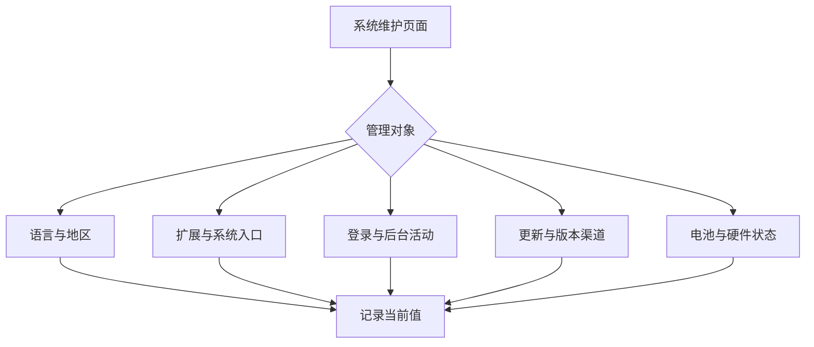

# 识别系统维护的连续选项：语言、扩展、登录项与更新

通用设置中经常出现很长的名单：首选语言、可翻译语言、登录项、后台活动、扩展类型和可更新组件。名单长不代表每一行都该立即改变。正确的学习顺序是先识别页面要管理的**生命周期**：语言决定界面与服务如何呈现；扩展决定某项功能能否出现在系统的入口；登录项和后台活动决定何时启动；更新决定何时取得新版本；电池选项决定硬件使用与状态反馈。

> [!warning] 维护设置会跨越多个会话
> 改语言、后台活动、登录项、扩展或自动更新都可能在之后的启动、登录或联网时才显现效果。阅读这些页面时不需要添加登录项、开关后台项目、报名 Beta 或修改电池策略。需要改动时，应先明确目标与恢复值。

## 学习目标

你将能分清 `Preferred Languages`、`Translation Languages`、`Login Items`、`Allow in the Background`、`Extensions`、`Automatic Updates`、`Beta Updates` 和 `Battery Health` 的作用范围；能解释为什么分段画面仍属于同一个列表；也能用英语说明“我检查了可用项，没有启用新的后台活动”。

## 让长清单回到功能模型

`Preferred Languages` 关注优先顺序；`Translation Languages` 关注可下载或可用于翻译的语言资源。`Login Items` 说的是登录时启动，`Allow in the Background` 说的是在没有前台窗口时继续活动。两类页面都可能列出相同来源，但时间条件不同。`

## 真实界面：语言顺序、翻译资源与后台项目

> 本机截图未包含在公开版本中，以保护原图中的个人信息。

> 本机截图未包含在公开版本中，以保护原图中的个人信息。

> 本机截图未包含在公开版本中，以保护原图中的个人信息。

> 本机截图未包含在公开版本中，以保护原图中的个人信息。

> 本机截图未包含在公开版本中，以保护原图中的个人信息。

> 本机截图未包含在公开版本中，以保护原图中的个人信息。

> 本机截图未包含在公开版本中，以保护原图中的个人信息。

> 本机截图未包含在公开版本中，以保护原图中的个人信息。

> 本机截图未包含在公开版本中，以保护原图中的个人信息。

> 本机截图未包含在公开版本中，以保护原图中的个人信息。

> 本机截图未包含在公开版本中，以保护原图中的个人信息。

> 本机截图未包含在公开版本中，以保护原图中的个人信息。

> 本机截图未包含在公开版本中，以保护原图中的个人信息。

> 本机截图未包含在公开版本中，以保护原图中的个人信息。

> 本机截图未包含在公开版本中，以保护原图中的个人信息。

> 本机截图未包含在公开版本中，以保护原图中的个人信息。

> 本机截图未包含在公开版本中，以保护原图中的个人信息。

> 本机截图未包含在公开版本中，以保护原图中的个人信息。

> 本机截图未包含在公开版本中，以保护原图中的个人信息。

> 本机截图未包含在公开版本中，以保护原图中的个人信息。

> 本机截图未包含在公开版本中，以保护原图中的个人信息。

> 本机截图未包含在公开版本中，以保护原图中的个人信息。

> 本机截图未包含在公开版本中，以保护原图中的个人信息。

> 本机截图未包含在公开版本中，以保护原图中的个人信息。

## 真实界面：扩展分类、更新渠道与电池状态

> 本机截图未包含在公开版本中，以保护原图中的个人信息。

> 本机截图未包含在公开版本中，以保护原图中的个人信息。

> 本机截图未包含在公开版本中，以保护原图中的个人信息。

> 本机截图未包含在公开版本中，以保护原图中的个人信息。

> 本机截图未包含在公开版本中，以保护原图中的个人信息。

> 本机截图未包含在公开版本中，以保护原图中的个人信息。

> 本机截图未包含在公开版本中，以保护原图中的个人信息。

> 本机截图未包含在公开版本中，以保护原图中的个人信息。

> 本机截图未包含在公开版本中，以保护原图中的个人信息。

> 本机截图未包含在公开版本中，以保护原图中的个人信息。

> 本机截图未包含在公开版本中，以保护原图中的个人信息。

> 本机截图未包含在公开版本中，以保护原图中的个人信息。

> 本机截图未包含在公开版本中，以保护原图中的个人信息。

> 本机截图未包含在公开版本中，以保护原图中的个人信息。

> 本机截图未包含在公开版本中，以保护原图中的个人信息。

> 本机截图未包含在公开版本中，以保护原图中的个人信息。

> 本机截图未包含在公开版本中，以保护原图中的个人信息。

> 本机截图未包含在公开版本中，以保护原图中的个人信息。

> 本机截图未包含在公开版本中，以保护原图中的个人信息。

> 本机截图未包含在公开版本中，以保护原图中的个人信息。

> 本机截图未包含在公开版本中，以保护原图中的个人信息。

> 本机截图未包含在公开版本中，以保护原图中的个人信息。

> 本机截图未包含在公开版本中，以保护原图中的个人信息。

> 本机截图未包含在公开版本中，以保护原图中的个人信息。

> 本机截图未包含在公开版本中，以保护原图中的个人信息。

> 本机截图未包含在公开版本中，以保护原图中的个人信息。

> 本机截图未包含在公开版本中，以保护原图中的个人信息。

> 本机截图未包含在公开版本中，以保护原图中的个人信息。

### 完整界面表达

| 原文 | 软件语境中文 | 核心问题 | 常见误解 |
| --- | --- | --- | --- |
| `Preferred Languages` | 首选语言 | 系统优先使用什么语言？ | 所有应用立即强制使用同一语言。 |
| `Translation Languages` | 翻译语言 | 哪些语言可用于翻译功能？ | 系统界面优先顺序。 |
| `Open at Login` | 登录时打开 | 登录后是否启动该来源？ | 它能否在后台继续工作。 |
| `Allow in the Background` | 允许在后台运行 | 不在前台时能否继续活动？ | 是否自动随登录启动。 |
| `Extensions` | 扩展 | 哪些功能可接入系统入口？ | 每个扩展都具有相同权限。 |
| `Automatic Updates` | 自动更新 | 系统何时自动获取和安装更新？ | 已立即升级到新版本。 |
| `Beta Updates` | Beta 更新 | 是否选择测试渠道 | 一般稳定版更新。 |
| `Battery Health` | 电池健康 | 电池状态与容量维护信息 | 当前屏幕亮度。 |

## 两个完整观察案例

### 案例一：解释登录时启动和后台活动为何不同

1. 打开 **General → Login Items & Extensions**，阅读 `Open at Login` 与 `Allow in the Background` 两个分区。
2. 用时间条件区分：前者以登录为触发点，后者以没有前台窗口时能否继续活动为条件。
3. 不添加或移除任何项目，也不改变现有允许状态。
4. 用英语报告：`Opening at login and running in the background are separate behaviors.`
5. 若以后需变更，记录来源所在分区和原值，恢复时只改回同一分区中的那一项。

### 案例二：阅读更新渠道而不改变更新计划

1. 打开软件更新页面，分别读 `Automatic Updates` 与 `Beta Updates`。
2. 确认一个讨论自动化的获取或安装，另一个讨论更新渠道的选择。
3. 不下载、不安装、不加入测试渠道。
4. 用英语复述：`I reviewed the update channel and automatic-update options without changing the update plan.`
5. 需要评估更新时，先查版本与兼容性，再决定是否变更；不要把阅读页面当作已完成升级。

> [!tip] 连续名单的读法
> 多张续页表示同一列表超出一屏，不表示同一来源被重复添加。先读列表标题与分区标题，再把每一张续页作为同一范围的证据。这样可以避免把“可用语言”“后台活动”或“扩展类型”误记为多个独立开关。

## 英语表达规律与搭配

系统维护常用时间和状态表达：`at login` 标记登录时刻，`in the background` 标记无前台窗口的运行状态，`automatic` 描述由系统自行执行，`available` 描述资源可供使用。可用的完整说明是：`This item is allowed to run in the background, but it does not have to open at login.` 它同时否定了错误的必然关系。

| 单词 | 音标 | 词性 | 本篇语境义 | 所在完整表达 |
| --- | --- | --- | --- | --- |
| preferred | /prɪˈfɜːrd/ | adj. | 优先选用的 | `Preferred Languages` |
| translation | /trænzˈleɪʃən/ | n. | 翻译 | `Translation Languages` |
| background | /ˈbækɡraʊnd/ | n. | 后台运行状态 | `Allow in the Background` |
| extension | /ɪkˈstenʃən/ | n. | 系统扩展功能 | `Extensions` |
| automatic | /ˌɔːtəˈmætɪk/ | adj. | 自动执行的 | `Automatic Updates` |
| beta | /ˈbeɪtə/ | n./adj. | 测试版本渠道 | `Beta Updates` |
| health | /helθ/ | n. | 健康状况 | `Battery Health` |

## 自测

1. `Preferred Languages` 与 `Translation Languages` 的对象有什么不同？
2. `Open at Login` 与 `Allow in the Background` 的时间条件分别是什么？
3. 为什么 `Beta Updates` 不能被理解为“已经安装更新”？
4. 用英语说“我查看了后台活动列表，没有允许新的项目在后台运行”。

查看参考答案

1. 前者是系统优先呈现语言，后者是翻译功能的语言资源。
2. 前者在登录时启动，后者描述没有前台窗口时是否允许继续活动。
3. 它是更新渠道选择，不等于下载或安装已发生。
4. `I reviewed the background activity list without allowing a new item to run in the background.`

## 版本与来源

本文基于本机 macOS 27.0 Beta (26A5425a) 于 2026-09-09 的采集。语言、扩展、后台项目和更新选项会随已安装内容及系统状态变化；本文不转录动态项目名称。功能参考 Apple 的 [Change General settings on Mac](https://support.apple.com/guide/mac-help/change-general-settings-mchlbe8d1e1a/mac) 与 [Update macOS on Mac](https://support.apple.com/guide/mac-help/update-macos-mchlpx1065/mac)。
