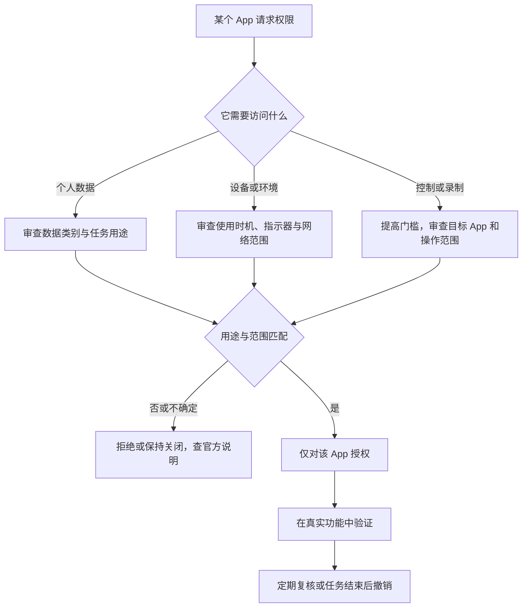

# 建立权限判断模型：隐私类别、安全层与最小授权

Privacy & Security 不是一张“把所有开关关掉就更安全”的清单。它将 App 访问个人数据、位置、传感器、屏幕、网络和系统控制能力分成不同类别，又将应用来源、磁盘加密、配件访问、后台安全改进和 Lockdown Mode 放在 Security 区域。一个类别有 App 数量，不能说明这些 App 都不可信；一个类别显示 none，也不能说明未来无需权限。正确做法是围绕一次具体用途，判断哪一个 App 在什么场景访问哪类资源，以及关闭后如何恢复。

> [!warning] 权限是功能与数据之间的明确边界
>
> 本篇只用于理解页面与只读审查，不批量切换权限，不降低应用来源限制，不关闭加密或安全保护，也不启用 Lockdown Mode。关闭错误权限会让会议、同步、输入、备份、外设、自动化或企业应用失效；开启错误权限会扩大数据与控制面。每次变更应只针对一个已确认 App、一个明确用途和一个可验证结果。

## 页面路径与权限的三层模型

路径是 **Apple menu → System Settings → Privacy & Security**。页面顶部 Privacy 说明“控制哪些 App 可以访问数据、位置、摄像头和麦克风，并管理安全保护”。可将整页分为三层：资源权限、控制权限和系统安全策略。

| 层级 | 常见类别 | 它控制什么 | 典型问题 |
| --- | --- | --- | --- |
| 资源权限 | Photos、Contacts、Calendars、Files & Folders | App 能否读取或写入某类个人资料。 | 这个 App 为什么需要这些数据？ |
| 设备与环境权限 | Location Services、Camera、Microphone、Bluetooth、Local Network | App 能否感知或使用设备周边和传感器。 | 使用会在什么场景发生？ |
| 控制权限 | Accessibility、Automation、Input Monitoring、Screen & System Audio Recording、Remote Desktop | App 能否代替你控制、观察输入或记录屏幕。 | 它是否拥有超出普通数据读取的能力？ |
| 系统安全策略 | FileVault、Accessories、Lockdown Mode、Allow applications from | 保护磁盘、硬件连接、应用执行和高风险防护。 | 改动是否影响整台 Mac？ |

“资源权限”回答 App 能看什么；“控制权限”回答 App 能做什么或观察哪些操作；“安全策略”回答系统允许怎样的整体信任关系。三者风险等级不同，不能因为都在同一个页面就使用同一种处理方式。

## 界面实例：Privacy & Security 的类别结构

> 本机截图未包含在公开版本中，以保护原图中的个人信息。

截图里的 App 数量、账户状态、应用来源选择和系统状态属于当前设备的动态数据，不写入正文、搜索、词汇表或练习。学习应聚焦稳定类别名和界面结构。

| 完整界面表达 | 软件语境中文 | 它让你检查什么 | 不应误读为 |
| --- | --- | --- | --- |
| `Privacy` | 隐私。 | App 对数据和设备能力的访问。 | 只与浏览器隐私有关。 |
| `Control which apps can access …` | 控制哪些 App 可以访问…… | 权限应按 App 和资源分类审查。 | 所有 App 共享同一授权。 |
| `Location Services` | 定位服务。 | 位置相关访问。 | 关闭后绝对没有任何位置推断。 |
| `Files & Folders` | 文件与文件夹。 | 特定目录和文件访问。 | 等同于完整磁盘访问。 |
| `Full Disk Access` | 完整磁盘访问。 | 更广泛的文件访问能力。 | 只是普通文件选择权限。 |
| `Input Monitoring` | 输入监控。 | 观察键盘、鼠标或其他输入事件的能力。 | 与输入法语言选择相同。 |
| `Screen & System Audio Recording` | 屏幕与系统音频录制。 | 捕获屏幕或系统音频。 | 只录当前单个窗口。 |
| `Security` | 安全。 | 加密、应用来源、配件和高风险防护。 | 单纯的 App 列表。 |
| `Advanced…` | 高级。 | 深层安全选项入口。 | 不需要理解影响的优化按钮。 |

`Control which apps can access your data, location, camera, and microphone` 的核心是 Control which apps：控制“哪些 App”；can access 限定为“可以访问”；后面列出数据和设备资源。它不是“允许一个类别里的所有软件”。当你打开某一类别时，应该问：这个 App 是否真的需要该资源来完成我现在要做的具体任务？

## 资源权限：按数据类型审查，不按 App 名称猜测

资源权限包括 Calendars、Contacts、Files & Folders、Home、Media & Apple Music、Photos、Reminders 等。它们让应用访问不同的数据域。一个图片编辑 App 请求 Photos 可能符合其功能；同一 App 请求 Contacts 则需要另外的解释。权限审查不能仅凭“这个 App 很知名”通过，也不能仅凭“我不认识名字”立即撤销。

| 类别 | 数据或能力范围 | 常见合理场景 | 应增加审查的场景 |
| --- | --- | --- | --- |
| `Contacts` | 通讯录资料。 | 通信、日历邀请、身份匹配。 | 无联系人功能的工具要求读取。 |
| `Calendars` | 日历与日程。 | 会议、提醒、日程助手。 | 只需本地离线功能的 App 要求全量访问。 |
| `Photos` | 照片图库。 | 修图、导入、媒体发布。 | 无媒体处理功能却要求读取图库。 |
| `Reminders` | 提醒事项。 | 任务管理与提醒同步。 | 只提供无关功能的 App 要求访问。 |
| `Home` | 家庭与智能配件相关资料。 | 家居控制。 | 无智能家居功能的 App 请求。 |
| `Media & Apple Music` | 媒体库或音乐相关访问。 | 播放、整理或媒体创作。 | 不需要媒体数据的后台服务请求。 |

权限表中的数字是“当前列表中有多少应用或授权记录”的提示，不是危险评分。较多可能只是设备安装的应用较多、工作流复杂，或权限在长时间使用中累积。更好的审查动作是按类别打开详情，挑出一项你认识的 App，阅读其用途，决定是否继续保留。

> [!tip] 将权限问题变成完整句子
>
> 不要只问“要不要开照片权限”。应问“这个应用为了哪项功能，需要在什么时机读取或写入哪些照片，它是否有更小范围的替代路径？”把对象、目的、范围和时机说完整，授权决定才可解释、可复核。

## 设备与环境权限：位置、摄像头、麦克风与本地网络

设备权限常产生即时感知：Location Services、Camera、Microphone、Bluetooth、Local Network、Motion & Fitness、Speech Recognition。它们不只影响数据读取，还可能在你使用会议、地图、语音、蓝牙外设、局域网服务或运动记录时启用。系统可通过隐私指示器显示部分正在使用的敏感能力，但指示器是提醒，不是完整审计报告。

| 类别 | 允许的能力 | 关闭后的典型影响 | 检查方法 |
| --- | --- | --- | --- |
| `Location Services` | 使用与本机位置相关的信息。 | 地图、天气、附近服务或时区自动化可能受影响。 | 检查全局开关、单个 App 与 System Services。 |
| `Camera` | 拍摄照片和视频。 | 视频会议、扫码、拍照功能可能无法使用。 | 核对当前会议或图像工具是否需要。 |
| `Microphone` | 捕获或录制音频。 | 通话、听写、录音和语音功能可能失效。 | 核对是否有可信 App 正在请求。 |
| `Bluetooth` | 与蓝牙设备通信或发现。 | 耳机、鼠标、外设或附近设备功能受影响。 | 区分系统连接与 App 级访问。 |
| `Local Network` | 在局域网发现或访问设备。 | 局域网打印、播放器、开发调试或文件服务受影响。 | 核对目标设备与网络归属。 |
| `Speech Recognition` | 将语音识别为文本或命令。 | 听写、语音控制或应用语音输入受影响。 | 核对语音数据处理说明。 |

`Location Services` 关闭后，精确位置不会按该服务提供；但浏览器、网络和第三方服务仍可能通过其他信号推断粗略区域。正确的表述不是“关闭定位就绝对不可追踪”，而是：`Turning off Location Services prevents apps from using this system location service, but it does not eliminate every possible location signal.`

Control Center 中的隐私指示器可以提示麦克风、摄像头、系统音频和位置的使用状态：常见含义是橙点表示麦克风、绿点表示摄像头、紫点表示系统音频录制、箭头表示位置被使用。它们提醒你“现在或近期有敏感能力参与”，遇到意外指示器时可先打开 Control Center 查看涉及的 App，再回到 Privacy & Security 审查相应类别。

> [!warning] 意外录音、摄像或录屏指示应先停止敏感任务
>
> 看到与当前工作不符的指示器时，不要先在不明窗口继续输入、打开私人文件或口述秘密。先暂停敏感操作，确认当前使用 App，检查该 App 的权限与任务；若来源无法确认，退出相关 App 并使用可信安全流程排查。

## 控制权限：能代表你操作的能力需要更高门槛

Accessibility、Automation、Input Monitoring、Screen & System Audio Recording、Remote Desktop、App Management、Device Control and Data Access 等类别通常比普通数据读取更敏感。它们可能让 App 发送操作、观察输入、记录屏幕、控制应用或管理设备数据。授权时应特别关注“它是否能够触发行动”，而不仅是“它能否查看一条信息”。

| 控制类别 | 软件英语含义 | 应问的安全问题 |
| --- | --- | --- |
| `Accessibility` | 辅助功能控制权限。 | 该 App 是否需要模拟点击、键盘或界面操作？ |
| `Automation` | 自动化控制其他 App。 | 它会对哪些目标 App 发送命令？ |
| `Input Monitoring` | 监控输入事件。 | 为什么需要观察键盘、鼠标或快捷键？ |
| `Screen & System Audio Recording` | 捕获屏幕或系统音频。 | 录制范围、提示、保存位置和分享对象是什么？ |
| `Remote Desktop` | 远程桌面能力。 | 谁能发起连接、谁能看或控制屏幕？ |
| `App Management` | 管理其他 App。 | 是安装、更新、配置还是更深层的控制？ |
| `Device Control and Data Access` | 设备控制与数据访问。 | 是否涉及外设、企业设备或本地敏感资料？ |

控制权限不是说 App “一定危险”，而是它的能力范围大，错误授权的影响也更大。常见的合理用途包括自动化工具、屏幕录制、远程支持、开发调试和辅助技术；关键是 App 来源可信、目标行为明确、仅在需要时开启，并在不再需要时复核。

这个流程将“是否授权”从一个直觉判断变成可解释的证据链。一个 App 的权限不应自动推及另一个 App；一个任务结束后也不应因为“之前用过”就无限期保留高风险控制权限。

## Security：系统范围的策略不能用普通 App 开关思维处理

Privacy & Security 底部的 Security 区域包含 `Allow applications from`、FileVault、Accessories、Background Security Improvements、Lockdown Mode 和 Advanced。它们通常面向整台 Mac、受保护数据、外接硬件或高风险防护。与某个 App 的照片权限不同，这类设置的变更可能影响所有用户、启动安全、磁盘可读性或系统支持。

| 设置 | 它保护或控制什么 | 常见误解 |
| --- | --- | --- |
| `Allow applications from` | 允许哪些来源的应用执行。 | 选择更宽范围只是“少一点提示”。 |
| `FileVault` | 保护磁盘上的加密数据。 | 关闭后只是少一个登录步骤。 |
| `Accessories` | 外接配件连接时的批准策略。 | 所有 USB/Thunderbolt 配件都同样安全。 |
| `Background Security Improvements` | 系统安全改进相关机制。 | 只会影响界面外观。 |
| `Lockdown Mode` | 针对高风险数字威胁的强化限制。 | 普通性能优化或通用隐私按钮。 |
| `Advanced…` | 深层安全选项。 | 不理解后果也可以随意调节。 |

Lockdown Mode 的页面说明提到它通过对 App 与功能施加安全限制来减少数字威胁暴露，并面向新闻工作者、活动人士、公共人物等高风险场景。这不表示其他用户不能使用，而是提醒它可能显著限制功能。普通隐私需求应优先从单项授权、软件更新、强密码、备份和受支持安全设置开始；不要把 Lockdown Mode 当作“更安全”的通用开关。

> [!warning] 不要绕过应用来源与系统安全提示
>
> 如果应用未通过系统检查或来源不明，先验证开发者、签名、下载渠道和组织要求。不要因“需要马上打开”就使用 Open Anyway 或降低整体来源限制。系统安全提示是风险调查入口，不是必须清除的障碍。

## 两个完整操作案例

### 案例一：为一次视频会议做最小权限审查

1. 在会议前确认使用的是正确、可信的会议 App 和正确会议链接。
2. 打开 **System Settings → Privacy & Security**，查看 Camera 与 Microphone；只检查该会议 App 的状态，不批量修改其他应用。
3. 如果会议需要共享屏幕，另外审查 Screen & System Audio Recording，确认录制或共享的范围与保存方式。
4. 在会议中观察隐私指示器是否与预期相符；结束后退出会议 App，确认摄像头和麦克风指示不再持续。
5. 若某权限意外失效，只对需要的 App 恢复，并在一次测试通话中验证；不要为了修复一项功能开放所有 App。
6. 用英语记录：`I granted camera and microphone access only to the verified meeting app and checked the privacy indicators during the call.`

### 案例二：审查一个自动化工具的控制范围

1. 明确自动化要完成的一个任务，例如整理窗口或触发一个受信任 App 内的快捷动作。
2. 在 Privacy & Security 中分别查看 Accessibility 与 Automation，记录自动化工具的原始状态和它想控制的目标 App。
3. 阅读工具官方文档，确认它为何需要控制权限；对来源不明的工具保持关闭。
4. 仅在私密测试环境中开启必要的一项权限，执行单一、可观察的任务。
5. 若任务完成且不需要长期自动化，恢复开关；若需保留，记录用途、目标 App 和复核日期。
6. 用英语说明：`I reviewed which application the automation tool could control before granting a limited permission.`

> [!success] 以用途为单位保留授权
>
> “这个 App 曾经有用”不是永久授权理由。为每个高风险权限写下用途、目标资源和复核日期；当用途消失、应用被替换或设备改为共享使用时，重新检查。这样权限状态才能随真实工作流变化，而不是长期堆积。

## 常见错误、风险与恢复方式

| 错误 | 为什么不可靠 | 更可靠的处理 |
| --- | --- | --- |
| 为避免弹窗一次允许所有权限 | 无法知道哪项功能真正需要什么。 | 按类别、App 和具体任务逐项授权。 |
| 看 App 数量多就批量关闭 | 数量不是风险评分，可能破坏必要工作流。 | 先审查高风险类别和不认识的来源。 |
| 将 Files & Folders 与 Full Disk Access 混同 | 权限范围不同，后者更广。 | 分别看目录范围和完整磁盘访问边界。 |
| 关闭定位后假设绝无位置推断 | 仍可能有网络等其他信号。 | 理解服务范围，结合浏览器和网络隐私设置。 |
| 把录屏权限当作普通窗口权限 | 可能捕获屏幕和系统音频。 | 明确录制范围、保存位置与分享对象。 |
| 为打开未知 App 降低系统来源限制 | 扩大整机恶意软件暴露。 | 验证来源、签名和官方渠道，必要时不用该 App。 |

若误关某项权限，先回到同一类别，仅恢复需要的 App，并在真实功能中验证。若误开高风险权限，先关闭该 App 的对应权限，退出 App，查看是否有不明后台组件或远程会话；无法确认来源时，保留证据并使用官方支持或组织安全流程，而不是下载未知“权限修复”工具。

## 英语表达规律：access、control、allow 与 protect

Privacy & Security 中的动词具有不同的授权强度。

| 结构 | 原文片段 | 它表达什么 |
| --- | --- | --- |
| `access + 数据/设备` | `access your data` | 读取、使用或进入某个资源。 |
| `control + App/设备` | `control applications` | 代表用户发起操作，范围通常更大。 |
| `allow + App + to …` | `allow apps to use the camera` | 将某项具体能力授予一个 App。 |
| `manage + 名词` | `manage safety protections` | 配置或维护一组安全机制。 |
| `reduce exposure to …` | `reduce your exposure to digital threats` | 通过限制降低风险面。 |
| `only + 范围` | `only to the verified app` | 把授权限定在最小主体。 |

对比：`The app can access my photos.` 只说它能访问照片；`The app can control another application.` 则意味着它能对目标 App 发出操作。二者都可能需要授权，但后者要额外核对操作目标和自动化范围。完整表达比只说“已授权”更能反映实际风险。

## 自测

1. 资源权限、设备权限、控制权限和系统安全策略有什么区别？
2. 为什么 App 数量不是权限风险评分？
3. Files & Folders 与 Full Disk Access 的范围有什么不同？
4. 意外看到摄像头、麦克风或录屏指示时应先做什么？
5. 为什么 Lockdown Mode 不应被当成普通隐私开关？
6. 用英语表达：“我只为已验证的功能向指定应用授予了最小权限，并在任务结束后复核。”

查看参考答案

1. 资源权限决定数据访问，设备权限决定传感器和环境能力，控制权限决定代表用户操作或记录的能力，系统安全策略影响整台 Mac 的保护边界。
2. 数量只反映当前列表状态，不说明每个 App 是否可信、权限是否合理或正在使用。
3. Files & Folders 通常针对特定目录和文件；Full Disk Access 范围更广，需要更高审查门槛。
4. 暂停敏感操作，确认当前使用 App 和任务，再回到相应权限类别审查来源。
5. 它针对高风险数字威胁并可能显著限制功能，应按威胁模型和官方说明决定。
6. `I granted the minimum permission only to the verified app for a specific task, then reviewed it when the task was complete.`

## 版本边界与来源

- 本机界面事实来自 macOS 27.0 Beta (26A5425a) 的本地采集，采集日期为 2026-09-09。类别、App 列表、数量、状态和安全选项会随软件、账户、硬件与组织策略变化，不能当作其他设备的默认权限状态。
- 权限模型参考 Apple 的 [Control what you share on Mac](https://support.apple.com/en-gb/guide/mac-help/mchl2b29231a/mac) 与 [Change Privacy & Security settings on Mac](https://support.apple.com/en-gb/guide/mac-help/mchl211c911f/mac)。
- 摄像头和麦克风使用提示参考 Apple 的 [Control access to the camera on Mac](https://support.apple.com/en-gb/guide/mac-help/mchlf6d108da/mac) 与 [Control access to the microphone on Mac](https://support.apple.com/en-mide/guide/mac-help/mchla1b1e1fe/26/mac/26)。Lockdown Mode 与应用来源限制应以最新官方说明和组织安全要求为准。
