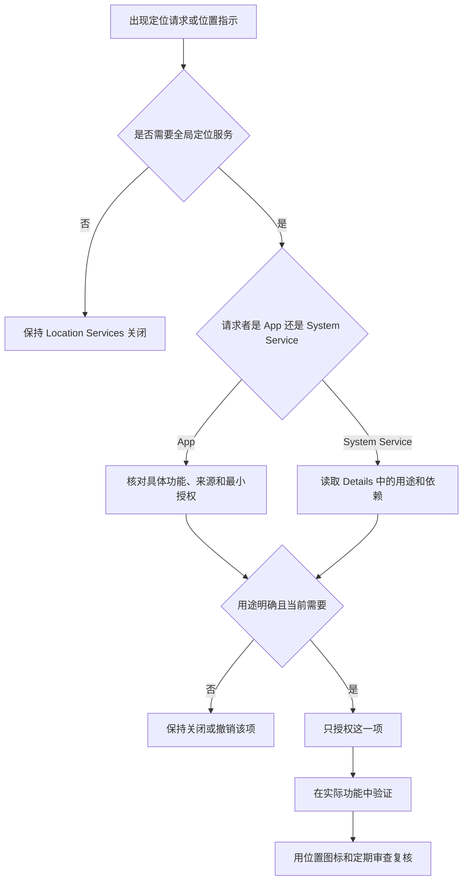

# 审查定位访问：应用、系统服务与重要地点

Location Services 页面不只决定地图能否显示当前位置。它分为一个全局开关、逐个 App 的授权列表、System Services 的细项、近期使用提示和位置图标设置。关闭全局定位会使下方 App 和服务开关不可用；允许一个 App 使用定位不等于允许所有系统服务；关闭定位服务也不能保证所有第三方网站只能看到“完全没有地区线索”。理解这些层级，才能在保留必要功能的同时减少不必要的暴露。

> [!warning] 位置不是单一开关能解决的全部问题
>
> 本篇只讲解和只读检查，不开启定位服务、不修改 App 开关、不改变系统服务，也不清除重要地点。定位会影响地图、天气、附近服务、时区自动化、设备查找、智能家居和搜索建议。关闭前先明确哪些工作流需要位置；开启前先确认 App 来源、用途和最小范围。

## 从全局到单项：四层定位决策

路径是 **Apple menu → System Settings → Privacy & Security → Location Services**。页面顶端的说明句为 `Allow the applications and services below to determine your location.` 它建立了最上层策略；下方是 App 列表；底部的 System Services 进入系统级用途；位置图标说明近期定位使用情况。

| 层级 | 页面表达 | 它决定什么 | 不应理解为 |
| --- | --- | --- | --- |
| 全局服务 | `Location Services` | 应用和服务总体能否使用系统定位服务。 | 已决定每个 App 的具体用途。 |
| App 授权 | 应用名旁的 switch。 | 某一个 App 是否可请求定位。 | 该 App 永远在读取位置。 |
| 系统服务 | `System Services` / `Details…` | macOS 自身为特定功能使用定位。 | 第三方 App 的设置。 |
| 使用提示 | `used your location within the last 24 hours` | 某个 App 近期曾使用位置。 | 当前此刻仍在使用。 |
| 图标选项 | `Show location icon in Control Center …` | 系统服务请求定位时是否显示标志。 | 对位置访问本身的许可。 |

`determine your location` 是“确定你的位置”，它的重点是由系统定位服务提供位置相关信息。不同系统版本、网络条件和硬件可用性会影响精度和行为。授权定位不等于任何 App 都能知道你每一个行动细节；拒绝定位也不等于网络、网站或账户完全无法推断大致区域。

## 界面实例：全局定位、App 列表与近期使用提示

> 本机截图未包含在公开版本中，以保护原图中的个人信息。

截图中的应用列表、开关状态、账户和网络环境属于当前设备数据，不写入正文、搜索、词汇表或练习。下面只解释可复用的英文结构和访问边界。

| 完整界面表达 | 软件语境中文 | 应如何读 | 需要进一步确认 |
| --- | --- | --- | --- |
| `Allow the applications and services below to determine your location.` | 允许下列应用和服务确定你的位置。 | 全局授权说明。 | 是否需要对所有用途开放系统定位。 |
| `Location Services` | 定位服务。 | 系统定位能力的总入口。 | 位置来源、精度与具体 App 行为。 |
| `System Services` | 系统服务。 | macOS 功能自身的定位用途。 | 每个服务具体为何需要位置。 |
| `Details…` | 详情。 | 打开系统服务的细项。 | 点击不会自动切换服务。 |
| `Indicates an application that has used your location within the last 24 hours.` | 表示一个应用在过去 24 小时内使用过位置。 | 近期使用提示。 | 此刻一定仍在使用。 |
| `About Location Services & Privacy…` | 关于定位服务与隐私。 | 说明和帮助入口。 | 用于立即关闭或重置全部权限。 |

`Allow the applications and services below to determine your location` 可以拆为 Allow + 主体 + to determine + 对象。applications and services below 说明授权对象不只有单个 App，还有系统服务；determine 是“确定”；your location 是位置对象。任何修改之前，都要分清自己要控制的是全局服务、一个 App，还是一个系统服务。

## 全局开关：关闭会让下层列表失效，但不会抹去所有位置线索

当 Location Services 总开关关闭时，App 与系统服务列表往往显示为 disabled。这个 UI 状态告诉你：下层开关不能独立超越全局策略。若你只是想阻止一个不需要位置的 App，不必关闭全局服务；逐项关闭该 App 更符合最小授权，也能保留地图、时区或设备查找等已确认需要的功能。

| 选择 | 适合的情况 | 可能影响 | 不应作为 |
| --- | --- | --- | --- |
| 保持全局开启，逐项授权 | 部分可信功能需要定位。 | 需要定期审查列表。 | 对所有 App 的默认信任。 |
| 关闭一个 App | 某 App 的用途无法解释或不再需要。 | 该 App 的附近、地图、自动化功能可能受限。 | 对系统服务的总关闭。 |
| 关闭全局服务 | 设备不需要任何系统定位功能，或在特定高隐私场景。 | App 和系统服务的定位能力都会受影响。 | “从此不存在地区推断”的保证。 |

官方说明指出，位置服务关闭后，精确位置不会由该服务发送给 Apple；然而互联网连接的 IP 地址仍可能被用来推断大致地理区域，第三方网站和应用也可能使用自己的其他方式获得位置信息。学习时要用准确语言：`Turning off Location Services disables this system location service; it does not promise that every service loses all regional context.`

> [!tip] 先选择最小可用层级
>
> 如果目标是让一个 App 不再获取位置，先关闭该 App，而不是关闭全局服务。只有当你确认不需要任何 App 或系统服务使用定位时，才考虑全局关闭。最小范围的变化更容易测试、解释和恢复。

## App 列表：授权一个请求者，不授权一个品牌或类别

列表展示的是曾请求定位的已安装 App。它不必包含每一个安装过的应用；列表为空也不表示设备没有任何位置功能。一个 App 出现在列表中，只表示它请求过或被系统记录为相关主体，不代表它当前一直在定位，也不说明它的隐私实践已经被自动认可。

| 观察到的状态 | 能说明什么 | 不能说明什么 |
| --- | --- | --- |
| App 旁开关为 on | 该 App 被允许通过此服务请求位置。 | 它现在正在使用位置或会将数据发送到何处。 |
| App 旁开关为 off | 该 App 不能使用此系统定位服务。 | 该 App 不再能执行任何功能或无法使用网络。 |
| App 显示近期使用标志 | 在过去 24 小时内发生过一次位置使用。 | 使用频率、精确度或是否存在不当行为。 |
| App 未在列表出现 | 可能尚未请求，或当前不属于此列表。 | 它绝不可能通过任何方式获得区域线索。 |

审查一个 App 时，应先看自己是否正在使用它的定位相关功能。例如导航、天气、附近设备、旅行日程或本地搜索可能需要位置；文本编辑器、离线阅读器或普通计算工具通常更难解释位置需要。判断基于功能和当前用途，而不是只根据 App 图标或名字熟不熟。

### 只读审查一个位置权限的步骤

1. 说清你正在审查的一个 App 和一个功能，不把整个列表当成需要一次清理的任务。
2. 回忆该 App 上一次何时需要位置；若没有明确场景，优先保持或切换为 off，视当前状态和工作要求而定。
3. 阅读 App 官方隐私说明，确认位置用于本地功能、搜索、广告、分析还是其他用途。
4. 改动前记录原开关状态；若应用于工作、出行或会议场景，先安排可以测试的时间。
5. 只改变一项后，在该 App 内完成最小真实任务；验证失败则恢复原状态，而不是再改多个无关设置。

用英语可写成：`I reviewed one app’s location purpose, recorded the original setting, and tested only the feature that required it.`

## System Services：系统用途应逐项阅读

> 本机截图未包含在公开版本中，以保护原图中的个人信息。

System Services 详情页的标题是 `System Services Can Access Your Location For`，后面列出多种用途。系统服务不是一个可以整体轻率关闭的第三方 App；每项对应 macOS 的一个功能面。即使某项名字看起来不常见，也需要先理解其用途与依赖，不能把“名称陌生”作为关闭理由。

| 系统服务表达 | 典型目的 | 关闭前应考虑 |
| --- | --- | --- |
| `Alerts & Shortcuts Automations` | 与提醒、快捷指令自动化相关的位置触发。 | 是否使用位置条件自动化。 |
| `Suggestions & Search` | 为建议和搜索提供位置相关上下文。 | 是否愿意让建议参考附近信息。 |
| `Setting time zone` | 自动确定时区。 | 出差、远程会议和日期时间准确性。 |
| `System customization` | 让系统按位置进行某些定制。 | 具体功能和体验是否需要。 |
| `Significant locations & routes` | 与重要地点和路线相关的功能。 | 是否需要地点相关提醒或服务。 |
| `Find My Mac` | 设备查找与位置能力。 | 丢失设备时的定位需求。 |
| `Home` | 智能家居位置相关能力。 | 是否使用家庭自动化。 |
| `Networking and wireless` | 网络与无线相关的位置用途。 | 无线服务和网络体验。 |
| `Mac Analytics` | 与分析改进相关的用途。 | 是否选择共享相应诊断信息。 |

`Can Access Your Location For` 中 for 说明目的；例如 Setting time zone 是“为了设置时区”。把目的读出来有助于评估比例：如果你需要自动时区，关闭 Setting time zone 可能造成旅行或跨区会议问题；如果你不需要某些位置相关建议，可以单独审查 Suggestions & Search，而不必关闭所有服务。

> [!warning] 重要地点与路线涉及长期行为线索
>
> Significant locations & routes 不只是一次性的当前位置。它涉及地点和行程模式的相关功能，应比一般天气或地图显示更谨慎地审查。不要因为想解决一个搜索结果问题就随意开启或关闭这类服务；先确认它会影响的日历、提醒、地图或家庭自动化功能，并按当前页面的 Details 说明处理。

## 位置图标：提示可见性，不替代访问控制

`Show location icon in Control Center when System Services request your location` 控制的是提示图标是否在 Control Center 显示。它提高可见性，却不决定系统服务能否访问位置。开关之间的关系可用一句话概括：许可决定“能不能”，图标决定“是否提醒你正在或近期发生”。

| 设置 | 改变什么 | 不改变什么 |
| --- | --- | --- |
| 全局 Location Services | 系统定位服务是否可用。 | 各 App 的用途说明。 |
| 单个 App 开关 | 该 App 是否能使用系统定位。 | 其他 App 或 System Services。 |
| 单个 System Service | 一项 macOS 功能的位置用途。 | 第三方 App 定位许可。 |
| Control Center 位置图标 | 位置使用的可见提示。 | 定位授权本身。 |

这个流程避免两种极端：一边是“一概允许”，另一边是“为了一个 App 关闭整套定位”。定位是分层能力，最小授权和可见提示配合使用，才能让功能与隐私保持可控。

## 两个完整操作案例

### 案例一：为旅行日程验证自动时区，不扩大 App 授权

1. 确认需求是“在旅行中让系统时区保持准确”，而不是“让所有 App 使用位置”。
2. 在 Date & Time 中先阅读自动时区设置与当前位置条件，不直接更改。
3. 在 Location Services 里确认全局服务是否允许；打开 System Services 的 Details，读取 `Setting time zone` 的用途。
4. 只在需要且理解影响时保留或开启与自动时区有关的最小设置，不向无关 App 开放位置。
5. 到达新时区或在安全测试环境中验证菜单栏时间、日历和会议显示；出现问题先检查时区和网络条件。
6. 用英语记录：`I reviewed the system service for setting the time zone without granting location access to unrelated apps.`

### 案例二：排查一个 App 的位置请求

1. 在 Privacy & Security → Location Services 找到该 App，记录它当前 on 或 off 的状态。
2. 在 App 内确认具体功能是否需要位置，例如附近设备、地图、天气或本地搜索。
3. 若用途不清，保留关闭状态并通过官方隐私说明或应用设置寻找解释；不要仅凭弹窗压力授权。
4. 若用途明确且需要，打开该 App 的单项开关，完成一个最小功能测试。
5. 完成后检查位置图标和 App 行为；如果功能与定位无关或范围超出预期，关闭该项并记录原因。
6. 用英语说明：`I allowed location access only for the feature I verified, then reviewed the setting after the test.`

> [!success] 授权后也要验证“有没有用对”
>
> 单项授权不是终点。授权后应在实际场景中确认目标功能恢复，同时注意是否出现意外的位置指示或无关行为。功能没有改善时，不要连续打开更多权限；回到 App 的官方说明和系统服务层级重新定位原因。

## 常见错误、风险与恢复方式

| 错误 | 为什么不准确 | 更可靠的处理 |
| --- | --- | --- |
| 为禁用一个 App 关闭全局定位 | 影响地图、时区和所有系统服务。 | 优先关闭单个 App。 |
| 看到近期使用图标就认定 App 正在监控 | 指示的是过去 24 小时内使用过。 | 核对当前任务、App 用途和时间。 |
| 把 System Services 当成普通 App 列表 | 它们对应系统功能，依赖关系不同。 | 通过 Details 逐项阅读用途。 |
| 以为关闭定位后网络完全无法推断地区 | IP 等其他信息仍可能提供粗略线索。 | 同时审查浏览器、网络和服务隐私。 |
| 为了修正时间直接手动改系统时钟 | 可能导致证书、日志、日历异常。 | 优先检查 Setting time zone 与自动时间。 |
| 不认识 App 就立即反复切换权限 | 无法判断功能与开关的关系。 | 记录原值，一次只测试一项。 |

如果误关定位导致功能失效，回到 Location Services，仅恢复对应 App 或系统服务，再测试实际功能。若位置图标频繁出现且来源不明，暂停敏感操作，检查 Control Center 和最近使用的 App；无法解释时退出可疑 App、保留证据并使用官方支持或组织安全流程。不要为了“清除定位记录”下载未知清理工具。

## 英语表达规律：determine、within、for 与 below

| 结构 | 原文片段 | 语义重点 |
| --- | --- | --- |
| `determine your location` | 确定位置。 | 表示位置服务提供定位能力。 |
| `applications and services below` | 下方应用和服务。 | 限定当前列表对象。 |
| `within the last 24 hours` | 在过去 24 小时内。 | 表示时间窗口，不等于当前持续发生。 |
| `access … for + 用途` | `access your location for` | 说明为何使用定位。 |
| `request your location` | 请求你的位置。 | 表示一次功能请求，不必然长期追踪。 |
| `Show … when` | 在某条件发生时显示。 | 控制可见提示。 |

比较：`The app has used my location within the last 24 hours.` 是过去时间窗口中的状态；`The app is using my location now.` 是此刻的进行状态。系统列表和指示器提供的是线索，做出风险判断前仍应检查当前任务与 App 说明。

## 自测

1. 全局定位、App 定位和 System Services 三者的授权范围怎样不同？
2. “used your location within the last 24 hours” 能证明什么，不能证明什么？
3. 为什么关闭定位服务不能保证不存在一切地区推断？
4. Setting time zone 与手动修改系统时钟相比，应优先检查哪一个？
5. Control Center 的位置图标控制什么，不控制什么？
6. 用英语表达：“我只为已验证的功能授予了位置访问，并在测试后检查了系统服务和提示图标。”

查看参考答案

1. 全局定位决定系统服务是否总体可用；App 定位针对单一请求者；System Services 针对 macOS 的具体功能用途。
2. 它证明某 App 在过去 24 小时内使用过位置，不证明它现在仍在使用、使用多频繁或用途是否合理。
3. 网络 IP、网站和第三方服务还可能通过其他方式推断粗略区域；关闭的是系统定位服务本身。
4. 优先检查 Setting time zone 和自动时间条件；手动修改时钟会扩大影响范围。
5. 它控制系统服务请求定位时是否显示提示，不控制定位许可本身。
6. `I granted location access only for the feature I verified, then checked the system services and the indicator after testing.`

## 版本边界与来源

- 本机界面事实来自 macOS 27.0 Beta (26A5425a) 的本地采集，采集日期为 2026-09-09。应用列表、位置状态、系统服务名称和图标显示会随安装软件、账户、地区、网络、硬件和系统版本而变化。
- 功能解释参考 Apple 的 [Control access to the location of your Mac](https://support.apple.com/en-euro/guide/mac-help/mh35873/mac) 与 [Change Privacy & Security settings on Mac](https://support.apple.com/en-gb/guide/mac-help/mchl211c911f/mac)。实际位置与隐私决策还应结合当前应用隐私政策、组织要求和旅行/紧急服务需求。
