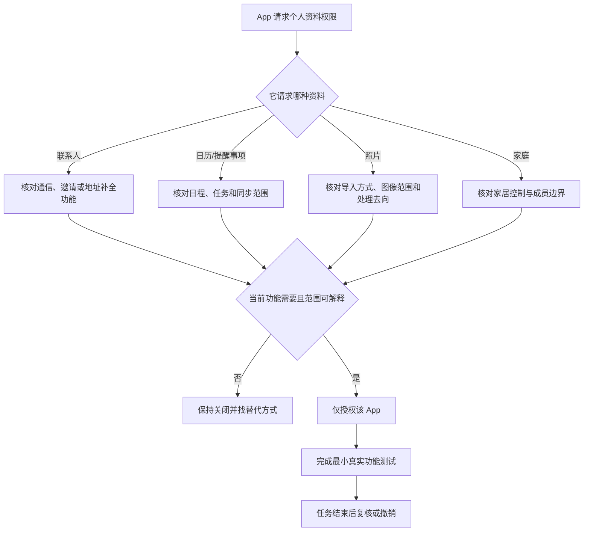

# 管理个人资料访问：联系人、日历、照片、家庭与提醒事项

联系人、日历、照片、家庭和提醒事项看起来都是“应用数据”，但各自包含不同的私人关系和行为线索：联系人能揭示人际关系与身份信息，日历能揭示时间安排，照片可能包含地点、人物和文件内容，家庭信息关联真实世界的设备与自动化，提醒事项则常带有待办、期限和个人计划。Privacy & Security 将它们拆成独立类别，说明授权不应按“这个 App 我常用”一刀切，而应按数据类型和功能需求判断。

> [!warning] 个人资料权限可能读取或写入真实生活信息
>
> 本篇只做阅读与最小权限设计，不开启、关闭或更改截图中任何 App 的权限。不要把联系人、日历标题、照片、家庭设备名称或提醒事项内容复制到公开笔记或支持聊天。改变前确认 App 是否可信、功能是否真的需要、是否会同步到其他设备，以及关闭后如何恢复。

## 五个类别，五种数据关系

路径是 **Apple menu → System Settings → Privacy & Security**，再选择 Contacts、Calendars、Photos、Home 或 Reminders。页面文字通常以 `Allow the applications below to access your …` 或 `Applications that have requested access … will appear here` 开头。前者表示当前已有请求者列表；后者表示目前尚无应用请求，或没有可显示条目。

| 类别 | 英文 | 主要数据 | 常见功能 | 高风险点 |
| --- | --- | --- | --- | --- |
| 联系人 | `Contacts` | 姓名、号码、邮箱、分组和关系。 | 邮件、通讯、邀请和身份匹配。 | 通讯录泄露与批量导入。 |
| 日历 | `Calendars` | 日程、时间、地点、参与者和可用性。 | 会议、提醒、排期和助手。 | 工作安排和个人行程暴露。 |
| 照片 | `Photos` | 图像、视频、元数据和相册。 | 编辑、上传、扫描、创作。 | 人脸、地点、证件和私人媒体。 |
| 家庭 | `Home` | 家居、房间、配件和自动化关系。 | 家居控制和情境自动化。 | 实体地点、设备状态和家庭成员。 |
| 提醒事项 | `Reminders` | 待办、清单、到期时间和任务。 | 任务管理、语音助手和自动化。 | 健康、财务、工作与个人计划。 |

“个人资料”并不等于“没有技术风险”。一个 App 读取联系人后可能自动完成邀请；读取日历后可能生成摘要；读取照片后可能上传或处理图像；读取家庭信息后可能触发设备动作。每一种数据都应有与当前功能相称的理由。

## Contacts：访问联系人不是取得一次性通讯录副本

> 本机截图未包含在公开版本中，以保护原图中的个人信息。

页面的关键句是 `Allow the applications below to access your contacts.` 其中 below 限定当前列表，access 表示可访问联系人资料。开关为 on 表示该 App 获得了这一类别的系统权限，并不证明它正在使用、上传或修改每一条联系人，也不说明任何其他 App 同时被允许。

| 英文表达 | 中文 | 它说明什么 | 不说明什么 |
| --- | --- | --- | --- |
| `access your contacts` | 访问你的联系人。 | App 可以通过受控接口使用通讯录资料。 | App 已经把全部联系人发到网络。 |
| `Allow the applications below …` | 允许下方应用…… | 许可按 App 单独列出。 | 对所有 App 的泛化许可。 |
| switch on/off | 开启/关闭。 | 当前 App 是否被授予这一类别。 | App 的账户登录、通知或网络权限。 |

联系人权限常见于邮件客户端、通信 App、日历邀请、CRM、地址自动补全和分享功能。审查时问“该 App 要用联系人做什么”，而不是只问“它是否可信”。例如邮件 App 需要地址补全可以解释联系人访问；纯离线图像查看工具请求联系人则需要额外解释。

> [!tip] 最小授权也要最小输出
>
> 即使允许了联系人访问，也不要在 App 内随意导出、同步或分享整个通讯录。系统权限只是数据进入 App 的入口；数据如何被保存、处理、同步和共享，还要看 App 的功能设计、隐私政策和你在 App 内做的选择。

## Calendars：完全访问、日程范围与 Options

> 本机截图未包含在公开版本中，以保护原图中的个人信息。

Calendar 页面同样使用 `Allow the applications below to access your calendars.`，但截图还展示 `Full Access` 与 `Options…`。Full Access 是访问范围的明确标签：它不是单纯“能提醒你”，而可能意味着 App 可以读取或处理日程中的更多内容。Options 是查看或配置细项的入口；未阅读 Options 前，不应猜测访问只限一个日历或一个日期范围。

| 表达 | 语境含义 | 需要确认 |
| --- | --- | --- |
| `Calendars` | 日历数据类别。 | 是所有日历、特定日历还是服务端日程。 |
| `Full Access` | 完整访问。 | App 是否真的需要读取、创建或修改日程。 |
| `Options…` | 选项。 | 当前版本是否提供更细的范围或授权说明。 |
| `access your calendars` | 访问日历。 | 是否会影响会议、任务或可用性信息。 |

日历数据常被低估：一个会议标题、地点、参与者和备注可能透露客户、项目、旅行、健康或家庭安排。为会议助手、排程工具或邮件客户端授权前，先确认是否支持只读、仅选定日历或仅在用户明确操作时读取。若系统只给出 Full Access，应用本身是否有更细范围也需要单独检查。

## Photos：Full Access 的语义与图像内容边界

> 本机截图未包含在公开版本中，以保护原图中的个人信息。

Photos 页面中的 `Allow the applications below to access your photos.` 和 `Full Access` 必须一起读。照片不仅是像素，还可能包含地点、时间、人物、屏幕截图、证件、聊天记录和家庭资料。一个 App 列在 Photos 权限页，表示它曾请求使用照片类数据；列表中实际应用名是个人环境数据，不作为教材内容。

| 需要做的判断 | 为什么 | 安全做法 |
| --- | --- | --- |
| 是否真的需要访问系统照片库 | 编辑、上传、扫描或挑选媒体可能需要。 | 功能不依赖照片时保持关闭。 |
| 是否能只选少量照片 | 有些 App 会提供选择器或范围选项。 | 优先使用系统选择器与最小范围。 |
| 是否会上传或做云端处理 | 图片可能含敏感文字、位置和人物。 | 在导入前阅读 App 的处理说明。 |
| 是否有外部存储或项目素材目录替代 | 工作素材不一定需要打开个人图库。 | 将项目文件放到明确目录，避免授权整个图库。 |

`Full Access` 是高价值提示词。它让你停止把“我只选一张图片”与“App 可以访问整个图库”混为一谈。前者是一次用户动作，后者是系统级类别权限。若 App 只需要一张导入图片，优先选择能通过系统文件选择器完成的路径，而不是默认给 Photos 完整访问。

> [!warning] 不把截图中的权限列表当作推荐清单
>
> 本机截图展示的是当时安装软件的状态，不代表这些 App 适合或必须在别的设备获得 Photos 权限。逐个 App 的业务用途、版本、组织规则和项目目录都不同。复制某个列表的开关状态，会将他人的环境假设带进自己的设备。

## Home：空列表仍有清楚的含义

> 本机截图未包含在公开版本中，以保护原图中的个人信息。

Home 页面显示 `Apps that have requested access to Home information will appear here.` 这类空状态是学习软件英语的好例子：will appear here 是将来时，说明满足“App 请求访问”这个条件后，相关 App 才会出现在这里。空页面不需要被“补齐”；它是对当前状态的真实描述。

| 句子部分 | 含义 | 设计意义 |
| --- | --- | --- |
| `Apps` | 应用程序。 | 页面关注请求者。 |
| `that have requested access` | 已经请求访问的。 | 说明出现的前置条件。 |
| `Home information` | 家庭信息。 | 指家居、配件或自动化相关数据。 |
| `will appear here` | 将显示在此处。 | 表示当前为空并非加载失败。 |

家庭信息可能关联门锁、灯光、传感器、房间和自动化情境。即使你当前不使用智能家居，也不应把 Home 权限当作低风险分类。未来有 App 请求时，应先核对它是否真的提供家居功能、访问是否由你主动发起、是否需要共享家庭成员或地理位置相关信息。

## Reminders：空列表不等于未来不会请求

> 本机截图未包含在公开版本中，以保护原图中的个人信息。

`Applications that have requested access to your reminders will appear here.` 与 Home 的句型相同，但对象变成 reminders。提醒事项常包含工作、医疗、财务、购物、个人目标和截止时间；它的内容有时比联系人更能反映即时生活安排。应用没有显示时，不必为了“让页面有内容”而打开测试软件或授予权限。

| 状态 | 能说明什么 | 不能说明什么 |
| --- | --- | --- |
| 空列表 | 当前没有可显示的请求者。 | 系统没有提醒事项或未来永不请求。 |
| 一个 App 出现 | 该 App 请求过提醒事项访问。 | 必须开启或 App 一直读取数据。 |
| 开关为 on | 允许该 App 使用提醒事项类别。 | 该 App 有权访问联系人、日历或文件。 |
| 开关为 off | 拒绝该类别访问。 | App 的所有提醒功能都会失效。 |

当一个 App 提示“为了帮你管理任务而需要提醒事项”时，先确认它能否使用自己的本地任务系统，是否真的要读取现有清单，是否可设置单向导入，以及是否会将提醒事项同步到第三方服务。不要仅因“待办 App 看起来相关”就自动打开。

## 数据最小化：从一次功能到一项权限

联系人、日历、照片、家庭和提醒事项可以遵循同一个最小化流程。核心不是“从不授权”，而是将授权与一个可验证功能绑定，并让授权随任务结束、应用更换或设备共享而复核。

流程里没有“把同类 App 全部打开”这一步。一个照片编辑工具的权限不应自动推及另一个工具；一个临时日程导入任务完成后，也应该检查权限是否仍有保留必要。

## 两个完整操作案例

### 案例一：为可信的会议工具审查日历权限

1. 明确会议工具需要做什么：读取下一场会议、创建日历事件、显示空闲时间，还是导入整个日历。
2. 打开 **Privacy & Security → Calendars**，记录该工具当前是否有 Full Access；不改变其他应用。
3. 阅读该工具的隐私说明和连接日历说明，确认数据是否会同步到其服务端、保留多久、能否断开。
4. 如果确实需要，开启该单个 App 权限并只完成一个测试任务，例如读取一个专门创建的测试日历。
5. 验证结果后检查是否出现异常日历写入；无需长期使用时恢复 off 或在 App 内断开日历连接。
6. 用英语记录：`I granted calendar access only after verifying what the meeting tool needed to read or create.`

### 案例二：用最小范围导入一张项目图片

1. 确认项目图片是否已在明确的工作目录；若在个人图库，先评估是否包含定位、人物或敏感背景。
2. 优先尝试通过文件选择器导入单个文件，而不是先给目标 App Photos 的 Full Access。
3. 若功能只支持系统照片库，打开 Photos 权限页，记录原状态，确认该 App 来源和上传/处理规则。
4. 授权后只导入一张已确认可用的测试图，并验证项目结果。
5. 如果不再需要图库集成，关闭单项权限；不要因一次导入长期保留 Full Access。
6. 用英语说明：`I used the smallest photo access path available and reviewed the permission after importing the test image.`

> [!success] 用真实功能验证，而不是只看开关
>
> 权限打开后，完成一个最小、非敏感的实际任务，确认功能是否真的需要该权限。若功能没有改善，不要接连开更多类别；检查 App 文档、版本、账户和网络条件。可验证的结果比“开关已开启”更可靠。

## 常见错误、风险与恢复方式

| 错误 | 为什么不可靠 | 更可靠的处理 |
| --- | --- | --- |
| 因为常用一个 App 就允许所有资料类别 | 功能需求和数据类别并不等同。 | 按联系人、日历、照片等逐项判断。 |
| 把 Full Access 当作单次文件选择 | 前者是系统授权，后者是用户选择一个项目。 | 优先选择器和最小范围导入。 |
| 看到 Home 或 Reminders 为空就试着授权 | 空状态本身是正常的当前结果。 | 保持空状态，等待真实功能请求。 |
| 给会议工具日历权限却没检查同步 | 日程可能被传到第三方服务或写入其他日历。 | 审查隐私说明、连接范围和写入结果。 |
| 用真实联系人或私人照片测试未知 App | 测试会把真实资料交给不确定流程。 | 使用非敏感测试联系人、测试日历或项目样例。 |
| 关闭权限后功能失效就全量重开 | 无法定位具体依赖。 | 仅恢复对应类别和对应 App，逐项验证。 |

恢复一个误关的功能时，回到同一权限类别，重新打开该 App 的单项开关，并在真实任务中验证。恢复前先确认 App 仍是可信版本、账户仍正确。若怀疑 App 已不当处理个人资料，先撤销该权限、退出应用、保存必要证据，并按该服务官方安全流程或组织支持渠道处理。

## 英语表达规律：access、requested、full 与 below

| 结构 | 原文片段 | 语义重点 |
| --- | --- | --- |
| `access your + 数据` | `access your contacts` | 访问某类个人资料。 |
| `applications below` | `applications below` | 限定为当前展示的申请者。 |
| `have requested access` | `Apps that have requested access` | 已发生请求是显示的前置条件。 |
| `Full Access` | 完整访问。 | 指向更宽的数据访问范围。 |
| `will appear here` | 将显示在此处。 | 描述未来满足条件后的空状态变化。 |
| `only for …` | `only for the verified feature` | 用 only 限制用途和范围。 |

例如，`The app has requested access to my reminders.` 只说明它提出了请求；`The app has full access to my reminders.` 才说明它已获得较宽范围授权。requested 与 has access 不能混用。学习时把时态与状态一起读，才能准确解释页面里为什么出现一个 App 或为什么仍是空列表。

## 自测

1. 联系人、日历、照片、家庭和提醒事项分别可能暴露哪些不同信息？
2. Full Access 与一次通过文件选择器导入图片的区别是什么？
3. Home 和 Reminders 的空状态说明了什么？
4. 为什么日历授权前需要审查 App 是否同步或写入日程？
5. 个人资料权限的最小化流程包含哪几个步骤？
6. 用英语表达：“我只为一个已验证的功能向指定应用授予了个人资料访问，并在测试后复核。”

查看参考答案

1. 联系人涉及关系和身份；日历涉及时间与参与者；照片涉及图像、人物和元数据；家庭涉及设备和地点；提醒事项涉及任务与计划。
2. Full Access 是系统级较宽授权；文件选择器通常是用户为一次操作选择一个或少量具体文件，两者范围不同。
3. 当前没有可显示的 App 请求者，不代表未来永远不会有请求，也不需要为了填充页面进行授权。
4. 日程内容可能涉及工作和私人安排，App 可能读取、写入或同步数据；必须先理解用途和去向。
5. 明确功能、识别数据类型、核对来源与范围、只授权单个 App、完成最小测试、任务后复核或撤销。
6. `I granted personal-data access only to the specified app for one verified feature, then reviewed it after testing.`

## 版本边界与来源

- 本机界面事实来自 macOS 27.0 Beta (26A5425a) 的本地采集，采集日期为 2026-09-09。应用列表、Full Access、Options、空状态和可用细分项会随 App 版本、系统版本、账户和组织策略变化。
- 功能模型参考 Apple 的 [Control what you share on Mac](https://support.apple.com/en-gb/guide/mac-help/mchl2b29231a/mac) 与 [Guard your privacy on Mac](https://support.apple.com/en-au/guide/mac-help/mh35847/mac)。实际个人资料授权还应以应用隐私政策、账户设置和组织数据处理要求为准。
