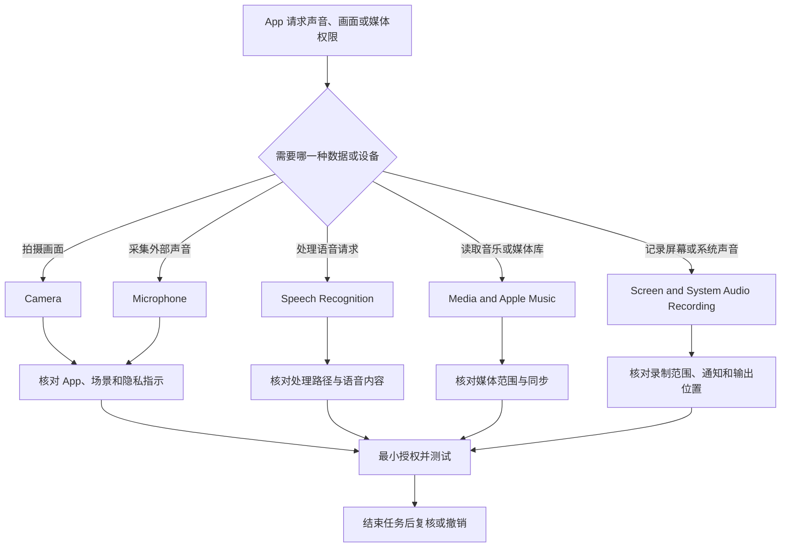

# 分辨采集与处理：摄像头、麦克风、语音识别与媒体权限

“能听到我”并不只对应一个权限。Camera 允许拍摄照片和视频；Microphone 允许捕获或录制外部声音；Speech Recognition 允许把已录制的语音送去处理请求；Media & Apple Music 允许访问媒体库与播放活动；Screen & System Audio Recording 则可以记录屏幕和系统音频，甚至在使用其他应用时发生。它们往往同时出现在会议、录屏、直播、听写和 AI 语音工具里，必须拆开审查。

> [!warning] 采集权限的影响取决于内容、范围与去向
>
> 本篇不改变任何摄像头、麦克风、语音识别、媒体或录屏权限。授权前先确认 App 来源、是否真的要采集、采集发生在何时、数据保存在哪里、是否上传到服务端、是否会录入其他人的声音或屏幕。会议、共享屏幕、客户资料、家庭环境和未发布内容都需要更高谨慎。

## 五种能力不能混为一个“录音权限”

| 类别 | 页面英文 | App 得到的能力 | 不能推出的结论 |
| --- | --- | --- | --- |
| 摄像头 | `Camera` | 拍摄照片或视频。 | 可访问麦克风或屏幕。 |
| 麦克风 | `Microphone` | 捕获或录制外部音频。 | 可以识别、转写或上传语音。 |
| 语音识别 | `Speech Recognition` | 把录音用于处理语音请求。 | App 已获得麦克风。 |
| 媒体库 | `Media & Apple Music` | 访问音乐、视频活动和媒体库。 | 可录制当前系统音频。 |
| 屏幕与系统音频 | `Screen & System Audio Recording` | 录制屏幕内容和/或系统播放的声音。 | 仅会捕获当前 App 的一个窗口。 |

相同 App 可能只请求其中一项，也可能需要多项。视频会议可同时需要 Camera、Microphone 与屏幕录制；听写功能可能需要 Microphone 和 Speech Recognition；媒体播放器需要 Media & Apple Music 却不必使用 Camera。权限清单的价值正是帮助你问出这种区别。

## Camera：使用摄像头是拍摄能力，不是会议身份验证

> 本机截图未包含在公开版本中，以保护原图中的个人信息。

页面核心句是 `Allow the applications below to access your camera.` 其中 access your camera 表示使用 Mac 摄像头拍摄照片或视频。应用列表和开关状态是当前机器数据，正文不记录具体 App。一个 App 获得 Camera 权限后，仍可能在它自己的界面中提供不同的摄像头、虚拟背景、上传或直播选项；系统开关不会替代对这些 App 内选项的审查。

| 看到的状态 | 能说明什么 | 不能说明什么 |
| --- | --- | --- |
| Camera 开关为 on | 该 App 可使用系统摄像头。 | 它现在正在拍摄或一定上传内容。 |
| Camera 开关为 off | 该 App 不可通过该权限使用摄像头。 | App 无法进行任何通话或显示视频。 |
| 绿色隐私指示 | 摄像头正在使用。 | 摄像头录制内容已经保存或共享。 |
| App 未在列表 | 它没有出现在当前请求者列表。 | 永远不会请求或无法通过浏览器使用摄像头。 |

Apple 的说明指出，摄像头在能使用它的 App 打开时会亮起绿色指示灯，关闭或退出所有能用相机的 App 后会关闭。对于浏览器，网站摄像头权限还可能由浏览器自己的 Websites 设置控制。因此“系统 Camera 为 on”与“某个网站可以拍摄”之间仍有浏览器和站点层的授权。

> [!tip] 视频前核对三层开关
>
> 系统 Camera 权限、会议 App 的设备选择，以及浏览器或网站的摄像头授权是不同层。视频无法接通时，按这三层逐一检查；不要为了解决一个网页授权问题，把所有 App 的 Camera 开关全部打开。

## Microphone：音频输入与系统音频不是一回事

> 本机截图未包含在公开版本中，以保护原图中的个人信息。

`Allow the applications below to access your microphone.` 表示允许 App 使用麦克风捕获或录制外部声音。麦克风可来自内建设备、耳机、USB 音频接口或其他输入设备；系统的 Microphone 权限回答的是“App 是否可采集”，Sound 设置中的输入设备回答的是“从哪一个设备采集”。两页的开关不能互相替代。

| 问题 | 应查看的位置 | 为什么 |
| --- | --- | --- |
| 某 App 是否被允许收音 | Privacy & Security → Microphone。 | 决定 App 能否访问麦克风。 |
| 当前选择哪支麦克风 | Sound → Input。 | 决定输入硬件和音量。 |
| 是否正在收音 | Control Center 隐私指示与当前 App。 | 提示当前或近期敏感使用。 |
| 语音是否会被转写 | Speech Recognition 或 App 内的语音功能说明。 | 录音许可不说明处理路径。 |

麦克风权限对会议、录音、听写、音乐创作和语音助手都合理，但高频应用数量很容易积累。审查时先找“此 App 上一次为何需要收音”，而不是因为它是常见生产力工具就默认长期保留。尤其是终端、自动化或远程控制类工具，它们请求麦克风时应有明确功能说明。

`capture or record audio` 中 capture 强调采集输入，record 强调将音频记录下来。一个 App 可以捕获实时声音用于通话，也可以将声音保存成文件或发送到服务。权限文字只保证它能访问麦克风，不能代替对录音保存、传输和保留期限的审查。

> [!warning] 会议和录音必须尊重其他参与者
>
> 即使系统已经授权麦克风，也应在法律、组织规则和会议约定允许的前提下录音。不要因技术上可以采集就默认可以保留、转写或分发他人声音。开始录音前告知参与者，并确认录制范围、存放位置和删除计划。

## Speech Recognition：录音输入与语音处理的额外边界

> 本机截图未包含在公开版本中，以保护原图中的个人信息。

语音识别页明确写着：`Speech recognition sends recorded voice to Apple to process your requests.` 这是一条特别重要的完整句。sends 表示发送；recorded voice 是已录制语音；to Apple 指处理主体；to process your requests 说明用于处理请求。它解释了为什么 Speech Recognition 与 Microphone 是不同权限：麦克风负责拿到声音，语音识别还涉及对声音内容的处理。

| 权限组合 | 可支持的功能 | 仍需确认 |
| --- | --- | --- |
| 仅 Microphone | 通话、录音、实时音频输入。 | 声音是否保存或上传。 |
| Microphone + Speech Recognition | 听写、语音命令、语音转文本。 | 识别服务、语言、网络和数据处理说明。 |
| 仅 Speech Recognition 显示请求 | App 想处理语音相关任务。 | 麦克风来源是否已获许可。 |
| 两者都关闭 | 不允许采集或处理语音。 | 其他非语音功能是否仍能用。 |

在隐私说明中，`to process your requests` 不等于“Apple 可以做任何用途”。它限定为处理请求，但具体服务版本、语言、离线能力、账户和 App 功能仍应以当前页面和官方说明为准。对包含客户内容、健康信息、会议讨论或未发布资料的语音，先确认是否允许交给该识别路径处理。

## Media & Apple Music：媒体库访问不是屏幕录制

> 本机截图未包含在公开版本中，以保护原图中的个人信息。

`Allow the applications below to access Apple Music, your music and video activity, and your media library.` 列出三个对象：Apple Music、music and video activity、media library。这个权限可以让 App 处理你的媒体与活动相关信息，但不是允许它录制正在播放的系统声音。系统音频录制在另一个类别单独控制。

| 表达 | 说明 | 不应混同 |
| --- | --- | --- |
| `Apple Music` | 音乐服务或内容相关访问。 | 本地麦克风输入。 |
| `music and video activity` | 音乐和视频活动。 | 当前系统音频的录制权限。 |
| `media library` | 媒体资料库。 | 全部照片图库或文件系统。 |
| `Add` / `Remove` | 对允许列表做添加或移除。 | 删除媒体文件或取消账户订阅。 |

媒体活动可以反映偏好、收听观看习惯和私人内容。一个音乐播放器或媒体整理工具有合理理由访问媒体库；无媒体功能的 App 请求这一类别时，应该停止并查明用途。必要时优先使用单个文件导入或明确项目目录，减少对整套媒体库的长期访问。

## Screen & System Audio Recording：录屏范围可能跨越其他应用

> 本机截图未包含在公开版本中，以保护原图中的个人信息。

页面的说明是：`Allow the applications below to record the content of your screen and audio, even while using other applications.` even while using other applications 是关键限制提醒：即使你正在使用其他 App，获权 App 仍可能记录屏幕内容和音频。下方还有 `System Audio Recording Only`，说明某些 App 可以仅访问和录制系统音频。

| 权限 | 允许什么 | 关键风险 |
| --- | --- | --- |
| `Screen & System Audio Recording` | 记录屏幕内容和音频。 | 可见内容可能包含密码、消息、客户资料和其他 App。 |
| `System Audio Recording Only` | 仅访问和录制系统音频。 | 会议、媒体和提示音仍可能含敏感信息。 |
| `Add` / `Remove` | 管理列表中应用。 | 移除条目不等于删除录制文件。 |
| switch on/off | 允许或拒绝该 App 录制能力。 | 不说明 App 内录制是否已经停止。 |

录屏权限与屏幕共享、远程桌面、截屏工具和直播工具有关。它应比普通照片权限有更高门槛，因为屏幕里可能同时出现多个 App、系统通知和敏感对话。录制前先关闭无关窗口、检查通知预览、设定录制区域或时间，并在完成后确认 App 停止录制和输出文件的存放位置。

> [!warning] 不要在不确定录制状态时展示敏感内容
>
> 如果你不确定某个工具是否仍在录制屏幕或系统音频，先停止共享、退出录制工具或查看隐私指示和状态栏，再打开密码管理器、私人聊天、财务页面或客户文档。录屏权限一旦错配，暴露范围往往大于单个文件访问权限。

流程图强调“声音”至少有三层：麦克风采集、语音识别处理和系统音频录制。看到一个 App 请求其中一项，不应自动授予另外两项。

## 两个完整操作案例

### 案例一：为一次受控会议配置音视频

1. 确认会议 App、会议链接和参与者来源可信，并决定是否真的需要打开摄像头或麦克风。
2. 在 Privacy & Security 中只检查该会议 App 的 Camera 与 Microphone 状态，记录原值。
3. 在 Sound 中确认输入设备，避免误用不应采集的音频接口。
4. 若需共享屏幕，单独审查 Screen & System Audio Recording，关闭无关窗口和通知预览。
5. 进入测试会议，检查绿色或橙色隐私指示是否符合预期。
6. 会议结束后退出 App，确认指示器消失；不再需要时恢复最小权限状态。
7. 用英语记录：`I enabled only the verified meeting app’s camera and microphone, and I checked the recording scope before sharing my screen.`

### 案例二：审查一项语音转写功能

1. 明确功能目标：本地录音、实时字幕、听写还是将语音转为文本。
2. 分别检查 Microphone 与 Speech Recognition，阅读 Speech Recognition 的处理说明。
3. 使用非敏感测试语句验证转写质量，不用客户、密码、身份或私人会议内容测试。
4. 检查 App 是否保存原始音频、转写文本或上传记录，并阅读其隐私说明。
5. 若只偶尔使用，任务完成后关闭 Speech Recognition 或 Microphone 的单项授权。
6. 用英语说明：`I verified the microphone input and the speech-processing path separately before using voice transcription.`

> [!success] 通过“输入—处理—输出”审查语音功能
>
> 麦克风是输入，Speech Recognition 是处理，转写文本、音频文件或云端请求是输出。三个环节的隐私与保留规则可能不同。逐段确认，比只看到“语音功能正常”更可靠。

## 常见错误、风险与恢复方式

| 错误 | 为什么不准确 | 更可靠的处理 |
| --- | --- | --- |
| 只开 Microphone 就认为语音转写不会上传 | 语音识别可能有独立处理路径。 | 同时审查 Speech Recognition 和 App 隐私说明。 |
| 把 Media & Apple Music 当作系统音频录制 | 它控制媒体库和活动，不等于录制当前声音。 | 检查 Screen & System Audio Recording。 |
| 为视频问题批量打开 Camera、Microphone、Screen Recording | 无法定位真正缺失的权限。 | 按功能阶段一次测试一项。 |
| 认为摄像头绿点说明录音已经停止 | 它只指摄像头状态，麦克风和录屏有各自提示。 | 核对所有相关指示和 App 状态。 |
| 在桌面全屏状态下随意录制 | 可能把其他应用、通知和秘密一起录入。 | 设置录制范围、整理桌面并关闭无关窗口。 |
| 把权限 off 当作已删除历史录音 | 权限只阻止未来访问，旧文件仍可能存在。 | 单独审查输出目录、云端项目和共享链接。 |

若误关导致功能不可用，回到对应类别，只恢复那个 App 的单项权限，再做一次小范围测试。若误开录制或媒体权限，立即退出或停止相关 App，关闭该项权限，检查本地输出与共享位置。对于已分享或可能泄露的录音、截图或视频，遵循服务和组织的事件处理路径，不能靠重新切换开关抹除既有副本。

## 英语表达规律：record、capture、process 与 even while

| 结构 | 原文片段 | 语义重点 |
| --- | --- | --- |
| `access your camera/microphone` | 使用设备采集能力。 | 设备访问的系统授权。 |
| `capture or record audio` | 采集或录制音频。 | 输入与保存是不同阶段。 |
| `sends recorded voice to …` | 将录制语音发送至处理方。 | 表示语音处理路径。 |
| `access … activity and library` | 访问活动和资料库。 | 媒体数据范围。 |
| `record the content of …` | 录制屏幕内容。 | 记录可见内容而非仅一个 App。 |
| `even while using other applications` | 即使在使用其他 App 时。 | 表示录制范围可能跨应用。 |

比较：`The app can use the microphone.` 是麦克风访问；`The app can record system audio.` 是系统播放声音的录制；`The app can process recorded voice.` 是识别或处理阶段。把动词和对象读完整，才能知道该 App 实际要什么能力。

## 自测

1. Camera、Microphone、Speech Recognition、Media & Apple Music 与 Screen Recording 分别控制什么？
2. 为什么 Microphone 权限不能替代 Speech Recognition 权限审查？
3. 为什么 Media & Apple Music 不等于系统音频录制？
4. `even while using other applications` 提示了什么范围风险？
5. 会议录屏前应检查哪些内容？
6. 用英语表达：“我把声音输入、语音处理和系统音频录制分开审查，只为需要的功能授权。”

查看参考答案

1. Camera 采集画面；Microphone 采集外部音频；Speech Recognition 处理录制语音；Media & Apple Music 访问媒体库与活动；Screen Recording 记录屏幕与可能的系统音频。
2. 麦克风允许获得声音，语音识别还可能涉及将录制语音交给处理服务，两者的范围与数据路径不同。
3. 媒体权限涉及资料库和音乐视频活动；系统音频录制涉及当前播放声音，属于不同类别。
4. 获权 App 的录制可能覆盖你正在使用的其他 App，因此需要控制窗口、通知和时间范围。
5. 确认会议来源、会议 App 权限、屏幕录制范围、通知、无关窗口、参与者知情、输出位置和结束后的停止状态。
6. `I reviewed audio input, speech processing, and system-audio recording separately, and granted permission only for the feature that needed it.`

## 版本边界与来源

- 本机界面事实来自 macOS 27.0 Beta (26A5425a) 的本地采集，采集日期为 2026-09-09。App 列表、可用开关、录制指示、语音处理能力和浏览器站点权限会随系统、App、账户、语言和组织策略变化。
- 摄像头和麦克风的系统权限参考 Apple 的 [Control access to the camera on Mac](https://support.apple.com/en-gb/guide/mac-help/mchlf6d108da/mac) 与 [Control access to the microphone on Mac](https://support.apple.com/en-mide/guide/mac-help/mchla1b1e1fe/26/mac/26)。
- Screen & System Audio Recording 与 Speech Recognition 的实际处理范围应以当前 macOS 页面、App 隐私说明、服务条款和组织的录制政策为准。
