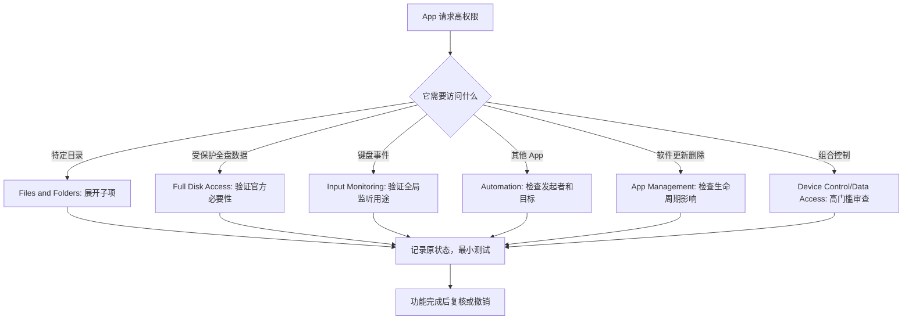

# 管理高权限访问：文件夹、完整磁盘、输入监控与自动化

Files & Folders、Full Disk Access、Input Monitoring、Automation、Remote Desktop、App Management、Device Control and Data Access 与 Developer Tools 都会影响 App 接触数据或代替用户做事的范围。它们不是普通“允许访问文件”的同义词：一个 App 能访问选定文件夹，并不等于能读全盘；能监控输入不等于能控制其他 App；能自动化另一个 App 不等于能远程查看屏幕；允许开发工具运行不符合默认政策的软件也不是对所有软件关闭安全检查。

> [!warning] 高权限必须有更高的授权证据
>
> 本篇不改变任何高权限开关，不添加应用，不打开远程控制，也不让开发工具绕过系统安全策略。高权限可触及邮件、信息、浏览器资料、备份、键盘输入、屏幕、其他 App 或系统安全边界。只在来源可信、用途明确、范围最小、恢复可行且组织政策允许时，为一个指定 App 开启一项权限。

## 权限范围从窄到宽：读取、观察、控制与执行

| 权限类别 | 页面英文 | 主要能力 | 典型影响层级 |
| --- | --- | --- | --- |
| 目录访问 | `Files & Folders` | 访问特定文件、文件夹和其他 App 数据。 | 某些目录或用户选择项目。 |
| 全盘访问 | `Full Disk Access` | 访问包括 Mail、Messages、Safari、Home、Time Machine backups 等数据。 | 所有用户的广泛数据范围。 |
| 输入观察 | `Input Monitoring` | 监控键盘输入，可能在使用其他 App 时发生。 | 用户操作和敏感文本。 |
| 自动化 | `Automation` | 控制其他应用、访问其文档数据并执行动作。 | 指定目标 App 和操作。 |
| 远程桌面 | `Remote Desktop` | 访问屏幕内容与音频。 | 可见工作空间与会话。 |
| 应用管理 | `App Management` | 更新或删除其他应用。 | 软件生命周期。 |
| 设备控制与数据访问 | `Device Control and Data Access` | 汇聚多种强控制与数据访问能力。 | 高风险组合能力。 |
| 开发工具 | `Developer Tools` | 运行不符合系统安全政策的本地软件。 | 执行信任边界。 |

越往下，权限越可能跨越单一文件或单一界面。审查时不要只看开关“on/off”，而要回答四个问题：它能读取什么；它能观察什么；它能控制什么；它能执行或修改什么。

## Files & Folders：分项目录访问不是完整磁盘访问

> 本机截图未包含在公开版本中，以保护原图中的个人信息。

页面说明：`Apps that appear here have requested access to files, folders, and other app data. You can manage access at any time.` appear here 表示列表成员是曾经请求过的 App；files, folders, and other app data 列出访问对象；manage access at any time 表示之后可以复核。行项目可以展开，是因为同一个 App 可能请求不同类型或位置的访问。

| 表达 | 中文 | 需要注意 |
| --- | --- | --- |
| `requested access` | 已请求访问。 | 请求不等于已经全部获得授权。 |
| `files, folders, and other app data` | 文件、文件夹和其他 App 数据。 | 范围可能比一个文件选择器更广。 |
| disclosure triangle | 展开三角。 | 用来查看该 App 请求的细分范围。 |
| `manage access at any time` | 可随时管理访问。 | 变更应记录原值并在功能中验证。 |
| on/off 子项 | 某个目录或数据域的许可状态。 | 同一 App 的其他子项未必随之变化。 |

这是“按范围查看”的最佳例子。不要因为看到一个 App 在列表中就认为它有完整磁盘访问；先展开，识别它访问的是 Desktop、Documents、Downloads、可移动卷、网络卷、自动化数据还是另一个 App 的资料。若真正需求只是导入一个文件，优先使用系统文件选择器，而不是让 App 长期保留某个目录权限。

> [!tip] 先展开再判断
>
> Files & Folders 中的一行 App 是摘要，不是最终权限结论。先展开再读具体子项，才能知道它要访问哪个位置。仅凭 App 名称或总行数做清理，容易误关项目目录、同步目录或外设卷的必要权限。

## Full Disk Access：广泛数据访问需要单独审查

> 本机截图未包含在公开版本中，以保护原图中的个人信息。

Full Disk Access 的说明非常具体：`Allow the applications below to access data like Mail, Messages, Safari, Home, Time Machine backups, and certain administrative settings for all users on this Mac.` 其中 like 表示举例而非穷尽；for all users on this Mac 表示范围跨越当前用户。它不是“文件管理器需要读 Documents”的普通授权，而是接触多类受保护数据和部分管理设置的能力。

| 句子部分 | 意义 | 为什么风险高 |
| --- | --- | --- |
| `access data like …` | 访问包括若干受保护来源在内的数据。 | 可能涉及通信、浏览、家居和备份信息。 |
| `Time Machine backups` | 时间机器备份。 | 备份可能含多个时间点和敏感历史内容。 |
| `administrative settings` | 管理设置。 | 可能影响系统行为和其他用户。 |
| `for all users on this Mac` | 面向这台 Mac 的所有用户。 | 影响范围不是单一账户。 |
| `Add` / `Remove` | 添加或移除列表项。 | 不能用来随意把未知命令加入白名单。 |

Full Disk Access 适合少数必须跨越受保护位置工作的受信任工具，例如某些备份、迁移、系统维护或专业开发工具。但“工具很强”不是许可理由。每次授权前应检查签名、官方下载来源、当前版本、为什么不能用更窄目录权限，以及关闭后会丢失哪项明确功能。

> [!warning] 不要把全盘访问用于排除“权限不够”的一般错误
>
> 一个 App 读不到文件，可能是路径、沙盒、用户选择、网络卷、项目配置或应用 Bug；直接授予 Full Disk Access 会扩大暴露面而未必解决根因。先确认具体失败位置，再尝试 Files & Folders 或受支持的文件选择流程。只有官方文档明确需要时，才考虑全盘访问。

## Input Monitoring：观察键盘输入不等于使用输入法

> 本机截图未包含在公开版本中，以保护原图中的个人信息。

页面文字为 `Allow the applications below to monitor input from your keyboard even while using other applications.` monitor input 是“监控输入”，even while using other applications 说明这种能力可能跨越前台 App。它不同于 Keyboard 输入法设置：输入法帮助你输入文字；Input Monitoring 可以让获权 App 观察键盘事件或快捷键。

| 合理用途示例 | 额外审查点 |
| --- | --- |
| 键盘映射或辅助输入工具 | 是否只处理所需快捷键，是否有可信供应方。 |
| 快捷键管理或窗口控制工具 | 是否需要全局监听，是否能限定范围。 |
| 录屏、直播或诊断工具 | 是否记录按键、输入内容或仅检测快捷键。 |
| 开发和测试工具 | 是否仅在受控调试时启用，是否会读取生产输入。 |

任何能监控键盘输入的 App 都应具有清晰的来源和用途。如果用途只是“点击按钮”“读取文件”或“播放媒体”，却请求 Input Monitoring，就应停止并查官方说明。更不能用真实密码、恢复码或客户信息测试未知的键盘工具。

## Automation 与 App Management：控制目标 App 和更新删除是两条不同能力

> 本机截图未包含在公开版本中，以保护原图中的个人信息。

Automation 页写道：`Allow the applications below to control other applications. This will provide access to documents and data in those applications, and to perform actions with them.` control other applications 是控制目标 App；access to documents and data in those applications 提醒控制者可能接触目标 App 中的内容；perform actions with them 是执行操作。因此 Automation 需要同时检查“发起者是谁”和“它控制哪些目标 App”。

| 权限 | 它主要允许 | 不要误解为 |
| --- | --- | --- |
| `Automation` | 对指定其他 App 发送自动化操作。 | 仅在本 App 内自动化。 |
| `App Management` | 更新或删除其他 App。 | 仅查看软件版本。 |
| `Device Control and Data Access` | 可能涵盖邮件、联系人、照片、输入、网站、屏幕与 App 控制等。 | 单一低风险权限。 |
| `Remote Desktop` | 访问屏幕内容和音频的远程桌面请求。 | 只访问普通文件。 |

Automation 的关键是目标关系。一款脚本工具控制本地编辑器，和一款陌生 App 控制邮件、浏览器、密码管理器或终端，风险完全不同。先展开具体目标、阅读 App 的动作说明，再按功能必要性逐项允许。App Management 的 update or delete other applications 也应严格限定，因为它可能改变应用版本或删除工具本体。

## Device Control and Data Access 与 Developer Tools：组合能力与执行信任

> 本机截图未包含在公开版本中，以保护原图中的个人信息。

Device Control and Data Access 的说明列出一系列能力：view and send email、edit contacts and photos、monitor your keyboard、track websites、record your screen、control any app on your Mac 等。这不是普通分类名，而是高风险组合权限的直接提示。获得它的 App 可能跨越多个数据域和控制域，因此授权门槛应接近“是否信任它代表我操作这台 Mac”。

Developer Tools 的说明是 `Allow the applications below to run software locally that does not meet the system’s security policy.` 它限定为 locally，但“不符合系统安全政策的软件”仍是强信任边界。开发、调试、虚拟化或特定工具链有时需要这类能力；不明脚本、破解工具、未知安装包不应以“本地运行”为由获得豁免。

> [!warning] 高风险组合权限要求可追溯的来源和用途
>
> 对 Device Control and Data Access、Developer Tools、Remote Desktop 这类权限，至少确认官方下载路径、开发者身份、版本、业务用途、目标 App 或设备、组织许可和撤销方式。无法说清“它为什么需要这么多能力”时，保持关闭比猜测更安全。

流程图中最重要的是“目标”。能访问文件并不自动代表能控制 App；能监控输入也不自动代表可以删除应用。将请求分到具体类别，有助于抵制“一次把所有权限开完”的冲动。

## 两个完整操作案例

### 案例一：为受信任的项目工具核对目录访问

1. 明确项目工具只需访问哪个工作目录，而不是笼统地说“需要文件权限”。
2. 打开 **Privacy & Security → Files & Folders**，找到该工具，展开行项目查看请求的细分目录或数据域。
3. 若系统文件选择器能满足导入导出，优先使用选择器；不要授予不相关目录。
4. 记录原状态，在一个非敏感测试项目中允许最小必要子项并验证读写。
5. 工具不再使用或项目结束后回到同一行收回权限；确认项目文件仍在预期位置。
6. 用英语记录：`I reviewed the requested folders and granted access only to the project directory needed for the verified task.`

### 案例二：审查一项自动化控制请求

1. 写下自动化发起者、目标 App、预期动作和需要访问的文档范围。
2. 在 Automation 中展开或检查该发起者的目标关系，确认不是在控制无关的浏览器、邮件、终端或密码工具。
3. 使用一个无敏感内容的测试文档运行一次单一动作，例如创建草稿或执行已知菜单命令。
4. 观察动作结果，确认没有意外改动、发送或删除；必要时立刻退出工具并恢复权限。
5. 若自动化已不需要，关闭此项；若长期保留，记录目标 App 与复核日期。
6. 用英语说明：`I verified both the automation tool and the target application before allowing a single controlled action.`

> [!success] 高权限测试要可观察、可回滚
>
> 测试应只触发一个你能看见和撤销的结果：在测试文件中写入一行、打开一个窗口、创建草稿而不发送。不要用正式客户资料、真实邮件、生产数据库或密码管理器验证高权限工具。

## 常见错误、风险与恢复方式

| 错误 | 为什么不可靠 | 更好的处理 |
| --- | --- | --- |
| 给 Full Disk Access 来解决普通文件打不开 | 根因可能不在磁盘权限。 | 先检查目录权限、选择器和应用设置。 |
| 不展开 Files & Folders 就批量关闭 | 不知道关掉哪个目录或 App 数据域。 | 展开、记录、单项测试。 |
| 把 Input Monitoring 当作输入法权限 | 可能观察全局键盘事件。 | 只给可信键盘工具或明确快捷键功能。 |
| 自动化没看目标 App 就允许 | 工具可能读取或操作不相关应用的数据。 | 审查发起者、目标与动作三元关系。 |
| App Management 当作普通更新提示 | 它可更新或删除其他应用。 | 只授权经过确认的软件管理工具。 |
| 开发环境需要运行脚本就放宽全部安全策略 | 将未知软件也纳入执行信任。 | 为已验证开发工具设最小范围，保留系统保护。 |

恢复时，优先在同一权限页关闭刚刚改动的一项，并退出相关 App 后再次打开验证。若一个高权限 App 已经执行了不明动作，保留日志、时间和可见结果，检查受影响文件与账户活动；不要继续用该 App “自我修复”。涉及企业设备、远程管理、数据泄露或未知软件时，应改用组织安全响应或官方支持流程。

## 英语表达规律：monitor、control、provide access 与 for all users

| 结构 | 原文片段 | 语义重点 |
| --- | --- | --- |
| `requested access to …` | 请求特定文件或数据域。 | 请求是进入列表的条件。 |
| `access data like …` | 访问包括所列数据在内的范围。 | like 是举例，不代表范围很窄。 |
| `for all users on this Mac` | 面向所有用户。 | 权限可能跨账户。 |
| `monitor input … even while …` | 监控输入，即使在其他 App 中。 | 指跨应用的输入观察。 |
| `control other applications` | 控制其他应用。 | 需要看目标 App 与动作。 |
| `run software locally that does not meet …` | 运行不符合安全政策的本地软件。 | 本地不等于无风险。 |

`This will provide access to documents and data in those applications` 中 those applications 指的是 Automation 的目标 App，而不是当前自动化工具自己的文件。代词指向决定实际范围，读权限说明时要不断问“this、those、all 指的是谁”。

## 自测

1. Files & Folders 与 Full Disk Access 的范围和审查方法有什么不同？
2. 为什么 Input Monitoring 不应被理解为普通输入法选择？
3. Automation 授权前必须核对哪三个对象？
4. Device Control and Data Access 为什么比单一照片权限的门槛更高？
5. Developer Tools 的 locally 为什么不等于无风险？
6. 用英语表达：“我只为可验证的任务授予最小高权限，并在完成后恢复原状态。”

查看参考答案

1. Files & Folders 关注特定目录或 App 数据子项；Full Disk Access 覆盖更广的受保护数据和所有用户范围，必须有更强官方必要性。
2. 它可监控键盘输入，可能跨应用发生；输入法仅负责用户如何输入字符。
3. 自动化发起者、被控制的目标 App、预期执行动作。
4. 它可能组合读取邮件、编辑联系人照片、监控键盘、录屏、跟踪网站和控制 App 等多种能力。
5. 本地执行仍可能运行不符合系统政策的软件，来源和代码依然需要验证。
6. `I granted the minimum high-privilege access only for a verifiable task and restored the original state when it was complete.`

## 版本边界与来源

- 本机界面事实来自 macOS 27.0 Beta (26A5425a) 的本地采集，采集日期为 2026-09-09。App 列表、子项范围、控制目标、远程访问和开发工具选项会随软件、账户、组织策略和系统版本变化。
- 权限框架参考 Apple 的 [Change Privacy & Security settings on Mac](https://support.apple.com/en-gb/guide/mac-help/mchl211c911f/mac) 与 [Control what you share on Mac](https://support.apple.com/en-gb/guide/mac-help/mchl2b29231a/mac)。高权限授权还应遵守当前应用官方文档、组织安全政策和设备管理要求。
