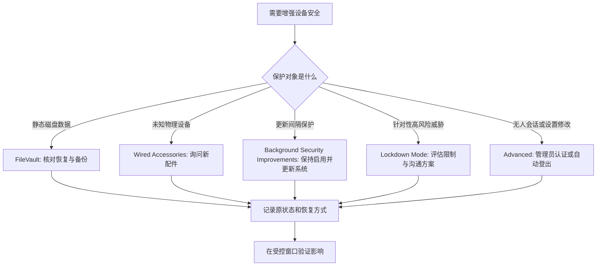

# 保护设备与数据：FileVault、外接配件、后台安全与锁定模式

FileVault、Wired Accessories、Background Security Improvements、Lockdown Mode 和 Advanced 不是彼此独立的“安全功能列表”。FileVault 处理磁盘内容在静止状态下的加密保护；外接配件设置处理物理连接时的批准；后台安全改进在软件更新之间补充保护；Lockdown Mode 为高风险数字威胁场景施加额外限制；Advanced 则影响系统范围设置的管理员密码和闲置自动退出。它们共同建立“数据、设备、系统和使用会话”四道边界。

> [!warning] 系统级安全策略会影响整台 Mac
>
> 本篇只讲说明与只读核对，不启用或关闭 FileVault、改动外接配件策略、切换 Background Security Improvements、开启 Lockdown Mode，或更改 Advanced 中的管理员密码和自动登出规则。每一项都可能影响启动、设备连接、应用兼容性、管理流程和工作连续性。高影响动作应在备份、账户恢复、组织政策和停机窗口均已确认后再执行。

## 四个保护面：静态数据、物理端口、更新间隔和高风险会话

| 保护面 | 页面功能 | 它解决什么问题 | 不应理解为 |
| --- | --- | --- | --- |
| 静态数据 | `FileVault` | 通过加密保护磁盘内容。 | 任意文件分享或网络攻击防护。 |
| 物理连接 | `Wired Accessories` | 决定新有线配件何时可连接。 | 所有 USB/Thunderbolt 设备永远不可用。 |
| 持续安全 | `Background Security Improvements` | 在软件更新之间提供额外保护。 | 完整替代 macOS 更新。 |
| 高风险防护 | `Lockdown Mode` | 通过限制应用和功能降低数字威胁暴露。 | 普通性能优化或普遍推荐开关。 |
| 会话保护 | `Advanced` | 管理系统范围设置认证和闲置自动登出。 | 只影响当前应用窗口。 |

这些设置的共同特点是影响范围大。普通 App 的照片权限可以在一个工具和一个任务之间调整；FileVault 和 Lockdown Mode 影响更广的系统行为，因此必须有更强的理由、备份与恢复证据。

## FileVault：加密磁盘内容与解锁屏幕的关系

> 本机截图未包含在公开版本中，以保护原图中的个人信息。

页面说明为：`FileVault secures your data by encrypting the contents of your Mac and locking your screen with a password.` by encrypting 表示通过加密实现保护；contents of your Mac 指磁盘内容；locking your screen with a password 说明与解锁认证相关。FileVault 不是备份工具，也不是单个文件密码；它保护的是数据在设备静止、丢失或未经授权访问时的磁盘层边界。

| 表达 | 中文理解 | 需要确认 |
| --- | --- | --- |
| `secures your data` | 保护你的数据。 | 保护的是何种风险面，不是所有攻击。 |
| `encrypting the contents of your Mac` | 加密 Mac 中的内容。 | 恢复方法、可解锁用户和组织策略。 |
| `locking your screen with a password` | 用密码锁定屏幕。 | 本地账户密码、屏幕锁定和磁盘解锁关系。 |
| recovery information | 恢复信息。 | 应单独安全保存，不能写进笔记或聊天。 |

启用 FileVault 前，最重要的不是按钮本身，而是“如果忘记密码、设备账户改变、磁盘出现问题，谁能恢复”。个人设备需要确认 Apple Account 或恢复密钥的可用路径；受管设备还需要确认组织是否管理恢复密钥。任何恢复密钥都应视为高度敏感秘密，不应截屏、复制到普通文档或发送给所谓支持人员。

> [!warning] 加密前先验证恢复，不是在故障后才寻找密钥
>
> 启用、迁移或重置 FileVault 前，确认至少一个经验证的解锁/恢复路径，并确认重要资料已有独立备份。不要依赖“我应该记得密码”作为唯一恢复计划。若设备由学校或公司管理，先确认恢复密钥和账户策略的负责人。

## Wired Accessories：Ask for new accessories 是物理信任策略

> 本机截图未包含在公开版本中，以保护原图中的个人信息。

`Allow accessories to connect` 是操作标题，当前策略可能显示 `Ask for new accessories`。Ask for new accessories 的意思是“对新的配件询问”，不是“阻止所有配件”，也不是“已信任的配件永远不会再受影响”。它把物理连接纳入一个需要用户明确批准的信任边界。

| 选择理念 | 适合的情境 | 风险权衡 |
| --- | --- | --- |
| 对新配件询问 | 经常接触未知扩展坞、线缆、存储或演示设备。 | 增加一次确认，减少物理接入意外。 |
| 更宽松的连接策略 | 固定、受控且明确可信的桌面设备环境。 | 便利提升，但未知设备接入门槛降低。 |
| 更严格的策略 | 高风险旅行、公共空间或敏感资料场景。 | 某些工作流和外设连接会更受限。 |

“wired” 不意味着安全。USB、Thunderbolt 等物理连接可承载数据、网络、显示、存储、供电或设备控制。看到陌生接口、公共充电站或不明线缆时，先用自己可信的电源和配件；系统询问是让你重新确认“这个物理对象是否应被信任”的机会。

> [!tip] 物理连接也要遵守最小信任
>
> 只连接任务所需的设备，避免在锁屏、无人看管或公共环境中接受未知配件。需要使用新扩展坞、移动硬盘或调试设备时，先确认来源、用途和所携数据，再在解锁状态下进行明确批准。

## Background Security Improvements：更新之间的补充，不替代版本维护

> 本机截图未包含在公开版本中，以保护原图中的个人信息。

说明文字指出：`Background Security Improvements provides additional protection to your Mac in between software updates.` in between software updates 是时间关系，表示“在两次软件更新之间”；additional protection 是附加保护。第二段还提醒，极少数兼容性问题时，这些改进可能暂时被移除，随后在未来软件更新中增强。

| 表达 | 含义 | 正确理解 |
| --- | --- | --- |
| `additional protection` | 额外保护。 | 对更新节奏的补充，不是取代更新。 |
| `in between software updates` | 在软件更新之间。 | 提供较及时的安全改进窗口。 |
| `compatibility issues` | 兼容性问题。 | 功能与软件环境可能出现冲突。 |
| `temporarily removed` | 暂时移除。 | 不是永久失效，也不保证无需处理。 |
| `enhanced in a future software update` | 在未来更新中增强。 | 需要继续关注后续系统更新。 |

这一页的价值在于让你理解“系统安全不是只有大版本更新”。但开启背景改进也不是允许无限期不安装正式更新。安全修复、稳定性改进、硬件兼容与系统功能仍需要在合适窗口完成软件更新与重启验证。

## Lockdown Mode：面向特定威胁模型的强化限制

> 本机截图未包含在公开版本中，以保护原图中的个人信息。

Lockdown Mode 说明：`offers the strongest protection for your Mac and data by reducing your exposure to current and future digital threats.` 它同时说 `This is intended for anyone in high-risk situations`，并举出记者、活动人士、领导者、公共人物和遭受虐待的幸存者等例子。关键词不是“每个人都应开启”，而是 high-risk situations：当面临更有针对性的数字威胁时，才需要考虑这种会牺牲部分功能的强化策略。

| 词组 | 中文 | 使用边界 |
| --- | --- | --- |
| `strongest protection` | 最强保护。 | 指特定模式下的强化限制，不是万能安全承诺。 |
| `reducing your exposure` | 降低你的暴露。 | 减少攻击面，不消除所有风险。 |
| `current and future digital threats` | 当前和未来数字威胁。 | 表示威胁模型，不是具体事件诊断。 |
| `high-risk situations` | 高风险情境。 | 需要根据个人、工作和威胁评估决定。 |
| `Turn On…` | 开启。 | 将进入确认和可能重启流程，不适合随意试用。 |

Lockdown Mode 可能限制网站、附件、服务或设备交互。它不应取代强密码、软件更新、备份、最小权限和谨慎的下载行为。若你确实有高风险需求，应同时检查所有相关设备和账户，并使用可信安全支持渠道建立整体方案；不要只打开这一项就认为问题已解决。

> [!warning] 高风险模式需要威胁模型和恢复计划
>
> 开启 Lockdown Mode 前，先明确你面对的风险、可能受限的关键服务、同事或家人如何联系你、哪些网站或 App 需要例外，以及如何在紧急情况下恢复工作。不要在关键演示、旅行前最后一刻或没有备用沟通方式时试验。

## Advanced：管理员认证与闲置会话是不同问题

Privacy & Security 的 Advanced sheet 有两个可见设置：`Require an administrator password to access system-wide settings` 与 `Log out automatically after inactivity`。前者保护系统范围设置的修改入口；后者在一定闲置时间后结束当前会话。二者都与“离开电脑时保护数据”有关，但一个控制设置变更认证，一个控制登录会话生命周期。

| 设置 | 解决什么 | 可能影响 |
| --- | --- | --- |
| `Require an administrator password …` | 防止未经授权进入系统范围设置。 | 管理者操作需要更多认证步骤。 |
| `Log out automatically after inactivity` | 长时间无人操作后退出会话。 | 未保存工作、远程任务和下载可能被中断。 |
| `Done` | 保存 Advanced sheet 的变更。 | 不等于已验证所有工作流兼容。 |

自动退出不像锁屏：logout 会结束用户会话并可能关闭应用，因此不适合有长时间构建、上传、下载、远程连接或演示设备的无计划设置。需要保护离开时的设备时，先比较锁屏密码、屏幕保护、短时间锁定和自动退出的差异，选择最小会打断工作又能满足保护的方案。

这个流程避免将所有安全需求压到同一个开关上。丢失设备的磁盘风险看 FileVault；陌生线缆看配件策略；更新间隔看背景安全改进；定向攻击威胁才评估 Lockdown Mode；离开屏幕看锁屏和会话策略。

## 两个完整操作案例

### 案例一：为 FileVault 变更做不执行的恢复准备

1. 确认设备是否为个人设备或受管设备，记录谁负责账户与恢复流程。
2. 检查重要文件有独立、可访问的备份；不要只看到 Time Machine 开关就默认可恢复。
3. 阅读 FileVault 的加密说明，列出可解锁用户、恢复密钥/账户方案和遗失设备后的处理方式。
4. 验证管理员账号和密码可以在私密环境中正常使用；不在讲义或聊天中写下密码、恢复密钥或账户细节。
5. 确认磁盘空间、电源、系统状态和维护窗口；受管设备先取得管理员说明。
6. 只有全部条件满足时才进入实际启用步骤；启用后按官方流程核对加密状态与恢复能力。
7. 用英语记录：`Before changing FileVault, I verified the backup, authorized users, and recovery path without recording any secret.`

### 案例二：为公共演示环境检查物理连接与会话策略

1. 明确场景：可能出现未知显示器、扩展坞、移动存储或充电线的公共演示环境。
2. 在 Wired Accessories 中读取当前策略，确认是否会对新配件请求批准；不因演示方便改为宽松策略。
3. 检查 Lock Screen 和 Advanced 中的自动退出策略是否会中断演示、上传或远程连接。
4. 准备自己可信的电源、线缆和转接器；不接受来路不明的存储和数据线。
5. 演示结束后锁屏、拔除临时配件、检查共享与远程服务状态，恢复记录的工作策略。
6. 用英语说明：`I kept the new-accessory approval boundary in place and checked the session timeout before using shared equipment.`

> [!success] 用“场景—边界—恢复”设计安全设置
>
> 安全设置不是越严格越好，而是要与场景匹配：居家固定设备、旅行、公共演示、受管办公和高风险任务的边界不同。每次变更前说清场景、预期保护和恢复方式，能避免把一个问题的解决办法扩展成全局干扰。

## 常见错误、风险与恢复方式

| 错误 | 为什么不可靠 | 更可靠的处理 |
| --- | --- | --- |
| 把 FileVault 当作备份 | 加密保护机密性，不提供第二份数据副本。 | 保持独立、可验证备份。 |
| 未核对恢复路径就启用加密 | 忘记账户或恢复信息时可能难以访问数据。 | 先验证用户、恢复方案和组织支持。 |
| 为方便长期允许所有新配件 | 扩大未知物理设备接入。 | 对新配件保持询问并使用可信线缆。 |
| 因有背景安全改进就跳过系统更新 | 补充保护不等于完整版本维护。 | 在合适窗口继续安装安全更新。 |
| 将 Lockdown Mode 用作普通隐私开关 | 会引入显著功能限制且针对特定威胁。 | 先进行风险评估和测试计划。 |
| 开启自动登出却未考虑长任务 | 可能中断工作、上传、构建和远程会话。 | 比较锁屏与自动退出，先在可控环境测试。 |

恢复时，应先回到刚才修改的同一页面并恢复记录的设置；对 FileVault、受管策略或 Lockdown Mode 这种系统级状态，按官方向导和管理员流程完成恢复，不要用第三方“解锁工具”。如果设备丢失、怀疑被篡改或遇到无法解锁的情况，停止反复试错，使用官方账户恢复、组织安全响应和设备支持路径。

## 英语表达规律：by、in between、intended for 与 after

| 结构 | 原文片段 | 语义重点 |
| --- | --- | --- |
| `by + -ing` | `by encrypting the contents …` | 通过某方法实现保护。 |
| `in between …` | `in between software updates` | 在两次事件之间的时间段。 |
| `intended for …` | `intended for anyone in high-risk situations` | 说明设计对象和适用情境。 |
| `after inactivity` | `Log out automatically after inactivity` | 在闲置条件满足后触发。 |
| `ask for new …` | `Ask for new accessories` | 对新的对象要求确认。 |
| `reduce exposure to …` | `reducing your exposure to … threats` | 降低暴露面，不承诺绝对消除。 |

例如，`FileVault protects data by encrypting it.` 说明实现方式；`Lockdown Mode reduces exposure in high-risk situations.` 说明适用场景；`Background Security Improvements provide protection in between software updates.` 说明时间位置。学会读这些介词和分词结构，能避免把安全文案扩大成不现实的保证。

## 自测

1. FileVault 与备份分别解决什么问题？
2. Ask for new accessories 表达的是哪种物理信任策略？
3. Background Security Improvements 为什么不能替代正常软件更新？
4. Lockdown Mode 适合什么样的威胁模型，为什么不应随意开启？
5. Require an administrator password 与自动退出分别保护什么？
6. 用英语表达：“我在改变系统级安全设置前验证了恢复路径、工作影响和设备管理要求。”

查看参考答案

1. FileVault 加密静态磁盘数据；备份保存独立恢复副本，二者不能互相替代。
2. 对每个新的有线配件连接请求明确批准，而不是自动信任所有设备。
3. 它在软件更新之间提供附加保护，但正式更新仍包含更完整的安全、稳定性和兼容性改进。
4. 面向可能遭受定向数字攻击的高风险情境，可能显著限制功能，需要评估业务和沟通影响。
5. 前者保护系统范围设置的修改入口，后者在闲置后结束登录会话并可能中断应用。
6. `Before changing a system-wide security setting, I verified the recovery path, work impact, and device-management requirements.`

## 版本边界与来源

- 本机界面事实来自 macOS 27.0 Beta (26A5425a) 的本地采集，采集日期为 2026-09-09。FileVault、配件策略、背景安全改进、Lockdown Mode 和 Advanced 可见选项会受硬件、账户、管理 profile 与系统版本影响。
- 功能解释参考 Apple 的 [Change Privacy & Security settings on Mac](https://support.apple.com/en-gb/guide/mac-help/mchl211c911f/mac)、[About Lockdown Mode](https://support.apple.com/en-us/105120) 与 [Change Privacy & Security Advanced settings on Mac](https://support.apple.com/en-gb/guide/mac-help/mh40595/mac)。实际加密、重置或高风险防护决策还应遵循当前官方说明和组织安全流程。
