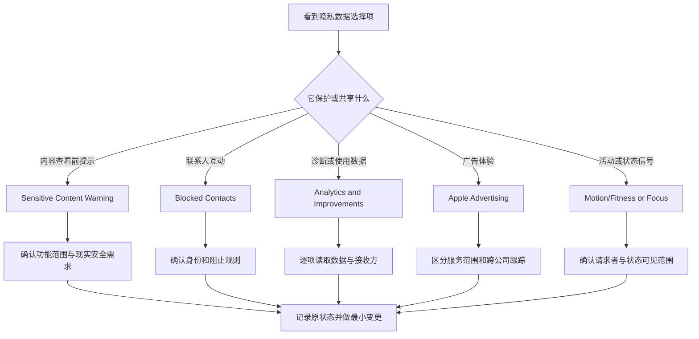

# 管理内容与数据选择：敏感内容警告、分析改进、广告与联系人限制

Privacy & Security 的底部项目不像摄像头或文件夹权限那样围绕单个 App 的数据访问。Sensitive Content Warning 提供内容查看前的安全提示；Blocked Contacts 管理不希望联系到的人；Analytics & Improvements 决定哪些诊断、使用、音频或转写数据参与改进；Apple Advertising 解释广告投放信息；Motion & Fitness 与 Focus 则控制活动数据与专注状态的请求者。这些项目共同回答一个问题：系统和应用在何种程度上使用、显示、限制或共享与你有关的内容和行为信号。

> [!warning] 隐私选项不能替代现实安全与数据治理
>
> 本篇只讲解和只读审查，不开启内容检测、不添加或移除被阻止联系人、不改动分析或广告选项，也不更改 Motion & Fitness 或 Focus 状态共享。敏感内容提示无法代替现实世界的安全支持；阻止联系人无法解决紧急威胁；关闭分析不等于删除历史数据；广告设置不替代浏览器和账户隐私控制。需要时应使用可信的人身安全、组织安全或服务支持流程。

## 六类选择分别控制什么

| 类别 | 页面英文 | 它控制什么 | 不应理解为 |
| --- | --- | --- | --- |
| 内容预警 | `Sensitive Content Warning` | 观看前检测敏感照片和视频并提供提示。 | 自动删除所有敏感内容。 |
| 联系限制 | `Blocked Contacts` | 管理被阻止的联系人。 | 消除所有渠道的现实接触或紧急风险。 |
| 诊断数据 | `Analytics & Improvements` | 是否分享诊断、使用、音频/转写或 iCloud 分析。 | 普通 App 的所有数据权限。 |
| 广告信息 | `Apple Advertising` | 广告体验和定向信息的控制说明。 | 外部公司的跨站广告跟踪总开关。 |
| 活动数据 | `Motion & Fitness` | App 对运动和健身活动的请求。 | 位置服务或 Health 数据的全部设置。 |
| 专注状态 | `Focus` | 哪些 App 可以查看和共享 Focus status。 | 接管或修改你的专注模式规则。 |

它们多数是“选择是否参与”或“按请求者管理”的页面。判断时要读完整说明中的行为动词：detect、receive guidance、share、send、personalize、appear、see 和 share status。每个动词指向的数据对象和结果都不同。

## Sensitive Content Warning：检测、提示和隐私声明要一起理解

> 本机截图未包含在公开版本中，以保护原图中的个人信息。

页面说明为：`Detect nude photos and videos before they are viewed on your Mac, and receive guidance to help make a safe choice. Apple does not have access to the photos or videos.` 它包含三个重要层次：Detect 是检测；before they are viewed 限定在查看前；receive guidance 表示提供指导；最后的 Apple does not have access 是关于照片或视频访问的隐私说明。不能把它简化成“系统会自动删除内容”或“系统替你决定是否观看”。

| 片段 | 中文 | 正确理解 |
| --- | --- | --- |
| `Detect … before they are viewed` | 在查看前检测…… | 发生在内容被观看之前的提示环节。 |
| `receive guidance` | 接收指导。 | 帮助用户做安全选择，不代替用户决定。 |
| `make a safe choice` | 作出安全选择。 | 说明目标是支持判断与保护。 |
| `does not have access to …` | 不会访问…… | 对页面说明所指照片或视频的隐私声明。 |
| `Safety Resources` | 安全资源。 | 提供获得支持与信息的入口。 |

这个功能特别适合理解 “before + 被动结构”：before they are viewed 中 they 指 photos and videos，are viewed 是被观看。系统提示并不消除内容可能带来的不适、骚扰或现实安全风险。遇到威胁、勒索、骚扰或未成年人安全问题，应保存必要证据、停止互动并寻求可信支持，而不是只依赖一个页面开关。

> [!warning] 内容提示不是紧急安全响应
>
> 如果收到可能涉及胁迫、勒索、剥削或现实危险的内容，不要因页面提示而继续与对方协商、发送更多材料或泄露身份信息。优先停止互动，联系可信的人、平台官方安全渠道、组织支持或当地紧急服务。内容设置可以辅助选择，不能替代紧急保护。

## Blocked Contacts：Add 和 Remove 管理的是联系规则

> 本机截图未包含在公开版本中，以保护原图中的个人信息。

Blocked Contacts 页面使用列表、Add 和 Remove。截图中的联系人名称、号码、身份和数量属于个人数据，绝不写入正文。学习要点是：Add 代表将一个已确认主体加入阻止规则；Remove 代表从该规则中移除；这两个动作不等于删除联系人、不等于清除历史消息，也不等于阻断所有第三方平台或现实接触。

| 操作 | 它改变什么 | 不会自动改变 |
| --- | --- | --- |
| `Add` | 在阻止列表加入一个联系人。 | 对方在所有独立服务中的身份和访问。 |
| `Remove` | 从阻止规则中移除联系人。 | 已删除的历史内容或已发生事件。 |
| `Blocked Contacts` | 系统管理的被阻止联系人列表。 | 浏览器、社交平台、邮件服务的独立屏蔽规则。 |

阻止联系人是一个可恢复动作，但恢复前应谨慎。如果因误触加入阻止列表，先确认联系人身份和当前沟通背景；若涉及骚扰或安全问题，不要急于 Remove，先记录信息、使用平台工具并寻求支持。隐私页面不要求你公开解释“为什么阻止”，也不应成为记录对方私人信息的地方。

## Analytics & Improvements：诊断、使用、音频转写与 iCloud 数据不是同一份数据

> 本机截图未包含在公开版本中，以保护原图中的个人信息。

顶部写着 `Help Apple and app developers improve their products and services automatically.` 下面不同开关分别涉及诊断与使用数据、Siri and Dictation 音频录音与转写、辅助语音交互音频与转写、向 App 开发者分享 crash and usage data，以及 iCloud account 的 usage and data analytics。它们不能被一个笼统的“共享数据”概括。

| 完整表达或选项 | 软件语境中文 | 数据边界 |
| --- | --- | --- |
| `automatically sending diagnostics and usage data` | 自动发送诊断和使用数据。 | 可能包含设备、功能和使用相关信号。 |
| `Diagnostic data may include locations.` | 诊断数据可能包含位置。 | may 表示可能性，需要考虑定位隐私。 |
| `sharing audio recordings and transcripts` | 分享音频录音和转写文本。 | 涉及语音内容，比一般崩溃数据更敏感。 |
| `submitted anonymously` | 以匿名方式提交。 | 匿名不等于没有任何数据处理或无需看说明。 |
| `share crash and usage data with them` | 与 App 开发者分享崩溃和使用数据。 | 目标是开发者，和 Apple 分析选项不同。 |
| `analytics of usage and data from your iCloud account` | 对 iCloud 账户使用与数据的分析。 | 涉及账户级范围，需更高注意。 |

“匿名”是数据处理特征的一部分，不是跳过审查的理由。选择是否参与，应看说明所说的数据、目标接收方、使用目的、账户范围和自己对改进计划的偏好。若在受管设备或受严格数据政策约束的环境中，还要检查组织是否已有统一规定。

> [!tip] 每个分析开关都按它自己的说明判断
>
> 不要只看到 Analytics 就一次性全开或全关。诊断数据、崩溃数据、语音录音与转写、辅助语音交互、iCloud 使用分析的敏感度不同。逐项阅读 “Help … improve … by …” 后面的对象和方式，才能知道你实际选择参与什么。

## Apple Advertising：广告投放信息、个性化与跨公司跟踪是不同概念

> 本机截图未包含在公开版本中，以保护原图中的个人信息。

页面写着 `The Apple advertising platform does not track you.`，并说明它不会 across applications and websites owned by other companies 跟随你；同时又说 `Ad targeting information is used by Apple to personalize your ad experience.` 两句并不矛盾：前者描述不跨其他公司应用和网站跟踪的设计；后者说明 Apple 可使用 ad targeting information 个性化其广告体验。理解时需要保留“谁”“在哪些服务”“用什么信息”的限定词。

| 表达 | 中文 | 不应简化为 |
| --- | --- | --- |
| `does not track you` | 不跟踪你。 | 所有广告信息都不会被使用。 |
| `across applications and websites owned by other companies` | 跨其他公司拥有的 App 与网站。 | 同一公司服务内部没有任何数据关系。 |
| `Ad targeting information` | 广告定向信息。 | 设备上的全部个人文件。 |
| `personalize your ad experience` | 个性化广告体验。 | 你的所有账户设置都会被改变。 |
| `View Ad Targeting Information…` | 查看广告定向信息。 | 立即关闭个性化或删除所有历史。 |

苹果广告设置与浏览器的隐私、第三方广告网络、网站 cookie、账户订阅、邮件营销偏好属于不同系统。调整其中一项可以改变相应范围，却不能承诺解决所有广告或跟踪问题。最可靠的做法是按服务层分别查看，而不夸大任一设置的作用。

## Motion & Fitness 与 Focus：空列表和状态共享同样是隐私边界

Motion & Fitness 的空状态为 `Applications that have requested access to your motion and fitness activity will appear here.` 它与 Home、Reminders 的空状态结构相同：请求者满足条件后才会出现。空列表不是错误，也不需要为了“试用页面”而让任意应用请求运动数据。

Focus 页面写着 `Allow the applications below to see and share your Focus status.` see and share 是两个动词：应用可见专注状态，也可能将状态分享给其他互动场景。它不代表应用能修改你的 Focus schedule、允许联系人或通知规则；那些应在 Focus 主设置中另行管理。

| 类别 | 可以检查什么 | 不应假定 |
| --- | --- | --- |
| `Motion & Fitness` | 哪些 App 请求运动与健身活动数据。 | 所有健康或位置数据都在本页。 |
| 空列表 | 当前没有可显示请求者。 | 未来永远不会出现请求。 |
| `Focus status` | App 是否可查看或分享你的专注状态。 | App 可以改变专注模式本身。 |
| Focus 开关 | 指定 App 的状态可见性。 | 通知设置、日程和隐私权限同步改变。 |

专注状态看似简单，实际可能在消息或协作场景中表达“你当前不希望被打扰”。开启前要确认接收者范围、是否有业务需要，以及状态共享会不会造成不必要的工作或私人时间暴露。

流程图强调这些项目不是一组“隐私性能优化”。它们分别处理内容引导、联系人规则、诊断参与、广告定向、活动数据和状态共享，审查问题也应不同。

## 两个完整操作案例

### 案例一：为一次语音功能决定是否参与分析改进

1. 明确自己是否使用 Siri、Dictation、Translate、Voice Control 或辅助语音功能，以及使用的是哪一种。
2. 打开 **Privacy & Security → Analytics & Improvements**，逐项阅读音频录音、transcripts、assistive voice 和诊断数据的说明。
3. 区分“功能本身需要语音处理”与“额外分享数据帮助改进产品”两个选择，不要混为一谈。
4. 按个人与组织数据政策设置一个开关，记录原状态；不必改动其他分析项。
5. 在无敏感内容的测试语音中确认功能仍符合预期；如果有疑问，恢复原状态并查官方说明。
6. 用英语记录：`I reviewed the audio-recording and transcript description separately from the feature itself before choosing whether to share improvement data.`

### 案例二：审查 Focus status 的对外可见范围

1. 明确使用场景：同事消息、家庭通信或个人专注时间。
2. 打开 **Privacy & Security → Focus**，识别当前允许看到或分享 Focus status 的 App；不复制任何联系人或消息内容。
3. 检查该 App 的状态共享行为是否符合预期，尤其是是否会让他人知道你暂时不愿被打扰。
4. 若范围不合适，仅对这个 App 更改开关；不要同时改 Focus 的通知允许名单或自动计划。
5. 用一个非敏感测试对话验证状态显示后，确认外部可见性与预期一致。
6. 用英语说明：`I reviewed which app could see and share my Focus status, then changed only that app’s permission when necessary.`

> [!success] 将“数据选择”与“功能可用”分开验证
>
> 一个开关可能控制是否额外分享诊断、是否显示内容提示或是否分享状态，而不是功能本身能否运行。变更后先验证目标行为，再确认没有意外影响其他 App、通知或账户。把两层结果分开记录，能避免误判。

## 常见错误、风险与恢复方式

| 错误 | 为什么不准确 | 更可靠的处理 |
| --- | --- | --- |
| 以为敏感内容警告会自动处理所有风险 | 它提供检测和指导，不替代现实安全措施。 | 面对威胁时使用可信支持和安全流程。 |
| 将被阻止联系人名单写进笔记或截图外发 | 名单本身是个人关系数据。 | 在系统中管理，必要时用受控渠道处理。 |
| 将所有 Analytics 项理解成相同匿名崩溃数据 | 有些涉及音频、转写或 iCloud 范围。 | 逐项读取对象、接收方和用途。 |
| 以为广告设置关闭了所有网络广告 | 它只覆盖对应服务的广告体验。 | 分别管理浏览器、网站、账户和应用层设置。 |
| 把 Focus status 当作 Focus 模式控制权 | 只涉及可见或分享状态。 | 在 Focus 主页面管理计划和通知规则。 |
| 看到 Motion & Fitness 空列表就安装 App 测试 | 空状态是正常且有意义的状态。 | 等待真实功能请求再审查。 |

若误改某项选择，回到同一页面恢复记录的原状态，再验证具体功能或状态显示。若被阻止联系人、敏感内容或数据共享涉及骚扰、威胁、未成年人、工作合规或账户安全，停止把它当普通 UI 调整，保留必要证据并联系平台安全、组织支持、可信人士或当地紧急渠道。

## 英语表达规律：before、after、automatically、may 与 across

| 结构 | 原文片段 | 语义重点 |
| --- | --- | --- |
| `before they are viewed` | 在内容被观看前。 | 提示发生的时机。 |
| `after … asks your permission` | 在某服务请求许可后。 | 某个设置出现的条件。 |
| `automatically sending …` | 自动发送数据。 | 表示持续或系统代办的发送方式。 |
| `may include …` | 可能包含。 | 说明不确定但需要考虑的范围。 |
| `across … owned by other companies` | 跨其他公司拥有的服务。 | 限定“不跟踪”承诺的适用范围。 |
| `see and share … status` | 查看并共享状态。 | 两个不同动作。 |

`Diagnostic data may include locations.` 中 may 表示“可能”，不能把它误读为“每次必定包含地点”，也不能因为不确定就忽略。隐私文案里，可能性、时间条件和服务范围通常决定实际选择的含义。

## 自测

1. Sensitive Content Warning 的 Detect、guidance 和不访问照片/视频说明分别表达什么？
2. Add/Remove 被阻止联系人会改变什么，又不会改变什么？
3. 为什么 Analytics & Improvements 的不同开关要逐项审查？
4. Apple Advertising 的“不跨其他公司服务跟踪”和广告定向信息如何同时成立？
5. Focus status 与 Focus 规则的控制范围有什么区别？
6. 用英语表达：“我按数据对象和接收方逐项审查了隐私选择，没有把一种设置误当作所有服务的总开关。”

查看参考答案

1. Detect 表示查看前检测，guidance 表示帮助用户作出安全选择，隐私说明表示 Apple 不访问页面所述照片或视频。
2. Add/Remove 管理系统中的阻止联系规则；不会删除历史、阻断每个独立平台或替代现实安全响应。
3. 有的涉及诊断与使用数据，有的涉及音频和转写，有的涉及 iCloud 账户或 App 开发者，范围和接收方不同。
4. 页面说明其不会跨其他公司拥有的应用和网站跟踪，同时 Apple 仍可用自身广告定向信息个性化相应广告体验；服务范围不同。
5. Focus status 控制 App 能否看到或分享状态；Focus 规则控制专注模式、通知和计划，应在主页面管理。
6. `I reviewed each privacy choice by its data type and recipient, without treating one setting as a master switch for every service.`

## 版本边界与来源

- 本机界面事实来自 macOS 27.0 Beta (26A5425a) 的本地采集，采集日期为 2026-09-09。内容警告、分析说明、广告状态、被阻止联系人、活动请求和专注状态的可见项会随系统版本、地区、账户、应用和服务条件变化。
- 隐私选择的整体模型参考 Apple 的 [Guard your privacy on Mac](https://support.apple.com/en-au/guide/mac-help/mh35847/mac) 与 [Change Privacy & Security settings on Mac](https://support.apple.com/en-gb/guide/mac-help/mchl211c911f/mac)。涉及人身安全、骚扰或高风险内容时，应使用适合当地与组织情况的专业支持渠道。
