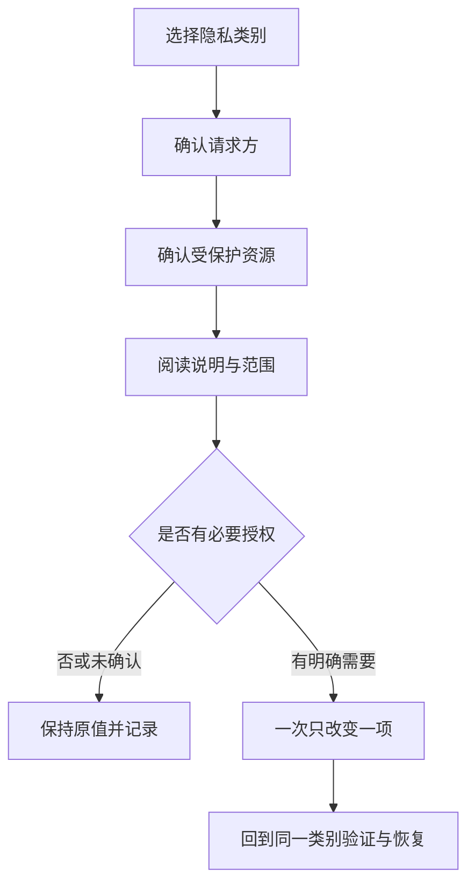

# 沿着权限边界阅读长页面：位置、文件、网络与管理工具

隐私页面中最容易出现的错觉是：滚动看到新的项目，就以为进入了新的权限类别。真实情况常常相反——同一类别的列表很长，页面上半部、展开项、底部说明和高级入口共同构成一个授权边界。本篇将这些连续画面串为一个可复核的阅读流程：**先确认权限对象，再看可授权的范围；先读解释，再决定是否需要例外；永远把恢复位置记在同一类别里。**

> [!warning] 不为教材制造权限状态
> 本文只解释已经采集到的系统文字与页面结构。不要为了验证某一行是否出现而授予完全磁盘访问、启用远程桌面、连接未知网络、打开开发者工具或改变位置服务。此类操作可能扩大数据访问范围，不能把“看懂页面”当作“必须试着开启”。

## 学习目标

学习完成后，你应能区分 `Location Services`、`Files and Folders`、`Full Disk Access`、`Local Network`、`Microphone`、`Remote Desktop` 与 `Developer Tools` 的对象；能说明长列表中的 `Allow`、`Turn Off`、`Details` 与 `Advanced` 分别在做什么；也能用英语表达“我正在核对范围，没有授予新的访问权”。

## 权限页的四个问题

每次阅读一个隐私类别，都先问四个问题。第一，**谁**请求访问：来源或系统服务。第二，**访问什么**：位置、麦克风、文件夹、网络、本地设备或系统能力。第三，**在什么条件下**：当前开关、展开的详细项、系统级例外或附加说明。第四，**如何撤回**：回到同一类别改变授权，而不是删除应用、重置所有设置或关闭无关服务。

`Full Disk Access` 的词面并不等于“任何操作都永久可见”，但它是非常广的访问能力；`Files and Folders` 则通常把范围细分到受保护位置。英语中 `access` 可作名词或动词：`grant access` 是授予访问，`remove access` 是撤回访问。学习时必须把受保护对象说出来，不能只说“打开了权限”。

## 真实界面：权限列表、展开项与连续页尾

> 本机截图未包含在公开版本中，以保护原图中的个人信息。

> 本机截图未包含在公开版本中，以保护原图中的个人信息。

> 本机截图未包含在公开版本中，以保护原图中的个人信息。

> 本机截图未包含在公开版本中，以保护原图中的个人信息。

> 本机截图未包含在公开版本中，以保护原图中的个人信息。

> 本机截图未包含在公开版本中，以保护原图中的个人信息。

> 本机截图未包含在公开版本中，以保护原图中的个人信息。

> 本机截图未包含在公开版本中，以保护原图中的个人信息。

> 本机截图未包含在公开版本中，以保护原图中的个人信息。

> 本机截图未包含在公开版本中，以保护原图中的个人信息。

> 本机截图未包含在公开版本中，以保护原图中的个人信息。

> 本机截图未包含在公开版本中，以保护原图中的个人信息。

> 本机截图未包含在公开版本中，以保护原图中的个人信息。

> 本机截图未包含在公开版本中，以保护原图中的个人信息。

> 本机截图未包含在公开版本中，以保护原图中的个人信息。

> 本机截图未包含在公开版本中，以保护原图中的个人信息。

> 本机截图未包含在公开版本中，以保护原图中的个人信息。

> 本机截图未包含在公开版本中，以保护原图中的个人信息。

> 本机截图未包含在公开版本中，以保护原图中的个人信息。

> 本机截图未包含在公开版本中，以保护原图中的个人信息。

> 本机截图未包含在公开版本中，以保护原图中的个人信息。

> 本机截图未包含在公开版本中，以保护原图中的个人信息。

> 本机截图未包含在公开版本中，以保护原图中的个人信息。

> 本机截图未包含在公开版本中，以保护原图中的个人信息。

> 本机截图未包含在公开版本中，以保护原图中的个人信息。

> 本机截图未包含在公开版本中，以保护原图中的个人信息。

> 本机截图未包含在公开版本中，以保护原图中的个人信息。

> 本机截图未包含在公开版本中，以保护原图中的个人信息。

> 本机截图未包含在公开版本中，以保护原图中的个人信息。

> 本机截图未包含在公开版本中，以保护原图中的个人信息。

> 本机截图未包含在公开版本中，以保护原图中的个人信息。

> 本机截图未包含在公开版本中，以保护原图中的个人信息。

> 本机截图未包含在公开版本中，以保护原图中的个人信息。

> 本机截图未包含在公开版本中，以保护原图中的个人信息。

> 本机截图未包含在公开版本中，以保护原图中的个人信息。

> 本机截图未包含在公开版本中，以保护原图中的个人信息。

> 本机截图未包含在公开版本中，以保护原图中的个人信息。

> 本机截图未包含在公开版本中，以保护原图中的个人信息。

> 本机截图未包含在公开版本中，以保护原图中的个人信息。

> 本机截图未包含在公开版本中，以保护原图中的个人信息。

> 本机截图未包含在公开版本中，以保护原图中的个人信息。

> 本机截图未包含在公开版本中，以保护原图中的个人信息。

> 本机截图未包含在公开版本中，以保护原图中的个人信息。

> 本机截图未包含在公开版本中，以保护原图中的个人信息。

### 完整界面表达

| 原文 | 软件语境中文 | 控件或说明对象 | 修改后应理解的影响 |
| --- | --- | --- | --- |
| `Location Services` | 定位服务 | 设备位置及其使用资格 | 影响位置数据能否被符合条件的来源使用。 |
| `Files and Folders` | 文件与文件夹 | 受保护位置的访问范围 | 应逐项查看位置，不把它与完全磁盘访问等同。 |
| `Full Disk Access` | 完全磁盘访问 | 更广的磁盘数据访问能力 | 属于高影响授权，需要明确用途和恢复记录。 |
| `Local Network` | 本地网络 | 局域网发现或连接资格 | 不等于互联网访问本身。 |
| `Microphone` | 麦克风 | 声音输入硬件 | 决定是否能使用麦克风，不等于输出声音。 |
| `Developer Tools` | 开发者工具 | 调试或开发相关的系统能力 | 不是普通应用偏好项。 |
| `Remote Desktop` | 远程桌面 | 远程查看或控制相关能力 | 需要区分查看、控制和授权范围。 |

`access to` 后面接资源：`access to files and folders`。`Allow an app to access ...` 则把请求方、动作和资源都说清。对高影响权限，最小权限原则可以用一句英语表达：`Grant access only when the feature requires it, and remove access when it is no longer needed.`

## 两个完整观察案例

### 案例一：区分文件夹授权与完全磁盘访问

1. 在 **Privacy & Security** 中依次阅读 `Files and Folders` 与 `Full Disk Access` 的说明。
2. 在文件夹页面展开一个现有条目，只观察它列出的受保护位置和当前状态，不改变任何选项。
3. 回到完全磁盘访问页面，注意它用的是更广泛的资源描述，而不是某一个文件夹名称。
4. 用英语总结：`Files and Folders can describe specific protected locations. Full Disk Access is a broader permission.`
5. 退出时不添加来源、不解锁额外设置，也不点击任何需要认证的动作。

### 案例二：将“需要网络”拆成两种不同权限

1. 阅读 `Local Network` 的说明，确认它讨论的是本地设备发现或局域网通信。
2. 再阅读位置服务、蓝牙或远程桌面页面，比较它们的受保护对象。
3. 不连接新网络、不打开远程控制，也不改变蓝牙设备状态。
4. 用英语说明：`Local Network access is about nearby devices on the network. It is not the same as location or microphone access.`
5. 若未来必须授权，记录来源、目的、原始值和撤回路径；完成任务后回到同一类别移除不再需要的授权。

> [!tip] 长页面先看标题，再看延续
> `part-1`、`part-2` 只是本机采集的连续定位，不是系统界面文字。真正判断类别时以页面标题、说明句和展开层级为准。这样不会把页尾提示误记成新的权限项目。

## 英语表达规律与搭配

隐私页常用三类结构：`allow + source + to + verb` 表示许可；`access to + resource` 表示可访问的对象；`turn off + feature` 表示撤回某项功能。注意 `privacy` 是名词，`private` 是形容词；`secure` 是安全的，`security` 是安全机制或安全性。若想谨慎说明未做变更，可说：`I reviewed the permission scope, but I did not grant additional access.`

| 单词 | 音标 | 词性 | 本篇语境义 | 所在完整表达 |
| --- | --- | --- | --- |
| permission | /pərˈmɪʃən/ | n. | 系统授权 | `permission scope` |
| access | /ˈækses/ | n./v. | 访问；访问权限 | `access to files and folders` |
| location | /loʊˈkeɪʃən/ | n. | 地理位置 | `Location Services` |
| folder | /ˈfoʊldər/ | n. | 文件夹 | `Files and Folders` |
| disk | /dɪsk/ | n. | 磁盘 | `Full Disk Access` |
| local | /ˈloʊkəl/ | adj. | 本地的、局域的 | `Local Network` |
| remote | /rɪˈmoʊt/ | adj. | 远程的 | `Remote Desktop` |

## 自测

1. 为什么 `Files and Folders` 与 `Full Disk Access` 不能互相替代？
2. `Local Network` 和 `Location Services` 分别保护什么对象？
3. 长列表中的展开行与页面底部说明各自有什么作用？
4. 用英语说“我只核对了本地网络的访问范围，没有允许新的来源”。

查看参考答案

1. 前者通常描述细分的受保护位置，后者是更广的磁盘数据访问能力。
2. 前者关心局域网设备与连接，后者关心地理位置数据。
3. 展开行显示更细的范围或来源，页尾补充限制、帮助或恢复线索。
4. `I reviewed the Local Network access scope without allowing a new source.`

## 版本与来源

界面根据本机 macOS 27.0 Beta (26A5425a) 于 2026-09-09 的采集。应用列表和可见条目随设备变化，本文不转录个人数据。权限概念参考 Apple 的 [Control access to your information on Mac](https://support.apple.com/guide/mac-help/control-access-to-your-information-mh32356/mac) 与 [Change Privacy & Security settings on Mac](https://support.apple.com/guide/mac-help/change-privacy-security-settings-mchl211c911f/mac)。
