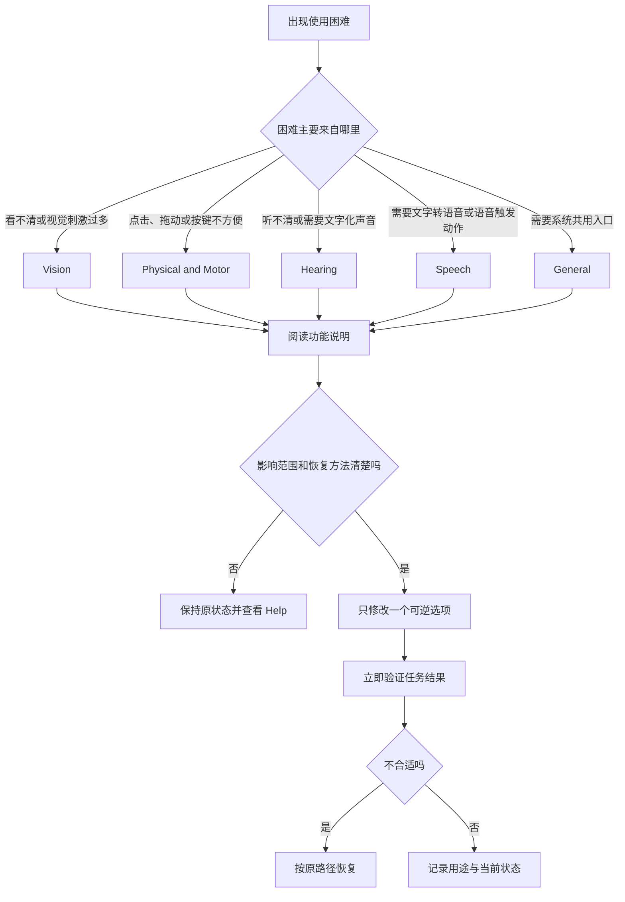

# 选择适合自己的辅助方式：辅助功能分类与入口

Accessibility 是 macOS 辅助入口。找类别、理解影响，改一项恢复。

> [!warning] 先理解，再改变
>
> Accessibility 中部分项目会改变键盘输入、指针响应、朗读方式、声音路由、屏幕显示或语音命令。尤其是 VoiceOver、Voice Control、Switch Control、Full Keyboard Access、Pointer Control 和 Live Captions，启用后会立即影响操作手感。第一次练习应选择只读浏览，或在熟悉的桌面环境中只改一项可逆设置；开始前记住原来的开关状态和返回路径。

## 学习目标

完成本篇后，你能够：

1. 用英语说明 Accessibility 页面解决的范围，以及五个分类分别服务什么需求。
2. 按 **Apple menu → System Settings → Accessibility** 的路径进入页面，并用侧边栏、内容区、功能卡片和返回按钮描述自己所在的位置。
3. 区分 `Vision`、`Physical and Motor`、`Hearing`、`Speech` 与 `General`，避免把功能名称按字面误解。
4. 读懂页面上的标题、按钮、说明句和状态词，知道 `Hover Text`、`Read & Speak`、`Live Speech` 这类表达在软件里的实际含义。
5. 完成两次安全、可恢复的操作练习：一次只读核对，一次只对单个显示或朗读偏好作出可逆改变。
6. 在别人求助时，能够用完整英文说明“应该进入哪个类别、为什么、将会发生什么、怎样恢复”。

## 适用场景与功能原理

系统设置通常按硬件或应用分类；Accessibility 则从使用者完成任务时遇到的障碍出发。阅读小文字、听没有字幕的语音、避免连续点击小目标、在不方便手动键入时输入短句，都属于默认交互方式不够合适的情况。Accessibility 用替代、放大、提示和自动化辅助方式减少感知或动作负担。

| 使用需求 | 页面类别 | 常见界面功能 | 解决的问题 | 不应简单理解成 |
| --- | --- | --- | --- | --- |
| 看清界面、降低视觉负担 | `Vision` | `VoiceOver`、`Zoom`、`Display`、`Motion`、`Hover Text` | 看不清、看得太累、需要非视觉反馈。 | 只和“眼睛有问题”有关。 |
| 少用精细手势完成操作 | `Physical and Motor` | `Voice Control`、`Keyboard`、`Pointer Control`、`Switch Control` | 点击、拖动、按键或连续动作不方便。 | 单纯修改鼠标速度。 |
| 接收或调整声音信息 | `Hearing` | `Hearing Devices`、`Audio`、`RTT`、`Subtitles and Captioning` | 听不清提示、通话或媒体内容。 | 只调高扬声器音量。 |
| 让文字和声音相互转换 | `Speech` | `Live Speech`、`Personal Voice`、`Vocal Shortcuts` | 不方便开口、需要由系统读出文字或触发命令。 | 普通 Siri 设置。 |
| 调用共用能力与入口 | `General` | `Siri`、`Shortcut` | 把辅助需求与系统通用操作结合。 | 每个功能都独立且互不影响。 |

## 操作路径：先定位页面，再定位需求

在英文系统中，路径写作 **Apple menu → System Settings → Accessibility**。左侧列表显示 System Settings 分类，右侧是 Accessibility 总览。顶部有 `Go Back` 和 `Go Forward`：前者返回实际浏览过的上一页，后者只在存在向前历史时可用。

进入首页后，先读顶部说明句和五个标题。标题下的功能名都是按钮，点击后进入独立详情页；首页负责选择方向，详情页才负责配置具体行为。

## 界面实例：Accessibility 首页如何组织功能

> 本机截图未包含在公开版本中，以保护原图中的个人信息。

截图中可能显示当前账户、设备状态或其他动态界面资料。这些是本机数据，不属于学习词汇，不会写入表格、搜索索引或练习。下表只保留页面结构和稳定的系统英语。

### 完整界面表达

| 原文 | 软件语境中文 | 控件类型 | 点击或修改后的作用 |
| --- | --- | --- | --- |
| `Accessibility` | 辅助功能。 | 页面标题、侧边栏分类。 | 打开按使用需求组织的辅助设置总览。 |
| `Personalize Mac in ways that work best for you with accessibility features for vision, hearing, motor, speech, and cognition.` | 使用适合你的辅助功能，让 Mac 的视觉、听觉、动作、语音和认知交互方式更符合你的需要。 | 页面说明。 | 解释该页面的目标范围，不是一个可点击的命令。 |
| `Learn more…` | 了解更多。 | 帮助链接。 | 打开与当前主题相关的说明资料。 |
| `Vision` | 视觉。 | 分组标题。 | 把阅读、显示、屏幕放大、屏幕朗读和视觉效果放在一起。 |
| `Physical and Motor` | 身体与运动。 | 分组标题。 | 聚合语音、键盘、指针和切换器控制。 |
| `Hearing` | 听觉。 | 分组标题。 | 聚合听觉设备、音频、实时文本和字幕。 |
| `Speech` | 语音。 | 分组标题。 | 聚合系统替你发声、个性化声音和声控快捷方式。 |
| `General` | 通用。 | 分组标题。 | 提供与系统其他能力衔接的入口。 |
| `Help` | 帮助。 | 工具栏或按钮。 | 查找针对当前页面的官方说明。 |
| `Go Back` | 返回。 | 工具栏按钮。 | 返回实际浏览历史中的上一页。 |

`Personalize Mac in ways that work best for you` 的主干是 `Personalize Mac`，意思是“按个人需要调整这台 Mac”，不是“把 Mac 装饰得更个性化”。`in ways that work best for you` 是定语从句式的补充，说明这些方式应当对你最有效。界面用 `work best` 强调结果：选择某项功能后，它是否真正改善了你要完成的任务。

`with accessibility features for vision, hearing, motor, speech, and cognition` 用 `for` 指明每一组功能服务的领域。`motor` 在这里不是发动机，也不是单独的“马达”，而是与身体动作控制有关的能力；`cognition` 指理解、注意、记忆和处理信息等认知过程。中文可概括为“视觉、听觉、动作、语音和认知”，但实际选择时仍应回到页面的具体功能。

### 本页全部单词

以下表格以首页可见的稳定界面词为单位去重。专有账户资料、设备名称与动态状态不列入。

| 单词 | 音标 | 词性 | 本页含义 | 所在完整表达 |
| --- | --- | --- | --- | --- |
| accessibility | /əkˌsesəˈbɪləti/ | n. | 无障碍与辅助使用的可及性。 | `Accessibility` |
| personalize | /ˈpɜːrsənəlaɪz/ | v. | 按个人需要调整。 | `Personalize Mac` |
| ways | /weɪz/ | n.复数 | 方法、方式。 | `in ways that work best` |
| work | /wɜːrk/ | v. | 起作用、适合使用。 | `work best for you` |
| best | /best/ | adv./adj. | 最好地；最合适的。 | `work best` |
| features | /ˈfiːtʃərz/ | n.复数 | 功能特性。 | `accessibility features` |
| vision | /ˈvɪʒən/ | n. | 视觉；看见的能力。 | `Vision` |
| hearing | /ˈhɪrɪŋ/ | n. | 听觉。 | `Hearing` |
| physical | /ˈfɪzɪkəl/ | adj. | 身体的、物理动作相关的。 | `Physical and Motor` |
| motor | /ˈmoʊtər/ | adj. | 动作控制相关的。 | `Physical and Motor` |
| speech | /spiːtʃ/ | n. | 说话、语音输出。 | `Speech` |
| cognition | /kɑːɡˈnɪʃən/ | n. | 认知、理解与信息处理。 | 页面说明。 |
| general | /ˈdʒenrəl/ | adj. | 通用的、一般性的。 | `General` |
| learn | /lɜːrn/ | v. | 学习、了解。 | `Learn more…` |
| more | /mɔːr/ | adv./det. | 更多。 | `Learn more…` |
| help | /help/ | n./v. | 帮助。 | `Help` |
| go | /ɡoʊ/ | v. | 前往；在导航中移动。 | `Go Back` |
| back | /bæk/ | adv. | 返回先前的位置。 | `Go Back` |
| and | /ænd/ | conj. | 和、以及。 | `Physical and Motor` |
| for | /fɔːr/ | prep. | 为了；针对。 | `features for vision` |
| in | /ɪn/ | prep. | 在……之中；以……方式。 | `in ways` |
| that | /ðæt/ | pron./conj. | 那个；引导说明从句。 | `ways that work` |
| you | /juː/ | pron. | 你；当前使用者。 | `for you` |
| your | /jʊr/ | det. | 你的。 | `for your use` 的同类界面结构。 |

## 五个类别不是五组散词

首页把功能分为五组，是为了让你能从任务反推入口。阅读时应先记“类别—目标—代表功能”三元组，再记单词。若只背 `Vision = 视觉`、`Hearing = 听觉`，真正打开页面时仍可能不知道该去 Display、Read & Speak 还是 Audio Descriptions。

### Vision：让内容能够被看见、听见或以更少视觉压力呈现

Vision 中可见 `VoiceOver`、`Zoom`、`Hover Text`、`Display`、`Motion`、`Read & Speak` 和 `Audio Descriptions`。它们并不都只放大文字：VoiceOver 用声音与键盘导航访问界面；Zoom 放大部分屏幕；Hover Text 放大指针经过的文本；Display 调整视觉呈现；Motion 调整动效；Read & Speak 朗读文本；Audio Descriptions 为部分视频提供描述性音轨。

| 功能名 | 应先理解的完整含义 | 合适的起点 | 需要留意的影响 |
| --- | --- | --- | --- |
| `VoiceOver` | 系统读出界面并提供非视觉导航。 | 需要以声音和键盘访问界面。 | 开启后键盘手势与普通操作规则不同。 |
| `Zoom` | 放大屏幕的一部分或全部。 | 临时看清小文字、图标或控件。 | 可能改变屏幕可见范围和指针移动感。 |
| `Hover Text` | 鼠标悬停时以更大文字显示所指文本。 | 文字难读但不想整体放大。 | 需确认触发方式，避免误以为普通工具提示。 |
| `Display` | 调整对比、颜色、透明度、文字或指针的视觉呈现。 | 长时间阅读、低对比界面或视觉敏感。 | 有些改变影响整个系统，而非单个 App。 |
| `Motion` | 调整动态效果与自动播放行为。 | 动效让人分心或引起不适。 | 视觉反馈可能变得更少。 |
| `Read & Speak` | 朗读选中内容或屏幕内容。 | 想同时看和听，或暂时不便阅读。 | 要确认朗读范围和系统语音。 |
| `Audio Descriptions` | 为视觉信息补充语音描述。 | 观看支持描述音轨的媒体。 | 取决于内容本身是否提供描述。 |

> [!tip] `Read & Speak` 的连词不能省掉
>
> `Read & Speak` 不是两个不相关的按钮标签。Read 强调读取屏幕文字或内容，Speak 强调用声音输出。看到 `&` 时要把它理解为一项组合能力，而不是先后必须完成的两个独立步骤。

### Physical and Motor：改变完成动作的方式，不等于“修复硬件”

`Physical and Motor` 下面的 `Voice Control`、`Keyboard`、`Pointer Control` 和 `Switch Control` 关注的是怎样把意图变成操作。Voice Control 可以把口头命令转为导航、输入或点击行为；Keyboard 包括辅助键盘访问和键入行为相关设置；Pointer Control 处理指针、鼠标、触控板与替代指针控制；Switch Control 适合用外部切换器或其他输入方式逐项扫描界面。

这里的 `physical` 与 `motor` 是并列分类语言。前者涉及身体操作条件，后者强调运动和动作控制能力。它们并不在诊断医学问题，也不承诺某个软件功能能解决所有身体限制。系统的角色是提供替代输入路径；选择是否适合，需要基于你实际使用的设备、动作范围和当前任务判断。

| 完整表达 | 可直接使用的中文解释 | 典型任务 | 先做的安全检查 |
| --- | --- | --- | --- |
| `Voice Control` | 用声音控制 Mac 的界面与输入。 | 少用手部操作完成导航或输入。 | 是否会在会议或共享空间误触发。 |
| `Keyboard` | 用键盘访问和控制界面。 | 减少对指针的依赖。 | 是否会改变常用快捷键或焦点移动。 |
| `Pointer Control` | 调整指针和替代指针操作。 | 点击、拖动和移动不稳定。 | 当前鼠标、触控板或外接设备是否正常。 |
| `Switch Control` | 用切换器扫描并选择界面项目。 | 使用外部开关或替代输入。 | 是否了解开启与退出方法。 |

### Hearing：把声音变成可选择、可看见或更易接收的信息

Hearing 包括 `Hearing Devices`、`Audio`、`RTT`、`Subtitles and Captioning`、`Live Captions` 和 `Name Recognition`，覆盖外接听觉设备、音频处理、文字通话、字幕和声音识别。它不是单纯的音量页面：音量改变强度，字幕、转写、声道平衡和外设连接改变信息到达的方式。`RTT` 是 Real-Time Text，指兼容通信服务中的实时文字；`Live Captions` 将音频转为动态字幕，受语言、设备性能、噪声与应用支持限制。

> [!warning] 实时文字与声音识别都可能出错
>
> 字幕、语音识别和姓名识别受口音、噪声、多人同时说话、音频质量和所选语言影响。涉及医疗、合同、身份、金额、地址或紧急指令时，不能只根据自动转写采取行动；应以原始音频、书面确认或可信人员复核为准。

### Speech：系统替你说、保存声音模型或识别一句专用命令

Speech 的 `Live Speech`、`Personal Voice` 与 `Vocal Shortcuts` 输入与输出方向不同：前者把文字读出来，第二项提供可选的个性化输出声音，第三项用口头短语触发动作。三者不是同一件事。

| 功能 | 输入 | 系统处理 | 输出或结果 | 一句准确英文说明 |
| --- | --- | --- | --- | --- |
| `Live Speech` | 文字或预设短语。 | 系统语音合成。 | 设备读出文字。 | `Live Speech lets the Mac speak typed text aloud.` |
| `Personal Voice` | 经许可创建的声音资料。 | 本机或系统支持的声音建模。 | 作为可选语音输出。 | `Personal Voice is a voice option that should be created and protected carefully.` |
| `Vocal Shortcuts` | 用户说出的短语。 | 识别短语并匹配动作。 | 执行指定快捷操作。 | `A vocal shortcut triggers an assigned action when the phrase is recognized.` |

`aloud` 是软件英语中的高频副词，意思是“出声地、让人听见地”。`speak typed text aloud` 不是“说出输入文本”这样机械的翻译，而是“将键入的文字朗读出来”。同时，`when the phrase is recognized` 表示识别成功是执行的条件，不保证任何时候都能触发。

### General：系统通用入口

`General` 下的 `Siri` 与 `Shortcut` 把辅助需求与系统通用服务连接起来。它们出现在此处，不表示所有 Shortcut 都自动具有辅助功能效果；权限、触发条件和结果仍须在各自页面审查。

## 两个完整操作案例

### 案例一：只读建立功能地图，不改动任何开关

**情境**：你刚切换到英文系统，想知道“文字看不清时该去哪里”，但不确定是否需要修改显示、放大或朗读设置。此案例不改变配置，只训练导航和表达。

1. 打开 **System Settings**，在侧边栏选择 **Accessibility**。
2. 停留在首页，先读顶部说明句 `Personalize Mac in ways that work best for you…`，确认页面不是“账户设置”或“显示器设置”。
3. 找到 `Vision`。逐项读出 `VoiceOver`、`Zoom`、`Hover Text`、`Display`、`Motion`、`Read & Speak` 和 `Audio Descriptions`。
4. 将任务分成三类：需要局部放大时优先看 `Zoom` 或 `Hover Text`；需要减少视觉刺激时看 `Display` 或 `Motion`；需要把文字读出来时看 `Read & Speak`。
5. 不点击开关，只用 `Go Back` 返回到上一个页面，确认导航历史行为。若 `Go Forward` 变为可用，可以理解为“可以返回到刚才离开的页面”。
6. 用下面的英文向自己复述学习结果：`I need a visual accessibility feature. I will first compare Zoom, Hover Text, and Read & Speak instead of changing several settings at once.`

**验证结果**：你应能不搜索中文，直接从 `Accessibility → Vision` 找到三个候选入口，并准确说出它们分别侧重放大、悬停显示和朗读。

**恢复方式**：本案例未修改任何设置，无需恢复。若误进入某个详情页，使用 `Go Back` 返回首页；不要在不理解提示时确认开启。

### 案例二：为短时阅读选择一个可逆的视觉辅助方案

**情境**：你在较高分辨率显示器上阅读系统说明，发现个别文字太小，但不希望改变整个系统的默认显示布局。目标是比较局部辅助方式，而不是永久改变所有视觉设置。

1. 先记录当前状态：在 Accessibility 首页停留，确认尚未开启陌生功能；如果你已有个性化配置，不要将它恢复为默认。
2. 选择 **Hover Text**，先只读详情页的说明，确认它描述的是指针经过文本时如何显示，而不是改变所有文字大小。
3. 若页面提供启用开关，先阅读开关附近的文字与任何键盘触发方式。只有你理解“如何出现”和“如何关闭”时，才可以临时开启。
4. 返回一个包含普通文字的安全页面，使用指针验证是否能看到预期的放大文本。不要在密码字段、私人聊天、支付页面或共享屏幕时测试。
5. 判断结果：如果局部放大已经足够，保留该设置或记下使用方法；如果它干扰阅读或遮挡内容，立即回到同一页关闭。
6. 用英语描述操作：`I enabled a temporary visual aid to make small text easier to read. It affected only the way text appears when I hover, so I tested it on a non-sensitive page and turned it off when it was not useful.`

**可能出现的问题**：若显示变化不符合预期，不要叠加 Zoom、Text Size 或 Display；先关闭当前功能，再决定是否换方案。

**恢复方式**：按原路径 **System Settings → Accessibility → Vision → Hover Text**，将刚才改变的开关恢复到记录的状态。恢复后重新打开普通页面，确认文本和指针行为已经符合预期。若找不到路径，使用 System Settings 的搜索并输入 `Hover Text`，再检查搜索结果的所属类别。

> [!tip] 安全的测试环境
>
> 视觉、语音与控制功能的第一次测试，尽量使用无个人内容的系统页面或本地示例文本。不要在正在输入密码、远程协助、视频会议、屏幕共享、支付确认或编辑未保存文件时试验会改变键盘、指针或语音行为的功能。

## 常见误解、风险与恢复方法

| 容易说错或做错的事 | 为什么不准确 | 更好的理解或动作 | 恢复路径 |
| --- | --- | --- | --- |
| 把 `Zoom` 当成视频会议缩放。 | 此处指显示放大辅助功能。 | 先看 Vision 下的说明，再判断是否适合局部放大。 | Accessibility → Vision → Zoom。 |
| 一次开启多个视觉辅助功能。 | 无法判断哪个设置改变了体验。 | 每次只测试一个可逆选项，记录前后状态。 | 回到各功能详情逐项恢复。 |
| 把 `Switch Control` 当作普通 on/off 开关。 | 它是一套扫描与选择方式。 | 先了解进入、暂停和退出方式。 | Accessibility → Physical and Motor → Switch Control。 |
| 认为 `Live Captions` 就是一份准确逐字记录。 | 自动转写受输入质量与语言条件影响。 | 将其当作理解辅助，关键信息另行确认。 | Accessibility → Hearing → Live Captions。 |
| 看到 `Personal Voice` 就把它当普通音色。 | 这可能涉及个人声音资料与额外保护要求。 | 阅读创建、使用和删除相关说明后再决定。 | Accessibility → Speech → Personal Voice。 |
| 遇到不熟悉的辅助功能就关闭。 | 有人可能长期依赖该配置，关闭会妨碍使用。 | 先确认是否为现有用户的必要设置。 | 保留原状态，使用 Help 或记录当前值。 |

某些功能会与隐私和权限产生交集。例如 Voice Control、Personal Voice、Live Captions 或声音功能可能显示麦克风、语音数据或本地处理说明；控制类功能也可能要求系统许可。`Accessibility features can reduce interaction barriers, but permissions and data handling still need to be reviewed for the specific feature and task.`

## 英语表达规律与可迁移搭配

辅助功能页很常使用四类句子：说明目的、描述条件、指明结果、给出安全边界。把这些句型读成整体，比背一串功能名更有用。

| 句型 | 软件里的含义 | 可替换表达 | 中文使用场景 |
| --- | --- | --- | --- |
| `Personalize … in ways that work best for you.` | 按适合你的方式调整。 | `Choose the option that works best for you.` | 说明选择应以个人任务为准。 |
| `Use … to …` | 使用某功能来完成某事。 | `Enable … to make … easier.` | 说明某项设置的目的。 |
| `When … is enabled, …` | 当功能开启时，会发生某种结果。 | `If you turn on …, …` | 描述开关和结果的条件关系。 |
| `This feature may affect …` | 该功能可能影响…… | `This setting changes the way … behaves.` | 提醒影响范围。 |
| `Turn it off if …` | 如果……，将其关闭。 | `Return to this page to restore the previous behavior.` | 指出恢复动作。 |
| `Make sure you can … before …` | 在……前确保你能够…… | `Confirm the exit method before enabling it.` | 强调先准备恢复路径。 |

`may affect` 是系统说明中非常重要的风险表达。`may` 表示“可能”，不是系统已经断言一定会发生；`affect` 是“影响”，通常没有说明好坏，需要你结合任务判断。比如 `This feature may affect keyboard navigation` 的正确理解是“它可能改变键盘导航方式，因此先确认退出方法”，而不是“键盘将坏掉”。

`restore the previous behavior` 也值得整体记忆。`restore` 是恢复，`previous` 是先前的，`behavior` 在软件语境里表示系统或控件的响应方式。它比笼统说 `go back` 更准确：你不只是返回页面，而是在让系统恢复到修改前的交互行为。

### 可直接使用的英文说明

| 你想表达的意思 | 自然英文 | 为什么这样说 |
| --- | --- | --- |
| 我需要让小文字更容易阅读。 | `I need to make small text easier to read.` | `make + object + adjective` 表示使某对象变成某状态。 |
| 我先查看功能说明，再决定是否开启。 | `I will read the feature description before deciding whether to enable it.` | `before + -ing` 说明先后顺序；`whether to` 表示是否做某事。 |
| 这个设置改变了指针的响应方式。 | `This setting changes the way the pointer responds.` | `the way + clause` 描述方式。 |
| 我只测试了一个可恢复的选项。 | `I tested only one reversible option.` | `reversible` 强调可以恢复。 |
| 它不适合我的工作方式，所以我恢复了原来的状态。 | `It did not work well for my workflow, so I restored the previous setting.` | `workflow` 可指个人完成工作的一套步骤。 |
| 这个功能可能需要额外权限。 | `This feature may require additional permission.` | `may require` 表示可能需要，避免绝对断言。 |
| 请先确认怎样退出这个模式。 | `Please confirm how to exit this mode first.` | `how to exit` 是很实用的操作提问。 |

## 本篇自测

先不看答案，尝试根据页面英语完成下面的题目。

1. `Vision` 下的 `Zoom` 与 `Hover Text` 各自更适合解决什么阅读问题？
2. 为什么不能把 `Switch Control` 仅理解为普通的开关？
3. `Live Speech`、`Personal Voice` 和 `Vocal Shortcuts` 的输入或输出方向分别是什么？
4. 看到 `This feature may affect keyboard navigation` 时，应采取什么安全动作？
5. 请把“我会先在安全页面测试，再决定是否保留该设置”说成英文。
6. 你发现字幕识别出错时，为什么不能把错误内容直接当作关键事实？

查看答案与说明

1. Zoom 放大屏幕的一部分或全部，适合需要扩大可见区域；Hover Text 在指针经过文本时显示更大的文字，适合不想整体放大而需要临时读清局部文字的情况。两者都应先看详情页说明和恢复方法。
2. Switch Control 是一套通过切换器扫描和选择界面项目的替代控制方式，开启后可能改变操作流程；它不是一个单纯表示 on/off 状态的小控件。
3. Live Speech 以文字为输入、以系统朗读为输出；Personal Voice 是一项供语音输出使用的个性化声音选择；Vocal Shortcuts 以说出的短语为输入，并在识别成功时触发指定动作。
4. 先确认当前键盘导航和退出方式，记录原状态，只在安全环境测试一个可逆选项。不要同时改变多个键盘或指针设置。
5. 可以说：`I will test the setting on a non-sensitive page first and then decide whether to keep it.`
6. 实时字幕会受音频质量、噪声、口音、多人讲话和语言支持影响；涉及金额、身份、地址、法律或紧急信息时，应以原始来源或人工确认复核。

## 版本差异与参考来源

本篇页面名称、分类与可见功能依据本机 **macOS 27.0 Beta (26A5425a)** 的 Accessibility 首页和本机辅助功能文本核对。后续版本可能移动功能、变更标题或调整权限说明；应以当前搜索结果、页面说明与 Help 为准。

功能原理可参考 Apple 的公开 [Accessibility settings guide](https://support.apple.com/guide/mac-help/change-accessibility-settings-mh43185/mac) 与 [Mac User Guide](https://support.apple.com/guide/mac-help/welcome-mh43558/mac)。公开网页可能对应 macOS Tahoe 26 或其他版本，因此它用于补充概念和安全边界，不替代本机截图对按钮名称和界面层级的观察。

> [!note] 下一步如何学习
>
> 已理解分类后，再按任务进入后续篇目：需要屏幕阅读、放大和悬停文字时阅读 VoiceOver、Zoom 与 Hover Text；需要降低视觉刺激时阅读 Display、Text Size 与 Motion；需要语音、指针或外部切换器控制时阅读 Physical and Motor；需要字幕、实时文字或声音相关功能时阅读 Hearing 与 Speech。每次只带着一个真实任务进入下一篇。
