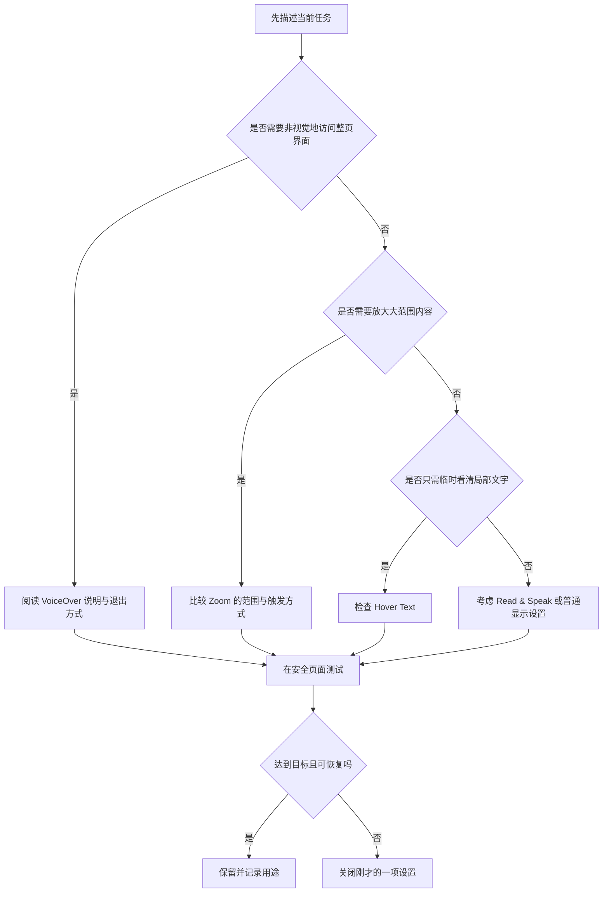

# 让屏幕更容易阅读：VoiceOver、缩放与悬停文本

当页面文字太小、视觉注意力难以维持，或暂时不方便持续盯着屏幕时，最容易犯的错误是同时开启多个辅助功能。VoiceOver、Zoom 与 Hover Text 都位于 **Accessibility → Vision**，但它们解决的问题不同：VoiceOver 用声音和键盘访问界面；Zoom 改变可见区域的放大程度；Hover Text 只在你停留于文字上时提供局部放大。正确选择来自任务，而不是来自功能名字看起来是否熟悉。

> [!warning] 第一次尝试 VoiceOver 前先学会退出
>
> VoiceOver 会改变普通键盘导航的方式。它并不是“播放一段语音”这么简单，而是让系统用语音、焦点和专用操作规则呈现整个界面。第一次练习前，先记住当前页面、开关状态和关闭方法；不要在正在填写密码、共享屏幕、远程协助、编辑未保存内容或视频会议中启用。

## 学习目标

读完本篇，你应该能够按使用目标区分三项功能，读懂其页面中的完整英语，完成一次只读核对和一次可恢复的局部放大测试。你还应知道：什么时候应选择 Hover Text，什么时候应选择 Zoom，为什么不能把 VoiceOver 当作普通的“朗读按钮”，以及遇到操作异常时怎样返回到原状态。

## 先按任务选择工具

| 你现在遇到的困难 | 更可能适合的功能 | 功能实际改变什么 | 先不要做什么 |
| --- | --- | --- | --- |
| 需要以声音理解界面结构和当前焦点 | `VoiceOver` | 用语音、声音提示和键盘导航呈现界面。 | 不要只因为想听一段文字就开启。 |
| 整体或局部内容小到难以看清 | `Zoom` | 放大屏幕区域或整个显示内容。 | 不要一开始就修改多项显示设置。 |
| 只有某些文字需要临时看清 | `Hover Text` | 在满足触发条件时把所指文字放大显示。 | 不要误以为它会永久放大所有文本。 |
| 想把选中的文字读出来 | `Read & Speak` | 朗读特定文本或内容。 | 不要把它和 VoiceOver 的界面导航混为一谈。 |

这张表的关键是“改变什么”。VoiceOver 改变界面访问方式；Zoom 改变显示比例和可见区域；Hover Text 改变临时查看某段文字时的呈现。它们可能在同一个人身上同时有价值，却不应被当成同一个开关的不同名字。

## 操作路径与安全准备

路径是 **Apple menu → System Settings → Accessibility → Vision**。在首页点击 `VoiceOver`、`Zoom` 或 `Hover Text` 会进入对应详情页。若你从搜索结果进入深层页，使用工具栏的 `Go Back` 可以返回实际浏览历史；它不是一个固定的“上一层分类”按钮，因此不要依赖猜测，而要确认标题已经回到目标页面。

开始前做三件小事：第一，记住当前功能是否为 off；第二，准备一个没有私人内容的测试页面，例如系统设置首页或本地示例文本；第三，确认你能回到 **Accessibility → Vision**。这三个动作让“试一试”成为可撤回测试，而不是未知配置变更。

> [!tip] 用完整句子记录原状态
>
> 可写下 `VoiceOver is currently off.`、`Zoom is currently off.` 或 `Hover Text is currently enabled.`。状态句中的 `currently` 表示“此刻的”，提醒自己记录的是测试前状态，而不是推荐的默认状态。

## 界面实例：VoiceOver 的入口、教程和工具

> 本机截图未包含在公开版本中，以保护原图中的个人信息。

本机辅助功能文本确认该页包含一个 VoiceOver 开关，说明可以通过按住 Command 键连续按三次 Touch ID 快速切换，以及 `Open VoiceOver Tutorial…`、`Open VoiceOver Utility…` 和 `Help`。账户信息或动态状态不属于学习内容，以下只记录页面稳定表达。

| 完整界面表达 | 软件语境中文 | 控件类型 | 使用时应理解的结果 |
| --- | --- | --- | --- |
| `VoiceOver` | 屏幕阅读与非视觉导航功能。 | 页面标题。 | 进入 VoiceOver 的总设置。 |
| `To toggle VoiceOver, quickly press Touch ID three times while holding the Command key.` | 要切换 VoiceOver，请按住 Command 键并快速连按 Touch ID 三次。 | 开关附近的说明。 | 说明一种快捷切换方法，不表示每台 Mac 都有相同硬件。 |
| `Open VoiceOver Tutorial…` | 打开 VoiceOver 教程。 | 按钮。 | 打开系统提供的练习与入门说明。 |
| `Open VoiceOver Utility…` | 打开 VoiceOver 实用工具。 | 按钮。 | 进入更细的 VoiceOver 配置工具。 |
| `Help` | 帮助。 | 按钮。 | 打开当前主题的帮助资料。 |
| `Go Back` | 返回。 | 工具栏按钮。 | 返回到实际浏览历史中的上一页。 |
| `Go Forward` | 前进。 | 工具栏按钮。 | 在存在前进历史时回到已离开的页面。 |

`To toggle VoiceOver` 中的 `toggle` 不是单纯“打开”。它表示在 on 和 off 两个状态之间切换，因此中文应理解为“切换 VoiceOver”。`quickly press Touch ID three times` 是操作方式，`while holding the Command key` 表示同时持续按住 Command 键。软件说明常用 `while + -ing` 表达“在保持某动作时进行另一动作”。

这个快捷方式只应作为你确认过本机硬件与设置后可用的方案。Touch ID 并非每台 Mac 的操作方式都相同，键盘布局或辅助功能快捷键也可能已经被个性化设置改变。第一次开启 VoiceOver 时，更稳妥的做法是从当前页面的开关开始，知道开关所在位置和状态后再练习快捷方式。

### 本页全部单词

| 单词 | 音标 | 词性 | 本页含义 | 所在完整表达 |
| --- | --- | --- | --- | --- |
| voice | /vɔɪs/ | n. | 声音、语音。 | `VoiceOver` |
| over | /ˈoʊvər/ | prep./adv. | 在名称中构成覆盖式的语音访问含义。 | `VoiceOver` |
| toggle | /ˈtɑːɡəl/ | v. | 在开启和关闭之间切换。 | `To toggle VoiceOver` |
| quickly | /ˈkwɪkli/ | adv. | 快速地。 | `quickly press` |
| press | /pres/ | v. | 按下。 | `press Touch ID` |
| holding | /ˈhoʊldɪŋ/ | v.-ing | 按住、保持。 | `while holding` |
| command | /kəˈmænd/ | n. | Command 修饰键；命令。 | `Command key` |
| key | /kiː/ | n. | 键、按键。 | `Command key` |
| three | /θriː/ | num. | 三。 | `three times` |
| times | /taɪmz/ | n.复数 | 次数。 | `three times` |
| open | /ˈoʊpən/ | v. | 打开。 | `Open VoiceOver Tutorial…` |
| tutorial | /tuːˈtɔːriəl/ | n. | 教程、引导式练习。 | `VoiceOver Tutorial` |
| utility | /juːˈtɪləti/ | n. | 实用工具。 | `VoiceOver Utility` |
| help | /help/ | n./v. | 帮助。 | `Help` |
| back | /bæk/ | adv. | 返回。 | `Go Back` |
| forward | /ˈfɔːrwərd/ | adv. | 向前。 | `Go Forward` |
| while | /waɪl/ | conj. | 当……时；同时。 | `while holding` |
| the | /ðə/ | det. | 这、该；定冠词。 | `the Command key` |
| to | /tuː/ | prep./marker | 表目的；不定式标记。 | `To toggle` |

## VoiceOver：它在读什么，为什么操作规则会变化

VoiceOver 的核心不是把页面所有字从头念到尾，而是把当前焦点所在对象、对象类型、状态和可用动作组织成可通过声音和键盘访问的界面。你会听到按钮、复选框、开关、标题、列表、文本字段或选中状态等信息。这样做的好处是，无需依赖鼠标位置也能理解界面结构；代价是普通键盘操作方式会改变，因此必须先理解启动和退出。

| 你可能听到或看到的界面信息 | 它说明什么 | 学习时该做什么 |
| --- | --- | --- |
| `button` | 当前焦点是可触发动作的按钮。 | 先确认按钮名称，再决定是否激活。 |
| `switch, on` 或 `switch, off` | 当前对象是开关并带有状态。 | 记录原状态，避免凭感觉猜测。 |
| `selected` | 列表或分段控件中当前选中项。 | 与 `focused` 区分：选中是内容状态，焦点是当前操作位置。 |
| `heading` | 标题层级。 | 用它建立页面结构，而不是只听连续文字。 |
| `text field` | 可输入文本的位置。 | 确认是否会提交或保存，再输入内容。 |

`focused` 与 `selected` 容易混淆。焦点（focus）表示接下来键盘动作会作用到哪里；选中（selected）表示某项目前被选作内容、分类或状态。一个列表项可以被选中，但你此刻的焦点可能在另一个按钮上。理解这一区别后，听到 VoiceOver 报告时就不会误以为“正在朗读的对象一定已经被选中”。

> [!warning] VoiceOver 与隐私内容
>
> VoiceOver 可能朗读屏幕上当前可访问的文字。处理密码、验证码、私人消息、文件名、支付信息或共享屏幕时，先考虑周围环境和音量输出。屏幕阅读功能帮助你访问界面，并不改变敏感内容本身的保密级别。

### 案例一：先用系统教程了解 VoiceOver，而不改变长期配置

**情境**：你想了解 VoiceOver 的导航方式，但还没有使用经验，也不希望误触系统设置。

1. 进入 **System Settings → Accessibility → Vision → VoiceOver**。
2. 核对开关当前显示的状态；若为 off，先不要开启。
3. 点击 `Open VoiceOver Tutorial…`，阅读系统教程中关于焦点、对象名称和基本导航的说明。
4. 在教程或安全测试环境中学习一个动作后，暂停并确认自己还能回到 VoiceOver 设置页。
5. 需要尝试开关时，只在自己已知关闭位置的情况下操作；测试完后让状态恢复为开始时记录的值。
6. 用英文总结：`I opened the VoiceOver Tutorial first because I needed to understand the navigation model before changing the setting.`

**验证**：你应能说出 `Open VoiceOver Tutorial…` 是教程入口，`Open VoiceOver Utility…` 是进一步配置工具入口，二者都不是直接开启 VoiceOver 的按钮。

**恢复**：如果 VoiceOver 的声音或导航让你无法继续测试，回到同一设置页关闭开关；必要时由熟悉该功能的人在本机协助。不要为了“恢复普通操作”随意关闭其他 Accessibility 选项。

## 界面实例：Zoom 的范围、触发和高级设置

> 本机截图未包含在公开版本中，以保护原图中的个人信息。

Zoom 用于放大屏幕内容。它适合阅读小字号、查看细小图标、核对表格或临时观察不易辨认的局部。放大并不等于改变实际文件的字体大小，也不等于调整显示器物理分辨率；它是帮助你在当前屏幕上更容易看清内容的一种显示辅助方式。

| 界面表达 | 软件语境中文 | 需要检查的点 |
| --- | --- | --- |
| `Zoom` | 屏幕放大。 | 当前是否启用，放大范围和触发方式是什么。 |
| `Use keyboard shortcuts to zoom` | 使用键盘快捷键进行放大。 | 快捷键是否与已有工作流冲突。 |
| `Use trackpad gesture to zoom` | 使用触控板手势进行放大。 | 是否确实使用触控板，手势是否容易误触。 |
| `Zoom style` | 放大样式。 | 是全屏、画中画还是其他可用呈现方式。 |
| `Advanced…` | 高级设置。 | 进入前先理解它会影响的范围。 |

`Use keyboard shortcuts to zoom` 的结构是 `Use + tool + to + verb`：使用某个工具来完成某项操作。这里 `keyboard shortcuts` 是复数，因为通常不只一个组合键。`gesture` 指手势，不是“手势密码”；`trackpad` 是触控板。把它们与本机实际硬件对应起来，才能决定要不要启用。

> 本机截图未包含在公开版本中，以保护原图中的个人信息。

高级页的存在并不表示必须调整。`Advanced…` 的省略号表示点击后会打开额外配置或对话框，而不是立即执行一个不可逆命令。进入后先阅读每项说明，特别留意与焦点跟随、窗口位置、显示区域或控制方式有关的表达；若无法说明某项会改变什么，就保持原值并返回。

### Zoom 的两种安全练习

**练习 A：只读比较触发方式。** 进入 Zoom 页面，分别阅读 `Use keyboard shortcuts to zoom` 与 `Use trackpad gesture to zoom`。问自己两个问题：我的设备是否有触控板？我是否已经依赖这组快捷键完成其他工作？不要为了完成练习启用其中任一项。用英语说：`I compared the available zoom controls before choosing one, because a shortcut can affect my existing workflow.`

**练习 B：一次短时、可恢复的放大测试。** 在不含私人资料的系统页面，选择一种你已经理解的触发方式，只测试一次放大和一次还原。观察文字是否更容易阅读、页面是否仍能正常操作、指针是否能准确到达目标。若效果不适合，立即关闭刚才启用的单一选项或还原缩放。用英语说：`I tested one zoom method on a safe page and restored the previous view after checking the result.`

> [!tip] “放大”与“文字大小”不是同一层级
>
> Zoom 放大当前可见画面；Text Size 通常调整支持该设置的文字呈现；Displays 中的分辨率会影响整个显示空间。它们都可能让内容看起来更大，却影响不同范围。先从最小范围、最容易恢复的选项开始。

## 界面实例：Hover Text 的局部阅读策略

> 本机截图未包含在公开版本中，以保护原图中的个人信息。

Hover Text 的思路是“在需要时放大”，而不是长期改变所有界面布局。对于偶尔难以辨认的菜单文字、信息密集表格或短标签，这种局部策略可能比全屏放大干扰更少。它也要求你了解触发方式：如果没有满足触发条件，指针单纯经过文字并不一定显示放大内容。

| 表达 | 语境解释 | 应如何验证 |
| --- | --- | --- |
| `Hover Text` | 指针悬停时显示的放大文本。 | 在无敏感内容的普通文本上测试。 |
| `Hover` | 指针停留在对象上，不等于点击。 | 确认是停留、组合键还是其他触发动作。 |
| `Text` | 可读文字内容。 | 观察被放大的是否正是目标文字。 |
| `Settings…` | 与该功能有关的更多设置。 | 进入前记录现有行为与原状态。 |
| `Show` | 显示。 | 明确什么条件下出现辅助文字。 |

> 本机截图未包含在公开版本中，以保护原图中的个人信息。

`Hover` 作为动词表示“悬停、停留在上方”。它与 `hold` 不同：hold 是按住键、按钮或物体；hover 是让指针停留在对象上。要表达“我只是把指针停在文字上，没有点击”，可说 `I hovered over the text without clicking it.`。`over` 在这里指在目标上方或其范围内，不表示“结束”。

### 案例二：用 Hover Text 解决偶发的小文字阅读问题

**情境**：你可以正常阅读大多数界面，只在密集设置页的少数标签上需要放大，不想永久改变全局显示。

1. 打开 **Accessibility → Vision → Hover Text**，先确认当前状态。
2. 阅读功能说明和 `Settings…` 入口；在不理解触发方式前，不修改颜色、大小或其他细节。
3. 在系统设置中选择一个没有私人内容的短标签，让指针停留在文字上，按当前页面所说明的方法触发 Hover Text。
4. 核对放大的内容是否对应鼠标下的原文字，而非把弹出的提示当作另一个应用窗口。
5. 如果局部放大足够完成阅读任务，记录使用条件；如果遮挡内容、增加干扰或无法稳定触发，回到原页关闭或恢复本次改变。
6. 用英语说明结果：`Hover Text helped me read one small label without changing the whole screen. I turned it off when it covered content I still needed to see.`

**恢复方式**：路径仍是 **System Settings → Accessibility → Vision → Hover Text**。恢复时只改回本次测试的项目，不顺手重置其他显示、键盘或指针设置。测试后也要回到普通阅读页面，确认没有遗留的触发或遮挡行为。

## 常见错误、风险和恢复清单

| 情况 | 错误理解 | 更稳妥的处理 |
| --- | --- | --- |
| 想听一段短文本 | 直接开启 VoiceOver。 | 先比较 Read & Speak；VoiceOver 是完整界面访问方式。 |
| 文字很小 | 同时开 Zoom、Hover Text 和 Text Size。 | 每次只试一项，先选影响范围最小的功能。 |
| VoiceOver 已开启 | 以为普通 Tab 或方向键规则完全不变。 | 先使用系统教程，确认当前焦点和退出方法。 |
| Zoom 影响工作 | 继续叠加显示器分辨率设置。 | 先还原 Zoom，再判断是否真的需要调整其他层级。 |
| Hover Text 没出现 | 以为系统故障。 | 重新阅读触发说明，核对指针位置和所需组合动作。 |
| 共享屏幕时测试 | 忽略朗读与放大可能暴露内容。 | 在私密且无敏感内容的环境测试。 |

> [!warning] 先恢复，再排查
>
> 当界面突然变得难以操作时，不要同时修改更多辅助功能来“修复”。先回到刚才改变的单一功能，恢复原状态，再确认问题是否消失。若无法确认原因，保留现状并使用系统 Help 或可信的本机支持渠道，而不是执行批量重置。

## 可直接背诵的英语表达

| 中文意思 | 英文表达 | 使用提示 |
| --- | --- | --- |
| 我需要一个能读出界面的功能。 | `I need a feature that can read the interface aloud.` | `that can` 说明功能能力。 |
| 我先确认如何关闭它。 | `I will confirm how to turn it off first.` | `how to` 用于询问操作方法。 |
| 这个功能会改变键盘导航。 | `This feature changes keyboard navigation.` | 表示可观察到的行为变化。 |
| 我只想临时放大这段文字。 | `I only want to enlarge this text temporarily.` | `temporarily` 表示暂时地。 |
| 悬停文字没有改变整个屏幕。 | `Hover Text did not change the whole screen.` | 适合说明局部影响。 |
| 我测试后恢复了原来的设置。 | `I restored the previous setting after the test.` | `restore` 比单纯 `go back` 更准确。 |
| 这个选项可能与我的快捷键冲突。 | `This option may conflict with my shortcuts.` | `may conflict with` 表示可能冲突。 |
| 请先打开教程，不要直接改设置。 | `Please open the tutorial before changing the setting.` | `before + -ing` 说明先后顺序。 |

## 本篇自测

1. VoiceOver、Zoom 和 Hover Text 的主要差别是什么？
2. `toggle VoiceOver` 为什么不能翻译成“打开 VoiceOver”？
3. 什么场景下应优先考虑 Read & Speak，而不是 VoiceOver？
4. `Use keyboard shortcuts to zoom` 中的 `to zoom` 表示什么关系？
5. 如果 Hover Text 的显示遮挡了你需要看的内容，应该怎样恢复？
6. 请用英文说“我一次只测试一个可恢复的显示设置”。

查看答案

1. VoiceOver 用声音和键盘访问整个界面；Zoom 放大屏幕内容；Hover Text 只在需要时局部放大指针所指的文字。
2. Toggle 表示在 on 与 off 两种状态间切换；功能可能已开启，也可能已关闭。
3. 当你只是希望系统朗读一段选中文字或内容，而不需要改变整页的导航方式时。
4. 表示目的：使用键盘快捷键来进行放大。
5. 回到 Accessibility → Vision → Hover Text，只恢复这次测试改变的开关或设置，再在普通页面确认显示恢复。
6. `I test only one reversible display setting at a time.`

## 版本差异与来源

本篇界面英文、功能入口和 VoiceOver 页面文本以本机 **macOS 27.0 Beta (26A5425a)** 的截图及辅助功能文本为准。后续版本可能改变按钮名称、快捷方式或功能支持范围。公开说明可参考 Apple 的 [VoiceOver guide](https://support.apple.com/guide/voiceover/welcome/mac)、[Zoom settings guide](https://support.apple.com/guide/mac-help/zoom-in-on-the-screen-mchlp2975/mac) 和 [Accessibility settings guide](https://support.apple.com/guide/mac-help/change-accessibility-settings-mh43185/mac)。公开网页用于理解功能原则，不替代本机页面对实际控件与版本差异的核对。
