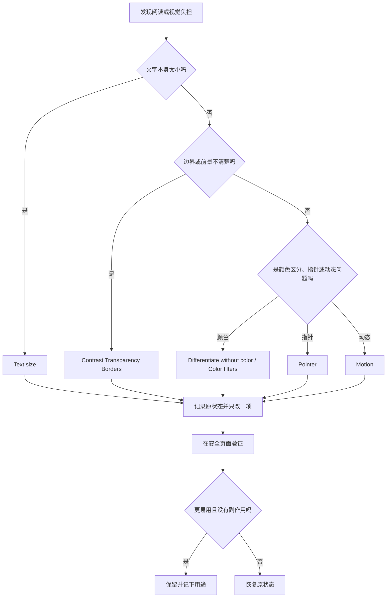

# 减少视觉负担：显示、文字大小、对比度与动态效果

“内容看着不舒服”并不是一个单一问题：可能是文字太小，透明背景让前景不清楚，低对比度使边界模糊，动画让注意力分散，鼠标指针难以找到，或屏幕运动引起不适。Accessibility 中的 Display、Text size 和 Motion 正是按这些不同原因提供选项。最安全的原则是先描述一个具体困难，再选择影响范围最小的设置；不要把显示器分辨率、系统外观、文字大小、颜色滤镜和动态效果混成一组“优化项”。

> [!warning] 视觉偏好不是性能开关
>
> `Reduce transparency`、`Increase contrast`、`Color filters` 和 `Reduce motion` 会改变你在多个 App 中看到的界面。它们可能改善可读性，也可能让某些设计、提示或图片的效果不同。每次变更前记录原状态；不要在远程支持、屏幕共享、色彩校对、图像编辑或尚未保存的工作中批量调整。

## 学习目标

完成本篇后，你能够区分文字大小、对比度、透明度、颜色、指针和动态效果的作用范围；读懂 Display 和 Motion 页面中的完整英文；用两组可恢复练习测试一个显示选项；并能用英语解释为什么选择某项功能、它影响了什么、如何恢复原状。

## 先确定问题属于哪一层

| 你看到的问题 | 优先检查的入口 | 改变的对象 | 常见误解 |
| --- | --- | --- | --- |
| 只有文字偏小 | `Text size` | 支持该功能的 App 和系统文字。 | 等同于修改显示器分辨率。 |
| 前景和背景难分辨 | `Increase contrast`、`Reduce transparency`、`Show borders` | 系统界面的层次、边界与透明效果。 | 只是把屏幕亮度调高。 |
| 某些信息只能靠颜色区分 | `Differentiate without color` | 用额外视觉线索区分状态。 | 让所有颜色变成灰色。 |
| 指针找不到或太小 | `Pointer size`、`Quickly move…` | 指针外观与临时放大反馈。 | 调整鼠标速度。 |
| 画面移动、闪烁或自动播放造成干扰 | `Motion`、闪烁内容调暗选项 | 动效、自动播放、光标闪烁、运动提示。 | 提升设备运行速度。 |
| 需要特殊色彩呈现 | `Color filters` | 整体色彩转换或滤镜强度。 | 可安全替代专业色彩校准。 |

`Display` 是一个大类，处理视觉呈现；`Displays` 则是系统设置中显示器硬件、分辨率和连接的页面。拼写几乎相同，语境却不同。要表达“我正在调节辅助显示效果”，可以说 `I am adjusting accessibility display settings.`；要表达“我在查看外接显示器”，则说 `I am checking the Displays settings.`。

## 操作路径与安全边界

进入路径是 **Apple menu → System Settings → Accessibility → Vision → Display**。同一组中的 **Text size** 是一个按钮，会打开支持文字大小偏好的页面；**Motion** 是另一张独立页面。三个入口相近，但不要把看到的开关当成“推荐开启”。一个默认 off 的开关只表示当前没有启用，不代表每个人都应该开启；一个默认 on 的选项只表示本机当前状态，也不能作为你的配置建议。

第一次调整前，用一句可核对的状态记录开始，例如 `Increase contrast is currently off.` 或 `Auto-play animated images is currently on.`。之后只改一项，在普通设置页或本地公开文字上测试，再判断是否保留。这样能够在体验变差时迅速定位原因。

> [!tip] `currently` 让状态可追溯
>
> `currently` 指“目前、此刻”。`The pointer size is currently set to the default value.` 的重点不是默认值好，而是明确记录测试开始时的值。恢复时应恢复到这个已记录的状态，而不是猜测系统出厂默认。

## 界面实例：Display 将视觉设置按作用拆开

> 本机截图未包含在公开版本中，以保护原图中的个人信息。

本机辅助功能文本显示 Display 页面分为界面呈现、Text、Pointer 与 Color Filters。开关当前值、指针颜色和滑块数值是本机配置，不作为正文词汇或学习结论；下表只解释稳定的界面英语和行为范围。

| 完整界面表达 | 软件语境中文 | 控件类型 | 改动后主要影响 |
| --- | --- | --- | --- |
| `Invert colors` | 反转颜色。 | 开关。 | 改变画面中颜色的反转呈现。 |
| `Invert colors mode` | 反转颜色模式。 | 单选选项。 | 在可用时选择不同反转方式。 |
| `Smart` | 智能模式。 | 单选项。 | 使用系统定义的智能反转策略。 |
| `Classic` | 经典模式。 | 单选项。 | 使用传统反转策略。 |
| `Increase contrast` | 提高对比度。 | 开关。 | 强化界面元素之间的视觉差异。 |
| `Reduce transparency` | 减少透明度。 | 开关。 | 降低透明背景与模糊叠层效果。 |
| `Show borders` | 显示边框。 | 开关。 | 为部分界面区域提供更清楚边界。 |
| `Differentiate without color` | 不依靠颜色进行区分。 | 开关。 | 用颜色以外的提示区分状态。 |
| `Video content that depicts repeated flashing or strobing lights will be automatically dimmed.` | 含重复闪烁或频闪光线的视频内容会自动变暗。 | 开关说明。 | 降低特定闪烁视频的视觉刺激。 |
| `Display contrast` | 显示对比度。 | 滑块。 | 细调系统提供的对比度程度。 |
| `Text size` | 文字大小。 | 按钮。 | 进入支持 App 和系统功能的阅读大小偏好。 |
| `Set your preferred reading size for supported apps and system features.` | 为受支持的 App 和系统功能设定偏好的阅读大小。 | 说明句。 | 明确并非每个 App 都一定受此设置影响。 |
| `Pointer size` | 指针大小。 | 滑块。 | 调整指针可见大小。 |
| `Reset Colors` | 重置颜色。 | 按钮。 | 恢复指针颜色相关设置。 |
| `Color filters` | 颜色滤镜。 | 开关。 | 启用色彩滤镜功能。 |
| `Filter type` | 滤镜类型。 | 弹出菜单。 | 选择系统提供的滤镜类别。 |
| `Intensity` | 强度。 | 滑块。 | 调整当前滤镜作用程度。 |

`Set your preferred reading size for supported apps and system features.` 有三个必须整体理解的部分。`preferred reading size` 是你偏好的阅读文字大小；`supported apps` 表示能够响应这项偏好的应用，并不涵盖所有应用；`system features` 指系统功能。因而不能承诺“改一次会让所有软件文字统一变大”。正确说法是：`This setting changes the preferred reading size where the app or system feature supports it.`

### 本页全部单词

| 单词 | 音标 | 词性 | 本页含义 | 所在完整表达 |
| --- | --- | --- | --- | --- |
| invert | /ɪnˈvɜːrt/ | v. | 反转。 | `Invert colors` |
| colors | /ˈkʌlərz/ | n.复数 | 颜色。 | `Invert colors` |
| mode | /moʊd/ | n. | 模式。 | `Invert colors mode` |
| smart | /smɑːrt/ | adj. | 智能的。 | `Smart` |
| classic | /ˈklæsɪk/ | adj. | 经典的、传统的。 | `Classic` |
| increase | /ɪnˈkriːs/ | v. | 增加、提高。 | `Increase contrast` |
| contrast | /ˈkɑːntræst/ | n. | 对比度。 | `Display contrast` |
| reduce | /rɪˈduːs/ | v. | 减少、降低。 | `Reduce transparency` |
| transparency | /trænsˈperənsi/ | n. | 透明度。 | `Reduce transparency` |
| borders | /ˈbɔːrdərz/ | n.复数 | 边框、边界线。 | `Show borders` |
| differentiate | /ˌdɪfəˈrenʃieɪt/ | v. | 区分。 | `Differentiate without color` |
| without | /wɪˈðaʊt/ | prep. | 没有、不依靠。 | `without color` |
| repeated | /rɪˈpiːtɪd/ | adj. | 重复的。 | `repeated flashing` |
| flashing | /ˈflæʃɪŋ/ | adj. | 闪烁的。 | `flashing lights` |
| strobing | /ˈstroʊbɪŋ/ | adj. | 频闪的。 | `strobing lights` |
| automatically | /ˌɔːtəˈmætɪkli/ | adv. | 自动地。 | `automatically dimmed` |
| dimmed | /dɪmd/ | adj./v-ed | 变暗的、被调暗。 | `will be automatically dimmed` |
| preferred | /prɪˈfɜːrd/ | adj. | 偏好的。 | `preferred reading size` |
| supported | /səˈpɔːrtɪd/ | adj. | 受支持的。 | `supported apps` |
| pointer | /ˈpɔɪntər/ | n. | 鼠标指针。 | `Pointer size` |
| reset | /riːˈset/ | v. | 重置、恢复预设。 | `Reset Colors` |
| filter | /ˈfɪltər/ | n. | 滤镜。 | `Color filters` |
| intensity | /ɪnˈtensəti/ | n. | 强度。 | `Intensity` |

## 对比度、透明度和边框：让结构更容易被分辨

`Increase contrast` 并不等于将显示器调得更亮。亮度改变整体发光强度；对比度强调不同界面元素之间可被分辨的程度。`Reduce transparency` 则减少透明背景和模糊叠层，让前景文本和控制项与背景分离得更清楚。`Show borders` 会为部分区域增加可见边界。它们常在同一个问题中出现，却应逐项测试，因为某人觉得透明效果优雅，另一个人却可能因它看不清菜单层级。

`Differentiate without color` 的意义尤其值得记住：界面不应只依赖红、绿或其他颜色传递状态。开启后，系统会在支持的地方加入形状、图案、文字或其他非颜色线索。它不是色盲滤镜，也不是把全部页面变成黑白；它是在状态理解中减少对颜色的唯一依赖。

> [!info] 不以颜色为唯一线索
>
> 看到成功、错误、选中或警告状态时，应尽量同时寻找文字、图标、边框、位置或提示语。软件英语学习也应把 `Error`、`Warning`、`Selected`、`Required` 这些完整状态词一起读，而不是只记住某种颜色的含义。

### 案例一：用最小变化改善系统页面的层次

**情境**：你在系统设置中难以分清浅色文字、透明卡片与背景，但不确定是对比度还是透明度造成问题。

1. 打开 **Accessibility → Vision → Display**，记录 `Increase contrast` 与 `Reduce transparency` 的当前状态。
2. 选择一个公开、没有私人资料的系统页面作为对照，观察标题、按钮、卡片边缘和正文是否容易区分。
3. 只测试 `Reduce transparency`，返回对照页面观察透明区域和文字背景的变化。
4. 如果可读性仍没有改善，将这个开关恢复原状态；随后只测试 `Increase contrast`，不要让两个测试重叠。
5. 记录哪一项真正改善了阅读、是否造成其他内容不舒服，并把不合适的项恢复。
6. 用英语描述：`I tested reduced transparency first because the background made the text difficult to separate. I restored it before testing contrast, so I could compare the results clearly.`

**恢复**：按原路径回到 Display，恢复本次测试的单一开关。若界面效果意外改变，不要同时改 Color filters 或显示器分辨率；先确认刚才变动的选项是否回到记录状态。

## Text size：支持范围是说明的一部分

`Text size` 的说明中出现 `for supported apps and system features`，这是一个明确的功能边界。系统只在支持动态文字大小或相应偏好的应用和功能中应用该设置。某个 App 没有改变，不代表设置失败；也不代表应该立刻放大整个显示器。先确认它是否属于受支持范围，再决定是否使用该 App 自己的文字大小、浏览器缩放或 Zoom。

页面还可能出现 `Menu bar size` 及其说明：`Some apps or system features may need a log out for the changes to menu bar font size to take effect.` 这里的 `take effect` 意思是“生效”，不是“产生视觉效果”。`may need a log out` 表示部分变化可能需要注销后重新登录，不表示你应该立即注销。没有保存工作或不理解影响时，保持原值并稍后选择合适时间操作。

| 英语表达 | 准确理解 | 不该推出的结论 |
| --- | --- | --- |
| `preferred reading size` | 你偏好的阅读大小。 | 所有文字一定同步改变。 |
| `supported apps` | 支持此偏好的应用。 | 每个第三方软件都支持。 |
| `may need a log out` | 可能需要注销。 | 现在必须注销。 |
| `take effect` | 设置开始生效。 | 只影响视觉，不影响其他界面行为。 |
| `Menu bar size` | 菜单栏文字大小。 | 整个应用窗口的字体大小。 |

### 案例二：验证 Text size 的支持范围并保留恢复空间

**情境**：你希望系统界面的阅读大小更舒适，但不想让所有内容突然变得难以排列。

1. 打开 **Accessibility → Vision → Display → Text size**，先阅读页面说明与受支持范围。
2. 选择一个系统功能作为对照，不使用聊天、邮件、文稿或表格等私人或未保存内容。
3. 只调整一个阅读大小偏好，回到对照功能验证文字是否变化、按钮是否仍完整可见、布局是否可操作。
4. 再打开一个不同的 App。若它没有改变，先判断是否不受支持，而不是连续加大数值。
5. 记录结果；如果文字大小使布局不适合你的工作方式，恢复到开始时记下的值。
6. 用英语说：`The text size preference applied only to supported features. When one app did not change, I checked its support instead of increasing the setting again.`

## 指针和颜色滤镜：改变可见线索，而不是输入设备本身

`Quickly move the mouse pointer back and forth to make it bigger.` 描述的是临时寻找指针的功能。`back and forth` 是固定搭配，表示来回移动；`make it bigger` 使用 `make + object + adjective`，意思是“让它变大”。它不会改变鼠标灵敏度，也不意味着指针会永久变大。若指针本身总是太小，应查看 `Pointer size`；若临时放大不需要或会干扰，则关闭这个功能。

`Pointer outline color` 与 `Pointer fill color` 是指针描边和填充颜色，不是页面主题色。`Reset Colors` 只用于恢复与指针颜色有关的选项，不保证重置整个 Display 页面。`Color filters` 则作用更广，可能改变所有内容的色彩表现。进行图片编辑、设计审阅或颜色校对时，不应把滤镜当作专业色彩管理工具；如需测试，必须在结束后恢复，并确认画面已回到正常颜色。

> [!warning] 色彩校对时避免临时滤镜
>
> Color filters 可以改善某些使用条件下的辨识，但会改变看到的颜色。处理品牌色、照片、视频、印刷稿、图表或需要准确识别状态色的工作前，应确认滤镜状态。不要根据开启滤镜后的画面做色彩正确性的判断。

## 界面实例：Motion 处理自动播放、光标闪烁和运动提示

> 本机截图未包含在公开版本中，以保护原图中的个人信息。

Motion 页的本机辅助功能文本显示 `Reduce motion`、`Auto-play animated images`、`Prefer non-blinking cursor`，以及关于屏幕边缘运动提示的说明与 `Customize Appearance`。每一项处理的都是视觉时间变化，不是处理静态文字的大小。

| 完整表达 | 软件语境中文 | 影响范围 | 何时考虑使用 |
| --- | --- | --- | --- |
| `Reduce motion` | 减少动态效果。 | 系统支持的动画、过渡或视觉移动。 | 动画分散注意力或引起不适。 |
| `Auto-play animated images` | 自动播放动画图像。 | 支持的动态图像。 | 不希望页面自动播放时关闭。 |
| `Prefer non-blinking cursor` | 优先使用不闪烁的光标。 | 文本输入光标呈现。 | 光标闪烁造成干扰时考虑。 |
| `Dots appear near the edges of your Mac screen.` | 点会出现在 Mac 屏幕边缘附近。 | 运动提示的显示位置。 | 需要视觉线索理解车辆移动时。 |
| `They follow the movement of the vehicle and may help reduce motion sickness.` | 这些点会跟随车辆移动，并可能帮助减少晕动不适。 | 系统运动提示。 | 在移动交通工具上使用电脑时。 |
| `Customize Appearance` | 自定义外观。 | 运动提示的呈现细节。 | 先理解当前功能与恢复方式后。 |

`may help reduce motion sickness` 需要完整读。`may` 表示可能；`help reduce` 表示帮助减少；`motion sickness` 指晕动症或因视觉与身体运动信息不一致产生的不适。它没有承诺一定有效，也不应被用作医疗结论。`follow the movement of the vehicle` 中 `vehicle` 是交通工具，句子说的是屏幕边缘的点跟随车辆移动的方向提供线索。

> 本机截图未包含在公开版本中，以保护原图中的个人信息。

### 动态效果的安全练习

**情境**：你发现在系统切换、动态图像或闪烁光标出现时注意力被打断，想判断是否应改变 Motion 偏好。

1. 在 **Accessibility → Vision → Motion** 记录 `Reduce motion`、`Auto-play animated images` 和 `Prefer non-blinking cursor` 的状态。
2. 只选择一个与你实际困难相符的选项。例如问题是动画自动播放，就只测试 `Auto-play animated images`。
3. 回到一个安全页面，观察动画或光标是否按预期改变，确认阅读和输入是否更舒服。
4. 若并没有改善，恢复刚才的一项。不要借此同时改变对比度、透明度或 Zoom。
5. 用英语总结：`I changed one motion preference because repeated animation distracted me. I checked the result on a safe page and restored the previous behavior when it was not helpful.`

## 英语表达规律与搭配

| 句型 | 含义 | 可以替换的实际表达 |
| --- | --- | --- |
| `Increase / Reduce + noun` | 提高或减少某项程度。 | `Increase contrast.` / `Reduce transparency.` |
| `Show + noun` | 显示某类界面线索。 | `Show borders.` |
| `Differentiate … without …` | 不靠某项线索区分。 | `Differentiate status without color.` |
| `Set your preferred …` | 设置自己偏好的项目。 | `Set your preferred reading size.` |
| `may need … to take effect` | 可能需要某步骤才能生效。 | `The change may need a log out to take effect.` |
| `make + object + adjective` | 让对象变成某种状态。 | `Make the pointer bigger.` |
| `will be automatically + past participle` | 将被自动执行某个处理。 | `The video will be automatically dimmed.` |

`will be automatically dimmed` 是被动语态：视频内容不是自己变暗，而是系统将它自动调暗。`depicts` 在 `Video content that depicts repeated flashing or strobing lights` 中是“描绘、呈现”，不是“决定”。整个表达说的是“呈现重复闪烁或频闪光线的视频内容”，不能缩减成“所有视频都会变暗”。

## 本篇自测

1. Increase contrast 与 Increase brightness 有什么不同？
2. 为什么 `supported apps` 是 Text size 说明中的关键限制？
3. `Differentiate without color` 解决的是什么信息理解问题？
4. `Reset Colors` 能否被理解为恢复所有 Display 设置？为什么？
5. `Auto-play animated images` 与 `Reduce motion` 的范围有什么不同？
6. 请用英文表达“我只改变了一个可恢复的视觉设置，然后在安全页面验证结果”。

查看答案

1. Increase contrast 强化界面元素之间的差异；亮度改变整体发光强度。两者都可能影响可读性，却不是同一种设置。
2. 这说明文字大小偏好只会在支持的应用和系统功能中生效。某个 App 不变时，应先判断它是否支持。
3. 它减少状态理解对颜色的唯一依赖，帮助通过文字、形状、边框或其他线索区分信息。
4. 不能。它明确针对指针颜色相关设置，不能据此推断会重置透明度、对比度、字体或滤镜。
5. Auto-play animated images 处理支持的动态图像是否自动播放；Reduce motion 处理系统支持的更广泛动画或动态呈现。
6. `I changed only one reversible visual setting and verified the result on a safe page.`

## 版本差异与参考来源

本篇表达和控件根据本机 **macOS 27.0 Beta (26A5425a)** 的 Display 与 Motion 页面、截图及辅助功能文本核对。不同 macOS 版本可能移动入口、改变选项名称或支持范围。可参考 Apple 的 [Display accessibility guide](https://support.apple.com/guide/mac-help/mchlp1331/mac)、[Motion settings guide](https://support.apple.com/guide/mac-help/reduce-motion-on-your-mac-mchlc03c216f/mac) 和 [Accessibility settings guide](https://support.apple.com/guide/mac-help/change-accessibility-settings-mh43185/mac)。公开资料仅解释功能原则，实际可见选项以本机页面为准。
