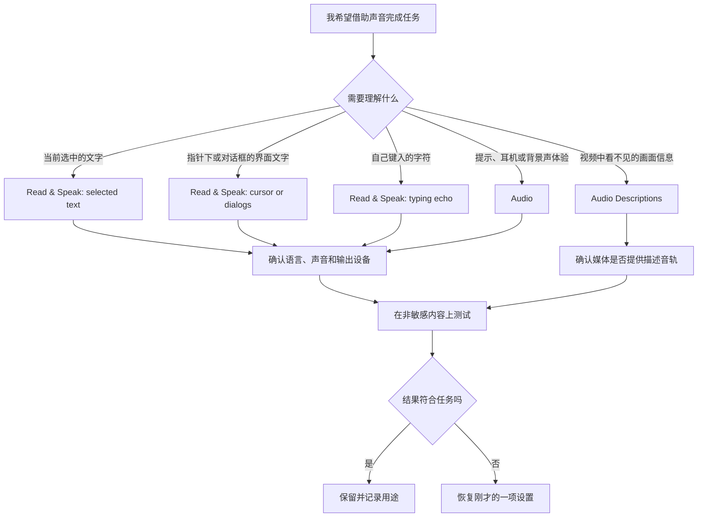

# 让声音服务阅读：朗读、系统语音、声音提示与音频描述

系统里出现 `Speak`、`Speech`、`Audio`、`Sound`、`Voice` 和 `Descriptions` 时，很容易把它们全部归成“声音设置”。实际上，它们回答的是不同问题：Read & Speak 让系统朗读文字；System voice 选择朗读所用语言、声音和语速；Audio 处理提示、单声道、耳机和背景声音；Audio Descriptions 在媒体原有音轨之外补充对视觉内容的口头描述。选错入口，往往不是英语词不会，而是没有先分清声音的来源、对象和输出目的。

> [!warning] 朗读会让屏幕文字进入周围环境
>
> 系统朗读、键入回声、对话框提示和音频描述都可能从扬声器或耳机输出可听内容。处理密码、验证码、私人聊天、会议资料、身份信息或共享屏幕时，先确认输出设备、音量和周围环境。辅助功能改善访问方式，不会自动降低内容的隐私级别。

## 学习目标

本篇完成后，你能说明 Read & Speak 与 VoiceOver 的区别，按任务选择选中文本朗读、指针下朗读、对话框朗读或键入回声；理解系统语音中的语言、声音、速度、音高和音量；区分 Audio、Sound 与 Audio Descriptions；完成两组可恢复测试，并用英语描述声音功能的条件和结果。

## 先回答“什么内容由谁读出来”

| 你需要的结果 | 优先入口 | 朗读或处理的对象 | 不应误解为 |
| --- | --- | --- | --- |
| 听一段已选中的文字 | `Read & Speak` 的 selected text 功能 | 你主动选定的文本。 | 开启完整屏幕阅读。 |
| 让当前指针下的文字被读出 | `Read & Speak` 的 cursor 功能 | 指针下可识别的词或文字。 | 每次鼠标移动都安全无影响。 |
| 在操作对话框时得到声音提醒 | `Read & Speak` 的 dialogs 朗读 | 系统或 App 对话框文字。 | 自动替你确认对话框。 |
| 知道键入了什么 | `Read & Speak` 的 typing echo | 按下的键与键入字符。 | 听写或语音输入。 |
| 改变系统朗读方式 | `System speech language`、`System voice` | 朗读所用语言与声音。 | 改变整个 Mac 的界面语言。 |
| 改善听觉接收或耳机体验 | `Audio` | 警报、声道、耳机与背景声音。 | 所有媒体音质都会变好。 |
| 听懂视频中的视觉信息 | `Audio Descriptions` | 支持描述音轨的媒体。 | 自动为所有视频生成准确解说。 |

这张表中最重要的是“对象”。`Hear selected text spoken aloud` 的对象是被选择的文字；`Mac will speak the words under the cursor` 的对象是光标下文字；`Audio descriptions provide a spoken description of visual content in media` 的对象是媒体里的视觉内容。即使它们都从扬声器播放，功能的输入和风险都不同。

## 操作路径和恢复策略

朗读功能路径为 **Apple menu → System Settings → Accessibility → Vision → Read & Speak**。Audio 路径是 **Accessibility → Hearing → Audio**；Audio Descriptions 路径是 **Accessibility → Vision → Audio Descriptions**。同一个 `Audio` 词出现在多个位置时，不要只凭侧边栏位置猜测，而要读页面标题和说明句：Hearing 下的 Audio 侧重接收声音，Vision 下的 Audio Descriptions 侧重让视觉内容被声音描述。

开始前记录三个状态：当前输出是扬声器还是耳机；相关开关目前是 on 还是 off；音量是否适合测试。测试场景选择一段公开、短小、非私人文字。若声音输出不符合预期，先停止或关闭刚开启的单一功能，再检查输出设备和音量；不要在不确定时连续调整 Voice、Audio、Sound 和系统总音量。

> [!tip] `spoken aloud` 是完整意思
>
> `spoken aloud` 指“被出声读出来”。`aloud` 不是“声音很大”，而是强调文字从静默文本变为可听语音。要表达“请不要在公开场合朗读”，可说 `Do not have the Mac speak the text aloud in a public place.`

## 界面实例：Read & Speak 将声音反馈按场景拆分

> 本机截图未包含在公开版本中，以保护原图中的个人信息。

本机辅助功能文本确认 Read & Speak 页面包含 Accessibility Reader、选中文本朗读、指针下朗读、对话框动作提示、键入回声、System speech language、System voice、Detect languages 与 Pronunciations。以下保留稳定英语，不将当前声音名称、语言选择或个人配置写入学习结论。

| 完整界面表达 | 软件语境中文 | 控件类型 | 启用或进入后的意义 |
| --- | --- | --- | --- |
| `Read or listen to text in the Accessibility Reader app and customize fonts, layout, and background colors.` | 在 Accessibility Reader 中阅读或聆听文字，并自定义字体、布局和背景颜色。 | 开关说明。 | 进入辅助阅读器相关能力，不等同于 VoiceOver。 |
| `Press ⌘Esc to turn on and use Accessibility Reader.` | 按 Command-Esc 开启并使用 Accessibility Reader。 | 快捷键说明。 | 一种启动方式，需先确认没有快捷键冲突。 |
| `Hear selected text spoken aloud.` | 听取所选文字的朗读。 | 开关说明。 | 朗读你主动选中的文本。 |
| `Select Speech > Start Speaking in the Quick Actions menu, or use a keyboard shortcut.` | 在快速操作菜单中选择 Speech > Start Speaking，或使用键盘快捷键。 | 操作说明。 | 给出菜单路径和替代触发方式。 |
| `Mac will speak the words under the cursor.` | Mac 会朗读光标下的文字。 | 开关说明。 | 指针经过可识别文字时提供朗读。 |
| `Mac will speak the text in dialogs and notify you when you need to perform an action in an app.` | Mac 会朗读对话框中的文字，并在你需要在 App 中执行操作时通知你。 | 开关说明。 | 朗读提示，仍需由你决定怎样操作。 |
| `Mac will speak the keys you press and the characters you type.` | Mac 会朗读你按下的按键和键入的字符。 | 开关说明。 | 对键盘输入提供声音回声。 |
| `System speech language` | 系统朗读语言。 | 弹出菜单。 | 选择朗读处理使用的语言规则。 |
| `System voice` | 系统语音。 | 弹出菜单。 | 选择用于语音输出的声音。 |
| `Detect languages` | 检测语言。 | 开关。 | 让系统在支持场景中识别文字语言。 |
| `Pronunciations` | 发音规则。 | 开关。 | 管理特定词语的读音处理。 |

`Mac will speak the text in dialogs and notify you when you need to perform an action in an app.` 包含两个并列动作：系统朗读对话框文字，以及在你需要执行动作时通知你。`will speak` 与 `notify` 描述的是信息反馈，不代表系统会点击按钮、替你填写内容或做出决定。`when you need to perform an action` 里的 `perform` 是执行，`action` 是操作；整段适合记成“需要我操作时系统会提示我”。

### 本页全部单词

| 单词 | 音标 | 词性 | 本页含义 | 所在完整表达 |
| --- | --- | --- | --- | --- |
| read | /riːd/ | v. | 阅读。 | `Read or listen` |
| listen | /ˈlɪsən/ | v. | 聆听。 | `listen to text` |
| text | /tekst/ | n. | 文字、文本。 | `selected text` |
| customize | /ˈkʌstəmaɪz/ | v. | 自定义、按偏好调整。 | `customize fonts` |
| fonts | /fɑːnts/ | n.复数 | 字体。 | `customize fonts` |
| layout | /ˈleɪaʊt/ | n. | 布局。 | `fonts, layout` |
| background | /ˈbækɡraʊnd/ | n. | 背景。 | `background colors` |
| selected | /sɪˈlektɪd/ | adj. | 已选中的。 | `selected text` |
| speech | /spiːtʃ/ | n. | 语音、朗读。 | `Speech > Start Speaking` |
| quick | /kwɪk/ | adj. | 快速的。 | `Quick Actions` |
| actions | /ˈækʃənz/ | n.复数 | 操作、动作。 | `Quick Actions menu` |
| cursor | /ˈkɜːrsər/ | n. | 光标；此处指指针所指位置。 | `under the cursor` |
| dialogs | /ˈdaɪəlɔːɡz/ | n.复数 | 对话框。 | `text in dialogs` |
| notify | /ˈnoʊtɪfaɪ/ | v. | 通知、提示。 | `notify you` |
| perform | /pərˈfɔːrm/ | v. | 执行。 | `perform an action` |
| keys | /kiːz/ | n.复数 | 按键。 | `keys you press` |
| characters | /ˈkærəktərz/ | n.复数 | 字符。 | `characters you type` |
| detect | /dɪˈtekt/ | v. | 检测、识别。 | `Detect languages` |
| pronunciations | /prəˌnʌnsiˈeɪʃənz/ | n.复数 | 发音规则、读音。 | `Pronunciations` |

## 从选中文本开始：朗读一段公开文字

对于刚开始使用系统朗读的人，`Hear selected text spoken aloud` 通常是风险最小的起点，因为输入范围由你选定。它比指针下朗读更容易预测，也比键入回声更不容易意外读出输入内容。菜单路径 `Speech > Start Speaking` 使用 `>` 表示层级：先打开 Speech，再执行 Start Speaking。看到这种符号时，应按“上级菜单到下级命令”理解。

### 案例一：朗读一段公开文本并安全停止

**情境**：你在学习一段英文说明，想听它的断句和整体语气，而不是开启整套屏幕阅读。

1. 进入 **Accessibility → Vision → Read & Speak**，确认选中文本朗读相关开关的当前状态。
2. 选择一个公开的短文本，例如本讲义的一句英文或系统帮助中的说明，不选择密码、私人消息或网页表单内容。
3. 按页面说明从 `Quick Actions` 的 `Speech` 菜单选择 `Start Speaking`，或使用你已经确认的快捷键。
4. 听完后使用同一菜单中的停止操作或撤销当前朗读，确认声音已经停止。
5. 如果声音太快、语言不合适或输出设备不对，不要连续改动多项设置；先回到 Read & Speak，检查 System speech language 与 System voice。
6. 用英语复述：`I selected a short public sentence and used Start Speaking. I stopped the speech after checking the pronunciation and output device.`

**恢复**：如果该功能只是一次性从菜单启动，停止朗读即可；如果你为测试打开了某个常驻开关，回到同一页恢复开始时的状态。测试完成后再次选一段短文本，确认不会自动朗读不需要的内容。

## System speech language、System voice 与发音并非同一项

`System speech language` 决定系统朗读按哪种语言规则处理文字；`System voice` 是声音角色或声音资源；`Detect languages` 尝试识别不同文本的语言；`Pronunciations` 用于特定词语读音。它们共同影响听起来是否自然，但分别处理语言、声音、自动判断和个别例外。把声音名称换成另一个，并不等于界面语言、键盘输入法或所有 App 内容同时被翻译。

> 本机截图未包含在公开版本中，以保护原图中的个人信息。

本机 System voice 页展示 `Voice`、`Rate`、`Pitch`、`Speech Volume`、`Play`、`Done` 和 `Reset Voice Settings`。页面具体语言列表、已下载声音及当前值会随系统版本和本机资源变化，学习时关注参数名称与用途，不把动态列表当成固定词表。

| 表达 | 中文解释 | 修改时要注意 |
| --- | --- | --- |
| `Voice` | 语音声音。 | 先试听，再决定是否保留。 |
| `Rate` | 语速。 | 过快会难以理解，过慢会影响连贯性。 |
| `Pitch` | 音高。 | 改变声音高低，不等于改变语言或清晰度。 |
| `Speech Volume` | 朗读音量。 | 与系统总音量、输出设备一起检查。 |
| `Play` | 播放试听。 | 只播放示例，不能代表所有文本读法。 |
| `Done` | 完成。 | 确认当前选择并关闭该面板。 |
| `Reset Voice Settings` | 重置语音设置。 | 恢复声音相关默认值，使用前先确认影响。 |
| `Reverts all voice changes to defaults.` | 将所有语音更改恢复为默认值。 | 说明重置范围是声音设置，而非整台 Mac。 |

`Rate` 是速度或频率，在语音页中指每分钟说话的快慢；`Pitch` 指音高；`Speech Volume` 指朗读输出的音量。需要调试时，一次只改一个：例如先保持语言和声音不变，只轻微调整 Rate，再播放样本。这样才知道变化来自语速，而不是声音选择或音量。

> [!warning] 不要把 Reset 当作试错按钮
>
> `Reset Voice Settings` 的说明明确说会还原所有语音更改。它适合在你确实希望回到默认语音参数时使用，不适合为了找回一个未知滑块而随手点击。若你有已调好的声音、语言或语速，先记录当前值或用试听确认，再决定是否重置。

## 指针下朗读、对话框朗读与键入回声的边界

`Mac will speak the words under the cursor` 在阅读密集页面时可以帮助你核对某个词，但也可能在你移动指针时产生频繁声音。`Mac will speak the text in dialogs` 更适合不便持续阅读弹窗时接收提示；它不会替你做选择。`Mac will speak the keys you press and the characters you type` 是键入回声，能确认输入，却可能把私人输入暴露给旁人。

| 功能 | 推荐的测试内容 | 需要避免的内容 | 关闭后验证 |
| --- | --- | --- | --- |
| 指针下朗读 | 系统设置中的公开标签。 | 密码字段、私人文件名、聊天窗口。 | 移动指针时不再意外发声。 |
| 对话框朗读 | 可取消的普通系统提示。 | 支付、删除、登录或权限确认。 | 对话框出现时不再自动朗读。 |
| 键入回声 | 离线测试文本。 | 密码、验证码、账号、私信。 | 键入时不再读出字符。 |

### 案例二：安全测试一个声音反馈，再恢复

**情境**：你经常错过普通提示，想了解对话框朗读是否有帮助，但不想让系统在所有敏感场景自动发声。

1. 在 Read & Speak 页记录 dialog 朗读的初始状态，并把输出音量调到周围环境可接受的水平。
2. 只在安全的系统页面打开一个可取消提示，确认朗读是否帮助你理解“系统正在等待我的操作”。
3. 不在权限、删除、付款、登录或系统更新对话框中测试，因为这些内容可能涉及重要决定或个人资料。
4. 测试完成后回到 Read & Speak，关闭刚才启用的 dialog 朗读选项，或恢复为原状态。
5. 再触发一次普通、无敏感内容的对话框，确认没有继续朗读。
6. 用英语说明：`I tested spoken dialog alerts on a non-sensitive prompt. They informed me that an action was required, but I still had to read the choices and decide what to do.`

## Audio：声音接收、耳机和背景声音

Accessibility 的 `Audio` 页不等于常规 Sound 设置。其本机文本包含 `Flash the screen when an alert sound occurs`、`Play stereo audio as mono`、`Spatial audio follows head movements`、Background Sounds、Headphone Accommodations 和通向 `Sound Settings…` 的按钮。它的主题是让提示与音频更容易被接收、理解或减轻干扰。

> 本机截图未包含在公开版本中，以保护原图中的个人信息。

| 完整表达 | 软件语境中文 | 适用判断 | 不能据此保证 |
| --- | --- | --- | --- |
| `Flash the screen when an alert sound occurs` | 警报声音出现时闪烁屏幕。 | 容易错过声音提示时。 | 所有提醒都能被注意到。 |
| `Play stereo audio as mono` | 将立体声音频作为单声道播放。 | 需要把左右声道信息合并时。 | 所有耳机问题都会解决。 |
| `Spatial audio follows head movements` | 空间音频跟随头部移动。 | 使用支持的耳机且想要这种体验时。 | 每个媒体都支持空间音频。 |
| `Background Sounds` | 背景声音。 | 想用稳定环境声减少干扰时。 | 能隔绝所有环境噪声。 |
| `Personalize your listening experience to minimize distractions.` | 个性化你的聆听体验以减少干扰。 | 需要调节听觉环境时。 | 对每个人和每个环境都有效。 |
| `Turn off background sounds automatically with lock screen and screen saver modes.` | 在锁定屏幕和屏幕保护程序模式下自动关闭背景声音。 | 不希望离开电脑后继续播放时。 | 取代手动检查音频输出。 |
| `Customize Audio` | 自定义音频。 | 耳机适配支持时。 | 会自动生成最优参数。 |

`when an alert sound occurs` 中的 `occurs` 是“发生、出现”，不是“发出命令”。`as mono` 表示“以单声道方式”，不是把录音文件永久转换为单声道。`minimize distractions` 是“尽量减少干扰”，比“消除所有噪声”更准确。系统说明经常用 `minimize`，它表达降低程度而非绝对保证。

> [!tip] Background Sounds 与总音量分开理解
>
> Background Sounds 是一种辅助听觉环境，不等于系统总音量。页面中的 `Sound Settings…` 明确指向常规声音设置。若听不到朗读或背景声，应先分开检查功能开关、应用或系统音量、输出设备和耳机连接，而不是只增加一个滑块。

## Audio Descriptions：为视觉内容补上语言信息

> 本机截图未包含在公开版本中，以保护原图中的个人信息。

页面说明为 `Audio descriptions provide a spoken description of visual content in media.`。这里 `provide` 是提供，`spoken description` 是口头描述，`visual content` 是媒体中的视觉内容。它描述的是当媒体提供相应描述音轨时，系统可以使用该音轨帮助你理解画面；它并没有说系统会自动、完整、无误地解释任意视频。

| 词组 | 应理解为 | 不应理解为 |
| --- | --- | --- |
| `audio descriptions` | 媒体的音频描述轨或描述性朗读。 | 视频自带字幕。 |
| `visual content` | 画面中需要看见才能理解的信息。 | 所有音频内容。 |
| `in media` | 在电影、节目或其他媒体中。 | 仅限某一种播放 App。 |
| `provide` | 提供、使可用。 | 保证系统自行生成。 |
| `spoken description` | 用声音说出的画面描述。 | 屏幕阅读器对界面的朗读。 |

如果播放内容没有提供描述音轨，打开系统选项也不一定听到额外描述。遇到这种情况，不应反复调整 System voice 或 Background Sounds；应先检查当前播放 App、媒体本身的音轨与辅助选项是否支持描述。

## 可直接使用的英语表达

| 你想表达的意思 | 英文表达 | 使用要点 |
| --- | --- | --- |
| 我只需要朗读选中的文字。 | `I only need the selected text to be spoken aloud.` | 明确范围是 selected text。 |
| 这个功能会读出我键入的字符。 | `This feature speaks the characters I type.` | 说明 typing echo 的隐私边界。 |
| 我先检查输出设备和音量。 | `I will check the output device and volume first.` | 排查没有声音时的第一步。 |
| 系统语音与界面语言不同。 | `The system voice is separate from the interface language.` | 避免将朗读语言误认为界面翻译。 |
| 这项设置可能只在支持的媒体中起作用。 | `This setting may work only with supported media.` | `may` 与 `only` 保留功能边界。 |
| 我测试后关闭了声音反馈。 | `I turned off the spoken feedback after the test.` | `spoken feedback` 指朗读提示。 |
| 这个对话框需要我决定下一步。 | `This dialog requires me to decide what to do next.` | 朗读不等于自动决策。 |

## 本篇自测

1. Read & Speak 与 VoiceOver 的核心区别是什么？
2. `Hear selected text spoken aloud` 的输入范围由谁决定？
3. System speech language、System voice 和 Detect languages 分别处理什么？
4. 为什么不要在私人输入时随意开启 typing echo？
5. `Play stereo audio as mono` 改变的是哪一类声音呈现？
6. Audio Descriptions 为什么不能保证为每个视频自动生成解说？
7. 用英语表达：“系统提醒我需要操作，但不会替我选择。”

查看答案

1. Read & Speak 针对选中文本、指针文字、对话框或键入等特定声音反馈；VoiceOver 是访问整个界面的屏幕阅读与导航方式。
2. 由用户主动选中的文字决定。
3. System speech language 处理朗读语言规则；System voice 选择输出声音；Detect languages 尝试识别文本语言。
4. 键入回声会读出按键和字符，可能让密码、验证码、账号或私人文字被周围的人听到。
5. 立体声音频的声道呈现方式；它不永久转换原始媒体文件。
6. Audio Descriptions 依赖媒体和播放环境是否提供相应描述音轨，系统设置本身不生成全部画面解释。
7. `The system tells me that an action is required, but it does not choose for me.`

## 版本差异与参考来源

本篇以本机 **macOS 27.0 Beta (26A5425a)** 的 Read & Speak、Audio、Audio Descriptions 与 System voice 页面截图、辅助功能文本为准。声音名称、语言资源、耳机选项与媒体支持会随设备、已下载资源、区域和 macOS 版本变化。可参考 Apple 的 [Read & Speak guide](https://support.apple.com/guide/mac-help/mchlp2716/mac)、[Audio accessibility guide](https://support.apple.com/guide/mac-help/change-audio-settings-mh43190/mac) 与 [Accessibility settings guide](https://support.apple.com/guide/mac-help/change-accessibility-settings-mh43185/mac)。公开说明补充原理，不替代本机页面的实际选项和版本边界。
