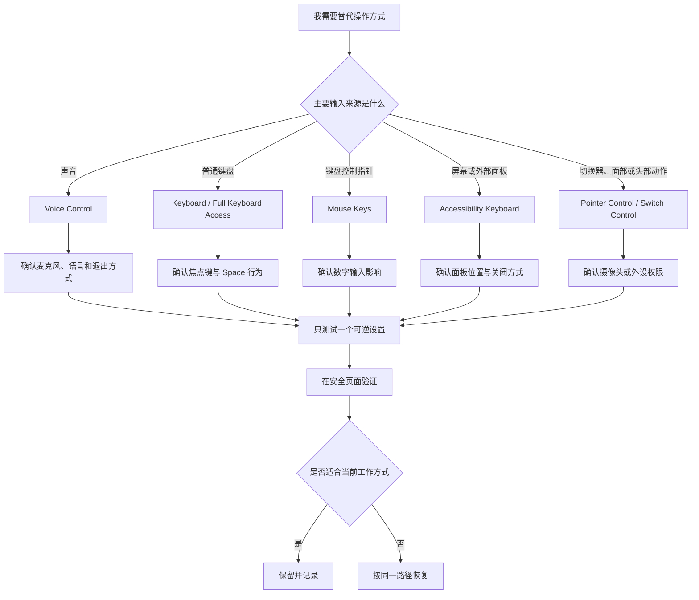

# 用替代方式完成操作：语音控制、辅助键盘与指针控制

鼠标、触控板和普通键盘并不是操作 Mac 的唯一途径。Accessibility 的 `Voice Control`、`Keyboard` 与 `Pointer Control` 提供了替代输入路径：用声音编辑与点击，用键盘焦点访问界面，用屏幕键盘或辅助方式输入，或用键盘、切换器、面部表情和头部移动控制指针。它们的共同目标是让意图能够被系统接收；它们的风险也相似：一旦不了解触发方式、退出方式和权限范围，输入可能不符合预期，甚至在不合适的场景中被误触发。

> [!warning] 先准备退出路径，再启用替代控制
>
> Voice Control 会使用麦克风并识别命令；Full Keyboard Access 会改变 Tab、方向键与 Space 的导航方式；Head Pointer 需要摄像头捕捉头部移动。第一次测试必须在私密、无敏感内容的页面进行，先记住开关位置、原状态和如何关闭。不要在授权弹窗、付款、远程协助、正在共享屏幕或编辑未保存文稿时启动。

## 学习目标

完成本篇后，你能够根据任务选择 Voice Control、Full Keyboard Access、Sticky Keys、Slow Keys、Accessibility Keyboard、Mouse Keys、替代鼠标按钮或 Head Pointer；读懂各页面的完整说明；理解语音数据同意、麦克风、摄像头和输入权限的边界；完成两组可恢复操作案例；并能用英语准确说明某项控制方式的输入、行为和恢复步骤。

## 先选“输入来源”，不要先选功能名

| 你希望怎样下达操作 | 主要入口 | 系统接收什么 | 最先核对的风险 |
| --- | --- | --- | --- |
| 用口头命令编辑或控制界面 | `Voice Control` | 麦克风捕捉到的语音。 | 是否会在会议、旁人谈话或共享空间误识别。 |
| 用 Tab、方向键和 Space 完成界面访问 | `Keyboard` 的 Full Keyboard Access | 键盘焦点和导航键。 | 常用 Tab、方向键与快捷键行为会变化。 |
| 不必一直按住修饰键 | `Sticky Keys` | 单次按下的 modifier keys。 | 快捷键执行时机是否符合预期。 |
| 避免误按键立即生效 | `Slow Keys` | 按键按下持续时间。 | 输入速度与确认延迟是否可接受。 |
| 用屏幕控制面板输入与交互 | `Accessibility Keyboard` | 屏幕键盘、面板或替代输入。 | 面板遮挡和退出方法。 |
| 用数字键盘控制指针 | `Mouse Keys` | 键盘键或数字小键盘。 | 普通数字输入是否受影响。 |
| 用外部切换器或面部表情替代点击 | alternate mouse buttons | 切换器、面部动作或配置动作。 | 误触发与摄像头授权范围。 |
| 用头部移动控制指针 | `Head Pointer` | 摄像头中的头部运动。 | 摄像头权限、疲劳和稳定性。 |

同一目标“少用鼠标”可能对应多条路径。能稳定使用键盘时，Full Keyboard Access 或 Mouse Keys 通常比摄像头方案更直接；手部动作不方便但说话环境私密时，Voice Control 可能更合适；需要外部设备输入时，Switch Control 和替代鼠标按钮才是更相关的页面。不要因为某项功能看起来高级就优先选择它。

## 路径、权限和测试环境

路径分别是 **System Settings → Accessibility → Physical and Motor → Voice Control**、**Keyboard** 和 **Pointer Control**。这些入口同属 Physical and Motor，表示它们重点处理完成动作的途径，不表示它们能诊断或修复硬件问题。页面中出现的 Language、Microphone、Commands、Vocabulary、Keyboard Settings、Trackpad Options、Mouse Options 等按钮会进入更具体的配置；第一次学习应先读说明，再决定是否进入。

测试页面应满足三个条件：没有私人文本；操作可随时取消；不会触发不可逆动作。系统设置首页、本地测试文档或无敏感内容的帮助页面通常比登录、权限、支付、删除或发送页面更合适。听到错误声音、看到意外焦点或指针移动时，第一动作是关闭刚启动的那项功能，而不是再打开另一项补救。

## 界面实例：Voice Control 是界面控制，不只是语音输入

> 本机截图未包含在公开版本中，以保护原图中的个人信息。

本机辅助功能文本将 Voice Control 描述为：`Voice Control allows you to use your voice to edit text and interact with your computer even when you are on calls.` 这句话给出两个能力：编辑文字和与电脑交互；同时说明“即使在通话中”。后半句不是保证它在任何噪声环境都准确，也不是建议在所有通话时都开启。它提醒你 Voice Control 会持续关注语音命令，因此更要审查场景、麦克风和误触风险。

| 完整界面表达 | 软件语境中文 | 控件类型 | 使用时要核对什么 |
| --- | --- | --- | --- |
| `Voice Control allows you to use your voice to edit text and interact with your computer even when you are on calls.` | Voice Control 允许你使用声音编辑文字并与电脑交互，即使正在通话。 | 开关说明。 | 命令识别、麦克风来源和周围环境。 |
| `Language` | 语言。 | 弹出菜单。 | 语音命令使用的语言是否适合当前口语。 |
| `Microphone` | 麦克风。 | 弹出菜单。 | 是否选择正确输入设备，是否会接收外部声音。 |
| `Show hints` | 显示提示。 | 开关。 | 是否需要界面可见提示辅助学习命令。 |
| `Play sound when command is recognized` | 命令被识别时播放声音。 | 开关。 | 声音是否会在共享空间造成干扰。 |
| `Overlay` | 覆盖层。 | 弹出菜单。 | 屏幕上的命令或编号提示如何显示。 |
| `Fade overlay after inactivity` | 无操作一段时间后淡出覆盖层。 | 开关。 | 覆盖层何时减少可见度。 |
| `Open Tutorial…` | 打开教程。 | 按钮。 | 在真实命令前练习控制逻辑。 |
| `Commands…` | 命令。 | 按钮。 | 查看、管理或学习可用语音命令。 |
| `Vocabulary…` | 词汇表。 | 按钮。 | 添加或理解专用词的识别处理。 |
| `Options…` | 选项。 | 菜单按钮。 | 查看额外操作与偏好。 |

页面还包含一段重要的同意说明：`Help Apple improve assistive voice features by sharing audio recordings and transcripts of your Vocal Shortcuts and Voice Control interactions. This information is sent only with your consent and is submitted anonymously to Apple.` 这里的 `with your consent` 表示“经你同意”，不是已经自动共享；`audio recordings and transcripts` 是音频录音和文字转写；`submitted anonymously` 指以匿名方式提交。是否参与应基于你对数据范围、使用环境和个人偏好的理解，而不能因为它被放在辅助功能页就默认开启。

### 本页全部单词

| 单词 | 音标 | 词性 | 本页含义 | 所在完整表达 |
| --- | --- | --- | --- | --- |
| allows | /əˈlaʊz/ | v. | 允许。 | `allows you to use` |
| voice | /vɔɪs/ | n. | 声音、语音。 | `use your voice` |
| edit | /ˈedɪt/ | v. | 编辑。 | `edit text` |
| interact | /ˌɪntərˈækt/ | v. | 交互、操作互动。 | `interact with your computer` |
| computer | /kəmˈpjuːtər/ | n. | 电脑。 | `your computer` |
| calls | /kɔːlz/ | n.复数 | 通话。 | `on calls` |
| microphone | /ˈmaɪkrəfoʊn/ | n. | 麦克风。 | `Microphone` |
| hints | /hɪnts/ | n.复数 | 提示。 | `Show hints` |
| recognized | /ˈrekəɡnaɪzd/ | v-ed | 被识别。 | `command is recognized` |
| overlay | /ˈoʊvərleɪ/ | n. | 覆盖层。 | `Overlay` |
| fade | /feɪd/ | v. | 淡出、逐渐变弱。 | `Fade overlay` |
| inactivity | /ˌɪnækˈtɪvəti/ | n. | 无操作状态。 | `after inactivity` |
| tutorial | /tuːˈtɔːriəl/ | n. | 教程。 | `Open Tutorial` |
| commands | /kəˈmændz/ | n.复数 | 命令。 | `Commands` |
| vocabulary | /voʊˈkæbjəleri/ | n. | 词汇表。 | `Vocabulary` |
| consent | /kənˈsent/ | n. | 同意。 | `with your consent` |
| recordings | /rɪˈkɔːrdɪŋz/ | n.复数 | 录音。 | `audio recordings` |
| transcripts | /ˈtrænskrɪpts/ | n.复数 | 转写文本。 | `transcripts` |
| anonymously | /əˈnɑːnɪməsli/ | adv. | 匿名地。 | `submitted anonymously` |

> [!warning] 语音数据同意需要单独判断
>
> “只在同意后发送”和“匿名提交”描述的是页面声明的边界，不代表你不需要理解自己正在同意什么。准备启用前应阅读当前版本说明，确认它涉及的功能、音频、转写和提交范围；不确定时保持关闭并继续使用不依赖该同意的功能。

### 案例一：只读学习 Voice Control 命令模型

**情境**：你希望未来可以用声音操作系统，但还不确定自己的口语环境、麦克风和命令记忆是否适合。

1. 打开 **Accessibility → Physical and Motor → Voice Control**，记录总开关的状态。
2. 阅读 Language、Microphone、Show hints、Overlay 和 `Play sound when command is recognized` 的说明，确认它们分别处理语言、输入设备、提示、覆盖层和识别反馈。
3. 点击 `Open Tutorial…`，在系统教程中理解命令、焦点和提示的工作方式，不急于在普通桌面上试发命令。
4. 再打开 `Commands…`，区分系统已有命令与自己可能需要记忆的口头表达。
5. 不开启共享音频与转写的同意开关，除非你已阅读并决定接受它的当前说明。
6. 用英语概括：`I reviewed the language, microphone, hints, and commands before enabling Voice Control, because voice recognition can affect the way I interact with the computer.`

**验证与恢复**：你应能说明 `Open Tutorial…` 和 `Commands…` 的不同用途。整个案例不需要开启 Voice Control，因此无配置恢复；若误打开子页，可用 `Go Back` 返回，不要改变不理解的开关。

## Keyboard：焦点访问、修饰键与屏幕键盘分别解决不同问题

> 本机截图未包含在公开版本中，以保护原图中的个人信息。

Keyboard 页中的 Full Keyboard Access 说明列出 `To show help: Tab H`、`To move forward: Tab`、`To move backward: ⇧ Tab`、`To activate: Space`、以及用方向键在组内移动。它让键盘焦点覆盖更多界面项目。`To activate: Space` 意味着 Space 可能触发当前焦点对象，因此首次开启时不要在可能执行删除、确认或提交的按钮附近盲目按空格。

| 完整界面表达 | 软件语境中文 | 它实际改变什么 |
| --- | --- | --- |
| `To move forward: Tab` | 向前移动：Tab。 | 焦点前进。 |
| `To move backward: ⇧ Tab` | 向后移动：Shift-Tab。 | 焦点后退。 |
| `To activate: Space` | 激活：空格。 | 对当前焦点对象执行激活。 |
| `To move inside groups: ↑, ↓, ←, and →` | 在组内移动：方向键。 | 在控件组中切换焦点。 |
| `Sticky Keys allows modifier keys to be set without having to hold the key down.` | 粘滞键让修饰键无需一直按住即可设定。 | Command、Option、Control、Shift 等修饰键的按住方式。 |
| `Slow Keys adjusts the amount of time between when a key is pressed and when it is activated.` | 慢速键调整按键按下与被激活之间的时间。 | 减少意外按键立即生效。 |
| `The Accessibility Keyboard lets you type and interact with macOS without using a hardware keyboard.` | 辅助键盘让你不使用物理键盘也能输入和操作 macOS。 | 屏幕键盘与交互面板。 |
| `Panel Editor…` | 面板编辑器。 | 编辑 Accessibility Keyboard 显示的面板。 |

`modifier keys` 是修饰键，单独按通常不输入普通字符，而与其他键组合改变命令含义。`without having to hold the key down` 不是“禁止按住”，而是“不必持续按住”。Sticky Keys 适合无法方便同时按多个键的情况；对已经习惯组合键的人，开启后可能改变操作节奏，因此应在安全页面测试。

`Slow Keys` 的说明中 `when a key is pressed` 是按键被按下的时刻，`when it is activated` 是系统把该键当成有效输入的时刻；中间的时间就是它调整的延迟。它不等于降低键盘硬件速度，也不应在需要快速输入验证码、游戏指令或紧急文字时盲目测试。

### 案例二：安全测试 Full Keyboard Access 并恢复

**情境**：你希望尽量用键盘完成系统设置导航，但担心 Tab 和 Space 的行为改变后会误触确认按钮。

1. 进入 **Accessibility → Physical and Motor → Keyboard**，记录 Full Keyboard Access 的初始状态。
2. 先阅读页面列出的 `Tab`、`Shift-Tab`、`Space` 和方向键规则，确认你知道 Space 会激活当前焦点。
3. 在无敏感内容的系统设置页面开启该功能，只用 Tab 在普通标题、按钮和列表之间移动；不让焦点停在删除、重置、授权或购买按钮上。
4. 用 Shift-Tab 练习返回，用方向键体验组内移动；确认你能通过视觉焦点或系统提示判断当前位置。
5. 测试完成后回到 Keyboard 页面，把开关恢复到初始状态，再确认 Tab 和 Space 已回到原有工作方式。
6. 用英语说明：`I tested keyboard focus navigation on a safe settings page. I restored the previous behavior after confirming how Tab, Shift-Tab, and Space worked.`

## Pointer Control：指针速度与替代控制方法必须区分

> 本机截图未包含在公开版本中，以保护原图中的个人信息。

Pointer Control 上半部分处理 `Double-click speed`、`Spring-loading`、内建触控板与外接鼠标的关系、Trackpad Options 和 Mouse Options。下半部分 `Alternate Control Methods` 才是 Mouse Keys、替代鼠标按钮和 Head Pointer。`Double-click speed` 调整的是两次点击之间系统认定为双击的时间窗口；它不是鼠标指针在屏幕上移动的速度。

| 完整界面表达 | 软件语境中文 | 需要留意的影响 |
| --- | --- | --- |
| `Double-click speed` | 双击速度。 | 双击识别的时间窗口。 |
| `Spring-loading` | 弹簧加载。 | 拖动文件停留在文件夹上时的打开行为。 |
| `Ignore built-in trackpad when mouse or wireless trackpad is present` | 当存在鼠标或无线触控板时忽略内建触控板。 | 可能暂时无法用内建触控板恢复操作。 |
| `Allows the pointer to be controlled using the keyboard keys or number pad.` | 允许使用键盘键或数字小键盘控制指针。 | Mouse Keys 可能影响数字键用途。 |
| `Allows a switch or facial expression to be used in place of mouse buttons or pointer actions like left-click and right-click.` | 允许用切换器或面部表情代替鼠标按钮或左键、右键等指针动作。 | 替代动作的映射与误触风险。 |
| `Allows the pointer to be controlled using the movement of your head captured by the camera.` | 允许用摄像头捕捉到的头部运动控制指针。 | 摄像头权限、姿势疲劳和环境隐私。 |

`in place of` 是“代替、取代”。在 `in place of mouse buttons` 中，切换器或面部表情不是增加一个装饰功能，而是用来替代点击行为。`captured by the camera` 是被动结构，说明头部运动由摄像头捕捉；启用前应明确审查摄像头权限，并在私密环境进行测试。

> [!warning] 不要在外接鼠标出现时先忽略内建触控板
>
> `Ignore built-in trackpad when mouse or wireless trackpad is present` 会影响你可用的恢复输入方式。第一次测试前应确认外接鼠标稳定可用、已知如何重新进入设置，并避免在外接设备电量低或连接不稳定时开启。若失去控制，先恢复可用输入设备，再按原路径关闭。

## 完整英语表达与搭配

| 你想表达的意思 | 可直接使用的英文 | 语言点 |
| --- | --- | --- |
| 我想用声音编辑文字。 | `I want to use my voice to edit text.` | `use … to + verb` 表目的。 |
| 命令被识别时会播放声音。 | `A sound will play when the command is recognized.` | `when` 表示触发条件。 |
| 我先查看教程，再开启这个功能。 | `I will open the tutorial before enabling this feature.` | `before + -ing` 表先后。 |
| 粘滞键让我不必一直按住修饰键。 | `Sticky Keys lets me use modifier keys without holding them down.` | `without + -ing` 表不需要做某事。 |
| 我用 Tab 将焦点移动到下一个项目。 | `I moved focus to the next item with Tab.` | `move focus to` 是界面导航搭配。 |
| 这个方法会使用摄像头捕捉头部运动。 | `This method uses the camera to capture head movement.` | `capture` 在此是捕捉输入。 |
| 我只测试了一个可恢复的控制方式。 | `I tested only one reversible control method.` | `reversible` 表可恢复。 |

## 本篇自测

1. Voice Control 为什么不仅是“语音输入”？
2. `Play sound when command is recognized` 的触发条件是什么？
3. Full Keyboard Access 中 Space 的作用是什么？为什么要谨慎测试？
4. Sticky Keys 与 Slow Keys 分别改变什么？
5. Mouse Keys 与 Double-click speed 的输入对象有何不同？
6. `in place of mouse buttons` 应怎样理解？
7. 请用英语表达：“我先确认退出方式，再用安全页面测试。”

查看答案

1. 它可以用声音编辑文字并与电脑界面交互，涉及命令、焦点、麦克风和控制行为。
2. 命令被系统识别时。
3. Space 激活当前焦点对象；若焦点在确认、删除或授权按钮上，可能执行重要动作，所以应在安全页面学习。
4. Sticky Keys 让修饰键不必持续按住；Slow Keys 调整按下按键到系统激活它之间的时间。
5. Mouse Keys 使用键盘或数字小键盘控制指针；Double-click speed 调整鼠标双击识别窗口。
6. 表示用切换器或面部表情替代鼠标点击、左键或右键等动作。
7. `I will confirm the exit method first and then test it on a safe page.`

## 版本差异与参考来源

本篇根据本机 **macOS 27.0 Beta (26A5425a)** 的 Voice Control、Keyboard 与 Pointer Control 页面、截图和辅助功能文本编写。语言、麦克风、硬件键盘、外接设备与权限状态会影响可见选项；后续版本也可能调整命令和面板。可参考 Apple 的 [Voice Control guide](https://support.apple.com/guide/mac-help/use-voice-control-mchleee9b3eb/mac)、[Keyboard accessibility guide](https://support.apple.com/guide/mac-help/use-your-keyboard-to-control-your-mac-mchlc1e033b3/mac) 和 [Pointer Control guide](https://support.apple.com/guide/mac-help/change-pointer-control-settings-mchlp2700/mac)。公开说明解释原则，具体按钮和状态以本机页面为准。
