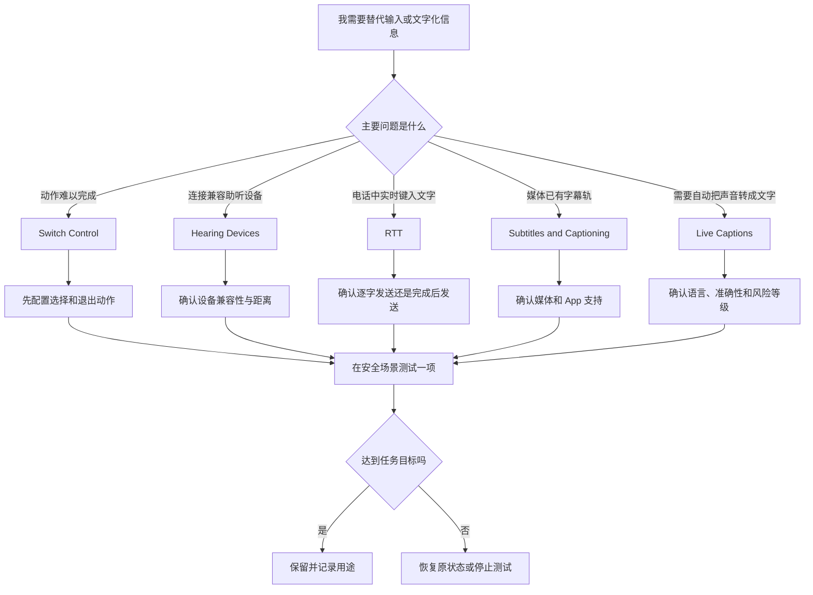

# 用切换器和文字接收信息：切换控制、助听设备、RTT 与字幕

声音、文字、外部设备和替代输入常被放在同一个“辅助功能”大类中，但它们解决的是不同方向的问题。Switch Control 用一个或多个切换器扫描并选择界面项目；Hearing Devices 负责与兼容助听设备配对；RTT 用实时文字完成兼容电话或中继通话；Subtitles and Captioning 决定媒体字幕的样式和自动显示条件；Live Captions 则将正在播放或正在说出的内容实时转写为字幕。先分清是“我怎样发出操作”还是“我怎样接收信息”，才能选对页面。

> [!warning] 实时文字不能替代关键确认
>
> Live Captions 页面明确说明准确性可能变化，且不应在高风险或紧急情形依赖。字幕、RTT 文字、声音识别和外部设备连接都可能受到语言、网络、设备支持、噪声、对方输入和系统版本影响。涉及紧急救援、医疗、身份、金额、地址、法律承诺或安全指令时，应使用可靠的原始沟通渠道和人工确认。

## 学习目标

本篇结束时，你能解释 Switch Control 的扫描模型，区分助听设备配对与普通 Bluetooth 配对，读懂 RTT 的逐字发送边界，选择字幕样式和自动字幕条件，理解 Live Captions 的本机处理与准确性警告，并能用两组安全案例测试一个可恢复功能而不改变通话、设备或高风险信息。

## 先按信息方向选入口

| 需要解决的任务 | 对应页面 | 输入或输出是什么 | 最重要的边界 |
| --- | --- | --- | --- |
| 用少量物理按钮或外部装置操作 Mac | `Switch Control` | 切换器、鼠标、键盘、手柄按钮或专用设备。 | 必须配置可用于选择与退出的动作。 |
| 连接兼容助听器或声音处理器 | `Hearing Devices` | 附近的 MFi 助听设备。 | 其他助听器仍需在 Bluetooth 设置中配对。 |
| 在兼容通话中用实时文字沟通 | `RTT` | 键入文字、电话或中继通话。 | 逐字发送可能在未写完时被对方看见。 |
| 看视频时显示字幕或 SDH | `Subtitles and Captioning` | 媒体提供的字幕、闭路字幕或辅助字幕。 | 取决于媒体与 App 是否提供。 |
| 将当前声音实时显示成文字 | `Live Captions` | 设备正在播放或接收的音频。 | 识别可能不准，不适合高风险场景。 |
| 教系统识别某个名字 | `Name Recognition` | 用户主动设置的名字。 | 不能视为所有环境声音的可靠监控。 |

`captions`、`subtitles` 和 `RTT` 都包含文字，却不是同一技术。字幕通常是媒体制作方提供的文本轨；RTT 是通信双方实时键入的文字；Live Captions 是系统将音频自动转写为即时文字。三者可能同屏出现，也可能各自失效，因此排查时不能只问“为什么没有字幕”，而要先问当前看的是什么内容、文字来自媒体还是来自实时转写、播放 App 是否支持。

## 路径和测试原则

相关路径位于 **System Settings → Accessibility**：Switch Control 在 **Physical and Motor**；Hearing Devices、RTT、Subtitles and Captioning、Live Captions 和 Name Recognition 在 **Hearing**。进入深层页面后，先读标题与说明，避免将 `Audio`、`RTT`、`Captions` 误认成普通 Sound 或 Network 设置。

测试时遵守三个约束：不输入真实电话号码、中继号码、账号或联系人数据；不连接不属于自己的设备；不在实际通话、紧急场景或共享屏幕时打开实时文字。可使用系统帮助页、公开视频片段或无敏感内容的本地文本作为验证材料。若功能结果不符合预期，先关闭刚测试的一个开关，而不是同时调整语言、麦克风、耳机、音量和字幕样式。

> [!tip] 先记录“文字从哪里来”
>
> 一个简单记录能避免很多混淆：`The subtitle comes from the media.`、`The caption is generated from live audio.` 或 `The text is sent by the other person through RTT.`。来源不同，准确性、隐私、延迟和恢复方法也不同。

## 界面实例：Switch Control 的核心是扫描与选择

> 本机截图未包含在公开版本中，以保护原图中的个人信息。

本机页面说明为：`Switch Control allows the computer to be controlled using one or more switches. These can be mouse, keyboard, gamepad buttons or dedicated devices.` 这里的 `switches` 不是页面上的普通开关，而是可被系统当作输入触发器的一个或多个切换器。它们可能来自鼠标、键盘、游戏手柄按钮或专用设备。系统会按设定扫描可选择的项目，再由切换器完成“移到下一项”“选择”或其他动作。

| 完整界面表达 | 软件语境中文 | 它要求你理解什么 |
| --- | --- | --- |
| `Switch Control allows the computer to be controlled using one or more switches.` | 切换控制允许使用一个或多个切换器控制电脑。 | 一个切换器可用于部分动作，多个切换器可分担导航和选择。 |
| `These can be mouse, keyboard, gamepad buttons or dedicated devices.` | 这些可以是鼠标、键盘、手柄按钮或专用设备。 | 输入来源不局限于某一种硬件。 |
| `Fade panel after inactivity` | 无操作一段时间后淡出面板。 | 面板可见性与无操作时间相关。 |
| `Allow platform switching to control your computer` | 允许平台切换控制电脑。 | 这是较深的控制范围，需先理解来源和恢复方式。 |
| `Show current text in keyboard panel` | 在键盘面板中显示当前文字。 | 输入反馈显示的位置。 |
| `Insert and remove spaces automatically` | 自动插入和删除空格。 | 系统是否协助处理空格。 |
| `Capitalize sentences automatically` | 自动将句首大写。 | 英文输入的自动大小写行为。 |
| `Add` | 添加。 | 新增一个切换器或配置项。 |
| `To turn off auto scan, add the “Move to Next Item” action first.` | 要关闭自动扫描，请先添加“移到下一项”动作。 | 先保证仍有手动前进方式，再关闭自动扫描。 |
| `Resume auto scanning after selection` | 选择后恢复自动扫描。 | 选中项目后扫描是否继续。 |
| `Reverse cursor direction after hitting edge` | 到达边缘后反转光标方向。 | 指针移动到边界时的方向行为。 |
| `Pointer precision` | 指针精度。 | 替代指针移动的精细程度。 |
| `Loops` | 循环次数。 | 扫描列表重复遍历的次数。 |

`To turn off auto scan, add the “Move to Next Item” action first.` 是一条恢复优先的说明。`turn off auto scan` 是关闭自动扫描；`add … first` 指必须先添加一个能移动到下一项的动作。原因很直接：如果自动扫描停止，而你又没有别的“前进”输入，可能无法继续到达目标。阅读这类页面时，先找出系统要求你“先做什么”，再考虑是否改变当前行为。

### 本页全部单词

| 单词 | 音标 | 词性 | 本页含义 | 所在完整表达 |
| --- | --- | --- | --- |
| switch | /swɪtʃ/ | n. | 切换器、输入触发器。 | `one or more switches` |
| controlled | /kənˈtroʊld/ | v-ed | 被控制。 | `computer to be controlled` |
| using | /ˈjuːzɪŋ/ | prep./v-ing | 使用。 | `using one or more` |
| mouse | /maʊs/ | n. | 鼠标。 | `mouse, keyboard` |
| keyboard | /ˈkiːbɔːrd/ | n. | 键盘。 | `keyboard … buttons` |
| gamepad | /ˈɡeɪmpæd/ | n. | 游戏手柄。 | `gamepad buttons` |
| dedicated | /ˈdedɪkeɪtɪd/ | adj. | 专用的。 | `dedicated devices` |
| devices | /dɪˈvaɪsɪz/ | n.复数 | 设备。 | `dedicated devices` |
| fade | /feɪd/ | v. | 淡出。 | `Fade panel` |
| inactivity | /ˌɪnækˈtɪvəti/ | n. | 无操作状态。 | `after inactivity` |
| insert | /ɪnˈsɜːrt/ | v. | 插入。 | `Insert spaces` |
| remove | /rɪˈmuːv/ | v. | 移除。 | `remove spaces` |
| automatically | /ˌɔːtəˈmætɪkli/ | adv. | 自动地。 | `automatically` |
| capitalize | /ˈkæpɪtəlaɪz/ | v. | 大写。 | `Capitalize sentences` |
| scan | /skæn/ | n./v. | 扫描；依次遍历。 | `auto scan` |
| selection | /sɪˈlekʃən/ | n. | 选择。 | `after selection` |
| resume | /rɪˈzuːm/ | v. | 恢复、继续。 | `Resume auto scanning` |
| reverse | /rɪˈvɜːrs/ | v. | 反转。 | `Reverse cursor direction` |
| precision | /prɪˈsɪʒən/ | n. | 精度。 | `Pointer precision` |
| loops | /luːps/ | n.复数 | 循环次数。 | `Loops` |

### 案例一：只读建立一套安全的扫描模型

**情境**：你想了解切换器如何控制界面，但当前没有已配置的专用设备，也不想改变现有键盘或鼠标行为。

1. 打开 **Accessibility → Physical and Motor → Switch Control**，记录总开关状态。
2. 阅读页面顶部说明，确认 `switches` 可以来自 mouse、keyboard、gamepad buttons 或 dedicated devices。
3. 在 `Switches` 区域只读查看已有动作名称，如 `Move to Next Item` 与 `Select Item` 的用途；不添加、不删除任何配置。
4. 阅读自动扫描提示，理解为什么关闭 `auto scan` 前必须具备手动前进动作。
5. 检查 `Navigation` 中的 `Resume auto scanning after selection`、`Loops` 和 `Pointer precision`，用“扫描节奏、重复次数、指针精细程度”而不是“速度快慢”描述它们。
6. 用英语总结：`I reviewed the scan and selection actions before changing Switch Control. I need a reliable way to move to the next item before turning off automatic scanning.`

**验证与恢复**：本案例没有打开总开关、没有添加切换器，所有配置保持不变。你应能说出为什么 `Add` 不是随便添加按钮，以及为什么 `Move to Next Item` 是恢复可操作性的前提。

## Hearing Devices：兼容设备与 Bluetooth 设备不是同一配对路径

> 本机截图未包含在公开版本中，以保护原图中的个人信息。

该页说明：`Pair MFi hearing aids and sound processors. Other hearing aids are paired in Bluetooth settings. Bring devices within range of this Mac to complete pairing.` 三句话分别表达兼容范围、替代路径和物理条件。`MFi` 是 Apple 的配件兼容项目名称；此处页面支持配对 MFi hearing aids 和 sound processors。其他助听设备不在此页强行配对，而是在 Bluetooth settings 中完成。`within range` 是在 Mac 可连接范围内，不只是“设备在同一个房间”。

| 表达 | 中文解释 | 操作边界 |
| --- | --- | --- |
| `MFi Hearing Devices` | MFi 助听设备。 | 仅适用于当前页面支持的兼容设备类型。 |
| `Pair` | 配对。 | 建立设备连接关系，不等于已经完成所有音频设置。 |
| `hearing aids` | 助听器。 | 指硬件设备，不是一般的声音增强软件。 |
| `sound processors` | 声音处理器。 | 设备类别，需按设备说明配对。 |
| `Other hearing aids are paired in Bluetooth settings.` | 其他助听器在 Bluetooth 设置中配对。 | 不要在此页反复搜索不支持的设备。 |
| `Bring devices within range` | 将设备带到连接范围内。 | 同时检查电量、开机状态和可发现状态。 |
| `Set Up` | 设置、开始配对。 | 开始配对引导，不承诺立即成功。 |

> [!warning] 不要为测试配对陌生设备
>
> 配对会改变设备连接关系，可能中断当前音频输出，也可能需要设备所有者确认。本讲义只解释界面和英语；没有自己的兼容设备时，使用只读学习，不要为了看结果连接附近的陌生设备。

## RTT：实时文字的“实时”意味着发送时机不同

> 本机截图未包含在公开版本中，以保护原图中的个人信息。

RTT 页包含 `RTT` 开关、`Send characters as they are typed. Turn off to complete messages before sending.`，以及 `The phone number to use to start relay calls with software RTT/TTY.`。`RTT` 是 Real-Time Text，作用是在兼容条件下让通信文字随着输入出现。它与普通消息“写完再发送”不同；页面明确让你选择逐字发送，或关闭该选项后完成整条消息再发送。

| 表达 | 语境中文 | 需要注意的后果 |
| --- | --- | --- |
| `Send characters as they are typed.` | 按照键入过程发送字符。 | 对方可能在整句话完成前看到内容。 |
| `Turn off to complete messages before sending.` | 关闭后，先完成消息再发送。 | 发送节奏和对方看到文字的时机改变。 |
| `The phone number to use to start relay calls` | 用于开始中继通话的电话号码。 | 这是通信配置数据，不能填入陌生或测试号码。 |
| `software RTT/TTY` | 软件 RTT/TTY。 | 兼容性与服务支持因地区和运营商而异。 |
| `Enter relay number` | 输入中继号码。 | 需要真实、受授权、适用的号码。 |

`as they are typed` 中的 `as` 表示“随着、当……时”。它强调一个过程而不是最终结果。若你需要先组织完整句子、检查拼写或避免把未完成意思发送出去，应选择完成后发送；若通话双方依赖实时字符流，则需要理解每个字符的可见性。两种方式没有抽象上的优劣，关键是通话需求和隐私边界。

## 字幕：媒体提供的文字与系统生成的文字分开管理

> 本机截图未包含在公开版本中，以保护原图中的个人信息。

Subtitles and Captioning 页提供字幕外观配置，如 `Transparent Background`、`Classic`、`Large Text`、`Outline Text`，并支持添加样式。页面还包括使用 `subtitles for the deaf and hard of hearing (SDH) or closed captions instead of standard subtitles`、视频语言与系统偏好语言不一致时自动显示、静音时自动显示、后退时暂时显示，以及跨 App 应用字幕设置的选择。

| 完整表达 | 软件语境中文 | 应怎样理解 |
| --- | --- | --- |
| `Transparent Background` | 透明背景。 | 一种字幕样式，不是全系统透明度。 |
| `Large Text` | 大文字。 | 字幕文字较大的一种样式。 |
| `Outline Text` | 描边文字。 | 通过描边增加文字与画面的区分。 |
| `subtitles for the deaf and hard of hearing (SDH)` | 面向失聪和听力困难者的字幕。 | 可能包含说话者、音效或其他非对白信息。 |
| `closed captions` | 闭路字幕。 | 媒体提供的辅助字幕类型。 |
| `standard subtitles` | 标准字幕。 | 常规对白翻译或文字轨，信息可能不同。 |
| `Automatically show subtitles when the language of the video … does not match your preferred system language.` | 视频语言与偏好系统语言不一致时自动显示字幕。 | 依赖视频语言识别、媒体字幕和系统偏好。 |
| `Automatically turn on subtitles when the volume is muted or turned all the way down.` | 静音或音量调到最低时自动开启字幕。 | 适合不方便听声音时，不保证所有媒体有字幕。 |
| `Temporarily turn on subtitles when you skip back, up to 30 seconds.` | 向后跳转时临时打开字幕，最长 30 秒。 | 是短时提示行为。 |
| `Apply Across Apps` | 跨 App 应用。 | 开启时一个 App 中的字幕开关会应用到全部 App。 |

`instead of` 表示“代替”，不是“同时显示”。`when the language … does not match` 表示两个语言不匹配时的条件，并不保证系统总能准确判断视频语言。`turned all the way down` 是把音量完全调低到最小，不只是小声。字幕设置能减少错过信息的机会，却无法凭空给不提供字幕的媒体生成可靠内容。

## Live Captions：系统已明确标出准确性边界

> 本机截图未包含在公开版本中，以保护原图中的个人信息。

页面说明为：`Your Mac will use on-device intelligence to automatically display captions across all apps. Accuracy of Live Captions may vary and should not be relied upon in high-risk or emergency situations.` `on-device intelligence` 表示在设备上进行的智能处理；`across all apps` 说明它尝试跨多个 App 显示字幕；`may vary` 意味着准确程度会变化；最后一句是明确安全限制，不能省略。

| 表达 | 中文解释 | 重要限制 |
| --- | --- | --- |
| `on-device intelligence` | 设备端智能处理。 | 不等同于对每种语言、口音或噪声都准确。 |
| `automatically display captions across all apps` | 自动跨 App 显示字幕。 | 仍取决于系统、语言和当前音频条件。 |
| `Accuracy … may vary` | 准确性可能变化。 | 自动文字可能有遗漏、误听或断句错误。 |
| `should not be relied upon` | 不应依赖。 | 是安全警示，不是可选建议。 |
| `high-risk or emergency situations` | 高风险或紧急情形。 | 涉及安全、医疗、法律、身份或紧急决定时禁止作为唯一依据。 |
| `Font family`、`Font size` | 字体与字号。 | 改变字幕呈现，而非识别本身。 |
| `Background color` | 背景色。 | 帮助阅读对比，不能修正转写错误。 |
| `In-App Live Captions` | App 内实时字幕。 | 某些 App 可能有自己的支持与限制。 |

> [!warning] “不应依赖”必须按字面执行
>
> `should not be relied upon` 不是“准确率低一点”。它要求你在高风险或紧急情形中寻找其他可验证来源，例如原始语音、书面确认、可信人员、专业服务或紧急服务。即使字幕看起来合理，也不能把它作为唯一证据做关键决定。

### 案例二：只测试字幕呈现，不用实时字幕判断关键内容

**情境**：你在观看带字幕的公开视频时觉得字幕太小，想选择一个更容易阅读的样式。

1. 打开 **Accessibility → Hearing → Subtitles and Captioning**，记录当前选择的字幕样式和自动显示开关。
2. 选择一个公开、已有字幕的媒体作为测试内容；不使用会议、课程考核、医疗说明或紧急广播。
3. 只测试 `Large Text` 或 `Outline Text` 中的一种样式，回到媒体确认字幕是否更易读、是否遮挡重要画面。
4. 若不适合，恢复原样式。不要同时开启跨 App 应用、语言不匹配自动显示和静音自动显示，以免无法判断效果来自哪里。
5. 需要了解 Live Captions 时，只在普通音频上观察文字表现；发现误听时以原始声音或已有字幕为准。
6. 用英语描述：`I tested one caption style on a video that already provided subtitles. I did not use Live Captions as the only source for important information.`

## 实用英语表达

| 中文意思 | 英语表达 | 使用场景 |
| --- | --- | --- |
| 我需要一个能选择项目的切换器。 | `I need a switch that can select an item.` | 描述切换控制的基本动作。 |
| 关闭自动扫描前，我先添加了前进动作。 | `I added a move-to-next-item action before turning off auto scan.` | 说明恢复优先顺序。 |
| 这副助听设备应在连接范围内。 | `The hearing device needs to be within range of this Mac.` | 描述配对条件。 |
| 我选择完成消息后再发送。 | `I chose to complete the message before sending it.` | 描述 RTT 发送节奏。 |
| 视频语言与我的系统语言不一致。 | `The video language does not match my preferred system language.` | 解释自动字幕条件。 |
| 字幕准确性可能变化。 | `Caption accuracy may vary.` | 说明自动转写限制。 |
| 我不能在紧急情况下只依赖它。 | `I cannot rely on it alone in an emergency.` | 说明安全边界。 |

## 常见错误与恢复方式

| 容易犯的错误 | 为什么不合适 | 恢复或替代动作 |
| --- | --- | --- |
| 未配置手动前进动作就关闭 auto scan。 | 可能无法继续移动到目标项目。 | 保持自动扫描，先添加 `Move to Next Item`。 |
| 为了测试配对附近陌生设备。 | 会改变他人设备连接关系。 | 只读学习，使用自己的受授权设备。 |
| 在 RTT 页填写随机中继号码。 | 通信号码是配置数据，可能触发真实服务。 | 保持字段空白，查阅受授权的服务资料。 |
| 把 Live Captions 当作紧急指令或金额的唯一依据。 | 系统已提示准确性可能变化。 | 使用原始声音、书面确认或可信人员复核。 |
| 因字幕没出现就同时改语言、样式和跨 App 选项。 | 无法定位是媒体不支持还是设置影响。 | 每次只改一个选项，先确认媒体是否提供字幕。 |
| 把 `Apply Across Apps` 当作当前 App 的局部设置。 | 开启后一个 App 的字幕开关会影响其他 App。 | 先决定是否真的需要全局一致行为。 |

## 本篇自测

1. Switch Control 中的 switch 为什么不只是一个 on/off 开关？
2. 关闭 auto scan 前应先具备哪一种动作？
3. MFi Hearing Devices 和其他助听设备的配对路径有什么区别？
4. RTT 的 `Send characters as they are typed` 会怎样改变对方看到信息的时机？
5. SDH 与 standard subtitles 为什么不能简单当成同一种字幕？
6. Live Captions 页面如何描述准确性和高风险情形？
7. 请用英文表达：“我只在有字幕的公开视频上测试了字幕样式。”

查看答案

1. 它是可被系统用于扫描、前进、选择等动作的输入触发器，可能来自多种硬件或专用设备。
2. `Move to Next Item`，以确保关闭自动扫描后仍能手动前进。
3. MFi 助听器和声音处理器在 Hearing Devices 页面配对；其他助听器在 Bluetooth 设置中配对。
4. 对方可能在一条消息完成前就看到每个已键入字符。
5. SDH 或 closed captions 可能包括音效、说话者等额外辅助信息；标准字幕通常是常规对白文字或翻译，具体内容由媒体决定。
6. 准确性可能变化，且不应在高风险或紧急情形依赖。
7. `I tested one caption style only on a public video that already provided subtitles.`

## 版本差异与参考来源

本篇基于本机 **macOS 27.0 Beta (26A5425a)** 的 Switch Control、Hearing Devices、RTT、Subtitles and Captioning 与 Live Captions 页面、截图和辅助功能文本。兼容设备、电话服务、可用语言、媒体字幕轨和实时转写支持会因地区、运营商、设备与系统版本改变。可参考 Apple 的 [Switch Control guide](https://support.apple.com/guide/mac-help/use-switch-control-mchlp2707/mac)、[RTT guide](https://support.apple.com/guide/mac-help/make-or-receive-rtt-calls-mchlp2714/mac)、[Captioning guide](https://support.apple.com/guide/mac-help/change-subtitle-and-caption-settings-mchlp2712/mac) 与 [Live Captions guide](https://support.apple.com/guide/mac-help/use-live-captions-mchlf0a8e1dc/mac)。公开说明用于解释原理，当前本机页面仍是按钮、路径与状态的依据。
