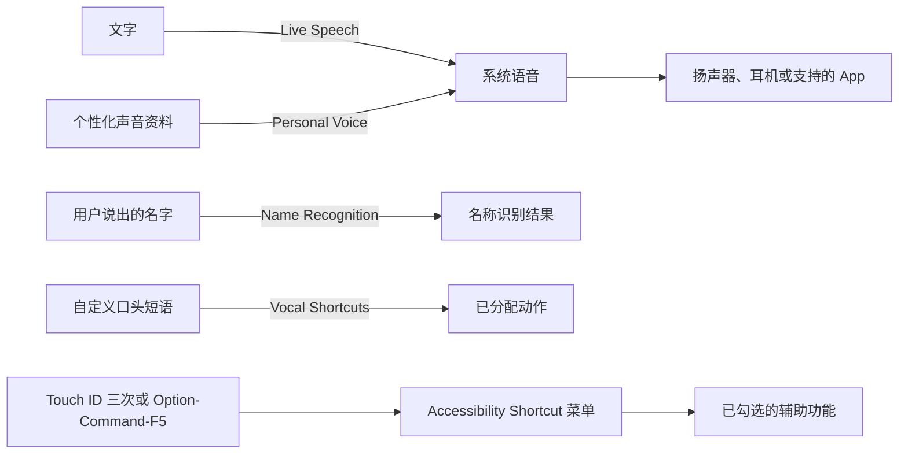

# 让文字和声音成为可控工具：实时语音、个人声音、姓名识别与语音快捷指令

Live Speech、Personal Voice、Name Recognition 与 Vocal Shortcuts 都含有 `voice`、`speech` 或 `recognition`，但它们的方向完全不同。Live Speech 把你键入的文字说出来；Personal Voice 是可供朗读功能使用的个性化声音；Name Recognition 是教系统识别一个特定姓名；Vocal Shortcuts 是教系统识别你说出的自定义短语并触发动作。使用前先画出“谁提供输入、系统处理什么、最终会发生什么”的线，才能避免把“朗读”误当成“语音命令”，或把“识别一个名字”误当成持续可靠的环境监听。

> [!warning] 声音资料和口头命令需要私密环境
>
> Personal Voice、Name Recognition 和 Vocal Shortcuts 都涉及声音或个人口头表达。创建或训练时可能需要录入你的声音、姓名或自定义短语；Live Speech 还可能把键入文字从扬声器、耳机或通话中读出。不要在共享设备、陌生环境、屏幕共享、会议、公共场所或包含私人文字时进行设置。开始前确认输出设备、相关权限、当前开关和关闭路径。

## 学习目标

完成本篇后，你能够：区分文字转语音、个性化声音、姓名识别和语音快捷指令；读懂 Live Speech 的语言、声音、字体和短语分类；理解 Personal Voice 的 iCloud 同步与 App 使用授权；知道 Vocal Shortcuts 的音频本机处理含义；通过两个安全案例练习设置前检查与用后恢复；并用英文完整描述条件、结果和隐私边界。

## 先确认声音的流向

| 功能 | 主要输入 | 系统处理 | 输出或结果 | 不能误解为 |
| --- | --- | --- | --- | --- |
| `Live Speech` | 用户键入的文字或已保存短语。 | 选择语言和声音后合成语音。 | 系统在扬声器、耳机或支持的 App 中读出文字。 | 系统听你说话后自动转文字。 |
| `Personal Voice` | 经用户主动创建的个性化声音资料。 | 提供可选的语音输出资源。 | 可被 Live Speech、Read & Speak、VoiceOver 等使用。 | 一般的 Siri 音色选择。 |
| `Name Recognition` | 用户主动教学的名字。 | 识别该特定名称。 | 在支持场景中识别或提醒。 | 对所有声音和所有人名都可靠。 |
| `Vocal Shortcuts` | 自定义口头短语。 | 在 Mac 上识别短语并匹配动作。 | 快速执行已设置的动作。 | 普通快捷键的语音别名一定不会误触。 |
| `Accessibility Shortcut` | 硬件或键盘快捷方式。 | 打开可选择的辅助功能菜单。 | 快速切换勾选的功能。 | 只针对某一个功能的固定开关。 |

文字转语音和语音识别的方向正好相反。`type to speak aloud` 是从文字到声音；`recognize a custom phrase` 是从声音到动作。通过这两个动词判断方向：`type` 表示输入文字，`speak aloud` 表示声音输出；`recognize` 表示系统识别口头输入，`perform an action` 表示识别后执行动作。

## 进入路径与安全准备

路径是 **System Settings → Accessibility → Speech → Live Speech / Personal Voice / Vocal Shortcuts**；Name Recognition 位于 **Hearing**；Shortcut 位于 **General**。同一功能在不同分类中出现并不矛盾：分类依据是主要使用需求，不是每个词的字面形式。系统还在快捷菜单中列出可快速切换的 VoiceOver、Zoom、Live Captions、Live Speech、Voice Control 等项目，但是否应加入菜单必须以你能够安全启动和关闭它们为前提。

测试前写下四项：当前功能开关；当前输出设备；准备测试的非私人文字或短语；恢复路径。若功能会读出文字，先确认音量和周围环境；若功能会识别语音，先确认不会受到旁人谈话干扰。若功能会调用 App 或在通话中输出声音，先退出真实通话并使用安全页面。

> [!tip] 用一句话标明方向
>
> 可以用 `I type text, and the Mac speaks it aloud.` 记 Live Speech；用 `I say a phrase, and the Mac performs the assigned action.` 记 Vocal Shortcuts。把输入与输出写在同一句里，最不容易混淆。

## 界面实例：Live Speech 将文字变成声音

> 本机截图未包含在公开版本中，以保护原图中的个人信息。

本机页面说明为：`With Live Speech, you can type to speak aloud or directly into applications like FaceTime. Click the icon in the menu bar to show or hide Live Speech.` 这句话说明两种输出位置：普通朗读输出，以及直接进入 FaceTime 等支持的应用。它没有表示输入文本会自动发送给每个 App，也没有表示所有通话服务都支持。`show or hide Live Speech` 表示从菜单栏图标显示或隐藏其界面，不等于开启或关闭整个功能的唯一方式。

| 完整界面表达 | 软件语境中文 | 使用时应核对 |
| --- | --- | --- |
| `With Live Speech, you can type to speak aloud or directly into applications like FaceTime.` | 使用 Live Speech，你可以键入文字以朗读，或直接输入到 FaceTime 等 App。 | 当前输出会去哪里，是否有通话或旁人在听。 |
| `Click the icon in the menu bar to show or hide Live Speech.` | 点击菜单栏图标显示或隐藏 Live Speech。 | 图标只控制界面显示，不应假定所有状态都随之改变。 |
| `System speech language` | 系统朗读语言。 | 朗读规则使用的语言。 |
| `Voice` | 声音。 | Live Speech 的具体输出声音。 |
| `Font size` | 字号。 | Live Speech 面板中输入或阅读文字的呈现。 |
| `Recent` | 最近使用。 | 最近输入或使用过的内容类别。 |
| `Saved` | 已保存。 | 预先保存的常用短语或内容类别。 |
| `Add Category…` | 添加分类。 | 为保存内容创建更清楚的分类。 |

`type to speak aloud or directly into applications like FaceTime` 中 `like FaceTime` 是举例，表示“像 FaceTime 这样的应用”，不是把功能限制为 FaceTime。`directly into applications` 更接近“直接输入到应用的交流流程中”，而不是“把一段音频文件导入应用”。要解释输出边界，可说：`I will check whether the current app supports Live Speech before using it in a call.`

### 本页全部单词

| 单词 | 音标 | 词性 | 本页含义 | 所在完整表达 |
| --- | --- | --- | --- | --- |
| live | /laɪv/ | adj. | 实时的。 | `Live Speech` |
| speech | /spiːtʃ/ | n. | 说话、语音输出。 | `Live Speech` |
| type | /taɪp/ | v. | 键入。 | `type to speak` |
| speak | /spiːk/ | v. | 说出、朗读。 | `speak aloud` |
| aloud | /əˈlaʊd/ | adv. | 出声地。 | `speak aloud` |
| directly | /dəˈrektli/ | adv. | 直接地。 | `directly into applications` |
| applications | /ˌæplɪˈkeɪʃənz/ | n.复数 | 应用程序。 | `applications like FaceTime` |
| click | /klɪk/ | v. | 点击。 | `Click the icon` |
| icon | /ˈaɪkɑːn/ | n. | 图标。 | `icon in the menu bar` |
| menu | /ˈmenjuː/ | n. | 菜单。 | `menu bar` |
| bar | /bɑːr/ | n. | 条、栏。 | `menu bar` |
| show | /ʃoʊ/ | v. | 显示。 | `show Live Speech` |
| hide | /haɪd/ | v. | 隐藏。 | `hide Live Speech` |
| recent | /ˈriːsənt/ | adj. | 最近的。 | `Recent` |
| saved | /seɪvd/ | adj. | 已保存的。 | `Saved` |
| category | /ˈkætəɡɔːri/ | n. | 分类。 | `Add Category` |

### 案例一：安全地朗读一条已准备的短句

**情境**：你想在没有讲话压力时用文字表达一句固定的话，但不希望在实际通话中第一次试错。

1. 打开 **Accessibility → Speech → Live Speech**，记录开关、System speech language 和 Voice 的当前状态。
2. 确认输出设备与音量，选择一条公开、短小、不含私人信息的测试句，例如 `Please give me a moment to type.`
3. 不连接真实通话，先在系统的安全页面打开 Live Speech 面板，键入该句并试听。
4. 检查声音语言、速度和音量是否合适；若不合适，一次只调一个参数，不同时更改语言、声音和字体。
5. 测试完成后关闭本次开启的功能或恢复开关，确认后续文字不会继续意外朗读。
6. 用英语总结：`I tested Live Speech with a short public sentence before using it in an application. I checked the voice and output device, then restored the original setting.`

**恢复方式**：从同一路径回到 Live Speech 恢复开关；若只是隐藏面板，仍需检查功能是否仍处于开启状态。不要把“隐藏”当作“停止朗读或关闭功能”的同义词。

## Personal Voice：可选声音资源与 App 授权分开管理

> 本机截图未包含在公开版本中，以保护原图中的个人信息。

本机页面说明为：`Personal Voice is a simple and secure way to create a voice that sounds like you. It can be used with Live Speech, Read & Speak, VoiceOver, and augmented speech apps.` 这是“创建听起来像你的一种声音”的功能定位。它既不是给所有人使用的默认语音，也不是将任意录音直接播放。页面同时说明它可被 Live Speech、Read & Speak、VoiceOver 和 augmented speech apps 使用，意味着同一声音资源可能在多个朗读场景中被选择。

| 表达 | 中文解释 | 需要分开的判断 |
| --- | --- | --- |
| `Create a Personal Voice` | 创建个人声音。 | 是否要创建声音资源。 |
| `sounds like you` | 听起来像你。 | 声音相似性，不是身份认证。 |
| `Use Personal Voice on all your devices with iCloud.` | 通过 iCloud 在所有设备上使用 Personal Voice。 | 是否跨设备使用，不能从创建动作自动推断。 |
| `Allow applications to request to use Personal Voice` | 允许应用请求使用 Personal Voice。 | 是否让特定 App 发起使用请求。 |
| `speak aloud through your device’s speaker or during calls` | 通过设备扬声器或在通话中出声朗读。 | 输出地点与通话隐私风险。 |
| `Remove` | 移除。 | 仅在确定不再需要该资源时使用。 |
| `augmented speech apps` | 增强语音应用。 | 支持的应用类别，不表示所有 App 都可使用。 |

`simple and secure` 是功能介绍，不应被理解为“无需考虑保护”。声音资料可能具有高度个人属性；在共享设备或不信任的 App 中，必须谨慎判断是否允许请求使用。`Allow applications to request` 也不等于所有 App 已被自动授权，它表示允许应用发起请求；当请求出现时仍应核对 App 名称、用途和输出场景。

> [!warning] 个人声音不是身份验证工具
>
> “听起来像你”描述的是语音输出效果，不是对说话者身份的安全确认。不要把 Personal Voice 产生的声音当作验证身份、确认法律意思或授权高风险操作的证据。创建、同步、允许 App 使用或移除前，都应考虑设备访问与数据保护。

## Name Recognition 与 Vocal Shortcuts：都是识别，结果却不同

> 本机截图未包含在公开版本中，以保护原图中的个人信息。

Name Recognition 页写着 `Teach your Mac to recognize your name.`。`teach` 是教给系统，`recognize` 是识别，`your name` 是一个明确、受你控制的学习目标。它没有说系统将识别所有人的名字，也不表示它会对任何录音、任何距离或任何噪声稳定工作。设置前不要把真实姓名写入截图说明、讲义检索或测试文本；可只理解流程与英语表达。

> 本机截图未包含在公开版本中，以保护原图中的个人信息。

Vocal Shortcuts 页的说明是：`Teach your Mac to recognize a custom phrase that you can say to quickly perform an action. Audio is processed on Mac.` `custom phrase` 是自定义短语，`quickly perform an action` 是快速执行一个动作，`Audio is processed on Mac` 表示音频在 Mac 上处理。后一句说明数据处理位置，却不取消你对短语设计、误触和行为后果的责任。

| 对比点 | Name Recognition | Vocal Shortcuts |
| --- | --- | --- |
| 主要识别对象 | 用户主动教学的名字。 | 用户主动设置的短语。 |
| 目标结果 | 识别该名字。 | 触发已分配的动作。 |
| 首先验证什么 | 在支持场景中是否能稳定识别。 | 短语是否容易与日常谈话混淆。 |
| 主要风险 | 误识别或漏识别。 | 误触发动作、在旁人谈话时触发。 |
| 页面数据处理说明 | 不应假设全部环境均被可靠识别。 | 明确写 Audio is processed on Mac。 |

`custom` 是按你个人需要创建的，不等于保密或不会重复。短语应该避免日常高频词和容易在会议中出现的句子；动作也应选择可逆、低风险的行为。第一次学习可只进入 `Set Up` 阅读引导，不创建真实个人短语或触发系统配置改变的动作。

### 案例二：审查一条语音快捷指令，而不创建高风险动作

**情境**：你希望了解口头短语如何触发操作，但担心在日常交谈中意外执行动作。

1. 打开 **Accessibility → Speech → Vocal Shortcuts**，阅读 `Teach your Mac to recognize a custom phrase…` 与 `Audio is processed on Mac.`。
2. 在进入 `Set Up` 前，先写下候选短语是否可能出现在普通交谈、会议、播客、电视或家庭对话中。
3. 选择一个低风险、可取消的测试动作；不要选择发送消息、修改权限、删除文件、付款、关机或执行终端命令。
4. 若仅做学习，停留在设置引导，不保存短语或动作。若已进行低风险测试，结束后用相同路径移除测试项或关闭相关功能。
5. 在安全环境中说出与候选短语相似的普通话语，观察是否可能混淆；发现误触风险时不要继续保留。
6. 用英语说明：`I chose a phrase that is unlikely to occur in normal conversation, and I tested it only with a reversible action.`

## Accessibility Shortcut：快速切换也需要最小集合

系统 General 中的 Shortcut 页面说明：`Accessibility features can be toggled on and off by quickly pressing Touch ID three times, or pressing ⌥⌘F5. Select which features to toggle on and off:`。这一快捷菜单可以包含 VoiceOver、Zoom、Hover Text、Color Filters、Sticky Keys、Mouse Keys、Full Keyboard Access、Head Pointer、Voice Control、Live Captions、Live Speech、Background Sounds 等多个功能。

> 本机截图未包含在公开版本中，以保护原图中的个人信息。

这里的 `toggled on and off` 强调快捷方式在两个状态间切换。页面要求你选择哪些功能进入菜单，不表示全部勾选才更方便。菜单项目过多会增加选择时间和误触机会；只保留自己知道如何恢复、在当前设备上确实需要的功能，才是更可靠的配置。

| 表达 | 软件语境中文 | 安全用法 |
| --- | --- | --- |
| `quickly pressing Touch ID three times` | 快速连按 Touch ID 三次。 | 仅在本机硬件和快捷方式已确认时使用。 |
| `pressing ⌥⌘F5` | 按 Option-Command-F5。 | 记住这是打开辅助功能快捷菜单的替代方式。 |
| `Select which features to toggle on and off` | 选择要切换的功能。 | 只选可理解、可恢复的项目。 |
| `Speak items in the accessibility shortcut menu when navigated.` | 导航时朗读辅助功能快捷菜单中的项目。 | 辅助菜单导航，不等于打开每项功能。 |

> [!tip] 快捷菜单不是“常用功能大杂烩”
>
> 快捷菜单适合在你已经学会功能作用、启动条件和关闭方式后缩短路径。第一次学习一个功能时，优先从完整设置页进入；确认它适合后，再决定是否加入快捷菜单。这样遇到意外行为时，能准确回到原页面恢复。

## 可直接背诵的英语表达

| 中文意思 | 英文表达 | 使用提示 |
| --- | --- | --- |
| 我键入文字，让 Mac 把它读出来。 | `I type text and let the Mac speak it aloud.` | 清楚描述文字到声音。 |
| 我先检查这个 App 是否支持实时语音。 | `I will check whether this app supports Live Speech first.` | `whether` 引出是否支持。 |
| 个人声音可以被多个朗读功能使用。 | `A Personal Voice can be used by several speech features.` | 不表示所有 App 自动获准使用。 |
| 我不把声音相似性当作身份验证。 | `I do not treat voice similarity as identity verification.` | 明确安全边界。 |
| 这个短语可能在日常交谈中出现。 | `This phrase may occur in normal conversation.` | 说明误触风险。 |
| 音频在 Mac 上处理。 | `The audio is processed on Mac.` | 复述页面原文的处理位置。 |
| 我只把可恢复功能加入快捷菜单。 | `I add only reversible features to the shortcut menu.` | 强调最小集合。 |

## 常见错误、风险和恢复方式

| 容易出现的错误 | 为什么不合适 | 应怎样恢复或改进 |
| --- | --- | --- |
| 将隐藏 Live Speech 面板当作关闭功能。 | 显示界面和功能开关可能是两层状态。 | 回到 Live Speech 页面核对总开关。 |
| 在真实通话中第一次测试文字朗读。 | 可能把测试文字意外传出或打断对话。 | 先在非通话的安全页面测试。 |
| 以为 Personal Voice 是身份验证。 | 它的目标是声音输出相似性。 | 不以声音相似性确认身份或授权。 |
| 让任意 App 使用 Personal Voice。 | App 请求应按名称、用途和输出场景审查。 | 保持请求关闭，或只允许必要、可信的 App。 |
| 选日常用语做 Vocal Shortcut。 | 可能在普通谈话或媒体声音中误触。 | 选择低频短语和低风险动作，测试后可移除。 |
| 将过多功能加入 Accessibility Shortcut。 | 菜单变长，误触和恢复困难。 | 只保留常用且能安全关闭的功能。 |

## 本篇自测

1. Live Speech 与 Vocal Shortcuts 的输入和输出方向有什么不同？
2. `show or hide Live Speech` 为什么不必然等于开启或关闭功能？
3. Personal Voice 的 iCloud 开关和 App 请求开关分别回答什么问题？
4. Name Recognition 与 Vocal Shortcuts 的识别对象和结果有什么不同？
5. `Audio is processed on Mac.` 表达的事实是什么，又不保证什么？
6. 为什么快捷菜单应只保留最小的可恢复功能集合？
7. 请用英语表达：“我只在没有通话和私人内容的页面测试了实时语音。”

查看答案

1. Live Speech 把键入文字转换为语音输出；Vocal Shortcuts 识别说出的自定义短语并触发已设置动作。
2. 它描述菜单栏界面的显示与隐藏，完整功能状态仍应在设置页的开关中核对。
3. iCloud 开关决定是否在自己的设备间使用 Personal Voice；App 请求开关决定应用能否请求用它朗读。
4. Name Recognition 识别用户教给系统的名字；Vocal Shortcuts 识别自定义短语并执行分配动作。
5. 它说明音频处理位置在 Mac；不保证短语不会误识别，也不保证每个动作都安全。
6. 项目过多增加寻找、误触和恢复难度；最小集合更容易理解和控制。
7. `I tested Live Speech only on a page without a call or private content.`

## 版本差异与参考来源

本篇根据本机 **macOS 27.0 Beta (26A5425a)** 的 Live Speech、Personal Voice、Name Recognition、Vocal Shortcuts、Siri 和 Shortcut 页面、截图与辅助功能文本写成。语音资源、语言支持、iCloud 行为、App 兼容性、麦克风权限与硬件快捷方式会随设备、地区和版本变化。可参考 Apple 的 [Live Speech guide](https://support.apple.com/guide/mac-help/use-live-speech-mchl5e55a4d8/mac)、[Personal Voice guide](https://support.apple.com/guide/mac-help/create-a-personal-voice-mchl72f7e1c1/mac)、[Vocal Shortcuts guide](https://support.apple.com/guide/mac-help/use-vocal-shortcuts-mchl0f1e3be5/mac) 与 [Accessibility Shortcut guide](https://support.apple.com/guide/mac-help/use-an-accessibility-shortcut-mchlp2260/mac)。公开资料解释原理，当前本机页面仍是实际路径和按钮名称的依据。
