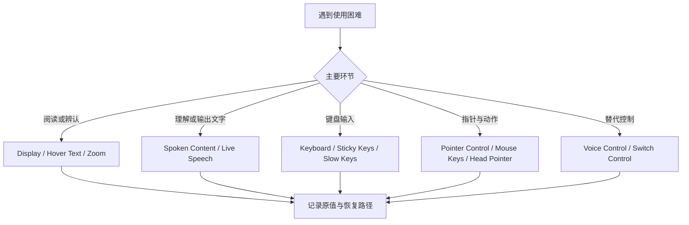

# 把辅助需求拆成输入、文本、指针和朗读的可验证选项

辅助功能不是一组“特殊开关”，而是把输入、阅读、视觉反馈、听觉反馈和动作控制拆成可以独立选择的能力。面对复杂页面时，先问用户在什么环节遇到困难：看不清、听不到、难以输入、难以移动指针，还是难以按时完成连按动作。问题确定以后，才去对应 `Display`、`Spoken Content`、`Keyboard`、`Pointer Control`、`Voice Control`、`Switch Control` 等页面。

> [!warning] 不要为了练习启用可能改变操作方式的功能
> VoiceOver、Voice Control、Switch Control、Mouse Keys 和 Full Keyboard Access 都可能改变键盘、指针或语音的交互方式。本文用于读懂名称、说明和恢复路径。没有明确使用需求时，不应为了确认画面而开启它们。

## 学习目标

你将能够把 `Sticky Keys`、`Slow Keys`、`Hover Text`、`Speak Selection`、`Live Speech`、`Head Pointer`、`Mouse Keys` 和 `Voice Vocabulary` 分别放到正确的需求类别；能读出 `Enable`、`Use`、`Show`、`Speak`、`Control` 等界面动词所指的实际能力；也能在不改变系统输入模式的前提下完成页面阅读。

## 从需求到设置的关系

这张图强调“需求先于开关”。例如，`Slow Keys` 解决的是按键被接受前需要保持一段时间的问题；它并不等同于文本变慢。`Hover Text` 帮助放大或突出指针附近文本；它也不是系统全局字号。名称接近时，先用名词确定对象，再用动词确定动作。

## 真实界面：文字、朗读、指针与替代输入

> 本机截图未包含在公开版本中，以保护原图中的个人信息。

> 本机截图未包含在公开版本中，以保护原图中的个人信息。

> 本机截图未包含在公开版本中，以保护原图中的个人信息。

> 本机截图未包含在公开版本中，以保护原图中的个人信息。

> 本机截图未包含在公开版本中，以保护原图中的个人信息。

> 本机截图未包含在公开版本中，以保护原图中的个人信息。

> 本机截图未包含在公开版本中，以保护原图中的个人信息。

> 本机截图未包含在公开版本中，以保护原图中的个人信息。

> 本机截图未包含在公开版本中，以保护原图中的个人信息。

> 本机截图未包含在公开版本中，以保护原图中的个人信息。

> 本机截图未包含在公开版本中，以保护原图中的个人信息。

> 本机截图未包含在公开版本中，以保护原图中的个人信息。

> 本机截图未包含在公开版本中，以保护原图中的个人信息。

> 本机截图未包含在公开版本中，以保护原图中的个人信息。

> 本机截图未包含在公开版本中，以保护原图中的个人信息。

> 本机截图未包含在公开版本中，以保护原图中的个人信息。

> 本机截图未包含在公开版本中，以保护原图中的个人信息。

> 本机截图未包含在公开版本中，以保护原图中的个人信息。

> 本机截图未包含在公开版本中，以保护原图中的个人信息。

> 本机截图未包含在公开版本中，以保护原图中的个人信息。

> 本机截图未包含在公开版本中，以保护原图中的个人信息。

> 本机截图未包含在公开版本中，以保护原图中的个人信息。

> 本机截图未包含在公开版本中，以保护原图中的个人信息。

> 本机截图未包含在公开版本中，以保护原图中的个人信息。

> 本机截图未包含在公开版本中，以保护原图中的个人信息。

> 本机截图未包含在公开版本中，以保护原图中的个人信息。

> 本机截图未包含在公开版本中，以保护原图中的个人信息。

> 本机截图未包含在公开版本中，以保护原图中的个人信息。

> 本机截图未包含在公开版本中，以保护原图中的个人信息。

> 本机截图未包含在公开版本中，以保护原图中的个人信息。

### 完整界面表达

| 原文 | 软件语境中文 | 主要解决的环节 | 不能替代的功能 |
| --- | --- | --- | --- |
| `Full Keyboard Access` | 完整键盘控制 | 用键盘在界面控件间移动与操作 | 语音控制或文字放大。 |
| `Sticky Keys` | 粘滞键 | 将组合修饰键拆成连续按键 | 延长单键接受时间。 |
| `Slow Keys` | 慢速键 | 要求按键保持一段时间才接受 | 放慢朗读速度。 |
| `Hover Text` | 悬停文字 | 突出或放大指针附近文本 | 全局更改文字大小。 |
| `Speak Selection` | 朗读所选内容 | 将选择的文字读出来 | 朗读所有屏幕内容。 |
| `Mouse Keys` | 鼠标键 | 用键盘模拟指针移动 | 触控板手势。 |
| `Voice Vocabulary` | 语音词汇 | 改善语音控制识别的词汇 | Siri 的对话语言。 |
| `Live Speech` | 实时语音 | 用输入文字生成语音表达 | 麦克风听写。 |

`Sticky` 形容“会保持”的状态，因此 `Sticky Keys` 指修饰键可以先按下并保持逻辑状态。`selection` 是已选中的文本，`speak selection` 表示读出选择结果。遇到 `pointer` 时先确认它是屏幕指针，而不是网络或编程中的指针；系统设置里的 `Head Pointer`、`Alternate Pointer Actions` 都属于控制屏幕指针的语境。

## 两个完整观察案例

### 案例一：为阅读困难选择正确的文本工具

1. 进入 **Accessibility**，阅读 `Text Size`、`Hover Text`、`Zoom` 与 `Speak Selection` 的标题和说明。
2. 将问题拆开：看不清固定文字时考虑文字大小；需要临时查看指针附近内容时考虑悬停文字；希望听到已选文本时考虑朗读所选内容。
3. 不改变任何设置，尤其不打开可能覆盖当前输入方式的控制工具。
4. 用英语说：`Hover Text helps with text near the pointer, while Speak Selection reads selected text aloud.`
5. 若未来实际修改，先记录原值，并只测试一个功能，再从同一页恢复。

### 案例二：区分键盘辅助与语音辅助

1. 阅读 `Full Keyboard Access`、`Sticky Keys`、`Slow Keys`、`Voice Control` 与 `Voice Vocabulary`。
2. 确认前面三项围绕键盘接受或导航，后两项围绕以语音发出控制命令。
3. 不启用 Voice Control，也不添加个人词汇或保存的短语。
4. 用英语报告：`Keyboard accessibility changes how keys are used. Voice Control changes how commands are recognized.`
5. 如果输入行为意外变化，优先返回刚才阅读的键盘或语音控制子页，检查开关是否被改变；不要先重置整套辅助功能。

> [!tip] 名称相近时用对象来区分
> `Speak announcements` 读的是通知，`Speak selection` 读的是你已经选择的文本，`Speak item under the pointer` 读的是指针附近项目。动词相同，宾语不同；先找宾语，是理解辅助功能页面最快的办法。

## 英语表达规律与搭配

辅助功能页面常用祈使式或能力描述。`Use ... to ...` 表示用一种输入方式完成某动作；`Show ... when ...` 表示在条件满足时显示；`Speak ... aloud` 明确为出声朗读；`adjust the delay` 表示调整等待时间。写反馈时不要笼统说“accessibility is on”，而要说清能力：`I enabled a text-reading option, not a pointer-control option.`

| 单词 | 音标 | 词性 | 本篇语境义 | 所在完整表达 |
| --- | --- | --- | --- | --- |
| accessibility | /əkˌsesəˈbɪləti/ | n. | 无障碍可用性 | `Accessibility settings` |
| pointer | /ˈpɔɪntər/ | n. | 屏幕指针 | `Head Pointer` |
| hover | /ˈhʌvər/ | v. | 悬停 | `Hover Text` |
| selection | /sɪˈlekʃən/ | n. | 已选文本 | `Speak Selection` |
| sticky | /ˈstɪki/ | adj. | 保持激活状态的 | `Sticky Keys` |
| delay | /dɪˈleɪ/ | n. | 延迟、等待时长 | `navigation timing` |
| vocabulary | /voʊˈkæbjəleri/ | n. | 词汇表 | `Voice Vocabulary` |

## 自测

1. `Sticky Keys` 与 `Slow Keys` 各自改变什么输入行为？
2. `Hover Text`、`Text Size` 和 `Zoom` 如何按使用时机区分？
3. `Speak Selection` 与 `Speak Announcements` 各自读什么？
4. 用英语说明“我研究了语音词汇页面，但没有开启语音控制”。

查看参考答案

1. 粘滞键帮助连续输入组合修饰键；慢速键要求按键保持足够时长才被接受。
2. 悬停文字服务临时指针附近内容，文字大小影响文本呈现，缩放放大更大范围的屏幕内容。
3. 前者读已选择文字，后者读系统通知。
4. `I reviewed the Voice Vocabulary page, but I did not enable Voice Control.`

## 版本与来源

本篇依据本机 macOS 27.0 Beta (26A5425a) 于 2026-09-09 的采集。可见子项与可用硬件、语言和辅助设备有关，本文不把动态状态写成通用承诺。功能概念参考 Apple 的 [Make your Mac easier to use](https://support.apple.com/guide/mac-help/make-your-mac-easier-to-use-mchl0cd241d8/mac) 与 [Change Accessibility settings on Mac](https://support.apple.com/guide/mac-help/change-accessibility-settings-mchlp1400/mac)。
