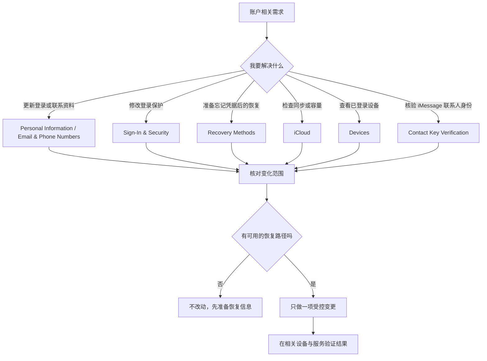

# 管理 Apple 账户：iCloud、登录安全与恢复信息

Apple Account 页面不是一个“把所有服务都打开”的总开关，而是账户资料、登录安全、付款、iCloud 同步、已登录设备和通信验证的汇合入口。这里最容易发生的误解有两类：把同步理解为备份，把账户资料理解为普通本机偏好。前者会忽略删除和容量状态；后者会忽略邮箱、手机号、可信设备、恢复联系人和恢复密钥影响的是你能否重新进入整个账户。

> [!warning] 账户页面包含高影响操作
>
> 更改密码、双重认证、恢复方法、已登录设备、付款资料、iCloud 同步、数据保护或退出账户，都可能影响多台设备和已有数据。学习时不要写入真实邮箱、号码、设备名、存储数值或联系人信息；不要为了生成页面效果而移除设备、退出账户、升级订阅、关闭同步或创建恢复密钥。先理解表达和路径，再在确有需求、已准备恢复方式时单项操作。

## 学习目标

完成本篇后，你能区分 Apple Account 首页、Sign-In & Security、iCloud 与 Contact Key Verification 的职责；解释邮箱与手机号、可信设备、双重认证和恢复方法为何不同；理解 iCloud 的存储状态、同步暂停和数据保护不是同一种提醒；并用两组只读或可恢复案例检查安全信息与同步边界。

## 账户页面的四层模型

| 层级 | 典型页面或入口 | 回答的问题 | 不应混同为 |
| --- | --- | --- | --- |
| 账户身份 | `Personal Information`、Email & Phone Numbers | 谁能用哪些信息登录、验证或联系你。 | 本机昵称或普通联系人卡片。 |
| 登录与恢复 | `Sign-In & Security`、Two-Factor Authentication、Recovery Methods | 登录时怎样证明身份，忘记凭据后怎样恢复。 | 单纯的密码修改页。 |
| 服务与同步 | `iCloud`、Media & Purchases、Sign in with Apple | 哪些服务使用账户，哪些数据在设备间同步。 | 所有本机数据的完整备份。 |
| 设备与通信验证 | Devices、Contact Key Verification | 哪些设备在账户中，通信身份怎样被额外核验。 | 网络连接列表或普通蓝牙配对。 |

任何一个操作前，都先说出自己所在层级。比如“我想给一台新 Mac 登录”属于身份与验证；“我想让照片继续同步”属于服务与同步；“我担心忘记密码后进不去”属于恢复方法；“我需要确认聊天对象的验证状态”属于通信验证。这样比在 Account 首页逐个点按钮更安全。

## 操作路径与资料最小化原则

在 System Settings 左上方的账户区域进入 **Apple Account**。首页通常包含 Personal Information、Sign-In & Security、Payment & Shipping、iCloud、Family、Media & Purchases、Sign in with Apple、Devices、Contact Key Verification 和 `Sign Out…`。这些名称是稳定学习对象；当前用户姓名、邮箱、设备型号、设备数和订阅容量都是私人或动态资料，不能放进词表、全文搜索或示例答案。

练习路径时保持只读：打开一个详情页，阅读标题、说明句、按钮和返回路径，然后使用 `Go Back` 回到上一页。不要点击 `Sign Out…`、`Change Password…`、`Upgrade…`、`Set Up` 或 `Remove` 来制造操作结果。账户安全的学习价值在于能准确说明“它会改变什么”，而不是在没有准备时改动。

> [!tip] 账户操作要先写出恢复句
>
> 在更改登录信息前，用英语或中文完整写出：`I can still access a trusted device and a verified recovery method.` 如果不能确认这句话为真，就不应执行高影响账户变更。恢复路径比“我记得密码”更全面。

## 界面实例：Apple Account 首页是服务与设备的导航页

> 本机截图未包含在公开版本中，以保护原图中的个人信息。

本机截图中显示了当前用户资料和具体设备名称，它们均为个人或动态数据，不录入本文文字表。下面只解释 Apple Account 页面中跨版本更稳定的功能名称。

| 完整界面表达 | 软件语境中文 | 进入后主要处理什么 |
| --- | --- | --- |
| `Personal Information` | 个人信息。 | 账户身份资料与可联系信息。 |
| `Sign-In & Security` | 登录与安全。 | 密码、双重认证、恢复方法等。 |
| `Payment & Shipping` | 付款与配送。 | 账户付款和配送相关资料。 |
| `iCloud` | iCloud 云服务。 | 同步、存储、数据保护和云端访问。 |
| `Family` | 家人共享。 | 家庭组与共享服务。 |
| `Media & Purchases` | 媒体与购买项目。 | 媒体、购买与相关账户服务。 |
| `Sign in with Apple` | 使用 Apple 登录。 | 用 Apple Account 登录第三方服务的管理。 |
| `Devices` | 设备。 | 当前账户关联设备的列表与状态。 |
| `Contact Key Verification` | 联系人密钥验证。 | iMessage 联系人身份的额外核验。 |
| `Sign Out…` | 退出登录。 | 将本机从当前 Apple Account 退出。 |

`Sign Out…` 的省略号表示会继续打开确认步骤或对话框，它不是轻量级导航按钮。退出账户可能影响 iCloud 数据、查找服务、购买项目和本机凭据，必须在确认数据状态、设备归属和重新登录方式之后才考虑。

### 本页全部单词

| 单词 | 音标 | 词性 | 本页含义 | 所在完整表达 |
| --- | --- | --- | --- |
| personal | /ˈpɜːrsənəl/ | adj. | 个人的。 | `Personal Information` |
| information | /ˌɪnfərˈmeɪʃən/ | n. | 信息。 | `Personal Information` |
| sign | /saɪn/ | v. | 登录；签名。 | `Sign-In` |
| security | /sɪˈkjʊrəti/ | n. | 安全。 | `Sign-In & Security` |
| payment | /ˈpeɪmənt/ | n. | 付款。 | `Payment & Shipping` |
| shipping | /ˈʃɪpɪŋ/ | n. | 配送。 | `Payment & Shipping` |
| family | /ˈfæməli/ | n. | 家庭、家人共享组。 | `Family` |
| media | /ˈmiːdiə/ | n. | 媒体内容。 | `Media & Purchases` |
| purchases | /ˈpɜːrtʃəsɪz/ | n.复数 | 购买项目。 | `Media & Purchases` |
| devices | /dɪˈvaɪsɪz/ | n.复数 | 设备。 | `Devices` |
| contact | /ˈkɑːntækt/ | n. | 联系人。 | `Contact Key Verification` |
| key | /kiː/ | n. | 密钥；键。 | `Contact Key Verification` |
| verification | /ˌverɪfɪˈkeɪʃən/ | n. | 验证、核验。 | `Contact Key Verification` |
| out | /aʊt/ | adv. | 退出。 | `Sign Out` |

## Sign-In & Security：登录、验证与恢复是三件事

> 本机截图未包含在公开版本中，以保护原图中的个人信息。

页面把内容分为 `Email & Phone Numbers`、`Security` 和 `Recovery Methods`。说明句写道：`These email addresses and phone numbers can be used to sign in, verify your identity, and help recover your account. They can also be used to reach you with iMessage, FaceTime, Game Center, and more.` 这说明同一邮箱或号码可能承担多种角色：登录标识、身份验证、恢复渠道与通信渠道。一个项目能够用于联系你，不意味着它适合承担唯一恢复方法；一个项目能用于登录，也不等于它已完成双重认证。

| 完整界面表达 | 软件语境中文 | 重点边界 |
| --- | --- | --- |
| `Email & Phone Numbers` | 邮箱与电话号码。 | 登录、验证、恢复和服务联系可能共用。 |
| `Add an Email or Phone Number…` | 添加邮箱或电话号码。 | 添加前确认归属、可访问性和验证流程。 |
| `Change Password…` | 更改密码。 | 会影响已有登录会话和其他设备的重新验证。 |
| `Two-Factor Authentication` | 双重认证。 | 可信设备和电话号码会用于登录身份验证。 |
| `Your trusted devices and phone numbers are used to verify your identity when signing in.` | 登录时会使用可信设备和电话号码验证身份。 | 设备与号码应保持可用、受自己控制。 |
| `Recovery Methods` | 恢复方法。 | 忘记密码或设备密码后重获访问权限。 |
| `Recovery Contacts` | 恢复联系人。 | 可信他人参与账户恢复的安排。 |
| `Recovery Key` | 恢复密钥。 | 高影响恢复凭据，丢失或泄露风险需要理解。 |
| `Legacy Contact` | 遗产联系人。 | 账户持有人去世后的数据访问安排。 |
| `Automatic Verification` | 自动验证。 | 在 App 或网页中私密地绕过部分 CAPTCHA。 |

`Regain access to your account and data if you forget your password or device passcode.` 中 `regain access` 是“重新获得访问权”；`if you forget` 表示忘记密码或设备密码的条件；`account and data` 同时强调账户入口与账户数据。Recovery Methods 的价值不是让你随时试着恢复，而是在还有正常访问时预先布置可靠、独立且能够联系到的恢复路径。

> [!warning] Recovery Key 不是普通备注
>
> 恢复密钥属于高影响凭据。创建、替换、导出或存放方式都必须按当前系统明确说明执行，并确保自己理解失去它或泄露它的后果。本文不提供、记录或演示任何真实恢复密钥；没有准备好可靠保管与恢复流程时，不应为了学习界面创建它。

### 案例一：只读审查账户的恢复能力

**情境**：你没有忘记密码，但希望确认未来出现问题时不会只依赖一台设备或一个号码。

1. 进入 **Apple Account → Sign-In & Security**，不点击 Change Password 或 Add an Email or Phone Number。
2. 阅读 Email & Phone Numbers 的说明，确认登录、验证、恢复和通信是多个角色。
3. 打开 Two-Factor Authentication 的说明，判断自己是否仍可使用受自己控制的可信设备或电话途径；不在讲义中写出其名称或号码。
4. 阅读 Recovery Methods，分别理解 Recovery Contacts、Recovery Key 和 Legacy Contact 的目的，不进行 `Set Up`。
5. 用一张私密的个人清单记录“我能通过哪些已验证方式恢复”，该清单不应写入本文、提交到项目或放在共享位置。
6. 用英语说明：`I reviewed my recovery methods while I still had normal access. I did not change my password or recovery settings during the review.`

## iCloud：同步状态、容量和数据保护不等于一件事

> 本机截图未包含在公开版本中，以保护原图中的个人信息。

iCloud 页可能显示存储使用、升级建议、同步暂停、各服务卡片、Advanced Data Protection 和 Data Access on iCloud.com。具体容量、服务项目数量、价格、状态和账户名称会随本机和订阅变化，均不应被写成固定事实。学习时只读稳定表达，例如 `Some data isn't syncing to iCloud.`、`Saving Is Paused`、`Manage…`、`Advanced Data Protection` 和 `Data Access on iCloud.com`。

| 完整界面表达 | 软件语境中文 | 不能由它直接推出 |
| --- | --- | --- |
| `Storage Full` | 存储空间已满。 | 所有数据都已丢失。 |
| `Manage…` | 管理。 | 立即删除数据是唯一方案。 |
| `Some data isn't syncing to iCloud.` | 部分数据没有同步到 iCloud。 | 所有服务都无法使用。 |
| `Saving Is Paused` | 保存已暂停。 | 本机已有内容全部被清空。 |
| `Upgrade to iCloud+` | 升级到 iCloud+。 | 升级是唯一合法的恢复路径。 |
| `More Storage and Powerful Features` | 更多存储与增强功能。 | 任意数据都会自动恢复。 |
| `Share an iCloud plan` | 共享 iCloud 方案。 | 共享者可自动读取所有私密资料。 |
| `Private Relay` | 私密转送。 | 全部网络活动都匿名或不受限制。 |
| `Hide My Email` | 隐藏我的邮箱。 | 不再需要管理账户邮箱。 |
| `Advanced Data Protection` | 高级数据保护。 | 只是一项普通视觉偏好。 |
| `Data Access on iCloud.com` | iCloud.com 数据访问。 | 与本机同步开关完全相同。 |

`Saving Is Paused` 只说“新的项目可能不会保存到 iCloud”，不表示你应该立刻删资料或购买服务。先读出具体受影响服务，检查网络、账户状态、存储空间和最近同步情况，再决定相应路径。`Some data isn't syncing` 也应被理解为范围受限的状态句：问题可能只影响部分数据类型。

### 案例二：只读区分同步问题和安全设置

**情境**：你看到 iCloud 页面提示同步或保存暂停，但不确定是否与密码、账户退出或数据保护有关。

1. 打开 **Apple Account → iCloud**，只记录稳定状态词，如 `Saving Is Paused` 或 `Some data isn't syncing to iCloud.`，不抄写容量、项目数或私人服务名称。
2. 打开受影响服务的详情前，先问：这是同步范围、存储容量、网络连接、账户状态，还是数据保护问题？不要先去 Change Password 或 Sign Out。
3. 点击 `Manage…` 前先理解它是管理入口，可能涉及存储和服务选择；不执行删除或升级。
4. 将 iCloud 中的同步状态与 Sign-In & Security 中的登录安全分开记录：前者回答数据是否流转，后者回答如何证明身份和恢复账户。
5. 如需真实排查，在自己的私密资料中核对当前设备、网络和服务状态；本文不保存任何账户信息。
6. 用英语描述：`I separated a sync status from an account security problem. I checked which service was affected before considering any storage or sign-in change.`

## Contact Key Verification：额外核验通信身份，不替代常规安全

> 本机截图未包含在公开版本中，以保护原图中的个人信息。

页面说明为：`Verify who you are messaging with by comparing contact verification codes in person or over the phone. In conversations with people who also have contact key verification turned on, you will see a message if contact key verification detects an issue or is turned off.` `Verify who you are messaging with` 指核验正在通信的对象；`by comparing … codes` 指通过当面或电话比较验证码；`detects an issue` 指系统检测到问题。它并不替代你对对方身份、信息内容或社交工程风险的判断。

| 表达 | 中文解释 | 应如何使用 |
| --- | --- | --- |
| `Verify who you are messaging with` | 验证正在通信的对象。 | 在需要更高通信身份保证时使用。 |
| `contact verification codes` | 联系人验证代码。 | 通过可信的当面或电话渠道比较。 |
| `in person or over the phone` | 当面或通过电话。 | 避免只在同一可疑消息通道内比对。 |
| `detects an issue` | 检测到问题。 | 出现提示后停止敏感沟通并另行核验。 |
| `turned off` | 被关闭。 | 表示验证状态变化，不是对话内容真伪结论。 |

> [!warning] 验证代码应通过独立可信渠道比较
>
> 如果你要比较联系人验证代码，应使用你已知可信的当面或电话方式，而不是在可能已被冒用的同一条消息里询问对方。检测到问题后，暂停发送敏感资料，不要急于在当前对话中“确认没事”。

## 软件英语表达规律

| 句型 | 软件含义 | 可直接使用的句子 |
| --- | --- | --- |
| `can be used to + verb` | 某项资料可用于某用途。 | `This phone number can be used to verify my identity.` |
| `help recover + object` | 帮助恢复某对象。 | `A recovery method can help recover the account.` |
| `are used to + verb` | 被用于完成某事。 | `Trusted devices are used to verify identity.` |
| `if you forget …` | 如果忘记……时。 | `Use a recovery method if you forget the password.` |
| `isn't syncing` | 没有在同步。 | `Some data isn't syncing to iCloud.` |
| `is paused` | 已暂停。 | `Saving is paused.` |
| `detects an issue` | 检测到问题。 | `Contact verification detects an issue.` |

`recover` 与 `restore` 都可译为“恢复”，但软件语境不同。`recover your account` 是重新获得账户访问权；`restore a backup` 是从备份还原数据；`restore a previous setting` 是恢复先前配置。遇到账户页面时，优先用 `recover access`，不要把它和数据备份还原混淆。

## 常见错误、风险与恢复方式

| 容易出现的错误 | 为什么不合适 | 更稳妥的处理 |
| --- | --- | --- |
| 将 iCloud 同步当作唯一备份。 | 同步和备份的保留、删除与恢复模型不同。 | 了解当前服务的同步状态和独立备份策略。 |
| 因同步暂停立刻退出 Apple Account。 | 退出会扩大影响范围，未必解决同步根因。 | 先确认具体受影响服务、存储、网络和账户状态。 |
| 只依赖一个号码或一台设备恢复。 | 设备丢失、号码不可用时可能失去访问。 | 在正常访问时审查多个受控恢复方式。 |
| 为学习创建 Recovery Key。 | 这是高影响凭据，错误保管会造成风险。 | 只读理解，准备好保管流程后再单独决策。 |
| 将联系人验证提示当成对任何内容都安全的保证。 | 它只针对通信身份核验的一部分。 | 仍审查对方请求和敏感信息内容。 |
| 在讲义中写入个人邮箱、号码、设备或容量。 | 会把私人资料进入检索与版本控制风险范围。 | 只使用稳定的界面表达和抽象示例。 |

## 本篇自测

1. Apple Account 首页与 Sign-In & Security 分别适合解决什么问题？
2. Email & Phone Numbers 为什么不只是联系资料？
3. Two-Factor Authentication 与 Recovery Methods 有什么区别？
4. `Saving Is Paused` 不能直接说明什么？
5. iCloud 同步和备份为什么不能完全等同？
6. Contact Key Verification 建议用什么方式比较验证代码？
7. 请用英语表达：“我在仍能正常登录时检查了恢复方法。”

查看答案

1. 首页用于在账户资料、安全、服务、设备和通信核验之间导航；Sign-In & Security 用于审查登录、验证和恢复。
2. 页面说明它们也可用于登录、验证身份和帮助恢复账户。
3. 双重认证在登录时核验身份；恢复方法用于忘记密码或设备密码后重新获得访问。
4. 它不能直接说明所有数据丢失、所有服务停止或退出账户能够解决问题。
5. 同步关注数据在设备和云端之间的流转；备份关注可恢复副本与还原策略，删除和保留行为可能不同。
6. 通过已知可信的当面或电话渠道，而不是只在可能可疑的同一消息渠道中比较。
7. `I reviewed my recovery methods while I still had normal access to my account.`

## 版本差异与参考来源

本篇依据本机 **macOS 27.0 Beta (26A5425a)** 的 Apple Account、Sign-In & Security、iCloud 和 Contact Key Verification 页面、截图及辅助功能文本写成。服务名称、订阅状态、存储、可见设备、地区运营方和安全选项会随账户和版本变化。可参考 Apple 的 [Apple Account guide](https://support.apple.com/guide/mac-help/manage-your-apple-account-mchla0cf3fbe/mac)、[iCloud guide](https://support.apple.com/guide/mac-help/set-up-icloud-on-your-mac-mh36832/mac)、[account security guide](https://support.apple.com/guide/mac-help/change-apple-account-settings-mchlp2711/mac) 与 [Contact Key Verification guide](https://support.apple.com/guide/security/contact-key-verification-sec8a7b0bd5c/web)。公开资料说明概念，实际按钮和状态以本机页面为准。
