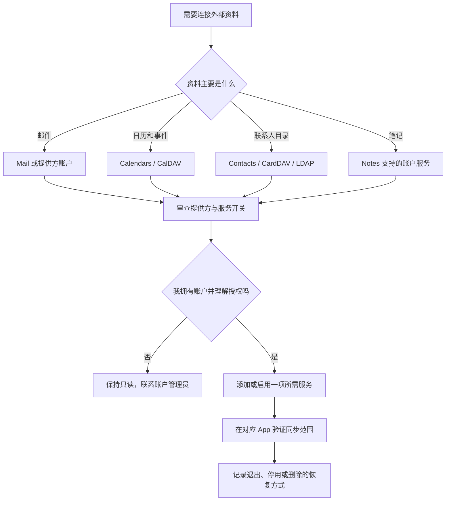

# 连接互联网账户：Mail、CalDAV、CardDAV 与 LDAP

Internet Accounts 的作用不是“把所有邮箱都加入 Mac”，而是为一个外部账户选择哪些系统服务可以使用它。一个账户可以只提供 Mail，也可以同时连接 Contacts、Calendars 和 Notes；某些组织服务需要手工配置 CalDAV、CardDAV 或 LDAP。真正需要判断的不是“能不能登录”，而是“此账户的哪些数据要进入本机、由哪个系统 App 使用、关闭服务或删除账户后会影响什么”。

> [!warning] 添加账户等于扩大数据访问范围
>
> 添加互联网账户可能会要求登录、授权、网络访问和同步个人或工作资料。本文不记录真实账户名、邮箱、服务器地址、组织名称、端口、用户名或密码；不为了学习点击 Add Account、输入凭据或删除现有账户。只有在你拥有账户、理解组织政策并已确认服务范围时，才在真实环境单独添加。

## 学习目标

读完本篇，你应能从 Internet Accounts 首页读出一个账户启用了哪些服务；理解 Add Account、账户详情开关和 Delete Account 的不同后果；分清 Mail、CalDAV、CardDAV 与 LDAP 的典型数据类型；完成一组只读服务范围审查和一组“拟定添加前检查”案例；并用英语说明同步范围、授权与恢复边界。

## 先按数据类型认识账户服务

| 服务或协议 | 通常处理的数据 | 在 macOS 中可能连接到 | 不能简单理解为 |
| --- | --- | --- | --- |
| `Mail` | 邮件、文件夹、发送和接收状态。 | Mail App。 | 仅仅是一个登录名称。 |
| `Contacts` | 联系人资料。 | Contacts、通信和自动填充相关功能。 | 所有账户联系人必然公开给每个 App。 |
| `Calendars` | 日历、事件、邀请。 | Calendar App 和日程功能。 | 只读的日期显示。 |
| `Notes` | 笔记内容。 | Notes App。 | 本机文件夹。 |
| `CalDAV` | 基于网络的日历数据。 | Calendar 及兼容日程服务。 | 任意网页日历都自动支持。 |
| `CardDAV` | 基于网络的联系人数据。 | Contacts 及兼容服务。 | 个人名片文件格式。 |
| `LDAP` | 目录服务中的组织资料。 | 可查询的目录或联系人来源。 | 普通邮箱协议。 |

这些名称不是同一层级。Mail、Contacts、Calendars、Notes 是系统服务开关；CalDAV、CardDAV、LDAP 是可能用于连接外部目录或数据服务的协议或账户类型。一个提供方账户可以同时启用 Mail、Contacts、Calendars；手动添加 CalDAV 只针对日历数据，CardDAV 只针对联系人数据。先识别数据类型，才能正确决定是否需要授权。

## 操作路径与最小授权

路径是 **Apple menu → System Settings → Internet Accounts**。首页列出已添加的账户，每项通常带有可用服务摘要；`Add Account…` 是新增入口。打开某个账户后，页面用 `Mail`、`Contacts`、`Calendars`、`Notes` 等开关决定该账户与本机服务之间是否启用连接。`Delete Account…` 则删除该账户在这台 Mac 上的配置，不能被误解为只关闭某一项服务。

最小授权的实际做法是：只启用完成当前工作所需的服务。例如一个只用于查看工作日程的账户，先评估是否只需 Calendars；不因为同一账户可提供 Contacts 或 Notes 就一并开启。关闭单个服务通常比删除整个账户影响更小，但仍要确认该服务中本机缓存、未同步修改和 App 使用行为是否受影响。

> [!tip] 用“账户—服务—数据”三段式描述
>
> 不要只说“我加了一个账户”。更清楚的说法是：`I added an account and enabled only its calendar service.` 或 `This account is connected to Mail and Contacts, but Notes is turned off.` 这种表达同时说明账户、服务范围和状态。

## 界面实例：Internet Accounts 首页只显示连接范围

> 本机截图未包含在公开版本中，以保护原图中的个人信息。

截图中的真实邮箱和服务清单属于本机资料，不写入本文任何词表、表格或答案。首页的学习重点是每个账户下面的服务摘要，以及 `Add Account…`、`Go Back` 和 `Help` 的用途。

| 完整界面表达 | 软件语境中文 | 使用时的判断 |
| --- | --- | --- |
| `Internet Accounts` | 互联网账户。 | 连接外部服务账户的系统入口。 |
| `Add Account…` | 添加账户。 | 会启动提供方选择或登录配置流程。 |
| `Mail` | 邮件。 | 是否允许该账户用于系统邮件服务。 |
| `Contacts` | 联系人。 | 是否让该账户联系人进入系统联系人服务。 |
| `Calendars` | 日历。 | 是否让该账户日程显示在系统日历中。 |
| `Notes` | 笔记。 | 是否让该账户笔记进入系统笔记服务。 |
| `Details…` | 详细信息。 | 查看账户细节或服务配置。 |
| `Help` | 帮助。 | 查看当前系统版本的说明。 |

`Add Account…` 的省略号表示添加流程尚未完成，接下来可能要选择提供方、登录、授权或填写服务器信息。它不是“快速显示更多账户”的按钮。`Details…` 同样表示会打开进一步细节；查看不等于授权，但在输入凭据、确认权限或保存之前都应停下来核对。

### 本页全部单词

| 单词 | 音标 | 词性 | 本页含义 | 所在完整表达 |
| --- | --- | --- | --- | --- |
| internet | /ˈɪntərnet/ | n. | 互联网。 | `Internet Accounts` |
| accounts | /əˈkaʊnts/ | n.复数 | 账户。 | `Internet Accounts` |
| add | /æd/ | v. | 添加。 | `Add Account` |
| account | /əˈkaʊnt/ | n. | 账户。 | `Add Account` |
| mail | /meɪl/ | n. | 邮件。 | `Mail` |
| contacts | /ˈkɑːntækts/ | n.复数 | 联系人。 | `Contacts` |
| calendars | /ˈkælɪndərz/ | n.复数 | 日历。 | `Calendars` |
| notes | /noʊts/ | n.复数 | 笔记。 | `Notes` |
| details | /ˈdiːteɪlz/ | n.复数 | 详情。 | `Details` |
| help | /help/ | n./v. | 帮助。 | `Help` |
| back | /bæk/ | adv. | 返回。 | `Go Back` |

## 添加提供方账户：先判断信任、用途和服务范围

> 本机截图未包含在公开版本中，以保护原图中的个人信息。

添加页和提供方页可能显示多种服务商与 `Other` 类入口。列表的存在不等于每个选择都适合当前用途；组织账户还可能受管理员、单点登录、多因素认证或设备管理要求约束。选择提供方之前先确认三个事实：这是你拥有或受授权管理的账户；你知道需要的是邮件、日历、联系人还是多项服务；你清楚对方将请求哪些授权。

| 提示或入口 | 应理解为 | 添加前应问的问题 |
| --- | --- | --- |
| `Add Account` | 开始添加流程。 | 我是否需要在这台 Mac 使用此账户？ |
| `Other` | 其他账户或手工协议入口。 | 我是否拥有官方服务器和认证资料？ |
| `Mail Account` | 邮件账户配置。 | 是否只需邮件，是否支持组织安全策略？ |
| `CalDAV Account` | 日历服务账户配置。 | 服务器与日历权限是否由我或管理员确认？ |
| `CardDAV Account` | 联系人服务账户配置。 | 是否需要把该联系人目录带到本机？ |
| `LDAP Account` | 目录服务账户配置。 | 是否确有组织目录查询需求和正确服务器信息？ |

`Other` 的正确含义不是“随便填一个网址”。它通常用于系统未预置的提供方或手动协议配置。手工参数可能包括服务器、账户名称、认证方式、端口或安全连接要求，任何错误值都可能导致连接失败、反复认证或信息泄露风险。没有来自服务提供方或组织管理员的准确资料时，不要猜测字段。

> [!warning] 不要在讲义练习中填写服务器与凭据
>
> CalDAV、CardDAV 和 LDAP 的地址、账户名称、密码、令牌、端口与证书配置都是敏感或环境特定信息。此处只学习名称、路径和判断方法。实际配置必须使用受授权的真实资料，并遵从组织的身份验证和设备管理要求。

## 账户详情：单个服务开关与删除账户的影响不同

> 本机截图未包含在公开版本中，以保护原图中的个人信息。

账户详情页的辅助功能文本中有 `Mail`、`Contacts`、`Calendars`、`Notes` 开关和 `Delete Account…`。同一账户服务的状态应该按任务检查：如果只需要查看日程，就不必默认打开联系人或笔记。`Delete Account…` 则会移除这台 Mac 上的账户配置，通常比关闭一个服务的范围更广；因此排查一项同步问题时，优先理解单项服务开关，而不是直接删除账户。

| 动作 | 影响范围 | 适合的情形 | 不适合的情形 |
| --- | --- | --- | --- |
| 打开 Mail | 让该账户用于邮件服务。 | 确实需要在本机收发该账户邮件。 | 只需日历而不需要邮件。 |
| 关闭 Contacts | 停止该账户联系人参与系统联系人服务。 | 想缩小联系人同步范围。 | 未确认依赖该联系人源的 App。 |
| 打开 Calendars | 让该账户日历在系统日历中可用。 | 需要查看或管理受授权日程。 | 只想验证账户存在。 |
| 关闭 Notes | 停止该账户笔记在本机笔记服务中使用。 | 不希望该笔记数据进入本机。 | 有未同步修改且未确认保存状态。 |
| `Delete Account…` | 移除本机账户配置及其服务连接。 | 不再使用该账户，且已确认数据与重新添加方法。 | 仅想暂时关闭一个服务或排查单项同步。 |

### 案例一：只读审查一个已存在账户的服务范围

**情境**：你看到 Mac 中已有一个工作或个人账户，但不确定它把哪些资料带入了系统。

1. 打开 **System Settings → Internet Accounts**，只阅读某个账户的服务摘要，不记录账户名。
2. 进入 `Details…`，查看 Mail、Contacts、Calendars、Notes 的开关状态；不要改变它们。
3. 对每项服务问三个问题：这项数据是否需要在此 Mac 使用？哪个 App 会读取它？关闭后是否会有未同步内容或工作流程受影响？
4. 特别区分“关闭一个服务”与“删除账户”：前者是缩小服务范围，后者是移除本机连接。
5. 用私密、非提交的个人清单写下判断结论；讲义不保存账户名称、组织、邮件或服务器资料。
6. 用英语描述：`I reviewed which services were enabled for an existing account. I did not delete the account because I was checking the scope, not removing the connection.`

## CalDAV、CardDAV 与 LDAP：先理解协议服务的对象

> 本机截图未包含在公开版本中，以保护原图中的个人信息。

> 本机截图未包含在公开版本中，以保护原图中的个人信息。

> 本机截图未包含在公开版本中，以保护原图中的个人信息。

CalDAV、CardDAV 和 LDAP 都可能出现服务器与认证字段，但它们的目标不同。CalDAV 的中心是日历和事件；CardDAV 的中心是联系人；LDAP 常用于组织目录查询。把三者混用会导致“能登录但没有需要的数据”或“要求了不需要的访问范围”。实际组织环境可能使用代理、证书、单点登录或设备管理，配置前应以管理员提供的正式资料为准。

| 名称 | 核心对象 | 典型用途 | 配置前需要确认 |
| --- | --- | --- | --- |
| `CalDAV` | Calendar data。 | 工作日历、资源日程、邀请。 | 服务器地址、账号权限、是否需要编辑。 |
| `CardDAV` | Contact data。 | 组织联系人或受管理地址簿。 | 联系人同步范围、可见性和更新来源。 |
| `LDAP` | Directory entries。 | 企业目录查询、组织信息。 | 服务器、搜索范围、TLS 与组织政策。 |
| `Mail Account` | Email messages。 | 收发邮件。 | 认证、发送限制和隐私要求。 |

`directory` 在 LDAP 语境中不是 Mac 文件夹，而是按组织属性检索资料的目录服务；`entries` 是目录条目。`server` 不是“随便能访问的网站”，而是账户提供方或组织指定的服务端。手工配置时填错一个地址、认证方式或安全连接要求就可能失败，因此“猜一个像样的值”不是学习方法。

### 案例二：为添加账户准备一份不含凭据的检查表

**情境**：你收到组织要求在 Mac 中添加日历或联系人服务，但尚未获得完整配置资料。

1. 先确定目标数据：如果只需日历，优先确认是否为 CalDAV 或受支持提供方；如果只需联系人，优先确认 CardDAV 或 LDAP 的实际用途。
2. 在私密沟通渠道向组织管理员索取正式的服务器地址、认证方式、必要证书、服务范围和支持文档；不要从搜索结果、聊天记录片段或同事截图猜测。
3. 在 Internet Accounts 中只查看 `Add Account…` 与 `Other` 的入口，不点击保存、不输入凭据。
4. 明确最小服务范围：需要 Calendar 就不默认启用 Contacts、Mail 或 Notes。
5. 在得到正式资料后，选择合适时间配置，并提前知道如何在 Details 中关闭服务或删除本机账户配置。
6. 用英语表述：`I need the official server and authentication details before adding a CalDAV or CardDAV account. I will enable only the service that my work requires.`

## 软件英语表达规律

| 句型 | 含义 | 可用表达 |
| --- | --- | --- |
| `Add + account` | 添加账户。 | `Add an account only when you need its service.` |
| `is connected to + service` | 已连接到某项服务。 | `The account is connected to Calendars.` |
| `turn on / turn off + service` | 启用或停用服务。 | `Turn off Notes if it is not needed.` |
| `before + -ing` | 在做某事前。 | `Confirm the server before adding the account.` |
| `in place of` | 代替。 | `Use the official provider in place of a guessed configuration.` |
| `Delete Account` | 删除账户配置。 | `Delete the account only after checking the impact.` |

`sync` 在账户页面中是同步，侧重本机和远程服务之间的状态变化；`connect` 是连接，侧重账户配置关系；`delete` 是删除或移除，侧重本机账户配置的消失。一个账户可以已连接但某项服务已关闭；服务可以打开却因网络、认证或服务器问题未同步。排查时应准确说 `The account is connected, but the calendar is not syncing.`，而不是笼统说“账户坏了”。

## 常见错误、风险与恢复方式

| 错误 | 为什么不合适 | 改进动作 |
| --- | --- | --- |
| 为了学习添加一个不属于自己的账户。 | 会引入他人数据、登录和授权风险。 | 只读学习，使用自己的受授权账户。 |
| 把 Other 当作可以随意填写的入口。 | 手工协议配置需要准确且受信任的资料。 | 向提供方或管理员索取正式参数。 |
| 一次开启账户的全部服务。 | 扩大联系人、邮件、日历和笔记的本机数据范围。 | 先启用最小必要服务。 |
| 用 Delete Account 排查一项日历问题。 | 影响范围远大于关闭一个服务。 | 先查服务开关、网络、认证和服务器状态。 |
| 把 LDAP 当邮箱服务器。 | LDAP 主要是目录服务。 | 确认真实目标是目录、联系人、日历还是邮件。 |
| 在文档中保存服务器与认证资料。 | 会将敏感信息进入搜索和版本控制范围。 | 仅写界面通用表达，凭据由受控秘密管理保存。 |

## 本篇自测

1. Internet Accounts 首页的服务摘要告诉你什么？
2. 关闭单项服务与 Delete Account 的影响有什么不同？
3. CalDAV、CardDAV 和 LDAP 分别主要处理什么？
4. 为什么 Other 入口不能靠猜测完成配置？
5. 一个账户已连接但日历不同步时，应该怎样用英文准确描述？
6. 添加账户前怎样实践最小授权？
7. 请用英语表达：“我只启用了当前工作需要的日历服务。”

查看答案

1. 它显示一个已连接账户可用于哪些系统服务，例如 Mail、Contacts、Calendars 或 Notes。
2. 单项服务开关缩小或启用某类数据服务；Delete Account 移除这台 Mac 上该账户的整体配置与连接。
3. CalDAV 处理网络日历；CardDAV 处理网络联系人；LDAP 处理组织目录资料。
4. 它需要服务提供方给出的准确服务器、认证和安全资料，猜测会导致连接失败或安全风险。
5. `The account is connected, but the calendar is not syncing.`
6. 只启用完成当前任务所需的一项或几项服务，不默认打开账户提供的全部数据类型。
7. `I enabled only the calendar service that my current work requires.`

## 版本差异与参考来源

本篇以本机 **macOS 27.0 Beta (26A5425a)** 的 Internet Accounts 页面、账户详情和协议配置截图为依据。可选提供方、组织认证、服务开关、证书要求和协议支持会随服务商、设备管理策略和 macOS 版本变化。可参考 Apple 的 [Internet Accounts guide](https://support.apple.com/guide/mac-help/add-or-remove-internet-accounts-mchlp2714/mac)、[CalDAV guide](https://support.apple.com/guide/calendar/use-caldav-accounts-icl1024/mac) 与 [LDAP guide](https://support.apple.com/guide/contacts/use-an-ldap-directory-adrb7d35d660/mac)。公开说明用于理解概念，实际配置须以账户提供方或组织管理员的正式资料为准。
