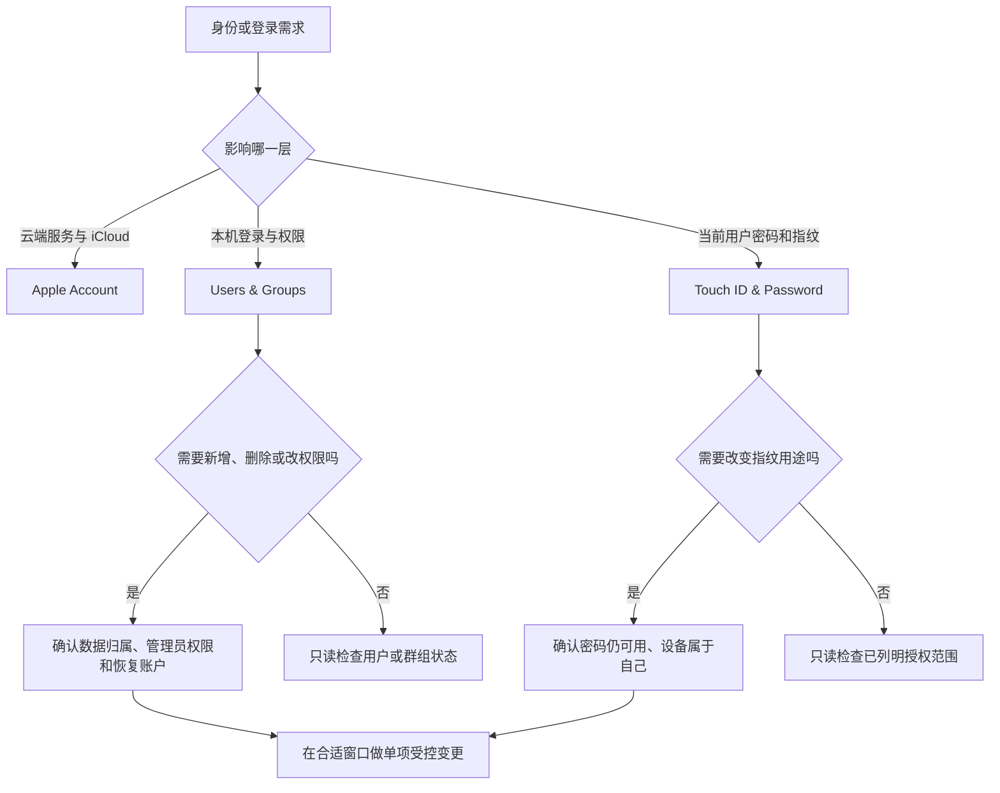

# 管理用户与群组：Touch ID、密码与登录选项

Apple Account 管理云端账户身份；Users & Groups 管理这台 Mac 上谁能登录、属于什么权限组；Touch ID & Password 管理当前本机用户的密码与指纹解锁范围。三者都带有 account、sign in、password、user 等词，却不能互换操作。删除本机用户不会自动删除 Apple Account，改变 Apple Account 密码不等于修改本机登录用户，添加指纹也不等于新建一个账户。先分清“哪台设备、哪一个本机用户、哪一类凭据”，才能避免扩大影响。

> [!warning] 本机用户与生物识别设置不可用于练习试错
>
> 添加或删除用户、群组、指纹，修改密码，启用自动登录或设置网络账户服务器，都可能影响登录权、文件访问、加密资料和组织管理。本文不展示真实用户名、组名、指纹标签、密码、网络服务器或设备信息；不执行 Add User、Add Group、Change、Add Fingerprint、Remove Fingerprint 或自动登录变更。仅学习界面原文、判断顺序和恢复方法。

## 学习目标

本篇完成后，你能解释 Apple Account 与 macOS 本机用户的区别，读懂 Users、Groups、Guest User、Automatically log in as 和 network account server，理解 Touch ID 能用于哪些已明确列出的任务，区分密码、指纹、自动填充和快速用户切换，并能通过两组只读案例审查当前配置而不改变任何真实用户或凭据。

## 三类身份与凭据的边界

| 概念 | 所在页面 | 它回答的问题 | 不应误解为 |
| --- | --- | --- | --- |
| `Apple Account` | Apple Account。 | 云端服务、购买、iCloud 和账户恢复。 | 本机所有用户的登录密码。 |
| `User` | Users & Groups。 | 谁可以登录这台 Mac，拥有什么本机资料和权限。 | 一条联系人记录。 |
| `Group` | Users & Groups。 | 多个用户或系统服务共享的权限集合。 | 家人共享组。 |
| `Password` | Touch ID & Password。 | 当前本机用户的登录凭据。 | Apple Account 密码必然相同。 |
| `Touch ID` | Touch ID & Password。 | 指纹用于解锁和已列明的授权任务。 | 可取代所有密码与所有身份核验。 |
| `Automatically log in as` | Users & Groups。 | 启动或登录窗口是否自动以某用户登录。 | 安全性更高的默认选择。 |

系统安全的核心是“主体—设备—动作”。主体是谁，是这台 Mac 的本机用户还是 Apple Account；设备是当前 Mac 还是其他登录设备；动作是解锁、购买、自动填充、快速用户切换还是远程目录登录。每次进入设置前先说清三项，可以避免将云端账户、用户组和指纹授权混在同一个问题里。

## 操作路径与最小影响原则

本机用户路径是 **Apple menu → System Settings → Users & Groups**；密码与指纹路径是 **System Settings → Touch ID & Password**。在 Users & Groups 中，`Users` 和 `Groups` 是分开的层级；`Guest User` 是客人账户状态；`Add User…` 与 `Add Group…` 会开始创建流程；`Automatically log in as` 控制自动登录行为。Touch ID 页面则显示 Password、Touch ID、Add Fingerprint 和每项指纹用途开关。

学习时使用只读访问：观察标题、说明句和状态词，不点击创建、删除、改密或登记指纹。若真实工作需要变更，先确认当前用户有管理员权限、重要资料已妥善保存、至少有一个可用登录和恢复路径，并为操作留出不会打断他人的时间窗口。

> [!tip] 最小影响不是“不做任何管理”
>
> 最小影响是让变化只覆盖必要对象。例如需要停止某人使用这台 Mac 时，先确认其本机数据、管理员角色和交接方式；需要关闭某项指纹用途时，先只关闭该用途，而不是删除全部指纹或更改账户密码。

## 界面实例：Users & Groups 管理的是本机主体

> 本机截图未包含在公开版本中，以保护原图中的个人信息。

本机页面会显示真实用户、群组和网络服务名称，这些都是个人或环境数据，不写入讲义。下表保留稳定页面表达和它们的真实含义。

| 完整界面表达 | 软件语境中文 | 操作前的关键判断 |
| --- | --- | --- |
| `Users` | 用户。 | 本机可登录主体的列表。 |
| `Groups` | 群组。 | 本机权限或服务相关的用户集合。 |
| `Guest User` | 访客用户。 | 来宾登录是否可用，范围由系统与当前配置决定。 |
| `Off` | 关闭。 | 当前未启用，不代表应该打开。 |
| `Add User…` | 添加用户。 | 新用户的角色、资料与登录方式是否已规划。 |
| `Add Group…` | 添加群组。 | 是否确有权限或管理需求。 |
| `Automatically log in as` | 自动以某用户登录。 | 启动后是否跳过常规登录验证。 |
| `Edit…` | 编辑。 | 打开网络账户服务器等进一步配置。 |
| `Show Detail` | 显示详情。 | 进入单个用户或群组的详细设置。 |

`Guest User Off` 应读成“访客用户当前关闭”，而不是“这个用户已被删除”。`Automatically log in as` 的值为 off 表示系统当前不自动以某用户登录；自动登录减少了每次输入密码的摩擦，却也可能在设备被他人接触时扩大本机数据暴露，因此不应为了方便随手开启。

### 本页全部单词

| 单词 | 音标 | 词性 | 本页含义 | 所在完整表达 |
| --- | --- | --- | --- | --- |
| users | /ˈjuːzərz/ | n.复数 | 用户。 | `Users` |
| groups | /ɡruːps/ | n.复数 | 群组。 | `Groups` |
| guest | /ɡest/ | n. | 访客。 | `Guest User` |
| add | /æd/ | v. | 添加。 | `Add User` |
| automatically | /ˌɔːtəˈmætɪkli/ | adv. | 自动地。 | `Automatically log in` |
| log | /lɔːɡ/ | v. | 登录。 | `log in` |
| in | /ɪn/ | adv. | 进入登录状态。 | `log in` |
| as | /æz/ | prep. | 作为、以……身份。 | `log in as` |
| edit | /ˈedɪt/ | v. | 编辑。 | `Edit` |
| detail | /ˈdiːteɪl/ | n. | 详情。 | `Show Detail` |
| off | /ɔːf/ | adj./adv. | 关闭。 | `Guest User Off` |

## 用户、群组与网络账户服务器的不同角色

用户通常拥有自己的主目录、登录会话和本机偏好；群组用于组织权限和服务关系；网络账户服务器则可能接入组织目录中的身份资料。`Edit…` 出现在自动登录附近并不表示它修改当前用户的名字，它可能进入网络账户服务器相关配置。没有组织管理员提供的服务器、目录、证书与认证资料时，不应配置网络账户服务。

| 对象 | 典型作用 | 真实变更前需要确认 |
| --- | --- | --- |
| 本机用户 | 登录、桌面、文件和权限。 | 资料归属、管理员角色、密码和迁移安排。 |
| 访客用户 | 临时、受限的本机访问。 | 本机策略、数据保留和安全需求。 |
| 本机群组 | 权限或系统服务集合。 | 成员关系和所影响资源。 |
| 网络账户服务器 | 组织目录或集中身份来源。 | 官方地址、认证方法、TLS、管理员政策。 |
| 自动登录 | 启动后自动进入某个用户。 | 物理访问风险、磁盘保护和使用场景。 |

> [!warning] 不要用自动登录解决忘记密码
>
> 自动登录改变的是每次启动或登录时是否要求身份验证，不是合法的密码恢复方案。忘记本机密码时，应使用当前系统提供、受授权的恢复流程或管理员支持；不要通过开启自动登录、共用账户或删除用户绕过账户保护。

### 案例一：只读审查谁能够使用这台 Mac

**情境**：你接手一台 Mac，想知道它有哪些本机用户、是否有访客入口、是否启用自动登录，但不打算改动任何账户。

1. 打开 **System Settings → Users & Groups**，只读查看 Users、Groups 和 Guest User 的状态。
2. 不记录用户名称、群组名称或网络服务器资料；只用抽象笔记记录“有本机用户”“访客状态为 on/off”“自动登录为 on/off”。
3. 阅读 `Automatically log in as` 的当前值，理解它影响登录验证流程而不是 Apple Account。
4. 遇到不认识的群组或网络账户入口时，使用 Help 或组织管理员资料解释用途，不删除或修改。
5. 用英语描述：`I reviewed the local users and login options without changing any accounts. I treated automatic login as a physical access decision, not a password recovery method.`

## 界面实例：Touch ID 是多个用途的可选授权方式

> 本机截图未包含在公开版本中，以保护原图中的个人信息。

页面先显示 `Password` 与 `A login password has been set for this user.`，再显示 Touch ID 的说明和用途开关。截图中的指纹标签属于个人生物识别资料，不进入正文或词表。Touch ID 说明写道：`Touch ID lets you use your fingerprint to unlock your Mac and make purchases with Apple Pay, iTunes Store, App Store, and Apple Books.` 这列出了指纹可用的若干用途，并没有说指纹在所有安全场景都可取代密码。

| 完整界面表达 | 软件语境中文 | 含义与边界 |
| --- | --- | --- |
| `A login password has been set for this user.` | 已为此用户设置登录密码。 | 当前本机用户仍有密码凭据。 |
| `Change…` | 更改。 | 打开密码变更流程，不应为练习点击。 |
| `Touch ID lets you use your fingerprint to unlock your Mac` | Touch ID 允许你用指纹解锁 Mac。 | 指纹可用于本机解锁。 |
| `make purchases with Apple Pay, iTunes Store, App Store, and Apple Books` | 使用 Apple Pay、iTunes Store、App Store 与 Apple Books 购买。 | 指纹用途可按项目管理。 |
| `Add Fingerprint` | 添加指纹。 | 登记新的指纹资料。 |
| `Remove Fingerprint` | 移除指纹。 | 删除指定指纹资料，影响该指纹的可用性。 |
| `Use Touch ID to unlock your Mac` | 用 Touch ID 解锁 Mac。 | 解锁用途的单独开关。 |
| `Use Touch ID for Apple Pay` | 用 Touch ID 进行 Apple Pay。 | 支付用途的单独开关。 |
| `Use Touch ID for autofilling passwords` | 用 Touch ID 自动填充密码。 | 自动填充用途的单独开关。 |
| `Use Touch ID for fast user switching` | 用 Touch ID 快速切换用户。 | 切换本机用户的单独开关。 |

`autofilling passwords` 是自动填写保存的密码，不是“自动创建密码”；`fast user switching` 是在本机用户之间快速切换，不是切换 Apple Account。每项用途都有自己的开关，意味着你可以按任务最小化授权。比如愿意用指纹解锁并不自动代表愿意用它进行购买或自动填充。

### 本页全部单词

| 单词 | 音标 | 词性 | 本页含义 | 所在完整表达 |
| --- | --- | --- | --- | --- |
| password | /ˈpæswɜːrd/ | n. | 密码。 | `login password` |
| login | /ˈlɔːɡɪn/ | n. | 登录。 | `login password` |
| fingerprint | /ˈfɪŋɡərprɪnt/ | n. | 指纹。 | `use your fingerprint` |
| unlock | /ʌnˈlɑːk/ | v. | 解锁。 | `unlock your Mac` |
| purchases | /ˈpɜːrtʃəsɪz/ | n.复数 | 购买。 | `make purchases` |
| add | /æd/ | v. | 添加。 | `Add Fingerprint` |
| remove | /rɪˈmuːv/ | v. | 移除。 | `Remove Fingerprint` |
| autofilling | /ˌɔːtoʊˈfɪlɪŋ/ | n./v-ing | 自动填充。 | `autofilling passwords` |
| fast | /fæst/ | adj. | 快速的。 | `fast user switching` |
| switching | /ˈswɪtʃɪŋ/ | n./v-ing | 切换。 | `user switching` |

> [!warning] 生物识别便利不等于更宽的授权
>
> 指纹可提高某些本机操作的便利性，但支付、自动填充和用户切换的风险与解锁不同。不要因为一个用途适合就默认打开所有用途；不要登记他人指纹；不要把指纹删除当作“重置安全”的通用动作。密码和受授权的恢复方式仍是必要边界。

### 案例二：只读检查 Touch ID 的用途范围

**情境**：你想确认 Touch ID 当前能做什么，但不想添加、移除指纹或修改密码。

1. 打开 **System Settings → Touch ID & Password**，阅读 Password 区域和 Touch ID 说明。
2. 不查看或记录指纹标签，只阅读开关名称：unlock your Mac、Apple Pay、purchases、autofilling passwords、fast user switching。
3. 将每一项归入解锁、付款、购买、凭据填写或用户切换，而不是笼统记为“用指纹登录”。
4. 如果某项用途不符合你的工作方式，先在私密环境中评估影响；真实变更前确保密码和恢复路径可用。
5. 测试时不要进行真实购买、填写真实密码或让他人尝试指纹。
6. 用英语总结：`I checked each Touch ID purpose separately. I did not assume that unlocking the Mac meant I should enable purchases or password autofill.`

## 复用的界面英语与句型

| 句型 | 含义 | 例句 |
| --- | --- | --- |
| `has been set for` | 已为……设定。 | `A login password has been set for this user.` |
| `lets you use … to …` | 允许你用……做……。 | `Touch ID lets you use a fingerprint to unlock the Mac.` |
| `Use … for …` | 将……用于……。 | `Use Touch ID for password autofill.` |
| `Automatically log in as …` | 自动以……身份登录。 | `Automatically log in as a local user.` |
| `Add / Remove + object` | 添加或移除某对象。 | `Add a user only after planning access.` |
| `without changing …` | 不改变……。 | `Review the settings without changing accounts.` |

`for` 在 `Use Touch ID for Apple Pay` 中标记用途；`to` 在 `use your fingerprint to unlock` 中标记目的。软件英语里这两个介词常决定“这是功能目的还是授权范围”。不要将 `for autofilling passwords` 读成“为了密码本身”，它表示 Touch ID 在自动填写密码这个流程中使用。

## 常见错误、风险与恢复方式

| 错误 | 为什么会有问题 | 更稳妥的做法 |
| --- | --- | --- |
| 把本机用户和 Apple Account 当成同一个账户。 | 它们管理的范围不同，改动影响也不同。 | 先确认问题属于云端服务还是本机登录。 |
| 为排查登录问题创建或删除用户。 | 可能影响本机资料、权限和使用者。 | 先只读检查用户状态与受授权恢复路径。 |
| 开启自动登录来省去密码。 | 增大设备被物理接触时的访问风险。 | 保持常规登录验证，使用合法恢复流程。 |
| 将指纹解锁与付款授权视为同一权限。 | 页面明确提供独立用途开关。 | 按解锁、购买、自动填充、切换逐项决定。 |
| 登记他人指纹或记录指纹标签。 | 会扩大设备访问主体，且涉及生物识别隐私。 | 仅由设备所有者按系统流程管理自己的指纹。 |
| 猜测网络账户服务器参数。 | 组织目录配置需要正式资料和政策。 | 联系管理员，获取受授权配置。 |

## 本篇自测

1. Apple Account 与本机 User 的主要差别是什么？
2. Groups 和 Family 为什么不应混为一谈？
3. Automatically log in as 的安全影响是什么？
4. Touch ID 的解锁、购买和自动填充为什么要分项理解？
5. `Add Fingerprint` 和 `Add User…` 分别会增加什么？
6. 没有密码时可以用自动登录作为恢复手段吗？为什么？
7. 请用英语表达：“我只查看了当前 Touch ID 的用途，没有修改指纹或密码。”

查看答案

1. Apple Account 管理云端服务与账户身份；User 管理谁可登录当前 Mac 及其本机资料和权限。
2. Groups 是本机权限或服务相关集合；Family 是 Apple 服务中的家庭共享概念。
3. 它可能跳过常规登录验证，增加设备被他人接触时的本机数据访问风险。
4. 页面将它们列为独立用途，风险和适用场景不同，不能因为解锁适合就默认授权其他用途。
5. Add Fingerprint 登记一个本机生物识别凭据；Add User 新增一个本机登录主体和相关资料、权限安排。
6. 不可以。自动登录不是合法密码恢复机制，应使用当前系统的受授权恢复流程或管理员支持。
7. `I reviewed the current Touch ID purposes without changing fingerprints or the password.`

## 版本差异与参考来源

本篇根据本机 **macOS 27.0 Beta (26A5425a)** 的 Users & Groups 与 Touch ID & Password 页面、截图和辅助功能文本写成。可见用户、群组、指纹用途、自动登录可用性和网络账户选项取决于设备、安全芯片、组织管理和系统版本。可参考 Apple 的 [Users & Groups guide](https://support.apple.com/guide/mac-help/add-or-delete-users-mchl3e281fc9/mac)、[Touch ID guide](https://support.apple.com/guide/mac-help/use-touch-id-mchl16fbf90a/mac) 与 [login options guide](https://support.apple.com/guide/mac-help/change-login-settings-mchlp1036/mac)。公开资料解释原则，本机页面仍是当前按钮与状态的依据。
