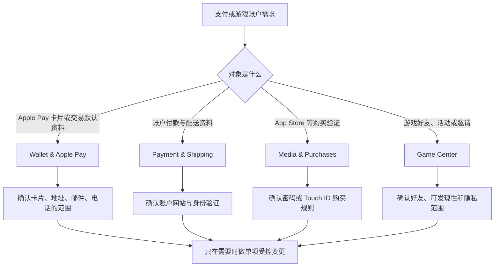

# 管理钱包、Apple Pay 与 Game Center 隐私

Wallet & Apple Pay、Payment & Shipping、Media & Purchases 和 Game Center 都会出现 card、payment、purchase、account、friends、privacy 等词，但它们处理的对象不同。Wallet 管理可用于 Apple Pay 的卡片与交易默认资料；Payment & Shipping 指向账户层的付款与配送资料；Media & Purchases 管理 App Store、Books、Music、TV 的购买验证；Game Center 管理游戏资料、好友可见性、附近邀请和使用统计标识符。把这些页面当成一个“付款设置”会导致范围判断错误。

> [!warning] 不用真实支付资料、购买或账户退出做练习
>
> 卡号、配送地址、邮箱、电话、交易记录、订阅、游戏资料和好友关系都是个人数据。本文不记录这些内容，不添加卡片、不切换购买验证、不修改付款或配送资料、不重置标识符、不邀请好友、不退出 Game Center 或媒体账户。学习仅限真实界面原文、风险判断、只读案例与恢复方式。

## 学习目标

本篇完成后，你能区分 Wallet 中的 Payment Cards、AutoFill Cards 与 Payment Details；读懂 Apple Pay 被安全设置禁用时的状态句；理解 Payment & Shipping 为何跳转账户网站；按购买验证、免费下载和 App 内购买理解 Media & Purchases；并能在 Game Center 中区分朋友列表访问、可发现性、邀请、游戏活动和隐私标识符。

## 先按“数据会去哪儿”分类

| 你要管理的事项 | 对应页面 | 数据或行为范围 | 不能混同为 |
| --- | --- | --- | --- |
| Apple Pay 使用的付款卡与默认资料 | `Wallet & Apple Pay` | 本机 Wallet、支付卡、交易默认信息。 | 网页表单的所有自动填充。 |
| Apple Account 的付款与配送资料 | `Payment & Shipping` | 账户级付款与配送信息。 | 单台 Mac 的本地卡片显示。 |
| 媒体与 App 购买验证 | `Media & Purchases` | App Store、Books、Music、TV 的购买流程。 | Apple Pay 的所有交易。 |
| 游戏资料和好友关系 | `Game Center` | 游戏 App、好友、活动和邀请。 | 通讯录或 Apple Account 全部权限。 |
| 交易或使用标识符 | Wallet / Game Center Privacy。 | 统计或服务用途的标识符。 | 账户密码或付款卡号。 |

最有用的判断句是：`Which service will receive this information or permission?` 一个地址可能用于 Apple Pay 的 transaction defaults，也可能在 Apple Account 的 Payment & Shipping 中保存；一项 Touch ID 设置可能用于购买授权，也可能不影响 Wallet 卡片；Game Center 允许 App 访问 friends list，也不代表所有联系人自动公开。先定位服务，后判断开关。

## 操作路径与安全准备

路径分别是 **System Settings → Wallet & Apple Pay**、**Apple Account → Payment & Shipping**、**Apple Account → Media & Purchases** 和 **System Settings → Game Center**。任何页面显示的卡片、地址、电话、邮箱、交易、订阅、昵称、好友、最近游戏和标识符都属于动态私人数据。使用截图学习时应只读标题、按钮和说明句；需要查看真实资料时，确保没有在投屏、录屏或旁人可见环境中。

检查一个设置前，先写清三项：它会改变谁可看见什么；它会影响哪种付款、购买或游戏行为；你如何恢复原状态。涉及 `Sign Out…`、`Reset Identifier`、`Add Card…`、`Manage…`、`Upgrade…` 或具体支付资料的按钮，先停下确认范围，不把省略号按钮当作普通导航。

> [!tip] `payment`、`purchase`、`transaction` 三个词不同
>
> Payment 是付款安排或付款资料；purchase 是一次购买行为或购买项目；transaction 是一次具体交易处理。`Transaction defaults` 指交易时默认使用的资料，不等于修改账户中所有付款信息。把这三个词分开，才能读懂 Wallet 与 Media & Purchases 的差异。

## 界面实例：Wallet 管理卡片、表单自动填充与交易默认资料

> 本机截图未包含在公开版本中，以保护原图中的个人信息。

本机页面状态可能显示 Apple Pay 是否可用、卡片数量、配送地址、邮箱、电话或订单选项；这些均为动态私人资料，以下只讲稳定的系统英语。页面包括 Payment Cards、AutoFill Cards、Payment Details 和订单、隐私说明等结构。

| 完整界面表达 | 软件语境中文 | 使用时应理解 |
| --- | --- | --- |
| `Payment Cards` | 付款卡。 | 可加入 Wallet 用于 Apple Pay 的卡片。 |
| `Add Card…` | 添加卡片。 | 启动真实卡片添加和验证流程。 |
| `AutoFill Cards` | 自动填充卡片。 | 用于网站和表单的信息自动填写。 |
| `Saved debit and credit card numbers used to autofill information on forms and websites.` | 保存的借记卡和信用卡号码用于自动填充表单和网站信息。 | 与 Apple Pay 卡片是相关但不同的资料范围。 |
| `Payment Details` | 付款详情。 | 交易中的默认付款资料。 |
| `Transaction defaults` | 交易默认值。 | Apple Pay 交易时优先使用的资料。 |
| `Shipping Address` | 配送地址。 | 交易配送信息的默认选择。 |
| `Orders from participating merchants will be automatically added to Wallet on your iPhone.` | 参与商家的订单会自动加入 iPhone 上的钱包。 | 服务和商家支持条件同时存在。 |
| `See how your data is managed…` | 查看数据如何被管理。 | 进入隐私或数据使用说明。 |

页面可能出现 `Apple Pay has been disabled because the security settings of this Mac were modified.`。这是一条状态与原因句：`has been disabled` 表示已经被禁用；`because` 给出原因为本机安全设置改变。它不表示可以随意降低安全设置来恢复 Apple Pay。正确排查顺序是确认本机安全状态、设备归属和当前官方说明，而不是关闭保护或修改未知策略。

`Choose the default payment information you want to use when making a purchase with Apple Pay. Addresses and payment options can be changed at the time of transaction.` 先说选择 Apple Pay 购买时想要使用的默认付款信息；后一句说明地址和付款选项可以在 transaction 时调整。默认值是预填选择，不是不可变承诺。`at the time of transaction` 指具体交易发生的时刻，不是“任何时候都自动更改”。

### 本页全部单词

| 单词 | 音标 | 词性 | 本页含义 | 所在完整表达 |
| --- | --- | --- | --- | --- |
| payment | /ˈpeɪmənt/ | n. | 付款。 | `Payment Cards` |
| cards | /kɑːrdz/ | n.复数 | 卡片。 | `Payment Cards` |
| add | /æd/ | v. | 添加。 | `Add Card` |
| autofill | /ˌɔːtoʊˈfɪl/ | v. | 自动填充。 | `AutoFill Cards` |
| saved | /seɪvd/ | adj. | 已保存的。 | `Saved debit` |
| debit | /ˈdebɪt/ | n. | 借记卡。 | `debit and credit` |
| credit | /ˈkredɪt/ | n. | 信用卡。 | `credit card numbers` |
| forms | /fɔːrmz/ | n.复数 | 表单。 | `forms and websites` |
| websites | /ˈwebsaɪts/ | n.复数 | 网站。 | `forms and websites` |
| transaction | /trænˈzækʃən/ | n. | 交易。 | `Transaction defaults` |
| defaults | /dɪˈfɔːlts/ | n.复数 | 默认值。 | `Transaction defaults` |
| shipping | /ˈʃɪpɪŋ/ | n. | 配送。 | `Shipping Address` |
| address | /əˈdres/ | n. | 地址。 | `Shipping Address` |
| participating | /pɑːrˈtɪsəpeɪtɪŋ/ | adj. | 参与的。 | `participating merchants` |
| merchants | /ˈmɜːrtʃənts/ | n.复数 | 商家。 | `participating merchants` |
| managed | /ˈmænɪdʒd/ | v-ed | 被管理。 | `data is managed` |

> [!warning] 付款卡与自动填充卡不能互相假定
>
> Wallet 中的 Payment Cards 与 AutoFill Cards 用途不同。前者面向 Apple Pay，后者面向网站与表单自动填写。不要因为一张卡出现在某一区域就假定它已被另一服务使用；也不要在讲义练习中添加真实卡号、CVV、地址、邮件或电话。

### 案例一：只读判断 Apple Pay 状态和资料范围

**情境**：你看到 Wallet 页面显示一个状态提示，想知道是卡片、AutoFill、交易默认资料还是 Mac 安全状态的问题。

1. 打开 **System Settings → Wallet & Apple Pay**，只阅读页面标题和状态句，不添加或移除卡片。
2. 将页面分为 Payment Cards、AutoFill Cards 和 Payment Details 三段，分别说出它们的用途。
3. 如果看到 Apple Pay disabled 状态，记录它给出的原因类别为“本机安全设置”，不立即尝试改变任何安全选项。
4. 阅读 `See how your data is managed…`，把它视为了解数据处理的入口，而不是会自动修复支付状态的按钮。
5. 用英语总结：`I separated payment cards, AutoFill cards, and transaction defaults. I did not change security settings just because Apple Pay was unavailable.`

## Payment & Shipping 与 Media & Purchases：账户资料和购买验证各有入口

> 本机截图未包含在公开版本中，以保护原图中的个人信息。

Payment & Shipping 页面说明：`To view and edit your payment and shipping information, go to account.apple.com.` 这是一条路径提示：部分账户级资料应在 Apple Account 网站中查看和编辑，而不是直接在当前 macOS 面板里完成。`view and edit` 是查看和编辑，`go to` 是前往正式网页入口。链接存在不等于应该立刻登录或修改资料；现实修改前仍需确认账户、浏览器会话、网络环境和身份验证。

> 本机截图未包含在公开版本中，以保护原图中的个人信息。

Media & Purchases 页面包含 `App Store, Books, Music, and TV`、Account、Subscriptions、`Use Touch ID for Purchases`、`Require a password for additional purchases`、`Free Downloads`、`Purchases and In-App Purchases` 和 `Sign Out…`。它管理的是媒体与 App 购买流程。即使同样出现 Touch ID，也应与 Wallet 页中的 Apple Pay 用途分开判断。

| 表达 | 中文解释 | 需要分开判断 |
| --- | --- | --- |
| `Subscriptions` | 订阅。 | 账户订阅与单次购买不是同一类型。 |
| `Use Touch ID for Purchases` | 用 Touch ID 进行购买。 | 影响媒体购买验证，不等同于 Apple Pay。 |
| `Require a password for additional purchases` | 后续购买需要密码。 | 决定购买确认节奏。 |
| `Free Downloads` | 免费下载。 | 免费项目也可能有验证要求。 |
| `Purchases and In-App Purchases` | 购买与 App 内购买。 | 付费购买与 App 内项目都在此规则范围。 |
| `Always Require` | 始终要求。 | 每次都需要确认，不表示账户有异常。 |
| `Sign Out…` | 退出登录。 | 退出媒体购买账户，影响服务和购买访问。 |

### 案例二：只读审查购买确认，而不发生交易

**情境**：你想理解为什么一次免费下载安装或 App 内购买会要求密码或 Touch ID，但不想做任何购买。

1. 打开 **Apple Account → Media & Purchases**，只读查看 `Use Touch ID for Purchases` 和 password requirement 相关表述。
2. 区分 `Free Downloads` 和 `Purchases and In-App Purchases`，确认规则可以分别出现。
3. 不点击 Manage、不更改 `Always Require`、不进行下载、购买、订阅管理或 Sign Out。
4. 用风险模型解释：购买验证设置的目标是控制确认门槛，不是评价当前账户是否安全。
5. 用英语说：`I reviewed the purchase confirmation rules without making a purchase. I treated free downloads and in-app purchases as separate settings.`

## Game Center：好友访问、可发现性和活动可见性是独立开关

> 本机截图未包含在公开版本中，以保护原图中的个人信息。

页面包含 Profile、Friends、Discoverability、Friend Requests、Game Activity 和 Privacy。昵称、邮箱、好友名单、最近游戏和标识符是个人数据，不写入本文。学习重点是 `Allow apps access to your list of Game Center friends`、`Allow your Game Center friends to identify you more easily by the email address and phone number associated with your Apple Account`、好友请求限制、游戏活动可见性、Nearby Players 和 Reset Identifier。

| 完整表达 | 软件语境中文 | 隐私边界 |
| --- | --- | --- |
| `Allow apps access to your list of Game Center friends for an improved gameplay experience.` | 允许 App 访问你的 Game Center 好友列表以改善游戏体验。 | 授予的是好友列表访问，不是所有通讯录。 |
| `Show Apps…` | 显示 App。 | 查看哪些 App 与好友列表访问有关。 |
| `Allow your Game Center friends to identify you more easily by the email address and phone number associated with your Apple Account.` | 允许 Game Center 好友通过 Apple Account 关联邮箱和号码更容易识别你。 | 涉及身份可发现性，应单独决定。 |
| `Allow only people from your contacts to send you friend requests.` | 仅允许通讯录中的人发送好友请求。 | 限制请求来源，不等同于公开全部联系人。 |
| `Allow other players to see your profile, achievement progress, leaderboard updates, and recently played games.` | 允许其他玩家查看你的资料、成就进度、排行榜更新和最近游戏。 | 活动可见范围需要按隐私偏好选择。 |
| `Allow nearby Game Center players … to invite you to a multiplayer game over Wi-Fi or Bluetooth.` | 允许附近玩家通过 Wi-Fi 或 Bluetooth 邀请多人游戏。 | 涉及邻近发现与邀请，不是普通网络共享。 |
| `Reset Identifier` | 重置标识符。 | 重置用于向 Apple 报告 Game Center 使用统计的标识符。 |

`discoverability` 是可发现性，强调别人是否更容易把某个资料识别为你；`privacy` 是隐私层面的可见范围管理；`friends only` 则是游戏活动面向好友的可见等级。它们不是一个总开关。最小公开策略是分别判断：是否让 App 访问好友列表、是否用账户联系资料帮助好友识别、谁可发送请求、谁可看游戏活动、是否允许附近邀请。

> [!warning] Reset Identifier 不等于注销或删除游戏资料
>
> 页面说明 Reset Identifier 重置的是用于报告 Game Center 使用统计的标识符。它不是退出 Game Center、删除好友、删除购买或清除所有游戏数据的通用按钮。不了解具体影响时不要点击；需要退出或移除资料时，应走对应页面的明确流程。

## 可直接背诵的英语表达

| 中文意思 | 英语表达 | 说明 |
| --- | --- | --- |
| 我只查看了付款资料的范围。 | `I reviewed the scope of the payment information only.` | `scope` 表影响范围。 |
| 这项设置会在交易时使用默认资料。 | `This setting uses default information at the time of transaction.` | 说明 transaction defaults。 |
| 我没有因为支付不可用而降低安全设置。 | `I did not reduce security settings just because payment was unavailable.` | 强调先读原因。 |
| 我把购买验证和 Apple Pay 分开检查。 | `I reviewed purchase verification separately from Apple Pay.` | 区分 Media & Purchases 和 Wallet。 |
| 我只允许必要的 App 访问好友列表。 | `I allow only necessary apps to access my friends list.` | 最小授权。 |
| 我不会在不理解影响时重置标识符。 | `I will not reset an identifier without understanding its effect.` | 重置前的安全表达。 |

## 常见错误、风险与恢复方式

| 错误 | 为什么不合适 | 更稳妥的做法 |
| --- | --- | --- |
| 将 Wallet 卡片和 AutoFill Cards 当成完全相同。 | 两者服务对象和使用流程不同。 | 分别审查 Apple Pay 与网页表单自动填充。 |
| 因 Apple Pay 被禁用而关闭安全保护。 | 状态句仅给出安全设置变动相关原因。 | 核对官方支持与设备安全状态，不降低未知保护。 |
| 在 Payment & Shipping 页面直接修改真实资料作为练习。 | 会影响账户级付款与配送资料。 | 只读理解 account.apple.com 路径。 |
| 用 Media & Purchases 设置推断 Apple Pay 授权。 | 两者购买验证范围不同。 | 分页、分服务审查 Touch ID 用途。 |
| 将 Game Center 好友访问理解为所有联系人权限。 | 页面说的是 Game Center friends list。 | 逐项检查好友列表、可发现性、活动和请求来源。 |
| 点击 Reset Identifier 试图解决游戏登录问题。 | 它只重置使用统计标识符。 | 先定位真实问题属于登录、好友、活动还是统计。 |

## 本篇自测

1. Payment Cards 与 AutoFill Cards 的主要用途差别是什么？
2. Apple Pay 被禁用的状态句为什么不能让你直接降低安全设置？
3. Transaction defaults 是什么，能否在交易时调整？
4. Payment & Shipping 与 Media & Purchases 分别管理什么？
5. Game Center 的 discoverability 和 friends list access 有何不同？
6. Reset Identifier 不代表什么？
7. 请用英语表达：“我在没有任何交易发生时查看了购买确认规则。”

查看答案

1. Payment Cards 服务 Apple Pay；AutoFill Cards 服务网站和表单信息自动填写。相关但不应互相假定。
2. 它只说明当前 Apple Pay 状态与本机安全设置变动有关，具体恢复必须遵循受信任的安全流程。
3. 它是 Apple Pay 交易的默认付款资料；页面说明地址和付款选项可在交易时更改。
4. Payment & Shipping 管理账户级付款与配送资料；Media & Purchases 管理媒体和 App 的购买账户、订阅及验证规则。
5. Discoverability 关系到好友是否更容易通过关联联系资料识别你；friends list access 是 App 能否访问你的 Game Center 好友列表。
6. 它不代表退出 Game Center、删除好友、删除购买或清除全部游戏数据。
7. `I reviewed the purchase confirmation rules without making any transaction.`

## 版本差异与参考来源

本篇根据本机 **macOS 27.0 Beta (26A5425a)** 的 Wallet & Apple Pay、Payment & Shipping、Media & Purchases 与 Game Center 页面、截图和辅助功能文本写成。可用卡片、地区服务、购买规则、Game Center 项目、好友和隐私选项会随账户、硬件、地区和系统版本变化。可参考 Apple 的 [Wallet and Apple Pay guide](https://support.apple.com/guide/mac-help/use-wallet-apple-pay-mchl4770074b/mac)、[payment and shipping guide](https://support.apple.com/guide/mac-help/change-apple-account-settings-mchlp2711/mac)、[Media & Purchases guide](https://support.apple.com/guide/mac-help/change-apple-account-settings-mchlp2711/mac) 与 [Game Center privacy guide](https://support.apple.com/guide/mac-help/change-game-center-settings-mchle2c8b5b4/mac)。公开资料解释原则，本机页面仍是实际按钮和状态的依据。
