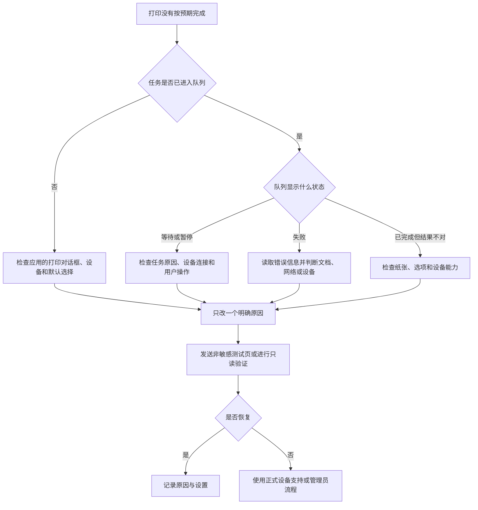

# 完成一次打印：添加打印机、查看队列、耗材和实用工具

打印问题常被说成“打印机坏了”，但 macOS 的 Printers & Scanners 页面把它拆成多层：默认打印机和默认纸张大小决定初始选择；设备详情显示设备是否可用；打印队列显示任务是否正在等待、暂停或失败；Options 影响可用功能；Supplies 处理耗材状态；Printer Utility 进入设备厂商或系统支持的维护工具。先定位是哪一层，才不会因为一份任务卡住就删除整个设备配置。

> [!warning] 不用真实打印和删除设备作为学习练习
>
> 添加、删除、共享、重置或维护打印机可能影响局域网设备、驱动、组织打印服务、正在等待的任务和其他用户。本文不记录真实打印机名称、IP、序列号、耗材数值、打印文件或队列内容；不点击 Add Printer、Remove Printer、Print、Resume、Cancel Jobs 或维护操作。只读学习页面原文、状态词、排查顺序和恢复边界。

## 学习目标

完成本篇后，你能解释 Default printer、Default paper size、Idle、Last Used、Add Printer, Scanner, or Fax…、Print Queue、Options、Supplies 和 Printer Utility 的含义；理解“设备添加”“默认选择”“打印任务”“耗材和维护”是不同层；完成两组不发送真实打印任务的安全案例；并能用英语描述队列状态与下一步排查。

## 一次打印涉及五个层级

| 层级 | 页面或表达 | 它决定什么 | 常见误解 |
| --- | --- | --- | --- |
| 默认值 | `Default printer`、`Default paper size` | 新任务初始选择的设备与纸张。 | 已经发送的任务会自动更改。 |
| 设备配置 | `Add Printer, Scanner, or Fax…`、设备详情。 | Mac 如何识别、连接和使用设备。 | 设备出现就一定能打印。 |
| 任务队列 | `Print Queue`、任务状态。 | 某个打印任务是否等待、暂停、完成或失败。 | 一个任务失败就应删除打印机。 |
| 功能与耗材 | `Options`、`Supplies`。 | 双面、颜色、装订等设备能力与耗材状态。 | 所有打印机都具有同一组选项。 |
| 维护与共享 | `Printer Utility`、共享入口。 | 设备维护或让其他设备访问。 | 每个用户都应开启共享。 |

最基本的排查句是：`Is the problem with the printer, the queue, the document, the network, or the selected options?` 先定位对象，而不是立刻重启、删除或重新添加。比如队列中一份任务暂停，不等于设备未被正确添加；纸张大小不匹配，不等于耗材不足；设备 Idle 也不保证某个网络打印任务一定会成功。

## 操作路径与安全准备

路径是 **Apple menu → System Settings → Printers & Scanners**。首页显示 Default printer、Default paper size、Printers 列表和 `Add Printer, Scanner, or Fax…`。点开已有设备可进入详情，其中可能有 Print Queue、Options、Supplies、Printer Utility 和 Remove Printer 等入口。不同驱动、设备型号、组织策略和网络环境会改变可见项目，因此不能把一张截图中的设备能力当作所有打印机的通用事实。

开始真实排查前，先确认打印文档是否含私人内容、打印机是否在你有权使用的网络中、是否有他人正在使用同一设备、是否需要组织管理员或厂商支持。学习阶段应使用只读观察或无敏感内容的测试页，不要把医疗、合同、身份证明、财务文件或私人照片作为“试试能不能打印”的材料。

> [!tip] 默认值是“新任务的起点”
>
> `Default printer` 和 `Default paper size` 指新建打印任务时的初始选择。它们不承诺每个 App 都忽略自身设置，也不会改写已进入队列的任务。排查具体文件时，仍要在应用打印对话框和队列中确认实际设备、纸张与选项。

## 界面实例：Printers & Scanners 首页读什么

> 本机截图未包含在公开版本中，以保护原图中的个人信息。

截图中的设备名称、状态和最后使用时间属于本机环境数据，本文不保留。首页的稳定学习对象是 Default printer、Default paper size、Printers、`Add Printer, Scanner, or Fax…`、Idle 和 Last Used。

| 完整界面表达 | 软件语境中文 | 应如何判断 |
| --- | --- | --- |
| `Printers & Scanners` | 打印机与扫描仪。 | 系统打印、扫描和传真设备入口。 |
| `Default printer` | 默认打印机。 | 新任务优先使用的设备选择。 |
| `Last Printer Used` | 上次使用的打印机。 | 默认策略之一，不是固定设备名称。 |
| `Default paper size` | 默认纸张大小。 | 新任务的纸张预设。 |
| `Printers` | 打印机。 | 已在本机配置的打印设备列表。 |
| `Idle` | 空闲。 | 设备当前没有处理任务；不保证所有路径无误。 |
| `Last Used` | 上次使用。 | 最近使用状态提示。 |
| `Add Printer, Scanner, or Fax…` | 添加打印机、扫描仪或传真设备。 | 启动真实发现、选择、驱动或认证流程。 |
| `Help` | 帮助。 | 当前页面官方说明入口。 |

`Idle` 和 `Last Used` 不应被翻译成“完好无故障”。Idle 只说该设备当前未忙；Last Used 只表示最近使用的记录。要描述一个真实问题，可说 `The printer is idle, but the document is still waiting in the print queue.`，这比“打印机正常”更准确。

### 本页全部单词

| 单词 | 音标 | 词性 | 本页含义 | 所在完整表达 |
| --- | --- | --- | --- | --- |
| printers | /ˈprɪntərz/ | n.复数 | 打印机。 | `Printers & Scanners` |
| scanners | /ˈskænərz/ | n.复数 | 扫描仪。 | `Printers & Scanners` |
| default | /dɪˈfɔːlt/ | adj. | 默认的。 | `Default printer` |
| printer | /ˈprɪntər/ | n. | 打印机。 | `Default printer` |
| last | /læst/ | adj. | 上一次的、最近的。 | `Last Printer Used` |
| used | /juːzd/ | v-ed | 已使用的。 | `Last Printer Used` |
| paper | /ˈpeɪpər/ | n. | 纸张。 | `paper size` |
| size | /saɪz/ | n. | 尺寸、大小。 | `Default paper size` |
| idle | /ˈaɪdəl/ | adj. | 空闲的。 | `Idle` |
| add | /æd/ | v. | 添加。 | `Add Printer` |
| fax | /fæks/ | n. | 传真。 | `Printer, Scanner, or Fax` |

## 设备详情：队列、选项、耗材和维护入口各自负责什么

> 本机截图未包含在公开版本中，以保护原图中的个人信息。

设备详情页会因厂商和驱动不同显示不同区域，但通常可以把入口分为任务层、功能层、状态层和维护层。`Print Queue` 面向任务；`Options` 面向设备可用能力；`Supplies` 面向耗材；`Printer Utility` 面向系统或厂商维护工具；`Remove Printer` 则移除本机设备配置。不要用最后一项处理前面四项的问题。

| 入口 | 中文解释 | 适用问题 | 不适合直接用于 |
| --- | --- | --- | --- |
| `Print Queue` | 打印队列。 | 查看某个任务的等待、暂停或失败状态。 | 修改耗材或驱动能力。 |
| `Options` | 选项。 | 查看双面、颜色、装订、纸盒等支持能力。 | 判断一项任务是否堵塞。 |
| `Supplies` | 耗材。 | 查看墨水、碳粉或其他耗材状态。 | 解决认证或网络错误。 |
| `Printer Utility` | 打印机实用工具。 | 进入受支持的维护、诊断或厂商功能。 | 在不知道影响时批量维护。 |
| `Remove Printer` | 移除打印机。 | 不再使用该本机配置且已确认重新添加方式。 | 临时队列问题或纸张选项问题。 |

> 本机截图未包含在公开版本中，以保护原图中的个人信息。

Options 中的功能清单来自当前设备与驱动。某台打印机支持的双面、颜色、纸盒、装订或特殊纸张，另一台可能完全没有。看到某项选项缺失时，不应先判断系统翻译错了或设备损坏；先确认模型、驱动、连接方式、组织策略和实际硬件是否支持。

> 本机截图未包含在公开版本中，以保护原图中的个人信息。

`Supplies` 一般指耗材，不只等于“墨水”。不同设备可能显示 toner、ink、paper、maintenance kit 或厂商自定义的项目。页面中的具体比例、颜色或型号是动态设备资料，不应写入讲义。耗材提示可解释一部分打印质量或停止原因，却不能替代队列、网络和纸张设置的检查。

> 本机截图未包含在公开版本中，以保护原图中的个人信息。

`Printer Utility` 不等于“修好打印机”的万能按钮。它可能打开厂商维护、清洁、校准、设备状态或网页管理界面。进入前应先看功能名称和提示，确认是否会消耗耗材、改变设备状态或影响同一网络上的其他使用者。维护操作应遵从设备厂商和组织流程。

> [!warning] 删除设备不是通用故障排查步骤
>
> `Remove Printer` 会移除这台 Mac 上的设备配置。若设备通过组织管理、专用驱动、认证或网络策略添加，重新添加可能需要管理员资料。遇到单个任务失败、纸张问题或耗材提示时，应先查看队列、选项和状态，不要把删除当作第一步。

### 案例一：只读定位“设备空闲但任务未完成”的原因层

**情境**：某人说打印机显示 Idle，但自己文档没有得到预期结果。

1. 在 **Printers & Scanners** 首页确认目标设备存在，不记录其真实名称。
2. 阅读设备状态 `Idle`，将它理解为“当前未忙”，不要据此得出“文档一定打印成功”。
3. 进入详情页，优先查看 `Print Queue` 是否有等待、暂停或失败的任务；此案例只查看，不取消或重发。
4. 若队列没有该任务，回到应用的打印对话框检查是否选了正确设备与纸张；若队列有任务，再读具体状态说明。
5. 如果任务已完成但输出不对，才进入 Options 核对双面、颜色、纸张或设备支持；若怀疑耗材，查看 Supplies。
6. 用英语说：`The printer was idle, so I checked the print queue and the document settings before changing the printer configuration.`

## 添加设备：发现、驱动和组织权限必须同时满足

`Add Printer, Scanner, or Fax…` 可能显示附近可发现设备、网络地址或手工添加选项。发现到设备并不等于你有权限使用它；选择设备也不等于系统已有正确驱动；正确驱动也不等于组织打印服务不需要认证。添加前先确认设备所有者、网络归属、官方驱动或系统支持、组织策略和是否需要扫描或传真功能。

| 添加前检查 | 为什么需要 | 不通过时的正确动作 |
| --- | --- | --- |
| 设备属于你或你受授权使用 | 防止连接、打印或扫描到他人设备。 | 联系设备所有者或组织管理员。 |
| 设备在允许的网络中 | 附近发现不等于允许访问。 | 不猜测地址或绕过网络控制。 |
| 驱动与型号匹配 | 决定选项、状态和输出能力。 | 使用厂商或管理员提供的正式资料。 |
| 认证与队列策略明确 | 组织设备可能要求账户、PIN 或安全打印。 | 查阅组织打印说明。 |
| 重新添加方式已知 | 删除或失败后才能恢复配置。 | 先保存非敏感路径说明或求助支持。 |

### 案例二：为新增打印机做无凭据的准备

**情境**：你需要在 Mac 上使用一台组织打印机，但目前只知道它在办公室里。

1. 不点击 Add Printer，先向设备管理员确认设备名称、所属网络、支持的连接方式、驱动、认证与打印策略。
2. 明确任务范围：仅打印，还是还需要扫描或传真；这影响你需要学习的页面和权限。
3. 阅读 `Add Printer, Scanner, or Fax…` 的完整名称，理解它不是自动对所有附近设备开放访问。
4. 选择安全时间进行正式配置，避免在他人有紧急打印任务或自己在处理敏感文件时尝试。
5. 配置后先用无敏感内容测试页验证设备、纸张和队列，再处理正式文件。
6. 用英语表达：`I will obtain the approved driver and connection details before adding the printer. I will test it with a non-sensitive page before printing a real document.`

## 共享打印机：分享设备不等于共享文件

> 本机截图未包含在公开版本中，以保护原图中的个人信息。

打印共享的重点是让网络上的其他设备使用本机提供的打印机服务。它不等于把你的文档共享给所有人，也不等于让每台网络打印机自动公开。启用前要确认本机是否应扮演打印主机、网络是否可信、设备是否允许共享、组织政策是否禁止，以及主机休眠、用户登录和权限变化会怎样影响其他人。

| 表达 | 软件语境中文 | 需要判断 |
| --- | --- | --- |
| `Printer Sharing` | 打印机共享。 | 是否允许其他设备经由此 Mac 使用打印机。 |
| `Share printers` | 共享打印机。 | 哪些本机设备对网络开放。 |
| `Users` | 用户。 | 谁能使用共享服务。 |
| `Allow` | 允许。 | 访问策略范围。 |
| `Network` | 网络。 | 共享可见的网络边界。 |

> [!warning] 共享先看网络和组织政策
>
> 在家庭、办公室、公共网络和受管理设备上，Printer Sharing 的风险不同。没有确认网络可信、设备归属和组织规定时，不要为方便临时开启。共享问题应由“谁能从哪里使用哪台设备”来判断，而不是只看开关是否为 on。

## 软件英语表达规律

| 句型 | 含义 | 例句 |
| --- | --- | --- |
| `Default + noun` | 某对象的默认选择。 | `The default printer is used for new print jobs.` |
| `Add + device` | 添加设备。 | `Add a printer only with approved details.` |
| `is idle` | 设备处于空闲状态。 | `The printer is idle.` |
| `is waiting in the queue` | 任务在队列中等待。 | `The document is waiting in the print queue.` |
| `check + object before + -ing` | 在做某事前检查。 | `Check the paper size before printing.` |
| `remove + configuration` | 移除配置。 | `Remove the printer only after confirming the impact.` |

`queue` 在此处是按顺序等待处理的任务列，不是实体排队的人。`print queue` 的状态通常比首页设备状态更靠近“这份文件为什么没有输出”的问题。`supplies` 是耗材集合，不是“供应商”；`utility` 是实用工具，不是“效用值”。这些词可迁移到其他软件的任务队列、设备状态和维护页面。

## 常见错误、风险与恢复方式

| 错误 | 为什么不合适 | 更稳妥的处理 |
| --- | --- | --- |
| 因任务失败立刻 Remove Printer。 | 可能丢失需要重新配置的组织设备连接。 | 先查队列、文档、网络、纸张和选项。 |
| 把 Idle 当成打印成功。 | Idle 只说明当前没有正在处理任务。 | 查看队列和实际输出结果。 |
| 用正式敏感文件测试新增设备。 | 文件可能打印到错误设备、留下队列或被他人看到。 | 先用无敏感测试页。 |
| 猜测驱动、地址或认证参数。 | 设备和组织策略可能不同。 | 使用管理员或厂商正式资料。 |
| 把 Supplies 当作所有问题的原因。 | 任务失败还可能由队列、网络、认证或选项导致。 | 先按层级排查。 |
| 为方便开启 Printer Sharing。 | 会扩大网络访问范围。 | 先确认网络、用户、设备归属和政策。 |

## 本篇自测

1. Default printer 和 Print Queue 各自解决什么问题？
2. Idle 为什么不等于打印成功？
3. Options、Supplies 和 Printer Utility 的职责有什么区别？
4. 为什么 Add Printer 之前要确认驱动、网络和认证？
5. Remove Printer 适合什么情形，不适合什么情形？
6. Printer Sharing 需要先判断哪三类边界？
7. 请用英语表达：“我先检查了队列和纸张设置，没有删除打印机。”

查看答案

1. Default printer 决定新任务的初始设备；Print Queue 显示具体任务的等待、暂停、失败或完成状态。
2. 它只说明设备当前没有忙于处理任务，不能证明某个文档已经正确输出。
3. Options 是设备能力与功能；Supplies 是耗材状态；Printer Utility 是维护或诊断入口。
4. 三者决定设备是否可被正确发现、连接、认证和使用；猜测会导致失败或安全风险。
5. 适合不再使用本机设备配置且已确认重新添加方式；不适合仅排查一个任务、纸张或耗材问题。
6. 网络可信度、谁可使用、设备是否允许共享以及组织政策。
7. `I checked the print queue and paper settings before removing anything.`

## 版本差异与参考来源

本篇基于本机 **macOS 27.0 Beta (26A5425a)** 的 Printers & Scanners、设备详情、Options、Supplies、Printer Utility 和 Printer Sharing 页面、截图及辅助功能文本。设备名称、状态、驱动、队列、耗材、共享规则和可用选项随型号、网络、组织管理和 macOS 版本变化。可参考 Apple 的 [Add a printer guide](https://support.apple.com/guide/mac-help/add-a-printer-mh14004/mac)、[Manage print jobs guide](https://support.apple.com/guide/mac-help/print-documents-mh26878/mac)、[Printer sharing guide](https://support.apple.com/guide/mac-help/share-your-printer-mchlp2257/mac) 与设备厂商文档。公开资料解释原则，当前设备配置以本机和组织正式支持资料为准。
